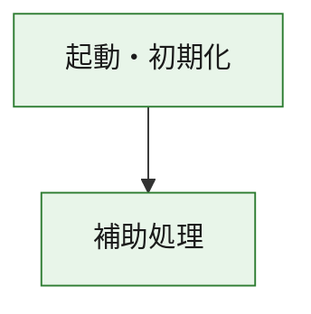
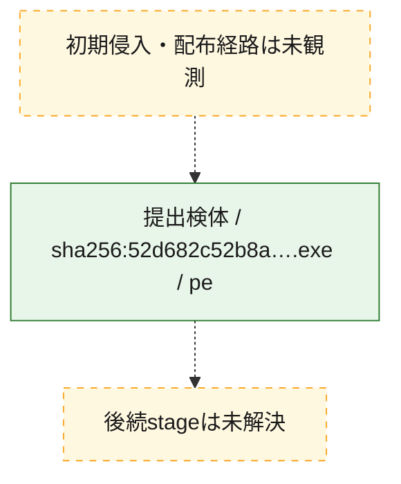
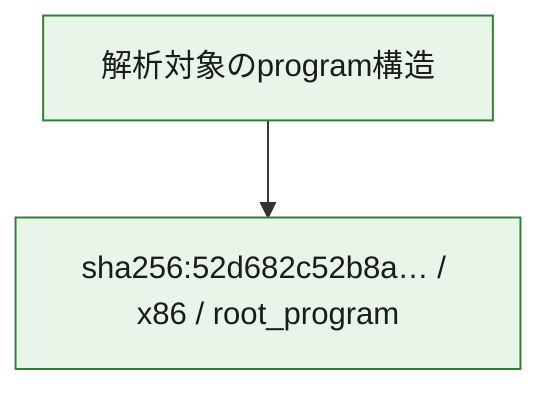

# 全体ロジック：52d682c52b8acbb14822592ead2b398f164398e72009f81524ed35469ff124d0

代表関数の静的証跡から、起動・初期化の処理群を確認しました。

## 読み方

- phaseの掲載順は解析上の整理順です。observed_call_edgesがない段階間の実行順を断定しません。
- 図の実線は静的に観測した関係、点線と黄色のノードは未観測・未解決の関係を示します。
- 図は静的な要約であり、動的実行を再現するものではありません。
- 詳細な関数解説とfingerprintは[STATIC-LOGIC.md](STATIC-LOGIC.md)を参照してください。

## 静的可視化

### 実行フロー

### 感染チェーン

### モジュール関係

## 処理段階

### 1. 起動・初期化

entry pointから初期化と後続処理への移行を確認します。
確度: `confirmed_static_function_evidence`

- `52d682c52b8acbb14822592ead2b398f164398e72009f81524ed35469ff124d0:ghidra:180001010` — 初期化と主要処理への分岐を行う入口関数です。 状態: `succeeded`、選定理由: `entry_point`, `meaningful_symbol_name`, `reviewed_call_centrality:22`, `role:entrypoint`, `small_program_complete_context`

### 2. 補助処理

主要処理を支える一般内部関数またはlibrary処理を確認します。
確度: `confirmed_static_function_evidence`

- `52d682c52b8acbb14822592ead2b398f164398e72009f81524ed35469ff124d0:ghidra:180001240` — 検体内部の一般処理を実装する関数です。 状態: `succeeded`、選定理由: `context_representative`, `reviewed_call_centrality:2`, `small_program_complete_context`
- `52d682c52b8acbb14822592ead2b398f164398e72009f81524ed35469ff124d0:ghidra:180001350` — 検体内部の一般処理を実装する関数です。 状態: `succeeded`、選定理由: `context_representative`, `reviewed_call_centrality:25`, `small_program_complete_context`
- `52d682c52b8acbb14822592ead2b398f164398e72009f81524ed35469ff124d0:ghidra:180003780` — 検体内部の一般処理を実装する関数です。 状態: `succeeded`、選定理由: `context_representative`, `reviewed_call_centrality:2`, `small_program_complete_context`
- `52d682c52b8acbb14822592ead2b398f164398e72009f81524ed35469ff124d0:ghidra:1800038e0` — 検体内部の一般処理を実装する関数です。 状態: `succeeded`、選定理由: `context_representative`, `reviewed_call_centrality:2`, `small_program_complete_context`

## 観測したcall関係

- `52d682c52b8acbb14822592ead2b398f164398e72009f81524ed35469ff124d0:ghidra:180001010` → `52d682c52b8acbb14822592ead2b398f164398e72009f81524ed35469ff124d0:ghidra:180001240` （`startup` → `support`）
- `52d682c52b8acbb14822592ead2b398f164398e72009f81524ed35469ff124d0:ghidra:180001010` → `52d682c52b8acbb14822592ead2b398f164398e72009f81524ed35469ff124d0:ghidra:180001350` （`startup` → `support`）
- `52d682c52b8acbb14822592ead2b398f164398e72009f81524ed35469ff124d0:ghidra:180001350` → `52d682c52b8acbb14822592ead2b398f164398e72009f81524ed35469ff124d0:ghidra:180001240` （`support` → `support`）
- `52d682c52b8acbb14822592ead2b398f164398e72009f81524ed35469ff124d0:ghidra:180001350` → `52d682c52b8acbb14822592ead2b398f164398e72009f81524ed35469ff124d0:ghidra:180003780` （`support` → `support`）
- `52d682c52b8acbb14822592ead2b398f164398e72009f81524ed35469ff124d0:ghidra:180001350` → `52d682c52b8acbb14822592ead2b398f164398e72009f81524ed35469ff124d0:ghidra:1800038e0` （`support` → `support`）
- `52d682c52b8acbb14822592ead2b398f164398e72009f81524ed35469ff124d0:ghidra:180003780` → `52d682c52b8acbb14822592ead2b398f164398e72009f81524ed35469ff124d0:ghidra:1800038e0` （`support` → `support`）
- `ghidra-function:2354fd4951e6f1c3e5d51aa1` → `ghidra-external:012eba31eb04a22e2ef8c47b` （`unclassified` → `unclassified`）
- `ghidra-function:2354fd4951e6f1c3e5d51aa1` → `ghidra-external:091d70367efc82abe12769bd` （`unclassified` → `unclassified`）
- `ghidra-function:2354fd4951e6f1c3e5d51aa1` → `ghidra-external:163c6c81d6a62121425e6ac5` （`unclassified` → `unclassified`）
- `ghidra-function:2354fd4951e6f1c3e5d51aa1` → `ghidra-external:2224d80bac2691f2e6c629dd` （`unclassified` → `unclassified`）
- `ghidra-function:2354fd4951e6f1c3e5d51aa1` → `ghidra-external:3ad9cc17639a5464b4b4574d` （`unclassified` → `unclassified`）
- `ghidra-function:2354fd4951e6f1c3e5d51aa1` → `ghidra-external:4541a7a7876ddb5af882074c` （`unclassified` → `unclassified`）
- `ghidra-function:2354fd4951e6f1c3e5d51aa1` → `ghidra-external:48b9facd0086c7ca9be4556e` （`unclassified` → `unclassified`）
- `ghidra-function:2354fd4951e6f1c3e5d51aa1` → `ghidra-external:579235277245ff18e7899cc6` （`unclassified` → `unclassified`）
- `ghidra-function:2354fd4951e6f1c3e5d51aa1` → `ghidra-external:6a1321a99a0a628c5100c073` （`unclassified` → `unclassified`）
- `ghidra-function:2354fd4951e6f1c3e5d51aa1` → `ghidra-external:7bb686bd6fbe475a62e64d42` （`unclassified` → `unclassified`）
- `ghidra-function:2354fd4951e6f1c3e5d51aa1` → `ghidra-external:943cbbe96659757bd075dcd6` （`unclassified` → `unclassified`）
- `ghidra-function:2354fd4951e6f1c3e5d51aa1` → `ghidra-external:b53d3e1ad1ccadb9584faa39` （`unclassified` → `unclassified`）
- `ghidra-function:2354fd4951e6f1c3e5d51aa1` → `ghidra-external:b62dfbd3ceac67ba09e0416d` （`unclassified` → `unclassified`）
- `ghidra-function:2354fd4951e6f1c3e5d51aa1` → `ghidra-external:c0861f9c9cfae03bc0108ee8` （`unclassified` → `unclassified`）
- `ghidra-function:2354fd4951e6f1c3e5d51aa1` → `ghidra-external:c3a87506544d4062b28c5111` （`unclassified` → `unclassified`）
- `ghidra-function:2354fd4951e6f1c3e5d51aa1` → `ghidra-external:c70ca8e4ba06e78d0f39143c` （`unclassified` → `unclassified`）
- `ghidra-function:2354fd4951e6f1c3e5d51aa1` → `ghidra-external:d2be52f533de828902610b53` （`unclassified` → `unclassified`）
- `ghidra-function:2354fd4951e6f1c3e5d51aa1` → `ghidra-external:e60ebac2e99346714d90ac79` （`unclassified` → `unclassified`）
- `ghidra-function:2354fd4951e6f1c3e5d51aa1` → `ghidra-external:eb5f932becb5cb85044060f8` （`unclassified` → `unclassified`）
- `ghidra-function:2354fd4951e6f1c3e5d51aa1` → `ghidra-external:f394716b92881aae6f205ca0` （`unclassified` → `unclassified`）
- `ghidra-function:2354fd4951e6f1c3e5d51aa1` → `ghidra-external:f54b9660c81de6720df1825c` （`unclassified` → `unclassified`）
- `ghidra-function:2354fd4951e6f1c3e5d51aa1` → `ghidra-function:21fcaac9e0c2cf3641858f20` （`unclassified` → `unclassified`）
- `ghidra-function:2354fd4951e6f1c3e5d51aa1` → `ghidra-function:885ad1b53d4512b562d3b573` （`unclassified` → `unclassified`）
- `ghidra-function:2354fd4951e6f1c3e5d51aa1` → `ghidra-function:9512be773a5f37dd2cf46d83` （`unclassified` → `unclassified`）
- `ghidra-function:4754047b2d9fabb66a6186f5` → `ghidra-function:2354fd4951e6f1c3e5d51aa1` （`unclassified` → `unclassified`）
- `ghidra-function:4754047b2d9fabb66a6186f5` → `ghidra-function:538ef38440b83835c5cded18` （`unclassified` → `unclassified`）
- `ghidra-function:4754047b2d9fabb66a6186f5` → `ghidra-function:5e95f44d22841a205c10b8df` （`unclassified` → `unclassified`）
- `ghidra-function:4754047b2d9fabb66a6186f5` → `ghidra-function:6156de69a6e927749deca0e1` （`unclassified` → `unclassified`）
- `ghidra-function:4754047b2d9fabb66a6186f5` → `ghidra-function:9512be773a5f37dd2cf46d83` （`unclassified` → `unclassified`）
- `ghidra-function:4754047b2d9fabb66a6186f5` → `ghidra-function:a450067836e1e6540fbc82c7` （`unclassified` → `unclassified`）
- `ghidra-function:4754047b2d9fabb66a6186f5` → `ghidra-function:b54047e80b0300c293df6289` （`unclassified` → `unclassified`）
- `ghidra-function:4754047b2d9fabb66a6186f5` → `ghidra-function:bf04b3fd8865bfcc21c6870a` （`unclassified` → `unclassified`）
- `ghidra-function:4754047b2d9fabb66a6186f5` → `ghidra-function:cf46134f1ae994bcfd9a3dc8` （`unclassified` → `unclassified`）
- `ghidra-function:4754047b2d9fabb66a6186f5` → `ghidra-function:d0789dcddf25022835bbe4d3` （`unclassified` → `unclassified`）
- `ghidra-function:4754047b2d9fabb66a6186f5` → `ghidra-function:d08ea9b5aed49a2008071c0e` （`unclassified` → `unclassified`）
- `ghidra-function:4754047b2d9fabb66a6186f5` → `ghidra-function:f7ef09498ce84fe096584b4f` （`unclassified` → `unclassified`）
- `ghidra-function:885ad1b53d4512b562d3b573` → `ghidra-function:21fcaac9e0c2cf3641858f20` （`unclassified` → `unclassified`）

## 解析範囲と制約

- 選定外関数は全体inventoryへ残しますが、関数本体の個別解説対象にはしていません。
- indirect call、難読化、packer、VM、壊れたcontrol flowによりcall関係が欠落する場合があります。
- 文書は静的解析に基づき、検体実行や外部通信による動的確認は行っていません。
