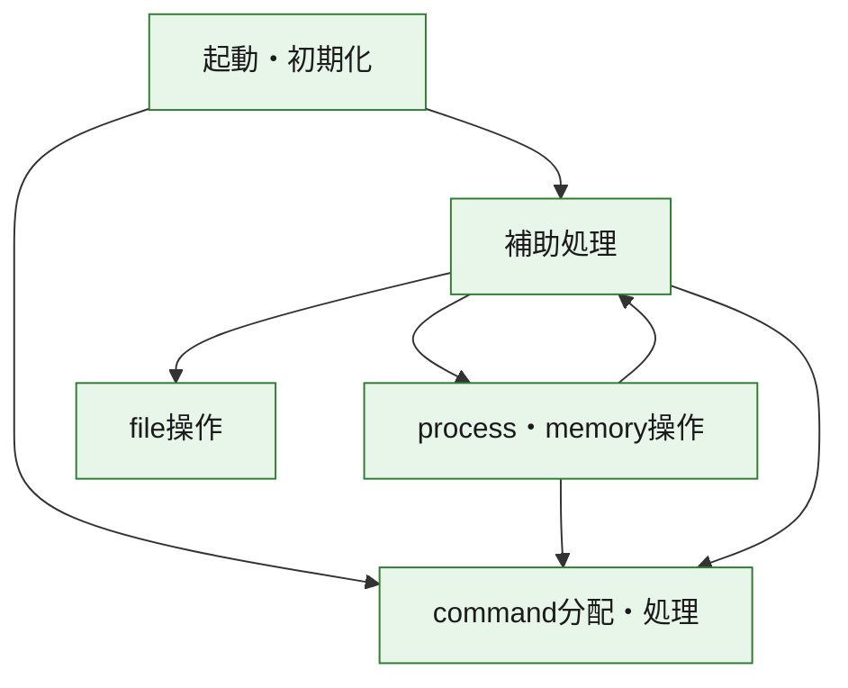
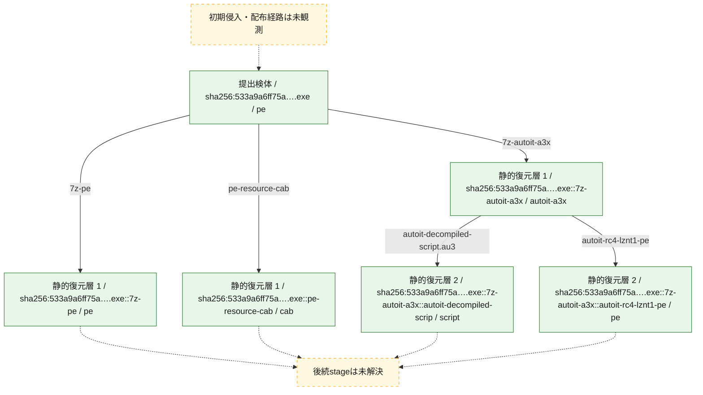
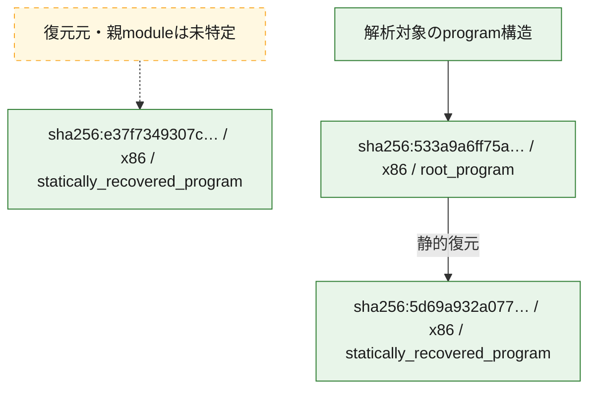

# 全体ロジック：533a9a6ff75a172b2e996391ad2dd93e615b31fd6f920e28a111f94284400440

代表関数の静的証跡から、起動・初期化、process・memory操作、command分配・処理、file操作の処理群を確認しました。

## 読み方

- phaseの掲載順は解析上の整理順です。observed_call_edgesがない段階間の実行順を断定しません。
- 図の実線は静的に観測した関係、点線と黄色のノードは未観測・未解決の関係を示します。
- 図は静的な要約であり、動的実行を再現するものではありません。
- 詳細な関数解説とfingerprintは[STATIC-LOGIC.md](STATIC-LOGIC.md)を参照してください。

## 静的可視化

### 実行フロー

### 感染チェーン

### モジュール関係

## 処理段階

### 1. 起動・初期化

entry pointから初期化と後続処理への移行を確認します。
確度: `confirmed_static_function_evidence`

- `e37f7349307c62fdc0d8d4357ed39bce62a1a574e11640a4326acd362b125859:ghidra:1400014d0` — 初期化と主要処理への分岐を行う入口関数です。 状態: `succeeded`、選定理由: `entry_point`, `meaningful_symbol_name`, `reviewed_call_centrality:1`, `role:entrypoint`
- `5d69a932a077fee044b193c28e84564143f5c7e51079ab48e88fef74ab0b77b7:ghidra:140024750` — 初期化と主要処理への分岐を行う入口関数です。 状態: `succeeded`、選定理由: `entry_point`, `meaningful_symbol_name`, `reviewed_call_centrality:22`, `role:entrypoint`
- `533a9a6ff75a172b2e996391ad2dd93e615b31fd6f920e28a111f94284400440:ghidra:1400079b0` — 初期化と主要処理への分岐を行う入口関数です。 状態: `succeeded`、選定理由: `entry_point`, `meaningful_symbol_name`, `reviewed_call_centrality:18`, `role:entrypoint`

### 2. process・memory操作

process、thread、module、memory操作と実行移行を確認します。
確度: `confirmed_static_function_evidence`

- `533a9a6ff75a172b2e996391ad2dd93e615b31fd6f920e28a111f94284400440:ghidra:1400011c0` — process、thread、module、またはmemory操作に関係する関数です。 状態: `succeeded`、選定理由: `context_representative`, `reviewed_call_centrality:13`, `role:process_or_memory_operation`
- `533a9a6ff75a172b2e996391ad2dd93e615b31fd6f920e28a111f94284400440:ghidra:140001c38` — process、thread、module、またはmemory操作に関係する関数です。 状態: `succeeded`、選定理由: `context_representative`, `reviewed_call_centrality:28`, `role:process_or_memory_operation`
- `533a9a6ff75a172b2e996391ad2dd93e615b31fd6f920e28a111f94284400440:ghidra:140002e28` — process、thread、module、またはmemory操作に関係する関数です。 状態: `succeeded`、選定理由: `context_representative`, `reviewed_call_centrality:31`, `role:process_or_memory_operation`
- `533a9a6ff75a172b2e996391ad2dd93e615b31fd6f920e28a111f94284400440:ghidra:140003720` — process、thread、module、またはmemory操作に関係する関数です。 状態: `succeeded`、選定理由: `context_representative`, `reviewed_call_centrality:22`, `role:process_or_memory_operation`

### 3. command分配・処理

受信commandやtaskの解釈、分配、個別handlerへの移行を確認します。
確度: `confirmed_static_function_evidence_with_limits`

- `5d69a932a077fee044b193c28e84564143f5c7e51079ab48e88fef74ab0b77b7:ghidra:14004afb0` — commandの解釈、分配、または個別処理を担当する関数です。 状態: `limited_bad_instruction_or_flow`、選定理由: `meaningful_symbol_name`, `reviewed_call_centrality:1`, `role:command_dispatch_or_handler`
- `533a9a6ff75a172b2e996391ad2dd93e615b31fd6f920e28a111f94284400440:ghidra:1400082d0` — commandの解釈、分配、または個別処理を担当する関数です。 状態: `limited_bad_instruction_or_flow`、選定理由: `meaningful_symbol_name`, `reviewed_call_centrality:5`, `role:command_dispatch_or_handler`

### 4. file操作

fileやdirectoryの作成、読書き、削除を確認します。
確度: `confirmed_static_function_evidence`

- `533a9a6ff75a172b2e996391ad2dd93e615b31fd6f920e28a111f94284400440:ghidra:140001f00` — fileまたはdirectoryの読書き・管理に関係する関数です。 状態: `succeeded`、選定理由: `context_representative`, `reviewed_call_centrality:19`, `role:file_operation`
- `533a9a6ff75a172b2e996391ad2dd93e615b31fd6f920e28a111f94284400440:ghidra:1400030c4` — fileまたはdirectoryの読書き・管理に関係する関数です。 状態: `succeeded`、選定理由: `context_representative`, `reviewed_call_centrality:18`, `role:file_operation`

### 5. 補助処理

主要処理を支える一般内部関数またはlibrary処理を確認します。
確度: `confirmed_static_function_evidence_with_limits`

- `e37f7349307c62fdc0d8d4357ed39bce62a1a574e11640a4326acd362b125859:ghidra:140001000` — 検体内部の一般処理を実装する関数です。 状態: `succeeded`、選定理由: `context_representative`
- `e37f7349307c62fdc0d8d4357ed39bce62a1a574e11640a4326acd362b125859:ghidra:140001010` — 検体内部の一般処理を実装する関数です。 状態: `succeeded`、選定理由: `context_representative`, `reviewed_call_centrality:6`
- `e37f7349307c62fdc0d8d4357ed39bce62a1a574e11640a4326acd362b125859:ghidra:140001130` — 検体内部の一般処理を実装する関数です。 状態: `succeeded`、選定理由: `context_representative`, `reviewed_call_centrality:1`
- `e37f7349307c62fdc0d8d4357ed39bce62a1a574e11640a4326acd362b125859:ghidra:140001180` — 検体内部の一般処理を実装する関数です。 状態: `succeeded`、選定理由: `context_representative`, `reviewed_call_centrality:23`
- `e37f7349307c62fdc0d8d4357ed39bce62a1a574e11640a4326acd362b125859:ghidra:1400014f0` — 検体内部の一般処理を実装する関数です。 状態: `succeeded`、選定理由: `context_representative`, `reviewed_call_centrality:1`
- `e37f7349307c62fdc0d8d4357ed39bce62a1a574e11640a4326acd362b125859:ghidra:140001510` — 検体内部の一般処理を実装する関数です。 状態: `succeeded`、選定理由: `context_representative`, `reviewed_call_centrality:1`
- `e37f7349307c62fdc0d8d4357ed39bce62a1a574e11640a4326acd362b125859:ghidra:140001530` — 検体内部の一般処理を実装する関数です。 状態: `succeeded`、選定理由: `context_representative`, `reviewed_call_centrality:1`
- `e37f7349307c62fdc0d8d4357ed39bce62a1a574e11640a4326acd362b125859:ghidra:140001540` — 検体内部の一般処理を実装する関数です。 状態: `succeeded`、選定理由: `context_representative`
- `e37f7349307c62fdc0d8d4357ed39bce62a1a574e11640a4326acd362b125859:ghidra:140001550` — 検体内部の一般処理を実装する関数です。 状態: `succeeded`、選定理由: `context_representative`, `reviewed_call_centrality:2`
- `e37f7349307c62fdc0d8d4357ed39bce62a1a574e11640a4326acd362b125859:ghidra:140001560` — 検体内部の一般処理を実装する関数です。 状態: `succeeded`、選定理由: `context_representative`, `reviewed_call_centrality:1`
- `e37f7349307c62fdc0d8d4357ed39bce62a1a574e11640a4326acd362b125859:ghidra:140001580` — 検体内部の一般処理を実装する関数です。 状態: `succeeded`、選定理由: `context_representative`, `reviewed_call_centrality:38`
- `e37f7349307c62fdc0d8d4357ed39bce62a1a574e11640a4326acd362b125859:ghidra:140001b30` — 検体内部の一般処理を実装する関数です。 状態: `succeeded`、選定理由: `context_representative`, `reviewed_call_centrality:37`
- `e37f7349307c62fdc0d8d4357ed39bce62a1a574e11640a4326acd362b125859:ghidra:140001b40` — 検体内部の一般処理を実装する関数です。 状態: `succeeded`、選定理由: `context_representative`, `reviewed_call_centrality:2`
- `e37f7349307c62fdc0d8d4357ed39bce62a1a574e11640a4326acd362b125859:ghidra:140001cc0` — 検体内部の一般処理を実装する関数です。 状態: `succeeded`、選定理由: `context_representative`, `reviewed_call_centrality:5`
- `e37f7349307c62fdc0d8d4357ed39bce62a1a574e11640a4326acd362b125859:ghidra:140001e30` — 検体内部の一般処理を実装する関数です。 状態: `succeeded`、選定理由: `context_representative`, `reviewed_call_centrality:3`
- `e37f7349307c62fdc0d8d4357ed39bce62a1a574e11640a4326acd362b125859:ghidra:140002160` — 検体内部の一般処理を実装する関数です。 状態: `succeeded`、選定理由: `context_representative`, `reviewed_call_centrality:3`
- `e37f7349307c62fdc0d8d4357ed39bce62a1a574e11640a4326acd362b125859:ghidra:140002510` — 検体内部の一般処理を実装する関数です。 状態: `succeeded`、選定理由: `context_representative`, `reviewed_call_centrality:9`
- `e37f7349307c62fdc0d8d4357ed39bce62a1a574e11640a4326acd362b125859:ghidra:1400026a0` — 検体内部の一般処理を実装する関数です。 状態: `succeeded`、選定理由: `context_representative`, `reviewed_call_centrality:2`
- `e37f7349307c62fdc0d8d4357ed39bce62a1a574e11640a4326acd362b125859:ghidra:140002700` — 検体内部の一般処理を実装する関数です。 状態: `succeeded`、選定理由: `context_representative`, `reviewed_call_centrality:2`
- `e37f7349307c62fdc0d8d4357ed39bce62a1a574e11640a4326acd362b125859:ghidra:1400027a0` — 検体内部の一般処理を実装する関数です。 状態: `succeeded`、選定理由: `context_representative`, `reviewed_call_centrality:2`
- `e37f7349307c62fdc0d8d4357ed39bce62a1a574e11640a4326acd362b125859:ghidra:140002890` — 検体内部の一般処理を実装する関数です。 状態: `succeeded`、選定理由: `context_representative`, `reviewed_call_centrality:1`
- `e37f7349307c62fdc0d8d4357ed39bce62a1a574e11640a4326acd362b125859:ghidra:1400028e0` — 検体内部の一般処理を実装する関数です。 状態: `succeeded`、選定理由: `context_representative`, `reviewed_call_centrality:1`
- `e37f7349307c62fdc0d8d4357ed39bce62a1a574e11640a4326acd362b125859:ghidra:1400029b0` — 検体内部の一般処理を実装する関数です。 状態: `succeeded`、選定理由: `context_representative`, `reviewed_call_centrality:2`
- `e37f7349307c62fdc0d8d4357ed39bce62a1a574e11640a4326acd362b125859:ghidra:1400029d0` — 検体内部の一般処理を実装する関数です。 状態: `succeeded`、選定理由: `context_representative`, `reviewed_call_centrality:4`
- `e37f7349307c62fdc0d8d4357ed39bce62a1a574e11640a4326acd362b125859:ghidra:140002be0` — 検体内部の一般処理を実装する関数です。 状態: `succeeded`、選定理由: `context_representative`, `reviewed_call_centrality:5`
- `e37f7349307c62fdc0d8d4357ed39bce62a1a574e11640a4326acd362b125859:ghidra:140002d70` — 検体内部の一般処理を実装する関数です。 状態: `succeeded`、選定理由: `context_representative`, `reviewed_call_centrality:3`
- `e37f7349307c62fdc0d8d4357ed39bce62a1a574e11640a4326acd362b125859:ghidra:140003020` — 検体内部の一般処理を実装する関数です。 状態: `succeeded`、選定理由: `context_representative`, `reviewed_call_centrality:4`
- `e37f7349307c62fdc0d8d4357ed39bce62a1a574e11640a4326acd362b125859:ghidra:140003190` — 検体内部の一般処理を実装する関数です。 状態: `succeeded`、選定理由: `context_representative`, `reviewed_call_centrality:2`
- `e37f7349307c62fdc0d8d4357ed39bce62a1a574e11640a4326acd362b125859:ghidra:140003600` — 検体内部の一般処理を実装する関数です。 状態: `succeeded`、選定理由: `context_representative`, `reviewed_call_centrality:4`
- `e37f7349307c62fdc0d8d4357ed39bce62a1a574e11640a4326acd362b125859:ghidra:14001a0b0` — compiler生成処理または汎用library処理とみられる関数です。 状態: `succeeded`、選定理由: `entry_point`, `meaningful_symbol_name`, `reviewed_call_centrality:1`
- `e37f7349307c62fdc0d8d4357ed39bce62a1a574e11640a4326acd362b125859:ghidra:14001a0e0` — compiler生成処理または汎用library処理とみられる関数です。 状態: `succeeded`、選定理由: `entry_point`, `meaningful_symbol_name`, `reviewed_call_centrality:3`
- `5d69a932a077fee044b193c28e84564143f5c7e51079ab48e88fef74ab0b77b7:ghidra:140001000` — 検体内部の一般処理を実装する関数です。 状態: `succeeded`、選定理由: `context_representative`, `reviewed_call_centrality:2`
- `5d69a932a077fee044b193c28e84564143f5c7e51079ab48e88fef74ab0b77b7:ghidra:14000102c` — 検体内部の一般処理を実装する関数です。 状態: `succeeded`、選定理由: `context_representative`, `reviewed_call_centrality:2`
- `5d69a932a077fee044b193c28e84564143f5c7e51079ab48e88fef74ab0b77b7:ghidra:140001048` — 検体内部の一般処理を実装する関数です。 状態: `succeeded`、選定理由: `context_representative`, `reviewed_call_centrality:2`
- `5d69a932a077fee044b193c28e84564143f5c7e51079ab48e88fef74ab0b77b7:ghidra:140001064` — 検体内部の一般処理を実装する関数です。 状態: `succeeded`、選定理由: `context_representative`, `reviewed_call_centrality:2`
- `5d69a932a077fee044b193c28e84564143f5c7e51079ab48e88fef74ab0b77b7:ghidra:140001080` — 検体内部の一般処理を実装する関数です。 状態: `succeeded`、選定理由: `context_representative`, `reviewed_call_centrality:2`
- `5d69a932a077fee044b193c28e84564143f5c7e51079ab48e88fef74ab0b77b7:ghidra:1400010b0` — 検体内部の一般処理を実装する関数です。 状態: `succeeded`、選定理由: `context_representative`, `reviewed_call_centrality:2`
- `5d69a932a077fee044b193c28e84564143f5c7e51079ab48e88fef74ab0b77b7:ghidra:1400010cc` — 検体内部の一般処理を実装する関数です。 状態: `succeeded`、選定理由: `context_representative`, `reviewed_call_centrality:2`
- `5d69a932a077fee044b193c28e84564143f5c7e51079ab48e88fef74ab0b77b7:ghidra:1400010e8` — 検体内部の一般処理を実装する関数です。 状態: `succeeded`、選定理由: `context_representative`, `reviewed_call_centrality:2`
- `5d69a932a077fee044b193c28e84564143f5c7e51079ab48e88fef74ab0b77b7:ghidra:140001104` — 検体内部の一般処理を実装する関数です。 状態: `succeeded`、選定理由: `context_representative`, `reviewed_call_centrality:2`
- `5d69a932a077fee044b193c28e84564143f5c7e51079ab48e88fef74ab0b77b7:ghidra:140001120` — 検体内部の一般処理を実装する関数です。 状態: `succeeded`、選定理由: `context_representative`, `reviewed_call_centrality:2`
- `5d69a932a077fee044b193c28e84564143f5c7e51079ab48e88fef74ab0b77b7:ghidra:140001140` — 検体内部の一般処理を実装する関数です。 状態: `succeeded`、選定理由: `context_representative`, `reviewed_call_centrality:9`
- `5d69a932a077fee044b193c28e84564143f5c7e51079ab48e88fef74ab0b77b7:ghidra:1400011c0` — 検体内部の一般処理を実装する関数です。 状態: `succeeded`、選定理由: `context_representative`, `reviewed_call_centrality:3`
- `5d69a932a077fee044b193c28e84564143f5c7e51079ab48e88fef74ab0b77b7:ghidra:14000120c` — 検体内部の一般処理を実装する関数です。 状態: `succeeded`、選定理由: `context_representative`, `reviewed_call_centrality:6`
- `5d69a932a077fee044b193c28e84564143f5c7e51079ab48e88fef74ab0b77b7:ghidra:140001328` — 検体内部の一般処理を実装する関数です。 状態: `succeeded`、選定理由: `context_representative`, `reviewed_call_centrality:3`
- `5d69a932a077fee044b193c28e84564143f5c7e51079ab48e88fef74ab0b77b7:ghidra:140001364` — 検体内部の一般処理を実装する関数です。 状態: `succeeded`、選定理由: `context_representative`, `reviewed_call_centrality:11`
- `5d69a932a077fee044b193c28e84564143f5c7e51079ab48e88fef74ab0b77b7:ghidra:1400014a0` — 検体内部の一般処理を実装する関数です。 状態: `limited_bad_instruction_or_flow`、選定理由: `context_representative`, `reviewed_call_centrality:4`
- `5d69a932a077fee044b193c28e84564143f5c7e51079ab48e88fef74ab0b77b7:ghidra:14000158c` — 検体内部の一般処理を実装する関数です。 状態: `succeeded`、選定理由: `context_representative`, `reviewed_call_centrality:4`
- `5d69a932a077fee044b193c28e84564143f5c7e51079ab48e88fef74ab0b77b7:ghidra:140001674` — 検体内部の一般処理を実装する関数です。 状態: `succeeded`、選定理由: `context_representative`, `reviewed_call_centrality:7`
- `5d69a932a077fee044b193c28e84564143f5c7e51079ab48e88fef74ab0b77b7:ghidra:140001750` — 検体内部の一般処理を実装する関数です。 状態: `succeeded`、選定理由: `context_representative`, `reviewed_call_centrality:4`
- `5d69a932a077fee044b193c28e84564143f5c7e51079ab48e88fef74ab0b77b7:ghidra:14000178c` — 検体内部の一般処理を実装する関数です。 状態: `succeeded`、選定理由: `context_representative`, `reviewed_call_centrality:17`
- `5d69a932a077fee044b193c28e84564143f5c7e51079ab48e88fef74ab0b77b7:ghidra:140001a18` — 検体内部の一般処理を実装する関数です。 状態: `succeeded`、選定理由: `context_representative`, `reviewed_call_centrality:3`
- `5d69a932a077fee044b193c28e84564143f5c7e51079ab48e88fef74ab0b77b7:ghidra:140001a5c` — 検体内部の一般処理を実装する関数です。 状態: `succeeded`、選定理由: `context_representative`, `reviewed_call_centrality:5`
- `5d69a932a077fee044b193c28e84564143f5c7e51079ab48e88fef74ab0b77b7:ghidra:140001b30` — 検体内部の一般処理を実装する関数です。 状態: `succeeded`、選定理由: `context_representative`, `reviewed_call_centrality:1`
- `5d69a932a077fee044b193c28e84564143f5c7e51079ab48e88fef74ab0b77b7:ghidra:140001b5c` — 検体内部の一般処理を実装する関数です。 状態: `succeeded`、選定理由: `context_representative`, `reviewed_call_centrality:3`
- `5d69a932a077fee044b193c28e84564143f5c7e51079ab48e88fef74ab0b77b7:ghidra:140001bb0` — 検体内部の一般処理を実装する関数です。 状態: `succeeded`、選定理由: `context_representative`, `reviewed_call_centrality:11`
- `5d69a932a077fee044b193c28e84564143f5c7e51079ab48e88fef74ab0b77b7:ghidra:140001bfc` — 検体内部の一般処理を実装する関数です。 状態: `succeeded`、選定理由: `context_representative`, `reviewed_call_centrality:25`
- `5d69a932a077fee044b193c28e84564143f5c7e51079ab48e88fef74ab0b77b7:ghidra:140001d9c` — 検体内部の一般処理を実装する関数です。 状態: `succeeded`、選定理由: `context_representative`, `reviewed_call_centrality:9`
- `5d69a932a077fee044b193c28e84564143f5c7e51079ab48e88fef74ab0b77b7:ghidra:140001dd0` — 検体内部の一般処理を実装する関数です。 状態: `succeeded`、選定理由: `context_representative`, `reviewed_call_centrality:5`
- `5d69a932a077fee044b193c28e84564143f5c7e51079ab48e88fef74ab0b77b7:ghidra:140001e64` — 検体内部の一般処理を実装する関数です。 状態: `succeeded`、選定理由: `context_representative`, `reviewed_call_centrality:8`
- `5d69a932a077fee044b193c28e84564143f5c7e51079ab48e88fef74ab0b77b7:ghidra:140023e1c` — 検体内部の一般処理を実装する関数です。 状態: `succeeded`、選定理由: `meaningful_symbol_name`
- `533a9a6ff75a172b2e996391ad2dd93e615b31fd6f920e28a111f94284400440:ghidra:140001144` — 検体内部の一般処理を実装する関数です。 状態: `succeeded`、選定理由: `context_representative`, `reviewed_call_centrality:6`
- `533a9a6ff75a172b2e996391ad2dd93e615b31fd6f920e28a111f94284400440:ghidra:1400012c0` — 検体内部の一般処理を実装する関数です。 状態: `succeeded`、選定理由: `context_representative`, `reviewed_call_centrality:23`
- `533a9a6ff75a172b2e996391ad2dd93e615b31fd6f920e28a111f94284400440:ghidra:140001490` — 検体内部の一般処理を実装する関数です。 状態: `succeeded`、選定理由: `context_representative`, `reviewed_call_centrality:12`
- `533a9a6ff75a172b2e996391ad2dd93e615b31fd6f920e28a111f94284400440:ghidra:14000155c` — 検体内部の一般処理を実装する関数です。 状態: `succeeded`、選定理由: `context_representative`, `reviewed_call_centrality:2`
- `533a9a6ff75a172b2e996391ad2dd93e615b31fd6f920e28a111f94284400440:ghidra:1400015f8` — 検体内部の一般処理を実装する関数です。 状態: `succeeded`、選定理由: `context_representative`, `reviewed_call_centrality:23`
- `533a9a6ff75a172b2e996391ad2dd93e615b31fd6f920e28a111f94284400440:ghidra:140001b44` — 検体内部の一般処理を実装する関数です。 状態: `succeeded`、選定理由: `context_representative`, `reviewed_call_centrality:16`
- `533a9a6ff75a172b2e996391ad2dd93e615b31fd6f920e28a111f94284400440:ghidra:1400020c0` — 検体内部の一般処理を実装する関数です。 状態: `succeeded`、選定理由: `context_representative`, `reviewed_call_centrality:13`
- `533a9a6ff75a172b2e996391ad2dd93e615b31fd6f920e28a111f94284400440:ghidra:140002174` — 検体内部の一般処理を実装する関数です。 状態: `succeeded`、選定理由: `context_representative`, `reviewed_call_centrality:11`
- `533a9a6ff75a172b2e996391ad2dd93e615b31fd6f920e28a111f94284400440:ghidra:14000229c` — 検体内部の一般処理を実装する関数です。 状態: `succeeded`、選定理由: `context_representative`, `reviewed_call_centrality:4`
- `533a9a6ff75a172b2e996391ad2dd93e615b31fd6f920e28a111f94284400440:ghidra:140002324` — 検体内部の一般処理を実装する関数です。 状態: `succeeded`、選定理由: `context_representative`, `reviewed_call_centrality:3`
- `533a9a6ff75a172b2e996391ad2dd93e615b31fd6f920e28a111f94284400440:ghidra:140002448` — 検体内部の一般処理を実装する関数です。 状態: `succeeded`、選定理由: `context_representative`, `reviewed_call_centrality:20`
- `533a9a6ff75a172b2e996391ad2dd93e615b31fd6f920e28a111f94284400440:ghidra:140002628` — 検体内部の一般処理を実装する関数です。 状態: `succeeded`、選定理由: `context_representative`, `reviewed_call_centrality:16`
- `533a9a6ff75a172b2e996391ad2dd93e615b31fd6f920e28a111f94284400440:ghidra:140002830` — 検体内部の一般処理を実装する関数です。 状態: `succeeded`、選定理由: `context_representative`, `reviewed_call_centrality:14`
- `533a9a6ff75a172b2e996391ad2dd93e615b31fd6f920e28a111f94284400440:ghidra:1400029e4` — 検体内部の一般処理を実装する関数です。 状態: `succeeded`、選定理由: `context_representative`, `reviewed_call_centrality:18`
- `533a9a6ff75a172b2e996391ad2dd93e615b31fd6f920e28a111f94284400440:ghidra:140002b24` — 検体内部の一般処理を実装する関数です。 状態: `succeeded`、選定理由: `context_representative`, `reviewed_call_centrality:27`
- `533a9a6ff75a172b2e996391ad2dd93e615b31fd6f920e28a111f94284400440:ghidra:140003260` — 検体内部の一般処理を実装する関数です。 状態: `succeeded`、選定理由: `context_representative`, `reviewed_call_centrality:2`
- `533a9a6ff75a172b2e996391ad2dd93e615b31fd6f920e28a111f94284400440:ghidra:1400032b0` — 検体内部の一般処理を実装する関数です。 状態: `succeeded`、選定理由: `context_representative`, `reviewed_call_centrality:19`
- `533a9a6ff75a172b2e996391ad2dd93e615b31fd6f920e28a111f94284400440:ghidra:1400033c0` — 検体内部の一般処理を実装する関数です。 状態: `succeeded`、選定理由: `context_representative`, `reviewed_call_centrality:29`
- `533a9a6ff75a172b2e996391ad2dd93e615b31fd6f920e28a111f94284400440:ghidra:140003680` — 検体内部の一般処理を実装する関数です。 状態: `succeeded`、選定理由: `context_representative`, `reviewed_call_centrality:11`
- `533a9a6ff75a172b2e996391ad2dd93e615b31fd6f920e28a111f94284400440:ghidra:140003908` — 検体内部の一般処理を実装する関数です。 状態: `succeeded`、選定理由: `context_representative`, `reviewed_call_centrality:7`
- `533a9a6ff75a172b2e996391ad2dd93e615b31fd6f920e28a111f94284400440:ghidra:1400039a0` — 検体内部の一般処理を実装する関数です。 状態: `succeeded`、選定理由: `context_representative`, `reviewed_call_centrality:12`
- `533a9a6ff75a172b2e996391ad2dd93e615b31fd6f920e28a111f94284400440:ghidra:140003d0c` — 検体内部の一般処理を実装する関数です。 状態: `succeeded`、選定理由: `context_representative`, `reviewed_call_centrality:13`
- `533a9a6ff75a172b2e996391ad2dd93e615b31fd6f920e28a111f94284400440:ghidra:140003e4c` — 検体内部の一般処理を実装する関数です。 状態: `succeeded`、選定理由: `context_representative`, `reviewed_call_centrality:32`
- `533a9a6ff75a172b2e996391ad2dd93e615b31fd6f920e28a111f94284400440:ghidra:140008210` — 検体内部の一般処理を実装する関数です。 状態: `succeeded`、選定理由: `meaningful_symbol_name`

## 観測したcall関係

- `533a9a6ff75a172b2e996391ad2dd93e615b31fd6f920e28a111f94284400440:ghidra:1400011c0` → `533a9a6ff75a172b2e996391ad2dd93e615b31fd6f920e28a111f94284400440:ghidra:1400082d0` （`execution` → `dispatch`）
- `533a9a6ff75a172b2e996391ad2dd93e615b31fd6f920e28a111f94284400440:ghidra:1400012c0` → `533a9a6ff75a172b2e996391ad2dd93e615b31fd6f920e28a111f94284400440:ghidra:1400011c0` （`support` → `execution`）
- `533a9a6ff75a172b2e996391ad2dd93e615b31fd6f920e28a111f94284400440:ghidra:1400015f8` → `533a9a6ff75a172b2e996391ad2dd93e615b31fd6f920e28a111f94284400440:ghidra:140001144` （`support` → `support`）
- `533a9a6ff75a172b2e996391ad2dd93e615b31fd6f920e28a111f94284400440:ghidra:1400015f8` → `533a9a6ff75a172b2e996391ad2dd93e615b31fd6f920e28a111f94284400440:ghidra:14000155c` （`support` → `support`）
- `533a9a6ff75a172b2e996391ad2dd93e615b31fd6f920e28a111f94284400440:ghidra:1400015f8` → `533a9a6ff75a172b2e996391ad2dd93e615b31fd6f920e28a111f94284400440:ghidra:140002830` （`support` → `support`）
- `533a9a6ff75a172b2e996391ad2dd93e615b31fd6f920e28a111f94284400440:ghidra:140001c38` → `533a9a6ff75a172b2e996391ad2dd93e615b31fd6f920e28a111f94284400440:ghidra:140001144` （`execution` → `support`）
- `533a9a6ff75a172b2e996391ad2dd93e615b31fd6f920e28a111f94284400440:ghidra:140002174` → `533a9a6ff75a172b2e996391ad2dd93e615b31fd6f920e28a111f94284400440:ghidra:1400020c0` （`support` → `support`）
- `533a9a6ff75a172b2e996391ad2dd93e615b31fd6f920e28a111f94284400440:ghidra:140002324` → `533a9a6ff75a172b2e996391ad2dd93e615b31fd6f920e28a111f94284400440:ghidra:140001144` （`support` → `support`）
- `533a9a6ff75a172b2e996391ad2dd93e615b31fd6f920e28a111f94284400440:ghidra:140002628` → `533a9a6ff75a172b2e996391ad2dd93e615b31fd6f920e28a111f94284400440:ghidra:140002448` （`support` → `support`）
- `533a9a6ff75a172b2e996391ad2dd93e615b31fd6f920e28a111f94284400440:ghidra:1400029e4` → `533a9a6ff75a172b2e996391ad2dd93e615b31fd6f920e28a111f94284400440:ghidra:140001b44` （`support` → `support`）
- `533a9a6ff75a172b2e996391ad2dd93e615b31fd6f920e28a111f94284400440:ghidra:1400029e4` → `533a9a6ff75a172b2e996391ad2dd93e615b31fd6f920e28a111f94284400440:ghidra:140002174` （`support` → `support`）
- `533a9a6ff75a172b2e996391ad2dd93e615b31fd6f920e28a111f94284400440:ghidra:1400029e4` → `533a9a6ff75a172b2e996391ad2dd93e615b31fd6f920e28a111f94284400440:ghidra:140002b24` （`support` → `support`）
- `533a9a6ff75a172b2e996391ad2dd93e615b31fd6f920e28a111f94284400440:ghidra:1400029e4` → `533a9a6ff75a172b2e996391ad2dd93e615b31fd6f920e28a111f94284400440:ghidra:140002e28` （`support` → `execution`）
- `533a9a6ff75a172b2e996391ad2dd93e615b31fd6f920e28a111f94284400440:ghidra:1400029e4` → `533a9a6ff75a172b2e996391ad2dd93e615b31fd6f920e28a111f94284400440:ghidra:1400030c4` （`support` → `file_activity`）
- `533a9a6ff75a172b2e996391ad2dd93e615b31fd6f920e28a111f94284400440:ghidra:1400029e4` → `533a9a6ff75a172b2e996391ad2dd93e615b31fd6f920e28a111f94284400440:ghidra:1400082d0` （`support` → `dispatch`）
- `533a9a6ff75a172b2e996391ad2dd93e615b31fd6f920e28a111f94284400440:ghidra:140002b24` → `533a9a6ff75a172b2e996391ad2dd93e615b31fd6f920e28a111f94284400440:ghidra:1400012c0` （`support` → `support`）
- `533a9a6ff75a172b2e996391ad2dd93e615b31fd6f920e28a111f94284400440:ghidra:140002b24` → `533a9a6ff75a172b2e996391ad2dd93e615b31fd6f920e28a111f94284400440:ghidra:140001f00` （`support` → `file_activity`）
- `533a9a6ff75a172b2e996391ad2dd93e615b31fd6f920e28a111f94284400440:ghidra:140002b24` → `533a9a6ff75a172b2e996391ad2dd93e615b31fd6f920e28a111f94284400440:ghidra:1400039a0` （`support` → `support`）
- `533a9a6ff75a172b2e996391ad2dd93e615b31fd6f920e28a111f94284400440:ghidra:140002e28` → `533a9a6ff75a172b2e996391ad2dd93e615b31fd6f920e28a111f94284400440:ghidra:140002174` （`execution` → `support`）
- `533a9a6ff75a172b2e996391ad2dd93e615b31fd6f920e28a111f94284400440:ghidra:140002e28` → `533a9a6ff75a172b2e996391ad2dd93e615b31fd6f920e28a111f94284400440:ghidra:140003d0c` （`execution` → `support`）
- `533a9a6ff75a172b2e996391ad2dd93e615b31fd6f920e28a111f94284400440:ghidra:140002e28` → `533a9a6ff75a172b2e996391ad2dd93e615b31fd6f920e28a111f94284400440:ghidra:140003e4c` （`execution` → `support`）
- `533a9a6ff75a172b2e996391ad2dd93e615b31fd6f920e28a111f94284400440:ghidra:140002e28` → `533a9a6ff75a172b2e996391ad2dd93e615b31fd6f920e28a111f94284400440:ghidra:1400082d0` （`execution` → `dispatch`）
- `533a9a6ff75a172b2e996391ad2dd93e615b31fd6f920e28a111f94284400440:ghidra:1400030c4` → `533a9a6ff75a172b2e996391ad2dd93e615b31fd6f920e28a111f94284400440:ghidra:140001f00` （`file_activity` → `file_activity`）
- `533a9a6ff75a172b2e996391ad2dd93e615b31fd6f920e28a111f94284400440:ghidra:140003720` → `533a9a6ff75a172b2e996391ad2dd93e615b31fd6f920e28a111f94284400440:ghidra:140003908` （`execution` → `support`）
- `533a9a6ff75a172b2e996391ad2dd93e615b31fd6f920e28a111f94284400440:ghidra:1400039a0` → `533a9a6ff75a172b2e996391ad2dd93e615b31fd6f920e28a111f94284400440:ghidra:140002628` （`support` → `support`）
- `533a9a6ff75a172b2e996391ad2dd93e615b31fd6f920e28a111f94284400440:ghidra:140003e4c` → `533a9a6ff75a172b2e996391ad2dd93e615b31fd6f920e28a111f94284400440:ghidra:140001144` （`support` → `support`）
- `533a9a6ff75a172b2e996391ad2dd93e615b31fd6f920e28a111f94284400440:ghidra:140003e4c` → `533a9a6ff75a172b2e996391ad2dd93e615b31fd6f920e28a111f94284400440:ghidra:1400015f8` （`support` → `support`）
- `533a9a6ff75a172b2e996391ad2dd93e615b31fd6f920e28a111f94284400440:ghidra:140003e4c` → `533a9a6ff75a172b2e996391ad2dd93e615b31fd6f920e28a111f94284400440:ghidra:1400082d0` （`support` → `dispatch`）
- `533a9a6ff75a172b2e996391ad2dd93e615b31fd6f920e28a111f94284400440:ghidra:1400079b0` → `533a9a6ff75a172b2e996391ad2dd93e615b31fd6f920e28a111f94284400440:ghidra:1400029e4` （`startup` → `support`）
- `533a9a6ff75a172b2e996391ad2dd93e615b31fd6f920e28a111f94284400440:ghidra:1400079b0` → `533a9a6ff75a172b2e996391ad2dd93e615b31fd6f920e28a111f94284400440:ghidra:1400082d0` （`startup` → `dispatch`）
- `5d69a932a077fee044b193c28e84564143f5c7e51079ab48e88fef74ab0b77b7:ghidra:140001080` → `5d69a932a077fee044b193c28e84564143f5c7e51079ab48e88fef74ab0b77b7:ghidra:140001bfc` （`support` → `support`）
- `5d69a932a077fee044b193c28e84564143f5c7e51079ab48e88fef74ab0b77b7:ghidra:140001140` → `5d69a932a077fee044b193c28e84564143f5c7e51079ab48e88fef74ab0b77b7:ghidra:1400011c0` （`support` → `support`）
- `5d69a932a077fee044b193c28e84564143f5c7e51079ab48e88fef74ab0b77b7:ghidra:14000120c` → `5d69a932a077fee044b193c28e84564143f5c7e51079ab48e88fef74ab0b77b7:ghidra:140001328` （`support` → `support`）
- `5d69a932a077fee044b193c28e84564143f5c7e51079ab48e88fef74ab0b77b7:ghidra:140001750` → `5d69a932a077fee044b193c28e84564143f5c7e51079ab48e88fef74ab0b77b7:ghidra:140001d9c` （`support` → `support`）
- `5d69a932a077fee044b193c28e84564143f5c7e51079ab48e88fef74ab0b77b7:ghidra:140001750` → `5d69a932a077fee044b193c28e84564143f5c7e51079ab48e88fef74ab0b77b7:ghidra:140001dd0` （`support` → `support`）
- `5d69a932a077fee044b193c28e84564143f5c7e51079ab48e88fef74ab0b77b7:ghidra:14000178c` → `5d69a932a077fee044b193c28e84564143f5c7e51079ab48e88fef74ab0b77b7:ghidra:140001750` （`support` → `support`）
- `5d69a932a077fee044b193c28e84564143f5c7e51079ab48e88fef74ab0b77b7:ghidra:14000178c` → `5d69a932a077fee044b193c28e84564143f5c7e51079ab48e88fef74ab0b77b7:ghidra:140001a18` （`support` → `support`）
- `5d69a932a077fee044b193c28e84564143f5c7e51079ab48e88fef74ab0b77b7:ghidra:140001a5c` → `5d69a932a077fee044b193c28e84564143f5c7e51079ab48e88fef74ab0b77b7:ghidra:140001b5c` （`support` → `support`）
- `5d69a932a077fee044b193c28e84564143f5c7e51079ab48e88fef74ab0b77b7:ghidra:140001a5c` → `5d69a932a077fee044b193c28e84564143f5c7e51079ab48e88fef74ab0b77b7:ghidra:140001dd0` （`support` → `support`）
- `5d69a932a077fee044b193c28e84564143f5c7e51079ab48e88fef74ab0b77b7:ghidra:140001bb0` → `5d69a932a077fee044b193c28e84564143f5c7e51079ab48e88fef74ab0b77b7:ghidra:140001a5c` （`support` → `support`）
- `5d69a932a077fee044b193c28e84564143f5c7e51079ab48e88fef74ab0b77b7:ghidra:140001bb0` → `5d69a932a077fee044b193c28e84564143f5c7e51079ab48e88fef74ab0b77b7:ghidra:140001d9c` （`support` → `support`）
- `5d69a932a077fee044b193c28e84564143f5c7e51079ab48e88fef74ab0b77b7:ghidra:140001bb0` → `5d69a932a077fee044b193c28e84564143f5c7e51079ab48e88fef74ab0b77b7:ghidra:140001dd0` （`support` → `support`）
- `5d69a932a077fee044b193c28e84564143f5c7e51079ab48e88fef74ab0b77b7:ghidra:140001bb0` → `5d69a932a077fee044b193c28e84564143f5c7e51079ab48e88fef74ab0b77b7:ghidra:140001e64` （`support` → `support`）
- `5d69a932a077fee044b193c28e84564143f5c7e51079ab48e88fef74ab0b77b7:ghidra:140001bfc` → `5d69a932a077fee044b193c28e84564143f5c7e51079ab48e88fef74ab0b77b7:ghidra:140001674` （`support` → `support`）
- `5d69a932a077fee044b193c28e84564143f5c7e51079ab48e88fef74ab0b77b7:ghidra:140001d9c` → `5d69a932a077fee044b193c28e84564143f5c7e51079ab48e88fef74ab0b77b7:ghidra:140001dd0` （`support` → `support`）
- `5d69a932a077fee044b193c28e84564143f5c7e51079ab48e88fef74ab0b77b7:ghidra:140001e64` → `5d69a932a077fee044b193c28e84564143f5c7e51079ab48e88fef74ab0b77b7:ghidra:140001b5c` （`support` → `support`）
- `5d69a932a077fee044b193c28e84564143f5c7e51079ab48e88fef74ab0b77b7:ghidra:140024750` → `5d69a932a077fee044b193c28e84564143f5c7e51079ab48e88fef74ab0b77b7:ghidra:140001140` （`startup` → `support`）
- `5d69a932a077fee044b193c28e84564143f5c7e51079ab48e88fef74ab0b77b7:ghidra:140024750` → `5d69a932a077fee044b193c28e84564143f5c7e51079ab48e88fef74ab0b77b7:ghidra:14004afb0` （`startup` → `dispatch`）
- `e37f7349307c62fdc0d8d4357ed39bce62a1a574e11640a4326acd362b125859:ghidra:140001180` → `e37f7349307c62fdc0d8d4357ed39bce62a1a574e11640a4326acd362b125859:ghidra:140001580` （`support` → `support`）
- `e37f7349307c62fdc0d8d4357ed39bce62a1a574e11640a4326acd362b125859:ghidra:140001180` → `e37f7349307c62fdc0d8d4357ed39bce62a1a574e11640a4326acd362b125859:ghidra:14001a0e0` （`support` → `support`）
- `e37f7349307c62fdc0d8d4357ed39bce62a1a574e11640a4326acd362b125859:ghidra:1400014d0` → `e37f7349307c62fdc0d8d4357ed39bce62a1a574e11640a4326acd362b125859:ghidra:140001180` （`startup` → `support`）
- `e37f7349307c62fdc0d8d4357ed39bce62a1a574e11640a4326acd362b125859:ghidra:1400014f0` → `e37f7349307c62fdc0d8d4357ed39bce62a1a574e11640a4326acd362b125859:ghidra:140001180` （`support` → `support`）
- `e37f7349307c62fdc0d8d4357ed39bce62a1a574e11640a4326acd362b125859:ghidra:140001e30` → `e37f7349307c62fdc0d8d4357ed39bce62a1a574e11640a4326acd362b125859:ghidra:140001cc0` （`support` → `support`）
- `e37f7349307c62fdc0d8d4357ed39bce62a1a574e11640a4326acd362b125859:ghidra:140002510` → `e37f7349307c62fdc0d8d4357ed39bce62a1a574e11640a4326acd362b125859:ghidra:140001b40` （`support` → `support`）
- `e37f7349307c62fdc0d8d4357ed39bce62a1a574e11640a4326acd362b125859:ghidra:140002510` → `e37f7349307c62fdc0d8d4357ed39bce62a1a574e11640a4326acd362b125859:ghidra:140002160` （`support` → `support`）
- `e37f7349307c62fdc0d8d4357ed39bce62a1a574e11640a4326acd362b125859:ghidra:1400026a0` → `e37f7349307c62fdc0d8d4357ed39bce62a1a574e11640a4326acd362b125859:ghidra:140002160` （`support` → `support`）
- `e37f7349307c62fdc0d8d4357ed39bce62a1a574e11640a4326acd362b125859:ghidra:1400026a0` → `e37f7349307c62fdc0d8d4357ed39bce62a1a574e11640a4326acd362b125859:ghidra:140002510` （`support` → `support`）
- `e37f7349307c62fdc0d8d4357ed39bce62a1a574e11640a4326acd362b125859:ghidra:140002700` → `e37f7349307c62fdc0d8d4357ed39bce62a1a574e11640a4326acd362b125859:ghidra:140002510` （`support` → `support`）
- `e37f7349307c62fdc0d8d4357ed39bce62a1a574e11640a4326acd362b125859:ghidra:1400027a0` → `e37f7349307c62fdc0d8d4357ed39bce62a1a574e11640a4326acd362b125859:ghidra:140002510` （`support` → `support`）
- `e37f7349307c62fdc0d8d4357ed39bce62a1a574e11640a4326acd362b125859:ghidra:140002890` → `e37f7349307c62fdc0d8d4357ed39bce62a1a574e11640a4326acd362b125859:ghidra:140002510` （`support` → `support`）
- `e37f7349307c62fdc0d8d4357ed39bce62a1a574e11640a4326acd362b125859:ghidra:1400028e0` → `e37f7349307c62fdc0d8d4357ed39bce62a1a574e11640a4326acd362b125859:ghidra:140001b40` （`support` → `support`）
- `e37f7349307c62fdc0d8d4357ed39bce62a1a574e11640a4326acd362b125859:ghidra:1400029b0` → `e37f7349307c62fdc0d8d4357ed39bce62a1a574e11640a4326acd362b125859:ghidra:140001cc0` （`support` → `support`）
- `e37f7349307c62fdc0d8d4357ed39bce62a1a574e11640a4326acd362b125859:ghidra:1400029d0` → `e37f7349307c62fdc0d8d4357ed39bce62a1a574e11640a4326acd362b125859:ghidra:140001e30` （`support` → `support`）
- `e37f7349307c62fdc0d8d4357ed39bce62a1a574e11640a4326acd362b125859:ghidra:140003190` → `e37f7349307c62fdc0d8d4357ed39bce62a1a574e11640a4326acd362b125859:ghidra:140003020` （`support` → `support`）
- `ghidra-function:02ca1f70c343f5b3e1d5dd64` → `ghidra-external:b975cb55ef9ef22c45b21467` （`unclassified` → `unclassified`）
- `ghidra-function:04595c6c67b740d089b0132d` → `ghidra-external:1067704c6313707c074d34af` （`unclassified` → `unclassified`）
- `ghidra-function:04595c6c67b740d089b0132d` → `ghidra-external:3bcff3902e67e34a9a93261e` （`unclassified` → `unclassified`）
- `ghidra-function:04595c6c67b740d089b0132d` → `ghidra-external:4e84593a4d9946d7d1afe5a5` （`unclassified` → `unclassified`）
- `ghidra-function:04595c6c67b740d089b0132d` → `ghidra-external:5849755480f21810fb3820b5` （`unclassified` → `unclassified`）
- `ghidra-function:04595c6c67b740d089b0132d` → `ghidra-external:cf3658c9ef89071c8808ea6e` （`unclassified` → `unclassified`）
- `ghidra-function:04595c6c67b740d089b0132d` → `ghidra-external:e1a2de6049b6cc8f650f6351` （`unclassified` → `unclassified`）
- `ghidra-function:04595c6c67b740d089b0132d` → `ghidra-function:0e421f31872ff6d1895e588d` （`unclassified` → `unclassified`）
- `ghidra-function:04595c6c67b740d089b0132d` → `ghidra-function:1462f141916bcfa8664f9b7b` （`unclassified` → `unclassified`）
- `ghidra-function:04595c6c67b740d089b0132d` → `ghidra-function:2195184621a8dc39ab4831b2` （`unclassified` → `unclassified`）
- `ghidra-function:04595c6c67b740d089b0132d` → `ghidra-function:35820ead9412843063c3c132` （`unclassified` → `unclassified`）
- `ghidra-function:04595c6c67b740d089b0132d` → `ghidra-function:38fb22a4889d083f5b54e0a9` （`unclassified` → `unclassified`）
- `ghidra-function:04595c6c67b740d089b0132d` → `ghidra-function:3bd1e58df31674d974053e0a` （`unclassified` → `unclassified`）
- `ghidra-function:04595c6c67b740d089b0132d` → `ghidra-function:40ec7392a01f1f1eaeb7dfa8` （`unclassified` → `unclassified`）
- `ghidra-function:04595c6c67b740d089b0132d` → `ghidra-function:51de6f09f000e964b6b814a7` （`unclassified` → `unclassified`）
- `ghidra-function:04595c6c67b740d089b0132d` → `ghidra-function:51dfdd42089d440a9f390f2e` （`unclassified` → `unclassified`）
- `ghidra-function:04595c6c67b740d089b0132d` → `ghidra-function:51e5475876aba37103d31288` （`unclassified` → `unclassified`）
- `ghidra-function:04595c6c67b740d089b0132d` → `ghidra-function:586f20479aa94c2a928ece75` （`unclassified` → `unclassified`）
- `ghidra-function:04595c6c67b740d089b0132d` → `ghidra-function:5fb387f7cd28ebed2638743b` （`unclassified` → `unclassified`）
- `ghidra-function:04595c6c67b740d089b0132d` → `ghidra-function:6ee85f8f90acbabf2c4bca1c` （`unclassified` → `unclassified`）
- `ghidra-function:04595c6c67b740d089b0132d` → `ghidra-function:71ed313a93366b18c9622537` （`unclassified` → `unclassified`）
- `ghidra-function:04595c6c67b740d089b0132d` → `ghidra-function:7992defc1db3de2acee3f39b` （`unclassified` → `unclassified`）
- `ghidra-function:04595c6c67b740d089b0132d` → `ghidra-function:86945d90606cf85131e16aa5` （`unclassified` → `unclassified`）
- `ghidra-function:04595c6c67b740d089b0132d` → `ghidra-function:9076d518707516f004c1c44a` （`unclassified` → `unclassified`）
- `ghidra-function:04595c6c67b740d089b0132d` → `ghidra-function:964229cc853f3e4e527de705` （`unclassified` → `unclassified`）
- `ghidra-function:04595c6c67b740d089b0132d` → `ghidra-function:b351335d5a7b05c08a2ee549` （`unclassified` → `unclassified`）
- `ghidra-function:04595c6c67b740d089b0132d` → `ghidra-function:b91927cda24dc7a2db0404dc` （`unclassified` → `unclassified`）
- `ghidra-function:04595c6c67b740d089b0132d` → `ghidra-function:cd94b6f4b11db0a3b2d0bbd2` （`unclassified` → `unclassified`）
- `ghidra-function:04595c6c67b740d089b0132d` → `ghidra-function:da534d7363c25ae229638f05` （`unclassified` → `unclassified`）
- `ghidra-function:04595c6c67b740d089b0132d` → `ghidra-function:eab092d15b5bb24ff185de65` （`unclassified` → `unclassified`）
- `ghidra-function:04595c6c67b740d089b0132d` → `ghidra-function:f7429bf63fba72246a46a3d1` （`unclassified` → `unclassified`）
- `ghidra-function:04595c6c67b740d089b0132d` → `ghidra-function:f8c8544b6e0349f3e1a59c2f` （`unclassified` → `unclassified`）
- `ghidra-function:04595c6c67b740d089b0132d` → `ghidra-function:fd89ba27b63eccca4e8e661e` （`unclassified` → `unclassified`）
- `ghidra-function:0710d69267a03e65f13112d6` → `ghidra-external:bc8521b5810e630a7d72311f` （`unclassified` → `unclassified`）
- `ghidra-function:0710d69267a03e65f13112d6` → `ghidra-function:09286fab5e04fc8b02431bc4` （`unclassified` → `unclassified`）
- `ghidra-function:082cbe67b1dc323cb043c29b` → `ghidra-function:6b8e0b949ff3aa37281c95df` （`unclassified` → `unclassified`）
- `ghidra-function:09286fab5e04fc8b02431bc4` → `ghidra-external:28cb6758eb9f401d7a776afe` （`unclassified` → `unclassified`）
- `ghidra-function:09286fab5e04fc8b02431bc4` → `ghidra-external:a45fcbbe0c9282d8a9e6ec74` （`unclassified` → `unclassified`）
- `ghidra-function:09286fab5e04fc8b02431bc4` → `ghidra-external:cf3658c9ef89071c8808ea6e` （`unclassified` → `unclassified`）
- `ghidra-function:09286fab5e04fc8b02431bc4` → `ghidra-function:d515968dba6bcef3bc99ddca` （`unclassified` → `unclassified`）
- `ghidra-function:09286fab5e04fc8b02431bc4` → `ghidra-function:e06eec85021e1c66860bb1a2` （`unclassified` → `unclassified`）
- `ghidra-function:0ad74874bb2a7dab289b82ff` → `ghidra-external:056323cb151f38c9a5dfc719` （`unclassified` → `unclassified`）
- `ghidra-function:0ad74874bb2a7dab289b82ff` → `ghidra-external:1338a4cac878898aa46b2e37` （`unclassified` → `unclassified`）
- `ghidra-function:0ad74874bb2a7dab289b82ff` → `ghidra-function:113309b169eb7eeef3c466ff` （`unclassified` → `unclassified`）
- `ghidra-function:0ad74874bb2a7dab289b82ff` → `ghidra-function:158b5c381db5445579017dab` （`unclassified` → `unclassified`）
- `ghidra-function:0ad74874bb2a7dab289b82ff` → `ghidra-function:17f610e64fcc99599638672f` （`unclassified` → `unclassified`）
- `ghidra-function:0ad74874bb2a7dab289b82ff` → `ghidra-function:18c90e7a3e39e9ae8deebdbd` （`unclassified` → `unclassified`）
- `ghidra-function:0ad74874bb2a7dab289b82ff` → `ghidra-function:26961a87a3174390aae64694` （`unclassified` → `unclassified`）
- `ghidra-function:0ad74874bb2a7dab289b82ff` → `ghidra-function:294cd70745e3f965ad38c448` （`unclassified` → `unclassified`）
- `ghidra-function:0ad74874bb2a7dab289b82ff` → `ghidra-function:43b7fe05c82fc342e470798f` （`unclassified` → `unclassified`）
- `ghidra-function:0ad74874bb2a7dab289b82ff` → `ghidra-function:495aba8535aab53ffb489d9b` （`unclassified` → `unclassified`）
- `ghidra-function:0ad74874bb2a7dab289b82ff` → `ghidra-function:500403581fae5b037f729bea` （`unclassified` → `unclassified`）
- `ghidra-function:0ad74874bb2a7dab289b82ff` → `ghidra-function:53ba99f90e0df81e649afaad` （`unclassified` → `unclassified`）
- `ghidra-function:0ad74874bb2a7dab289b82ff` → `ghidra-function:7303a6621d4792896c18eb6c` （`unclassified` → `unclassified`）
- `ghidra-function:0ad74874bb2a7dab289b82ff` → `ghidra-function:736ad168fcecd404b1614503` （`unclassified` → `unclassified`）
- `ghidra-function:0ad74874bb2a7dab289b82ff` → `ghidra-function:a50ff91ae0c9b98010763f85` （`unclassified` → `unclassified`）
- `ghidra-function:0ad74874bb2a7dab289b82ff` → `ghidra-function:ae09dcf1d0aa3038a980a427` （`unclassified` → `unclassified`）
- `ghidra-function:0ad74874bb2a7dab289b82ff` → `ghidra-function:c201d022b032f2d516fc9aa2` （`unclassified` → `unclassified`）
- `ghidra-function:0ad74874bb2a7dab289b82ff` → `ghidra-function:de79b409476caae7268e922a` （`unclassified` → `unclassified`）
- `ghidra-function:0ad74874bb2a7dab289b82ff` → `ghidra-function:eec2d7bac0216b060145572a` （`unclassified` → `unclassified`）
- `ghidra-function:0ad74874bb2a7dab289b82ff` → `ghidra-function:f50b9f09e380ac27e41c32a0` （`unclassified` → `unclassified`）
- `ghidra-function:0ad74874bb2a7dab289b82ff` → `ghidra-function:ff917be7abf625cbfd275f89` （`unclassified` → `unclassified`）
- `ghidra-function:0dc5d0d9ea8e3e83e03c137e` → `ghidra-function:ca6258a6d86da071931cc582` （`unclassified` → `unclassified`）
- `ghidra-function:0fa62f02863a3d2bae2cb69e` → `ghidra-external:1338a4cac878898aa46b2e37` （`unclassified` → `unclassified`）
- `ghidra-function:0fa62f02863a3d2bae2cb69e` → `ghidra-function:113309b169eb7eeef3c466ff` （`unclassified` → `unclassified`）
- `ghidra-function:0fa62f02863a3d2bae2cb69e` → `ghidra-function:4023388128fe079ae65250fa` （`unclassified` → `unclassified`）
- `ghidra-function:0fa62f02863a3d2bae2cb69e` → `ghidra-function:43b7fe05c82fc342e470798f` （`unclassified` → `unclassified`）
- `ghidra-function:0fa62f02863a3d2bae2cb69e` → `ghidra-function:500403581fae5b037f729bea` （`unclassified` → `unclassified`）
- `ghidra-function:0fa62f02863a3d2bae2cb69e` → `ghidra-function:a14d808552e3e43b03162215` （`unclassified` → `unclassified`）
- `ghidra-function:0fa62f02863a3d2bae2cb69e` → `ghidra-function:eec2d7bac0216b060145572a` （`unclassified` → `unclassified`）
- `ghidra-function:0fa62f02863a3d2bae2cb69e` → `ghidra-function:fccde6d58643231544a7e31e` （`unclassified` → `unclassified`）
- `ghidra-function:163b8e17c9ce1827310643aa` → `ghidra-function:14770ff73dd7d04d5ee2c133` （`unclassified` → `unclassified`）
- `ghidra-function:163b8e17c9ce1827310643aa` → `ghidra-function:1d3c2cce62b03d1f188fcf67` （`unclassified` → `unclassified`）
- `ghidra-function:163b8e17c9ce1827310643aa` → `ghidra-function:1dfb5711d1a912fc448a06ea` （`unclassified` → `unclassified`）
- `ghidra-function:163b8e17c9ce1827310643aa` → `ghidra-function:2bf61187745bad7c02dcc65a` （`unclassified` → `unclassified`）
- `ghidra-function:163b8e17c9ce1827310643aa` → `ghidra-function:500403581fae5b037f729bea` （`unclassified` → `unclassified`）
- `ghidra-function:163b8e17c9ce1827310643aa` → `ghidra-function:9d9b56638531819ec6db41c4` （`unclassified` → `unclassified`）
- `ghidra-function:163b8e17c9ce1827310643aa` → `ghidra-function:bb586a238de670328880e299` （`unclassified` → `unclassified`）
- `ghidra-function:163b8e17c9ce1827310643aa` → `ghidra-function:f50b9f09e380ac27e41c32a0` （`unclassified` → `unclassified`）
- `ghidra-function:1752be7e905de2161b358b88` → `ghidra-external:b975cb55ef9ef22c45b21467` （`unclassified` → `unclassified`）
- `ghidra-function:18c90e7a3e39e9ae8deebdbd` → `ghidra-function:4809100a00cc0df1f615f77d` （`unclassified` → `unclassified`）
- `ghidra-function:19ff1afe9244e0f2551925c4` → `ghidra-function:57171acafaa2978e1abd2a01` （`unclassified` → `unclassified`）
- `ghidra-function:19ff1afe9244e0f2551925c4` → `ghidra-function:b3d1cce98e17307edefd3740` （`unclassified` → `unclassified`）
- `ghidra-function:1ae1a9a65c315911f5a1741d` → `ghidra-function:475e96a180dd64198bd11187` （`unclassified` → `unclassified`）
- `ghidra-function:1ae1a9a65c315911f5a1741d` → `ghidra-function:b3d1cce98e17307edefd3740` （`unclassified` → `unclassified`）
- `ghidra-function:20c95d789f410a06fcf267e6` → `ghidra-external:4e84593a4d9946d7d1afe5a5` （`unclassified` → `unclassified`）
- `ghidra-function:20c95d789f410a06fcf267e6` → `ghidra-external:8534cdb420e29b93586a61c4` （`unclassified` → `unclassified`）
- `ghidra-function:20c95d789f410a06fcf267e6` → `ghidra-function:08c97b465d4548dd0acceff8` （`unclassified` → `unclassified`）
- `ghidra-function:20c95d789f410a06fcf267e6` → `ghidra-function:3a4ed0732028645571f89076` （`unclassified` → `unclassified`）
- `ghidra-function:20c95d789f410a06fcf267e6` → `ghidra-function:5c41b5b642963ebda5bd1a99` （`unclassified` → `unclassified`）
- `ghidra-function:20c95d789f410a06fcf267e6` → `ghidra-function:84dbcbf9eeac2f5936053616` （`unclassified` → `unclassified`）
- `ghidra-function:20d4184fc82424f405034b68` → `ghidra-function:500403581fae5b037f729bea` （`unclassified` → `unclassified`）
- `ghidra-function:20d4184fc82424f405034b68` → `ghidra-function:cb4f46418aa3767f957205b7` （`unclassified` → `unclassified`）
- `ghidra-function:20d4184fc82424f405034b68` → `ghidra-function:f50b9f09e380ac27e41c32a0` （`unclassified` → `unclassified`）
- `ghidra-function:21676f2cd0e5c3bae9264d0f` → `ghidra-external:bfe555d9ea7ebcba414ac2fd` （`unclassified` → `unclassified`）
- `ghidra-function:21676f2cd0e5c3bae9264d0f` → `ghidra-external:ca446229a1500d8ecfd49190` （`unclassified` → `unclassified`）
- `ghidra-function:21676f2cd0e5c3bae9264d0f` → `ghidra-function:9076d518707516f004c1c44a` （`unclassified` → `unclassified`）
- `ghidra-function:24c2d4ddab90c4f3fb382752` → `ghidra-external:239f493ad4b677045ef0fddf` （`unclassified` → `unclassified`）
- `ghidra-function:24c2d4ddab90c4f3fb382752` → `ghidra-external:39e83a9110f688d4d2b8a9da` （`unclassified` → `unclassified`）
- `ghidra-function:24c2d4ddab90c4f3fb382752` → `ghidra-external:3bcff3902e67e34a9a93261e` （`unclassified` → `unclassified`）
- `ghidra-function:24c2d4ddab90c4f3fb382752` → `ghidra-external:6eeb59613993f514b48eec64` （`unclassified` → `unclassified`）
- `ghidra-function:24c2d4ddab90c4f3fb382752` → `ghidra-external:8d6979c550832bf32566d7e5` （`unclassified` → `unclassified`）
- `ghidra-function:24c2d4ddab90c4f3fb382752` → `ghidra-external:c8b68a9761cdb5fa45d12008` （`unclassified` → `unclassified`）
- `ghidra-function:24c2d4ddab90c4f3fb382752` → `ghidra-external:e1a2de6049b6cc8f650f6351` （`unclassified` → `unclassified`）
- `ghidra-function:24c2d4ddab90c4f3fb382752` → `ghidra-external:f86d32385e0b17b46e5b0012` （`unclassified` → `unclassified`）
- `ghidra-function:24c2d4ddab90c4f3fb382752` → `ghidra-function:04595c6c67b740d089b0132d` （`unclassified` → `unclassified`）
- `ghidra-function:24c2d4ddab90c4f3fb382752` → `ghidra-function:116ee7b01f1ed935ddb8fd50` （`unclassified` → `unclassified`）
- `ghidra-function:24c2d4ddab90c4f3fb382752` → `ghidra-function:1a25b2d0eed001047a645db1` （`unclassified` → `unclassified`）
- `ghidra-function:24c2d4ddab90c4f3fb382752` → `ghidra-function:272e48151aa7d45bc388e6c4` （`unclassified` → `unclassified`）
- `ghidra-function:24c2d4ddab90c4f3fb382752` → `ghidra-function:28dd0e82755c31abcc952ab2` （`unclassified` → `unclassified`）
- `ghidra-function:24c2d4ddab90c4f3fb382752` → `ghidra-function:3d48b99600a44f7f2bc186a9` （`unclassified` → `unclassified`）
- `ghidra-function:24c2d4ddab90c4f3fb382752` → `ghidra-function:51e5475876aba37103d31288` （`unclassified` → `unclassified`）
- `ghidra-function:24c2d4ddab90c4f3fb382752` → `ghidra-function:821e9d041ccc81f8a5fba623` （`unclassified` → `unclassified`）
- `ghidra-function:24c2d4ddab90c4f3fb382752` → `ghidra-function:bf2c4c424283e6251c322973` （`unclassified` → `unclassified`）
- `ghidra-function:24c2d4ddab90c4f3fb382752` → `ghidra-function:c8f1296d80c5f60cd3ffef2c` （`unclassified` → `unclassified`）
- `ghidra-function:25d05c344a775b357fe6bdc9` → `ghidra-function:17f610e64fcc99599638672f` （`unclassified` → `unclassified`）
- `ghidra-function:25d05c344a775b357fe6bdc9` → `ghidra-function:27b85f1c01593aa404647f9e` （`unclassified` → `unclassified`）
- `ghidra-function:25d05c344a775b357fe6bdc9` → `ghidra-function:62908f2fb60c486583b3bb9f` （`unclassified` → `unclassified`）
- `ghidra-function:25d05c344a775b357fe6bdc9` → `ghidra-function:881ecfcad8dce047b16be3da` （`unclassified` → `unclassified`）
- `ghidra-function:25d05c344a775b357fe6bdc9` → `ghidra-function:cb4f46418aa3767f957205b7` （`unclassified` → `unclassified`）
- `ghidra-function:25d05c344a775b357fe6bdc9` → `ghidra-function:ef89038d1dc5a1563df3335b` （`unclassified` → `unclassified`）
- `ghidra-function:25d05c344a775b357fe6bdc9` → `ghidra-function:f50b9f09e380ac27e41c32a0` （`unclassified` → `unclassified`）
- `ghidra-function:2876c77538a6a267d2197373` → `ghidra-external:062b4775c49255cd2d2076d7` （`unclassified` → `unclassified`）
- `ghidra-function:2876c77538a6a267d2197373` → `ghidra-function:17f610e64fcc99599638672f` （`unclassified` → `unclassified`）
- `ghidra-function:2876c77538a6a267d2197373` → `ghidra-function:2ef6f80854833852057cf88b` （`unclassified` → `unclassified`）
- `ghidra-function:2876c77538a6a267d2197373` → `ghidra-function:3ee3e2d965c8f6c49e73e82e` （`unclassified` → `unclassified`）
- `ghidra-function:2876c77538a6a267d2197373` → `ghidra-function:3fb34866e4ee2de11758c997` （`unclassified` → `unclassified`）
- `ghidra-function:2876c77538a6a267d2197373` → `ghidra-function:4023388128fe079ae65250fa` （`unclassified` → `unclassified`）
- `ghidra-function:2876c77538a6a267d2197373` → `ghidra-function:7456d5d70a99dd281e3cd1dd` （`unclassified` → `unclassified`）
- `ghidra-function:2876c77538a6a267d2197373` → `ghidra-function:b827d47c290f574285812f31` （`unclassified` → `unclassified`）
- `ghidra-function:2876c77538a6a267d2197373` → `ghidra-function:e7811bca62dc5be04c16aef0` （`unclassified` → `unclassified`）
- `ghidra-function:2876c77538a6a267d2197373` → `ghidra-function:f50b9f09e380ac27e41c32a0` （`unclassified` → `unclassified`）
- `ghidra-function:2a02d2e51c8b7f0aa1341f91` → `ghidra-external:ca446229a1500d8ecfd49190` （`unclassified` → `unclassified`）
- `ghidra-function:2a02d2e51c8b7f0aa1341f91` → `ghidra-external:f67423feb7e369738a512e40` （`unclassified` → `unclassified`）
- `ghidra-function:2a02d2e51c8b7f0aa1341f91` → `ghidra-function:cf5af538385e0ce67accb747` （`unclassified` → `unclassified`）
- `ghidra-function:2c785faac801d9d02a8a5aae` → `ghidra-external:d0705fbdf1832e269f43b206` （`unclassified` → `unclassified`）
- 残り435件は`static-logic.json`に記録しています。

## 解析範囲と制約

- 選定外関数は全体inventoryへ残しますが、関数本体の個別解説対象にはしていません。
- indirect call、難読化、packer、VM、壊れたcontrol flowによりcall関係が欠落する場合があります。
- 文書は静的解析に基づき、検体実行や外部通信による動的確認は行っていません。
