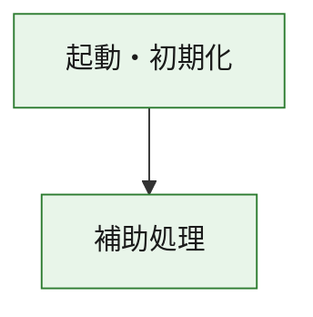
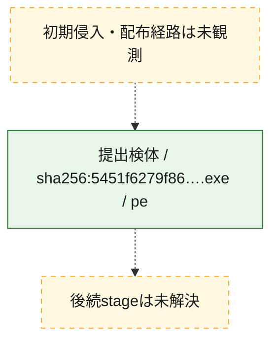
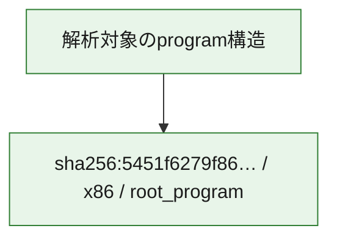

# 全体ロジック：5451f6279f8601ecfa276ca4d939eb23f12fa9e70bb9718c77acfc351014760a

代表関数の静的証跡から、起動・初期化の処理群を確認しました。

## 読み方

- phaseの掲載順は解析上の整理順です。observed_call_edgesがない段階間の実行順を断定しません。
- 図の実線は静的に観測した関係、点線と黄色のノードは未観測・未解決の関係を示します。
- 図は静的な要約であり、動的実行を再現するものではありません。
- 詳細な関数解説とfingerprintは[STATIC-LOGIC.md](STATIC-LOGIC.md)を参照してください。

## 静的可視化

### 実行フロー

### 感染チェーン

### モジュール関係

## 処理段階

### 1. 起動・初期化

entry pointから初期化と後続処理への移行を確認します。
確度: `confirmed_static_function_evidence`

- `5451f6279f8601ecfa276ca4d939eb23f12fa9e70bb9718c77acfc351014760a:ghidra:180001010` — 初期化と主要処理への分岐を行う入口関数です。 状態: `succeeded`、選定理由: `entry_point`, `meaningful_symbol_name`, `reviewed_call_centrality:22`, `role:entrypoint`, `small_program_complete_context`

### 2. 補助処理

主要処理を支える一般内部関数またはlibrary処理を確認します。
確度: `confirmed_static_function_evidence`

- `5451f6279f8601ecfa276ca4d939eb23f12fa9e70bb9718c77acfc351014760a:ghidra:180001240` — 検体内部の一般処理を実装する関数です。 状態: `succeeded`、選定理由: `context_representative`, `reviewed_call_centrality:2`, `small_program_complete_context`
- `5451f6279f8601ecfa276ca4d939eb23f12fa9e70bb9718c77acfc351014760a:ghidra:180001350` — 検体内部の一般処理を実装する関数です。 状態: `succeeded`、選定理由: `context_representative`, `reviewed_call_centrality:25`, `small_program_complete_context`
- `5451f6279f8601ecfa276ca4d939eb23f12fa9e70bb9718c77acfc351014760a:ghidra:180003780` — 検体内部の一般処理を実装する関数です。 状態: `succeeded`、選定理由: `context_representative`, `reviewed_call_centrality:2`, `small_program_complete_context`
- `5451f6279f8601ecfa276ca4d939eb23f12fa9e70bb9718c77acfc351014760a:ghidra:1800038e0` — 検体内部の一般処理を実装する関数です。 状態: `succeeded`、選定理由: `context_representative`, `reviewed_call_centrality:2`, `small_program_complete_context`

## 観測したcall関係

- `5451f6279f8601ecfa276ca4d939eb23f12fa9e70bb9718c77acfc351014760a:ghidra:180001010` → `5451f6279f8601ecfa276ca4d939eb23f12fa9e70bb9718c77acfc351014760a:ghidra:180001240` （`startup` → `support`）
- `5451f6279f8601ecfa276ca4d939eb23f12fa9e70bb9718c77acfc351014760a:ghidra:180001010` → `5451f6279f8601ecfa276ca4d939eb23f12fa9e70bb9718c77acfc351014760a:ghidra:180001350` （`startup` → `support`）
- `5451f6279f8601ecfa276ca4d939eb23f12fa9e70bb9718c77acfc351014760a:ghidra:180001350` → `5451f6279f8601ecfa276ca4d939eb23f12fa9e70bb9718c77acfc351014760a:ghidra:180001240` （`support` → `support`）
- `5451f6279f8601ecfa276ca4d939eb23f12fa9e70bb9718c77acfc351014760a:ghidra:180001350` → `5451f6279f8601ecfa276ca4d939eb23f12fa9e70bb9718c77acfc351014760a:ghidra:180003780` （`support` → `support`）
- `5451f6279f8601ecfa276ca4d939eb23f12fa9e70bb9718c77acfc351014760a:ghidra:180001350` → `5451f6279f8601ecfa276ca4d939eb23f12fa9e70bb9718c77acfc351014760a:ghidra:1800038e0` （`support` → `support`）
- `5451f6279f8601ecfa276ca4d939eb23f12fa9e70bb9718c77acfc351014760a:ghidra:180003780` → `5451f6279f8601ecfa276ca4d939eb23f12fa9e70bb9718c77acfc351014760a:ghidra:1800038e0` （`support` → `support`）
- `ghidra-function:2a48a8f8dd219331c15d0d4b` → `ghidra-function:11472953b874dff5b6b595cd` （`unclassified` → `unclassified`）
- `ghidra-function:89f347f11241d4bd771ef45a` → `ghidra-external:08d583b66b948d9d818eb227` （`unclassified` → `unclassified`）
- `ghidra-function:89f347f11241d4bd771ef45a` → `ghidra-external:26fa3f3d2309fa2cb79e0c6b` （`unclassified` → `unclassified`）
- `ghidra-function:89f347f11241d4bd771ef45a` → `ghidra-external:33543637388f19ff84577a54` （`unclassified` → `unclassified`）
- `ghidra-function:89f347f11241d4bd771ef45a` → `ghidra-external:44e743a16300b14572b0e77e` （`unclassified` → `unclassified`）
- `ghidra-function:89f347f11241d4bd771ef45a` → `ghidra-external:52d6255c51d91c59f7ce5bdd` （`unclassified` → `unclassified`）
- `ghidra-function:89f347f11241d4bd771ef45a` → `ghidra-external:5a9bf42bce2aa23e306a6a4e` （`unclassified` → `unclassified`）
- `ghidra-function:89f347f11241d4bd771ef45a` → `ghidra-external:5b007c02a12305115561a593` （`unclassified` → `unclassified`）
- `ghidra-function:89f347f11241d4bd771ef45a` → `ghidra-external:62e86c32e5cb067510d11df2` （`unclassified` → `unclassified`）
- `ghidra-function:89f347f11241d4bd771ef45a` → `ghidra-external:6c3c45fdd96517dff65a42ef` （`unclassified` → `unclassified`）
- `ghidra-function:89f347f11241d4bd771ef45a` → `ghidra-external:78aa7c0704dab4c31377a2d3` （`unclassified` → `unclassified`）
- `ghidra-function:89f347f11241d4bd771ef45a` → `ghidra-external:86283c83d85cc035ab3d22e5` （`unclassified` → `unclassified`）
- `ghidra-function:89f347f11241d4bd771ef45a` → `ghidra-external:8b35188e5b5a53767ed68ed2` （`unclassified` → `unclassified`）
- `ghidra-function:89f347f11241d4bd771ef45a` → `ghidra-external:91ad1f9d4be5b1f7d5ccbe79` （`unclassified` → `unclassified`）
- `ghidra-function:89f347f11241d4bd771ef45a` → `ghidra-external:91dd18122916b64928b52457` （`unclassified` → `unclassified`）
- `ghidra-function:89f347f11241d4bd771ef45a` → `ghidra-external:9f6d9c4c153b1386366363bd` （`unclassified` → `unclassified`）
- `ghidra-function:89f347f11241d4bd771ef45a` → `ghidra-external:a4ae704580fbd606c2279777` （`unclassified` → `unclassified`）
- `ghidra-function:89f347f11241d4bd771ef45a` → `ghidra-external:a4cf249319e12f5dca343d01` （`unclassified` → `unclassified`）
- `ghidra-function:89f347f11241d4bd771ef45a` → `ghidra-external:b26f1a9a818c339a1b80d919` （`unclassified` → `unclassified`）
- `ghidra-function:89f347f11241d4bd771ef45a` → `ghidra-external:b37eeee31628bcac17197bf2` （`unclassified` → `unclassified`）
- `ghidra-function:89f347f11241d4bd771ef45a` → `ghidra-external:b79bc3954f5eb14f2d8219aa` （`unclassified` → `unclassified`）
- `ghidra-function:89f347f11241d4bd771ef45a` → `ghidra-external:e645dd9ee8aa7b42ff8c1c9b` （`unclassified` → `unclassified`）
- `ghidra-function:89f347f11241d4bd771ef45a` → `ghidra-function:11472953b874dff5b6b595cd` （`unclassified` → `unclassified`）
- `ghidra-function:89f347f11241d4bd771ef45a` → `ghidra-function:2a48a8f8dd219331c15d0d4b` （`unclassified` → `unclassified`）
- `ghidra-function:89f347f11241d4bd771ef45a` → `ghidra-function:c45612f663ac8f36b8bb615e` （`unclassified` → `unclassified`）
- `ghidra-function:bf0aa4041952c8df9a1c4469` → `ghidra-function:0a46a5f9e2ea1868b60c0e98` （`unclassified` → `unclassified`）
- `ghidra-function:bf0aa4041952c8df9a1c4469` → `ghidra-function:13257508760ddce25655bdc4` （`unclassified` → `unclassified`）
- `ghidra-function:bf0aa4041952c8df9a1c4469` → `ghidra-function:58c82a107b9cd48fb2cdfb7a` （`unclassified` → `unclassified`）
- `ghidra-function:bf0aa4041952c8df9a1c4469` → `ghidra-function:89f347f11241d4bd771ef45a` （`unclassified` → `unclassified`）
- `ghidra-function:bf0aa4041952c8df9a1c4469` → `ghidra-function:8e8be08bb63b98f23cf11709` （`unclassified` → `unclassified`）
- `ghidra-function:bf0aa4041952c8df9a1c4469` → `ghidra-function:97f43503ab4ad119531c59c5` （`unclassified` → `unclassified`）
- `ghidra-function:bf0aa4041952c8df9a1c4469` → `ghidra-function:aaa25d0a84ac76827d09bdab` （`unclassified` → `unclassified`）
- `ghidra-function:bf0aa4041952c8df9a1c4469` → `ghidra-function:bfa4db1c37b372e4d749f095` （`unclassified` → `unclassified`）
- `ghidra-function:bf0aa4041952c8df9a1c4469` → `ghidra-function:c45612f663ac8f36b8bb615e` （`unclassified` → `unclassified`）
- `ghidra-function:bf0aa4041952c8df9a1c4469` → `ghidra-function:cb39cd97066fba28a9da440f` （`unclassified` → `unclassified`）
- `ghidra-function:bf0aa4041952c8df9a1c4469` → `ghidra-function:e0535db43bb55994acf4584f` （`unclassified` → `unclassified`）
- `ghidra-function:bf0aa4041952c8df9a1c4469` → `ghidra-function:f933a739cd04e132a00f6f8a` （`unclassified` → `unclassified`）

## 解析範囲と制約

- 選定外関数は全体inventoryへ残しますが、関数本体の個別解説対象にはしていません。
- indirect call、難読化、packer、VM、壊れたcontrol flowによりcall関係が欠落する場合があります。
- 文書は静的解析に基づき、検体実行や外部通信による動的確認は行っていません。
