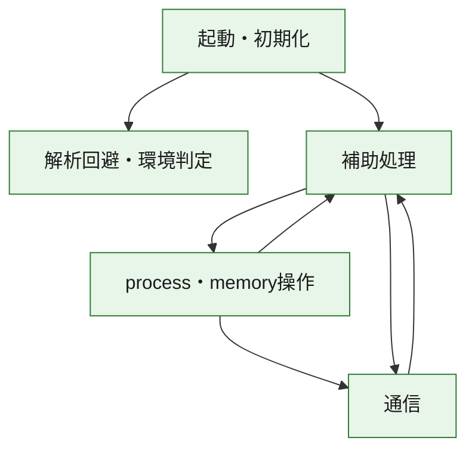
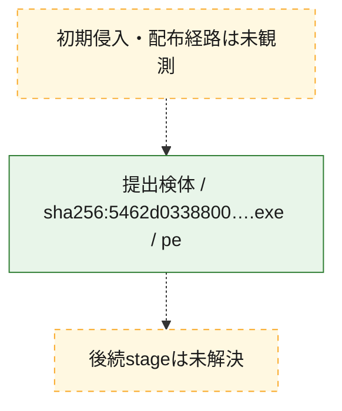
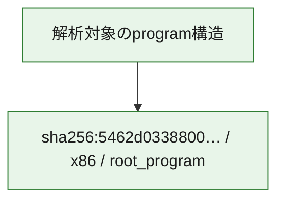

# 全体ロジック：5462d0338800b440fec5b6a6133cd943c9ef5c05883859c70fbd5326a8e54ccc

代表関数の静的証跡から、起動・初期化、解析回避・環境判定、process・memory操作、通信の処理群を確認しました。

## 読み方

- phaseの掲載順は解析上の整理順です。observed_call_edgesがない段階間の実行順を断定しません。
- 図の実線は静的に観測した関係、点線と黄色のノードは未観測・未解決の関係を示します。
- 図は静的な要約であり、動的実行を再現するものではありません。
- 詳細な関数解説とfingerprintは[STATIC-LOGIC.md](STATIC-LOGIC.md)を参照してください。

## 静的可視化

### 実行フロー

### 感染チェーン

### モジュール関係

## 処理段階

### 1. 起動・初期化

entry pointから初期化と後続処理への移行を確認します。
確度: `confirmed_static_function_evidence`

- `5462d0338800b440fec5b6a6133cd943c9ef5c05883859c70fbd5326a8e54ccc:ghidra:00402b07` — 初期化と主要処理への分岐を行う入口関数です。 状態: `succeeded`、選定理由: `call_graph_centrality:in=0,out=2`, `entry_point`, `meaningful_symbol_name`, `reviewed_call_centrality:2`, `role:entrypoint`, `small_program_complete_context`

### 2. 解析回避・環境判定

debugger、sandbox、仮想環境、時間差などの判定を確認します。
確度: `confirmed_static_function_evidence`

- `5462d0338800b440fec5b6a6133cd943c9ef5c05883859c70fbd5326a8e54ccc:ghidra:00402e88` — debugger、仮想環境、sandbox、または時間差の確認に関係する関数です。 状態: `succeeded`、選定理由: `call_graph_centrality:in=1,out=5`, `reviewed_call_centrality:11`, `reviewed_call_centrality:6`, `role:anti_analysis`, `small_program_complete_context`

### 3. process・memory操作

process、thread、module、memory操作と実行移行を確認します。
確度: `confirmed_static_function_evidence`

- `5462d0338800b440fec5b6a6133cd943c9ef5c05883859c70fbd5326a8e54ccc:ghidra:00402430` — process、thread、module、またはmemory操作に関係する関数です。 状態: `succeeded`、選定理由: `call_graph_centrality:in=0,out=17`, `large_function:instructions=155`, `reviewed_call_centrality:17`, `reviewed_call_centrality:26`, `role:process_or_memory_operation`, `small_program_complete_context`
- `5462d0338800b440fec5b6a6133cd943c9ef5c05883859c70fbd5326a8e54ccc:ghidra:00402690` — process、thread、module、またはmemory操作に関係する関数です。 状態: `succeeded`、選定理由: `call_graph_centrality:in=1,out=12`, `large_function:instructions=68`, `reviewed_call_centrality:14`, `reviewed_call_centrality:23`, `role:process_or_memory_operation`, `small_program_complete_context`

### 4. 通信

通信初期化、endpoint処理、送受信の役割を確認します。
確度: `confirmed_static_function_evidence`

- `5462d0338800b440fec5b6a6133cd943c9ef5c05883859c70fbd5326a8e54ccc:ghidra:004010d0` — 通信初期化、送受信、またはendpoint処理に関係する関数です。 状態: `succeeded`、選定理由: `call_graph_centrality:in=1,out=4`, `reviewed_call_centrality:5`, `reviewed_call_centrality:6`, `role:network_communication`, `small_program_complete_context`
- `5462d0338800b440fec5b6a6133cd943c9ef5c05883859c70fbd5326a8e54ccc:ghidra:00401150` — 通信初期化、送受信、またはendpoint処理に関係する関数です。 状態: `succeeded`、選定理由: `call_graph_centrality:in=1,out=2`, `reviewed_call_centrality:3`, `reviewed_call_centrality:5`, `role:network_communication`, `small_program_complete_context`
- `5462d0338800b440fec5b6a6133cd943c9ef5c05883859c70fbd5326a8e54ccc:ghidra:00401190` — 通信初期化、送受信、またはendpoint処理に関係する関数です。 状態: `succeeded`、選定理由: `call_graph_centrality:in=1,out=2`, `reviewed_call_centrality:4`, `role:network_communication`, `small_program_complete_context`
- `5462d0338800b440fec5b6a6133cd943c9ef5c05883859c70fbd5326a8e54ccc:ghidra:00401470` — 通信初期化、送受信、またはendpoint処理に関係する関数です。 状態: `succeeded`、選定理由: `call_graph_centrality:in=2,out=2`, `reviewed_call_centrality:4`, `reviewed_call_centrality:6`, `role:network_communication`, `small_program_complete_context`
- `5462d0338800b440fec5b6a6133cd943c9ef5c05883859c70fbd5326a8e54ccc:ghidra:00401710` — 通信初期化、送受信、またはendpoint処理に関係する関数です。 状態: `succeeded`、選定理由: `call_graph_centrality:in=1,out=4`, `reviewed_call_centrality:5`, `reviewed_call_centrality:8`, `role:network_communication`, `small_program_complete_context`
- `5462d0338800b440fec5b6a6133cd943c9ef5c05883859c70fbd5326a8e54ccc:ghidra:00401790` — 通信初期化、送受信、またはendpoint処理に関係する関数です。 状態: `succeeded`、選定理由: `call_graph_centrality:in=1,out=4`, `reviewed_call_centrality:6`, `role:network_communication`, `small_program_complete_context`
- `5462d0338800b440fec5b6a6133cd943c9ef5c05883859c70fbd5326a8e54ccc:ghidra:00401800` — 通信初期化、送受信、またはendpoint処理に関係する関数です。 状態: `succeeded`、選定理由: `call_graph_centrality:in=1,out=7`, `large_function:instructions=71`, `reviewed_call_centrality:13`, `reviewed_call_centrality:8`, `role:network_communication`, `small_program_complete_context`
- `5462d0338800b440fec5b6a6133cd943c9ef5c05883859c70fbd5326a8e54ccc:ghidra:00401900` — 通信初期化、送受信、またはendpoint処理に関係する関数です。 状態: `succeeded`、選定理由: `call_graph_centrality:in=1,out=8`, `large_function:instructions=86`, `reviewed_call_centrality:16`, `reviewed_call_centrality:9`, `role:network_communication`, `small_program_complete_context`
- `5462d0338800b440fec5b6a6133cd943c9ef5c05883859c70fbd5326a8e54ccc:ghidra:00401a10` — 通信初期化、送受信、またはendpoint処理に関係する関数です。 状態: `succeeded`、選定理由: `call_graph_centrality:in=1,out=20`, `large_function:instructions=595`, `reviewed_call_centrality:28`, `reviewed_call_centrality:29`, `role:network_communication`, `small_program_complete_context`

### 5. 補助処理

主要処理を支える一般内部関数またはlibrary処理を確認します。
確度: `confirmed_static_function_evidence`

- `5462d0338800b440fec5b6a6133cd943c9ef5c05883859c70fbd5326a8e54ccc:ghidra:00401000` — 検体内部の一般処理を実装する関数です。 状態: `succeeded`、選定理由: `call_graph_centrality:in=1,out=1`, `reviewed_call_centrality:2`, `small_program_complete_context`
- `5462d0338800b440fec5b6a6133cd943c9ef5c05883859c70fbd5326a8e54ccc:ghidra:00401030` — 検体内部の一般処理を実装する関数です。 状態: `succeeded`、選定理由: `call_graph_centrality:in=1,out=1`, `reviewed_call_centrality:2`, `small_program_complete_context`
- `5462d0338800b440fec5b6a6133cd943c9ef5c05883859c70fbd5326a8e54ccc:ghidra:004011f0` — 検体内部の一般処理を実装する関数です。 状態: `succeeded`、選定理由: `call_graph_centrality:in=1,out=1`, `reviewed_call_centrality:2`, `reviewed_call_centrality:3`, `small_program_complete_context`
- `5462d0338800b440fec5b6a6133cd943c9ef5c05883859c70fbd5326a8e54ccc:ghidra:00401260` — 検体内部の一般処理を実装する関数です。 状態: `succeeded`、選定理由: `call_graph_centrality:in=1,out=1`, `large_function:instructions=65`, `reviewed_call_centrality:3`, `small_program_complete_context`
- `5462d0338800b440fec5b6a6133cd943c9ef5c05883859c70fbd5326a8e54ccc:ghidra:00401350` — 検体内部の一般処理を実装する関数です。 状態: `succeeded`、選定理由: `call_graph_centrality:in=1,out=4`, `reviewed_call_centrality:5`, `reviewed_call_centrality:6`, `small_program_complete_context`
- `5462d0338800b440fec5b6a6133cd943c9ef5c05883859c70fbd5326a8e54ccc:ghidra:004013c0` — 検体内部の一般処理を実装する関数です。 状態: `succeeded`、選定理由: `call_graph_centrality:in=1,out=1`, `reviewed_call_centrality:2`, `small_program_complete_context`
- `5462d0338800b440fec5b6a6133cd943c9ef5c05883859c70fbd5326a8e54ccc:ghidra:00401430` — 検体内部の一般処理を実装する関数です。 状態: `succeeded`、選定理由: `call_graph_centrality:in=2,out=0`, `reviewed_call_centrality:2`, `small_program_complete_context`
- `5462d0338800b440fec5b6a6133cd943c9ef5c05883859c70fbd5326a8e54ccc:ghidra:004014c0` — 検体内部の一般処理を実装する関数です。 状態: `succeeded`、選定理由: `call_graph_centrality:in=1,out=5`, `large_function:instructions=156`, `reviewed_call_centrality:11`, `reviewed_call_centrality:6`, `small_program_complete_context`
- `5462d0338800b440fec5b6a6133cd943c9ef5c05883859c70fbd5326a8e54ccc:ghidra:004018e0` — 検体内部の一般処理を実装する関数です。 状態: `succeeded`、選定理由: `call_graph_centrality:in=2,out=1`, `reviewed_call_centrality:3`, `small_program_complete_context`
- `5462d0338800b440fec5b6a6133cd943c9ef5c05883859c70fbd5326a8e54ccc:ghidra:004022e0` — 検体内部の一般処理を実装する関数です。 状態: `succeeded`、選定理由: `call_graph_centrality:in=1,out=1`, `reviewed_call_centrality:2`, `small_program_complete_context`
- `5462d0338800b440fec5b6a6133cd943c9ef5c05883859c70fbd5326a8e54ccc:ghidra:00402300` — 検体内部の一般処理を実装する関数です。 状態: `succeeded`、選定理由: `call_graph_centrality:in=0,out=12`, `large_function:instructions=77`, `reviewed_call_centrality:12`, `reviewed_call_centrality:14`, `small_program_complete_context`
- `5462d0338800b440fec5b6a6133cd943c9ef5c05883859c70fbd5326a8e54ccc:ghidra:00402847` — 検体内部の一般処理を実装する関数です。 状態: `succeeded`、選定理由: `call_graph_centrality:in=1,out=14`, `large_function:instructions=136`, `reviewed_call_centrality:15`, `reviewed_call_centrality:22`, `small_program_complete_context`
- `5462d0338800b440fec5b6a6133cd943c9ef5c05883859c70fbd5326a8e54ccc:ghidra:00402c80` — 検体内部の一般処理を実装する関数です。 状態: `succeeded`、選定理由: `call_graph_centrality:in=1,out=0`, `reviewed_call_centrality:1`, `small_program_complete_context`
- `5462d0338800b440fec5b6a6133cd943c9ef5c05883859c70fbd5326a8e54ccc:ghidra:00402cc0` — 検体内部の一般処理を実装する関数です。 状態: `succeeded`、選定理由: `call_graph_centrality:in=1,out=0`, `reviewed_call_centrality:1`, `small_program_complete_context`
- `5462d0338800b440fec5b6a6133cd943c9ef5c05883859c70fbd5326a8e54ccc:ghidra:00402d10` — 検体内部の一般処理を実装する関数です。 状態: `succeeded`、選定理由: `call_graph_centrality:in=1,out=2`, `reviewed_call_centrality:3`, `reviewed_call_centrality:4`, `small_program_complete_context`
- `5462d0338800b440fec5b6a6133cd943c9ef5c05883859c70fbd5326a8e54ccc:ghidra:00402ddc` — 検体内部の一般処理を実装する関数です。 状態: `succeeded`、選定理由: `call_graph_centrality:in=1,out=0`, `reviewed_call_centrality:1`, `small_program_complete_context`
- `5462d0338800b440fec5b6a6133cd943c9ef5c05883859c70fbd5326a8e54ccc:ghidra:00402e21` — compiler生成処理または汎用library処理とみられる関数です。 状態: `succeeded`、選定理由: `call_graph_centrality:in=1,out=0`, `meaningful_symbol_name`, `reviewed_call_centrality:1`, `small_program_complete_context`
- `5462d0338800b440fec5b6a6133cd943c9ef5c05883859c70fbd5326a8e54ccc:ghidra:00402e35` — 検体内部の一般処理を実装する関数です。 状態: `succeeded`、選定理由: `call_graph_centrality:in=0,out=1`, `reviewed_call_centrality:1`, `small_program_complete_context`

## 観測したcall関係

- `5462d0338800b440fec5b6a6133cd943c9ef5c05883859c70fbd5326a8e54ccc:ghidra:004010d0` → `5462d0338800b440fec5b6a6133cd943c9ef5c05883859c70fbd5326a8e54ccc:ghidra:00401470` （`communication` → `communication`）
- `5462d0338800b440fec5b6a6133cd943c9ef5c05883859c70fbd5326a8e54ccc:ghidra:00401190` → `5462d0338800b440fec5b6a6133cd943c9ef5c05883859c70fbd5326a8e54ccc:ghidra:00401260` （`communication` → `support`）
- `5462d0338800b440fec5b6a6133cd943c9ef5c05883859c70fbd5326a8e54ccc:ghidra:00401710` → `5462d0338800b440fec5b6a6133cd943c9ef5c05883859c70fbd5326a8e54ccc:ghidra:00401470` （`communication` → `communication`）
- `5462d0338800b440fec5b6a6133cd943c9ef5c05883859c70fbd5326a8e54ccc:ghidra:00401790` → `5462d0338800b440fec5b6a6133cd943c9ef5c05883859c70fbd5326a8e54ccc:ghidra:00401710` （`communication` → `communication`）
- `5462d0338800b440fec5b6a6133cd943c9ef5c05883859c70fbd5326a8e54ccc:ghidra:00401800` → `5462d0338800b440fec5b6a6133cd943c9ef5c05883859c70fbd5326a8e54ccc:ghidra:00401430` （`communication` → `support`）
- `5462d0338800b440fec5b6a6133cd943c9ef5c05883859c70fbd5326a8e54ccc:ghidra:00401800` → `5462d0338800b440fec5b6a6133cd943c9ef5c05883859c70fbd5326a8e54ccc:ghidra:004018e0` （`communication` → `support`）
- `5462d0338800b440fec5b6a6133cd943c9ef5c05883859c70fbd5326a8e54ccc:ghidra:00401a10` → `5462d0338800b440fec5b6a6133cd943c9ef5c05883859c70fbd5326a8e54ccc:ghidra:004010d0` （`communication` → `communication`）
- `5462d0338800b440fec5b6a6133cd943c9ef5c05883859c70fbd5326a8e54ccc:ghidra:00401a10` → `5462d0338800b440fec5b6a6133cd943c9ef5c05883859c70fbd5326a8e54ccc:ghidra:00401150` （`communication` → `communication`）
- `5462d0338800b440fec5b6a6133cd943c9ef5c05883859c70fbd5326a8e54ccc:ghidra:00401a10` → `5462d0338800b440fec5b6a6133cd943c9ef5c05883859c70fbd5326a8e54ccc:ghidra:00401190` （`communication` → `communication`）
- `5462d0338800b440fec5b6a6133cd943c9ef5c05883859c70fbd5326a8e54ccc:ghidra:00401a10` → `5462d0338800b440fec5b6a6133cd943c9ef5c05883859c70fbd5326a8e54ccc:ghidra:004011f0` （`communication` → `support`）
- `5462d0338800b440fec5b6a6133cd943c9ef5c05883859c70fbd5326a8e54ccc:ghidra:00401a10` → `5462d0338800b440fec5b6a6133cd943c9ef5c05883859c70fbd5326a8e54ccc:ghidra:00401350` （`communication` → `support`）
- `5462d0338800b440fec5b6a6133cd943c9ef5c05883859c70fbd5326a8e54ccc:ghidra:00401a10` → `5462d0338800b440fec5b6a6133cd943c9ef5c05883859c70fbd5326a8e54ccc:ghidra:004013c0` （`communication` → `support`）
- `5462d0338800b440fec5b6a6133cd943c9ef5c05883859c70fbd5326a8e54ccc:ghidra:00401a10` → `5462d0338800b440fec5b6a6133cd943c9ef5c05883859c70fbd5326a8e54ccc:ghidra:004014c0` （`communication` → `support`）
- `5462d0338800b440fec5b6a6133cd943c9ef5c05883859c70fbd5326a8e54ccc:ghidra:00401a10` → `5462d0338800b440fec5b6a6133cd943c9ef5c05883859c70fbd5326a8e54ccc:ghidra:004022e0` （`communication` → `support`）
- `5462d0338800b440fec5b6a6133cd943c9ef5c05883859c70fbd5326a8e54ccc:ghidra:00402300` → `5462d0338800b440fec5b6a6133cd943c9ef5c05883859c70fbd5326a8e54ccc:ghidra:00401430` （`support` → `support`）
- `5462d0338800b440fec5b6a6133cd943c9ef5c05883859c70fbd5326a8e54ccc:ghidra:00402300` → `5462d0338800b440fec5b6a6133cd943c9ef5c05883859c70fbd5326a8e54ccc:ghidra:004018e0` （`support` → `support`）
- `5462d0338800b440fec5b6a6133cd943c9ef5c05883859c70fbd5326a8e54ccc:ghidra:00402300` → `5462d0338800b440fec5b6a6133cd943c9ef5c05883859c70fbd5326a8e54ccc:ghidra:00401a10` （`support` → `communication`）
- `5462d0338800b440fec5b6a6133cd943c9ef5c05883859c70fbd5326a8e54ccc:ghidra:00402430` → `5462d0338800b440fec5b6a6133cd943c9ef5c05883859c70fbd5326a8e54ccc:ghidra:00401000` （`execution` → `support`）
- `5462d0338800b440fec5b6a6133cd943c9ef5c05883859c70fbd5326a8e54ccc:ghidra:00402430` → `5462d0338800b440fec5b6a6133cd943c9ef5c05883859c70fbd5326a8e54ccc:ghidra:00401800` （`execution` → `communication`）
- `5462d0338800b440fec5b6a6133cd943c9ef5c05883859c70fbd5326a8e54ccc:ghidra:00402430` → `5462d0338800b440fec5b6a6133cd943c9ef5c05883859c70fbd5326a8e54ccc:ghidra:00401900` （`execution` → `communication`）
- `5462d0338800b440fec5b6a6133cd943c9ef5c05883859c70fbd5326a8e54ccc:ghidra:00402690` → `5462d0338800b440fec5b6a6133cd943c9ef5c05883859c70fbd5326a8e54ccc:ghidra:00401030` （`execution` → `support`）
- `5462d0338800b440fec5b6a6133cd943c9ef5c05883859c70fbd5326a8e54ccc:ghidra:00402690` → `5462d0338800b440fec5b6a6133cd943c9ef5c05883859c70fbd5326a8e54ccc:ghidra:00401790` （`execution` → `communication`）
- `5462d0338800b440fec5b6a6133cd943c9ef5c05883859c70fbd5326a8e54ccc:ghidra:00402847` → `5462d0338800b440fec5b6a6133cd943c9ef5c05883859c70fbd5326a8e54ccc:ghidra:00402690` （`support` → `execution`）
- `5462d0338800b440fec5b6a6133cd943c9ef5c05883859c70fbd5326a8e54ccc:ghidra:00402847` → `5462d0338800b440fec5b6a6133cd943c9ef5c05883859c70fbd5326a8e54ccc:ghidra:00402d10` （`support` → `support`）
- `5462d0338800b440fec5b6a6133cd943c9ef5c05883859c70fbd5326a8e54ccc:ghidra:00402847` → `5462d0338800b440fec5b6a6133cd943c9ef5c05883859c70fbd5326a8e54ccc:ghidra:00402ddc` （`support` → `support`）
- `5462d0338800b440fec5b6a6133cd943c9ef5c05883859c70fbd5326a8e54ccc:ghidra:00402847` → `5462d0338800b440fec5b6a6133cd943c9ef5c05883859c70fbd5326a8e54ccc:ghidra:00402e21` （`support` → `support`）
- `5462d0338800b440fec5b6a6133cd943c9ef5c05883859c70fbd5326a8e54ccc:ghidra:00402b07` → `5462d0338800b440fec5b6a6133cd943c9ef5c05883859c70fbd5326a8e54ccc:ghidra:00402847` （`startup` → `support`）
- `5462d0338800b440fec5b6a6133cd943c9ef5c05883859c70fbd5326a8e54ccc:ghidra:00402b07` → `5462d0338800b440fec5b6a6133cd943c9ef5c05883859c70fbd5326a8e54ccc:ghidra:00402e88` （`startup` → `evasion`）
- `5462d0338800b440fec5b6a6133cd943c9ef5c05883859c70fbd5326a8e54ccc:ghidra:00402d10` → `5462d0338800b440fec5b6a6133cd943c9ef5c05883859c70fbd5326a8e54ccc:ghidra:00402c80` （`support` → `support`）
- `5462d0338800b440fec5b6a6133cd943c9ef5c05883859c70fbd5326a8e54ccc:ghidra:00402d10` → `5462d0338800b440fec5b6a6133cd943c9ef5c05883859c70fbd5326a8e54ccc:ghidra:00402cc0` （`support` → `support`）
- `ghidra-function:0710c3386da7f54af568c2e1` → `ghidra-function:0659bcac5a30968a69b74bf4` （`unclassified` → `unclassified`）
- `ghidra-function:0710c3386da7f54af568c2e1` → `ghidra-function:132ec4354fc65b36983fdaa6` （`unclassified` → `unclassified`）
- `ghidra-function:0710c3386da7f54af568c2e1` → `ghidra-function:a7b346ad3ab25c537823d2f8` （`unclassified` → `unclassified`）
- `ghidra-function:0710c3386da7f54af568c2e1` → `ghidra-function:bd159545641d1a27a8ccc907` （`unclassified` → `unclassified`）
- `ghidra-function:1fb680082e94b4ac39422826` → `ghidra-external:13ce598f8801a309f6cd6a8d` （`unclassified` → `unclassified`）
- `ghidra-function:1fb680082e94b4ac39422826` → `ghidra-external:159d95b1941dbcb85c9cbb3f` （`unclassified` → `unclassified`）
- `ghidra-function:1fb680082e94b4ac39422826` → `ghidra-external:439785878989719ea0480a9a` （`unclassified` → `unclassified`）
- `ghidra-function:1fb680082e94b4ac39422826` → `ghidra-external:46a4ea7cecad6090b74566c2` （`unclassified` → `unclassified`）
- `ghidra-function:1fb680082e94b4ac39422826` → `ghidra-external:5087299c1fd5f50264d3a7b9` （`unclassified` → `unclassified`）
- `ghidra-function:1fb680082e94b4ac39422826` → `ghidra-external:a5501f0c473d8955607cfce9` （`unclassified` → `unclassified`）
- `ghidra-function:1fb680082e94b4ac39422826` → `ghidra-external:b770757f339e63feb980787d` （`unclassified` → `unclassified`）
- `ghidra-function:1fb680082e94b4ac39422826` → `ghidra-function:0710c3386da7f54af568c2e1` （`unclassified` → `unclassified`）
- `ghidra-function:1fb680082e94b4ac39422826` → `ghidra-function:33c36c7652184b3cb5831ced` （`unclassified` → `unclassified`）
- `ghidra-function:1fb680082e94b4ac39422826` → `ghidra-function:3b32012168890b36798647b4` （`unclassified` → `unclassified`）
- `ghidra-function:1fb680082e94b4ac39422826` → `ghidra-function:5746762f76ada6ae6e3aaa15` （`unclassified` → `unclassified`）
- `ghidra-function:1fb680082e94b4ac39422826` → `ghidra-function:5e57e0ec2e58f5a658f7e1bf` （`unclassified` → `unclassified`）
- `ghidra-function:1fb680082e94b4ac39422826` → `ghidra-function:620c3cac3e995f119bfd76f4` （`unclassified` → `unclassified`）
- `ghidra-function:1fb680082e94b4ac39422826` → `ghidra-function:724981ea5115be01d81a0160` （`unclassified` → `unclassified`）
- `ghidra-function:1fb680082e94b4ac39422826` → `ghidra-function:7b0bfe8efe52ff8207ebb228` （`unclassified` → `unclassified`）
- `ghidra-function:1fb680082e94b4ac39422826` → `ghidra-function:80711cb76ec7d9e19f73f3f1` （`unclassified` → `unclassified`）
- `ghidra-function:1fb680082e94b4ac39422826` → `ghidra-function:9a112a6f2d6c37733a947d2b` （`unclassified` → `unclassified`）
- `ghidra-function:1fb680082e94b4ac39422826` → `ghidra-function:9c970318201ffd8f1eac60db` （`unclassified` → `unclassified`）
- `ghidra-function:1fb680082e94b4ac39422826` → `ghidra-function:bcb0e5881be4cd1ef363dded` （`unclassified` → `unclassified`）
- `ghidra-function:1fb680082e94b4ac39422826` → `ghidra-function:da52b6d0fb3d877f3ca908fb` （`unclassified` → `unclassified`）
- `ghidra-function:1fb680082e94b4ac39422826` → `ghidra-function:e3c6b53846ce9a4b2983c451` （`unclassified` → `unclassified`）
- `ghidra-function:1fb680082e94b4ac39422826` → `ghidra-function:e4df958b37f0632d236985b2` （`unclassified` → `unclassified`）
- `ghidra-function:1fb680082e94b4ac39422826` → `ghidra-function:e70c533fde3b8657c6e119d2` （`unclassified` → `unclassified`）
- `ghidra-function:1fb680082e94b4ac39422826` → `ghidra-function:e837e6dccb826b8c8f03b2b6` （`unclassified` → `unclassified`）
- `ghidra-function:1fb680082e94b4ac39422826` → `ghidra-function:f0d382afcdc2072848417040` （`unclassified` → `unclassified`）
- `ghidra-function:1fb680082e94b4ac39422826` → `ghidra-function:f1a18ea3c81539164dfcbe07` （`unclassified` → `unclassified`）
- `ghidra-function:1fb680082e94b4ac39422826` → `ghidra-function:f21a92b038e04db2cab0cf51` （`unclassified` → `unclassified`）
- `ghidra-function:251ff088b247f8f226f22923` → `ghidra-function:dc6bb940fccf6cbb9760d483` （`unclassified` → `unclassified`）
- `ghidra-function:2c0e64443a2e85a2116238be` → `ghidra-function:027fbd1eeed5695384484e17` （`unclassified` → `unclassified`）
- `ghidra-function:2c0e64443a2e85a2116238be` → `ghidra-function:0a7d9dff7e011d8d46fcd970` （`unclassified` → `unclassified`）
- `ghidra-function:2c0e64443a2e85a2116238be` → `ghidra-function:0aa290a8e7d09e37ddd381de` （`unclassified` → `unclassified`）
- `ghidra-function:2c0e64443a2e85a2116238be` → `ghidra-function:2c4a5ee5294a45ef543132f2` （`unclassified` → `unclassified`）
- `ghidra-function:2c0e64443a2e85a2116238be` → `ghidra-function:3d05abcdb0409d068d55fe1d` （`unclassified` → `unclassified`）
- `ghidra-function:2c0e64443a2e85a2116238be` → `ghidra-function:4c98ed0abf60f1bf01523ede` （`unclassified` → `unclassified`）
- `ghidra-function:2c0e64443a2e85a2116238be` → `ghidra-function:69b15084689744b1cb6cc5d3` （`unclassified` → `unclassified`）
- `ghidra-function:2c0e64443a2e85a2116238be` → `ghidra-function:7f1b5a4aa8384f84b7c0126f` （`unclassified` → `unclassified`）
- `ghidra-function:2c0e64443a2e85a2116238be` → `ghidra-function:881cbf0aec7cb602f9a92f65` （`unclassified` → `unclassified`）
- `ghidra-function:2c0e64443a2e85a2116238be` → `ghidra-function:8ad7f74d566aea4c4d391f0e` （`unclassified` → `unclassified`）
- `ghidra-function:2c0e64443a2e85a2116238be` → `ghidra-function:9a112a6f2d6c37733a947d2b` （`unclassified` → `unclassified`）
- `ghidra-function:2c0e64443a2e85a2116238be` → `ghidra-function:9c970318201ffd8f1eac60db` （`unclassified` → `unclassified`）
- `ghidra-function:2c0e64443a2e85a2116238be` → `ghidra-function:cf599fe063a17b9e062e7bb8` （`unclassified` → `unclassified`）
- `ghidra-function:2c0e64443a2e85a2116238be` → `ghidra-function:e0e8c685f17360ae04a60aed` （`unclassified` → `unclassified`）
- `ghidra-function:2c0e64443a2e85a2116238be` → `ghidra-function:e70c533fde3b8657c6e119d2` （`unclassified` → `unclassified`）
- `ghidra-function:2c0e64443a2e85a2116238be` → `ghidra-function:f3d46ecfcc0cff4f1b8665ee` （`unclassified` → `unclassified`）
- `ghidra-function:2c0e64443a2e85a2116238be` → `ghidra-function:f7629f8b98340a48229857fb` （`unclassified` → `unclassified`）
- `ghidra-function:3821c8d7f4e06c3f5b8f62ac` → `ghidra-function:5f1e173e7201b6eff69298db` （`unclassified` → `unclassified`）
- `ghidra-function:3bff0761f0da348be706a5ee` → `ghidra-function:14c79f7a64e8c660608ce05b` （`unclassified` → `unclassified`）
- `ghidra-function:3bff0761f0da348be706a5ee` → `ghidra-function:1aa31e5384f1d9caa2fa3926` （`unclassified` → `unclassified`）
- `ghidra-function:3bff0761f0da348be706a5ee` → `ghidra-function:e0e8c685f17360ae04a60aed` （`unclassified` → `unclassified`）
- `ghidra-function:3bff0761f0da348be706a5ee` → `ghidra-function:ec97b0e964fc230186b6302c` （`unclassified` → `unclassified`）
- `ghidra-function:3bff0761f0da348be706a5ee` → `ghidra-function:fa160dd0b326421857cafabd` （`unclassified` → `unclassified`）
- `ghidra-function:5746762f76ada6ae6e3aaa15` → `ghidra-function:9c970318201ffd8f1eac60db` （`unclassified` → `unclassified`）
- `ghidra-function:6048eafb4b57002754de9384` → `ghidra-external:12282ce302a0671344cf1553` （`unclassified` → `unclassified`）
- `ghidra-function:6048eafb4b57002754de9384` → `ghidra-function:0a7d9dff7e011d8d46fcd970` （`unclassified` → `unclassified`）
- `ghidra-function:6048eafb4b57002754de9384` → `ghidra-function:26231de50a8101da71ce9ed4` （`unclassified` → `unclassified`）
- `ghidra-function:6048eafb4b57002754de9384` → `ghidra-function:3a64960dca1a4b7ae2073d05` （`unclassified` → `unclassified`）
- `ghidra-function:6048eafb4b57002754de9384` → `ghidra-function:4c98ed0abf60f1bf01523ede` （`unclassified` → `unclassified`）
- `ghidra-function:6048eafb4b57002754de9384` → `ghidra-function:620c3cac3e995f119bfd76f4` （`unclassified` → `unclassified`）
- `ghidra-function:6048eafb4b57002754de9384` → `ghidra-function:69b15084689744b1cb6cc5d3` （`unclassified` → `unclassified`）
- `ghidra-function:6048eafb4b57002754de9384` → `ghidra-function:7958b3c33a35a6a73b614dfc` （`unclassified` → `unclassified`）
- `ghidra-function:6048eafb4b57002754de9384` → `ghidra-function:8eccbfe215a75c633e243ee2` （`unclassified` → `unclassified`）
- `ghidra-function:6048eafb4b57002754de9384` → `ghidra-function:9a112a6f2d6c37733a947d2b` （`unclassified` → `unclassified`）
- `ghidra-function:6048eafb4b57002754de9384` → `ghidra-function:cf599fe063a17b9e062e7bb8` （`unclassified` → `unclassified`）
- `ghidra-function:6048eafb4b57002754de9384` → `ghidra-function:d7b4f0a782ca387c046a5b2d` （`unclassified` → `unclassified`）
- `ghidra-function:6048eafb4b57002754de9384` → `ghidra-function:f9eeb810eab0c17dfe6e8748` （`unclassified` → `unclassified`）
- `ghidra-function:64123295da9deeaf770b10a4` → `ghidra-function:27d1124ee93690e9a933aef2` （`unclassified` → `unclassified`）
- `ghidra-function:64123295da9deeaf770b10a4` → `ghidra-function:2d38c56edaada3668cf6a872` （`unclassified` → `unclassified`）
- `ghidra-function:64123295da9deeaf770b10a4` → `ghidra-function:39c9c21f0d1f34961a1d19f7` （`unclassified` → `unclassified`）
- `ghidra-function:64123295da9deeaf770b10a4` → `ghidra-function:510292bb6dd046032e96afb5` （`unclassified` → `unclassified`）
- `ghidra-function:64123295da9deeaf770b10a4` → `ghidra-function:5f14d0dae17c77cb8d30c852` （`unclassified` → `unclassified`）
- `ghidra-function:64123295da9deeaf770b10a4` → `ghidra-function:6048eafb4b57002754de9384` （`unclassified` → `unclassified`）
- `ghidra-function:64123295da9deeaf770b10a4` → `ghidra-function:7217bc22b2bc5d16c856c26e` （`unclassified` → `unclassified`）
- `ghidra-function:64123295da9deeaf770b10a4` → `ghidra-function:9a112a6f2d6c37733a947d2b` （`unclassified` → `unclassified`）
- `ghidra-function:64123295da9deeaf770b10a4` → `ghidra-function:bf83e8cac104459a250a1a3b` （`unclassified` → `unclassified`）
- `ghidra-function:64123295da9deeaf770b10a4` → `ghidra-function:c5f9c797ebc26472a67cf8ed` （`unclassified` → `unclassified`）
- `ghidra-function:64123295da9deeaf770b10a4` → `ghidra-function:c68ee3f9b4d0c0017bd10769` （`unclassified` → `unclassified`）
- `ghidra-function:64123295da9deeaf770b10a4` → `ghidra-function:caae5f94dc455c55c71317f3` （`unclassified` → `unclassified`）
- `ghidra-function:64123295da9deeaf770b10a4` → `ghidra-function:cb7d4a2ca5435748c257d957` （`unclassified` → `unclassified`）
- `ghidra-function:64123295da9deeaf770b10a4` → `ghidra-function:fdc368f8b6c2b52f272a7cd4` （`unclassified` → `unclassified`）
- `ghidra-function:724981ea5115be01d81a0160` → `ghidra-function:524e54d04997d9de6985d8db` （`unclassified` → `unclassified`）
- `ghidra-function:724981ea5115be01d81a0160` → `ghidra-function:e02df8afa288edc30a7464f2` （`unclassified` → `unclassified`）
- `ghidra-function:7b0bfe8efe52ff8207ebb228` → `ghidra-external:5087299c1fd5f50264d3a7b9` （`unclassified` → `unclassified`）
- `ghidra-function:7b0bfe8efe52ff8207ebb228` → `ghidra-function:004e9fb3ed61e730e5d7d6e6` （`unclassified` → `unclassified`）
- `ghidra-function:7b0bfe8efe52ff8207ebb228` → `ghidra-function:cfb9377db8b5e86d61c49341` （`unclassified` → `unclassified`）
- `ghidra-function:80711cb76ec7d9e19f73f3f1` → `ghidra-function:09432bb4b5db710e6c76da6e` （`unclassified` → `unclassified`）
- `ghidra-function:80711cb76ec7d9e19f73f3f1` → `ghidra-function:2c0923b3553345dafd1e359d` （`unclassified` → `unclassified`）
- `ghidra-function:80711cb76ec7d9e19f73f3f1` → `ghidra-function:620c3cac3e995f119bfd76f4` （`unclassified` → `unclassified`）
- `ghidra-function:80711cb76ec7d9e19f73f3f1` → `ghidra-function:676649403b1acf0176a69141` （`unclassified` → `unclassified`）
- `ghidra-function:80711cb76ec7d9e19f73f3f1` → `ghidra-function:7cac4e2b96dbbe4a370bf291` （`unclassified` → `unclassified`）
- `ghidra-function:8ad7f74d566aea4c4d391f0e` → `ghidra-function:062523fb256f8c6230e7ba55` （`unclassified` → `unclassified`）
- `ghidra-function:8ad7f74d566aea4c4d391f0e` → `ghidra-function:099ee5256dd8166e1bcb8cd5` （`unclassified` → `unclassified`）
- `ghidra-function:8ad7f74d566aea4c4d391f0e` → `ghidra-function:116b0ee7ec3e92df7b0335bc` （`unclassified` → `unclassified`）
- `ghidra-function:8ad7f74d566aea4c4d391f0e` → `ghidra-function:1d07a5781674ec371426f1ad` （`unclassified` → `unclassified`）
- `ghidra-function:8ad7f74d566aea4c4d391f0e` → `ghidra-function:21764bc1418aed0260424ef7` （`unclassified` → `unclassified`）
- `ghidra-function:8ad7f74d566aea4c4d391f0e` → `ghidra-function:5e57e0ec2e58f5a658f7e1bf` （`unclassified` → `unclassified`）
- `ghidra-function:8ad7f74d566aea4c4d391f0e` → `ghidra-function:aa8d5383ffc7d45291ef7054` （`unclassified` → `unclassified`）
- `ghidra-function:8ad7f74d566aea4c4d391f0e` → `ghidra-function:c50a4e2b3b7d71cb8eef9e6a` （`unclassified` → `unclassified`）
- `ghidra-function:8eccbfe215a75c633e243ee2` → `ghidra-external:5087299c1fd5f50264d3a7b9` （`unclassified` → `unclassified`）
- `ghidra-function:8eccbfe215a75c633e243ee2` → `ghidra-function:132ec4354fc65b36983fdaa6` （`unclassified` → `unclassified`）
- `ghidra-function:8eccbfe215a75c633e243ee2` → `ghidra-function:a8424d12cfd6da08acb8ddc5` （`unclassified` → `unclassified`）
- `ghidra-function:8eccbfe215a75c633e243ee2` → `ghidra-function:bd159545641d1a27a8ccc907` （`unclassified` → `unclassified`）
- `ghidra-function:8eccbfe215a75c633e243ee2` → `ghidra-function:da52b6d0fb3d877f3ca908fb` （`unclassified` → `unclassified`）
- `ghidra-function:a4ba2b6a1b889ea499e6c7ae` → `ghidra-function:1fb680082e94b4ac39422826` （`unclassified` → `unclassified`）
- `ghidra-function:a4ba2b6a1b889ea499e6c7ae` → `ghidra-function:3821c8d7f4e06c3f5b8f62ac` （`unclassified` → `unclassified`）
- `ghidra-function:a4ba2b6a1b889ea499e6c7ae` → `ghidra-function:3d05abcdb0409d068d55fe1d` （`unclassified` → `unclassified`）
- `ghidra-function:a4ba2b6a1b889ea499e6c7ae` → `ghidra-function:4144be79b09edf86ea2a7ef7` （`unclassified` → `unclassified`）
- `ghidra-function:a4ba2b6a1b889ea499e6c7ae` → `ghidra-function:8104865cf49624451ca7d446` （`unclassified` → `unclassified`）
- `ghidra-function:a4ba2b6a1b889ea499e6c7ae` → `ghidra-function:881cbf0aec7cb602f9a92f65` （`unclassified` → `unclassified`）
- `ghidra-function:a4ba2b6a1b889ea499e6c7ae` → `ghidra-function:9a5ec0e6ee1036a6889e822c` （`unclassified` → `unclassified`）
- `ghidra-function:a4ba2b6a1b889ea499e6c7ae` → `ghidra-function:9c970318201ffd8f1eac60db` （`unclassified` → `unclassified`）
- `ghidra-function:a4ba2b6a1b889ea499e6c7ae` → `ghidra-function:b114b21c4b7059ba8db520a7` （`unclassified` → `unclassified`）
- `ghidra-function:a4ba2b6a1b889ea499e6c7ae` → `ghidra-function:d15438ee11d2ab0c501300f5` （`unclassified` → `unclassified`）
- `ghidra-function:a4ba2b6a1b889ea499e6c7ae` → `ghidra-function:e0e8c685f17360ae04a60aed` （`unclassified` → `unclassified`）
- `ghidra-function:a4ba2b6a1b889ea499e6c7ae` → `ghidra-function:e70c533fde3b8657c6e119d2` （`unclassified` → `unclassified`）
- `ghidra-function:a7b346ad3ab25c537823d2f8` → `ghidra-function:275dac1ac7991de1bf0503d2` （`unclassified` → `unclassified`）
- `ghidra-function:a7b346ad3ab25c537823d2f8` → `ghidra-function:76a0ab82920bc392f035c709` （`unclassified` → `unclassified`）
- `ghidra-function:a8424d12cfd6da08acb8ddc5` → `ghidra-function:0659bcac5a30968a69b74bf4` （`unclassified` → `unclassified`）
- `ghidra-function:a8424d12cfd6da08acb8ddc5` → `ghidra-function:33c36c7652184b3cb5831ced` （`unclassified` → `unclassified`）
- `ghidra-function:a8424d12cfd6da08acb8ddc5` → `ghidra-function:a7b346ad3ab25c537823d2f8` （`unclassified` → `unclassified`）
- `ghidra-function:a8424d12cfd6da08acb8ddc5` → `ghidra-function:f21a92b038e04db2cab0cf51` （`unclassified` → `unclassified`）
- `ghidra-function:bcb0e5881be4cd1ef363dded` → `ghidra-function:1c558dcf158ac63c02eff3d1` （`unclassified` → `unclassified`）
- `ghidra-function:bcb0e5881be4cd1ef363dded` → `ghidra-function:881cbf0aec7cb602f9a92f65` （`unclassified` → `unclassified`）
- `ghidra-function:bcb0e5881be4cd1ef363dded` → `ghidra-function:9c970318201ffd8f1eac60db` （`unclassified` → `unclassified`）
- `ghidra-function:bcb0e5881be4cd1ef363dded` → `ghidra-function:e0e8c685f17360ae04a60aed` （`unclassified` → `unclassified`）
- `ghidra-function:bf83e8cac104459a250a1a3b` → `ghidra-external:5087299c1fd5f50264d3a7b9` （`unclassified` → `unclassified`）
- `ghidra-function:bf83e8cac104459a250a1a3b` → `ghidra-function:556bb0d5cb163d27040153fe` （`unclassified` → `unclassified`）
- `ghidra-function:bf83e8cac104459a250a1a3b` → `ghidra-function:b7539279f3615ee8cf83009b` （`unclassified` → `unclassified`）
- `ghidra-function:cfb9377db8b5e86d61c49341` → `ghidra-external:12282ce302a0671344cf1553` （`unclassified` → `unclassified`）
- `ghidra-function:cfb9377db8b5e86d61c49341` → `ghidra-function:12ee927116925a04a1b0703d` （`unclassified` → `unclassified`）
- `ghidra-function:e4df958b37f0632d236985b2` → `ghidra-function:767ad80f1a55688c987733cc` （`unclassified` → `unclassified`）
- `ghidra-function:f0d382afcdc2072848417040` → `ghidra-function:d45beec17ac1cab42f10d44b` （`unclassified` → `unclassified`）
- `ghidra-function:f3d46ecfcc0cff4f1b8665ee` → `ghidra-function:1d07a5781674ec371426f1ad` （`unclassified` → `unclassified`）
- `ghidra-function:f3d46ecfcc0cff4f1b8665ee` → `ghidra-function:3821c8d7f4e06c3f5b8f62ac` （`unclassified` → `unclassified`）
- `ghidra-function:f3d46ecfcc0cff4f1b8665ee` → `ghidra-function:4977c32ab085942e4dc3223d` （`unclassified` → `unclassified`）
- `ghidra-function:f3d46ecfcc0cff4f1b8665ee` → `ghidra-function:620c3cac3e995f119bfd76f4` （`unclassified` → `unclassified`）
- `ghidra-function:f3d46ecfcc0cff4f1b8665ee` → `ghidra-function:9a5ec0e6ee1036a6889e822c` （`unclassified` → `unclassified`）
- `ghidra-function:f3d46ecfcc0cff4f1b8665ee` → `ghidra-function:aa8d5383ffc7d45291ef7054` （`unclassified` → `unclassified`）
- `ghidra-function:f3d46ecfcc0cff4f1b8665ee` → `ghidra-function:fe4a52c127c62880113215d6` （`unclassified` → `unclassified`）
- `ghidra-function:f7629f8b98340a48229857fb` → `ghidra-function:9c970318201ffd8f1eac60db` （`unclassified` → `unclassified`）
- `ghidra-function:f9eeb810eab0c17dfe6e8748` → `ghidra-function:f66ccc5603e9bc122cc32553` （`unclassified` → `unclassified`）
- `ghidra-function:fb2ba71941daae56f4436646` → `ghidra-function:3bff0761f0da348be706a5ee` （`unclassified` → `unclassified`）
- `ghidra-function:fb2ba71941daae56f4436646` → `ghidra-function:64123295da9deeaf770b10a4` （`unclassified` → `unclassified`）

## 解析範囲と制約

- 選定外関数は全体inventoryへ残しますが、関数本体の個別解説対象にはしていません。
- indirect call、難読化、packer、VM、壊れたcontrol flowによりcall関係が欠落する場合があります。
- 文書は静的解析に基づき、検体実行や外部通信による動的確認は行っていません。
