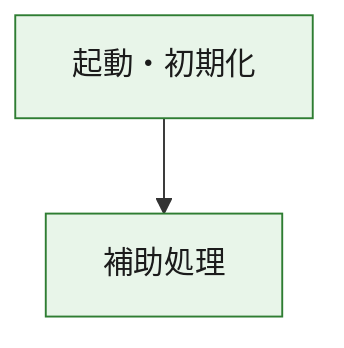
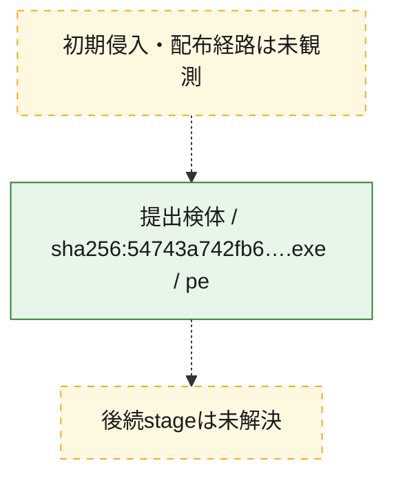
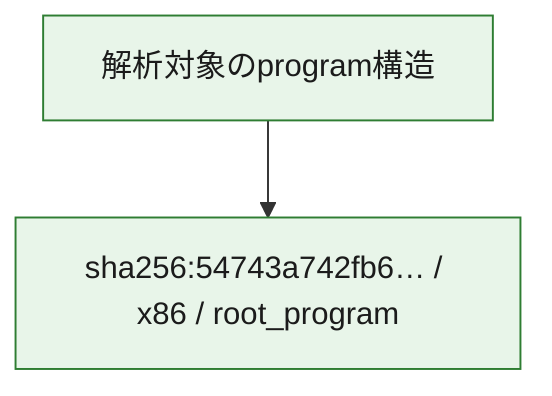

# 全体ロジック：54743a742fb662febeb0d12b275f7e8e52554daf33c80ccfdd80c27a72f0de50

代表関数の静的証跡から、起動・初期化の処理群を確認しました。

## 読み方

- phaseの掲載順は解析上の整理順です。observed_call_edgesがない段階間の実行順を断定しません。
- 図の実線は静的に観測した関係、点線と黄色のノードは未観測・未解決の関係を示します。
- 図は静的な要約であり、動的実行を再現するものではありません。
- 詳細な関数解説とfingerprintは[STATIC-LOGIC.md](STATIC-LOGIC.md)を参照してください。

## 静的可視化

### 実行フロー

### 感染チェーン

### モジュール関係

## 処理段階

### 1. 起動・初期化

entry pointから初期化と後続処理への移行を確認します。
確度: `confirmed_static_function_evidence`

- `54743a742fb662febeb0d12b275f7e8e52554daf33c80ccfdd80c27a72f0de50:ghidra:180001010` — 初期化と主要処理への分岐を行う入口関数です。 状態: `succeeded`、選定理由: `entry_point`, `meaningful_symbol_name`, `reviewed_call_centrality:22`, `role:entrypoint`, `small_program_complete_context`

### 2. 補助処理

主要処理を支える一般内部関数またはlibrary処理を確認します。
確度: `confirmed_static_function_evidence`

- `54743a742fb662febeb0d12b275f7e8e52554daf33c80ccfdd80c27a72f0de50:ghidra:180001240` — 検体内部の一般処理を実装する関数です。 状態: `succeeded`、選定理由: `context_representative`, `reviewed_call_centrality:2`, `small_program_complete_context`
- `54743a742fb662febeb0d12b275f7e8e52554daf33c80ccfdd80c27a72f0de50:ghidra:180001350` — 検体内部の一般処理を実装する関数です。 状態: `succeeded`、選定理由: `context_representative`, `reviewed_call_centrality:25`, `small_program_complete_context`
- `54743a742fb662febeb0d12b275f7e8e52554daf33c80ccfdd80c27a72f0de50:ghidra:180003780` — 検体内部の一般処理を実装する関数です。 状態: `succeeded`、選定理由: `context_representative`, `reviewed_call_centrality:2`, `small_program_complete_context`
- `54743a742fb662febeb0d12b275f7e8e52554daf33c80ccfdd80c27a72f0de50:ghidra:1800038e0` — 検体内部の一般処理を実装する関数です。 状態: `succeeded`、選定理由: `context_representative`, `reviewed_call_centrality:2`, `small_program_complete_context`

## 観測したcall関係

- `54743a742fb662febeb0d12b275f7e8e52554daf33c80ccfdd80c27a72f0de50:ghidra:180001010` → `54743a742fb662febeb0d12b275f7e8e52554daf33c80ccfdd80c27a72f0de50:ghidra:180001240` （`startup` → `support`）
- `54743a742fb662febeb0d12b275f7e8e52554daf33c80ccfdd80c27a72f0de50:ghidra:180001010` → `54743a742fb662febeb0d12b275f7e8e52554daf33c80ccfdd80c27a72f0de50:ghidra:180001350` （`startup` → `support`）
- `54743a742fb662febeb0d12b275f7e8e52554daf33c80ccfdd80c27a72f0de50:ghidra:180001350` → `54743a742fb662febeb0d12b275f7e8e52554daf33c80ccfdd80c27a72f0de50:ghidra:180001240` （`support` → `support`）
- `54743a742fb662febeb0d12b275f7e8e52554daf33c80ccfdd80c27a72f0de50:ghidra:180001350` → `54743a742fb662febeb0d12b275f7e8e52554daf33c80ccfdd80c27a72f0de50:ghidra:180003780` （`support` → `support`）
- `54743a742fb662febeb0d12b275f7e8e52554daf33c80ccfdd80c27a72f0de50:ghidra:180001350` → `54743a742fb662febeb0d12b275f7e8e52554daf33c80ccfdd80c27a72f0de50:ghidra:1800038e0` （`support` → `support`）
- `54743a742fb662febeb0d12b275f7e8e52554daf33c80ccfdd80c27a72f0de50:ghidra:180003780` → `54743a742fb662febeb0d12b275f7e8e52554daf33c80ccfdd80c27a72f0de50:ghidra:1800038e0` （`support` → `support`）
- `ghidra-function:74c93eeeb5f3ee012e2ef960` → `ghidra-function:b195a7dd2a9fc0bb2b5c3cff` （`unclassified` → `unclassified`）
- `ghidra-function:9994984f9bc0dc4772ba1dee` → `ghidra-function:10fc223b4fa192cbaed32821` （`unclassified` → `unclassified`）
- `ghidra-function:9994984f9bc0dc4772ba1dee` → `ghidra-function:1b2216994cfd3edccb85907e` （`unclassified` → `unclassified`）
- `ghidra-function:9994984f9bc0dc4772ba1dee` → `ghidra-function:305773ec28909a2b447b2dab` （`unclassified` → `unclassified`）
- `ghidra-function:9994984f9bc0dc4772ba1dee` → `ghidra-function:457ffc179741b20cd6c1dc8a` （`unclassified` → `unclassified`）
- `ghidra-function:9994984f9bc0dc4772ba1dee` → `ghidra-function:5437e1e2123fd0e1f680a0b9` （`unclassified` → `unclassified`）
- `ghidra-function:9994984f9bc0dc4772ba1dee` → `ghidra-function:7ced5d71ce6dc40679d28d0d` （`unclassified` → `unclassified`）
- `ghidra-function:9994984f9bc0dc4772ba1dee` → `ghidra-function:7ea6742200f80b0b74fa2b6c` （`unclassified` → `unclassified`）
- `ghidra-function:9994984f9bc0dc4772ba1dee` → `ghidra-function:9cb01d9201635733af0f508c` （`unclassified` → `unclassified`）
- `ghidra-function:9994984f9bc0dc4772ba1dee` → `ghidra-function:a0499576ddadde455af14b43` （`unclassified` → `unclassified`）
- `ghidra-function:9994984f9bc0dc4772ba1dee` → `ghidra-function:bb69f65fb98b5fda432f77b9` （`unclassified` → `unclassified`）
- `ghidra-function:9994984f9bc0dc4772ba1dee` → `ghidra-function:c741f6a9ab9541cd42d15d48` （`unclassified` → `unclassified`）
- `ghidra-function:9994984f9bc0dc4772ba1dee` → `ghidra-function:cb5885e8e373088fa31673d3` （`unclassified` → `unclassified`）
- `ghidra-function:a0499576ddadde455af14b43` → `ghidra-external:1e216599b130cfcf50c787fd` （`unclassified` → `unclassified`）
- `ghidra-function:a0499576ddadde455af14b43` → `ghidra-external:23bc56d1de93f6e38d895057` （`unclassified` → `unclassified`）
- `ghidra-function:a0499576ddadde455af14b43` → `ghidra-external:25fe48bb02e8dd680f4e81e6` （`unclassified` → `unclassified`）
- `ghidra-function:a0499576ddadde455af14b43` → `ghidra-external:26ce99008a78e0456eb190af` （`unclassified` → `unclassified`）
- `ghidra-function:a0499576ddadde455af14b43` → `ghidra-external:3b5e9988d62eb0e9bc48a770` （`unclassified` → `unclassified`）
- `ghidra-function:a0499576ddadde455af14b43` → `ghidra-external:5446f2d399e6076e0c56f3d0` （`unclassified` → `unclassified`）
- `ghidra-function:a0499576ddadde455af14b43` → `ghidra-external:6a7c16c28ec3a781b40a7681` （`unclassified` → `unclassified`）
- `ghidra-function:a0499576ddadde455af14b43` → `ghidra-external:6af3c7bba02c309031d9e9be` （`unclassified` → `unclassified`）
- `ghidra-function:a0499576ddadde455af14b43` → `ghidra-external:7202535ad8bccead7676d860` （`unclassified` → `unclassified`）
- `ghidra-function:a0499576ddadde455af14b43` → `ghidra-external:a504284ceaf2780e95e62c9f` （`unclassified` → `unclassified`）
- `ghidra-function:a0499576ddadde455af14b43` → `ghidra-external:a7540043db20f17fdd082933` （`unclassified` → `unclassified`）
- `ghidra-function:a0499576ddadde455af14b43` → `ghidra-external:aa23385bd649b3ab4533c5e1` （`unclassified` → `unclassified`）
- `ghidra-function:a0499576ddadde455af14b43` → `ghidra-external:aff9782fdfc570f723c255d2` （`unclassified` → `unclassified`）
- `ghidra-function:a0499576ddadde455af14b43` → `ghidra-external:be2a6b33b92649c9b33ee241` （`unclassified` → `unclassified`）
- `ghidra-function:a0499576ddadde455af14b43` → `ghidra-external:bedbd919c8536a41066b7f2d` （`unclassified` → `unclassified`）
- `ghidra-function:a0499576ddadde455af14b43` → `ghidra-external:d251e278ae70f280f818e0c1` （`unclassified` → `unclassified`）
- `ghidra-function:a0499576ddadde455af14b43` → `ghidra-external:d9fdc2e1731df1c10aef898c` （`unclassified` → `unclassified`）
- `ghidra-function:a0499576ddadde455af14b43` → `ghidra-external:df58c8e5a05ed97afe87231e` （`unclassified` → `unclassified`）
- `ghidra-function:a0499576ddadde455af14b43` → `ghidra-external:e02f832aa6c3921dbfd1bf19` （`unclassified` → `unclassified`）
- `ghidra-function:a0499576ddadde455af14b43` → `ghidra-external:f9beb9f8123151fcef4e0cc8` （`unclassified` → `unclassified`）
- `ghidra-function:a0499576ddadde455af14b43` → `ghidra-external:fe772ddeba0227f0665e9f60` （`unclassified` → `unclassified`）
- `ghidra-function:a0499576ddadde455af14b43` → `ghidra-function:10fc223b4fa192cbaed32821` （`unclassified` → `unclassified`）
- `ghidra-function:a0499576ddadde455af14b43` → `ghidra-function:74c93eeeb5f3ee012e2ef960` （`unclassified` → `unclassified`）
- `ghidra-function:a0499576ddadde455af14b43` → `ghidra-function:b195a7dd2a9fc0bb2b5c3cff` （`unclassified` → `unclassified`）

## 解析範囲と制約

- 選定外関数は全体inventoryへ残しますが、関数本体の個別解説対象にはしていません。
- indirect call、難読化、packer、VM、壊れたcontrol flowによりcall関係が欠落する場合があります。
- 文書は静的解析に基づき、検体実行や外部通信による動的確認は行っていません。
