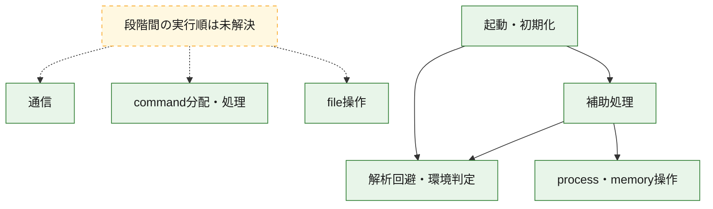
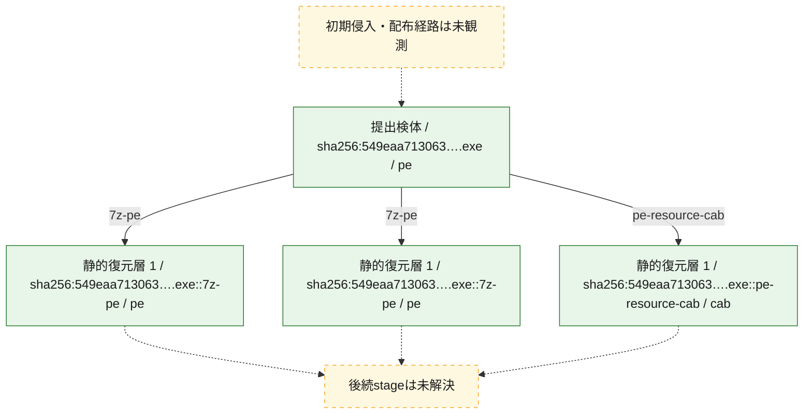
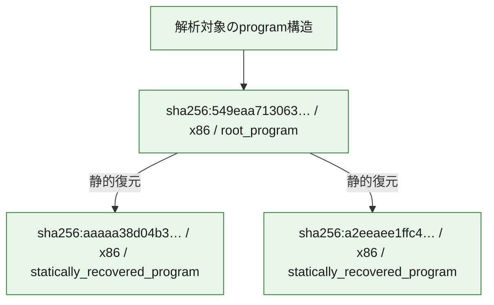

# 全体ロジック：549eaa713063504459dafab521d4f536e34ae6c090f7bb52acb7e74364256aaa

代表関数の静的証跡から、起動・初期化、解析回避・環境判定、process・memory操作、通信、command分配・処理、file操作の処理群を確認しました。

## 読み方

- phaseの掲載順は解析上の整理順です。observed_call_edgesがない段階間の実行順を断定しません。
- 図の実線は静的に観測した関係、点線と黄色のノードは未観測・未解決の関係を示します。
- 図は静的な要約であり、動的実行を再現するものではありません。
- 詳細な関数解説とfingerprintは[STATIC-LOGIC.md](STATIC-LOGIC.md)を参照してください。

## 静的可視化

### 実行フロー

### 感染チェーン

### モジュール関係

## 処理段階

### 1. 起動・初期化

entry pointから初期化と後続処理への移行を確認します。
確度: `confirmed_static_function_evidence`

- `aaaaa38d04b3b7652ba853136433e266e8caeb39355d6176477a8b4f543b149f:ghidra:1666313c0` — 初期化と主要処理への分岐を行う入口関数です。 状態: `succeeded`、選定理由: `entry_point`, `meaningful_symbol_name`, `reviewed_call_centrality:4`, `role:entrypoint`
- `a2eeaee1ffc481afd33544f651c392810d1dcc8d553d0c18ee18ef23fb316bd3:ghidra:1666513c0` — 初期化と主要処理への分岐を行う入口関数です。 状態: `succeeded`、選定理由: `entry_point`, `meaningful_symbol_name`, `reviewed_call_centrality:4`, `role:entrypoint`
- `549eaa713063504459dafab521d4f536e34ae6c090f7bb52acb7e74364256aaa:ghidra:140001300` — 初期化と主要処理への分岐を行う入口関数です。 状態: `succeeded`、選定理由: `entry_point`, `meaningful_symbol_name`, `reviewed_call_centrality:19`, `role:entrypoint`

### 2. 解析回避・環境判定

debugger、sandbox、仮想環境、時間差などの判定を確認します。
確度: `confirmed_static_function_evidence`

- `aaaaa38d04b3b7652ba853136433e266e8caeb39355d6176477a8b4f543b149f:ghidra:166631434` — debugger、仮想環境、sandbox、または時間差の確認に関係する関数です。 状態: `succeeded`、選定理由: `context_representative`, `reviewed_call_centrality:9`, `role:anti_analysis`
- `aaaaa38d04b3b7652ba853136433e266e8caeb39355d6176477a8b4f543b149f:ghidra:1666318f4` — debugger、仮想環境、sandbox、または時間差の確認に関係する関数です。 状態: `succeeded`、選定理由: `context_representative`, `reviewed_call_centrality:21`, `role:anti_analysis`
- `a2eeaee1ffc481afd33544f651c392810d1dcc8d553d0c18ee18ef23fb316bd3:ghidra:166651718` — debugger、仮想環境、sandbox、または時間差の確認に関係する関数です。 状態: `succeeded`、選定理由: `context_representative`, `reviewed_call_centrality:9`, `role:anti_analysis`
- `549eaa713063504459dafab521d4f536e34ae6c090f7bb52acb7e74364256aaa:ghidra:140001aa4` — debugger、仮想環境、sandbox、または時間差の確認に関係する関数です。 状態: `succeeded`、選定理由: `context_representative`, `reviewed_call_centrality:11`, `role:anti_analysis`

### 3. process・memory操作

process、thread、module、memory操作と実行移行を確認します。
確度: `confirmed_static_function_evidence`

- `549eaa713063504459dafab521d4f536e34ae6c090f7bb52acb7e74364256aaa:ghidra:140001bd8` — process、thread、module、またはmemory操作に関係する関数です。 状態: `succeeded`、選定理由: `context_representative`, `reviewed_call_centrality:28`, `role:process_or_memory_operation`
- `549eaa713063504459dafab521d4f536e34ae6c090f7bb52acb7e74364256aaa:ghidra:140002750` — process、thread、module、またはmemory操作に関係する関数です。 状態: `succeeded`、選定理由: `context_representative`, `reviewed_call_centrality:13`, `role:process_or_memory_operation`

### 4. 通信

通信初期化、endpoint処理、送受信の役割を確認します。
確度: `confirmed_static_function_evidence_with_limits`

- `a2eeaee1ffc481afd33544f651c392810d1dcc8d553d0c18ee18ef23fb316bd3:ghidra:166652263` — 通信初期化、送受信、またはendpoint処理に関係する関数です。 状態: `limited_bad_instruction_or_flow`、選定理由: `meaningful_symbol_name`, `reviewed_call_centrality:1`, `role:network_communication`

### 5. command分配・処理

受信commandやtaskの解釈、分配、個別handlerへの移行を確認します。
確度: `confirmed_static_function_evidence_with_limits`

- `aaaaa38d04b3b7652ba853136433e266e8caeb39355d6176477a8b4f543b149f:ghidra:166633020` — commandの解釈、分配、または個別処理を担当する関数です。 状態: `limited_bad_instruction_or_flow`、選定理由: `meaningful_symbol_name`, `role:command_dispatch_or_handler`
- `a2eeaee1ffc481afd33544f651c392810d1dcc8d553d0c18ee18ef23fb316bd3:ghidra:166656bc0` — commandの解釈、分配、または個別処理を担当する関数です。 状態: `limited_bad_instruction_or_flow`、選定理由: `meaningful_symbol_name`, `role:command_dispatch_or_handler`
- `549eaa713063504459dafab521d4f536e34ae6c090f7bb52acb7e74364256aaa:ghidra:140009c40` — commandの解釈、分配、または個別処理を担当する関数です。 状態: `limited_bad_instruction_or_flow`、選定理由: `meaningful_symbol_name`, `role:command_dispatch_or_handler`

### 6. file操作

fileやdirectoryの作成、読書き、削除を確認します。
確度: `confirmed_static_function_evidence`

- `549eaa713063504459dafab521d4f536e34ae6c090f7bb52acb7e74364256aaa:ghidra:140002874` — fileまたはdirectoryの読書き・管理に関係する関数です。 状態: `succeeded`、選定理由: `context_representative`, `reviewed_call_centrality:18`, `role:file_operation`

### 7. 補助処理

主要処理を支える一般内部関数またはlibrary処理を確認します。
確度: `confirmed_static_function_evidence_with_limits`

- `aaaaa38d04b3b7652ba853136433e266e8caeb39355d6176477a8b4f543b149f:ghidra:166631010` — 検体内部の一般処理を実装する関数です。 状態: `succeeded`、選定理由: `context_representative`, `reviewed_call_centrality:2`
- `aaaaa38d04b3b7652ba853136433e266e8caeb39355d6176477a8b4f543b149f:ghidra:166631060` — 検体内部の一般処理を実装する関数です。 状態: `succeeded`、選定理由: `context_representative`, `reviewed_call_centrality:2`
- `aaaaa38d04b3b7652ba853136433e266e8caeb39355d6176477a8b4f543b149f:ghidra:166631090` — 検体内部の一般処理を実装する関数です。 状態: `succeeded`、選定理由: `context_representative`, `reviewed_call_centrality:25`
- `aaaaa38d04b3b7652ba853136433e266e8caeb39355d6176477a8b4f543b149f:ghidra:1666310e8` — 検体内部の一般処理を実装する関数です。 状態: `succeeded`、選定理由: `context_representative`, `reviewed_call_centrality:15`
- `aaaaa38d04b3b7652ba853136433e266e8caeb39355d6176477a8b4f543b149f:ghidra:166631200` — 検体内部の一般処理を実装する関数です。 状態: `succeeded`、選定理由: `context_representative`, `reviewed_call_centrality:9`
- `aaaaa38d04b3b7652ba853136433e266e8caeb39355d6176477a8b4f543b149f:ghidra:166631288` — 検体内部の一般処理を実装する関数です。 状態: `succeeded`、選定理由: `context_representative`, `reviewed_call_centrality:3`
- `aaaaa38d04b3b7652ba853136433e266e8caeb39355d6176477a8b4f543b149f:ghidra:166631410` — 検体内部の一般処理を実装する関数です。 状態: `succeeded`、選定理由: `context_representative`, `reviewed_call_centrality:5`
- `aaaaa38d04b3b7652ba853136433e266e8caeb39355d6176477a8b4f543b149f:ghidra:1666314ec` — 検体内部の一般処理を実装する関数です。 状態: `succeeded`、選定理由: `context_representative`, `reviewed_call_centrality:4`
- `aaaaa38d04b3b7652ba853136433e266e8caeb39355d6176477a8b4f543b149f:ghidra:166631540` — 検体内部の一般処理を実装する関数です。 状態: `succeeded`、選定理由: `context_representative`, `reviewed_call_centrality:4`
- `aaaaa38d04b3b7652ba853136433e266e8caeb39355d6176477a8b4f543b149f:ghidra:166631564` — 検体内部の一般処理を実装する関数です。 状態: `succeeded`、選定理由: `context_representative`, `reviewed_call_centrality:6`
- `aaaaa38d04b3b7652ba853136433e266e8caeb39355d6176477a8b4f543b149f:ghidra:1666315a4` — 検体内部の一般処理を実装する関数です。 状態: `succeeded`、選定理由: `context_representative`, `reviewed_call_centrality:7`
- `aaaaa38d04b3b7652ba853136433e266e8caeb39355d6176477a8b4f543b149f:ghidra:1666315e0` — 検体内部の一般処理を実装する関数です。 状態: `succeeded`、選定理由: `context_representative`, `reviewed_call_centrality:3`
- `aaaaa38d04b3b7652ba853136433e266e8caeb39355d6176477a8b4f543b149f:ghidra:1666315fc` — 検体内部の一般処理を実装する関数です。 状態: `succeeded`、選定理由: `context_representative`, `reviewed_call_centrality:2`
- `aaaaa38d04b3b7652ba853136433e266e8caeb39355d6176477a8b4f543b149f:ghidra:16663162c` — 検体内部の一般処理を実装する関数です。 状態: `succeeded`、選定理由: `context_representative`, `reviewed_call_centrality:2`
- `aaaaa38d04b3b7652ba853136433e266e8caeb39355d6176477a8b4f543b149f:ghidra:166631648` — 検体内部の一般処理を実装する関数です。 状態: `limited_bad_instruction_or_flow`、選定理由: `context_representative`, `reviewed_call_centrality:4`
- `aaaaa38d04b3b7652ba853136433e266e8caeb39355d6176477a8b4f543b149f:ghidra:1666316b0` — 検体内部の一般処理を実装する関数です。 状態: `limited_bad_instruction_or_flow`、選定理由: `context_representative`, `reviewed_call_centrality:7`
- `aaaaa38d04b3b7652ba853136433e266e8caeb39355d6176477a8b4f543b149f:ghidra:1666316e8` — 検体内部の一般処理を実装する関数です。 状態: `succeeded`、選定理由: `context_representative`, `reviewed_call_centrality:3`
- `aaaaa38d04b3b7652ba853136433e266e8caeb39355d6176477a8b4f543b149f:ghidra:166631704` — 検体内部の一般処理を実装する関数です。 状態: `succeeded`、選定理由: `context_representative`, `reviewed_call_centrality:4`
- `aaaaa38d04b3b7652ba853136433e266e8caeb39355d6176477a8b4f543b149f:ghidra:166631744` — 検体内部の一般処理を実装する関数です。 状態: `succeeded`、選定理由: `context_representative`, `reviewed_call_centrality:5`
- `aaaaa38d04b3b7652ba853136433e266e8caeb39355d6176477a8b4f543b149f:ghidra:1666317d8` — 検体内部の一般処理を実装する関数です。 状態: `succeeded`、選定理由: `context_representative`, `reviewed_call_centrality:4`
- `aaaaa38d04b3b7652ba853136433e266e8caeb39355d6176477a8b4f543b149f:ghidra:166631878` — 検体内部の一般処理を実装する関数です。 状態: `succeeded`、選定理由: `context_representative`, `reviewed_call_centrality:6`
- `aaaaa38d04b3b7652ba853136433e266e8caeb39355d6176477a8b4f543b149f:ghidra:1666318a4` — 検体内部の一般処理を実装する関数です。 状態: `succeeded`、選定理由: `context_representative`, `reviewed_call_centrality:3`
- `aaaaa38d04b3b7652ba853136433e266e8caeb39355d6176477a8b4f543b149f:ghidra:166631a5c` — 検体内部の一般処理を実装する関数です。 状態: `succeeded`、選定理由: `context_representative`, `reviewed_call_centrality:3`
- `aaaaa38d04b3b7652ba853136433e266e8caeb39355d6176477a8b4f543b149f:ghidra:166631aa0` — 検体内部の一般処理を実装する関数です。 状態: `succeeded`、選定理由: `context_representative`, `reviewed_call_centrality:3`
- `aaaaa38d04b3b7652ba853136433e266e8caeb39355d6176477a8b4f543b149f:ghidra:166631ae8` — 検体内部の一般処理を実装する関数です。 状態: `limited_bad_instruction_or_flow`、選定理由: `context_representative`, `reviewed_call_centrality:10`
- `aaaaa38d04b3b7652ba853136433e266e8caeb39355d6176477a8b4f543b149f:ghidra:166631b30` — 検体内部の一般処理を実装する関数です。 状態: `succeeded`、選定理由: `context_representative`, `reviewed_call_centrality:5`
- `aaaaa38d04b3b7652ba853136433e266e8caeb39355d6176477a8b4f543b149f:ghidra:166631e70` — 検体内部の一般処理を実装する関数です。 状態: `succeeded`、選定理由: `meaningful_symbol_name`
- `aaaaa38d04b3b7652ba853136433e266e8caeb39355d6176477a8b4f543b149f:ghidra:166631f30` — 検体内部の一般処理を実装する関数です。 状態: `succeeded`、選定理由: `entry_point`, `meaningful_symbol_name`, `reviewed_call_centrality:15`
- `a2eeaee1ffc481afd33544f651c392810d1dcc8d553d0c18ee18ef23fb316bd3:ghidra:166651010` — 検体内部の一般処理を実装する関数です。 状態: `succeeded`、選定理由: `context_representative`, `reviewed_call_centrality:2`
- `a2eeaee1ffc481afd33544f651c392810d1dcc8d553d0c18ee18ef23fb316bd3:ghidra:166651060` — 検体内部の一般処理を実装する関数です。 状態: `succeeded`、選定理由: `context_representative`, `reviewed_call_centrality:2`
- `a2eeaee1ffc481afd33544f651c392810d1dcc8d553d0c18ee18ef23fb316bd3:ghidra:166651090` — 検体内部の一般処理を実装する関数です。 状態: `succeeded`、選定理由: `context_representative`, `reviewed_call_centrality:25`
- `a2eeaee1ffc481afd33544f651c392810d1dcc8d553d0c18ee18ef23fb316bd3:ghidra:1666510e8` — 検体内部の一般処理を実装する関数です。 状態: `succeeded`、選定理由: `context_representative`, `reviewed_call_centrality:15`
- `a2eeaee1ffc481afd33544f651c392810d1dcc8d553d0c18ee18ef23fb316bd3:ghidra:166651200` — 検体内部の一般処理を実装する関数です。 状態: `succeeded`、選定理由: `context_representative`, `reviewed_call_centrality:9`
- `a2eeaee1ffc481afd33544f651c392810d1dcc8d553d0c18ee18ef23fb316bd3:ghidra:166651288` — 検体内部の一般処理を実装する関数です。 状態: `succeeded`、選定理由: `context_representative`, `reviewed_call_centrality:3`
- `a2eeaee1ffc481afd33544f651c392810d1dcc8d553d0c18ee18ef23fb316bd3:ghidra:166651410` — 検体内部の一般処理を実装する関数です。 状態: `succeeded`、選定理由: `context_representative`, `reviewed_call_centrality:5`
- `a2eeaee1ffc481afd33544f651c392810d1dcc8d553d0c18ee18ef23fb316bd3:ghidra:166651434` — 検体内部の一般処理を実装する関数です。 状態: `limited_bad_instruction_or_flow`、選定理由: `context_representative`, `reviewed_call_centrality:11`
- `a2eeaee1ffc481afd33544f651c392810d1dcc8d553d0c18ee18ef23fb316bd3:ghidra:166651470` — 検体内部の一般処理を実装する関数です。 状態: `succeeded`、選定理由: `context_representative`, `reviewed_call_centrality:5`
- `a2eeaee1ffc481afd33544f651c392810d1dcc8d553d0c18ee18ef23fb316bd3:ghidra:166651548` — 検体内部の一般処理を実装する関数です。 状態: `succeeded`、選定理由: `context_representative`, `reviewed_call_centrality:1`
- `a2eeaee1ffc481afd33544f651c392810d1dcc8d553d0c18ee18ef23fb316bd3:ghidra:166651564` — 検体内部の一般処理を実装する関数です。 状態: `succeeded`、選定理由: `context_representative`, `reviewed_call_centrality:6`
- `a2eeaee1ffc481afd33544f651c392810d1dcc8d553d0c18ee18ef23fb316bd3:ghidra:166651608` — 検体内部の一般処理を実装する関数です。 状態: `succeeded`、選定理由: `context_representative`, `reviewed_call_centrality:7`
- `a2eeaee1ffc481afd33544f651c392810d1dcc8d553d0c18ee18ef23fb316bd3:ghidra:16665168c` — 検体内部の一般処理を実装する関数です。 状態: `succeeded`、選定理由: `context_representative`, `reviewed_call_centrality:8`
- `a2eeaee1ffc481afd33544f651c392810d1dcc8d553d0c18ee18ef23fb316bd3:ghidra:1666517d0` — 検体内部の一般処理を実装する関数です。 状態: `succeeded`、選定理由: `context_representative`, `reviewed_call_centrality:4`
- `a2eeaee1ffc481afd33544f651c392810d1dcc8d553d0c18ee18ef23fb316bd3:ghidra:166651824` — 検体内部の一般処理を実装する関数です。 状態: `succeeded`、選定理由: `context_representative`, `reviewed_call_centrality:4`
- `a2eeaee1ffc481afd33544f651c392810d1dcc8d553d0c18ee18ef23fb316bd3:ghidra:166651848` — 検体内部の一般処理を実装する関数です。 状態: `succeeded`、選定理由: `context_representative`, `reviewed_call_centrality:6`
- `a2eeaee1ffc481afd33544f651c392810d1dcc8d553d0c18ee18ef23fb316bd3:ghidra:166651888` — 検体内部の一般処理を実装する関数です。 状態: `succeeded`、選定理由: `context_representative`, `reviewed_call_centrality:7`
- `a2eeaee1ffc481afd33544f651c392810d1dcc8d553d0c18ee18ef23fb316bd3:ghidra:166651fa0` — 検体内部の一般処理を実装する関数です。 状態: `succeeded`、選定理由: `meaningful_symbol_name`
- `a2eeaee1ffc481afd33544f651c392810d1dcc8d553d0c18ee18ef23fb316bd3:ghidra:166652129` — 検体内部の一般処理を実装する関数です。 状態: `limited_bad_instruction_or_flow`、選定理由: `meaningful_symbol_name`, `reviewed_call_centrality:1`
- `a2eeaee1ffc481afd33544f651c392810d1dcc8d553d0c18ee18ef23fb316bd3:ghidra:1666521b4` — 検体内部の一般処理を実装する関数です。 状態: `limited_bad_instruction_or_flow`、選定理由: `meaningful_symbol_name`, `reviewed_call_centrality:1`
- `a2eeaee1ffc481afd33544f651c392810d1dcc8d553d0c18ee18ef23fb316bd3:ghidra:1666521c6` — 検体内部の一般処理を実装する関数です。 状態: `limited_bad_instruction_or_flow`、選定理由: `meaningful_symbol_name`, `reviewed_call_centrality:1`
- `a2eeaee1ffc481afd33544f651c392810d1dcc8d553d0c18ee18ef23fb316bd3:ghidra:1666521d8` — 検体内部の一般処理を実装する関数です。 状態: `limited_bad_instruction_or_flow`、選定理由: `meaningful_symbol_name`, `reviewed_call_centrality:1`
- `a2eeaee1ffc481afd33544f651c392810d1dcc8d553d0c18ee18ef23fb316bd3:ghidra:1666522ee` — 検体内部の一般処理を実装する関数です。 状態: `limited_bad_instruction_or_flow`、選定理由: `meaningful_symbol_name`, `reviewed_call_centrality:1`
- `a2eeaee1ffc481afd33544f651c392810d1dcc8d553d0c18ee18ef23fb316bd3:ghidra:166652379` — 検体内部の一般処理を実装する関数です。 状態: `limited_bad_instruction_or_flow`、選定理由: `meaningful_symbol_name`, `reviewed_call_centrality:1`
- `a2eeaee1ffc481afd33544f651c392810d1dcc8d553d0c18ee18ef23fb316bd3:ghidra:16665238b` — 検体内部の一般処理を実装する関数です。 状態: `limited_bad_instruction_or_flow`、選定理由: `meaningful_symbol_name`, `reviewed_call_centrality:1`
- `a2eeaee1ffc481afd33544f651c392810d1dcc8d553d0c18ee18ef23fb316bd3:ghidra:166652416` — 検体内部の一般処理を実装する関数です。 状態: `limited_bad_instruction_or_flow`、選定理由: `meaningful_symbol_name`, `reviewed_call_centrality:1`
- `a2eeaee1ffc481afd33544f651c392810d1dcc8d553d0c18ee18ef23fb316bd3:ghidra:166652428` — 検体内部の一般処理を実装する関数です。 状態: `limited_bad_instruction_or_flow`、選定理由: `meaningful_symbol_name`, `reviewed_call_centrality:1`
- `a2eeaee1ffc481afd33544f651c392810d1dcc8d553d0c18ee18ef23fb316bd3:ghidra:166652460` — 検体内部の一般処理を実装する関数です。 状態: `succeeded`、選定理由: `entry_point`, `meaningful_symbol_name`, `reviewed_call_centrality:17`
- `549eaa713063504459dafab521d4f536e34ae6c090f7bb52acb7e74364256aaa:ghidra:140001008` — 検体内部の一般処理を実装する関数です。 状態: `succeeded`、選定理由: `context_representative`, `reviewed_call_centrality:11`
- `549eaa713063504459dafab521d4f536e34ae6c090f7bb52acb7e74364256aaa:ghidra:140001150` — 検体内部の一般処理を実装する関数です。 状態: `succeeded`、選定理由: `context_representative`, `reviewed_call_centrality:1`
- `549eaa713063504459dafab521d4f536e34ae6c090f7bb52acb7e74364256aaa:ghidra:1400011d0` — 検体内部の一般処理を実装する関数です。 状態: `succeeded`、選定理由: `context_representative`, `reviewed_call_centrality:7`
- `549eaa713063504459dafab521d4f536e34ae6c090f7bb52acb7e74364256aaa:ghidra:1400012b0` — 検体内部の一般処理を実装する関数です。 状態: `succeeded`、選定理由: `context_representative`, `reviewed_call_centrality:2`
- `549eaa713063504459dafab521d4f536e34ae6c090f7bb52acb7e74364256aaa:ghidra:140001318` — 検体内部の一般処理を実装する関数です。 状態: `succeeded`、選定理由: `context_representative`, `reviewed_call_centrality:18`
- `549eaa713063504459dafab521d4f536e34ae6c090f7bb52acb7e74364256aaa:ghidra:140001578` — 検体内部の一般処理を実装する関数です。 状態: `limited_bad_instruction_or_flow`、選定理由: `context_representative`, `reviewed_call_centrality:10`
- `549eaa713063504459dafab521d4f536e34ae6c090f7bb52acb7e74364256aaa:ghidra:1400015c0` — 検体内部の一般処理を実装する関数です。 状態: `succeeded`、選定理由: `context_representative`, `reviewed_call_centrality:7`
- `549eaa713063504459dafab521d4f536e34ae6c090f7bb52acb7e74364256aaa:ghidra:140001764` — 検体内部の一般処理を実装する関数です。 状態: `succeeded`、選定理由: `context_representative`, `reviewed_call_centrality:7`
- `549eaa713063504459dafab521d4f536e34ae6c090f7bb52acb7e74364256aaa:ghidra:140001890` — 検体内部の一般処理を実装する関数です。 状態: `succeeded`、選定理由: `context_representative`, `reviewed_call_centrality:2`
- `549eaa713063504459dafab521d4f536e34ae6c090f7bb52acb7e74364256aaa:ghidra:1400018d0` — 検体内部の一般処理を実装する関数です。 状態: `succeeded`、選定理由: `context_representative`, `reviewed_call_centrality:2`
- `549eaa713063504459dafab521d4f536e34ae6c090f7bb52acb7e74364256aaa:ghidra:1400018fc` — 検体内部の一般処理を実装する関数です。 状態: `succeeded`、選定理由: `context_representative`, `reviewed_call_centrality:1`
- `549eaa713063504459dafab521d4f536e34ae6c090f7bb52acb7e74364256aaa:ghidra:140001958` — 検体内部の一般処理を実装する関数です。 状態: `succeeded`、選定理由: `context_representative`, `reviewed_call_centrality:4`
- `549eaa713063504459dafab521d4f536e34ae6c090f7bb52acb7e74364256aaa:ghidra:1400019b0` — 検体内部の一般処理を実装する関数です。 状態: `succeeded`、選定理由: `context_representative`, `reviewed_call_centrality:1`
- `549eaa713063504459dafab521d4f536e34ae6c090f7bb52acb7e74364256aaa:ghidra:140001a10` — 検体内部の一般処理を実装する関数です。 状態: `succeeded`、選定理由: `context_representative`, `reviewed_call_centrality:4`
- `549eaa713063504459dafab521d4f536e34ae6c090f7bb52acb7e74364256aaa:ghidra:140001bc0` — 検体内部の一般処理を実装する関数です。 状態: `succeeded`、選定理由: `meaningful_symbol_name`
- `549eaa713063504459dafab521d4f536e34ae6c090f7bb52acb7e74364256aaa:ghidra:140001f2c` — 検体内部の一般処理を実装する関数です。 状態: `succeeded`、選定理由: `context_representative`, `reviewed_call_centrality:21`
- `549eaa713063504459dafab521d4f536e34ae6c090f7bb52acb7e74364256aaa:ghidra:1400024f4` — 検体内部の一般処理を実装する関数です。 状態: `succeeded`、選定理由: `context_representative`, `reviewed_call_centrality:15`
- `549eaa713063504459dafab521d4f536e34ae6c090f7bb52acb7e74364256aaa:ghidra:140002a84` — 検体内部の一般処理を実装する関数です。 状態: `succeeded`、選定理由: `context_representative`, `reviewed_call_centrality:3`
- `549eaa713063504459dafab521d4f536e34ae6c090f7bb52acb7e74364256aaa:ghidra:140002ba8` — 検体内部の一般処理を実装する関数です。 状態: `succeeded`、選定理由: `context_representative`, `reviewed_call_centrality:1`
- `549eaa713063504459dafab521d4f536e34ae6c090f7bb52acb7e74364256aaa:ghidra:140002bdc` — 検体内部の一般処理を実装する関数です。 状態: `succeeded`、選定理由: `context_representative`, `reviewed_call_centrality:13`
- `549eaa713063504459dafab521d4f536e34ae6c090f7bb52acb7e74364256aaa:ghidra:140002e64` — 検体内部の一般処理を実装する関数です。 状態: `succeeded`、選定理由: `context_representative`, `reviewed_call_centrality:2`
- `549eaa713063504459dafab521d4f536e34ae6c090f7bb52acb7e74364256aaa:ghidra:140002f00` — 検体内部の一般処理を実装する関数です。 状態: `succeeded`、選定理由: `context_representative`, `reviewed_call_centrality:19`
- `549eaa713063504459dafab521d4f536e34ae6c090f7bb52acb7e74364256aaa:ghidra:140003160` — 検体内部の一般処理を実装する関数です。 状態: `succeeded`、選定理由: `context_representative`, `reviewed_call_centrality:6`
- `549eaa713063504459dafab521d4f536e34ae6c090f7bb52acb7e74364256aaa:ghidra:14000321c` — 検体内部の一般処理を実装する関数です。 状態: `succeeded`、選定理由: `context_representative`, `reviewed_call_centrality:12`
- `549eaa713063504459dafab521d4f536e34ae6c090f7bb52acb7e74364256aaa:ghidra:1400032f0` — 検体内部の一般処理を実装する関数です。 状態: `succeeded`、選定理由: `context_representative`, `reviewed_call_centrality:22`
- `549eaa713063504459dafab521d4f536e34ae6c090f7bb52acb7e74364256aaa:ghidra:1400034f8` — 検体内部の一般処理を実装する関数です。 状態: `succeeded`、選定理由: `context_representative`, `reviewed_call_centrality:4`

## 観測したcall関係

- `549eaa713063504459dafab521d4f536e34ae6c090f7bb52acb7e74364256aaa:ghidra:1400011d0` → `549eaa713063504459dafab521d4f536e34ae6c090f7bb52acb7e74364256aaa:ghidra:140001958` （`support` → `support`）
- `549eaa713063504459dafab521d4f536e34ae6c090f7bb52acb7e74364256aaa:ghidra:1400011d0` → `549eaa713063504459dafab521d4f536e34ae6c090f7bb52acb7e74364256aaa:ghidra:1400019b0` （`support` → `support`）
- `549eaa713063504459dafab521d4f536e34ae6c090f7bb52acb7e74364256aaa:ghidra:140001300` → `549eaa713063504459dafab521d4f536e34ae6c090f7bb52acb7e74364256aaa:ghidra:140001a10` （`startup` → `support`）
- `549eaa713063504459dafab521d4f536e34ae6c090f7bb52acb7e74364256aaa:ghidra:140001300` → `549eaa713063504459dafab521d4f536e34ae6c090f7bb52acb7e74364256aaa:ghidra:140001aa4` （`startup` → `evasion`）
- `549eaa713063504459dafab521d4f536e34ae6c090f7bb52acb7e74364256aaa:ghidra:140001318` → `549eaa713063504459dafab521d4f536e34ae6c090f7bb52acb7e74364256aaa:ghidra:140001a10` （`support` → `support`）
- `549eaa713063504459dafab521d4f536e34ae6c090f7bb52acb7e74364256aaa:ghidra:1400015c0` → `549eaa713063504459dafab521d4f536e34ae6c090f7bb52acb7e74364256aaa:ghidra:140001578` （`support` → `support`）
- `549eaa713063504459dafab521d4f536e34ae6c090f7bb52acb7e74364256aaa:ghidra:140001764` → `549eaa713063504459dafab521d4f536e34ae6c090f7bb52acb7e74364256aaa:ghidra:140001578` （`support` → `support`）
- `549eaa713063504459dafab521d4f536e34ae6c090f7bb52acb7e74364256aaa:ghidra:140001958` → `549eaa713063504459dafab521d4f536e34ae6c090f7bb52acb7e74364256aaa:ghidra:1400018fc` （`support` → `support`）
- `549eaa713063504459dafab521d4f536e34ae6c090f7bb52acb7e74364256aaa:ghidra:140001f2c` → `549eaa713063504459dafab521d4f536e34ae6c090f7bb52acb7e74364256aaa:ghidra:140002bdc` （`support` → `support`）
- `549eaa713063504459dafab521d4f536e34ae6c090f7bb52acb7e74364256aaa:ghidra:140001f2c` → `549eaa713063504459dafab521d4f536e34ae6c090f7bb52acb7e74364256aaa:ghidra:140002e64` （`support` → `support`）
- `549eaa713063504459dafab521d4f536e34ae6c090f7bb52acb7e74364256aaa:ghidra:1400024f4` → `549eaa713063504459dafab521d4f536e34ae6c090f7bb52acb7e74364256aaa:ghidra:140002f00` （`support` → `support`）
- `549eaa713063504459dafab521d4f536e34ae6c090f7bb52acb7e74364256aaa:ghidra:1400032f0` → `549eaa713063504459dafab521d4f536e34ae6c090f7bb52acb7e74364256aaa:ghidra:140002750` （`support` → `execution`）
- `a2eeaee1ffc481afd33544f651c392810d1dcc8d553d0c18ee18ef23fb316bd3:ghidra:166651090` → `a2eeaee1ffc481afd33544f651c392810d1dcc8d553d0c18ee18ef23fb316bd3:ghidra:166651824` （`support` → `support`）
- `a2eeaee1ffc481afd33544f651c392810d1dcc8d553d0c18ee18ef23fb316bd3:ghidra:166651090` → `a2eeaee1ffc481afd33544f651c392810d1dcc8d553d0c18ee18ef23fb316bd3:ghidra:166651848` （`support` → `support`）
- `a2eeaee1ffc481afd33544f651c392810d1dcc8d553d0c18ee18ef23fb316bd3:ghidra:166651090` → `a2eeaee1ffc481afd33544f651c392810d1dcc8d553d0c18ee18ef23fb316bd3:ghidra:166651888` （`support` → `support`）
- `a2eeaee1ffc481afd33544f651c392810d1dcc8d553d0c18ee18ef23fb316bd3:ghidra:1666510e8` → `a2eeaee1ffc481afd33544f651c392810d1dcc8d553d0c18ee18ef23fb316bd3:ghidra:166651824` （`support` → `support`）
- `a2eeaee1ffc481afd33544f651c392810d1dcc8d553d0c18ee18ef23fb316bd3:ghidra:1666510e8` → `a2eeaee1ffc481afd33544f651c392810d1dcc8d553d0c18ee18ef23fb316bd3:ghidra:166651848` （`support` → `support`）
- `a2eeaee1ffc481afd33544f651c392810d1dcc8d553d0c18ee18ef23fb316bd3:ghidra:1666510e8` → `a2eeaee1ffc481afd33544f651c392810d1dcc8d553d0c18ee18ef23fb316bd3:ghidra:166651888` （`support` → `support`）
- `a2eeaee1ffc481afd33544f651c392810d1dcc8d553d0c18ee18ef23fb316bd3:ghidra:166651200` → `a2eeaee1ffc481afd33544f651c392810d1dcc8d553d0c18ee18ef23fb316bd3:ghidra:166651848` （`support` → `support`）
- `a2eeaee1ffc481afd33544f651c392810d1dcc8d553d0c18ee18ef23fb316bd3:ghidra:166651288` → `a2eeaee1ffc481afd33544f651c392810d1dcc8d553d0c18ee18ef23fb316bd3:ghidra:166651090` （`support` → `support`）
- `a2eeaee1ffc481afd33544f651c392810d1dcc8d553d0c18ee18ef23fb316bd3:ghidra:166651288` → `a2eeaee1ffc481afd33544f651c392810d1dcc8d553d0c18ee18ef23fb316bd3:ghidra:1666517d0` （`support` → `support`）
- `a2eeaee1ffc481afd33544f651c392810d1dcc8d553d0c18ee18ef23fb316bd3:ghidra:1666513c0` → `a2eeaee1ffc481afd33544f651c392810d1dcc8d553d0c18ee18ef23fb316bd3:ghidra:166651090` （`startup` → `support`）
- `a2eeaee1ffc481afd33544f651c392810d1dcc8d553d0c18ee18ef23fb316bd3:ghidra:1666513c0` → `a2eeaee1ffc481afd33544f651c392810d1dcc8d553d0c18ee18ef23fb316bd3:ghidra:166651718` （`startup` → `evasion`）
- `a2eeaee1ffc481afd33544f651c392810d1dcc8d553d0c18ee18ef23fb316bd3:ghidra:1666513c0` → `a2eeaee1ffc481afd33544f651c392810d1dcc8d553d0c18ee18ef23fb316bd3:ghidra:1666517d0` （`startup` → `support`）
- `a2eeaee1ffc481afd33544f651c392810d1dcc8d553d0c18ee18ef23fb316bd3:ghidra:166651410` → `a2eeaee1ffc481afd33544f651c392810d1dcc8d553d0c18ee18ef23fb316bd3:ghidra:166651434` （`support` → `support`）
- `a2eeaee1ffc481afd33544f651c392810d1dcc8d553d0c18ee18ef23fb316bd3:ghidra:166651410` → `a2eeaee1ffc481afd33544f651c392810d1dcc8d553d0c18ee18ef23fb316bd3:ghidra:16665168c` （`support` → `support`）
- `a2eeaee1ffc481afd33544f651c392810d1dcc8d553d0c18ee18ef23fb316bd3:ghidra:166651470` → `a2eeaee1ffc481afd33544f651c392810d1dcc8d553d0c18ee18ef23fb316bd3:ghidra:166651434` （`support` → `support`）
- `a2eeaee1ffc481afd33544f651c392810d1dcc8d553d0c18ee18ef23fb316bd3:ghidra:166651470` → `a2eeaee1ffc481afd33544f651c392810d1dcc8d553d0c18ee18ef23fb316bd3:ghidra:16665168c` （`support` → `support`）
- `a2eeaee1ffc481afd33544f651c392810d1dcc8d553d0c18ee18ef23fb316bd3:ghidra:166651548` → `a2eeaee1ffc481afd33544f651c392810d1dcc8d553d0c18ee18ef23fb316bd3:ghidra:166651564` （`support` → `support`）
- `a2eeaee1ffc481afd33544f651c392810d1dcc8d553d0c18ee18ef23fb316bd3:ghidra:166651564` → `a2eeaee1ffc481afd33544f651c392810d1dcc8d553d0c18ee18ef23fb316bd3:ghidra:166651434` （`support` → `support`）
- `a2eeaee1ffc481afd33544f651c392810d1dcc8d553d0c18ee18ef23fb316bd3:ghidra:166651564` → `a2eeaee1ffc481afd33544f651c392810d1dcc8d553d0c18ee18ef23fb316bd3:ghidra:166651608` （`support` → `support`）
- `aaaaa38d04b3b7652ba853136433e266e8caeb39355d6176477a8b4f543b149f:ghidra:166631090` → `aaaaa38d04b3b7652ba853136433e266e8caeb39355d6176477a8b4f543b149f:ghidra:166631540` （`support` → `support`）
- `aaaaa38d04b3b7652ba853136433e266e8caeb39355d6176477a8b4f543b149f:ghidra:166631090` → `aaaaa38d04b3b7652ba853136433e266e8caeb39355d6176477a8b4f543b149f:ghidra:166631564` （`support` → `support`）
- `aaaaa38d04b3b7652ba853136433e266e8caeb39355d6176477a8b4f543b149f:ghidra:166631090` → `aaaaa38d04b3b7652ba853136433e266e8caeb39355d6176477a8b4f543b149f:ghidra:1666315a4` （`support` → `support`）
- `aaaaa38d04b3b7652ba853136433e266e8caeb39355d6176477a8b4f543b149f:ghidra:166631090` → `aaaaa38d04b3b7652ba853136433e266e8caeb39355d6176477a8b4f543b149f:ghidra:1666315e0` （`support` → `support`）
- `aaaaa38d04b3b7652ba853136433e266e8caeb39355d6176477a8b4f543b149f:ghidra:166631090` → `aaaaa38d04b3b7652ba853136433e266e8caeb39355d6176477a8b4f543b149f:ghidra:1666315fc` （`support` → `support`）
- `aaaaa38d04b3b7652ba853136433e266e8caeb39355d6176477a8b4f543b149f:ghidra:166631090` → `aaaaa38d04b3b7652ba853136433e266e8caeb39355d6176477a8b4f543b149f:ghidra:16663162c` （`support` → `support`）
- `aaaaa38d04b3b7652ba853136433e266e8caeb39355d6176477a8b4f543b149f:ghidra:166631090` → `aaaaa38d04b3b7652ba853136433e266e8caeb39355d6176477a8b4f543b149f:ghidra:1666316b0` （`support` → `support`）
- `aaaaa38d04b3b7652ba853136433e266e8caeb39355d6176477a8b4f543b149f:ghidra:166631090` → `aaaaa38d04b3b7652ba853136433e266e8caeb39355d6176477a8b4f543b149f:ghidra:1666316e8` （`support` → `support`）
- `aaaaa38d04b3b7652ba853136433e266e8caeb39355d6176477a8b4f543b149f:ghidra:166631090` → `aaaaa38d04b3b7652ba853136433e266e8caeb39355d6176477a8b4f543b149f:ghidra:166631704` （`support` → `support`）
- `aaaaa38d04b3b7652ba853136433e266e8caeb39355d6176477a8b4f543b149f:ghidra:166631090` → `aaaaa38d04b3b7652ba853136433e266e8caeb39355d6176477a8b4f543b149f:ghidra:1666317d8` （`support` → `support`）
- `aaaaa38d04b3b7652ba853136433e266e8caeb39355d6176477a8b4f543b149f:ghidra:166631090` → `aaaaa38d04b3b7652ba853136433e266e8caeb39355d6176477a8b4f543b149f:ghidra:166631878` （`support` → `support`）
- `aaaaa38d04b3b7652ba853136433e266e8caeb39355d6176477a8b4f543b149f:ghidra:166631090` → `aaaaa38d04b3b7652ba853136433e266e8caeb39355d6176477a8b4f543b149f:ghidra:1666318a4` （`support` → `support`）
- `aaaaa38d04b3b7652ba853136433e266e8caeb39355d6176477a8b4f543b149f:ghidra:166631090` → `aaaaa38d04b3b7652ba853136433e266e8caeb39355d6176477a8b4f543b149f:ghidra:1666318f4` （`support` → `evasion`）
- `aaaaa38d04b3b7652ba853136433e266e8caeb39355d6176477a8b4f543b149f:ghidra:166631090` → `aaaaa38d04b3b7652ba853136433e266e8caeb39355d6176477a8b4f543b149f:ghidra:166631a5c` （`support` → `support`）
- `aaaaa38d04b3b7652ba853136433e266e8caeb39355d6176477a8b4f543b149f:ghidra:166631090` → `aaaaa38d04b3b7652ba853136433e266e8caeb39355d6176477a8b4f543b149f:ghidra:166631aa0` （`support` → `support`）
- `aaaaa38d04b3b7652ba853136433e266e8caeb39355d6176477a8b4f543b149f:ghidra:1666310e8` → `aaaaa38d04b3b7652ba853136433e266e8caeb39355d6176477a8b4f543b149f:ghidra:166631540` （`support` → `support`）
- `aaaaa38d04b3b7652ba853136433e266e8caeb39355d6176477a8b4f543b149f:ghidra:1666310e8` → `aaaaa38d04b3b7652ba853136433e266e8caeb39355d6176477a8b4f543b149f:ghidra:166631564` （`support` → `support`）
- `aaaaa38d04b3b7652ba853136433e266e8caeb39355d6176477a8b4f543b149f:ghidra:1666310e8` → `aaaaa38d04b3b7652ba853136433e266e8caeb39355d6176477a8b4f543b149f:ghidra:1666315a4` （`support` → `support`）
- `aaaaa38d04b3b7652ba853136433e266e8caeb39355d6176477a8b4f543b149f:ghidra:1666310e8` → `aaaaa38d04b3b7652ba853136433e266e8caeb39355d6176477a8b4f543b149f:ghidra:1666315e0` （`support` → `support`）
- `aaaaa38d04b3b7652ba853136433e266e8caeb39355d6176477a8b4f543b149f:ghidra:1666310e8` → `aaaaa38d04b3b7652ba853136433e266e8caeb39355d6176477a8b4f543b149f:ghidra:166631704` （`support` → `support`）
- `aaaaa38d04b3b7652ba853136433e266e8caeb39355d6176477a8b4f543b149f:ghidra:1666310e8` → `aaaaa38d04b3b7652ba853136433e266e8caeb39355d6176477a8b4f543b149f:ghidra:1666317d8` （`support` → `support`）
- `aaaaa38d04b3b7652ba853136433e266e8caeb39355d6176477a8b4f543b149f:ghidra:1666310e8` → `aaaaa38d04b3b7652ba853136433e266e8caeb39355d6176477a8b4f543b149f:ghidra:166631878` （`support` → `support`）
- `aaaaa38d04b3b7652ba853136433e266e8caeb39355d6176477a8b4f543b149f:ghidra:1666310e8` → `aaaaa38d04b3b7652ba853136433e266e8caeb39355d6176477a8b4f543b149f:ghidra:1666318f4` （`support` → `evasion`）
- `aaaaa38d04b3b7652ba853136433e266e8caeb39355d6176477a8b4f543b149f:ghidra:1666310e8` → `aaaaa38d04b3b7652ba853136433e266e8caeb39355d6176477a8b4f543b149f:ghidra:166631a5c` （`support` → `support`）
- `aaaaa38d04b3b7652ba853136433e266e8caeb39355d6176477a8b4f543b149f:ghidra:166631200` → `aaaaa38d04b3b7652ba853136433e266e8caeb39355d6176477a8b4f543b149f:ghidra:166631564` （`support` → `support`）
- `aaaaa38d04b3b7652ba853136433e266e8caeb39355d6176477a8b4f543b149f:ghidra:166631200` → `aaaaa38d04b3b7652ba853136433e266e8caeb39355d6176477a8b4f543b149f:ghidra:1666316b0` （`support` → `support`）
- `aaaaa38d04b3b7652ba853136433e266e8caeb39355d6176477a8b4f543b149f:ghidra:166631200` → `aaaaa38d04b3b7652ba853136433e266e8caeb39355d6176477a8b4f543b149f:ghidra:1666316e8` （`support` → `support`）
- `aaaaa38d04b3b7652ba853136433e266e8caeb39355d6176477a8b4f543b149f:ghidra:166631200` → `aaaaa38d04b3b7652ba853136433e266e8caeb39355d6176477a8b4f543b149f:ghidra:166631878` （`support` → `support`）
- `aaaaa38d04b3b7652ba853136433e266e8caeb39355d6176477a8b4f543b149f:ghidra:166631200` → `aaaaa38d04b3b7652ba853136433e266e8caeb39355d6176477a8b4f543b149f:ghidra:1666318a4` （`support` → `support`）
- `aaaaa38d04b3b7652ba853136433e266e8caeb39355d6176477a8b4f543b149f:ghidra:166631200` → `aaaaa38d04b3b7652ba853136433e266e8caeb39355d6176477a8b4f543b149f:ghidra:1666318f4` （`support` → `evasion`）
- `aaaaa38d04b3b7652ba853136433e266e8caeb39355d6176477a8b4f543b149f:ghidra:166631200` → `aaaaa38d04b3b7652ba853136433e266e8caeb39355d6176477a8b4f543b149f:ghidra:166631aa0` （`support` → `support`）
- `aaaaa38d04b3b7652ba853136433e266e8caeb39355d6176477a8b4f543b149f:ghidra:166631288` → `aaaaa38d04b3b7652ba853136433e266e8caeb39355d6176477a8b4f543b149f:ghidra:166631090` （`support` → `support`）
- `aaaaa38d04b3b7652ba853136433e266e8caeb39355d6176477a8b4f543b149f:ghidra:166631288` → `aaaaa38d04b3b7652ba853136433e266e8caeb39355d6176477a8b4f543b149f:ghidra:1666314ec` （`support` → `support`）
- `aaaaa38d04b3b7652ba853136433e266e8caeb39355d6176477a8b4f543b149f:ghidra:1666313c0` → `aaaaa38d04b3b7652ba853136433e266e8caeb39355d6176477a8b4f543b149f:ghidra:166631090` （`startup` → `support`）
- `aaaaa38d04b3b7652ba853136433e266e8caeb39355d6176477a8b4f543b149f:ghidra:1666313c0` → `aaaaa38d04b3b7652ba853136433e266e8caeb39355d6176477a8b4f543b149f:ghidra:166631434` （`startup` → `evasion`）
- `aaaaa38d04b3b7652ba853136433e266e8caeb39355d6176477a8b4f543b149f:ghidra:1666313c0` → `aaaaa38d04b3b7652ba853136433e266e8caeb39355d6176477a8b4f543b149f:ghidra:1666314ec` （`startup` → `support`）
- `aaaaa38d04b3b7652ba853136433e266e8caeb39355d6176477a8b4f543b149f:ghidra:166631410` → `aaaaa38d04b3b7652ba853136433e266e8caeb39355d6176477a8b4f543b149f:ghidra:166631ae8` （`support` → `support`）
- `aaaaa38d04b3b7652ba853136433e266e8caeb39355d6176477a8b4f543b149f:ghidra:1666315e0` → `aaaaa38d04b3b7652ba853136433e266e8caeb39355d6176477a8b4f543b149f:ghidra:166631744` （`support` → `support`）
- `aaaaa38d04b3b7652ba853136433e266e8caeb39355d6176477a8b4f543b149f:ghidra:166631744` → `aaaaa38d04b3b7652ba853136433e266e8caeb39355d6176477a8b4f543b149f:ghidra:1666318f4` （`support` → `evasion`）
- `aaaaa38d04b3b7652ba853136433e266e8caeb39355d6176477a8b4f543b149f:ghidra:166631b30` → `aaaaa38d04b3b7652ba853136433e266e8caeb39355d6176477a8b4f543b149f:ghidra:166631ae8` （`support` → `support`）
- `ghidra-function:01d0bb19960d2c51a1b74d19` → `ghidra-external:bdf749037f52252c61148f31` （`unclassified` → `unclassified`）
- `ghidra-function:036f0fd15b7301267053e214` → `ghidra-external:a0d64fe605e4fc805f23db9a` （`unclassified` → `unclassified`）
- `ghidra-function:036f0fd15b7301267053e214` → `ghidra-external:e0d7be56ef7d42ccdb172ec4` （`unclassified` → `unclassified`）
- `ghidra-function:15680a032238bb52abc1cc03` → `ghidra-external:1aa1e6d0fbbbe0464fdad2ff` （`unclassified` → `unclassified`）
- `ghidra-function:15680a032238bb52abc1cc03` → `ghidra-function:21e616418fd427ddcab96cfa` （`unclassified` → `unclassified`）
- `ghidra-function:15680a032238bb52abc1cc03` → `ghidra-function:35c9e7adcc45f37bdd12176d` （`unclassified` → `unclassified`）
- `ghidra-function:15680a032238bb52abc1cc03` → `ghidra-function:3e5f6267c7a970d0f7bebac0` （`unclassified` → `unclassified`）
- `ghidra-function:15680a032238bb52abc1cc03` → `ghidra-function:4cc8aee399869b6e8ab3e909` （`unclassified` → `unclassified`）
- `ghidra-function:15680a032238bb52abc1cc03` → `ghidra-function:60deda3232db6a863ef613ab` （`unclassified` → `unclassified`）
- `ghidra-function:15680a032238bb52abc1cc03` → `ghidra-function:67be75a3f7cdee710014023e` （`unclassified` → `unclassified`）
- `ghidra-function:15680a032238bb52abc1cc03` → `ghidra-function:8575a0a9a6dbe809171c2229` （`unclassified` → `unclassified`）
- `ghidra-function:15680a032238bb52abc1cc03` → `ghidra-function:942b706de47cde143321bc37` （`unclassified` → `unclassified`）
- `ghidra-function:15680a032238bb52abc1cc03` → `ghidra-function:9fe2ad402f25f1495258f9b3` （`unclassified` → `unclassified`）
- `ghidra-function:15680a032238bb52abc1cc03` → `ghidra-function:c78eae0a1960c2cbb7e0fb4b` （`unclassified` → `unclassified`）
- `ghidra-function:15680a032238bb52abc1cc03` → `ghidra-function:c8524c8f09d91b0d07afa130` （`unclassified` → `unclassified`）
- `ghidra-function:15680a032238bb52abc1cc03` → `ghidra-function:ee1cb5b1c9f171bee3f931df` （`unclassified` → `unclassified`）
- `ghidra-function:15680a032238bb52abc1cc03` → `ghidra-function:efe6d5475361fbd25c7896d4` （`unclassified` → `unclassified`）
- `ghidra-function:15680a032238bb52abc1cc03` → `ghidra-function:f58e544abd6d32ceb310b0e7` （`unclassified` → `unclassified`）
- `ghidra-function:19f8365fc25550ddfe1af0ef` → `ghidra-function:4e8732a633737052a00326c1` （`unclassified` → `unclassified`）
- `ghidra-function:19f8365fc25550ddfe1af0ef` → `ghidra-function:738aa4eb8db2daf1a5a54da5` （`unclassified` → `unclassified`）
- `ghidra-function:19f8365fc25550ddfe1af0ef` → `ghidra-function:db8abb1d460409a246be7c07` （`unclassified` → `unclassified`）
- `ghidra-function:19f8365fc25550ddfe1af0ef` → `ghidra-function:f4063c29f51f0f77d0f4bb9d` （`unclassified` → `unclassified`）
- `ghidra-function:1a8ba61aeb972b57d854f459` → `ghidra-external:d9dc4c1e50933724cfb51560` （`unclassified` → `unclassified`）
- `ghidra-function:1fe5f3d833f64308bc66bb77` → `ghidra-external:bdf749037f52252c61148f31` （`unclassified` → `unclassified`）
- `ghidra-function:20b1a2474527519c0d50515d` → `ghidra-function:65446f0f341789084ee5b93e` （`unclassified` → `unclassified`）
- `ghidra-function:229f7651907f7011289eabad` → `ghidra-function:1f75e8a393381999518bed37` （`unclassified` → `unclassified`）
- `ghidra-function:229f7651907f7011289eabad` → `ghidra-function:2ba0ec1c56bb3ce26ad74514` （`unclassified` → `unclassified`）
- `ghidra-function:229f7651907f7011289eabad` → `ghidra-function:69890b3cb1da6773166e4eb9` （`unclassified` → `unclassified`）
- `ghidra-function:229f7651907f7011289eabad` → `ghidra-function:8f422800ceb6f18d9a8e251d` （`unclassified` → `unclassified`）
- `ghidra-function:229f7651907f7011289eabad` → `ghidra-function:9ba3c88574b3c7c8d2d71691` （`unclassified` → `unclassified`）
- `ghidra-function:229f7651907f7011289eabad` → `ghidra-function:9e71b3af1a05a0b0a5661cfd` （`unclassified` → `unclassified`）
- `ghidra-function:229f7651907f7011289eabad` → `ghidra-function:a19f7f63ebd7969b9cd8a8be` （`unclassified` → `unclassified`）
- `ghidra-function:229f7651907f7011289eabad` → `ghidra-function:ae837c5a72b3ca7acfeece5f` （`unclassified` → `unclassified`）
- `ghidra-function:22fba061d69e310a1235f0b2` → `ghidra-external:531da87dd1f0efaa22da5053` （`unclassified` → `unclassified`）
- `ghidra-function:22fba061d69e310a1235f0b2` → `ghidra-function:20b1a2474527519c0d50515d` （`unclassified` → `unclassified`）
- `ghidra-function:22fba061d69e310a1235f0b2` → `ghidra-function:662edf8029af0f64797f5dc6` （`unclassified` → `unclassified`）
- `ghidra-function:234a2003d2ec15d50295ad4e` → `ghidra-external:130f32146594430fd1fbb283` （`unclassified` → `unclassified`）
- `ghidra-function:234a2003d2ec15d50295ad4e` → `ghidra-external:695eb8b968864e584e024672` （`unclassified` → `unclassified`）
- `ghidra-function:2a0e922ae548ab8eca250755` → `ghidra-external:130f32146594430fd1fbb283` （`unclassified` → `unclassified`）
- `ghidra-function:2a0e922ae548ab8eca250755` → `ghidra-external:695eb8b968864e584e024672` （`unclassified` → `unclassified`）
- `ghidra-function:2bb90122eadd92ff930b793c` → `ghidra-function:bb11f57212cbe62b74aef2c6` （`unclassified` → `unclassified`）
- `ghidra-function:2d3bec12b03631edf162ed61` → `ghidra-function:4dbe1ed8fdf7b867b56eeed0` （`unclassified` → `unclassified`）
- `ghidra-function:300abea4a613ad1efa9cc528` → `ghidra-external:f3bc7f4d6f889ec3122298dd` （`unclassified` → `unclassified`）
- `ghidra-function:300abea4a613ad1efa9cc528` → `ghidra-function:0ea7b1d7390963bf4a491e5e` （`unclassified` → `unclassified`）
- `ghidra-function:300abea4a613ad1efa9cc528` → `ghidra-function:4128b9597567aac2db7be57c` （`unclassified` → `unclassified`）
- `ghidra-function:300abea4a613ad1efa9cc528` → `ghidra-function:539be16647f37a5d931a9b4e` （`unclassified` → `unclassified`）
- `ghidra-function:300abea4a613ad1efa9cc528` → `ghidra-function:5564b4b68befcbc21b7dd861` （`unclassified` → `unclassified`）
- `ghidra-function:300abea4a613ad1efa9cc528` → `ghidra-function:60deda3232db6a863ef613ab` （`unclassified` → `unclassified`）
- `ghidra-function:300abea4a613ad1efa9cc528` → `ghidra-function:760480dcb4bf4c48d70cbdd5` （`unclassified` → `unclassified`）
- `ghidra-function:300abea4a613ad1efa9cc528` → `ghidra-function:8575a0a9a6dbe809171c2229` （`unclassified` → `unclassified`）
- `ghidra-function:300abea4a613ad1efa9cc528` → `ghidra-function:e5999b1513fe149f6940cc91` （`unclassified` → `unclassified`）
- `ghidra-function:300abea4a613ad1efa9cc528` → `ghidra-function:ee1cb5b1c9f171bee3f931df` （`unclassified` → `unclassified`）
- `ghidra-function:300abea4a613ad1efa9cc528` → `ghidra-function:fea9bc96bd182f0a2892f23e` （`unclassified` → `unclassified`）
- `ghidra-function:34e0ca5f81e654d8a1d51a1f` → `ghidra-function:1bd8154f00382c8b087b4017` （`unclassified` → `unclassified`）
- `ghidra-function:34e0ca5f81e654d8a1d51a1f` → `ghidra-function:50a4044c690f3cacde22f911` （`unclassified` → `unclassified`）
- `ghidra-function:34e0ca5f81e654d8a1d51a1f` → `ghidra-function:68eefad3a816c0ac5b609c35` （`unclassified` → `unclassified`）
- `ghidra-function:359a4dc2b4fee1c5a2860888` → `ghidra-function:ef243c4e540777fe4767983f` （`unclassified` → `unclassified`）
- `ghidra-function:35c9e7adcc45f37bdd12176d` → `ghidra-function:1885d3b06500bf54c20de41a` （`unclassified` → `unclassified`）
- `ghidra-function:3a93cd62d95c5d45f91582df` → `ghidra-external:0c34c174f1ed9263015e147c` （`unclassified` → `unclassified`）
- `ghidra-function:3a93cd62d95c5d45f91582df` → `ghidra-external:35a0f0deb25f424cc3ea9d66` （`unclassified` → `unclassified`）
- `ghidra-function:3a93cd62d95c5d45f91582df` → `ghidra-external:f9dca71994b55d634e76d3d2` （`unclassified` → `unclassified`）
- `ghidra-function:3da7bc2a85e485a44ed393eb` → `ghidra-external:4c2f5395681df898c302ab89` （`unclassified` → `unclassified`）
- `ghidra-function:3da7bc2a85e485a44ed393eb` → `ghidra-external:a193c93e5aec2d2ba6dc6ef7` （`unclassified` → `unclassified`）
- `ghidra-function:3da7bc2a85e485a44ed393eb` → `ghidra-function:60159d641d3c410fd34c6e34` （`unclassified` → `unclassified`）
- `ghidra-function:4108e57b0cd91e4a45dc5902` → `ghidra-external:4d85b308b686cb4328bd4dd2` （`unclassified` → `unclassified`）
- `ghidra-function:4108e57b0cd91e4a45dc5902` → `ghidra-function:698d1e7e7243c020e696166e` （`unclassified` → `unclassified`）
- `ghidra-function:4108e57b0cd91e4a45dc5902` → `ghidra-function:77c3df243c8d803d94b2eb4e` （`unclassified` → `unclassified`）
- `ghidra-function:4108e57b0cd91e4a45dc5902` → `ghidra-function:836645ba07a9aa67fb12df04` （`unclassified` → `unclassified`）
- `ghidra-function:416eb177408da9f9f1aef2eb` → `ghidra-function:4e8732a633737052a00326c1` （`unclassified` → `unclassified`）
- `ghidra-function:416eb177408da9f9f1aef2eb` → `ghidra-function:738aa4eb8db2daf1a5a54da5` （`unclassified` → `unclassified`）
- `ghidra-function:416eb177408da9f9f1aef2eb` → `ghidra-function:db8abb1d460409a246be7c07` （`unclassified` → `unclassified`）
- `ghidra-function:416eb177408da9f9f1aef2eb` → `ghidra-function:f4063c29f51f0f77d0f4bb9d` （`unclassified` → `unclassified`）
- `ghidra-function:43a25f945d278e1f9913791a` → `ghidra-external:40389e3b28149f8bf6b757d8` （`unclassified` → `unclassified`）
- `ghidra-function:43a25f945d278e1f9913791a` → `ghidra-external:8e0c15fd8578f19983251358` （`unclassified` → `unclassified`）
- `ghidra-function:43a25f945d278e1f9913791a` → `ghidra-external:a193c93e5aec2d2ba6dc6ef7` （`unclassified` → `unclassified`）
- `ghidra-function:43a25f945d278e1f9913791a` → `ghidra-external:eb791be2cb44da1c0142b1e3` （`unclassified` → `unclassified`）
- `ghidra-function:43a25f945d278e1f9913791a` → `ghidra-function:f32f0942544ade9285bafab4` （`unclassified` → `unclassified`）
- `ghidra-function:457dee85a67f9ecbac445761` → `ghidra-function:4dbe1ed8fdf7b867b56eeed0` （`unclassified` → `unclassified`）
- `ghidra-function:47cf015a9e1ff09edfbfafbe` → `ghidra-external:1aa1e6d0fbbbe0464fdad2ff` （`unclassified` → `unclassified`）
- `ghidra-function:47cf015a9e1ff09edfbfafbe` → `ghidra-external:f3bc7f4d6f889ec3122298dd` （`unclassified` → `unclassified`）
- `ghidra-function:47cf015a9e1ff09edfbfafbe` → `ghidra-function:15f264bc197f3f90ad3a1c13` （`unclassified` → `unclassified`）
- `ghidra-function:47cf015a9e1ff09edfbfafbe` → `ghidra-function:2ce5b91e275de2fe03d7d27a` （`unclassified` → `unclassified`）
- `ghidra-function:47cf015a9e1ff09edfbfafbe` → `ghidra-function:3e5f6267c7a970d0f7bebac0` （`unclassified` → `unclassified`）
- `ghidra-function:47cf015a9e1ff09edfbfafbe` → `ghidra-function:3f57dab2babe31eaafa48686` （`unclassified` → `unclassified`）
- `ghidra-function:47cf015a9e1ff09edfbfafbe` → `ghidra-function:579b19c0165a4fb1ba5dae72` （`unclassified` → `unclassified`）
- `ghidra-function:47cf015a9e1ff09edfbfafbe` → `ghidra-function:60deda3232db6a863ef613ab` （`unclassified` → `unclassified`）
- `ghidra-function:47cf015a9e1ff09edfbfafbe` → `ghidra-function:942b706de47cde143321bc37` （`unclassified` → `unclassified`）
- `ghidra-function:47cf015a9e1ff09edfbfafbe` → `ghidra-function:9f959b8186a1ae029bafd454` （`unclassified` → `unclassified`）
- `ghidra-function:47cf015a9e1ff09edfbfafbe` → `ghidra-function:a03641a20e90ed9d9065c26b` （`unclassified` → `unclassified`）
- `ghidra-function:47cf015a9e1ff09edfbfafbe` → `ghidra-function:a520674710647345fca5633a` （`unclassified` → `unclassified`）
- `ghidra-function:47cf015a9e1ff09edfbfafbe` → `ghidra-function:b6fc1f997b07d6b3ffec42c8` （`unclassified` → `unclassified`）
- `ghidra-function:47cf015a9e1ff09edfbfafbe` → `ghidra-function:c78eae0a1960c2cbb7e0fb4b` （`unclassified` → `unclassified`）
- `ghidra-function:47cf015a9e1ff09edfbfafbe` → `ghidra-function:d5686c3c8e298a0f6b345a4d` （`unclassified` → `unclassified`）
- `ghidra-function:47cf015a9e1ff09edfbfafbe` → `ghidra-function:ee1cb5b1c9f171bee3f931df` （`unclassified` → `unclassified`）
- `ghidra-function:47cf015a9e1ff09edfbfafbe` → `ghidra-function:f2d6bd0a4009897ff1d242ea` （`unclassified` → `unclassified`）
- `ghidra-function:493ecc009d50f0b603d3e5e5` → `ghidra-function:4dbe1ed8fdf7b867b56eeed0` （`unclassified` → `unclassified`）
- `ghidra-function:4a1cdc74e22c514b18c5079d` → `ghidra-function:36b933bef8ce117e38199ff6` （`unclassified` → `unclassified`）
- `ghidra-function:4a1cdc74e22c514b18c5079d` → `ghidra-function:6aab04305cd8c53d5be29fe6` （`unclassified` → `unclassified`）
- `ghidra-function:4a1cdc74e22c514b18c5079d` → `ghidra-function:b8289867fb5c5e817de95cf9` （`unclassified` → `unclassified`）
- `ghidra-function:4a1cdc74e22c514b18c5079d` → `ghidra-function:d3b4585a5c936249c7adca9e` （`unclassified` → `unclassified`）
- `ghidra-function:4cb39f9cd7bb5ebc86be1164` → `ghidra-external:40b5f138802ac1db49262c3d` （`unclassified` → `unclassified`）
- `ghidra-function:4cb39f9cd7bb5ebc86be1164` → `ghidra-external:44895b15f37d9b72eae8ce5f` （`unclassified` → `unclassified`）
- `ghidra-function:4cb39f9cd7bb5ebc86be1164` → `ghidra-external:4d85b308b686cb4328bd4dd2` （`unclassified` → `unclassified`）
- `ghidra-function:4cb39f9cd7bb5ebc86be1164` → `ghidra-external:828b4a2f5e9b11641240df11` （`unclassified` → `unclassified`）
- `ghidra-function:4cb39f9cd7bb5ebc86be1164` → `ghidra-external:aa094a146884ee9940ead1b0` （`unclassified` → `unclassified`）
- `ghidra-function:4cb39f9cd7bb5ebc86be1164` → `ghidra-external:d79c80d20fb28b1e7f13ec4f` （`unclassified` → `unclassified`）
- `ghidra-function:4cb39f9cd7bb5ebc86be1164` → `ghidra-function:0d21271c21ce1ae710753867` （`unclassified` → `unclassified`）
- `ghidra-function:4cb39f9cd7bb5ebc86be1164` → `ghidra-function:15cf3b2c8654f9412750ae33` （`unclassified` → `unclassified`）
- `ghidra-function:4cb39f9cd7bb5ebc86be1164` → `ghidra-function:3a93cd62d95c5d45f91582df` （`unclassified` → `unclassified`）
- `ghidra-function:4cb39f9cd7bb5ebc86be1164` → `ghidra-function:aaedeb6deae597f8f9f15c3a` （`unclassified` → `unclassified`）
- `ghidra-function:4cb39f9cd7bb5ebc86be1164` → `ghidra-function:af2b921185eaf20309ec8a43` （`unclassified` → `unclassified`）
- `ghidra-function:4cb39f9cd7bb5ebc86be1164` → `ghidra-function:c81f5bcd7b5617c046ceaa77` （`unclassified` → `unclassified`）
- `ghidra-function:4cb39f9cd7bb5ebc86be1164` → `ghidra-function:cb8e18c33aa6a5044a527ad8` （`unclassified` → `unclassified`）
- `ghidra-function:4cb39f9cd7bb5ebc86be1164` → `ghidra-function:e1a98ef42dace8019be46d54` （`unclassified` → `unclassified`）
- `ghidra-function:4cb39f9cd7bb5ebc86be1164` → `ghidra-function:fb02f40b24e3551f7e47b140` （`unclassified` → `unclassified`）
- `ghidra-function:4ddc33e72de578e17531bfc9` → `ghidra-external:4c2f5395681df898c302ab89` （`unclassified` → `unclassified`）
- `ghidra-function:52d6ccaa052150caecf6c25d` → `ghidra-function:60deda3232db6a863ef613ab` （`unclassified` → `unclassified`）
- `ghidra-function:52d6ccaa052150caecf6c25d` → `ghidra-function:942b706de47cde143321bc37` （`unclassified` → `unclassified`）
- `ghidra-function:52d6ccaa052150caecf6c25d` → `ghidra-function:b7b1d09788f4a98df71dc9ad` （`unclassified` → `unclassified`）
- `ghidra-function:5828505aa8e226f54636f443` → `ghidra-external:0e16f64f6dff2d9e0bbef90e` （`unclassified` → `unclassified`）
- `ghidra-function:5828505aa8e226f54636f443` → `ghidra-external:40a97151871c36a3dc757ca8` （`unclassified` → `unclassified`）
- `ghidra-function:5828505aa8e226f54636f443` → `ghidra-external:4c2f5395681df898c302ab89` （`unclassified` → `unclassified`）
- `ghidra-function:5828505aa8e226f54636f443` → `ghidra-external:66fbfc9e07b277f6fe6c5bbb` （`unclassified` → `unclassified`）
- `ghidra-function:5828505aa8e226f54636f443` → `ghidra-external:c5560297f1dd4701d6ddb56c` （`unclassified` → `unclassified`）
- `ghidra-function:5828505aa8e226f54636f443` → `ghidra-external:d7d6698f4b2a1719617aebbc` （`unclassified` → `unclassified`）
- `ghidra-function:5828505aa8e226f54636f443` → `ghidra-function:359a4dc2b4fee1c5a2860888` （`unclassified` → `unclassified`）
- `ghidra-function:5828505aa8e226f54636f443` → `ghidra-function:43a25f945d278e1f9913791a` （`unclassified` → `unclassified`）
- `ghidra-function:5828505aa8e226f54636f443` → `ghidra-function:60c0597c783c96887a78df6a` （`unclassified` → `unclassified`）
- `ghidra-function:5828505aa8e226f54636f443` → `ghidra-function:68a61390daff51b8d85d59f4` （`unclassified` → `unclassified`）
- 残り291件は`static-logic.json`に記録しています。

## 解析範囲と制約

- 選定外関数は全体inventoryへ残しますが、関数本体の個別解説対象にはしていません。
- indirect call、難読化、packer、VM、壊れたcontrol flowによりcall関係が欠落する場合があります。
- 文書は静的解析に基づき、検体実行や外部通信による動的確認は行っていません。
