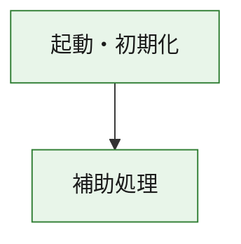
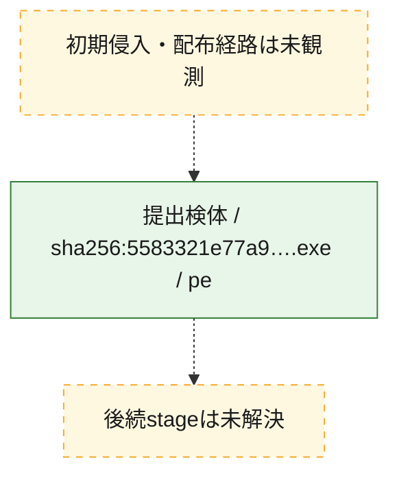
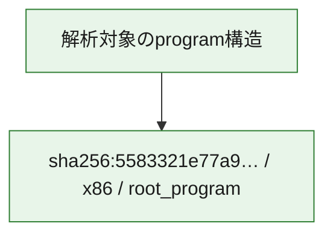

# 全体ロジック：5583321e77a921841f3d1546b2119c454b3d1f1ea07724ebe5597e5cb55cc6f6

代表関数の静的証跡から、起動・初期化の処理群を確認しました。

## 読み方

- phaseの掲載順は解析上の整理順です。observed_call_edgesがない段階間の実行順を断定しません。
- 図の実線は静的に観測した関係、点線と黄色のノードは未観測・未解決の関係を示します。
- 図は静的な要約であり、動的実行を再現するものではありません。
- 詳細な関数解説とfingerprintは[STATIC-LOGIC.md](STATIC-LOGIC.md)を参照してください。

## 静的可視化

### 実行フロー

### 感染チェーン

### モジュール関係

## 処理段階

### 1. 起動・初期化

entry pointから初期化と後続処理への移行を確認します。
確度: `confirmed_static_function_evidence`

- `5583321e77a921841f3d1546b2119c454b3d1f1ea07724ebe5597e5cb55cc6f6:ghidra:180001010` — 初期化と主要処理への分岐を行う入口関数です。 状態: `succeeded`、選定理由: `entry_point`, `meaningful_symbol_name`, `reviewed_call_centrality:22`, `role:entrypoint`, `small_program_complete_context`

### 2. 補助処理

主要処理を支える一般内部関数またはlibrary処理を確認します。
確度: `confirmed_static_function_evidence`

- `5583321e77a921841f3d1546b2119c454b3d1f1ea07724ebe5597e5cb55cc6f6:ghidra:180001240` — 検体内部の一般処理を実装する関数です。 状態: `succeeded`、選定理由: `context_representative`, `reviewed_call_centrality:2`, `small_program_complete_context`
- `5583321e77a921841f3d1546b2119c454b3d1f1ea07724ebe5597e5cb55cc6f6:ghidra:180001350` — 検体内部の一般処理を実装する関数です。 状態: `succeeded`、選定理由: `context_representative`, `reviewed_call_centrality:25`, `small_program_complete_context`
- `5583321e77a921841f3d1546b2119c454b3d1f1ea07724ebe5597e5cb55cc6f6:ghidra:180003780` — 検体内部の一般処理を実装する関数です。 状態: `succeeded`、選定理由: `context_representative`, `reviewed_call_centrality:2`, `small_program_complete_context`
- `5583321e77a921841f3d1546b2119c454b3d1f1ea07724ebe5597e5cb55cc6f6:ghidra:1800038e0` — 検体内部の一般処理を実装する関数です。 状態: `succeeded`、選定理由: `context_representative`, `reviewed_call_centrality:2`, `small_program_complete_context`

## 観測したcall関係

- `5583321e77a921841f3d1546b2119c454b3d1f1ea07724ebe5597e5cb55cc6f6:ghidra:180001010` → `5583321e77a921841f3d1546b2119c454b3d1f1ea07724ebe5597e5cb55cc6f6:ghidra:180001240` （`startup` → `support`）
- `5583321e77a921841f3d1546b2119c454b3d1f1ea07724ebe5597e5cb55cc6f6:ghidra:180001010` → `5583321e77a921841f3d1546b2119c454b3d1f1ea07724ebe5597e5cb55cc6f6:ghidra:180001350` （`startup` → `support`）
- `5583321e77a921841f3d1546b2119c454b3d1f1ea07724ebe5597e5cb55cc6f6:ghidra:180001350` → `5583321e77a921841f3d1546b2119c454b3d1f1ea07724ebe5597e5cb55cc6f6:ghidra:180001240` （`support` → `support`）
- `5583321e77a921841f3d1546b2119c454b3d1f1ea07724ebe5597e5cb55cc6f6:ghidra:180001350` → `5583321e77a921841f3d1546b2119c454b3d1f1ea07724ebe5597e5cb55cc6f6:ghidra:180003780` （`support` → `support`）
- `5583321e77a921841f3d1546b2119c454b3d1f1ea07724ebe5597e5cb55cc6f6:ghidra:180001350` → `5583321e77a921841f3d1546b2119c454b3d1f1ea07724ebe5597e5cb55cc6f6:ghidra:1800038e0` （`support` → `support`）
- `5583321e77a921841f3d1546b2119c454b3d1f1ea07724ebe5597e5cb55cc6f6:ghidra:180003780` → `5583321e77a921841f3d1546b2119c454b3d1f1ea07724ebe5597e5cb55cc6f6:ghidra:1800038e0` （`support` → `support`）
- `ghidra-function:64e92e9cc327e3c140ec53a3` → `ghidra-external:04b21be19ee4184ac9012dac` （`unclassified` → `unclassified`）
- `ghidra-function:64e92e9cc327e3c140ec53a3` → `ghidra-external:1ae10ffe4ec1e1aeff8cf83c` （`unclassified` → `unclassified`）
- `ghidra-function:64e92e9cc327e3c140ec53a3` → `ghidra-external:23cc4f079a0cd106c61bfd03` （`unclassified` → `unclassified`）
- `ghidra-function:64e92e9cc327e3c140ec53a3` → `ghidra-external:2adbf1cc80fdd58aab62e0f3` （`unclassified` → `unclassified`）
- `ghidra-function:64e92e9cc327e3c140ec53a3` → `ghidra-external:2df11a050d6994fb63079c29` （`unclassified` → `unclassified`）
- `ghidra-function:64e92e9cc327e3c140ec53a3` → `ghidra-external:32aedce44f02c42fd6f25afc` （`unclassified` → `unclassified`）
- `ghidra-function:64e92e9cc327e3c140ec53a3` → `ghidra-external:45dbfdb9f7956c2b00f7c4a1` （`unclassified` → `unclassified`）
- `ghidra-function:64e92e9cc327e3c140ec53a3` → `ghidra-external:50d7b83394a6caf37d2ef68d` （`unclassified` → `unclassified`）
- `ghidra-function:64e92e9cc327e3c140ec53a3` → `ghidra-external:6d9f96b2685bef626d1cd9b7` （`unclassified` → `unclassified`）
- `ghidra-function:64e92e9cc327e3c140ec53a3` → `ghidra-external:7c0df183ca43276ccc334d25` （`unclassified` → `unclassified`）
- `ghidra-function:64e92e9cc327e3c140ec53a3` → `ghidra-external:7c44c8769a7c774070273161` （`unclassified` → `unclassified`）
- `ghidra-function:64e92e9cc327e3c140ec53a3` → `ghidra-external:8014a25884295496511d391a` （`unclassified` → `unclassified`）
- `ghidra-function:64e92e9cc327e3c140ec53a3` → `ghidra-external:8182332b9105c30743d50e89` （`unclassified` → `unclassified`）
- `ghidra-function:64e92e9cc327e3c140ec53a3` → `ghidra-external:87d0f45ab337cf126378b5b6` （`unclassified` → `unclassified`）
- `ghidra-function:64e92e9cc327e3c140ec53a3` → `ghidra-external:8d938659753cc1338ba18797` （`unclassified` → `unclassified`）
- `ghidra-function:64e92e9cc327e3c140ec53a3` → `ghidra-external:992ff88b1da486af750d7803` （`unclassified` → `unclassified`）
- `ghidra-function:64e92e9cc327e3c140ec53a3` → `ghidra-external:a5f7120e470ad70409fac6ec` （`unclassified` → `unclassified`）
- `ghidra-function:64e92e9cc327e3c140ec53a3` → `ghidra-external:af8ae2244b4ac74ca5037b8c` （`unclassified` → `unclassified`）
- `ghidra-function:64e92e9cc327e3c140ec53a3` → `ghidra-external:b5f26eddb8df32faa06a33f8` （`unclassified` → `unclassified`）
- `ghidra-function:64e92e9cc327e3c140ec53a3` → `ghidra-external:c8bc917c190d3f99a382e6db` （`unclassified` → `unclassified`）
- `ghidra-function:64e92e9cc327e3c140ec53a3` → `ghidra-external:f6f8ea3d32b566454c8a7fca` （`unclassified` → `unclassified`）
- `ghidra-function:64e92e9cc327e3c140ec53a3` → `ghidra-function:53dc88120b7d75cf6bf4d906` （`unclassified` → `unclassified`）
- `ghidra-function:64e92e9cc327e3c140ec53a3` → `ghidra-function:e0e34c76afab6e2b1dd00972` （`unclassified` → `unclassified`）
- `ghidra-function:64e92e9cc327e3c140ec53a3` → `ghidra-function:f6640954b5cb229f37600f88` （`unclassified` → `unclassified`）
- `ghidra-function:a34229a60ad85c163b16dc85` → `ghidra-function:0e51ad27cc0269f65cd633d7` （`unclassified` → `unclassified`）
- `ghidra-function:a34229a60ad85c163b16dc85` → `ghidra-function:139abe3b46297f74cee8d214` （`unclassified` → `unclassified`）
- `ghidra-function:a34229a60ad85c163b16dc85` → `ghidra-function:24b5732860a83166367ca24f` （`unclassified` → `unclassified`）
- `ghidra-function:a34229a60ad85c163b16dc85` → `ghidra-function:64e92e9cc327e3c140ec53a3` （`unclassified` → `unclassified`）
- `ghidra-function:a34229a60ad85c163b16dc85` → `ghidra-function:b288a029086bde39c05fe19b` （`unclassified` → `unclassified`）
- `ghidra-function:a34229a60ad85c163b16dc85` → `ghidra-function:c0577f8fd7f328e2c1323a80` （`unclassified` → `unclassified`）
- `ghidra-function:a34229a60ad85c163b16dc85` → `ghidra-function:ca9f3761107ce07fa2982529` （`unclassified` → `unclassified`）
- `ghidra-function:a34229a60ad85c163b16dc85` → `ghidra-function:e0e34c76afab6e2b1dd00972` （`unclassified` → `unclassified`）
- `ghidra-function:a34229a60ad85c163b16dc85` → `ghidra-function:e4e3191a1d012767b391ee30` （`unclassified` → `unclassified`）
- `ghidra-function:a34229a60ad85c163b16dc85` → `ghidra-function:e67e06af9fb6faecebe78067` （`unclassified` → `unclassified`）
- `ghidra-function:a34229a60ad85c163b16dc85` → `ghidra-function:f28629df5121a42c1e237b88` （`unclassified` → `unclassified`）
- `ghidra-function:a34229a60ad85c163b16dc85` → `ghidra-function:fea6f2b5331b29ce279385d9` （`unclassified` → `unclassified`）
- `ghidra-function:f6640954b5cb229f37600f88` → `ghidra-function:53dc88120b7d75cf6bf4d906` （`unclassified` → `unclassified`）

## 解析範囲と制約

- 選定外関数は全体inventoryへ残しますが、関数本体の個別解説対象にはしていません。
- indirect call、難読化、packer、VM、壊れたcontrol flowによりcall関係が欠落する場合があります。
- 文書は静的解析に基づき、検体実行や外部通信による動的確認は行っていません。
