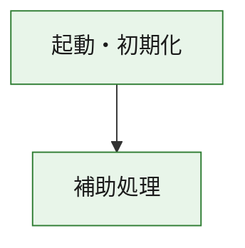
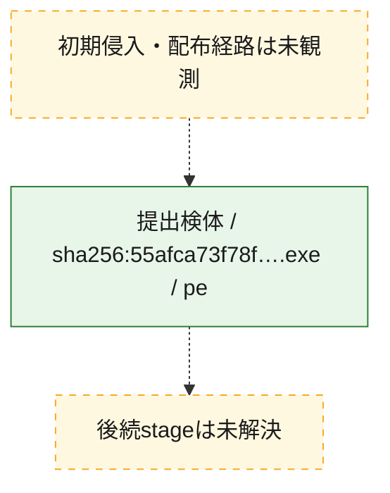
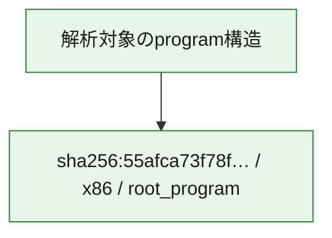

# 全体ロジック：55afca73f78f4330da4f8809b1719782cddc654e9c86d2dfc08712b594d37334

代表関数の静的証跡から、起動・初期化の処理群を確認しました。

## 読み方

- phaseの掲載順は解析上の整理順です。observed_call_edgesがない段階間の実行順を断定しません。
- 図の実線は静的に観測した関係、点線と黄色のノードは未観測・未解決の関係を示します。
- 図は静的な要約であり、動的実行を再現するものではありません。
- 詳細な関数解説とfingerprintは[STATIC-LOGIC.md](STATIC-LOGIC.md)を参照してください。

## 静的可視化

### 実行フロー

### 感染チェーン

### モジュール関係

## 処理段階

### 1. 起動・初期化

entry pointから初期化と後続処理への移行を確認します。
確度: `confirmed_static_function_evidence`

- `55afca73f78f4330da4f8809b1719782cddc654e9c86d2dfc08712b594d37334:ghidra:180001010` — 初期化と主要処理への分岐を行う入口関数です。 状態: `succeeded`、選定理由: `entry_point`, `meaningful_symbol_name`, `reviewed_call_centrality:22`, `role:entrypoint`, `small_program_complete_context`

### 2. 補助処理

主要処理を支える一般内部関数またはlibrary処理を確認します。
確度: `confirmed_static_function_evidence`

- `55afca73f78f4330da4f8809b1719782cddc654e9c86d2dfc08712b594d37334:ghidra:180001240` — 検体内部の一般処理を実装する関数です。 状態: `succeeded`、選定理由: `context_representative`, `reviewed_call_centrality:2`, `small_program_complete_context`
- `55afca73f78f4330da4f8809b1719782cddc654e9c86d2dfc08712b594d37334:ghidra:180001350` — 検体内部の一般処理を実装する関数です。 状態: `succeeded`、選定理由: `context_representative`, `reviewed_call_centrality:25`, `small_program_complete_context`
- `55afca73f78f4330da4f8809b1719782cddc654e9c86d2dfc08712b594d37334:ghidra:180003780` — 検体内部の一般処理を実装する関数です。 状態: `succeeded`、選定理由: `context_representative`, `reviewed_call_centrality:2`, `small_program_complete_context`
- `55afca73f78f4330da4f8809b1719782cddc654e9c86d2dfc08712b594d37334:ghidra:1800038e0` — 検体内部の一般処理を実装する関数です。 状態: `succeeded`、選定理由: `context_representative`, `reviewed_call_centrality:2`, `small_program_complete_context`

## 観測したcall関係

- `55afca73f78f4330da4f8809b1719782cddc654e9c86d2dfc08712b594d37334:ghidra:180001010` → `55afca73f78f4330da4f8809b1719782cddc654e9c86d2dfc08712b594d37334:ghidra:180001240` （`startup` → `support`）
- `55afca73f78f4330da4f8809b1719782cddc654e9c86d2dfc08712b594d37334:ghidra:180001010` → `55afca73f78f4330da4f8809b1719782cddc654e9c86d2dfc08712b594d37334:ghidra:180001350` （`startup` → `support`）
- `55afca73f78f4330da4f8809b1719782cddc654e9c86d2dfc08712b594d37334:ghidra:180001350` → `55afca73f78f4330da4f8809b1719782cddc654e9c86d2dfc08712b594d37334:ghidra:180001240` （`support` → `support`）
- `55afca73f78f4330da4f8809b1719782cddc654e9c86d2dfc08712b594d37334:ghidra:180001350` → `55afca73f78f4330da4f8809b1719782cddc654e9c86d2dfc08712b594d37334:ghidra:180003780` （`support` → `support`）
- `55afca73f78f4330da4f8809b1719782cddc654e9c86d2dfc08712b594d37334:ghidra:180001350` → `55afca73f78f4330da4f8809b1719782cddc654e9c86d2dfc08712b594d37334:ghidra:1800038e0` （`support` → `support`）
- `55afca73f78f4330da4f8809b1719782cddc654e9c86d2dfc08712b594d37334:ghidra:180003780` → `55afca73f78f4330da4f8809b1719782cddc654e9c86d2dfc08712b594d37334:ghidra:1800038e0` （`support` → `support`）
- `ghidra-function:6d375ec976677cf04382953c` → `ghidra-function:1c9473ee62c367bd2b432f2b` （`unclassified` → `unclassified`）
- `ghidra-function:6d375ec976677cf04382953c` → `ghidra-function:2fa0597c7d06bce2360d1dd5` （`unclassified` → `unclassified`）
- `ghidra-function:6d375ec976677cf04382953c` → `ghidra-function:3e33a6c6717681e8cf103fa1` （`unclassified` → `unclassified`）
- `ghidra-function:6d375ec976677cf04382953c` → `ghidra-function:4ed01a8343e9c8ae9088877e` （`unclassified` → `unclassified`）
- `ghidra-function:6d375ec976677cf04382953c` → `ghidra-function:4f2852aed7cb7680a9a44cf8` （`unclassified` → `unclassified`）
- `ghidra-function:6d375ec976677cf04382953c` → `ghidra-function:5042526542dfe87d472a094c` （`unclassified` → `unclassified`）
- `ghidra-function:6d375ec976677cf04382953c` → `ghidra-function:56d19e2e7081e3ec96d9e3f0` （`unclassified` → `unclassified`）
- `ghidra-function:6d375ec976677cf04382953c` → `ghidra-function:637e653afc53cb30f480d21d` （`unclassified` → `unclassified`）
- `ghidra-function:6d375ec976677cf04382953c` → `ghidra-function:8e088684bc2dabf5c85d4863` （`unclassified` → `unclassified`）
- `ghidra-function:6d375ec976677cf04382953c` → `ghidra-function:98fe50075cc2e04aed6b54ae` （`unclassified` → `unclassified`）
- `ghidra-function:6d375ec976677cf04382953c` → `ghidra-function:b3466444981a14fea4a7a744` （`unclassified` → `unclassified`）
- `ghidra-function:6d375ec976677cf04382953c` → `ghidra-function:ce6114ce1b3855d85f6374c8` （`unclassified` → `unclassified`）
- `ghidra-function:ce6114ce1b3855d85f6374c8` → `ghidra-external:009896fe11b7b71bc334a246` （`unclassified` → `unclassified`）
- `ghidra-function:ce6114ce1b3855d85f6374c8` → `ghidra-external:102fca6f82fcfb1ad4e42601` （`unclassified` → `unclassified`）
- `ghidra-function:ce6114ce1b3855d85f6374c8` → `ghidra-external:178134f32683b49b424f0bae` （`unclassified` → `unclassified`）
- `ghidra-function:ce6114ce1b3855d85f6374c8` → `ghidra-external:1825e1723c68ceace708651d` （`unclassified` → `unclassified`）
- `ghidra-function:ce6114ce1b3855d85f6374c8` → `ghidra-external:1f590c9613851fd2b1515819` （`unclassified` → `unclassified`）
- `ghidra-function:ce6114ce1b3855d85f6374c8` → `ghidra-external:2f8960132c28265e39826a2e` （`unclassified` → `unclassified`）
- `ghidra-function:ce6114ce1b3855d85f6374c8` → `ghidra-external:3eb7f7a389f3be7512c2183d` （`unclassified` → `unclassified`）
- `ghidra-function:ce6114ce1b3855d85f6374c8` → `ghidra-external:4732341da7801a38baeb2fee` （`unclassified` → `unclassified`）
- `ghidra-function:ce6114ce1b3855d85f6374c8` → `ghidra-external:5b5b07323ebae7aef199d2ae` （`unclassified` → `unclassified`）
- `ghidra-function:ce6114ce1b3855d85f6374c8` → `ghidra-external:65226f0786d177ce081cb5b5` （`unclassified` → `unclassified`）
- `ghidra-function:ce6114ce1b3855d85f6374c8` → `ghidra-external:6639f8db4740cbc11aa90d00` （`unclassified` → `unclassified`）
- `ghidra-function:ce6114ce1b3855d85f6374c8` → `ghidra-external:97a060258695e5fbfd61096a` （`unclassified` → `unclassified`）
- `ghidra-function:ce6114ce1b3855d85f6374c8` → `ghidra-external:a53ebab6a9d840778b9b4b49` （`unclassified` → `unclassified`）
- `ghidra-function:ce6114ce1b3855d85f6374c8` → `ghidra-external:a63f0c589ea3532559c8593d` （`unclassified` → `unclassified`）
- `ghidra-function:ce6114ce1b3855d85f6374c8` → `ghidra-external:c4a799b0875691e7945a31dc` （`unclassified` → `unclassified`）
- `ghidra-function:ce6114ce1b3855d85f6374c8` → `ghidra-external:cebbb81e9a9526e96ec95a1f` （`unclassified` → `unclassified`）
- `ghidra-function:ce6114ce1b3855d85f6374c8` → `ghidra-external:d1bea4684be8b16feb134740` （`unclassified` → `unclassified`）
- `ghidra-function:ce6114ce1b3855d85f6374c8` → `ghidra-external:e901f334fcf70a3dad192426` （`unclassified` → `unclassified`）
- `ghidra-function:ce6114ce1b3855d85f6374c8` → `ghidra-external:f7a3f792b8b021153b05047c` （`unclassified` → `unclassified`）
- `ghidra-function:ce6114ce1b3855d85f6374c8` → `ghidra-external:f9e13f95695355bff53cb926` （`unclassified` → `unclassified`）
- `ghidra-function:ce6114ce1b3855d85f6374c8` → `ghidra-external:fb7e63f11d39f0c40cc4d0cc` （`unclassified` → `unclassified`）
- `ghidra-function:ce6114ce1b3855d85f6374c8` → `ghidra-function:1c9473ee62c367bd2b432f2b` （`unclassified` → `unclassified`）
- `ghidra-function:ce6114ce1b3855d85f6374c8` → `ghidra-function:ba62cddf513af70f9d1e9b61` （`unclassified` → `unclassified`）
- `ghidra-function:ce6114ce1b3855d85f6374c8` → `ghidra-function:e1b8a99da3e7a47d89cc1443` （`unclassified` → `unclassified`）
- `ghidra-function:e1b8a99da3e7a47d89cc1443` → `ghidra-function:ba62cddf513af70f9d1e9b61` （`unclassified` → `unclassified`）

## 解析範囲と制約

- 選定外関数は全体inventoryへ残しますが、関数本体の個別解説対象にはしていません。
- indirect call、難読化、packer、VM、壊れたcontrol flowによりcall関係が欠落する場合があります。
- 文書は静的解析に基づき、検体実行や外部通信による動的確認は行っていません。
