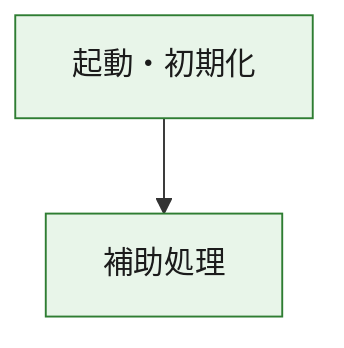
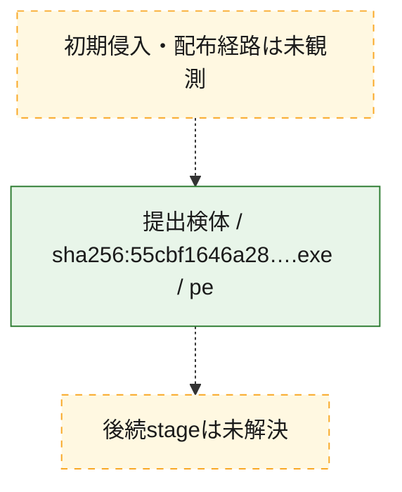
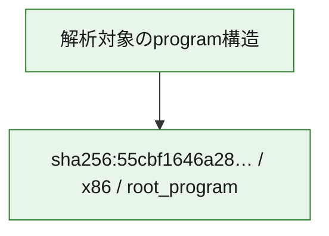

# 全体ロジック：55cbf1646a2899bc2cdb2818d8dba6892f017624c998fae588ebb213423473af

代表関数の静的証跡から、起動・初期化の処理群を確認しました。

## 読み方

- phaseの掲載順は解析上の整理順です。observed_call_edgesがない段階間の実行順を断定しません。
- 図の実線は静的に観測した関係、点線と黄色のノードは未観測・未解決の関係を示します。
- 図は静的な要約であり、動的実行を再現するものではありません。
- 詳細な関数解説とfingerprintは[STATIC-LOGIC.md](STATIC-LOGIC.md)を参照してください。

## 静的可視化

### 実行フロー

### 感染チェーン

### モジュール関係

## 処理段階

### 1. 起動・初期化

entry pointから初期化と後続処理への移行を確認します。
確度: `confirmed_static_function_evidence`

- `55cbf1646a2899bc2cdb2818d8dba6892f017624c998fae588ebb213423473af:ghidra:180001010` — 初期化と主要処理への分岐を行う入口関数です。 状態: `succeeded`、選定理由: `entry_point`, `meaningful_symbol_name`, `reviewed_call_centrality:22`, `role:entrypoint`, `small_program_complete_context`

### 2. 補助処理

主要処理を支える一般内部関数またはlibrary処理を確認します。
確度: `confirmed_static_function_evidence`

- `55cbf1646a2899bc2cdb2818d8dba6892f017624c998fae588ebb213423473af:ghidra:180001240` — 検体内部の一般処理を実装する関数です。 状態: `succeeded`、選定理由: `context_representative`, `reviewed_call_centrality:2`, `small_program_complete_context`
- `55cbf1646a2899bc2cdb2818d8dba6892f017624c998fae588ebb213423473af:ghidra:180001350` — 検体内部の一般処理を実装する関数です。 状態: `succeeded`、選定理由: `context_representative`, `reviewed_call_centrality:25`, `small_program_complete_context`
- `55cbf1646a2899bc2cdb2818d8dba6892f017624c998fae588ebb213423473af:ghidra:180003780` — 検体内部の一般処理を実装する関数です。 状態: `succeeded`、選定理由: `context_representative`, `reviewed_call_centrality:2`, `small_program_complete_context`
- `55cbf1646a2899bc2cdb2818d8dba6892f017624c998fae588ebb213423473af:ghidra:1800038e0` — 検体内部の一般処理を実装する関数です。 状態: `succeeded`、選定理由: `context_representative`, `reviewed_call_centrality:2`, `small_program_complete_context`

## 観測したcall関係

- `55cbf1646a2899bc2cdb2818d8dba6892f017624c998fae588ebb213423473af:ghidra:180001010` → `55cbf1646a2899bc2cdb2818d8dba6892f017624c998fae588ebb213423473af:ghidra:180001240` （`startup` → `support`）
- `55cbf1646a2899bc2cdb2818d8dba6892f017624c998fae588ebb213423473af:ghidra:180001010` → `55cbf1646a2899bc2cdb2818d8dba6892f017624c998fae588ebb213423473af:ghidra:180001350` （`startup` → `support`）
- `55cbf1646a2899bc2cdb2818d8dba6892f017624c998fae588ebb213423473af:ghidra:180001350` → `55cbf1646a2899bc2cdb2818d8dba6892f017624c998fae588ebb213423473af:ghidra:180001240` （`support` → `support`）
- `55cbf1646a2899bc2cdb2818d8dba6892f017624c998fae588ebb213423473af:ghidra:180001350` → `55cbf1646a2899bc2cdb2818d8dba6892f017624c998fae588ebb213423473af:ghidra:180003780` （`support` → `support`）
- `55cbf1646a2899bc2cdb2818d8dba6892f017624c998fae588ebb213423473af:ghidra:180001350` → `55cbf1646a2899bc2cdb2818d8dba6892f017624c998fae588ebb213423473af:ghidra:1800038e0` （`support` → `support`）
- `55cbf1646a2899bc2cdb2818d8dba6892f017624c998fae588ebb213423473af:ghidra:180003780` → `55cbf1646a2899bc2cdb2818d8dba6892f017624c998fae588ebb213423473af:ghidra:1800038e0` （`support` → `support`）
- `ghidra-function:4550c8f39db12bdabdbb0857` → `ghidra-function:bbb346e7a70f6934d55512f6` （`unclassified` → `unclassified`）
- `ghidra-function:cd79cae6f394544afca41bac` → `ghidra-external:04afb6e1d93c74aa8990969a` （`unclassified` → `unclassified`）
- `ghidra-function:cd79cae6f394544afca41bac` → `ghidra-external:12c1f92a3d57593933cb2c36` （`unclassified` → `unclassified`）
- `ghidra-function:cd79cae6f394544afca41bac` → `ghidra-external:16285dec42b277d3dd3573a4` （`unclassified` → `unclassified`）
- `ghidra-function:cd79cae6f394544afca41bac` → `ghidra-external:228fd1c5a5bb047edae2ea2c` （`unclassified` → `unclassified`）
- `ghidra-function:cd79cae6f394544afca41bac` → `ghidra-external:29516f95910eb03207a06e16` （`unclassified` → `unclassified`）
- `ghidra-function:cd79cae6f394544afca41bac` → `ghidra-external:2fea323b88230179219a4201` （`unclassified` → `unclassified`）
- `ghidra-function:cd79cae6f394544afca41bac` → `ghidra-external:392f57239929449bf915520d` （`unclassified` → `unclassified`）
- `ghidra-function:cd79cae6f394544afca41bac` → `ghidra-external:56e5945cd415a496a7ce3043` （`unclassified` → `unclassified`）
- `ghidra-function:cd79cae6f394544afca41bac` → `ghidra-external:637b2ba7708f14f5031209a1` （`unclassified` → `unclassified`）
- `ghidra-function:cd79cae6f394544afca41bac` → `ghidra-external:7045566cc1282e62a31394cc` （`unclassified` → `unclassified`）
- `ghidra-function:cd79cae6f394544afca41bac` → `ghidra-external:819db42f398a8adb1ecd3ec5` （`unclassified` → `unclassified`）
- `ghidra-function:cd79cae6f394544afca41bac` → `ghidra-external:89d4833e327de9d92486b6fa` （`unclassified` → `unclassified`）
- `ghidra-function:cd79cae6f394544afca41bac` → `ghidra-external:900b30d8701fa8e49d0b5739` （`unclassified` → `unclassified`）
- `ghidra-function:cd79cae6f394544afca41bac` → `ghidra-external:93bb50b2e5ee2fb42bf69bed` （`unclassified` → `unclassified`）
- `ghidra-function:cd79cae6f394544afca41bac` → `ghidra-external:a5f322bc1872cb83579bd57e` （`unclassified` → `unclassified`）
- `ghidra-function:cd79cae6f394544afca41bac` → `ghidra-external:b2e4bd59732554d8694ab27f` （`unclassified` → `unclassified`）
- `ghidra-function:cd79cae6f394544afca41bac` → `ghidra-external:c4dfb0e10b72ecaa88c3b0db` （`unclassified` → `unclassified`）
- `ghidra-function:cd79cae6f394544afca41bac` → `ghidra-external:e7671959f18e9d8444d7992f` （`unclassified` → `unclassified`）
- `ghidra-function:cd79cae6f394544afca41bac` → `ghidra-external:e835c15eddb549f592fdaf58` （`unclassified` → `unclassified`）
- `ghidra-function:cd79cae6f394544afca41bac` → `ghidra-external:f397fc346f00c4ba1bc1fdf5` （`unclassified` → `unclassified`）
- `ghidra-function:cd79cae6f394544afca41bac` → `ghidra-external:f84ed488f2dd528b1ec115d4` （`unclassified` → `unclassified`）
- `ghidra-function:cd79cae6f394544afca41bac` → `ghidra-function:4550c8f39db12bdabdbb0857` （`unclassified` → `unclassified`）
- `ghidra-function:cd79cae6f394544afca41bac` → `ghidra-function:bbb346e7a70f6934d55512f6` （`unclassified` → `unclassified`）
- `ghidra-function:cd79cae6f394544afca41bac` → `ghidra-function:d2f875994b27b31f0748d011` （`unclassified` → `unclassified`）
- `ghidra-function:e598857517b5ca67a5cb15a9` → `ghidra-function:16a1f6f44c4f8b7b23d218f3` （`unclassified` → `unclassified`）
- `ghidra-function:e598857517b5ca67a5cb15a9` → `ghidra-function:532b79dcdfdbad555b5d8767` （`unclassified` → `unclassified`）
- `ghidra-function:e598857517b5ca67a5cb15a9` → `ghidra-function:586083e530785169c821eb3b` （`unclassified` → `unclassified`）
- `ghidra-function:e598857517b5ca67a5cb15a9` → `ghidra-function:5c08a75a29e04bf3438309bc` （`unclassified` → `unclassified`）
- `ghidra-function:e598857517b5ca67a5cb15a9` → `ghidra-function:5f705edbfaaddfde2af9e2a1` （`unclassified` → `unclassified`）
- `ghidra-function:e598857517b5ca67a5cb15a9` → `ghidra-function:89b5a700560d4cea3ed9e5a3` （`unclassified` → `unclassified`）
- `ghidra-function:e598857517b5ca67a5cb15a9` → `ghidra-function:993c074f3883c70b3aa50aea` （`unclassified` → `unclassified`）
- `ghidra-function:e598857517b5ca67a5cb15a9` → `ghidra-function:aa26ff9952eeb2448856028a` （`unclassified` → `unclassified`）
- `ghidra-function:e598857517b5ca67a5cb15a9` → `ghidra-function:b216bd7460bc1753c5fb0dc1` （`unclassified` → `unclassified`）
- `ghidra-function:e598857517b5ca67a5cb15a9` → `ghidra-function:cd79cae6f394544afca41bac` （`unclassified` → `unclassified`）
- `ghidra-function:e598857517b5ca67a5cb15a9` → `ghidra-function:d2f875994b27b31f0748d011` （`unclassified` → `unclassified`）
- `ghidra-function:e598857517b5ca67a5cb15a9` → `ghidra-function:fd2d941bdb14c9a1dbf0327c` （`unclassified` → `unclassified`）

## 解析範囲と制約

- 選定外関数は全体inventoryへ残しますが、関数本体の個別解説対象にはしていません。
- indirect call、難読化、packer、VM、壊れたcontrol flowによりcall関係が欠落する場合があります。
- 文書は静的解析に基づき、検体実行や外部通信による動的確認は行っていません。
