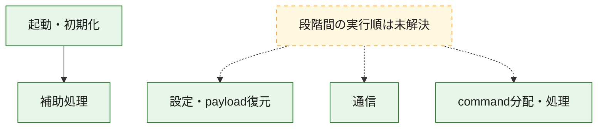
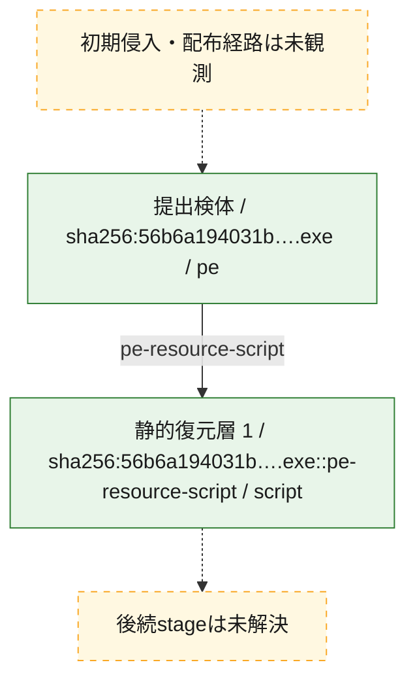
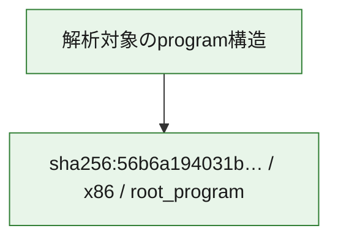

# 全体ロジック：56b6a194031b8403b7ff166187783d51acc7fe66cf930d9a0777ab1d9bb592c3

代表関数の静的証跡から、起動・初期化、設定・payload復元、通信、command分配・処理の処理群を確認しました。

## 読み方

- phaseの掲載順は解析上の整理順です。observed_call_edgesがない段階間の実行順を断定しません。
- 図の実線は静的に観測した関係、点線と黄色のノードは未観測・未解決の関係を示します。
- 図は静的な要約であり、動的実行を再現するものではありません。
- 詳細な関数解説とfingerprintは[STATIC-LOGIC.md](STATIC-LOGIC.md)を参照してください。

## 静的可視化

### 実行フロー

### 感染チェーン

### モジュール関係

## 処理段階

### 1. 起動・初期化

entry pointから初期化と後続処理への移行を確認します。
確度: `confirmed_static_function_evidence`

- `56b6a194031b8403b7ff166187783d51acc7fe66cf930d9a0777ab1d9bb592c3:ghidra:00646fc0` — 初期化と主要処理への分岐を行う入口関数です。 状態: `succeeded`、選定理由: `entry_point`, `meaningful_symbol_name`, `reviewed_call_centrality:22`, `role:entrypoint`

### 2. 設定・payload復元

設定、resource、payload、暗号化データの復元・変換を確認します。
確度: `confirmed_static_function_evidence_with_limits`

- `56b6a194031b8403b7ff166187783d51acc7fe66cf930d9a0777ab1d9bb592c3:ghidra:0064031e` — 設定、resource、payloadなどの解析・変換を行う関数です。 状態: `limited_bad_instruction_or_flow`、選定理由: `meaningful_symbol_name`, `reviewed_call_centrality:1`, `role:config_or_data_transform`

### 3. 通信

通信初期化、endpoint処理、送受信の役割を確認します。
確度: `confirmed_static_function_evidence_with_limits`

- `56b6a194031b8403b7ff166187783d51acc7fe66cf930d9a0777ab1d9bb592c3:ghidra:00640115` — 通信初期化、送受信、またはendpoint処理に関係する関数です。 状態: `limited_bad_instruction_or_flow`、選定理由: `meaningful_symbol_name`, `reviewed_call_centrality:1`, `role:network_communication`
- `56b6a194031b8403b7ff166187783d51acc7fe66cf930d9a0777ab1d9bb592c3:ghidra:00640364` — 通信初期化、送受信、またはendpoint処理に関係する関数です。 状態: `limited_bad_instruction_or_flow`、選定理由: `meaningful_symbol_name`, `reviewed_call_centrality:1`, `role:network_communication`
- `56b6a194031b8403b7ff166187783d51acc7fe66cf930d9a0777ab1d9bb592c3:ghidra:0066f35f` — 通信初期化、送受信、またはendpoint処理に関係する関数です。 状態: `limited_bad_instruction_or_flow`、選定理由: `meaningful_symbol_name`, `reviewed_call_centrality:1`, `role:network_communication`
- `56b6a194031b8403b7ff166187783d51acc7fe66cf930d9a0777ab1d9bb592c3:ghidra:0066f373` — 通信初期化、送受信、またはendpoint処理に関係する関数です。 状態: `limited_bad_instruction_or_flow`、選定理由: `meaningful_symbol_name`, `reviewed_call_centrality:1`, `role:network_communication`
- `56b6a194031b8403b7ff166187783d51acc7fe66cf930d9a0777ab1d9bb592c3:ghidra:0066f5ef` — 通信初期化、送受信、またはendpoint処理に関係する関数です。 状態: `limited_bad_instruction_or_flow`、選定理由: `meaningful_symbol_name`, `reviewed_call_centrality:1`, `role:network_communication`
- `56b6a194031b8403b7ff166187783d51acc7fe66cf930d9a0777ab1d9bb592c3:ghidra:0066f635` — 通信初期化、送受信、またはendpoint処理に関係する関数です。 状態: `failed`、選定理由: `meaningful_symbol_name`, `reviewed_call_centrality:1`, `role:network_communication`

### 4. command分配・処理

受信commandやtaskの解釈、分配、個別handlerへの移行を確認します。
確度: `confirmed_static_function_evidence_with_limits`

- `56b6a194031b8403b7ff166187783d51acc7fe66cf930d9a0777ab1d9bb592c3:ghidra:006403c8` — commandの解釈、分配、または個別処理を担当する関数です。 状態: `limited_bad_instruction_or_flow`、選定理由: `meaningful_symbol_name`, `reviewed_call_centrality:1`, `role:command_dispatch_or_handler`
- `56b6a194031b8403b7ff166187783d51acc7fe66cf930d9a0777ab1d9bb592c3:ghidra:006407ed` — commandの解釈、分配、または個別処理を担当する関数です。 状態: `limited_bad_instruction_or_flow`、選定理由: `meaningful_symbol_name`, `reviewed_call_centrality:1`, `role:command_dispatch_or_handler`
- `56b6a194031b8403b7ff166187783d51acc7fe66cf930d9a0777ab1d9bb592c3:ghidra:006407f7` — commandの解釈、分配、または個別処理を担当する関数です。 状態: `limited_bad_instruction_or_flow`、選定理由: `meaningful_symbol_name`, `reviewed_call_centrality:1`, `role:command_dispatch_or_handler`
- `56b6a194031b8403b7ff166187783d51acc7fe66cf930d9a0777ab1d9bb592c3:ghidra:0066f387` — commandの解釈、分配、または個別処理を担当する関数です。 状態: `limited_bad_instruction_or_flow`、選定理由: `meaningful_symbol_name`, `reviewed_call_centrality:1`, `role:command_dispatch_or_handler`

### 5. 補助処理

主要処理を支える一般内部関数またはlibrary処理を確認します。
確度: `confirmed_static_function_evidence_with_limits`

- `56b6a194031b8403b7ff166187783d51acc7fe66cf930d9a0777ab1d9bb592c3:ghidra:00408440` — 検体内部の一般処理を実装する関数です。 状態: `succeeded`、選定理由: `meaningful_symbol_name`, `reviewed_call_centrality:3`
- `56b6a194031b8403b7ff166187783d51acc7fe66cf930d9a0777ab1d9bb592c3:ghidra:0063fd4a` — 検体内部の一般処理を実装する関数です。 状態: `limited_bad_instruction_or_flow`、選定理由: `meaningful_symbol_name`, `reviewed_call_centrality:1`
- `56b6a194031b8403b7ff166187783d51acc7fe66cf930d9a0777ab1d9bb592c3:ghidra:0063fd65` — 検体内部の一般処理を実装する関数です。 状態: `limited_bad_instruction_or_flow`、選定理由: `meaningful_symbol_name`, `reviewed_call_centrality:1`
- `56b6a194031b8403b7ff166187783d51acc7fe66cf930d9a0777ab1d9bb592c3:ghidra:0063fd6f` — 検体内部の一般処理を実装する関数です。 状態: `limited_bad_instruction_or_flow`、選定理由: `meaningful_symbol_name`, `reviewed_call_centrality:1`
- `56b6a194031b8403b7ff166187783d51acc7fe66cf930d9a0777ab1d9bb592c3:ghidra:0063fd8a` — 検体内部の一般処理を実装する関数です。 状態: `limited_bad_instruction_or_flow`、選定理由: `meaningful_symbol_name`, `reviewed_call_centrality:1`
- `56b6a194031b8403b7ff166187783d51acc7fe66cf930d9a0777ab1d9bb592c3:ghidra:0063fdaa` — 検体内部の一般処理を実装する関数です。 状態: `limited_bad_instruction_or_flow`、選定理由: `meaningful_symbol_name`, `reviewed_call_centrality:1`
- `56b6a194031b8403b7ff166187783d51acc7fe66cf930d9a0777ab1d9bb592c3:ghidra:0063fdb4` — 検体内部の一般処理を実装する関数です。 状態: `limited_bad_instruction_or_flow`、選定理由: `meaningful_symbol_name`, `reviewed_call_centrality:1`
- `56b6a194031b8403b7ff166187783d51acc7fe66cf930d9a0777ab1d9bb592c3:ghidra:0063fdbe` — 検体内部の一般処理を実装する関数です。 状態: `limited_bad_instruction_or_flow`、選定理由: `meaningful_symbol_name`, `reviewed_call_centrality:1`
- `56b6a194031b8403b7ff166187783d51acc7fe66cf930d9a0777ab1d9bb592c3:ghidra:0063fdc8` — 検体内部の一般処理を実装する関数です。 状態: `limited_bad_instruction_or_flow`、選定理由: `meaningful_symbol_name`, `reviewed_call_centrality:1`
- `56b6a194031b8403b7ff166187783d51acc7fe66cf930d9a0777ab1d9bb592c3:ghidra:0063fe1a` — 検体内部の一般処理を実装する関数です。 状態: `limited_bad_instruction_or_flow`、選定理由: `meaningful_symbol_name`, `reviewed_call_centrality:1`
- `56b6a194031b8403b7ff166187783d51acc7fe66cf930d9a0777ab1d9bb592c3:ghidra:0063fe24` — 検体内部の一般処理を実装する関数です。 状態: `limited_bad_instruction_or_flow`、選定理由: `meaningful_symbol_name`, `reviewed_call_centrality:1`
- `56b6a194031b8403b7ff166187783d51acc7fe66cf930d9a0777ab1d9bb592c3:ghidra:0063fe2e` — 検体内部の一般処理を実装する関数です。 状態: `limited_bad_instruction_or_flow`、選定理由: `meaningful_symbol_name`, `reviewed_call_centrality:1`
- `56b6a194031b8403b7ff166187783d51acc7fe66cf930d9a0777ab1d9bb592c3:ghidra:0063fe38` — 検体内部の一般処理を実装する関数です。 状態: `limited_bad_instruction_or_flow`、選定理由: `meaningful_symbol_name`, `reviewed_call_centrality:1`
- `56b6a194031b8403b7ff166187783d51acc7fe66cf930d9a0777ab1d9bb592c3:ghidra:0063fe53` — 検体内部の一般処理を実装する関数です。 状態: `limited_bad_instruction_or_flow`、選定理由: `meaningful_symbol_name`, `reviewed_call_centrality:1`
- `56b6a194031b8403b7ff166187783d51acc7fe66cf930d9a0777ab1d9bb592c3:ghidra:0063fe5d` — 検体内部の一般処理を実装する関数です。 状態: `limited_bad_instruction_or_flow`、選定理由: `meaningful_symbol_name`, `reviewed_call_centrality:1`
- `56b6a194031b8403b7ff166187783d51acc7fe66cf930d9a0777ab1d9bb592c3:ghidra:0063fe67` — 検体内部の一般処理を実装する関数です。 状態: `limited_bad_instruction_or_flow`、選定理由: `meaningful_symbol_name`, `reviewed_call_centrality:1`
- `56b6a194031b8403b7ff166187783d51acc7fe66cf930d9a0777ab1d9bb592c3:ghidra:0063fe71` — 検体内部の一般処理を実装する関数です。 状態: `limited_bad_instruction_or_flow`、選定理由: `meaningful_symbol_name`, `reviewed_call_centrality:1`
- `56b6a194031b8403b7ff166187783d51acc7fe66cf930d9a0777ab1d9bb592c3:ghidra:0063fe7b` — 検体内部の一般処理を実装する関数です。 状態: `limited_bad_instruction_or_flow`、選定理由: `meaningful_symbol_name`, `reviewed_call_centrality:1`
- `56b6a194031b8403b7ff166187783d51acc7fe66cf930d9a0777ab1d9bb592c3:ghidra:0066fc20` — compiler生成処理または汎用library処理とみられる関数です。 状態: `succeeded`、選定理由: `entry_point`, `meaningful_symbol_name`, `reviewed_call_centrality:1`
- `56b6a194031b8403b7ff166187783d51acc7fe66cf930d9a0777ab1d9bb592c3:ghidra:0066fcb0` — compiler生成処理または汎用library処理とみられる関数です。 状態: `succeeded`、選定理由: `entry_point`, `meaningful_symbol_name`, `reviewed_call_centrality:2`

## 観測したcall関係

- `56b6a194031b8403b7ff166187783d51acc7fe66cf930d9a0777ab1d9bb592c3:ghidra:00646fc0` → `56b6a194031b8403b7ff166187783d51acc7fe66cf930d9a0777ab1d9bb592c3:ghidra:00408440` （`startup` → `support`）
- `56b6a194031b8403b7ff166187783d51acc7fe66cf930d9a0777ab1d9bb592c3:ghidra:0066fc20` → `56b6a194031b8403b7ff166187783d51acc7fe66cf930d9a0777ab1d9bb592c3:ghidra:00408440` （`support` → `support`）
- `56b6a194031b8403b7ff166187783d51acc7fe66cf930d9a0777ab1d9bb592c3:ghidra:0066fcb0` → `56b6a194031b8403b7ff166187783d51acc7fe66cf930d9a0777ab1d9bb592c3:ghidra:00408440` （`support` → `support`）
- `ghidra-function:004a11e46a9d3e83560fd1d0` → `ghidra-external:0e21528d70d08c366172254c` （`unclassified` → `unclassified`）
- `ghidra-function:061b4722641b21eec514d762` → `ghidra-external:0e21528d70d08c366172254c` （`unclassified` → `unclassified`）
- `ghidra-function:07df7fe831f03be594dff2f8` → `ghidra-external:0e21528d70d08c366172254c` （`unclassified` → `unclassified`）
- `ghidra-function:16904bd74b80ea206eda5ade` → `ghidra-external:0e21528d70d08c366172254c` （`unclassified` → `unclassified`）
- `ghidra-function:19c09fdda84921d33c73342a` → `ghidra-external:0e21528d70d08c366172254c` （`unclassified` → `unclassified`）
- `ghidra-function:2205fa768c3f668654739c04` → `ghidra-external:0e21528d70d08c366172254c` （`unclassified` → `unclassified`）
- `ghidra-function:2cffb9dc0129be11aac16dd6` → `ghidra-external:c3bad9dea6586622b085b4b7` （`unclassified` → `unclassified`）
- `ghidra-function:2cffb9dc0129be11aac16dd6` → `ghidra-function:06f0f4042d8b65a7b9081616` （`unclassified` → `unclassified`）
- `ghidra-function:30972e048d3a45e27123ad08` → `ghidra-external:0e21528d70d08c366172254c` （`unclassified` → `unclassified`）
- `ghidra-function:45227cff9586c0e0c1e20446` → `ghidra-function:06f0f4042d8b65a7b9081616` （`unclassified` → `unclassified`）
- `ghidra-function:48013bc8e103b47154511b71` → `ghidra-external:0e21528d70d08c366172254c` （`unclassified` → `unclassified`）
- `ghidra-function:48056cd8fef8ebf31442678a` → `ghidra-external:0e21528d70d08c366172254c` （`unclassified` → `unclassified`）
- `ghidra-function:5114483928236916f2a7d016` → `ghidra-external:0e21528d70d08c366172254c` （`unclassified` → `unclassified`）
- `ghidra-function:5317eda12c9f2523d7db63ff` → `ghidra-external:0e21528d70d08c366172254c` （`unclassified` → `unclassified`）
- `ghidra-function:607e390daab1d3cf83fa7f16` → `ghidra-external:0e21528d70d08c366172254c` （`unclassified` → `unclassified`）
- `ghidra-function:608c73d5ac1868859db2c1c1` → `ghidra-external:0e21528d70d08c366172254c` （`unclassified` → `unclassified`）
- `ghidra-function:6c594b80db9c411e963377b8` → `ghidra-external:0e21528d70d08c366172254c` （`unclassified` → `unclassified`）
- `ghidra-function:783ddff9c0ba848797e0e2b8` → `ghidra-external:104ad726b025506e5f799781` （`unclassified` → `unclassified`）
- `ghidra-function:783ddff9c0ba848797e0e2b8` → `ghidra-external:2399e3175d52644da81b1642` （`unclassified` → `unclassified`）
- `ghidra-function:783ddff9c0ba848797e0e2b8` → `ghidra-external:2cf1f2a61bfccc610315fd05` （`unclassified` → `unclassified`）
- `ghidra-function:783ddff9c0ba848797e0e2b8` → `ghidra-external:356d56d359cee26ccb8a180b` （`unclassified` → `unclassified`）
- `ghidra-function:783ddff9c0ba848797e0e2b8` → `ghidra-external:39c54fbd587664e2699e993d` （`unclassified` → `unclassified`）
- `ghidra-function:783ddff9c0ba848797e0e2b8` → `ghidra-external:3d9704d8a069513ee4304f24` （`unclassified` → `unclassified`）
- `ghidra-function:783ddff9c0ba848797e0e2b8` → `ghidra-external:3f78433726ccd4f8101c29d7` （`unclassified` → `unclassified`）
- `ghidra-function:783ddff9c0ba848797e0e2b8` → `ghidra-external:4f4829480bcf23fee5fb6da7` （`unclassified` → `unclassified`）
- `ghidra-function:783ddff9c0ba848797e0e2b8` → `ghidra-external:54955fcef29f330cf9dd5c41` （`unclassified` → `unclassified`）
- `ghidra-function:783ddff9c0ba848797e0e2b8` → `ghidra-external:625bebd3b70fc69d76ae5f63` （`unclassified` → `unclassified`）
- `ghidra-function:783ddff9c0ba848797e0e2b8` → `ghidra-external:6b6f2dbc41fc2e1ba04d10cf` （`unclassified` → `unclassified`）
- `ghidra-function:783ddff9c0ba848797e0e2b8` → `ghidra-external:8c5ebfbdb6f96507c39c1a91` （`unclassified` → `unclassified`）
- `ghidra-function:783ddff9c0ba848797e0e2b8` → `ghidra-external:9ca78847a65b91c98bc59261` （`unclassified` → `unclassified`）
- `ghidra-function:783ddff9c0ba848797e0e2b8` → `ghidra-external:ad35c98f9bfe64a72889f3e8` （`unclassified` → `unclassified`）
- `ghidra-function:783ddff9c0ba848797e0e2b8` → `ghidra-external:be420b589d7fce01e9dfd525` （`unclassified` → `unclassified`）
- `ghidra-function:783ddff9c0ba848797e0e2b8` → `ghidra-external:c5b7c683adede20d08e4d9c3` （`unclassified` → `unclassified`）
- `ghidra-function:783ddff9c0ba848797e0e2b8` → `ghidra-external:d4ee0330d0019237fdae891c` （`unclassified` → `unclassified`）
- `ghidra-function:783ddff9c0ba848797e0e2b8` → `ghidra-external:e1cced077bb5029de8b944af` （`unclassified` → `unclassified`）
- `ghidra-function:783ddff9c0ba848797e0e2b8` → `ghidra-external:f0bd4d8b7ad1e2c02de0001d` （`unclassified` → `unclassified`）
- `ghidra-function:783ddff9c0ba848797e0e2b8` → `ghidra-external:fede5b6c81cb6a6bf716e62a` （`unclassified` → `unclassified`）
- `ghidra-function:783ddff9c0ba848797e0e2b8` → `ghidra-function:06f0f4042d8b65a7b9081616` （`unclassified` → `unclassified`）
- `ghidra-function:783ddff9c0ba848797e0e2b8` → `ghidra-function:dfcb2c9547cf4c9745ae3d6a` （`unclassified` → `unclassified`）
- `ghidra-function:7def4bf62622403c146558db` → `ghidra-external:0e21528d70d08c366172254c` （`unclassified` → `unclassified`）
- `ghidra-function:8e794873361c1985430f2148` → `ghidra-external:0e21528d70d08c366172254c` （`unclassified` → `unclassified`）
- `ghidra-function:9e5ceff0453de6548b48328b` → `ghidra-external:0e21528d70d08c366172254c` （`unclassified` → `unclassified`）
- `ghidra-function:a53434a1662d2306b5efb65b` → `ghidra-external:0e21528d70d08c366172254c` （`unclassified` → `unclassified`）
- `ghidra-function:c3a81793220ad128f8ce3026` → `ghidra-external:0e21528d70d08c366172254c` （`unclassified` → `unclassified`）
- `ghidra-function:cb2914c00e817ed2fd3e6725` → `ghidra-external:0e21528d70d08c366172254c` （`unclassified` → `unclassified`）
- `ghidra-function:cee617206fe3059bed8381f0` → `ghidra-external:0e21528d70d08c366172254c` （`unclassified` → `unclassified`）
- `ghidra-function:d47b1fb2144642929f261cf1` → `ghidra-external:0e21528d70d08c366172254c` （`unclassified` → `unclassified`）
- `ghidra-function:d62d7a73946551cb4eeed2b7` → `ghidra-external:0e21528d70d08c366172254c` （`unclassified` → `unclassified`）
- `ghidra-function:d6b3f559e9bf74a6eb215cdb` → `ghidra-external:0e21528d70d08c366172254c` （`unclassified` → `unclassified`）
- `ghidra-function:deaad73dd435f8869d4e1db3` → `ghidra-external:0e21528d70d08c366172254c` （`unclassified` → `unclassified`）
- `ghidra-function:f0b1207b4e7cd44f2b1592f1` → `ghidra-external:0e21528d70d08c366172254c` （`unclassified` → `unclassified`）
- `ghidra-function:f56310cc58d7855677ff680e` → `ghidra-external:0e21528d70d08c366172254c` （`unclassified` → `unclassified`）
- `ghidra-function:fdfdf6c6fcbc9e16525b410b` → `ghidra-external:0e21528d70d08c366172254c` （`unclassified` → `unclassified`）

## 解析範囲と制約

- 選定外関数は全体inventoryへ残しますが、関数本体の個別解説対象にはしていません。
- indirect call、難読化、packer、VM、壊れたcontrol flowによりcall関係が欠落する場合があります。
- 文書は静的解析に基づき、検体実行や外部通信による動的確認は行っていません。
