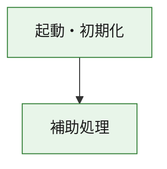
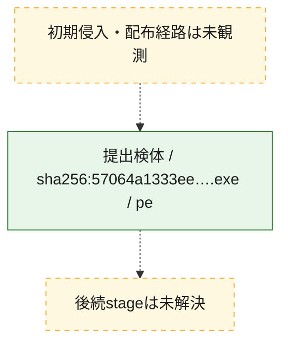
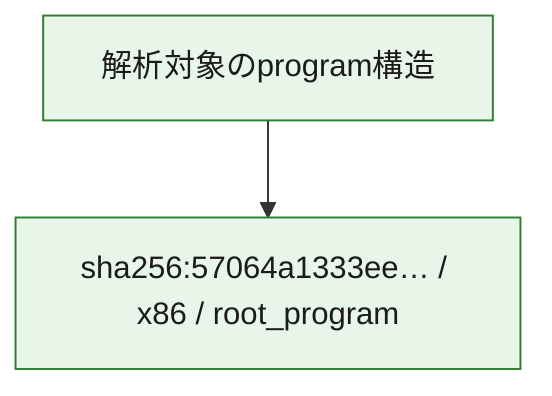

# 全体ロジック：57064a1333ee0c401f074c3e7842d8ef485b0ce23b37ea18c4a0eeb3bc6657cc

代表関数の静的証跡から、起動・初期化の処理群を確認しました。

## 読み方

- phaseの掲載順は解析上の整理順です。observed_call_edgesがない段階間の実行順を断定しません。
- 図の実線は静的に観測した関係、点線と黄色のノードは未観測・未解決の関係を示します。
- 図は静的な要約であり、動的実行を再現するものではありません。
- 詳細な関数解説とfingerprintは[STATIC-LOGIC.md](STATIC-LOGIC.md)を参照してください。

## 静的可視化

### 実行フロー

### 感染チェーン

### モジュール関係

## 処理段階

### 1. 起動・初期化

entry pointから初期化と後続処理への移行を確認します。
確度: `confirmed_static_function_evidence`

- `57064a1333ee0c401f074c3e7842d8ef485b0ce23b37ea18c4a0eeb3bc6657cc:ghidra:180001010` — 初期化と主要処理への分岐を行う入口関数です。 状態: `succeeded`、選定理由: `entry_point`, `meaningful_symbol_name`, `reviewed_call_centrality:22`, `role:entrypoint`, `small_program_complete_context`

### 2. 補助処理

主要処理を支える一般内部関数またはlibrary処理を確認します。
確度: `confirmed_static_function_evidence`

- `57064a1333ee0c401f074c3e7842d8ef485b0ce23b37ea18c4a0eeb3bc6657cc:ghidra:180001240` — 検体内部の一般処理を実装する関数です。 状態: `succeeded`、選定理由: `context_representative`, `reviewed_call_centrality:2`, `small_program_complete_context`
- `57064a1333ee0c401f074c3e7842d8ef485b0ce23b37ea18c4a0eeb3bc6657cc:ghidra:180001350` — 検体内部の一般処理を実装する関数です。 状態: `succeeded`、選定理由: `context_representative`, `reviewed_call_centrality:25`, `small_program_complete_context`
- `57064a1333ee0c401f074c3e7842d8ef485b0ce23b37ea18c4a0eeb3bc6657cc:ghidra:180003780` — 検体内部の一般処理を実装する関数です。 状態: `succeeded`、選定理由: `context_representative`, `reviewed_call_centrality:2`, `small_program_complete_context`
- `57064a1333ee0c401f074c3e7842d8ef485b0ce23b37ea18c4a0eeb3bc6657cc:ghidra:1800038e0` — 検体内部の一般処理を実装する関数です。 状態: `succeeded`、選定理由: `context_representative`, `reviewed_call_centrality:2`, `small_program_complete_context`

## 観測したcall関係

- `57064a1333ee0c401f074c3e7842d8ef485b0ce23b37ea18c4a0eeb3bc6657cc:ghidra:180001010` → `57064a1333ee0c401f074c3e7842d8ef485b0ce23b37ea18c4a0eeb3bc6657cc:ghidra:180001240` （`startup` → `support`）
- `57064a1333ee0c401f074c3e7842d8ef485b0ce23b37ea18c4a0eeb3bc6657cc:ghidra:180001010` → `57064a1333ee0c401f074c3e7842d8ef485b0ce23b37ea18c4a0eeb3bc6657cc:ghidra:180001350` （`startup` → `support`）
- `57064a1333ee0c401f074c3e7842d8ef485b0ce23b37ea18c4a0eeb3bc6657cc:ghidra:180001350` → `57064a1333ee0c401f074c3e7842d8ef485b0ce23b37ea18c4a0eeb3bc6657cc:ghidra:180001240` （`support` → `support`）
- `57064a1333ee0c401f074c3e7842d8ef485b0ce23b37ea18c4a0eeb3bc6657cc:ghidra:180001350` → `57064a1333ee0c401f074c3e7842d8ef485b0ce23b37ea18c4a0eeb3bc6657cc:ghidra:180003780` （`support` → `support`）
- `57064a1333ee0c401f074c3e7842d8ef485b0ce23b37ea18c4a0eeb3bc6657cc:ghidra:180001350` → `57064a1333ee0c401f074c3e7842d8ef485b0ce23b37ea18c4a0eeb3bc6657cc:ghidra:1800038e0` （`support` → `support`）
- `57064a1333ee0c401f074c3e7842d8ef485b0ce23b37ea18c4a0eeb3bc6657cc:ghidra:180003780` → `57064a1333ee0c401f074c3e7842d8ef485b0ce23b37ea18c4a0eeb3bc6657cc:ghidra:1800038e0` （`support` → `support`）
- `ghidra-function:16de1485fbb4154d4dc3649d` → `ghidra-function:fbf0e102b7082d82ab23d358` （`unclassified` → `unclassified`）
- `ghidra-function:7213cb54ca8975e3a39e8395` → `ghidra-external:030d70dbc821a701d4d6eb52` （`unclassified` → `unclassified`）
- `ghidra-function:7213cb54ca8975e3a39e8395` → `ghidra-external:099f56c43b74c0094b0b4f7b` （`unclassified` → `unclassified`）
- `ghidra-function:7213cb54ca8975e3a39e8395` → `ghidra-external:2014d0053ee3c0d58aa6955c` （`unclassified` → `unclassified`）
- `ghidra-function:7213cb54ca8975e3a39e8395` → `ghidra-external:20df9e2306b4462574cd2a8b` （`unclassified` → `unclassified`）
- `ghidra-function:7213cb54ca8975e3a39e8395` → `ghidra-external:2422f143e31abab6193e5f0f` （`unclassified` → `unclassified`）
- `ghidra-function:7213cb54ca8975e3a39e8395` → `ghidra-external:2fdda0d3d116ac39505fa2ef` （`unclassified` → `unclassified`）
- `ghidra-function:7213cb54ca8975e3a39e8395` → `ghidra-external:387e51621002020af4c58612` （`unclassified` → `unclassified`）
- `ghidra-function:7213cb54ca8975e3a39e8395` → `ghidra-external:4efa240eccd449352cbc6567` （`unclassified` → `unclassified`）
- `ghidra-function:7213cb54ca8975e3a39e8395` → `ghidra-external:57cc2b88fd2149f6dbcdc8c6` （`unclassified` → `unclassified`）
- `ghidra-function:7213cb54ca8975e3a39e8395` → `ghidra-external:615c04cdd71e7a3e6047735e` （`unclassified` → `unclassified`）
- `ghidra-function:7213cb54ca8975e3a39e8395` → `ghidra-external:61ecd5585d1e4a413b66d7e5` （`unclassified` → `unclassified`）
- `ghidra-function:7213cb54ca8975e3a39e8395` → `ghidra-external:75dbef8d2cfc233f2801974f` （`unclassified` → `unclassified`）
- `ghidra-function:7213cb54ca8975e3a39e8395` → `ghidra-external:7a22baeb58d7b8ae81d4c6b3` （`unclassified` → `unclassified`）
- `ghidra-function:7213cb54ca8975e3a39e8395` → `ghidra-external:8f12b6752c0fa319c083a9e3` （`unclassified` → `unclassified`）
- `ghidra-function:7213cb54ca8975e3a39e8395` → `ghidra-external:93a0b2934d9898263bccca96` （`unclassified` → `unclassified`）
- `ghidra-function:7213cb54ca8975e3a39e8395` → `ghidra-external:9485a82811bb8db737eb4332` （`unclassified` → `unclassified`）
- `ghidra-function:7213cb54ca8975e3a39e8395` → `ghidra-external:bd854c92e38df4c1b09f55d6` （`unclassified` → `unclassified`）
- `ghidra-function:7213cb54ca8975e3a39e8395` → `ghidra-external:beccf531b1fbcc7992500c60` （`unclassified` → `unclassified`）
- `ghidra-function:7213cb54ca8975e3a39e8395` → `ghidra-external:c9cbb056509056af74ac65ae` （`unclassified` → `unclassified`）
- `ghidra-function:7213cb54ca8975e3a39e8395` → `ghidra-external:cc70efed1a60c4e33337f1db` （`unclassified` → `unclassified`）
- `ghidra-function:7213cb54ca8975e3a39e8395` → `ghidra-external:dd867b704f0305f64ccf3e3e` （`unclassified` → `unclassified`）
- `ghidra-function:7213cb54ca8975e3a39e8395` → `ghidra-function:16de1485fbb4154d4dc3649d` （`unclassified` → `unclassified`）
- `ghidra-function:7213cb54ca8975e3a39e8395` → `ghidra-function:4c5a16a29cc26b53b2dfa6dc` （`unclassified` → `unclassified`）
- `ghidra-function:7213cb54ca8975e3a39e8395` → `ghidra-function:fbf0e102b7082d82ab23d358` （`unclassified` → `unclassified`）
- `ghidra-function:917461566c75ce0db861761b` → `ghidra-function:1f79fa8461909f13ed2c2103` （`unclassified` → `unclassified`）
- `ghidra-function:917461566c75ce0db861761b` → `ghidra-function:22bd2c858dbe36e32e12e6d7` （`unclassified` → `unclassified`）
- `ghidra-function:917461566c75ce0db861761b` → `ghidra-function:2d6eb6876f173dad029800ae` （`unclassified` → `unclassified`）
- `ghidra-function:917461566c75ce0db861761b` → `ghidra-function:4a3c074d4e5f40b05646e830` （`unclassified` → `unclassified`）
- `ghidra-function:917461566c75ce0db861761b` → `ghidra-function:4c5a16a29cc26b53b2dfa6dc` （`unclassified` → `unclassified`）
- `ghidra-function:917461566c75ce0db861761b` → `ghidra-function:5d04733adacef19f6a6766cc` （`unclassified` → `unclassified`）
- `ghidra-function:917461566c75ce0db861761b` → `ghidra-function:67b1d0ff7322ee808a600e8f` （`unclassified` → `unclassified`）
- `ghidra-function:917461566c75ce0db861761b` → `ghidra-function:70705f5a6edfb0ea76d594e5` （`unclassified` → `unclassified`）
- `ghidra-function:917461566c75ce0db861761b` → `ghidra-function:7213cb54ca8975e3a39e8395` （`unclassified` → `unclassified`）
- `ghidra-function:917461566c75ce0db861761b` → `ghidra-function:8e3a43264b14b7e02feef4b6` （`unclassified` → `unclassified`）
- `ghidra-function:917461566c75ce0db861761b` → `ghidra-function:acea82e6a0bc9b300b7e2919` （`unclassified` → `unclassified`）
- `ghidra-function:917461566c75ce0db861761b` → `ghidra-function:d0c3343e1427ff32a5ab872f` （`unclassified` → `unclassified`）

## 解析範囲と制約

- 選定外関数は全体inventoryへ残しますが、関数本体の個別解説対象にはしていません。
- indirect call、難読化、packer、VM、壊れたcontrol flowによりcall関係が欠落する場合があります。
- 文書は静的解析に基づき、検体実行や外部通信による動的確認は行っていません。
