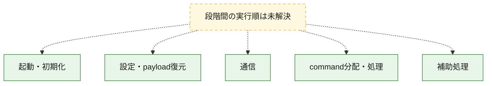
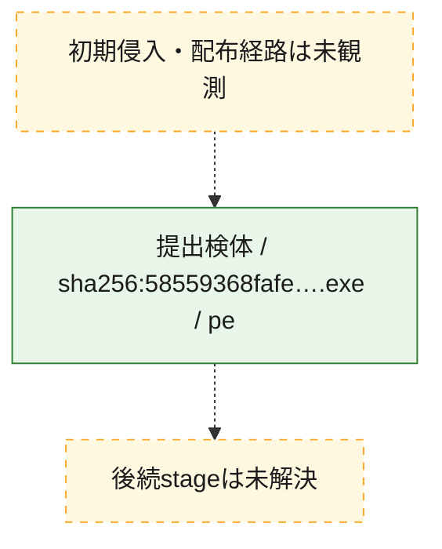
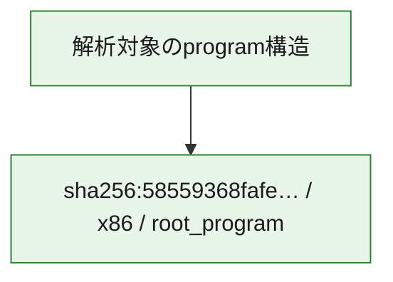

# 全体ロジック：58559368fafe00bd435188bd5b89c8568503568805ac7ceddccb37f7bc2db636

代表関数の静的証跡から、起動・初期化、設定・payload復元、通信、command分配・処理の処理群を確認しました。

## 読み方

- phaseの掲載順は解析上の整理順です。observed_call_edgesがない段階間の実行順を断定しません。
- 図の実線は静的に観測した関係、点線と黄色のノードは未観測・未解決の関係を示します。
- 図は静的な要約であり、動的実行を再現するものではありません。
- 詳細な関数解説とfingerprintは[STATIC-LOGIC.md](STATIC-LOGIC.md)を参照してください。

## 静的可視化

### 実行フロー

### 感染チェーン

### モジュール関係

## 処理段階

### 1. 起動・初期化

entry pointから初期化と後続処理への移行を確認します。
確度: `confirmed_static_function_evidence`

- `58559368fafe00bd435188bd5b89c8568503568805ac7ceddccb37f7bc2db636:ghidra:141028d00` — 初期化と主要処理への分岐を行う入口関数です。 状態: `succeeded`、選定理由: `entry_point`, `meaningful_symbol_name`, `reviewed_call_centrality:1`, `role:entrypoint`

### 2. 設定・payload復元

設定、resource、payload、暗号化データの復元・変換を確認します。
確度: `confirmed_static_function_evidence_with_limits`

- `58559368fafe00bd435188bd5b89c8568503568805ac7ceddccb37f7bc2db636:ghidra:14002fbb0` — 設定、resource、payloadなどの解析・変換を行う関数です。 状態: `succeeded`、選定理由: `entry_point`, `meaningful_symbol_name`, `reviewed_call_centrality:2`, `role:config_or_data_transform`
- `58559368fafe00bd435188bd5b89c8568503568805ac7ceddccb37f7bc2db636:ghidra:1403fcc20` — 設定、resource、payloadなどの解析・変換を行う関数です。 状態: `succeeded`、選定理由: `entry_point`, `meaningful_symbol_name`, `reviewed_call_centrality:8`, `role:config_or_data_transform`
- `58559368fafe00bd435188bd5b89c8568503568805ac7ceddccb37f7bc2db636:ghidra:1403fce90` — 設定、resource、payloadなどの解析・変換を行う関数です。 状態: `succeeded`、選定理由: `entry_point`, `meaningful_symbol_name`, `reviewed_call_centrality:6`, `role:config_or_data_transform`
- `58559368fafe00bd435188bd5b89c8568503568805ac7ceddccb37f7bc2db636:ghidra:1403fd1f0` — 設定、resource、payloadなどの解析・変換を行う関数です。 状態: `succeeded`、選定理由: `entry_point`, `meaningful_symbol_name`, `reviewed_call_centrality:51`, `role:config_or_data_transform`
- `58559368fafe00bd435188bd5b89c8568503568805ac7ceddccb37f7bc2db636:ghidra:1403fdb70` — 設定、resource、payloadなどの解析・変換を行う関数です。 状態: `succeeded`、選定理由: `entry_point`, `meaningful_symbol_name`, `reviewed_call_centrality:7`, `role:config_or_data_transform`
- `58559368fafe00bd435188bd5b89c8568503568805ac7ceddccb37f7bc2db636:ghidra:1403ff930` — 設定、resource、payloadなどの解析・変換を行う関数です。 状態: `succeeded`、選定理由: `entry_point`, `meaningful_symbol_name`, `reviewed_call_centrality:5`, `role:config_or_data_transform`
- `58559368fafe00bd435188bd5b89c8568503568805ac7ceddccb37f7bc2db636:ghidra:1403ff9b0` — 設定、resource、payloadなどの解析・変換を行う関数です。 状態: `succeeded`、選定理由: `entry_point`, `meaningful_symbol_name`, `reviewed_call_centrality:13`, `role:config_or_data_transform`
- `58559368fafe00bd435188bd5b89c8568503568805ac7ceddccb37f7bc2db636:ghidra:1403ffb20` — 設定、resource、payloadなどの解析・変換を行う関数です。 状態: `succeeded`、選定理由: `entry_point`, `meaningful_symbol_name`, `reviewed_call_centrality:7`, `role:config_or_data_transform`
- `58559368fafe00bd435188bd5b89c8568503568805ac7ceddccb37f7bc2db636:ghidra:1403ffbc0` — 設定、resource、payloadなどの解析・変換を行う関数です。 状態: `succeeded`、選定理由: `entry_point`, `meaningful_symbol_name`, `reviewed_call_centrality:7`, `role:config_or_data_transform`
- `58559368fafe00bd435188bd5b89c8568503568805ac7ceddccb37f7bc2db636:ghidra:1403ffcb0` — 設定、resource、payloadなどの解析・変換を行う関数です。 状態: `succeeded`、選定理由: `entry_point`, `meaningful_symbol_name`, `reviewed_call_centrality:2`, `role:config_or_data_transform`
- `58559368fafe00bd435188bd5b89c8568503568805ac7ceddccb37f7bc2db636:ghidra:1403ffcf0` — 設定、resource、payloadなどの解析・変換を行う関数です。 状態: `succeeded`、選定理由: `entry_point`, `meaningful_symbol_name`, `reviewed_call_centrality:7`, `role:config_or_data_transform`
- `58559368fafe00bd435188bd5b89c8568503568805ac7ceddccb37f7bc2db636:ghidra:1403ffde0` — 設定、resource、payloadなどの解析・変換を行う関数です。 状態: `succeeded`、選定理由: `entry_point`, `meaningful_symbol_name`, `reviewed_call_centrality:7`, `role:config_or_data_transform`
- `58559368fafe00bd435188bd5b89c8568503568805ac7ceddccb37f7bc2db636:ghidra:1403ffef0` — 設定、resource、payloadなどの解析・変換を行う関数です。 状態: `succeeded`、選定理由: `entry_point`, `meaningful_symbol_name`, `reviewed_call_centrality:5`, `role:config_or_data_transform`
- `58559368fafe00bd435188bd5b89c8568503568805ac7ceddccb37f7bc2db636:ghidra:1404a7800` — 設定、resource、payloadなどの解析・変換を行う関数です。 状態: `failed_empty`、選定理由: `entry_point`, `meaningful_symbol_name`, `role:config_or_data_transform`
- `58559368fafe00bd435188bd5b89c8568503568805ac7ceddccb37f7bc2db636:ghidra:140899ec0` — 暗号、hash、encoding、または復号処理に関係する関数です。 状態: `succeeded`、選定理由: `entry_point`, `meaningful_symbol_name`, `reviewed_call_centrality:11`, `role:cryptographic_transform`
- `58559368fafe00bd435188bd5b89c8568503568805ac7ceddccb37f7bc2db636:ghidra:14089a260` — 暗号、hash、encoding、または復号処理に関係する関数です。 状態: `succeeded`、選定理由: `entry_point`, `meaningful_symbol_name`, `reviewed_call_centrality:11`, `role:cryptographic_transform`
- `58559368fafe00bd435188bd5b89c8568503568805ac7ceddccb37f7bc2db636:ghidra:140f325e0` — 設定、resource、payloadなどの解析・変換を行う関数です。 状態: `succeeded`、選定理由: `entry_point`, `meaningful_symbol_name`, `reviewed_call_centrality:5`, `role:config_or_data_transform`
- `58559368fafe00bd435188bd5b89c8568503568805ac7ceddccb37f7bc2db636:ghidra:140f326c0` — 設定、resource、payloadなどの解析・変換を行う関数です。 状態: `succeeded`、選定理由: `entry_point`, `meaningful_symbol_name`, `reviewed_call_centrality:5`, `role:config_or_data_transform`
- `58559368fafe00bd435188bd5b89c8568503568805ac7ceddccb37f7bc2db636:ghidra:140f337f0` — 設定、resource、payloadなどの解析・変換を行う関数です。 状態: `succeeded`、選定理由: `entry_point`, `meaningful_symbol_name`, `reviewed_call_centrality:7`, `role:config_or_data_transform`
- `58559368fafe00bd435188bd5b89c8568503568805ac7ceddccb37f7bc2db636:ghidra:140f338d0` — 設定、resource、payloadなどの解析・変換を行う関数です。 状態: `succeeded`、選定理由: `entry_point`, `meaningful_symbol_name`, `reviewed_call_centrality:5`, `role:config_or_data_transform`

### 3. 通信

通信初期化、endpoint処理、送受信の役割を確認します。
確度: `confirmed_static_function_evidence`

- `58559368fafe00bd435188bd5b89c8568503568805ac7ceddccb37f7bc2db636:ghidra:140f87430` — 通信初期化、送受信、またはendpoint処理に関係する関数です。 状態: `succeeded`、選定理由: `entry_point`, `meaningful_symbol_name`, `reviewed_call_centrality:21`, `role:network_communication`

### 4. command分配・処理

受信commandやtaskの解釈、分配、個別handlerへの移行を確認します。
確度: `confirmed_static_function_evidence_with_limits`

- `58559368fafe00bd435188bd5b89c8568503568805ac7ceddccb37f7bc2db636:ghidra:1400017a0` — commandの解釈、分配、または個別処理を担当する関数です。 状態: `succeeded`、選定理由: `entry_point`, `meaningful_symbol_name`, `reviewed_call_centrality:2`, `role:command_dispatch_or_handler`
- `58559368fafe00bd435188bd5b89c8568503568805ac7ceddccb37f7bc2db636:ghidra:1403fbb40` — commandの解釈、分配、または個別処理を担当する関数です。 状態: `succeeded`、選定理由: `entry_point`, `meaningful_symbol_name`, `reviewed_call_centrality:11`, `role:command_dispatch_or_handler`
- `58559368fafe00bd435188bd5b89c8568503568805ac7ceddccb37f7bc2db636:ghidra:1403fbc90` — commandの解釈、分配、または個別処理を担当する関数です。 状態: `succeeded`、選定理由: `entry_point`, `meaningful_symbol_name`, `reviewed_call_centrality:4`, `role:command_dispatch_or_handler`
- `58559368fafe00bd435188bd5b89c8568503568805ac7ceddccb37f7bc2db636:ghidra:140419670` — commandの解釈、分配、または個別処理を担当する関数です。 状態: `failed_empty`、選定理由: `entry_point`, `meaningful_symbol_name`, `role:command_dispatch_or_handler`
- `58559368fafe00bd435188bd5b89c8568503568805ac7ceddccb37f7bc2db636:ghidra:1408528f0` — commandの解釈、分配、または個別処理を担当する関数です。 状態: `succeeded`、選定理由: `entry_point`, `meaningful_symbol_name`, `reviewed_call_centrality:2`, `role:command_dispatch_or_handler`
- `58559368fafe00bd435188bd5b89c8568503568805ac7ceddccb37f7bc2db636:ghidra:140f33620` — commandの解釈、分配、または個別処理を担当する関数です。 状態: `succeeded`、選定理由: `entry_point`, `meaningful_symbol_name`, `reviewed_call_centrality:4`, `role:command_dispatch_or_handler`
- `58559368fafe00bd435188bd5b89c8568503568805ac7ceddccb37f7bc2db636:ghidra:140f35830` — commandの解釈、分配、または個別処理を担当する関数です。 状態: `succeeded`、選定理由: `entry_point`, `meaningful_symbol_name`, `reviewed_call_centrality:13`, `role:command_dispatch_or_handler`
- `58559368fafe00bd435188bd5b89c8568503568805ac7ceddccb37f7bc2db636:ghidra:140f36990` — commandの解釈、分配、または個別処理を担当する関数です。 状態: `succeeded`、選定理由: `entry_point`, `meaningful_symbol_name`, `reviewed_call_centrality:10`, `role:command_dispatch_or_handler`

### 5. 補助処理

主要処理を支える一般内部関数またはlibrary処理を確認します。
確度: `confirmed_static_function_evidence`

- `58559368fafe00bd435188bd5b89c8568503568805ac7ceddccb37f7bc2db636:ghidra:1400011b0` — 検体内部の一般処理を実装する関数です。 状態: `succeeded`、選定理由: `entry_point`, `meaningful_symbol_name`, `reviewed_call_centrality:4`
- `58559368fafe00bd435188bd5b89c8568503568805ac7ceddccb37f7bc2db636:ghidra:1421c4e00` — compiler生成処理または汎用library処理とみられる関数です。 状態: `succeeded`、選定理由: `entry_point`, `meaningful_symbol_name`, `reviewed_call_centrality:1`

## 観測したcall関係

- `ghidra-function:0d203d272beb55b9884b5baf` → `ghidra-external:16f9f2c2252b9a226f50f8b2` （`unclassified` → `unclassified`）
- `ghidra-function:0d203d272beb55b9884b5baf` → `ghidra-external:88d2262016cb4ad5fdc848bd` （`unclassified` → `unclassified`）
- `ghidra-function:0d203d272beb55b9884b5baf` → `ghidra-function:0c987d519392380fb476b8d6` （`unclassified` → `unclassified`）
- `ghidra-function:0d203d272beb55b9884b5baf` → `ghidra-function:27eab2f8165c83134ba3094f` （`unclassified` → `unclassified`）
- `ghidra-function:14777dfba89892ff4ca5df55` → `ghidra-external:16f9f2c2252b9a226f50f8b2` （`unclassified` → `unclassified`）
- `ghidra-function:14777dfba89892ff4ca5df55` → `ghidra-external:2dc30306d5086777e140cc9e` （`unclassified` → `unclassified`）
- `ghidra-function:14777dfba89892ff4ca5df55` → `ghidra-external:55d6a5f063a818e6e4f9ca14` （`unclassified` → `unclassified`）
- `ghidra-function:14777dfba89892ff4ca5df55` → `ghidra-external:58003092d9ace197a7d17d75` （`unclassified` → `unclassified`）
- `ghidra-function:14777dfba89892ff4ca5df55` → `ghidra-external:dc743f774aaa87abf7a7a36e` （`unclassified` → `unclassified`）
- `ghidra-function:14777dfba89892ff4ca5df55` → `ghidra-external:ed9fecac880ba656d1721030` （`unclassified` → `unclassified`）
- `ghidra-function:14777dfba89892ff4ca5df55` → `ghidra-function:27eab2f8165c83134ba3094f` （`unclassified` → `unclassified`）
- `ghidra-function:14777dfba89892ff4ca5df55` → `ghidra-function:2926f54cf2b7c59296383b8d` （`unclassified` → `unclassified`）
- `ghidra-function:14777dfba89892ff4ca5df55` → `ghidra-function:3966963f6798000274269eac` （`unclassified` → `unclassified`）
- `ghidra-function:14777dfba89892ff4ca5df55` → `ghidra-function:4816cb3f3b55b3e9974663c1` （`unclassified` → `unclassified`）
- `ghidra-function:14777dfba89892ff4ca5df55` → `ghidra-function:83a5e694ba467c5a7d268aac` （`unclassified` → `unclassified`）
- `ghidra-function:14777dfba89892ff4ca5df55` → `ghidra-function:c2049c23c113e396f18bff9c` （`unclassified` → `unclassified`）
- `ghidra-function:14777dfba89892ff4ca5df55` → `ghidra-function:cf26c775468aa2a7ecb378f6` （`unclassified` → `unclassified`）
- `ghidra-function:147abb727c9255109e7167e7` → `ghidra-external:006472f2fe316318b072a32d` （`unclassified` → `unclassified`）
- `ghidra-function:147abb727c9255109e7167e7` → `ghidra-external:16f9f2c2252b9a226f50f8b2` （`unclassified` → `unclassified`）
- `ghidra-function:147abb727c9255109e7167e7` → `ghidra-external:29ae8da61cc362ba47d8a040` （`unclassified` → `unclassified`）
- `ghidra-function:147abb727c9255109e7167e7` → `ghidra-external:69ee540ab3a574a9f2cbe7ce` （`unclassified` → `unclassified`）
- `ghidra-function:147abb727c9255109e7167e7` → `ghidra-external:bf454f6be18f62c8248cae6f` （`unclassified` → `unclassified`）
- `ghidra-function:147abb727c9255109e7167e7` → `ghidra-function:389a0608af87975303a02112` （`unclassified` → `unclassified`）
- `ghidra-function:147abb727c9255109e7167e7` → `ghidra-function:4d6872bf68c042015f623243` （`unclassified` → `unclassified`）
- `ghidra-function:147abb727c9255109e7167e7` → `ghidra-function:72f3f3f0ed6247f4e5516890` （`unclassified` → `unclassified`）
- `ghidra-function:147abb727c9255109e7167e7` → `ghidra-function:7c975c71ad921b8a26d2c2b3` （`unclassified` → `unclassified`）
- `ghidra-function:147abb727c9255109e7167e7` → `ghidra-function:dd03669cbda5c42bf47d47ef` （`unclassified` → `unclassified`）
- `ghidra-function:147abb727c9255109e7167e7` → `ghidra-function:ee2ba15a76a13bd0673c05eb` （`unclassified` → `unclassified`）
- `ghidra-function:1717a1987841ddea541dbc87` → `ghidra-external:0eeda81bbb8a7feca3427fc0` （`unclassified` → `unclassified`）
- `ghidra-function:1717a1987841ddea541dbc87` → `ghidra-external:16f9f2c2252b9a226f50f8b2` （`unclassified` → `unclassified`）
- `ghidra-function:1717a1987841ddea541dbc87` → `ghidra-external:5852358572b38bd868e7a047` （`unclassified` → `unclassified`）
- `ghidra-function:1717a1987841ddea541dbc87` → `ghidra-external:8277473bffa8e454bb334356` （`unclassified` → `unclassified`）
- `ghidra-function:1717a1987841ddea541dbc87` → `ghidra-external:efe1a3c4bcf925445d5d6498` （`unclassified` → `unclassified`）
- `ghidra-function:1717a1987841ddea541dbc87` → `ghidra-function:27eab2f8165c83134ba3094f` （`unclassified` → `unclassified`）
- `ghidra-function:1717a1987841ddea541dbc87` → `ghidra-function:8a356817644dc915eb7ed2be` （`unclassified` → `unclassified`）
- `ghidra-function:1db6bc03e090aa8fedb08a71` → `ghidra-external:0771c5a4029a7ee81dde49e0` （`unclassified` → `unclassified`）
- `ghidra-function:1db6bc03e090aa8fedb08a71` → `ghidra-external:16f9f2c2252b9a226f50f8b2` （`unclassified` → `unclassified`）
- `ghidra-function:1db6bc03e090aa8fedb08a71` → `ghidra-function:27eab2f8165c83134ba3094f` （`unclassified` → `unclassified`）
- `ghidra-function:1db6bc03e090aa8fedb08a71` → `ghidra-function:e95195d84d3057e2c4745cf3` （`unclassified` → `unclassified`）
- `ghidra-function:1db6bc03e090aa8fedb08a71` → `ghidra-function:f05bf5da639e82f092e2fe01` （`unclassified` → `unclassified`）
- `ghidra-function:26244532147a0f64d1577307` → `ghidra-external:16f9f2c2252b9a226f50f8b2` （`unclassified` → `unclassified`）
- `ghidra-function:26244532147a0f64d1577307` → `ghidra-external:38fba4c0a8766aea9c047505` （`unclassified` → `unclassified`）
- `ghidra-function:26244532147a0f64d1577307` → `ghidra-external:60a7f3ab30d0a732bf2e3423` （`unclassified` → `unclassified`）
- `ghidra-function:26244532147a0f64d1577307` → `ghidra-external:9f535d9795b31feb487d6d59` （`unclassified` → `unclassified`）
- `ghidra-function:26244532147a0f64d1577307` → `ghidra-function:25ac6a499f7c82599b10a936` （`unclassified` → `unclassified`）
- `ghidra-function:26244532147a0f64d1577307` → `ghidra-function:27eab2f8165c83134ba3094f` （`unclassified` → `unclassified`）
- `ghidra-function:26244532147a0f64d1577307` → `ghidra-function:e96704b94abae995783266fb` （`unclassified` → `unclassified`）
- `ghidra-function:2dcf9261fd6a9cbbe590087a` → `ghidra-external:16f9f2c2252b9a226f50f8b2` （`unclassified` → `unclassified`）
- `ghidra-function:2dcf9261fd6a9cbbe590087a` → `ghidra-external:3cb85025746330419b50496f` （`unclassified` → `unclassified`）
- `ghidra-function:2dcf9261fd6a9cbbe590087a` → `ghidra-external:53b9f94a048bca47e75c5040` （`unclassified` → `unclassified`）
- `ghidra-function:2dcf9261fd6a9cbbe590087a` → `ghidra-external:ac408c9c9e777b6b033fc55a` （`unclassified` → `unclassified`）
- `ghidra-function:2dcf9261fd6a9cbbe590087a` → `ghidra-external:dc743f774aaa87abf7a7a36e` （`unclassified` → `unclassified`）
- `ghidra-function:2dcf9261fd6a9cbbe590087a` → `ghidra-function:27eab2f8165c83134ba3094f` （`unclassified` → `unclassified`）
- `ghidra-function:2dcf9261fd6a9cbbe590087a` → `ghidra-function:60106a7450b3f73df6cffe34` （`unclassified` → `unclassified`）
- `ghidra-function:3f6ed51ad4411db4ab851a6f` → `ghidra-external:16f9f2c2252b9a226f50f8b2` （`unclassified` → `unclassified`）
- `ghidra-function:3f6ed51ad4411db4ab851a6f` → `ghidra-external:7367c589dd2b80c90cd7b746` （`unclassified` → `unclassified`）
- `ghidra-function:3f6ed51ad4411db4ab851a6f` → `ghidra-function:27eab2f8165c83134ba3094f` （`unclassified` → `unclassified`）
- `ghidra-function:3f6ed51ad4411db4ab851a6f` → `ghidra-function:e95195d84d3057e2c4745cf3` （`unclassified` → `unclassified`）
- `ghidra-function:3f6ed51ad4411db4ab851a6f` → `ghidra-function:f05bf5da639e82f092e2fe01` （`unclassified` → `unclassified`）
- `ghidra-function:41d63fbb0524d2d49bb48844` → `ghidra-external:16f9f2c2252b9a226f50f8b2` （`unclassified` → `unclassified`）
- `ghidra-function:41d63fbb0524d2d49bb48844` → `ghidra-external:60a7f3ab30d0a732bf2e3423` （`unclassified` → `unclassified`）
- `ghidra-function:41d63fbb0524d2d49bb48844` → `ghidra-external:c1bfda3ea6c54be8a5c6b2a4` （`unclassified` → `unclassified`）
- `ghidra-function:41d63fbb0524d2d49bb48844` → `ghidra-external:ffe9a5f089a10975c7d09615` （`unclassified` → `unclassified`）
- `ghidra-function:41d63fbb0524d2d49bb48844` → `ghidra-function:25ac6a499f7c82599b10a936` （`unclassified` → `unclassified`）
- `ghidra-function:41d63fbb0524d2d49bb48844` → `ghidra-function:27eab2f8165c83134ba3094f` （`unclassified` → `unclassified`）
- `ghidra-function:41d63fbb0524d2d49bb48844` → `ghidra-function:e96704b94abae995783266fb` （`unclassified` → `unclassified`）
- `ghidra-function:42e73d2eb71327d6d9f69b3e` → `ghidra-external:11f3d580e9c112bb64332c0e` （`unclassified` → `unclassified`）
- `ghidra-function:42e73d2eb71327d6d9f69b3e` → `ghidra-external:16f9f2c2252b9a226f50f8b2` （`unclassified` → `unclassified`）
- `ghidra-function:42e73d2eb71327d6d9f69b3e` → `ghidra-external:7ca1993b41fbb41fc75d4cdf` （`unclassified` → `unclassified`）
- `ghidra-function:42e73d2eb71327d6d9f69b3e` → `ghidra-external:7d34efcc348566123982b783` （`unclassified` → `unclassified`）
- `ghidra-function:42e73d2eb71327d6d9f69b3e` → `ghidra-function:27eab2f8165c83134ba3094f` （`unclassified` → `unclassified`）
- `ghidra-function:42e73d2eb71327d6d9f69b3e` → `ghidra-function:e2a2ac6241a3254c1a4a25f7` （`unclassified` → `unclassified`）
- `ghidra-function:46592666ade006b7a45c076f` → `ghidra-external:16f9f2c2252b9a226f50f8b2` （`unclassified` → `unclassified`）
- `ghidra-function:46592666ade006b7a45c076f` → `ghidra-external:4d2b98923200710542410233` （`unclassified` → `unclassified`）
- `ghidra-function:46592666ade006b7a45c076f` → `ghidra-external:521442113970578d4449ceef` （`unclassified` → `unclassified`）
- `ghidra-function:46592666ade006b7a45c076f` → `ghidra-external:60a7f3ab30d0a732bf2e3423` （`unclassified` → `unclassified`）
- `ghidra-function:46592666ade006b7a45c076f` → `ghidra-function:27eab2f8165c83134ba3094f` （`unclassified` → `unclassified`）
- `ghidra-function:4abf4bc01c3c24456c45e85d` → `ghidra-external:0036caa11d3519e9534c55a8` （`unclassified` → `unclassified`）
- `ghidra-function:4abf4bc01c3c24456c45e85d` → `ghidra-external:11f3d580e9c112bb64332c0e` （`unclassified` → `unclassified`）
- `ghidra-function:4abf4bc01c3c24456c45e85d` → `ghidra-external:16f9f2c2252b9a226f50f8b2` （`unclassified` → `unclassified`）
- `ghidra-function:4abf4bc01c3c24456c45e85d` → `ghidra-external:3c890b3c510f5e9a4d571929` （`unclassified` → `unclassified`）
- `ghidra-function:4abf4bc01c3c24456c45e85d` → `ghidra-external:6c13cb3ffac3d55b9e6f4a1a` （`unclassified` → `unclassified`）
- `ghidra-function:4abf4bc01c3c24456c45e85d` → `ghidra-external:7563ec31043adf7a6db73b6e` （`unclassified` → `unclassified`）
- `ghidra-function:4abf4bc01c3c24456c45e85d` → `ghidra-external:7642dfcea065075ebfc335c0` （`unclassified` → `unclassified`）
- `ghidra-function:4abf4bc01c3c24456c45e85d` → `ghidra-external:7ca1993b41fbb41fc75d4cdf` （`unclassified` → `unclassified`）
- `ghidra-function:4abf4bc01c3c24456c45e85d` → `ghidra-external:8582840450a098774e757d62` （`unclassified` → `unclassified`）
- `ghidra-function:4abf4bc01c3c24456c45e85d` → `ghidra-external:986de011ce985b61dbfcecb6` （`unclassified` → `unclassified`）
- `ghidra-function:4abf4bc01c3c24456c45e85d` → `ghidra-function:27eab2f8165c83134ba3094f` （`unclassified` → `unclassified`）
- `ghidra-function:4abf4bc01c3c24456c45e85d` → `ghidra-function:9d5d81f2d1ca8055cb09a9d0` （`unclassified` → `unclassified`）
- `ghidra-function:4abf4bc01c3c24456c45e85d` → `ghidra-function:f0b02a39b134368e2a33f896` （`unclassified` → `unclassified`）
- `ghidra-function:529247adbd2771ea40382946` → `ghidra-external:16f9f2c2252b9a226f50f8b2` （`unclassified` → `unclassified`）
- `ghidra-function:529247adbd2771ea40382946` → `ghidra-external:53dc272dd67dc58527608240` （`unclassified` → `unclassified`）
- `ghidra-function:529247adbd2771ea40382946` → `ghidra-external:58003092d9ace197a7d17d75` （`unclassified` → `unclassified`）
- `ghidra-function:529247adbd2771ea40382946` → `ghidra-external:ed9fecac880ba656d1721030` （`unclassified` → `unclassified`）
- `ghidra-function:529247adbd2771ea40382946` → `ghidra-function:27eab2f8165c83134ba3094f` （`unclassified` → `unclassified`）
- `ghidra-function:529247adbd2771ea40382946` → `ghidra-function:77fc43b06dacf891350536dc` （`unclassified` → `unclassified`）
- `ghidra-function:529247adbd2771ea40382946` → `ghidra-function:83a5e694ba467c5a7d268aac` （`unclassified` → `unclassified`）
- `ghidra-function:529247adbd2771ea40382946` → `ghidra-function:87b61fb7b2031b6cd85a33d9` （`unclassified` → `unclassified`）
- `ghidra-function:529247adbd2771ea40382946` → `ghidra-function:c2049c23c113e396f18bff9c` （`unclassified` → `unclassified`）
- `ghidra-function:529247adbd2771ea40382946` → `ghidra-function:cf26c775468aa2a7ecb378f6` （`unclassified` → `unclassified`）
- `ghidra-function:58de6043566850c7b89bb63f` → `ghidra-external:2fd18af497448dfe38ffc293` （`unclassified` → `unclassified`）
- `ghidra-function:5fa98e79f01141120403a309` → `ghidra-function:3f8a70a2d5087bf53880800a` （`unclassified` → `unclassified`）
- `ghidra-function:68cd241f1ef28ef6fdccc0b1` → `ghidra-external:0027e75147c83c471a6a39c8` （`unclassified` → `unclassified`）
- `ghidra-function:68cd241f1ef28ef6fdccc0b1` → `ghidra-external:0036caa11d3519e9534c55a8` （`unclassified` → `unclassified`）
- `ghidra-function:68cd241f1ef28ef6fdccc0b1` → `ghidra-external:11f3d580e9c112bb64332c0e` （`unclassified` → `unclassified`）
- `ghidra-function:68cd241f1ef28ef6fdccc0b1` → `ghidra-external:16f9f2c2252b9a226f50f8b2` （`unclassified` → `unclassified`）
- `ghidra-function:68cd241f1ef28ef6fdccc0b1` → `ghidra-external:182f763abadfbecaab5e9851` （`unclassified` → `unclassified`）
- `ghidra-function:68cd241f1ef28ef6fdccc0b1` → `ghidra-external:29ae8da61cc362ba47d8a040` （`unclassified` → `unclassified`）
- `ghidra-function:68cd241f1ef28ef6fdccc0b1` → `ghidra-external:32f9d517f2c2630ba2955292` （`unclassified` → `unclassified`）
- `ghidra-function:68cd241f1ef28ef6fdccc0b1` → `ghidra-external:358d53106fb9dc26250810a7` （`unclassified` → `unclassified`）
- `ghidra-function:68cd241f1ef28ef6fdccc0b1` → `ghidra-external:38b5849342db6489c535d22c` （`unclassified` → `unclassified`）
- `ghidra-function:68cd241f1ef28ef6fdccc0b1` → `ghidra-external:3ec0317da0ceb2eb011885c6` （`unclassified` → `unclassified`）
- `ghidra-function:68cd241f1ef28ef6fdccc0b1` → `ghidra-external:424a6e15dbb166676bf93c02` （`unclassified` → `unclassified`）
- `ghidra-function:68cd241f1ef28ef6fdccc0b1` → `ghidra-external:4e507ceaaaf22a3e000048bc` （`unclassified` → `unclassified`）
- `ghidra-function:68cd241f1ef28ef6fdccc0b1` → `ghidra-external:549208c48387768c19b6113c` （`unclassified` → `unclassified`）
- `ghidra-function:68cd241f1ef28ef6fdccc0b1` → `ghidra-external:5852358572b38bd868e7a047` （`unclassified` → `unclassified`）
- `ghidra-function:68cd241f1ef28ef6fdccc0b1` → `ghidra-external:69ee540ab3a574a9f2cbe7ce` （`unclassified` → `unclassified`）
- `ghidra-function:68cd241f1ef28ef6fdccc0b1` → `ghidra-external:6c13cb3ffac3d55b9e6f4a1a` （`unclassified` → `unclassified`）
- `ghidra-function:68cd241f1ef28ef6fdccc0b1` → `ghidra-external:73221437c3e2cf9d438f27a0` （`unclassified` → `unclassified`）
- `ghidra-function:68cd241f1ef28ef6fdccc0b1` → `ghidra-external:7523ad1c8dfb71e286aabb5c` （`unclassified` → `unclassified`）
- `ghidra-function:68cd241f1ef28ef6fdccc0b1` → `ghidra-external:790a5df35913296753347330` （`unclassified` → `unclassified`）
- `ghidra-function:68cd241f1ef28ef6fdccc0b1` → `ghidra-external:796c98aba51d91ac9c5655ef` （`unclassified` → `unclassified`）
- `ghidra-function:68cd241f1ef28ef6fdccc0b1` → `ghidra-external:7ca1993b41fbb41fc75d4cdf` （`unclassified` → `unclassified`）
- `ghidra-function:68cd241f1ef28ef6fdccc0b1` → `ghidra-external:8277473bffa8e454bb334356` （`unclassified` → `unclassified`）
- `ghidra-function:68cd241f1ef28ef6fdccc0b1` → `ghidra-external:8650389b860e1516e6ee003f` （`unclassified` → `unclassified`）
- `ghidra-function:68cd241f1ef28ef6fdccc0b1` → `ghidra-external:93a8dda2fff095602d90a6c8` （`unclassified` → `unclassified`）
- `ghidra-function:68cd241f1ef28ef6fdccc0b1` → `ghidra-external:94dba0c4c2f969b70bb4652d` （`unclassified` → `unclassified`）
- `ghidra-function:68cd241f1ef28ef6fdccc0b1` → `ghidra-external:986de011ce985b61dbfcecb6` （`unclassified` → `unclassified`）
- `ghidra-function:68cd241f1ef28ef6fdccc0b1` → `ghidra-external:98db9012d2c58f46639e1873` （`unclassified` → `unclassified`）
- `ghidra-function:68cd241f1ef28ef6fdccc0b1` → `ghidra-external:b52274b1e34a92efb499c332` （`unclassified` → `unclassified`）
- `ghidra-function:68cd241f1ef28ef6fdccc0b1` → `ghidra-external:c32819d56cda46bc75d76afb` （`unclassified` → `unclassified`）
- `ghidra-function:68cd241f1ef28ef6fdccc0b1` → `ghidra-external:ce2094253965d1f881d5364a` （`unclassified` → `unclassified`）
- `ghidra-function:68cd241f1ef28ef6fdccc0b1` → `ghidra-external:d532c7dfe9209b540a82176f` （`unclassified` → `unclassified`）
- `ghidra-function:68cd241f1ef28ef6fdccc0b1` → `ghidra-external:d6398bf46211862c9fc74e14` （`unclassified` → `unclassified`）
- `ghidra-function:68cd241f1ef28ef6fdccc0b1` → `ghidra-external:ddbf4ee4d1ff468d89bc1eb9` （`unclassified` → `unclassified`）
- `ghidra-function:68cd241f1ef28ef6fdccc0b1` → `ghidra-external:f62984b5636f30e8066919a7` （`unclassified` → `unclassified`）
- `ghidra-function:68cd241f1ef28ef6fdccc0b1` → `ghidra-external:fd739982bcd2f0b9b971285e` （`unclassified` → `unclassified`）
- `ghidra-function:68cd241f1ef28ef6fdccc0b1` → `ghidra-external:fde077b25a58922f0026a0f4` （`unclassified` → `unclassified`）
- `ghidra-function:68cd241f1ef28ef6fdccc0b1` → `ghidra-function:12409c9b3951eb33f9f7e3fd` （`unclassified` → `unclassified`）
- `ghidra-function:68cd241f1ef28ef6fdccc0b1` → `ghidra-function:27eab2f8165c83134ba3094f` （`unclassified` → `unclassified`）
- `ghidra-function:68cd241f1ef28ef6fdccc0b1` → `ghidra-function:374b55da7049eec1806a290d` （`unclassified` → `unclassified`）
- `ghidra-function:68cd241f1ef28ef6fdccc0b1` → `ghidra-function:383fe9b00186a5f26ca44dec` （`unclassified` → `unclassified`）
- `ghidra-function:68cd241f1ef28ef6fdccc0b1` → `ghidra-function:3c5e61fa55dfa043df3ae8fc` （`unclassified` → `unclassified`）
- `ghidra-function:68cd241f1ef28ef6fdccc0b1` → `ghidra-function:5214dd900052c78f23f42336` （`unclassified` → `unclassified`）
- `ghidra-function:68cd241f1ef28ef6fdccc0b1` → `ghidra-function:5d5f4b1603b84cd57562aa82` （`unclassified` → `unclassified`）
- `ghidra-function:68cd241f1ef28ef6fdccc0b1` → `ghidra-function:7117a62b762310da2b425707` （`unclassified` → `unclassified`）
- `ghidra-function:68cd241f1ef28ef6fdccc0b1` → `ghidra-function:8a356817644dc915eb7ed2be` （`unclassified` → `unclassified`）
- `ghidra-function:68cd241f1ef28ef6fdccc0b1` → `ghidra-function:9d5d81f2d1ca8055cb09a9d0` （`unclassified` → `unclassified`）
- `ghidra-function:68cd241f1ef28ef6fdccc0b1` → `ghidra-function:a99bca40cc46ea919e4d4dd9` （`unclassified` → `unclassified`）
- `ghidra-function:68cd241f1ef28ef6fdccc0b1` → `ghidra-function:c3626f2da675b911d4b69cee` （`unclassified` → `unclassified`）
- `ghidra-function:68cd241f1ef28ef6fdccc0b1` → `ghidra-function:d39df6bb6754f492269afedb` （`unclassified` → `unclassified`）
- `ghidra-function:68cd241f1ef28ef6fdccc0b1` → `ghidra-function:d5835cb9d9c2cbe219f5444d` （`unclassified` → `unclassified`）
- `ghidra-function:68cd241f1ef28ef6fdccc0b1` → `ghidra-function:e1f23ea706f4e2b1179ef82e` （`unclassified` → `unclassified`）
- `ghidra-function:6b81ec4d312e72e6bb5174d1` → `ghidra-external:16f9f2c2252b9a226f50f8b2` （`unclassified` → `unclassified`）
- `ghidra-function:6b81ec4d312e72e6bb5174d1` → `ghidra-external:5284e2eda7f54e4151fb60b8` （`unclassified` → `unclassified`）
- `ghidra-function:6b81ec4d312e72e6bb5174d1` → `ghidra-external:7debdbb1eadcd4a266d0c651` （`unclassified` → `unclassified`）
- `ghidra-function:6b81ec4d312e72e6bb5174d1` → `ghidra-external:986de011ce985b61dbfcecb6` （`unclassified` → `unclassified`）
- `ghidra-function:6b81ec4d312e72e6bb5174d1` → `ghidra-external:ddbf4ee4d1ff468d89bc1eb9` （`unclassified` → `unclassified`）
- `ghidra-function:6b81ec4d312e72e6bb5174d1` → `ghidra-function:27eab2f8165c83134ba3094f` （`unclassified` → `unclassified`）
- `ghidra-function:6b81ec4d312e72e6bb5174d1` → `ghidra-function:9d5d81f2d1ca8055cb09a9d0` （`unclassified` → `unclassified`）
- `ghidra-function:6bb50fe920040c839889c87d` → `ghidra-external:16f9f2c2252b9a226f50f8b2` （`unclassified` → `unclassified`）
- `ghidra-function:6bb50fe920040c839889c87d` → `ghidra-external:8582840450a098774e757d62` （`unclassified` → `unclassified`）
- `ghidra-function:6bb50fe920040c839889c87d` → `ghidra-external:a95c19b0d53912d62ce8a70a` （`unclassified` → `unclassified`）
- `ghidra-function:6bb50fe920040c839889c87d` → `ghidra-function:27eab2f8165c83134ba3094f` （`unclassified` → `unclassified`）
- `ghidra-function:6bb50fe920040c839889c87d` → `ghidra-function:3f44e9432a0c4a66fc777482` （`unclassified` → `unclassified`）
- `ghidra-function:77553fb6879ce6caba565379` → `ghidra-external:16f9f2c2252b9a226f50f8b2` （`unclassified` → `unclassified`）
- `ghidra-function:77553fb6879ce6caba565379` → `ghidra-external:60a7f3ab30d0a732bf2e3423` （`unclassified` → `unclassified`）
- `ghidra-function:77553fb6879ce6caba565379` → `ghidra-external:8b998f893a8d27acee0690c6` （`unclassified` → `unclassified`）
- `ghidra-function:77553fb6879ce6caba565379` → `ghidra-external:e6be7f36222266c97c64374c` （`unclassified` → `unclassified`）
- `ghidra-function:77553fb6879ce6caba565379` → `ghidra-function:25ac6a499f7c82599b10a936` （`unclassified` → `unclassified`）
- `ghidra-function:77553fb6879ce6caba565379` → `ghidra-function:27eab2f8165c83134ba3094f` （`unclassified` → `unclassified`）
- `ghidra-function:77553fb6879ce6caba565379` → `ghidra-function:e96704b94abae995783266fb` （`unclassified` → `unclassified`）
- `ghidra-function:7d3efc0e5ca89840184e01b5` → `ghidra-external:16f9f2c2252b9a226f50f8b2` （`unclassified` → `unclassified`）
- `ghidra-function:7d3efc0e5ca89840184e01b5` → `ghidra-external:29ae8da61cc362ba47d8a040` （`unclassified` → `unclassified`）
- `ghidra-function:7d3efc0e5ca89840184e01b5` → `ghidra-external:3661cd2806e9a3160b19ddd5` （`unclassified` → `unclassified`）
- `ghidra-function:7d3efc0e5ca89840184e01b5` → `ghidra-external:69ee540ab3a574a9f2cbe7ce` （`unclassified` → `unclassified`）
- `ghidra-function:7d3efc0e5ca89840184e01b5` → `ghidra-external:8277473bffa8e454bb334356` （`unclassified` → `unclassified`）
- `ghidra-function:7d3efc0e5ca89840184e01b5` → `ghidra-external:d3e5a47b02b0ddd31bc6ec32` （`unclassified` → `unclassified`）
- `ghidra-function:7d3efc0e5ca89840184e01b5` → `ghidra-function:27eab2f8165c83134ba3094f` （`unclassified` → `unclassified`）
- `ghidra-function:7d3efc0e5ca89840184e01b5` → `ghidra-function:2e9a1275faefb85e1c08e175` （`unclassified` → `unclassified`）
- `ghidra-function:7d3efc0e5ca89840184e01b5` → `ghidra-function:3c5e61fa55dfa043df3ae8fc` （`unclassified` → `unclassified`）
- `ghidra-function:7d3efc0e5ca89840184e01b5` → `ghidra-function:6028ad26d55ac2a199778fd4` （`unclassified` → `unclassified`）
- `ghidra-function:7d3efc0e5ca89840184e01b5` → `ghidra-function:8a356817644dc915eb7ed2be` （`unclassified` → `unclassified`）
- `ghidra-function:89b28e7a380e355379e1d4fa` → `ghidra-external:16f9f2c2252b9a226f50f8b2` （`unclassified` → `unclassified`）
- `ghidra-function:89b28e7a380e355379e1d4fa` → `ghidra-external:7c551353efec742aa7e11218` （`unclassified` → `unclassified`）
- `ghidra-function:89b28e7a380e355379e1d4fa` → `ghidra-external:8277473bffa8e454bb334356` （`unclassified` → `unclassified`）
- `ghidra-function:89b28e7a380e355379e1d4fa` → `ghidra-external:a4a0bee7cdfaaeccfde57156` （`unclassified` → `unclassified`）
- `ghidra-function:89b28e7a380e355379e1d4fa` → `ghidra-external:c82f790d297391caee71d4fc` （`unclassified` → `unclassified`）
- `ghidra-function:89b28e7a380e355379e1d4fa` → `ghidra-external:ff3a489f4fbdbf9ed5504520` （`unclassified` → `unclassified`）
- `ghidra-function:89b28e7a380e355379e1d4fa` → `ghidra-function:05241ca202730a3e56a71ae6` （`unclassified` → `unclassified`）
- `ghidra-function:89b28e7a380e355379e1d4fa` → `ghidra-function:20ac990546806d3e445b3129` （`unclassified` → `unclassified`）
- `ghidra-function:89b28e7a380e355379e1d4fa` → `ghidra-function:27eab2f8165c83134ba3094f` （`unclassified` → `unclassified`）
- `ghidra-function:89b28e7a380e355379e1d4fa` → `ghidra-function:366b5fea7135eba16f30e53b` （`unclassified` → `unclassified`）
- `ghidra-function:89b28e7a380e355379e1d4fa` → `ghidra-function:3c5e61fa55dfa043df3ae8fc` （`unclassified` → `unclassified`）
- `ghidra-function:9cd5895e979eb561c751fa6d` → `ghidra-external:5a543918a7563705457bf408` （`unclassified` → `unclassified`）
- `ghidra-function:9cd5895e979eb561c751fa6d` → `ghidra-external:6cb85d3d6a3080d06dc2e982` （`unclassified` → `unclassified`）
- `ghidra-function:ae4e4f2bc0c7afa50d2392a1` → `ghidra-external:07a967a7a27eb7c5f8ade4ff` （`unclassified` → `unclassified`）
- `ghidra-function:ae4e4f2bc0c7afa50d2392a1` → `ghidra-external:60a7f3ab30d0a732bf2e3423` （`unclassified` → `unclassified`）
- `ghidra-function:ae4e4f2bc0c7afa50d2392a1` → `ghidra-external:8aaaad1850e2d8928abc4807` （`unclassified` → `unclassified`）
- `ghidra-function:ae4e4f2bc0c7afa50d2392a1` → `ghidra-external:923ddc10a98f8d60e716378a` （`unclassified` → `unclassified`）
- 残り36件は`static-logic.json`に記録しています。

## 解析範囲と制約

- 選定外関数は全体inventoryへ残しますが、関数本体の個別解説対象にはしていません。
- indirect call、難読化、packer、VM、壊れたcontrol flowによりcall関係が欠落する場合があります。
- 文書は静的解析に基づき、検体実行や外部通信による動的確認は行っていません。
