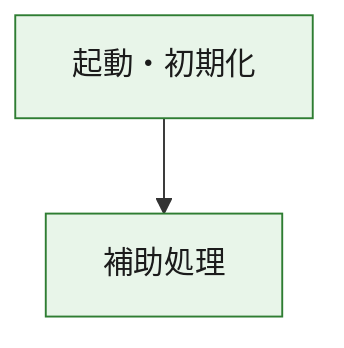
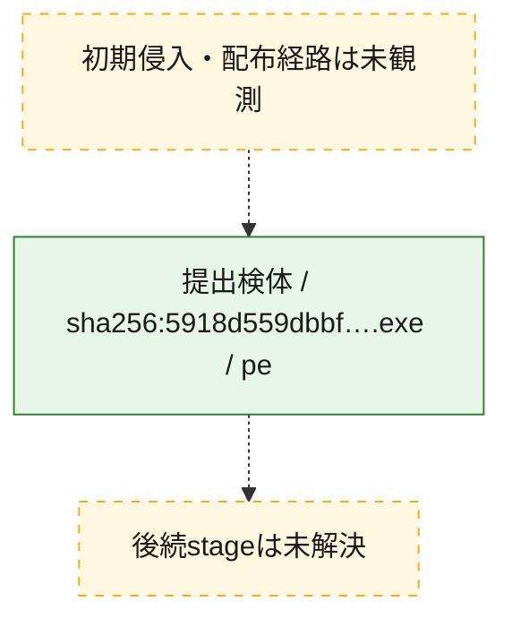
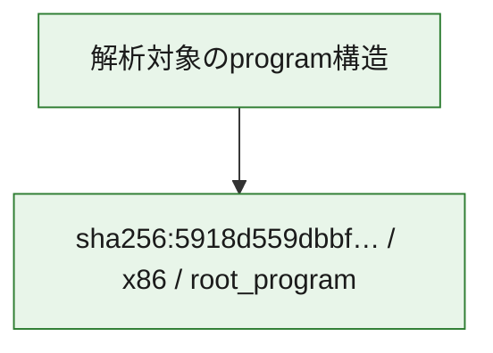

# 全体ロジック：5918d559dbbf92fc8dec7a794397df144c07b458b608234a7205947b5d2b4489

代表関数の静的証跡から、起動・初期化の処理群を確認しました。

## 読み方

- phaseの掲載順は解析上の整理順です。observed_call_edgesがない段階間の実行順を断定しません。
- 図の実線は静的に観測した関係、点線と黄色のノードは未観測・未解決の関係を示します。
- 図は静的な要約であり、動的実行を再現するものではありません。
- 詳細な関数解説とfingerprintは[STATIC-LOGIC.md](STATIC-LOGIC.md)を参照してください。

## 静的可視化

### 実行フロー

### 感染チェーン

### モジュール関係

## 処理段階

### 1. 起動・初期化

entry pointから初期化と後続処理への移行を確認します。
確度: `confirmed_static_function_evidence`

- `5918d559dbbf92fc8dec7a794397df144c07b458b608234a7205947b5d2b4489:ghidra:180001010` — 初期化と主要処理への分岐を行う入口関数です。 状態: `succeeded`、選定理由: `entry_point`, `meaningful_symbol_name`, `reviewed_call_centrality:22`, `role:entrypoint`, `small_program_complete_context`

### 2. 補助処理

主要処理を支える一般内部関数またはlibrary処理を確認します。
確度: `confirmed_static_function_evidence`

- `5918d559dbbf92fc8dec7a794397df144c07b458b608234a7205947b5d2b4489:ghidra:180001240` — 検体内部の一般処理を実装する関数です。 状態: `succeeded`、選定理由: `context_representative`, `reviewed_call_centrality:2`, `small_program_complete_context`
- `5918d559dbbf92fc8dec7a794397df144c07b458b608234a7205947b5d2b4489:ghidra:180001350` — 検体内部の一般処理を実装する関数です。 状態: `succeeded`、選定理由: `context_representative`, `reviewed_call_centrality:25`, `small_program_complete_context`
- `5918d559dbbf92fc8dec7a794397df144c07b458b608234a7205947b5d2b4489:ghidra:180003780` — 検体内部の一般処理を実装する関数です。 状態: `succeeded`、選定理由: `context_representative`, `reviewed_call_centrality:2`, `small_program_complete_context`
- `5918d559dbbf92fc8dec7a794397df144c07b458b608234a7205947b5d2b4489:ghidra:1800038e0` — 検体内部の一般処理を実装する関数です。 状態: `succeeded`、選定理由: `context_representative`, `reviewed_call_centrality:2`, `small_program_complete_context`

## 観測したcall関係

- `5918d559dbbf92fc8dec7a794397df144c07b458b608234a7205947b5d2b4489:ghidra:180001010` → `5918d559dbbf92fc8dec7a794397df144c07b458b608234a7205947b5d2b4489:ghidra:180001240` （`startup` → `support`）
- `5918d559dbbf92fc8dec7a794397df144c07b458b608234a7205947b5d2b4489:ghidra:180001010` → `5918d559dbbf92fc8dec7a794397df144c07b458b608234a7205947b5d2b4489:ghidra:180001350` （`startup` → `support`）
- `5918d559dbbf92fc8dec7a794397df144c07b458b608234a7205947b5d2b4489:ghidra:180001350` → `5918d559dbbf92fc8dec7a794397df144c07b458b608234a7205947b5d2b4489:ghidra:180001240` （`support` → `support`）
- `5918d559dbbf92fc8dec7a794397df144c07b458b608234a7205947b5d2b4489:ghidra:180001350` → `5918d559dbbf92fc8dec7a794397df144c07b458b608234a7205947b5d2b4489:ghidra:180003780` （`support` → `support`）
- `5918d559dbbf92fc8dec7a794397df144c07b458b608234a7205947b5d2b4489:ghidra:180001350` → `5918d559dbbf92fc8dec7a794397df144c07b458b608234a7205947b5d2b4489:ghidra:1800038e0` （`support` → `support`）
- `5918d559dbbf92fc8dec7a794397df144c07b458b608234a7205947b5d2b4489:ghidra:180003780` → `5918d559dbbf92fc8dec7a794397df144c07b458b608234a7205947b5d2b4489:ghidra:1800038e0` （`support` → `support`）
- `ghidra-function:00f5c579d4b55ea65366def4` → `ghidra-function:5606bec728aa343129842c2e` （`unclassified` → `unclassified`）
- `ghidra-function:287038c69cca824c50a1820c` → `ghidra-external:0a265780ee0fe46cf06e10ea` （`unclassified` → `unclassified`）
- `ghidra-function:287038c69cca824c50a1820c` → `ghidra-external:1e7a4481e6ff2c75fffb198c` （`unclassified` → `unclassified`）
- `ghidra-function:287038c69cca824c50a1820c` → `ghidra-external:316bac32320f56ddb9f1765e` （`unclassified` → `unclassified`）
- `ghidra-function:287038c69cca824c50a1820c` → `ghidra-external:60c46735a534b64d7884a5c4` （`unclassified` → `unclassified`）
- `ghidra-function:287038c69cca824c50a1820c` → `ghidra-external:662b25165ed8197ff52e07dc` （`unclassified` → `unclassified`）
- `ghidra-function:287038c69cca824c50a1820c` → `ghidra-external:669697f2518f6d9b41265887` （`unclassified` → `unclassified`）
- `ghidra-function:287038c69cca824c50a1820c` → `ghidra-external:7f0182c3f6bb1cb069cbcce8` （`unclassified` → `unclassified`）
- `ghidra-function:287038c69cca824c50a1820c` → `ghidra-external:85af5190cb07de843ce0f3a1` （`unclassified` → `unclassified`）
- `ghidra-function:287038c69cca824c50a1820c` → `ghidra-external:8dc2675f2565efc1bcbef697` （`unclassified` → `unclassified`）
- `ghidra-function:287038c69cca824c50a1820c` → `ghidra-external:9224c189f8b2b8192f433e1f` （`unclassified` → `unclassified`）
- `ghidra-function:287038c69cca824c50a1820c` → `ghidra-external:99ac71061489e34f73c4a9d5` （`unclassified` → `unclassified`）
- `ghidra-function:287038c69cca824c50a1820c` → `ghidra-external:a5de4d05288bcba7c9b32366` （`unclassified` → `unclassified`）
- `ghidra-function:287038c69cca824c50a1820c` → `ghidra-external:aea74d6954b7b13612900366` （`unclassified` → `unclassified`）
- `ghidra-function:287038c69cca824c50a1820c` → `ghidra-external:b62ff5e20cc77bc9bbaa7592` （`unclassified` → `unclassified`）
- `ghidra-function:287038c69cca824c50a1820c` → `ghidra-external:c0603806b0a0ab78dfc29569` （`unclassified` → `unclassified`）
- `ghidra-function:287038c69cca824c50a1820c` → `ghidra-external:c970d81912fd794e63c700f9` （`unclassified` → `unclassified`）
- `ghidra-function:287038c69cca824c50a1820c` → `ghidra-external:d2a4e42c7fb915dfa9444f6f` （`unclassified` → `unclassified`）
- `ghidra-function:287038c69cca824c50a1820c` → `ghidra-external:e413d8ffadce8b3523e489e0` （`unclassified` → `unclassified`）
- `ghidra-function:287038c69cca824c50a1820c` → `ghidra-external:ec959467a6751e3ea5068a2e` （`unclassified` → `unclassified`）
- `ghidra-function:287038c69cca824c50a1820c` → `ghidra-external:f6914a799941aef8ee853134` （`unclassified` → `unclassified`）
- `ghidra-function:287038c69cca824c50a1820c` → `ghidra-external:f9e56e2a98b639853a20f8f3` （`unclassified` → `unclassified`）
- `ghidra-function:287038c69cca824c50a1820c` → `ghidra-function:00f5c579d4b55ea65366def4` （`unclassified` → `unclassified`）
- `ghidra-function:287038c69cca824c50a1820c` → `ghidra-function:191a1abd9fc3b490c824cb18` （`unclassified` → `unclassified`）
- `ghidra-function:287038c69cca824c50a1820c` → `ghidra-function:5606bec728aa343129842c2e` （`unclassified` → `unclassified`）
- `ghidra-function:b0811a574ee68ef794b638e0` → `ghidra-function:0eb460219d94b2500570b970` （`unclassified` → `unclassified`）
- `ghidra-function:b0811a574ee68ef794b638e0` → `ghidra-function:17114bd1a90119011c13ca90` （`unclassified` → `unclassified`）
- `ghidra-function:b0811a574ee68ef794b638e0` → `ghidra-function:191a1abd9fc3b490c824cb18` （`unclassified` → `unclassified`）
- `ghidra-function:b0811a574ee68ef794b638e0` → `ghidra-function:287038c69cca824c50a1820c` （`unclassified` → `unclassified`）
- `ghidra-function:b0811a574ee68ef794b638e0` → `ghidra-function:3789aaa16d3bf09e2fb9e672` （`unclassified` → `unclassified`）
- `ghidra-function:b0811a574ee68ef794b638e0` → `ghidra-function:43315b271138f6fe0026bef3` （`unclassified` → `unclassified`）
- `ghidra-function:b0811a574ee68ef794b638e0` → `ghidra-function:4b8145de9036f3b02065ba56` （`unclassified` → `unclassified`）
- `ghidra-function:b0811a574ee68ef794b638e0` → `ghidra-function:505baa3e273396f27722fdb5` （`unclassified` → `unclassified`）
- `ghidra-function:b0811a574ee68ef794b638e0` → `ghidra-function:9da68b7a530f37c5b2223881` （`unclassified` → `unclassified`）
- `ghidra-function:b0811a574ee68ef794b638e0` → `ghidra-function:bc7d9175813ea9cb5154766c` （`unclassified` → `unclassified`）
- `ghidra-function:b0811a574ee68ef794b638e0` → `ghidra-function:e8f42f6695a4fce2859e2eb0` （`unclassified` → `unclassified`）
- `ghidra-function:b0811a574ee68ef794b638e0` → `ghidra-function:f24b3d2b70cc6f5b78d78d0b` （`unclassified` → `unclassified`）

## 解析範囲と制約

- 選定外関数は全体inventoryへ残しますが、関数本体の個別解説対象にはしていません。
- indirect call、難読化、packer、VM、壊れたcontrol flowによりcall関係が欠落する場合があります。
- 文書は静的解析に基づき、検体実行や外部通信による動的確認は行っていません。
