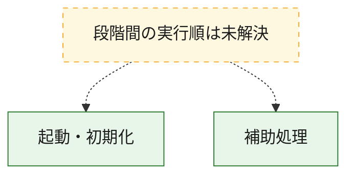
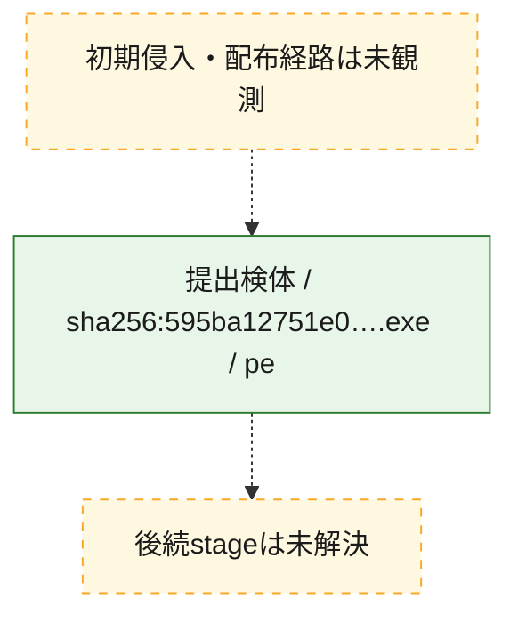
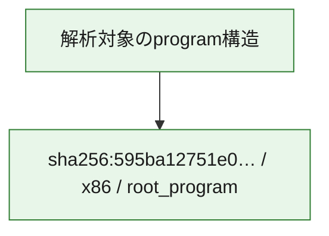

# 全体ロジック：595ba12751e0e9bf048e2a1df0450d744426d8a21afe3ed14eb273e010c351ca

代表関数の静的証跡から、起動・初期化の処理群を確認しました。

## 読み方

- phaseの掲載順は解析上の整理順です。observed_call_edgesがない段階間の実行順を断定しません。
- 図の実線は静的に観測した関係、点線と黄色のノードは未観測・未解決の関係を示します。
- 図は静的な要約であり、動的実行を再現するものではありません。
- 詳細な関数解説とfingerprintは[STATIC-LOGIC.md](STATIC-LOGIC.md)を参照してください。

## 静的可視化

### 実行フロー

### 感染チェーン

### モジュール関係

## 処理段階

### 1. 起動・初期化

entry pointから初期化と後続処理への移行を確認します。
確度: `confirmed_static_function_evidence`

- `595ba12751e0e9bf048e2a1df0450d744426d8a21afe3ed14eb273e010c351ca:ghidra:140006194` — 初期化と主要処理への分岐を行う入口関数です。 状態: `succeeded`、選定理由: `entry_point`, `meaningful_symbol_name`, `reviewed_call_centrality:22`, `role:entrypoint`

### 2. 補助処理

主要処理を支える一般内部関数またはlibrary処理を確認します。
確度: `confirmed_static_function_evidence`

- `595ba12751e0e9bf048e2a1df0450d744426d8a21afe3ed14eb273e010c351ca:ghidra:140001000` — 検体内部の一般処理を実装する関数です。 状態: `succeeded`、選定理由: `context_representative`, `reviewed_call_centrality:2`
- `595ba12751e0e9bf048e2a1df0450d744426d8a21afe3ed14eb273e010c351ca:ghidra:140001040` — 検体内部の一般処理を実装する関数です。 状態: `succeeded`、選定理由: `context_representative`, `reviewed_call_centrality:2`
- `595ba12751e0e9bf048e2a1df0450d744426d8a21afe3ed14eb273e010c351ca:ghidra:140001080` — 検体内部の一般処理を実装する関数です。 状態: `succeeded`、選定理由: `context_representative`, `reviewed_call_centrality:1`
- `595ba12751e0e9bf048e2a1df0450d744426d8a21afe3ed14eb273e010c351ca:ghidra:1400010f0` — 検体内部の一般処理を実装する関数です。 状態: `succeeded`、選定理由: `context_representative`, `reviewed_call_centrality:6`
- `595ba12751e0e9bf048e2a1df0450d744426d8a21afe3ed14eb273e010c351ca:ghidra:140001180` — 検体内部の一般処理を実装する関数です。 状態: `succeeded`、選定理由: `context_representative`, `reviewed_call_centrality:9`
- `595ba12751e0e9bf048e2a1df0450d744426d8a21afe3ed14eb273e010c351ca:ghidra:140001360` — 検体内部の一般処理を実装する関数です。 状態: `succeeded`、選定理由: `context_representative`, `reviewed_call_centrality:3`
- `595ba12751e0e9bf048e2a1df0450d744426d8a21afe3ed14eb273e010c351ca:ghidra:140001420` — 検体内部の一般処理を実装する関数です。 状態: `succeeded`、選定理由: `context_representative`, `reviewed_call_centrality:8`
- `595ba12751e0e9bf048e2a1df0450d744426d8a21afe3ed14eb273e010c351ca:ghidra:140001590` — 検体内部の一般処理を実装する関数です。 状態: `succeeded`、選定理由: `context_representative`, `reviewed_call_centrality:8`
- `595ba12751e0e9bf048e2a1df0450d744426d8a21afe3ed14eb273e010c351ca:ghidra:140001720` — 検体内部の一般処理を実装する関数です。 状態: `succeeded`、選定理由: `context_representative`, `reviewed_call_centrality:7`
- `595ba12751e0e9bf048e2a1df0450d744426d8a21afe3ed14eb273e010c351ca:ghidra:140001870` — 検体内部の一般処理を実装する関数です。 状態: `succeeded`、選定理由: `context_representative`, `reviewed_call_centrality:9`
- `595ba12751e0e9bf048e2a1df0450d744426d8a21afe3ed14eb273e010c351ca:ghidra:140001a00` — 検体内部の一般処理を実装する関数です。 状態: `succeeded`、選定理由: `context_representative`, `reviewed_call_centrality:2`
- `595ba12751e0e9bf048e2a1df0450d744426d8a21afe3ed14eb273e010c351ca:ghidra:140001a80` — 検体内部の一般処理を実装する関数です。 状態: `succeeded`、選定理由: `context_representative`, `reviewed_call_centrality:2`
- `595ba12751e0e9bf048e2a1df0450d744426d8a21afe3ed14eb273e010c351ca:ghidra:140001ae0` — 検体内部の一般処理を実装する関数です。 状態: `succeeded`、選定理由: `context_representative`, `reviewed_call_centrality:6`
- `595ba12751e0e9bf048e2a1df0450d744426d8a21afe3ed14eb273e010c351ca:ghidra:140001be0` — 検体内部の一般処理を実装する関数です。 状態: `succeeded`、選定理由: `context_representative`, `reviewed_call_centrality:1`
- `595ba12751e0e9bf048e2a1df0450d744426d8a21afe3ed14eb273e010c351ca:ghidra:140001c20` — 検体内部の一般処理を実装する関数です。 状態: `succeeded`、選定理由: `context_representative`, `reviewed_call_centrality:1`
- `595ba12751e0e9bf048e2a1df0450d744426d8a21afe3ed14eb273e010c351ca:ghidra:140001c90` — 検体内部の一般処理を実装する関数です。 状態: `succeeded`、選定理由: `context_representative`, `reviewed_call_centrality:1`
- `595ba12751e0e9bf048e2a1df0450d744426d8a21afe3ed14eb273e010c351ca:ghidra:140001cf0` — 検体内部の一般処理を実装する関数です。 状態: `succeeded`、選定理由: `context_representative`, `reviewed_call_centrality:3`
- `595ba12751e0e9bf048e2a1df0450d744426d8a21afe3ed14eb273e010c351ca:ghidra:140001d50` — 検体内部の一般処理を実装する関数です。 状態: `succeeded`、選定理由: `context_representative`, `reviewed_call_centrality:4`
- `595ba12751e0e9bf048e2a1df0450d744426d8a21afe3ed14eb273e010c351ca:ghidra:1400020c0` — 検体内部の一般処理を実装する関数です。 状態: `succeeded`、選定理由: `context_representative`, `reviewed_call_centrality:2`
- `595ba12751e0e9bf048e2a1df0450d744426d8a21afe3ed14eb273e010c351ca:ghidra:140002130` — 検体内部の一般処理を実装する関数です。 状態: `succeeded`、選定理由: `context_representative`
- `595ba12751e0e9bf048e2a1df0450d744426d8a21afe3ed14eb273e010c351ca:ghidra:1400023b0` — 検体内部の一般処理を実装する関数です。 状態: `succeeded`、選定理由: `context_representative`, `reviewed_call_centrality:10`
- `595ba12751e0e9bf048e2a1df0450d744426d8a21afe3ed14eb273e010c351ca:ghidra:1400023d0` — 検体内部の一般処理を実装する関数です。 状態: `succeeded`、選定理由: `context_representative`, `reviewed_call_centrality:2`
- `595ba12751e0e9bf048e2a1df0450d744426d8a21afe3ed14eb273e010c351ca:ghidra:1400023f0` — 検体内部の一般処理を実装する関数です。 状態: `succeeded`、選定理由: `context_representative`, `reviewed_call_centrality:7`
- `595ba12751e0e9bf048e2a1df0450d744426d8a21afe3ed14eb273e010c351ca:ghidra:140002410` — 検体内部の一般処理を実装する関数です。 状態: `succeeded`、選定理由: `context_representative`, `reviewed_call_centrality:3`
- `595ba12751e0e9bf048e2a1df0450d744426d8a21afe3ed14eb273e010c351ca:ghidra:140002430` — 検体内部の一般処理を実装する関数です。 状態: `succeeded`、選定理由: `context_representative`, `reviewed_call_centrality:2`
- `595ba12751e0e9bf048e2a1df0450d744426d8a21afe3ed14eb273e010c351ca:ghidra:140002450` — 検体内部の一般処理を実装する関数です。 状態: `succeeded`、選定理由: `context_representative`, `reviewed_call_centrality:2`
- `595ba12751e0e9bf048e2a1df0450d744426d8a21afe3ed14eb273e010c351ca:ghidra:1400024e0` — 検体内部の一般処理を実装する関数です。 状態: `succeeded`、選定理由: `context_representative`, `reviewed_call_centrality:8`
- `595ba12751e0e9bf048e2a1df0450d744426d8a21afe3ed14eb273e010c351ca:ghidra:140002640` — 検体内部の一般処理を実装する関数です。 状態: `succeeded`、選定理由: `context_representative`, `reviewed_call_centrality:35`
- `595ba12751e0e9bf048e2a1df0450d744426d8a21afe3ed14eb273e010c351ca:ghidra:140002ce0` — 検体内部の一般処理を実装する関数です。 状態: `succeeded`、選定理由: `context_representative`
- `595ba12751e0e9bf048e2a1df0450d744426d8a21afe3ed14eb273e010c351ca:ghidra:140002d50` — 検体内部の一般処理を実装する関数です。 状態: `succeeded`、選定理由: `context_representative`, `reviewed_call_centrality:8`
- `595ba12751e0e9bf048e2a1df0450d744426d8a21afe3ed14eb273e010c351ca:ghidra:140002da0` — 検体内部の一般処理を実装する関数です。 状態: `succeeded`、選定理由: `context_representative`, `reviewed_call_centrality:2`

## 観測したcall関係

- `595ba12751e0e9bf048e2a1df0450d744426d8a21afe3ed14eb273e010c351ca:ghidra:140001180` → `595ba12751e0e9bf048e2a1df0450d744426d8a21afe3ed14eb273e010c351ca:ghidra:1400010f0` （`support` → `support`）
- `595ba12751e0e9bf048e2a1df0450d744426d8a21afe3ed14eb273e010c351ca:ghidra:140001180` → `595ba12751e0e9bf048e2a1df0450d744426d8a21afe3ed14eb273e010c351ca:ghidra:140001a00` （`support` → `support`）
- `595ba12751e0e9bf048e2a1df0450d744426d8a21afe3ed14eb273e010c351ca:ghidra:140001180` → `595ba12751e0e9bf048e2a1df0450d744426d8a21afe3ed14eb273e010c351ca:ghidra:140001ae0` （`support` → `support`）
- `595ba12751e0e9bf048e2a1df0450d744426d8a21afe3ed14eb273e010c351ca:ghidra:140001180` → `595ba12751e0e9bf048e2a1df0450d744426d8a21afe3ed14eb273e010c351ca:ghidra:1400023b0` （`support` → `support`）
- `595ba12751e0e9bf048e2a1df0450d744426d8a21afe3ed14eb273e010c351ca:ghidra:140001180` → `595ba12751e0e9bf048e2a1df0450d744426d8a21afe3ed14eb273e010c351ca:ghidra:140002410` （`support` → `support`）
- `595ba12751e0e9bf048e2a1df0450d744426d8a21afe3ed14eb273e010c351ca:ghidra:140001420` → `595ba12751e0e9bf048e2a1df0450d744426d8a21afe3ed14eb273e010c351ca:ghidra:1400023b0` （`support` → `support`）
- `595ba12751e0e9bf048e2a1df0450d744426d8a21afe3ed14eb273e010c351ca:ghidra:140001420` → `595ba12751e0e9bf048e2a1df0450d744426d8a21afe3ed14eb273e010c351ca:ghidra:1400023f0` （`support` → `support`）
- `595ba12751e0e9bf048e2a1df0450d744426d8a21afe3ed14eb273e010c351ca:ghidra:140001590` → `595ba12751e0e9bf048e2a1df0450d744426d8a21afe3ed14eb273e010c351ca:ghidra:1400023b0` （`support` → `support`）
- `595ba12751e0e9bf048e2a1df0450d744426d8a21afe3ed14eb273e010c351ca:ghidra:140001590` → `595ba12751e0e9bf048e2a1df0450d744426d8a21afe3ed14eb273e010c351ca:ghidra:1400023f0` （`support` → `support`）
- `595ba12751e0e9bf048e2a1df0450d744426d8a21afe3ed14eb273e010c351ca:ghidra:140001720` → `595ba12751e0e9bf048e2a1df0450d744426d8a21afe3ed14eb273e010c351ca:ghidra:1400023b0` （`support` → `support`）
- `595ba12751e0e9bf048e2a1df0450d744426d8a21afe3ed14eb273e010c351ca:ghidra:140001720` → `595ba12751e0e9bf048e2a1df0450d744426d8a21afe3ed14eb273e010c351ca:ghidra:1400023f0` （`support` → `support`）
- `595ba12751e0e9bf048e2a1df0450d744426d8a21afe3ed14eb273e010c351ca:ghidra:140001870` → `595ba12751e0e9bf048e2a1df0450d744426d8a21afe3ed14eb273e010c351ca:ghidra:1400023b0` （`support` → `support`）
- `595ba12751e0e9bf048e2a1df0450d744426d8a21afe3ed14eb273e010c351ca:ghidra:140001870` → `595ba12751e0e9bf048e2a1df0450d744426d8a21afe3ed14eb273e010c351ca:ghidra:1400023f0` （`support` → `support`）
- `595ba12751e0e9bf048e2a1df0450d744426d8a21afe3ed14eb273e010c351ca:ghidra:140001a00` → `595ba12751e0e9bf048e2a1df0450d744426d8a21afe3ed14eb273e010c351ca:ghidra:1400010f0` （`support` → `support`）
- `595ba12751e0e9bf048e2a1df0450d744426d8a21afe3ed14eb273e010c351ca:ghidra:140001ae0` → `595ba12751e0e9bf048e2a1df0450d744426d8a21afe3ed14eb273e010c351ca:ghidra:1400023b0` （`support` → `support`）
- `595ba12751e0e9bf048e2a1df0450d744426d8a21afe3ed14eb273e010c351ca:ghidra:140001d50` → `595ba12751e0e9bf048e2a1df0450d744426d8a21afe3ed14eb273e010c351ca:ghidra:1400010f0` （`support` → `support`）
- `595ba12751e0e9bf048e2a1df0450d744426d8a21afe3ed14eb273e010c351ca:ghidra:140002450` → `595ba12751e0e9bf048e2a1df0450d744426d8a21afe3ed14eb273e010c351ca:ghidra:140001590` （`support` → `support`）
- `595ba12751e0e9bf048e2a1df0450d744426d8a21afe3ed14eb273e010c351ca:ghidra:1400024e0` → `595ba12751e0e9bf048e2a1df0450d744426d8a21afe3ed14eb273e010c351ca:ghidra:1400023b0` （`support` → `support`）
- `595ba12751e0e9bf048e2a1df0450d744426d8a21afe3ed14eb273e010c351ca:ghidra:1400024e0` → `595ba12751e0e9bf048e2a1df0450d744426d8a21afe3ed14eb273e010c351ca:ghidra:1400023f0` （`support` → `support`）
- `595ba12751e0e9bf048e2a1df0450d744426d8a21afe3ed14eb273e010c351ca:ghidra:140002640` → `595ba12751e0e9bf048e2a1df0450d744426d8a21afe3ed14eb273e010c351ca:ghidra:140001870` （`support` → `support`）
- `595ba12751e0e9bf048e2a1df0450d744426d8a21afe3ed14eb273e010c351ca:ghidra:140002640` → `595ba12751e0e9bf048e2a1df0450d744426d8a21afe3ed14eb273e010c351ca:ghidra:1400024e0` （`support` → `support`）
- `595ba12751e0e9bf048e2a1df0450d744426d8a21afe3ed14eb273e010c351ca:ghidra:140002da0` → `595ba12751e0e9bf048e2a1df0450d744426d8a21afe3ed14eb273e010c351ca:ghidra:140001420` （`support` → `support`）
- `ghidra-function:10055864c06cdb480fb1099f` → `ghidra-external:f308d909958f99c5b8eacdbd` （`unclassified` → `unclassified`）
- `ghidra-function:10055864c06cdb480fb1099f` → `ghidra-function:171a00f9323260dc06b95620` （`unclassified` → `unclassified`）
- `ghidra-function:142045510c1a5df4712ba493` → `ghidra-external:1ef3e1931cd1bef5fea958c4` （`unclassified` → `unclassified`）
- `ghidra-function:142045510c1a5df4712ba493` → `ghidra-external:f308d909958f99c5b8eacdbd` （`unclassified` → `unclassified`）
- `ghidra-function:142045510c1a5df4712ba493` → `ghidra-function:7bb1eb857ef9c5bb2098fc33` （`unclassified` → `unclassified`）
- `ghidra-function:19b2b877e15fdb8858bdb898` → `ghidra-external:4665fd62bf7ded7cbd0a0041` （`unclassified` → `unclassified`）
- `ghidra-function:19b2b877e15fdb8858bdb898` → `ghidra-external:f308d909958f99c5b8eacdbd` （`unclassified` → `unclassified`）
- `ghidra-function:19b2b877e15fdb8858bdb898` → `ghidra-function:79194f2965a54775bf5041c8` （`unclassified` → `unclassified`）
- `ghidra-function:1ab00b647c3672640d2d59a4` → `ghidra-external:f308d909958f99c5b8eacdbd` （`unclassified` → `unclassified`）
- `ghidra-function:1ab00b647c3672640d2d59a4` → `ghidra-function:fe1761f393a07d4fd2b4da11` （`unclassified` → `unclassified`）
- `ghidra-function:1b93506a84ec6f9cbc5d0d41` → `ghidra-function:06351b007993572c5c7353d4` （`unclassified` → `unclassified`）
- `ghidra-function:1b93506a84ec6f9cbc5d0d41` → `ghidra-function:8162f9e779d23b20225fbc5b` （`unclassified` → `unclassified`）
- `ghidra-function:1e488da4335d6c8bc7fe6c9d` → `ghidra-external:1ef3e1931cd1bef5fea958c4` （`unclassified` → `unclassified`）
- `ghidra-function:1e488da4335d6c8bc7fe6c9d` → `ghidra-external:f308d909958f99c5b8eacdbd` （`unclassified` → `unclassified`）
- `ghidra-function:1e488da4335d6c8bc7fe6c9d` → `ghidra-function:06351b007993572c5c7353d4` （`unclassified` → `unclassified`）
- `ghidra-function:1e488da4335d6c8bc7fe6c9d` → `ghidra-function:19b2b877e15fdb8858bdb898` （`unclassified` → `unclassified`）
- `ghidra-function:1e488da4335d6c8bc7fe6c9d` → `ghidra-function:7bb1eb857ef9c5bb2098fc33` （`unclassified` → `unclassified`）
- `ghidra-function:1e488da4335d6c8bc7fe6c9d` → `ghidra-function:a5ade790121cff017f4e0fed` （`unclassified` → `unclassified`）
- `ghidra-function:1e488da4335d6c8bc7fe6c9d` → `ghidra-function:b958f0f526a25f98cb87cf2c` （`unclassified` → `unclassified`）
- `ghidra-function:229784818ab99ec0cb36095f` → `ghidra-external:1ef3e1931cd1bef5fea958c4` （`unclassified` → `unclassified`）
- `ghidra-function:229784818ab99ec0cb36095f` → `ghidra-external:f308d909958f99c5b8eacdbd` （`unclassified` → `unclassified`）
- `ghidra-function:229784818ab99ec0cb36095f` → `ghidra-function:06351b007993572c5c7353d4` （`unclassified` → `unclassified`）
- `ghidra-function:229784818ab99ec0cb36095f` → `ghidra-function:19b2b877e15fdb8858bdb898` （`unclassified` → `unclassified`）
- `ghidra-function:229784818ab99ec0cb36095f` → `ghidra-function:7bb1eb857ef9c5bb2098fc33` （`unclassified` → `unclassified`）
- `ghidra-function:229784818ab99ec0cb36095f` → `ghidra-function:a5ade790121cff017f4e0fed` （`unclassified` → `unclassified`）
- `ghidra-function:229784818ab99ec0cb36095f` → `ghidra-function:b958f0f526a25f98cb87cf2c` （`unclassified` → `unclassified`）
- `ghidra-function:28273d07c9e87b1b268e62fa` → `ghidra-function:77dd42087c3f542564f5c1c5` （`unclassified` → `unclassified`）
- `ghidra-function:28273d07c9e87b1b268e62fa` → `ghidra-function:b958f0f526a25f98cb87cf2c` （`unclassified` → `unclassified`）
- `ghidra-function:283b4caf5e4886d345973058` → `ghidra-external:1ef3e1931cd1bef5fea958c4` （`unclassified` → `unclassified`）
- `ghidra-function:283b4caf5e4886d345973058` → `ghidra-external:f308d909958f99c5b8eacdbd` （`unclassified` → `unclassified`）
- `ghidra-function:283b4caf5e4886d345973058` → `ghidra-function:7bb1eb857ef9c5bb2098fc33` （`unclassified` → `unclassified`）
- `ghidra-function:283b4caf5e4886d345973058` → `ghidra-function:7f2be6347bd7c716c94260fa` （`unclassified` → `unclassified`）
- `ghidra-function:34b9147afbbdef6bd3e5a598` → `ghidra-external:800fe50db50cbe90c8df9859` （`unclassified` → `unclassified`）
- `ghidra-function:34b9147afbbdef6bd3e5a598` → `ghidra-function:523b6a946be487cb3e1ef400` （`unclassified` → `unclassified`）
- `ghidra-function:35ee8b9b54ead337b9611fbe` → `ghidra-external:e37174d7404442d737638745` （`unclassified` → `unclassified`）
- `ghidra-function:35ee8b9b54ead337b9611fbe` → `ghidra-external:f308d909958f99c5b8eacdbd` （`unclassified` → `unclassified`）
- `ghidra-function:35ee8b9b54ead337b9611fbe` → `ghidra-function:05aa42e7706c14d7cfa26840` （`unclassified` → `unclassified`）
- `ghidra-function:35ee8b9b54ead337b9611fbe` → `ghidra-function:254ec2c427871fad28f4ab3d` （`unclassified` → `unclassified`）
- `ghidra-function:35ee8b9b54ead337b9611fbe` → `ghidra-function:79f6786b5c9411caec24735e` （`unclassified` → `unclassified`）
- `ghidra-function:35ee8b9b54ead337b9611fbe` → `ghidra-function:7bb1eb857ef9c5bb2098fc33` （`unclassified` → `unclassified`）
- `ghidra-function:37a9d78699bffc7aadb2393c` → `ghidra-external:39bd6c302ff08d54430c649c` （`unclassified` → `unclassified`）
- `ghidra-function:37a9d78699bffc7aadb2393c` → `ghidra-external:3e7cb4981008fa80f2cf2c68` （`unclassified` → `unclassified`）
- `ghidra-function:37a9d78699bffc7aadb2393c` → `ghidra-external:50a6ad47abbbf2494b7b8416` （`unclassified` → `unclassified`）
- `ghidra-function:37a9d78699bffc7aadb2393c` → `ghidra-external:6de6b4264db2cd02b1ebeaca` （`unclassified` → `unclassified`）
- `ghidra-function:37a9d78699bffc7aadb2393c` → `ghidra-external:b19c9a4d18655afab5a91520` （`unclassified` → `unclassified`）
- `ghidra-function:37a9d78699bffc7aadb2393c` → `ghidra-external:cfc012d6a24899aa6278cdb7` （`unclassified` → `unclassified`）
- `ghidra-function:37a9d78699bffc7aadb2393c` → `ghidra-external:f308d909958f99c5b8eacdbd` （`unclassified` → `unclassified`）
- `ghidra-function:37a9d78699bffc7aadb2393c` → `ghidra-function:2d27d71b96ae65a8b424bfbc` （`unclassified` → `unclassified`）
- `ghidra-function:37a9d78699bffc7aadb2393c` → `ghidra-function:2e8b9f9f7c380601ad3a9dee` （`unclassified` → `unclassified`）
- `ghidra-function:37a9d78699bffc7aadb2393c` → `ghidra-function:3733a3a0469cd3b5bb1acacd` （`unclassified` → `unclassified`）
- `ghidra-function:37a9d78699bffc7aadb2393c` → `ghidra-function:411d39d31e6031b6036654ad` （`unclassified` → `unclassified`）
- `ghidra-function:37a9d78699bffc7aadb2393c` → `ghidra-function:4393eeee64f3a623b005ca5f` （`unclassified` → `unclassified`）
- `ghidra-function:37a9d78699bffc7aadb2393c` → `ghidra-function:65303b71472e083047393192` （`unclassified` → `unclassified`）
- `ghidra-function:37a9d78699bffc7aadb2393c` → `ghidra-function:72afeeee02812fd3fe20d2d9` （`unclassified` → `unclassified`）
- `ghidra-function:37a9d78699bffc7aadb2393c` → `ghidra-function:85282165bfeeac8cd1008964` （`unclassified` → `unclassified`）
- `ghidra-function:37a9d78699bffc7aadb2393c` → `ghidra-function:945b70014edae3ae8833f8b6` （`unclassified` → `unclassified`）
- `ghidra-function:37a9d78699bffc7aadb2393c` → `ghidra-function:a3f25db164fa9a8150eef3d0` （`unclassified` → `unclassified`）
- `ghidra-function:37a9d78699bffc7aadb2393c` → `ghidra-function:baf56c00247e9b2174188432` （`unclassified` → `unclassified`）
- `ghidra-function:37a9d78699bffc7aadb2393c` → `ghidra-function:bb5a52b8efacd2a18a03b613` （`unclassified` → `unclassified`）
- `ghidra-function:37a9d78699bffc7aadb2393c` → `ghidra-function:e013be47ad50e7e6b4761e4e` （`unclassified` → `unclassified`）
- `ghidra-function:37a9d78699bffc7aadb2393c` → `ghidra-function:e26db8b5662142036aba11d6` （`unclassified` → `unclassified`）
- `ghidra-function:37a9d78699bffc7aadb2393c` → `ghidra-function:f074c356f32accb1dc492fb2` （`unclassified` → `unclassified`）
- `ghidra-function:3aba43bd4014efd82b036302` → `ghidra-function:40b6292d0a91b62614e75b23` （`unclassified` → `unclassified`）
- `ghidra-function:3aba43bd4014efd82b036302` → `ghidra-function:77dd42087c3f542564f5c1c5` （`unclassified` → `unclassified`）
- `ghidra-function:41322e7157e5aea9c9d4a4d5` → `ghidra-external:f308d909958f99c5b8eacdbd` （`unclassified` → `unclassified`）
- `ghidra-function:41322e7157e5aea9c9d4a4d5` → `ghidra-function:fe1761f393a07d4fd2b4da11` （`unclassified` → `unclassified`）
- `ghidra-function:4cfbeec47446dbd3bfc21e5d` → `ghidra-function:625c6fdd9fb683327f261014` （`unclassified` → `unclassified`）
- `ghidra-function:50cad9f4592c22087c13563e` → `ghidra-external:1ef3e1931cd1bef5fea958c4` （`unclassified` → `unclassified`）
- `ghidra-function:50cad9f4592c22087c13563e` → `ghidra-external:f308d909958f99c5b8eacdbd` （`unclassified` → `unclassified`）
- `ghidra-function:50cad9f4592c22087c13563e` → `ghidra-function:06351b007993572c5c7353d4` （`unclassified` → `unclassified`）
- `ghidra-function:50cad9f4592c22087c13563e` → `ghidra-function:19b2b877e15fdb8858bdb898` （`unclassified` → `unclassified`）
- `ghidra-function:50cad9f4592c22087c13563e` → `ghidra-function:7bb1eb857ef9c5bb2098fc33` （`unclassified` → `unclassified`）
- `ghidra-function:50cad9f4592c22087c13563e` → `ghidra-function:a5ade790121cff017f4e0fed` （`unclassified` → `unclassified`）
- `ghidra-function:50cad9f4592c22087c13563e` → `ghidra-function:b78c3804f8daf6b5629371db` （`unclassified` → `unclassified`）
- `ghidra-function:50cad9f4592c22087c13563e` → `ghidra-function:b958f0f526a25f98cb87cf2c` （`unclassified` → `unclassified`）
- `ghidra-function:51b52debaa2602f3de42a85d` → `ghidra-function:be493b28ac4b4ae249fcffd6` （`unclassified` → `unclassified`）
- `ghidra-function:5e267296ee9fd4e35d5cd400` → `ghidra-function:7f2be6347bd7c716c94260fa` （`unclassified` → `unclassified`）
- `ghidra-function:72d52a670ba86344ad2bc488` → `ghidra-function:be493b28ac4b4ae249fcffd6` （`unclassified` → `unclassified`）
- `ghidra-function:730f640e85b77b808f899597` → `ghidra-function:be493b28ac4b4ae249fcffd6` （`unclassified` → `unclassified`）
- `ghidra-function:7f2be6347bd7c716c94260fa` → `ghidra-external:1ef3e1931cd1bef5fea958c4` （`unclassified` → `unclassified`）
- `ghidra-function:7f2be6347bd7c716c94260fa` → `ghidra-external:f308d909958f99c5b8eacdbd` （`unclassified` → `unclassified`）
- `ghidra-function:7f2be6347bd7c716c94260fa` → `ghidra-function:7bb1eb857ef9c5bb2098fc33` （`unclassified` → `unclassified`）
- `ghidra-function:8162f9e779d23b20225fbc5b` → `ghidra-external:1ef3e1931cd1bef5fea958c4` （`unclassified` → `unclassified`）
- `ghidra-function:8162f9e779d23b20225fbc5b` → `ghidra-external:f308d909958f99c5b8eacdbd` （`unclassified` → `unclassified`）
- `ghidra-function:8162f9e779d23b20225fbc5b` → `ghidra-function:06351b007993572c5c7353d4` （`unclassified` → `unclassified`）
- `ghidra-function:8162f9e779d23b20225fbc5b` → `ghidra-function:19b2b877e15fdb8858bdb898` （`unclassified` → `unclassified`）
- `ghidra-function:8162f9e779d23b20225fbc5b` → `ghidra-function:7bb1eb857ef9c5bb2098fc33` （`unclassified` → `unclassified`）
- `ghidra-function:8162f9e779d23b20225fbc5b` → `ghidra-function:a5ade790121cff017f4e0fed` （`unclassified` → `unclassified`）
- `ghidra-function:8162f9e779d23b20225fbc5b` → `ghidra-function:b958f0f526a25f98cb87cf2c` （`unclassified` → `unclassified`）
- `ghidra-function:9a581b00252aba5ba01b8ccc` → `ghidra-external:1ef3e1931cd1bef5fea958c4` （`unclassified` → `unclassified`）
- `ghidra-function:9a581b00252aba5ba01b8ccc` → `ghidra-function:6367340d44e19cf9214e5e27` （`unclassified` → `unclassified`）
- `ghidra-function:9d4e4917de29c635b68166eb` → `ghidra-external:1ef3e1931cd1bef5fea958c4` （`unclassified` → `unclassified`）
- `ghidra-function:9d4e4917de29c635b68166eb` → `ghidra-external:f308d909958f99c5b8eacdbd` （`unclassified` → `unclassified`）
- `ghidra-function:9d4e4917de29c635b68166eb` → `ghidra-function:06351b007993572c5c7353d4` （`unclassified` → `unclassified`）
- `ghidra-function:9d4e4917de29c635b68166eb` → `ghidra-function:19b2b877e15fdb8858bdb898` （`unclassified` → `unclassified`）
- `ghidra-function:9d4e4917de29c635b68166eb` → `ghidra-function:7bb1eb857ef9c5bb2098fc33` （`unclassified` → `unclassified`）
- `ghidra-function:9d4e4917de29c635b68166eb` → `ghidra-function:a5ade790121cff017f4e0fed` （`unclassified` → `unclassified`）
- `ghidra-function:9d4e4917de29c635b68166eb` → `ghidra-function:b958f0f526a25f98cb87cf2c` （`unclassified` → `unclassified`）
- `ghidra-function:a5ade790121cff017f4e0fed` → `ghidra-external:f308d909958f99c5b8eacdbd` （`unclassified` → `unclassified`）
- `ghidra-function:a5ade790121cff017f4e0fed` → `ghidra-function:fe1761f393a07d4fd2b4da11` （`unclassified` → `unclassified`）
- `ghidra-function:b194a4d13b94358a29706ebb` → `ghidra-external:f308d909958f99c5b8eacdbd` （`unclassified` → `unclassified`）
- `ghidra-function:b194a4d13b94358a29706ebb` → `ghidra-function:06351b007993572c5c7353d4` （`unclassified` → `unclassified`）
- `ghidra-function:b194a4d13b94358a29706ebb` → `ghidra-function:19b2b877e15fdb8858bdb898` （`unclassified` → `unclassified`）
- `ghidra-function:b194a4d13b94358a29706ebb` → `ghidra-function:7bb1eb857ef9c5bb2098fc33` （`unclassified` → `unclassified`）
- `ghidra-function:b194a4d13b94358a29706ebb` → `ghidra-function:b958f0f526a25f98cb87cf2c` （`unclassified` → `unclassified`）
- `ghidra-function:bc4fadaea908bd3e70689b21` → `ghidra-external:1ef3e1931cd1bef5fea958c4` （`unclassified` → `unclassified`）
- `ghidra-function:bc4fadaea908bd3e70689b21` → `ghidra-external:248d593a78f48a5afa11a14d` （`unclassified` → `unclassified`）
- `ghidra-function:bc4fadaea908bd3e70689b21` → `ghidra-external:3e7cb4981008fa80f2cf2c68` （`unclassified` → `unclassified`）
- `ghidra-function:bc4fadaea908bd3e70689b21` → `ghidra-external:4b5328e928373892c8e03542` （`unclassified` → `unclassified`）
- `ghidra-function:bc4fadaea908bd3e70689b21` → `ghidra-external:f308d909958f99c5b8eacdbd` （`unclassified` → `unclassified`）
- `ghidra-function:bc4fadaea908bd3e70689b21` → `ghidra-function:017ee497d7e14542e8ab6011` （`unclassified` → `unclassified`）
- `ghidra-function:bc4fadaea908bd3e70689b21` → `ghidra-function:25a706b07429237d198da14e` （`unclassified` → `unclassified`）
- `ghidra-function:bc4fadaea908bd3e70689b21` → `ghidra-function:50cad9f4592c22087c13563e` （`unclassified` → `unclassified`）
- `ghidra-function:bc4fadaea908bd3e70689b21` → `ghidra-function:5b8bd7c42adbc0594443887a` （`unclassified` → `unclassified`）
- `ghidra-function:bc4fadaea908bd3e70689b21` → `ghidra-function:625c6fdd9fb683327f261014` （`unclassified` → `unclassified`）
- `ghidra-function:bc4fadaea908bd3e70689b21` → `ghidra-function:76cbb80e1cd532effaed4350` （`unclassified` → `unclassified`）
- `ghidra-function:bc4fadaea908bd3e70689b21` → `ghidra-function:78c35957ae4a63adfed13828` （`unclassified` → `unclassified`）
- `ghidra-function:bc4fadaea908bd3e70689b21` → `ghidra-function:7a7a8366f0880167d730492a` （`unclassified` → `unclassified`）
- `ghidra-function:bc4fadaea908bd3e70689b21` → `ghidra-function:7af0a7f1b981fd4e87b59e5c` （`unclassified` → `unclassified`）
- `ghidra-function:bc4fadaea908bd3e70689b21` → `ghidra-function:7bb1eb857ef9c5bb2098fc33` （`unclassified` → `unclassified`）
- `ghidra-function:bc4fadaea908bd3e70689b21` → `ghidra-function:9d4e4917de29c635b68166eb` （`unclassified` → `unclassified`）
- `ghidra-function:bc4fadaea908bd3e70689b21` → `ghidra-function:aa69a48de1fffb105cb85bd6` （`unclassified` → `unclassified`）
- `ghidra-function:bc4fadaea908bd3e70689b21` → `ghidra-function:b78c3804f8daf6b5629371db` （`unclassified` → `unclassified`）
- `ghidra-function:bc4fadaea908bd3e70689b21` → `ghidra-function:be9b7db4532a0c0133ec3194` （`unclassified` → `unclassified`）
- `ghidra-function:bc4fadaea908bd3e70689b21` → `ghidra-function:d0394e4f997fd9d660a64481` （`unclassified` → `unclassified`）
- `ghidra-function:bc4fadaea908bd3e70689b21` → `ghidra-function:d08286f8dcca168d955993d3` （`unclassified` → `unclassified`）
- `ghidra-function:bc4fadaea908bd3e70689b21` → `ghidra-function:d4209e56d772320a6f40a9f0` （`unclassified` → `unclassified`）
- `ghidra-function:bc4fadaea908bd3e70689b21` → `ghidra-function:d43fe9154314245f904f710e` （`unclassified` → `unclassified`）
- `ghidra-function:bc4fadaea908bd3e70689b21` → `ghidra-function:e7a9b95b613c0dc2c79ecbe0` （`unclassified` → `unclassified`）
- `ghidra-function:e13a4ea4041674a7dc86e454` → `ghidra-external:1ef3e1931cd1bef5fea958c4` （`unclassified` → `unclassified`）
- `ghidra-function:e13a4ea4041674a7dc86e454` → `ghidra-external:f308d909958f99c5b8eacdbd` （`unclassified` → `unclassified`）
- `ghidra-function:e13a4ea4041674a7dc86e454` → `ghidra-function:7bb1eb857ef9c5bb2098fc33` （`unclassified` → `unclassified`）
- `ghidra-function:e612a6488e1bf470dd8cfbaf` → `ghidra-function:0fd65ebbd250c8b7d7c18377` （`unclassified` → `unclassified`）
- `ghidra-function:e612a6488e1bf470dd8cfbaf` → `ghidra-function:1e488da4335d6c8bc7fe6c9d` （`unclassified` → `unclassified`）
- `ghidra-function:ea90947618ac69801a62a544` → `ghidra-external:1ef3e1931cd1bef5fea958c4` （`unclassified` → `unclassified`）
- `ghidra-function:ea90947618ac69801a62a544` → `ghidra-external:f308d909958f99c5b8eacdbd` （`unclassified` → `unclassified`）
- `ghidra-function:ea90947618ac69801a62a544` → `ghidra-function:19b2b877e15fdb8858bdb898` （`unclassified` → `unclassified`）
- `ghidra-function:ea90947618ac69801a62a544` → `ghidra-function:41322e7157e5aea9c9d4a4d5` （`unclassified` → `unclassified`）
- `ghidra-function:ea90947618ac69801a62a544` → `ghidra-function:5e267296ee9fd4e35d5cd400` （`unclassified` → `unclassified`）
- `ghidra-function:ea90947618ac69801a62a544` → `ghidra-function:7bb1eb857ef9c5bb2098fc33` （`unclassified` → `unclassified`）
- `ghidra-function:ea90947618ac69801a62a544` → `ghidra-function:7f2be6347bd7c716c94260fa` （`unclassified` → `unclassified`）
- `ghidra-function:ea90947618ac69801a62a544` → `ghidra-function:b194a4d13b94358a29706ebb` （`unclassified` → `unclassified`）
- `ghidra-function:ea90947618ac69801a62a544` → `ghidra-function:b958f0f526a25f98cb87cf2c` （`unclassified` → `unclassified`）

## 解析範囲と制約

- 選定外関数は全体inventoryへ残しますが、関数本体の個別解説対象にはしていません。
- indirect call、難読化、packer、VM、壊れたcontrol flowによりcall関係が欠落する場合があります。
- 文書は静的解析に基づき、検体実行や外部通信による動的確認は行っていません。
