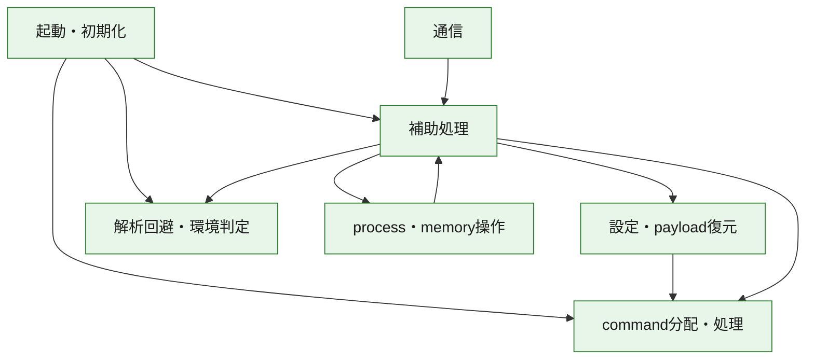

# 全体ロジック：5964742cfe847b31c7eef2b0f2dc9d4397eac9a406380ac1a3c1e74e3a948d4b

代表関数の静的証跡から、起動・初期化、設定・payload復元、解析回避・環境判定、process・memory操作、通信、command分配・処理の処理群を確認しました。

## 読み方

- phaseの掲載順は解析上の整理順です。observed_call_edgesがない段階間の実行順を断定しません。
- 図の実線は静的に観測した関係、点線と黄色のノードは未観測・未解決の関係を示します。
- 図は静的な要約であり、動的実行を再現するものではありません。
- 詳細な関数解説とfingerprintは[STATIC-LOGIC.md](STATIC-LOGIC.md)を参照してください。

## 静的可視化

### 実行フロー

### 感染チェーン

```mermaid
flowchart TD
  chain_initial["初期侵入・配布経路は未観測"]
  chain_01["提出検体 / sha256:5964742cfe84….exe / pe"]
  chain_02["静的復元層 1 / sha256:5964742cfe84….exe::pyinstaller-nested_archive-023-base_li / zip"]
  chain_03["静的復元層 1 / sha256:5964742cfe84….exe::pyinstaller-pe_name_candidate-009-bz2. / pe"]
  chain_04["静的復元層 1 / sha256:5964742cfe84….exe::pyinstaller-pe_name_candidate-010-ctyp / pe"]
  chain_05["静的復元層 1 / sha256:5964742cfe84….exe::pyinstaller-pe_name_candidate-011-deci / pe"]
  chain_06["静的復元層 1 / sha256:5964742cfe84….exe::pyinstaller-pe_name_candidate-012-hash / pe"]
  chain_07["静的復元層 1 / sha256:5964742cfe84….exe::pyinstaller-pe_name_candidate-013-lzma / pe"]
  chain_08["静的復元層 1 / sha256:5964742cfe84….exe::pyinstaller-pe_name_candidate-014-sock / pe"]
  chain_09["静的復元層 1 / sha256:5964742cfe84….exe::pyinstaller-pe_name_candidate-015-ssl. / pe"]
  chain_10["静的復元層 1 / sha256:5964742cfe84….exe::pyinstaller-pe_name_candidate-016-libc / pe"]
  chain_11["静的復元層 1 / sha256:5964742cfe84….exe::pyinstaller-pe_name_candidate-017-libf / pe"]
  chain_12["静的復元層 1 / sha256:5964742cfe84….exe::pyinstaller-pe_name_candidate-018-libs / pe"]
  chain_13["静的復元層 1 / sha256:5964742cfe84….exe::pyinstaller-pe_name_candidate-019-pyth / pe"]
  chain_14["静的復元層 1 / sha256:5964742cfe84….exe::pyinstaller-pe_name_candidate-020-sele / pe"]
  chain_15["静的復元層 1 / sha256:5964742cfe84….exe::pyinstaller-pe_name_candidate-021-unic / pe"]
  chain_16["静的復元層 1 / sha256:5964742cfe84….exe::pyinstaller-pe_name_candidate-022-VCRU / pe"]
  chain_01 -->|pyinstaller-nested_archive-023-b| chain_02
  chain_01 -->|pyinstaller-pe_name_candidate-00| chain_03
  chain_01 -->|pyinstaller-pe_name_candidate-01| chain_04
  chain_01 -->|pyinstaller-pe_name_candidate-01| chain_05
  chain_01 -->|pyinstaller-pe_name_candidate-01| chain_06
  chain_01 -->|pyinstaller-pe_name_candidate-01| chain_07
  chain_01 -->|pyinstaller-pe_name_candidate-01| chain_08
  chain_01 -->|pyinstaller-pe_name_candidate-01| chain_09
  chain_01 -->|pyinstaller-pe_name_candidate-01| chain_10
  chain_01 -->|pyinstaller-pe_name_candidate-01| chain_11
  chain_01 -->|pyinstaller-pe_name_candidate-01| chain_12
  chain_01 -->|pyinstaller-pe_name_candidate-01| chain_13
  chain_01 -->|pyinstaller-pe_name_candidate-02| chain_14
  chain_01 -->|pyinstaller-pe_name_candidate-02| chain_15
  chain_01 -->|pyinstaller-pe_name_candidate-02| chain_16
  chain_initial -.-> chain_01
  chain_more["その他164層はstatic-layers.jsonを参照"]
  chain_02 -.-> chain_more
  chain_03 -.-> chain_more
  chain_04 -.-> chain_more
  chain_05 -.-> chain_more
  chain_06 -.-> chain_more
  chain_07 -.-> chain_more
  chain_08 -.-> chain_more
  chain_09 -.-> chain_more
  chain_10 -.-> chain_more
  chain_11 -.-> chain_more
  chain_12 -.-> chain_more
  chain_13 -.-> chain_more
  chain_14 -.-> chain_more
  chain_15 -.-> chain_more
  chain_16 -.-> chain_more
  class chain_more unresolved
  class chain_01,chain_02,chain_03,chain_04,chain_05,chain_06,chain_07,chain_08,chain_09,chain_10,chain_11,chain_12,chain_13,chain_14,chain_15,chain_16 confirmed
  class chain_initial unresolved
  classDef confirmed fill:#e8f5e9,stroke:#2e7d32,color:#1b1b1b
  classDef unresolved fill:#fff8e1,stroke:#f9a825,color:#1b1b1b,stroke-dasharray:5 5
```

### モジュール関係

```mermaid
flowchart TD
  module_scope["解析対象のprogram構造"]
  module_01["sha256:d4d7181b11db… / x86 / statically_recovered_program"]
  module_02["sha256:eff52743773e… / x86 / statically_recovered_program"]
  module_03["sha256:03d233dbace5… / x86 / statically_recovered_program"]
  module_04["sha256:3efa4636cf9e… / x86 / statically_recovered_program"]
  module_05["sha256:65f610646d10… / x86 / statically_recovered_program"]
  module_06["sha256:052ad6a20d37… / x86 / statically_recovered_program"]
  module_07["sha256:0e56107a8911… / x86 / statically_recovered_program"]
  module_08["sha256:e3deecc1f59a… / x86 / statically_recovered_program"]
  module_09["sha256:0bc527d2dbc5… / x86 / statically_recovered_program"]
  module_10["sha256:aeacfead2bef… / x86 / statically_recovered_program"]
  module_11["sha256:007142039f04… / x86 / statically_recovered_program"]
  module_12["sha256:208ee1cd3cba… / x86 / statically_recovered_program"]
  module_parent_unknown["復元元・親moduleは未特定"]
  module_parent_unknown -.-> module_01
  module_parent_unknown -.-> module_02
  module_parent_unknown -.-> module_03
  module_parent_unknown -.-> module_04
  module_parent_unknown -.-> module_05
  module_parent_unknown -.-> module_06
  module_parent_unknown -.-> module_07
  module_parent_unknown -.-> module_08
  module_parent_unknown -.-> module_09
  module_parent_unknown -.-> module_10
  module_parent_unknown -.-> module_11
  module_parent_unknown -.-> module_12
  class module_parent_unknown unresolved
  module_more["その他3moduleはstatic-logic.jsonを参照"]
  module_scope -.-> module_more
  class module_more unresolved
  class module_scope confirmed
  class module_01,module_02,module_03,module_04,module_05,module_06,module_07,module_08,module_09,module_10,module_11,module_12 confirmed
  classDef confirmed fill:#e8f5e9,stroke:#2e7d32,color:#1b1b1b
  classDef unresolved fill:#fff8e1,stroke:#f9a825,color:#1b1b1b,stroke-dasharray:5 5
```

## 処理段階

### 1. 起動・初期化

entry pointから初期化と後続処理への移行を確認します。
確度: `confirmed_static_function_evidence`

- `d4d7181b11db0bd22a6cd5cda6f8583d1f5c77615fd0a6ca33350619d6e0438a:ghidra:1800014a0` — 初期化と主要処理への分岐を行う入口関数です。 状態: `succeeded`、選定理由: `entry_point`, `meaningful_symbol_name`, `reviewed_call_centrality:5`, `role:entrypoint`
- `eff52743773eb550fcc6ce3efc37c85724502233b6b002a35496d828bd7b280a:ghidra:180004ce0` — 初期化と主要処理への分岐を行う入口関数です。 状態: `succeeded`、選定理由: `entry_point`, `meaningful_symbol_name`, `reviewed_call_centrality:5`, `role:entrypoint`
- `03d233dbace599168eaffec823de6ed7beec8c2a4ebfe9b8a3d8e042a59af3ba:ghidra:180004070` — 初期化と主要処理への分岐を行う入口関数です。 状態: `succeeded`、選定理由: `entry_point`, `meaningful_symbol_name`, `reviewed_call_centrality:5`, `role:entrypoint`
- `3efa4636cf9e350856f6927d67a4c2564bf9bd2758a00bbf17d3aece5b60016d:ghidra:180002d60` — 初期化と主要処理への分岐を行う入口関数です。 状態: `succeeded`、選定理由: `entry_point`, `meaningful_symbol_name`, `reviewed_call_centrality:5`, `role:entrypoint`
- `65f610646d10d5babea080e060d244b546ec52c54012e5e937dc72dcc2e2e7bc:ghidra:18000a5a0` — 初期化と主要処理への分岐を行う入口関数です。 状態: `succeeded`、選定理由: `entry_point`, `meaningful_symbol_name`, `reviewed_call_centrality:5`, `role:entrypoint`
- `052ad6a20d375957e82aa6a3c441ea548d89be0981516ca7eb306e063d5027f4:ghidra:18000f690` — 初期化と主要処理への分岐を行う入口関数です。 状態: `succeeded`、選定理由: `entry_point`, `meaningful_symbol_name`, `reviewed_call_centrality:5`, `role:entrypoint`
- `0e56107a891100535f2da79d85a5ae65ff1227b4765bd108f8593ac1a1110d81:ghidra:180005fa0` — 初期化と主要処理への分岐を行う入口関数です。 状態: `succeeded`、選定理由: `entry_point`, `meaningful_symbol_name`, `reviewed_call_centrality:5`, `role:entrypoint`
- `e3deecc1f59a3b811c608861decd84de1e8df8bafd5e2b39188861318c5a38cf:ghidra:180013380` — 初期化と主要処理への分岐を行う入口関数です。 状態: `succeeded`、選定理由: `entry_point`, `meaningful_symbol_name`, `reviewed_call_centrality:5`, `role:entrypoint`
- `0bc527d2dbc50009f43b2ed5d5982c4f63f4b647647ffa9eda612dcda80f6040:ghidra:180002c60` — 初期化と主要処理への分岐を行う入口関数です。 状態: `succeeded`、選定理由: `entry_point`, `meaningful_symbol_name`, `reviewed_call_centrality:5`, `role:entrypoint`
- `aeacfead2befcc0768063a037bb64bd32109ae09cb144e5f571b04dd7965db9d:ghidra:18002131c` — 初期化と主要処理への分岐を行う入口関数です。 状態: `succeeded`、選定理由: `entry_point`, `meaningful_symbol_name`, `reviewed_call_centrality:5`, `role:entrypoint`
- `208ee1cd3cbad0828433ca7246b05be2b1ff5569983d27d296c0b38888585488:ghidra:180002a00` — 初期化と主要処理への分岐を行う入口関数です。 状態: `succeeded`、選定理由: `entry_point`, `meaningful_symbol_name`, `reviewed_call_centrality:5`, `role:entrypoint`
- `9a0e3435aaa680d868150f87ab3e388ad2eebc22f87e036155c7b4eda8cd2120:ghidra:1800286b8` — 初期化と主要処理への分岐を行う入口関数です。 状態: `succeeded`、選定理由: `entry_point`, `meaningful_symbol_name`, `reviewed_call_centrality:1`, `role:entrypoint`
- `5964742cfe847b31c7eef2b0f2dc9d4397eac9a406380ac1a3c1e74e3a948d4b:ghidra:14000d8c0` — 初期化と主要処理への分岐を行う入口関数です。 状態: `succeeded`、選定理由: `entry_point`, `meaningful_symbol_name`, `reviewed_call_centrality:22`, `role:entrypoint`

### 2. 設定・payload復元

設定、resource、payload、暗号化データの復元・変換を確認します。
確度: `confirmed_static_function_evidence`

- `9a0e3435aaa680d868150f87ab3e388ad2eebc22f87e036155c7b4eda8cd2120:ghidra:180004978` — 設定、resource、payloadなどの解析・変換を行う関数です。 状態: `succeeded`、選定理由: `entry_point`, `meaningful_symbol_name`, `reviewed_call_centrality:8`, `role:config_or_data_transform`
- `9a0e3435aaa680d868150f87ab3e388ad2eebc22f87e036155c7b4eda8cd2120:ghidra:180005840` — 暗号、hash、encoding、または復号処理に関係する関数です。 状態: `succeeded`、選定理由: `entry_point`, `meaningful_symbol_name`, `reviewed_call_centrality:3`, `role:cryptographic_transform`
- `9a0e3435aaa680d868150f87ab3e388ad2eebc22f87e036155c7b4eda8cd2120:ghidra:1800068b8` — 暗号、hash、encoding、または復号処理に関係する関数です。 状態: `succeeded`、選定理由: `entry_point`, `meaningful_symbol_name`, `reviewed_call_centrality:2`, `role:cryptographic_transform`
- `9a0e3435aaa680d868150f87ab3e388ad2eebc22f87e036155c7b4eda8cd2120:ghidra:1800185d0` — 設定、resource、payloadなどの解析・変換を行う関数です。 状態: `succeeded`、選定理由: `entry_point`, `meaningful_symbol_name`, `reviewed_call_centrality:6`, `role:config_or_data_transform`
- `9a0e3435aaa680d868150f87ab3e388ad2eebc22f87e036155c7b4eda8cd2120:ghidra:18001c874` — 設定、resource、payloadなどの解析・変換を行う関数です。 状態: `succeeded`、選定理由: `entry_point`, `meaningful_symbol_name`, `reviewed_call_centrality:1`, `role:config_or_data_transform`
- `9a0e3435aaa680d868150f87ab3e388ad2eebc22f87e036155c7b4eda8cd2120:ghidra:1800249cc` — 設定、resource、payloadなどの解析・変換を行う関数です。 状態: `succeeded`、選定理由: `entry_point`, `meaningful_symbol_name`, `reviewed_call_centrality:1`, `role:config_or_data_transform`
- `9a0e3435aaa680d868150f87ab3e388ad2eebc22f87e036155c7b4eda8cd2120:ghidra:180026a14` — 設定、resource、payloadなどの解析・変換を行う関数です。 状態: `succeeded`、選定理由: `entry_point`, `meaningful_symbol_name`, `reviewed_call_centrality:1`, `role:config_or_data_transform`
- `9a0e3435aaa680d868150f87ab3e388ad2eebc22f87e036155c7b4eda8cd2120:ghidra:180026b68` — 設定、resource、payloadなどの解析・変換を行う関数です。 状態: `succeeded`、選定理由: `entry_point`, `meaningful_symbol_name`, `reviewed_call_centrality:4`, `role:config_or_data_transform`
- `9a0e3435aaa680d868150f87ab3e388ad2eebc22f87e036155c7b4eda8cd2120:ghidra:180028138` — 設定、resource、payloadなどの解析・変換を行う関数です。 状態: `succeeded`、選定理由: `entry_point`, `meaningful_symbol_name`, `reviewed_call_centrality:1`, `role:config_or_data_transform`
- `9a0e3435aaa680d868150f87ab3e388ad2eebc22f87e036155c7b4eda8cd2120:ghidra:18002e0a0` — 暗号、hash、encoding、または復号処理に関係する関数です。 状態: `succeeded`、選定理由: `entry_point`, `meaningful_symbol_name`, `reviewed_call_centrality:1`, `role:cryptographic_transform`
- `9a0e3435aaa680d868150f87ab3e388ad2eebc22f87e036155c7b4eda8cd2120:ghidra:180031b80` — 設定、resource、payloadなどの解析・変換を行う関数です。 状態: `succeeded`、選定理由: `entry_point`, `meaningful_symbol_name`, `reviewed_call_centrality:1`, `role:config_or_data_transform`
- `9a0e3435aaa680d868150f87ab3e388ad2eebc22f87e036155c7b4eda8cd2120:ghidra:180031bbc` — 設定、resource、payloadなどの解析・変換を行う関数です。 状態: `succeeded`、選定理由: `entry_point`, `meaningful_symbol_name`, `reviewed_call_centrality:2`, `role:config_or_data_transform`
- `9a0e3435aaa680d868150f87ab3e388ad2eebc22f87e036155c7b4eda8cd2120:ghidra:1800336ec` — 設定、resource、payloadなどの解析・変換を行う関数です。 状態: `succeeded`、選定理由: `entry_point`, `meaningful_symbol_name`, `reviewed_call_centrality:8`, `role:config_or_data_transform`
- `9a0e3435aaa680d868150f87ab3e388ad2eebc22f87e036155c7b4eda8cd2120:ghidra:180033a24` — 設定、resource、payloadなどの解析・変換を行う関数です。 状態: `succeeded`、選定理由: `entry_point`, `meaningful_symbol_name`, `reviewed_call_centrality:8`, `role:config_or_data_transform`
- `9a0e3435aaa680d868150f87ab3e388ad2eebc22f87e036155c7b4eda8cd2120:ghidra:180039800` — 設定、resource、payloadなどの解析・変換を行う関数です。 状態: `succeeded`、選定理由: `entry_point`, `meaningful_symbol_name`, `reviewed_call_centrality:1`, `role:config_or_data_transform`
- `9a0e3435aaa680d868150f87ab3e388ad2eebc22f87e036155c7b4eda8cd2120:ghidra:18003b7a0` — 暗号、hash、encoding、または復号処理に関係する関数です。 状態: `succeeded`、選定理由: `entry_point`, `meaningful_symbol_name`, `reviewed_call_centrality:5`, `role:cryptographic_transform`
- `9a0e3435aaa680d868150f87ab3e388ad2eebc22f87e036155c7b4eda8cd2120:ghidra:18003f288` — 設定、resource、payloadなどの解析・変換を行う関数です。 状態: `succeeded`、選定理由: `entry_point`, `meaningful_symbol_name`, `reviewed_call_centrality:9`, `role:config_or_data_transform`
- `9a0e3435aaa680d868150f87ab3e388ad2eebc22f87e036155c7b4eda8cd2120:ghidra:1800404a4` — 設定、resource、payloadなどの解析・変換を行う関数です。 状態: `succeeded`、選定理由: `entry_point`, `meaningful_symbol_name`, `reviewed_call_centrality:3`, `role:config_or_data_transform`
- `9a0e3435aaa680d868150f87ab3e388ad2eebc22f87e036155c7b4eda8cd2120:ghidra:180040554` — 設定、resource、payloadなどの解析・変換を行う関数です。 状態: `succeeded`、選定理由: `entry_point`, `meaningful_symbol_name`, `reviewed_call_centrality:7`, `role:config_or_data_transform`
- `9a0e3435aaa680d868150f87ab3e388ad2eebc22f87e036155c7b4eda8cd2120:ghidra:180040784` — 設定、resource、payloadなどの解析・変換を行う関数です。 状態: `succeeded`、選定理由: `entry_point`, `meaningful_symbol_name`, `reviewed_call_centrality:1`, `role:config_or_data_transform`
- `9a0e3435aaa680d868150f87ab3e388ad2eebc22f87e036155c7b4eda8cd2120:ghidra:180040a58` — 設定、resource、payloadなどの解析・変換を行う関数です。 状態: `succeeded`、選定理由: `entry_point`, `meaningful_symbol_name`, `reviewed_call_centrality:1`, `role:config_or_data_transform`
- `9a0e3435aaa680d868150f87ab3e388ad2eebc22f87e036155c7b4eda8cd2120:ghidra:1800410d0` — 設定、resource、payloadなどの解析・変換を行う関数です。 状態: `succeeded`、選定理由: `entry_point`, `meaningful_symbol_name`, `reviewed_call_centrality:6`, `role:config_or_data_transform`
- `9a0e3435aaa680d868150f87ab3e388ad2eebc22f87e036155c7b4eda8cd2120:ghidra:180041d30` — 設定、resource、payloadなどの解析・変換を行う関数です。 状態: `succeeded`、選定理由: `entry_point`, `meaningful_symbol_name`, `reviewed_call_centrality:7`, `role:config_or_data_transform`
- `9a0e3435aaa680d868150f87ab3e388ad2eebc22f87e036155c7b4eda8cd2120:ghidra:1800425e8` — 設定、resource、payloadなどの解析・変換を行う関数です。 状態: `succeeded`、選定理由: `entry_point`, `meaningful_symbol_name`, `reviewed_call_centrality:1`, `role:config_or_data_transform`
- `9a0e3435aaa680d868150f87ab3e388ad2eebc22f87e036155c7b4eda8cd2120:ghidra:180042688` — 設定、resource、payloadなどの解析・変換を行う関数です。 状態: `succeeded`、選定理由: `entry_point`, `meaningful_symbol_name`, `reviewed_call_centrality:1`, `role:config_or_data_transform`
- `9a0e3435aaa680d868150f87ab3e388ad2eebc22f87e036155c7b4eda8cd2120:ghidra:180062850` — 設定、resource、payloadなどの解析・変換を行う関数です。 状態: `succeeded`、選定理由: `entry_point`, `meaningful_symbol_name`, `reviewed_call_centrality:9`, `role:config_or_data_transform`
- `9a0e3435aaa680d868150f87ab3e388ad2eebc22f87e036155c7b4eda8cd2120:ghidra:180064508` — 設定、resource、payloadなどの解析・変換を行う関数です。 状態: `succeeded`、選定理由: `entry_point`, `meaningful_symbol_name`, `reviewed_call_centrality:2`, `role:config_or_data_transform`
- `9a0e3435aaa680d868150f87ab3e388ad2eebc22f87e036155c7b4eda8cd2120:ghidra:18006de58` — 設定、resource、payloadなどの解析・変換を行う関数です。 状態: `succeeded`、選定理由: `entry_point`, `meaningful_symbol_name`, `reviewed_call_centrality:9`, `role:config_or_data_transform`

### 3. 解析回避・環境判定

debugger、sandbox、仮想環境、時間差などの判定を確認します。
確度: `confirmed_static_function_evidence`

- `d4d7181b11db0bd22a6cd5cda6f8583d1f5c77615fd0a6ca33350619d6e0438a:ghidra:18000165c` — debugger、仮想環境、sandbox、または時間差の確認に関係する関数です。 状態: `succeeded`、選定理由: `context_representative`, `reviewed_call_centrality:10`, `role:anti_analysis`
- `d4d7181b11db0bd22a6cd5cda6f8583d1f5c77615fd0a6ca33350619d6e0438a:ghidra:180001aa0` — debugger、仮想環境、sandbox、または時間差の確認に関係する関数です。 状態: `succeeded`、選定理由: `context_representative`, `reviewed_call_centrality:21`, `role:anti_analysis`
- `3efa4636cf9e350856f6927d67a4c2564bf9bd2758a00bbf17d3aece5b60016d:ghidra:180002f1c` — debugger、仮想環境、sandbox、または時間差の確認に関係する関数です。 状態: `succeeded`、選定理由: `context_representative`, `reviewed_call_centrality:10`, `role:anti_analysis`
- `0bc527d2dbc50009f43b2ed5d5982c4f63f4b647647ffa9eda612dcda80f6040:ghidra:180002ca0` — debugger、仮想環境、sandbox、または時間差の確認に関係する関数です。 状態: `succeeded`、選定理由: `context_representative`, `reviewed_call_centrality:10`, `role:anti_analysis`
- `208ee1cd3cbad0828433ca7246b05be2b1ff5569983d27d296c0b38888585488:ghidra:180002bbc` — debugger、仮想環境、sandbox、または時間差の確認に関係する関数です。 状態: `succeeded`、選定理由: `context_representative`, `reviewed_call_centrality:10`, `role:anti_analysis`

### 4. process・memory操作

process、thread、module、memory操作と実行移行を確認します。
確度: `confirmed_static_function_evidence`

- `eff52743773eb550fcc6ce3efc37c85724502233b6b002a35496d828bd7b280a:ghidra:180003670` — process、thread、module、またはmemory操作に関係する関数です。 状態: `succeeded`、選定理由: `context_representative`, `reviewed_call_centrality:10`, `role:process_or_memory_operation`

### 5. 通信

通信初期化、endpoint処理、送受信の役割を確認します。
確度: `confirmed_static_function_evidence_with_limits`

- `3efa4636cf9e350856f6927d67a4c2564bf9bd2758a00bbf17d3aece5b60016d:ghidra:180001220` — 通信初期化、送受信、またはendpoint処理に関係する関数です。 状態: `failed`、選定理由: `context_representative`, `reviewed_call_centrality:30`, `role:network_communication`
- `9a0e3435aaa680d868150f87ab3e388ad2eebc22f87e036155c7b4eda8cd2120:ghidra:18023b548` — 通信初期化、送受信、またはendpoint処理に関係する関数です。 状態: `succeeded`、選定理由: `entry_point`, `meaningful_symbol_name`, `reviewed_call_centrality:3`, `role:network_communication`

### 6. command分配・処理

受信commandやtaskの解釈、分配、個別handlerへの移行を確認します。
確度: `confirmed_static_function_evidence_with_limits`

- `d4d7181b11db0bd22a6cd5cda6f8583d1f5c77615fd0a6ca33350619d6e0438a:ghidra:1800020b0` — commandの解釈、分配、または個別処理を担当する関数です。 状態: `limited_bad_instruction_or_flow`、選定理由: `meaningful_symbol_name`, `reviewed_call_centrality:4`, `role:command_dispatch_or_handler`
- `eff52743773eb550fcc6ce3efc37c85724502233b6b002a35496d828bd7b280a:ghidra:1800056f0` — commandの解釈、分配、または個別処理を担当する関数です。 状態: `limited_bad_instruction_or_flow`、選定理由: `meaningful_symbol_name`, `role:command_dispatch_or_handler`
- `03d233dbace599168eaffec823de6ed7beec8c2a4ebfe9b8a3d8e042a59af3ba:ghidra:180004c10` — commandの解釈、分配、または個別処理を担当する関数です。 状態: `limited_bad_instruction_or_flow`、選定理由: `meaningful_symbol_name`, `role:command_dispatch_or_handler`
- `3efa4636cf9e350856f6927d67a4c2564bf9bd2758a00bbf17d3aece5b60016d:ghidra:180003900` — commandの解釈、分配、または個別処理を担当する関数です。 状態: `limited_bad_instruction_or_flow`、選定理由: `meaningful_symbol_name`, `reviewed_call_centrality:3`, `role:command_dispatch_or_handler`
- `65f610646d10d5babea080e060d244b546ec52c54012e5e937dc72dcc2e2e7bc:ghidra:18000b020` — commandの解釈、分配、または個別処理を担当する関数です。 状態: `limited_bad_instruction_or_flow`、選定理由: `meaningful_symbol_name`, `role:command_dispatch_or_handler`
- `052ad6a20d375957e82aa6a3c441ea548d89be0981516ca7eb306e063d5027f4:ghidra:1800059c0` — commandの解釈、分配、または個別処理を担当する関数です。 状態: `succeeded`、選定理由: `entry_point`, `meaningful_symbol_name`, `reviewed_call_centrality:1`, `role:command_dispatch_or_handler`
- `052ad6a20d375957e82aa6a3c441ea548d89be0981516ca7eb306e063d5027f4:ghidra:1800059f0` — commandの解釈、分配、または個別処理を担当する関数です。 状態: `succeeded`、選定理由: `entry_point`, `meaningful_symbol_name`, `reviewed_call_centrality:2`, `role:command_dispatch_or_handler`
- `0e56107a891100535f2da79d85a5ae65ff1227b4765bd108f8593ac1a1110d81:ghidra:180006ba0` — commandの解釈、分配、または個別処理を担当する関数です。 状態: `limited_bad_instruction_or_flow`、選定理由: `meaningful_symbol_name`, `role:command_dispatch_or_handler`
- `e3deecc1f59a3b811c608861decd84de1e8df8bafd5e2b39188861318c5a38cf:ghidra:180013f30` — commandの解釈、分配、または個別処理を担当する関数です。 状態: `limited_bad_instruction_or_flow`、選定理由: `meaningful_symbol_name`, `role:command_dispatch_or_handler`
- `0bc527d2dbc50009f43b2ed5d5982c4f63f4b647647ffa9eda612dcda80f6040:ghidra:180003690` — commandの解釈、分配、または個別処理を担当する関数です。 状態: `limited_bad_instruction_or_flow`、選定理由: `meaningful_symbol_name`, `reviewed_call_centrality:2`, `role:command_dispatch_or_handler`
- `aeacfead2befcc0768063a037bb64bd32109ae09cb144e5f571b04dd7965db9d:ghidra:180021dc0` — commandの解釈、分配、または個別処理を担当する関数です。 状態: `limited_bad_instruction_or_flow`、選定理由: `meaningful_symbol_name`, `role:command_dispatch_or_handler`
- `007142039f04d04e0ed607bda53de095e5bc6a8a10d26ecedde94ea7d2d7eefe:ghidra:1800013c0` — commandの解釈、分配、または個別処理を担当する関数です。 状態: `limited_bad_instruction_or_flow`、選定理由: `meaningful_symbol_name`, `role:command_dispatch_or_handler`
- `208ee1cd3cbad0828433ca7246b05be2b1ff5569983d27d296c0b38888585488:ghidra:180003590` — commandの解釈、分配、または個別処理を担当する関数です。 状態: `limited_bad_instruction_or_flow`、選定理由: `meaningful_symbol_name`, `reviewed_call_centrality:2`, `role:command_dispatch_or_handler`
- `ccfffddcd3defb8d899026298af9af43bc186130f8483d77e97c93233d5f27d7:ghidra:1800027d4` — commandの解釈、分配、または個別処理を担当する関数です。 状態: `limited_bad_instruction_or_flow`、選定理由: `meaningful_symbol_name`, `role:command_dispatch_or_handler`
- `9a0e3435aaa680d868150f87ab3e388ad2eebc22f87e036155c7b4eda8cd2120:ghidra:18003395c` — commandの解釈、分配、または個別処理を担当する関数です。 状態: `succeeded`、選定理由: `entry_point`, `meaningful_symbol_name`, `reviewed_call_centrality:3`, `role:command_dispatch_or_handler`
- `5964742cfe847b31c7eef2b0f2dc9d4397eac9a406380ac1a3c1e74e3a948d4b:ghidra:14002d490` — commandの解釈、分配、または個別処理を担当する関数です。 状態: `limited_bad_instruction_or_flow`、選定理由: `meaningful_symbol_name`, `reviewed_call_centrality:3`, `role:command_dispatch_or_handler`

### 7. 補助処理

主要処理を支える一般内部関数またはlibrary処理を確認します。
確度: `confirmed_static_function_evidence_with_limits`

- `d4d7181b11db0bd22a6cd5cda6f8583d1f5c77615fd0a6ca33350619d6e0438a:ghidra:180001000` — 検体内部の一般処理を実装する関数です。 状態: `succeeded`、選定理由: `context_representative`, `reviewed_call_centrality:2`
- `d4d7181b11db0bd22a6cd5cda6f8583d1f5c77615fd0a6ca33350619d6e0438a:ghidra:180001080` — 検体内部の一般処理を実装する関数です。 状態: `succeeded`、選定理由: `context_representative`, `reviewed_call_centrality:4`
- `d4d7181b11db0bd22a6cd5cda6f8583d1f5c77615fd0a6ca33350619d6e0438a:ghidra:1800010e0` — 検体内部の一般処理を実装する関数です。 状態: `succeeded`、選定理由: `context_representative`, `reviewed_call_centrality:6`
- `d4d7181b11db0bd22a6cd5cda6f8583d1f5c77615fd0a6ca33350619d6e0438a:ghidra:180001170` — 検体内部の一般処理を実装する関数です。 状態: `succeeded`、選定理由: `context_representative`, `reviewed_call_centrality:5`
- `d4d7181b11db0bd22a6cd5cda6f8583d1f5c77615fd0a6ca33350619d6e0438a:ghidra:180001190` — 検体内部の一般処理を実装する関数です。 状態: `succeeded`、選定理由: `context_representative`, `reviewed_call_centrality:25`
- `d4d7181b11db0bd22a6cd5cda6f8583d1f5c77615fd0a6ca33350619d6e0438a:ghidra:1800011e0` — 検体内部の一般処理を実装する関数です。 状態: `succeeded`、選定理由: `context_representative`, `reviewed_call_centrality:15`
- `d4d7181b11db0bd22a6cd5cda6f8583d1f5c77615fd0a6ca33350619d6e0438a:ghidra:1800012f8` — 検体内部の一般処理を実装する関数です。 状態: `succeeded`、選定理由: `context_representative`, `reviewed_call_centrality:11`
- `d4d7181b11db0bd22a6cd5cda6f8583d1f5c77615fd0a6ca33350619d6e0438a:ghidra:180001378` — 検体内部の一般処理を実装する関数です。 状態: `succeeded`、選定理由: `context_representative`, `reviewed_call_centrality:4`
- `d4d7181b11db0bd22a6cd5cda6f8583d1f5c77615fd0a6ca33350619d6e0438a:ghidra:1800014e0` — 検体内部の一般処理を実装する関数です。 状態: `limited_bad_instruction_or_flow`、選定理由: `context_representative`, `reviewed_call_centrality:10`
- `d4d7181b11db0bd22a6cd5cda6f8583d1f5c77615fd0a6ca33350619d6e0438a:ghidra:180001514` — 検体内部の一般処理を実装する関数です。 状態: `succeeded`、選定理由: `context_representative`, `reviewed_call_centrality:5`
- `d4d7181b11db0bd22a6cd5cda6f8583d1f5c77615fd0a6ca33350619d6e0438a:ghidra:1800015e8` — 検体内部の一般処理を実装する関数です。 状態: `succeeded`、選定理由: `context_representative`, `reviewed_call_centrality:8`
- `d4d7181b11db0bd22a6cd5cda6f8583d1f5c77615fd0a6ca33350619d6e0438a:ghidra:180001708` — 検体内部の一般処理を実装する関数です。 状態: `succeeded`、選定理由: `context_representative`, `reviewed_call_centrality:4`
- `d4d7181b11db0bd22a6cd5cda6f8583d1f5c77615fd0a6ca33350619d6e0438a:ghidra:180001758` — 検体内部の一般処理を実装する関数です。 状態: `succeeded`、選定理由: `context_representative`, `reviewed_call_centrality:4`
- `d4d7181b11db0bd22a6cd5cda6f8583d1f5c77615fd0a6ca33350619d6e0438a:ghidra:180001774` — 検体内部の一般処理を実装する関数です。 状態: `succeeded`、選定理由: `context_representative`, `reviewed_call_centrality:6`
- `d4d7181b11db0bd22a6cd5cda6f8583d1f5c77615fd0a6ca33350619d6e0438a:ghidra:1800017b0` — 検体内部の一般処理を実装する関数です。 状態: `succeeded`、選定理由: `context_representative`, `reviewed_call_centrality:7`
- `d4d7181b11db0bd22a6cd5cda6f8583d1f5c77615fd0a6ca33350619d6e0438a:ghidra:1800017e4` — 検体内部の一般処理を実装する関数です。 状態: `succeeded`、選定理由: `context_representative`, `reviewed_call_centrality:3`
- `d4d7181b11db0bd22a6cd5cda6f8583d1f5c77615fd0a6ca33350619d6e0438a:ghidra:1800017fc` — 検体内部の一般処理を実装する関数です。 状態: `succeeded`、選定理由: `context_representative`, `reviewed_call_centrality:3`
- `d4d7181b11db0bd22a6cd5cda6f8583d1f5c77615fd0a6ca33350619d6e0438a:ghidra:180001824` — 検体内部の一般処理を実装する関数です。 状態: `succeeded`、選定理由: `context_representative`, `reviewed_call_centrality:2`
- `d4d7181b11db0bd22a6cd5cda6f8583d1f5c77615fd0a6ca33350619d6e0438a:ghidra:18000183c` — 検体内部の一般処理を実装する関数です。 状態: `limited_bad_instruction_or_flow`、選定理由: `context_representative`, `reviewed_call_centrality:4`
- `d4d7181b11db0bd22a6cd5cda6f8583d1f5c77615fd0a6ca33350619d6e0438a:ghidra:18000189c` — 検体内部の一般処理を実装する関数です。 状態: `limited_bad_instruction_or_flow`、選定理由: `context_representative`, `reviewed_call_centrality:7`
- `d4d7181b11db0bd22a6cd5cda6f8583d1f5c77615fd0a6ca33350619d6e0438a:ghidra:1800018cc` — 検体内部の一般処理を実装する関数です。 状態: `succeeded`、選定理由: `context_representative`, `reviewed_call_centrality:3`
- `d4d7181b11db0bd22a6cd5cda6f8583d1f5c77615fd0a6ca33350619d6e0438a:ghidra:1800018e0` — 検体内部の一般処理を実装する関数です。 状態: `succeeded`、選定理由: `context_representative`, `reviewed_call_centrality:5`
- `d4d7181b11db0bd22a6cd5cda6f8583d1f5c77615fd0a6ca33350619d6e0438a:ghidra:18000191c` — 検体内部の一般処理を実装する関数です。 状態: `succeeded`、選定理由: `context_representative`, `reviewed_call_centrality:5`
- `d4d7181b11db0bd22a6cd5cda6f8583d1f5c77615fd0a6ca33350619d6e0438a:ghidra:1800019a8` — 検体内部の一般処理を実装する関数です。 状態: `succeeded`、選定理由: `context_representative`, `reviewed_call_centrality:4`
- `d4d7181b11db0bd22a6cd5cda6f8583d1f5c77615fd0a6ca33350619d6e0438a:ghidra:180001a40` — 検体内部の一般処理を実装する関数です。 状態: `succeeded`、選定理由: `context_representative`, `reviewed_call_centrality:6`
- `d4d7181b11db0bd22a6cd5cda6f8583d1f5c77615fd0a6ca33350619d6e0438a:ghidra:180001a64` — 検体内部の一般処理を実装する関数です。 状態: `succeeded`、選定理由: `context_representative`, `reviewed_call_centrality:3`
- `d4d7181b11db0bd22a6cd5cda6f8583d1f5c77615fd0a6ca33350619d6e0438a:ghidra:180001be8` — 検体内部の一般処理を実装する関数です。 状態: `succeeded`、選定理由: `context_representative`, `reviewed_call_centrality:3`
- `d4d7181b11db0bd22a6cd5cda6f8583d1f5c77615fd0a6ca33350619d6e0438a:ghidra:180001c60` — 検体内部の一般処理を実装する関数です。 状態: `succeeded`、選定理由: `meaningful_symbol_name`
- `eff52743773eb550fcc6ce3efc37c85724502233b6b002a35496d828bd7b280a:ghidra:180001030` — 検体内部の一般処理を実装する関数です。 状態: `succeeded`、選定理由: `entry_point`, `meaningful_symbol_name`, `reviewed_call_centrality:1`
- `eff52743773eb550fcc6ce3efc37c85724502233b6b002a35496d828bd7b280a:ghidra:180001060` — 検体内部の一般処理を実装する関数です。 状態: `succeeded`、選定理由: `context_representative`, `reviewed_call_centrality:7`
- `eff52743773eb550fcc6ce3efc37c85724502233b6b002a35496d828bd7b280a:ghidra:180001200` — 検体内部の一般処理を実装する関数です。 状態: `succeeded`、選定理由: `entry_point`, `meaningful_symbol_name`, `reviewed_call_centrality:1`
- `eff52743773eb550fcc6ce3efc37c85724502233b6b002a35496d828bd7b280a:ghidra:1800012b0` — 検体内部の一般処理を実装する関数です。 状態: `succeeded`、選定理由: `entry_point`, `meaningful_symbol_name`, `reviewed_call_centrality:1`
- `eff52743773eb550fcc6ce3efc37c85724502233b6b002a35496d828bd7b280a:ghidra:1800012d0` — 検体内部の一般処理を実装する関数です。 状態: `succeeded`、選定理由: `context_representative`, `reviewed_call_centrality:1`
- `eff52743773eb550fcc6ce3efc37c85724502233b6b002a35496d828bd7b280a:ghidra:1800013c0` — 検体内部の一般処理を実装する関数です。 状態: `succeeded`、選定理由: `entry_point`, `meaningful_symbol_name`, `reviewed_call_centrality:1`
- `eff52743773eb550fcc6ce3efc37c85724502233b6b002a35496d828bd7b280a:ghidra:180001410` — 検体内部の一般処理を実装する関数です。 状態: `succeeded`、選定理由: `entry_point`, `meaningful_symbol_name`, `reviewed_call_centrality:1`
- `eff52743773eb550fcc6ce3efc37c85724502233b6b002a35496d828bd7b280a:ghidra:180001460` — 検体内部の一般処理を実装する関数です。 状態: `succeeded`、選定理由: `entry_point`, `meaningful_symbol_name`, `reviewed_call_centrality:2`
- `eff52743773eb550fcc6ce3efc37c85724502233b6b002a35496d828bd7b280a:ghidra:1800015c0` — 検体内部の一般処理を実装する関数です。 状態: `succeeded`、選定理由: `entry_point`, `meaningful_symbol_name`, `reviewed_call_centrality:4`
- `eff52743773eb550fcc6ce3efc37c85724502233b6b002a35496d828bd7b280a:ghidra:1800016a0` — 検体内部の一般処理を実装する関数です。 状態: `succeeded`、選定理由: `entry_point`, `meaningful_symbol_name`, `reviewed_call_centrality:1`
- `eff52743773eb550fcc6ce3efc37c85724502233b6b002a35496d828bd7b280a:ghidra:180001720` — 検体内部の一般処理を実装する関数です。 状態: `succeeded`、選定理由: `context_representative`, `reviewed_call_centrality:3`
- `eff52743773eb550fcc6ce3efc37c85724502233b6b002a35496d828bd7b280a:ghidra:180001800` — 検体内部の一般処理を実装する関数です。 状態: `succeeded`、選定理由: `entry_point`, `meaningful_symbol_name`, `reviewed_call_centrality:1`
- `eff52743773eb550fcc6ce3efc37c85724502233b6b002a35496d828bd7b280a:ghidra:180001900` — 検体内部の一般処理を実装する関数です。 状態: `succeeded`、選定理由: `entry_point`, `meaningful_symbol_name`, `reviewed_call_centrality:6`
- `eff52743773eb550fcc6ce3efc37c85724502233b6b002a35496d828bd7b280a:ghidra:1800019f0` — 検体内部の一般処理を実装する関数です。 状態: `succeeded`、選定理由: `entry_point`, `meaningful_symbol_name`, `reviewed_call_centrality:4`
- `eff52743773eb550fcc6ce3efc37c85724502233b6b002a35496d828bd7b280a:ghidra:180001a50` — 検体内部の一般処理を実装する関数です。 状態: `succeeded`、選定理由: `entry_point`, `meaningful_symbol_name`, `reviewed_call_centrality:3`
- `eff52743773eb550fcc6ce3efc37c85724502233b6b002a35496d828bd7b280a:ghidra:180001ab0` — 検体内部の一般処理を実装する関数です。 状態: `succeeded`、選定理由: `context_representative`, `reviewed_call_centrality:4`
- `eff52743773eb550fcc6ce3efc37c85724502233b6b002a35496d828bd7b280a:ghidra:180001b60` — 検体内部の一般処理を実装する関数です。 状態: `succeeded`、選定理由: `entry_point`, `meaningful_symbol_name`, `reviewed_call_centrality:1`
- `eff52743773eb550fcc6ce3efc37c85724502233b6b002a35496d828bd7b280a:ghidra:180001bb0` — 検体内部の一般処理を実装する関数です。 状態: `succeeded`、選定理由: `entry_point`, `meaningful_symbol_name`, `reviewed_call_centrality:1`
- `eff52743773eb550fcc6ce3efc37c85724502233b6b002a35496d828bd7b280a:ghidra:180001c00` — 検体内部の一般処理を実装する関数です。 状態: `succeeded`、選定理由: `context_representative`, `reviewed_call_centrality:4`
- `eff52743773eb550fcc6ce3efc37c85724502233b6b002a35496d828bd7b280a:ghidra:180001f50` — 検体内部の一般処理を実装する関数です。 状態: `succeeded`、選定理由: `context_representative`, `reviewed_call_centrality:11`
- `eff52743773eb550fcc6ce3efc37c85724502233b6b002a35496d828bd7b280a:ghidra:1800027a0` — 検体内部の一般処理を実装する関数です。 状態: `succeeded`、選定理由: `context_representative`, `reviewed_call_centrality:12`
- `eff52743773eb550fcc6ce3efc37c85724502233b6b002a35496d828bd7b280a:ghidra:180002b40` — 検体内部の一般処理を実装する関数です。 状態: `succeeded`、選定理由: `entry_point`, `meaningful_symbol_name`, `reviewed_call_centrality:3`
- `eff52743773eb550fcc6ce3efc37c85724502233b6b002a35496d828bd7b280a:ghidra:180002bf0` — 検体内部の一般処理を実装する関数です。 状態: `succeeded`、選定理由: `entry_point`, `meaningful_symbol_name`, `reviewed_call_centrality:12`
- `eff52743773eb550fcc6ce3efc37c85724502233b6b002a35496d828bd7b280a:ghidra:180002e00` — 検体内部の一般処理を実装する関数です。 状態: `succeeded`、選定理由: `context_representative`, `reviewed_call_centrality:13`
- `eff52743773eb550fcc6ce3efc37c85724502233b6b002a35496d828bd7b280a:ghidra:180002ed0` — 検体内部の一般処理を実装する関数です。 状態: `succeeded`、選定理由: `context_representative`, `reviewed_call_centrality:4`
- `eff52743773eb550fcc6ce3efc37c85724502233b6b002a35496d828bd7b280a:ghidra:1800032e0` — 検体内部の一般処理を実装する関数です。 状態: `succeeded`、選定理由: `context_representative`, `reviewed_call_centrality:6`
- `eff52743773eb550fcc6ce3efc37c85724502233b6b002a35496d828bd7b280a:ghidra:1800039f0` — 検体内部の一般処理を実装する関数です。 状態: `succeeded`、選定理由: `context_representative`, `reviewed_call_centrality:4`
- `eff52743773eb550fcc6ce3efc37c85724502233b6b002a35496d828bd7b280a:ghidra:1800042a0` — 検体内部の一般処理を実装する関数です。 状態: `succeeded`、選定理由: `meaningful_symbol_name`, `reviewed_call_centrality:1`
- `eff52743773eb550fcc6ce3efc37c85724502233b6b002a35496d828bd7b280a:ghidra:1800042b0` — 検体内部の一般処理を実装する関数です。 状態: `succeeded`、選定理由: `entry_point`, `meaningful_symbol_name`, `reviewed_call_centrality:3`
- `03d233dbace599168eaffec823de6ed7beec8c2a4ebfe9b8a3d8e042a59af3ba:ghidra:180001000` — 検体内部の一般処理を実装する関数です。 状態: `succeeded`、選定理由: `context_representative`, `reviewed_call_centrality:21`
- `03d233dbace599168eaffec823de6ed7beec8c2a4ebfe9b8a3d8e042a59af3ba:ghidra:1800011a0` — 検体内部の一般処理を実装する関数です。 状態: `succeeded`、選定理由: `context_representative`, `reviewed_call_centrality:44`
- `03d233dbace599168eaffec823de6ed7beec8c2a4ebfe9b8a3d8e042a59af3ba:ghidra:180001580` — 検体内部の一般処理を実装する関数です。 状態: `succeeded`、選定理由: `context_representative`, `reviewed_call_centrality:41`
- `03d233dbace599168eaffec823de6ed7beec8c2a4ebfe9b8a3d8e042a59af3ba:ghidra:180001840` — 検体内部の一般処理を実装する関数です。 状態: `succeeded`、選定理由: `context_representative`, `reviewed_call_centrality:5`
- `03d233dbace599168eaffec823de6ed7beec8c2a4ebfe9b8a3d8e042a59af3ba:ghidra:1800018c0` — 検体内部の一般処理を実装する関数です。 状態: `succeeded`、選定理由: `context_representative`, `reviewed_call_centrality:33`
- `03d233dbace599168eaffec823de6ed7beec8c2a4ebfe9b8a3d8e042a59af3ba:ghidra:180001e40` — 検体内部の一般処理を実装する関数です。 状態: `succeeded`、選定理由: `context_representative`, `reviewed_call_centrality:21`
- `03d233dbace599168eaffec823de6ed7beec8c2a4ebfe9b8a3d8e042a59af3ba:ghidra:180002110` — 検体内部の一般処理を実装する関数です。 状態: `succeeded`、選定理由: `context_representative`, `reviewed_call_centrality:23`
- `03d233dbace599168eaffec823de6ed7beec8c2a4ebfe9b8a3d8e042a59af3ba:ghidra:180002290` — 検体内部の一般処理を実装する関数です。 状態: `succeeded`、選定理由: `context_representative`, `reviewed_call_centrality:10`
- `03d233dbace599168eaffec823de6ed7beec8c2a4ebfe9b8a3d8e042a59af3ba:ghidra:180002350` — 検体内部の一般処理を実装する関数です。 状態: `succeeded`、選定理由: `context_representative`, `reviewed_call_centrality:20`
- `03d233dbace599168eaffec823de6ed7beec8c2a4ebfe9b8a3d8e042a59af3ba:ghidra:1800023a0` — 検体内部の一般処理を実装する関数です。 状態: `succeeded`、選定理由: `context_representative`, `reviewed_call_centrality:11`
- `03d233dbace599168eaffec823de6ed7beec8c2a4ebfe9b8a3d8e042a59af3ba:ghidra:180002420` — 検体内部の一般処理を実装する関数です。 状態: `succeeded`、選定理由: `context_representative`, `reviewed_call_centrality:2`
- `03d233dbace599168eaffec823de6ed7beec8c2a4ebfe9b8a3d8e042a59af3ba:ghidra:1800024b0` — 検体内部の一般処理を実装する関数です。 状態: `succeeded`、選定理由: `context_representative`, `reviewed_call_centrality:8`
- `03d233dbace599168eaffec823de6ed7beec8c2a4ebfe9b8a3d8e042a59af3ba:ghidra:180002530` — 検体内部の一般処理を実装する関数です。 状態: `limited_bad_instruction_or_flow`、選定理由: `context_representative`, `reviewed_call_centrality:11`
- `03d233dbace599168eaffec823de6ed7beec8c2a4ebfe9b8a3d8e042a59af3ba:ghidra:1800025b0` — 検体内部の一般処理を実装する関数です。 状態: `succeeded`、選定理由: `context_representative`, `reviewed_call_centrality:26`
- `03d233dbace599168eaffec823de6ed7beec8c2a4ebfe9b8a3d8e042a59af3ba:ghidra:1800026b0` — 検体内部の一般処理を実装する関数です。 状態: `succeeded`、選定理由: `context_representative`, `reviewed_call_centrality:26`
- `03d233dbace599168eaffec823de6ed7beec8c2a4ebfe9b8a3d8e042a59af3ba:ghidra:1800027c0` — 検体内部の一般処理を実装する関数です。 状態: `succeeded`、選定理由: `context_representative`, `reviewed_call_centrality:11`
- `03d233dbace599168eaffec823de6ed7beec8c2a4ebfe9b8a3d8e042a59af3ba:ghidra:180002850` — 検体内部の一般処理を実装する関数です。 状態: `succeeded`、選定理由: `context_representative`, `reviewed_call_centrality:17`
- `03d233dbace599168eaffec823de6ed7beec8c2a4ebfe9b8a3d8e042a59af3ba:ghidra:180002900` — 検体内部の一般処理を実装する関数です。 状態: `succeeded`、選定理由: `context_representative`, `reviewed_call_centrality:5`
- `03d233dbace599168eaffec823de6ed7beec8c2a4ebfe9b8a3d8e042a59af3ba:ghidra:180002950` — 検体内部の一般処理を実装する関数です。 状態: `succeeded`、選定理由: `context_representative`, `reviewed_call_centrality:9`
- `03d233dbace599168eaffec823de6ed7beec8c2a4ebfe9b8a3d8e042a59af3ba:ghidra:180002990` — 検体内部の一般処理を実装する関数です。 状態: `succeeded`、選定理由: `context_representative`, `reviewed_call_centrality:11`
- `03d233dbace599168eaffec823de6ed7beec8c2a4ebfe9b8a3d8e042a59af3ba:ghidra:180002a20` — 検体内部の一般処理を実装する関数です。 状態: `succeeded`、選定理由: `context_representative`, `reviewed_call_centrality:15`
- `03d233dbace599168eaffec823de6ed7beec8c2a4ebfe9b8a3d8e042a59af3ba:ghidra:180002ab0` — 検体内部の一般処理を実装する関数です。 状態: `succeeded`、選定理由: `context_representative`, `reviewed_call_centrality:13`
- `03d233dbace599168eaffec823de6ed7beec8c2a4ebfe9b8a3d8e042a59af3ba:ghidra:180002b20` — 検体内部の一般処理を実装する関数です。 状態: `succeeded`、選定理由: `context_representative`, `reviewed_call_centrality:7`
- `03d233dbace599168eaffec823de6ed7beec8c2a4ebfe9b8a3d8e042a59af3ba:ghidra:180002b90` — 検体内部の一般処理を実装する関数です。 状態: `succeeded`、選定理由: `context_representative`, `reviewed_call_centrality:7`
- `03d233dbace599168eaffec823de6ed7beec8c2a4ebfe9b8a3d8e042a59af3ba:ghidra:180002c00` — 検体内部の一般処理を実装する関数です。 状態: `limited_bad_instruction_or_flow`、選定理由: `context_representative`, `reviewed_call_centrality:10`
- `03d233dbace599168eaffec823de6ed7beec8c2a4ebfe9b8a3d8e042a59af3ba:ghidra:180002c60` — 検体内部の一般処理を実装する関数です。 状態: `succeeded`、選定理由: `context_representative`, `reviewed_call_centrality:5`
- `03d233dbace599168eaffec823de6ed7beec8c2a4ebfe9b8a3d8e042a59af3ba:ghidra:180002d40` — 検体内部の一般処理を実装する関数です。 状態: `succeeded`、選定理由: `context_representative`, `reviewed_call_centrality:5`
- `03d233dbace599168eaffec823de6ed7beec8c2a4ebfe9b8a3d8e042a59af3ba:ghidra:180002e20` — 検体内部の一般処理を実装する関数です。 状態: `succeeded`、選定理由: `context_representative`, `reviewed_call_centrality:5`
- `03d233dbace599168eaffec823de6ed7beec8c2a4ebfe9b8a3d8e042a59af3ba:ghidra:180002f00` — 検体内部の一般処理を実装する関数です。 状態: `succeeded`、選定理由: `context_representative`, `reviewed_call_centrality:5`
- `03d233dbace599168eaffec823de6ed7beec8c2a4ebfe9b8a3d8e042a59af3ba:ghidra:180004830` — 検体内部の一般処理を実装する関数です。 状態: `succeeded`、選定理由: `meaningful_symbol_name`
- `3efa4636cf9e350856f6927d67a4c2564bf9bd2758a00bbf17d3aece5b60016d:ghidra:180001000` — 検体内部の一般処理を実装する関数です。 状態: `succeeded`、選定理由: `context_representative`
- `3efa4636cf9e350856f6927d67a4c2564bf9bd2758a00bbf17d3aece5b60016d:ghidra:180001060` — 検体内部の一般処理を実装する関数です。 状態: `succeeded`、選定理由: `context_representative`, `reviewed_call_centrality:15`
- `3efa4636cf9e350856f6927d67a4c2564bf9bd2758a00bbf17d3aece5b60016d:ghidra:180001150` — 検体内部の一般処理を実装する関数です。 状態: `failed`、選定理由: `context_representative`, `reviewed_call_centrality:5`
- `3efa4636cf9e350856f6927d67a4c2564bf9bd2758a00bbf17d3aece5b60016d:ghidra:1800011c0` — 検体内部の一般処理を実装する関数です。 状態: `limited_bad_instruction_or_flow`、選定理由: `context_representative`, `reviewed_call_centrality:6`
- `3efa4636cf9e350856f6927d67a4c2564bf9bd2758a00bbf17d3aece5b60016d:ghidra:180002900` — 検体内部の一般処理を実装する関数です。 状態: `succeeded`、選定理由: `context_representative`, `reviewed_call_centrality:2`
- `3efa4636cf9e350856f6927d67a4c2564bf9bd2758a00bbf17d3aece5b60016d:ghidra:180002980` — 検体内部の一般処理を実装する関数です。 状態: `succeeded`、選定理由: `context_representative`, `reviewed_call_centrality:19`
- `3efa4636cf9e350856f6927d67a4c2564bf9bd2758a00bbf17d3aece5b60016d:ghidra:180002a30` — 検体内部の一般処理を実装する関数です。 状態: `succeeded`、選定理由: `context_representative`, `reviewed_call_centrality:8`
- `3efa4636cf9e350856f6927d67a4c2564bf9bd2758a00bbf17d3aece5b60016d:ghidra:180002a50` — 検体内部の一般処理を実装する関数です。 状態: `succeeded`、選定理由: `context_representative`, `reviewed_call_centrality:25`
- `3efa4636cf9e350856f6927d67a4c2564bf9bd2758a00bbf17d3aece5b60016d:ghidra:180002aa0` — 検体内部の一般処理を実装する関数です。 状態: `succeeded`、選定理由: `context_representative`, `reviewed_call_centrality:15`
- `3efa4636cf9e350856f6927d67a4c2564bf9bd2758a00bbf17d3aece5b60016d:ghidra:180002bb8` — 検体内部の一般処理を実装する関数です。 状態: `succeeded`、選定理由: `context_representative`, `reviewed_call_centrality:11`
- `3efa4636cf9e350856f6927d67a4c2564bf9bd2758a00bbf17d3aece5b60016d:ghidra:180002c38` — 検体内部の一般処理を実装する関数です。 状態: `succeeded`、選定理由: `context_representative`, `reviewed_call_centrality:4`
- `3efa4636cf9e350856f6927d67a4c2564bf9bd2758a00bbf17d3aece5b60016d:ghidra:180002da0` — 検体内部の一般処理を実装する関数です。 状態: `limited_bad_instruction_or_flow`、選定理由: `context_representative`, `reviewed_call_centrality:10`
- `3efa4636cf9e350856f6927d67a4c2564bf9bd2758a00bbf17d3aece5b60016d:ghidra:180002dd4` — 検体内部の一般処理を実装する関数です。 状態: `succeeded`、選定理由: `context_representative`, `reviewed_call_centrality:5`
- `3efa4636cf9e350856f6927d67a4c2564bf9bd2758a00bbf17d3aece5b60016d:ghidra:180002ea8` — 検体内部の一般処理を実装する関数です。 状態: `succeeded`、選定理由: `context_representative`, `reviewed_call_centrality:8`
- `3efa4636cf9e350856f6927d67a4c2564bf9bd2758a00bbf17d3aece5b60016d:ghidra:180002fc8` — 検体内部の一般処理を実装する関数です。 状態: `succeeded`、選定理由: `context_representative`, `reviewed_call_centrality:4`
- `3efa4636cf9e350856f6927d67a4c2564bf9bd2758a00bbf17d3aece5b60016d:ghidra:180003010` — 検体内部の一般処理を実装する関数です。 状態: `succeeded`、選定理由: `context_representative`, `reviewed_call_centrality:4`
- `3efa4636cf9e350856f6927d67a4c2564bf9bd2758a00bbf17d3aece5b60016d:ghidra:18000302c` — 検体内部の一般処理を実装する関数です。 状態: `succeeded`、選定理由: `context_representative`, `reviewed_call_centrality:6`
- `3efa4636cf9e350856f6927d67a4c2564bf9bd2758a00bbf17d3aece5b60016d:ghidra:180003068` — 検体内部の一般処理を実装する関数です。 状態: `succeeded`、選定理由: `context_representative`, `reviewed_call_centrality:7`
- `3efa4636cf9e350856f6927d67a4c2564bf9bd2758a00bbf17d3aece5b60016d:ghidra:18000309c` — 検体内部の一般処理を実装する関数です。 状態: `succeeded`、選定理由: `context_representative`, `reviewed_call_centrality:3`
- `3efa4636cf9e350856f6927d67a4c2564bf9bd2758a00bbf17d3aece5b60016d:ghidra:1800030b4` — 検体内部の一般処理を実装する関数です。 状態: `succeeded`、選定理由: `context_representative`, `reviewed_call_centrality:3`
- `3efa4636cf9e350856f6927d67a4c2564bf9bd2758a00bbf17d3aece5b60016d:ghidra:1800030dc` — 検体内部の一般処理を実装する関数です。 状態: `succeeded`、選定理由: `context_representative`, `reviewed_call_centrality:2`
- `3efa4636cf9e350856f6927d67a4c2564bf9bd2758a00bbf17d3aece5b60016d:ghidra:1800030f4` — 検体内部の一般処理を実装する関数です。 状態: `limited_bad_instruction_or_flow`、選定理由: `context_representative`, `reviewed_call_centrality:4`
- `3efa4636cf9e350856f6927d67a4c2564bf9bd2758a00bbf17d3aece5b60016d:ghidra:180003154` — 検体内部の一般処理を実装する関数です。 状態: `limited_bad_instruction_or_flow`、選定理由: `context_representative`, `reviewed_call_centrality:7`
- `3efa4636cf9e350856f6927d67a4c2564bf9bd2758a00bbf17d3aece5b60016d:ghidra:180003184` — 検体内部の一般処理を実装する関数です。 状態: `succeeded`、選定理由: `context_representative`, `reviewed_call_centrality:3`
- `3efa4636cf9e350856f6927d67a4c2564bf9bd2758a00bbf17d3aece5b60016d:ghidra:180003198` — 検体内部の一般処理を実装する関数です。 状態: `succeeded`、選定理由: `context_representative`, `reviewed_call_centrality:5`
- `3efa4636cf9e350856f6927d67a4c2564bf9bd2758a00bbf17d3aece5b60016d:ghidra:1800031d4` — 検体内部の一般処理を実装する関数です。 状態: `succeeded`、選定理由: `context_representative`, `reviewed_call_centrality:5`
- `3efa4636cf9e350856f6927d67a4c2564bf9bd2758a00bbf17d3aece5b60016d:ghidra:180003260` — 検体内部の一般処理を実装する関数です。 状態: `succeeded`、選定理由: `context_representative`, `reviewed_call_centrality:4`
- `3efa4636cf9e350856f6927d67a4c2564bf9bd2758a00bbf17d3aece5b60016d:ghidra:180003518` — 検体内部の一般処理を実装する関数です。 状態: `succeeded`、選定理由: `meaningful_symbol_name`
- `65f610646d10d5babea080e060d244b546ec52c54012e5e937dc72dcc2e2e7bc:ghidra:180001000` — 検体内部の一般処理を実装する関数です。 状態: `succeeded`、選定理由: `context_representative`, `reviewed_call_centrality:9`
- `65f610646d10d5babea080e060d244b546ec52c54012e5e937dc72dcc2e2e7bc:ghidra:180001890` — 検体内部の一般処理を実装する関数です。 状態: `succeeded`、選定理由: `context_representative`, `reviewed_call_centrality:5`
- `65f610646d10d5babea080e060d244b546ec52c54012e5e937dc72dcc2e2e7bc:ghidra:180001b90` — 検体内部の一般処理を実装する関数です。 状態: `succeeded`、選定理由: `context_representative`, `reviewed_call_centrality:1`
- `65f610646d10d5babea080e060d244b546ec52c54012e5e937dc72dcc2e2e7bc:ghidra:180001c80` — 検体内部の一般処理を実装する関数です。 状態: `succeeded`、選定理由: `context_representative`, `reviewed_call_centrality:3`
- `65f610646d10d5babea080e060d244b546ec52c54012e5e937dc72dcc2e2e7bc:ghidra:180001ed4` — 検体内部の一般処理を実装する関数です。 状態: `succeeded`、選定理由: `context_representative`, `reviewed_call_centrality:8`
- `65f610646d10d5babea080e060d244b546ec52c54012e5e937dc72dcc2e2e7bc:ghidra:18000200c` — 検体内部の一般処理を実装する関数です。 状態: `succeeded`、選定理由: `context_representative`, `reviewed_call_centrality:11`
- `65f610646d10d5babea080e060d244b546ec52c54012e5e937dc72dcc2e2e7bc:ghidra:180002078` — 検体内部の一般処理を実装する関数です。 状態: `succeeded`、選定理由: `context_representative`, `reviewed_call_centrality:2`
- `65f610646d10d5babea080e060d244b546ec52c54012e5e937dc72dcc2e2e7bc:ghidra:180002238` — 検体内部の一般処理を実装する関数です。 状態: `succeeded`、選定理由: `context_representative`, `reviewed_call_centrality:13`
- `65f610646d10d5babea080e060d244b546ec52c54012e5e937dc72dcc2e2e7bc:ghidra:1800022e0` — 検体内部の一般処理を実装する関数です。 状態: `succeeded`、選定理由: `context_representative`, `reviewed_call_centrality:9`
- `65f610646d10d5babea080e060d244b546ec52c54012e5e937dc72dcc2e2e7bc:ghidra:180002368` — 検体内部の一般処理を実装する関数です。 状態: `succeeded`、選定理由: `context_representative`, `reviewed_call_centrality:9`
- `65f610646d10d5babea080e060d244b546ec52c54012e5e937dc72dcc2e2e7bc:ghidra:1800025c4` — 検体内部の一般処理を実装する関数です。 状態: `succeeded`、選定理由: `context_representative`
- `65f610646d10d5babea080e060d244b546ec52c54012e5e937dc72dcc2e2e7bc:ghidra:18000260c` — 検体内部の一般処理を実装する関数です。 状態: `succeeded`、選定理由: `context_representative`, `reviewed_call_centrality:12`
- `65f610646d10d5babea080e060d244b546ec52c54012e5e937dc72dcc2e2e7bc:ghidra:1800026a0` — 検体内部の一般処理を実装する関数です。 状態: `succeeded`、選定理由: `context_representative`, `reviewed_call_centrality:10`
- `65f610646d10d5babea080e060d244b546ec52c54012e5e937dc72dcc2e2e7bc:ghidra:180002734` — 検体内部の一般処理を実装する関数です。 状態: `succeeded`、選定理由: `context_representative`, `reviewed_call_centrality:6`
- `65f610646d10d5babea080e060d244b546ec52c54012e5e937dc72dcc2e2e7bc:ghidra:1800028b0` — 検体内部の一般処理を実装する関数です。 状態: `succeeded`、選定理由: `context_representative`, `reviewed_call_centrality:2`
- `65f610646d10d5babea080e060d244b546ec52c54012e5e937dc72dcc2e2e7bc:ghidra:180002b38` — 検体内部の一般処理を実装する関数です。 状態: `succeeded`、選定理由: `context_representative`, `reviewed_call_centrality:3`
- `65f610646d10d5babea080e060d244b546ec52c54012e5e937dc72dcc2e2e7bc:ghidra:180002c18` — 検体内部の一般処理を実装する関数です。 状態: `succeeded`、選定理由: `context_representative`, `reviewed_call_centrality:16`
- `65f610646d10d5babea080e060d244b546ec52c54012e5e937dc72dcc2e2e7bc:ghidra:180002d60` — 検体内部の一般処理を実装する関数です。 状態: `succeeded`、選定理由: `context_representative`, `reviewed_call_centrality:2`
- `65f610646d10d5babea080e060d244b546ec52c54012e5e937dc72dcc2e2e7bc:ghidra:180002dd0` — 検体内部の一般処理を実装する関数です。 状態: `succeeded`、選定理由: `context_representative`, `reviewed_call_centrality:7`
- `65f610646d10d5babea080e060d244b546ec52c54012e5e937dc72dcc2e2e7bc:ghidra:180003280` — 検体内部の一般処理を実装する関数です。 状態: `succeeded`、選定理由: `context_representative`, `reviewed_call_centrality:16`
- `65f610646d10d5babea080e060d244b546ec52c54012e5e937dc72dcc2e2e7bc:ghidra:180003444` — 検体内部の一般処理を実装する関数です。 状態: `succeeded`、選定理由: `context_representative`, `reviewed_call_centrality:15`
- `65f610646d10d5babea080e060d244b546ec52c54012e5e937dc72dcc2e2e7bc:ghidra:1800035a8` — 検体内部の一般処理を実装する関数です。 状態: `succeeded`、選定理由: `context_representative`, `reviewed_call_centrality:20`
- `65f610646d10d5babea080e060d244b546ec52c54012e5e937dc72dcc2e2e7bc:ghidra:18000372c` — 検体内部の一般処理を実装する関数です。 状態: `succeeded`、選定理由: `context_representative`, `reviewed_call_centrality:12`
- `65f610646d10d5babea080e060d244b546ec52c54012e5e937dc72dcc2e2e7bc:ghidra:1800037c8` — 検体内部の一般処理を実装する関数です。 状態: `succeeded`、選定理由: `context_representative`, `reviewed_call_centrality:9`
- `65f610646d10d5babea080e060d244b546ec52c54012e5e937dc72dcc2e2e7bc:ghidra:18000388c` — 検体内部の一般処理を実装する関数です。 状態: `succeeded`、選定理由: `context_representative`, `reviewed_call_centrality:11`
- `65f610646d10d5babea080e060d244b546ec52c54012e5e937dc72dcc2e2e7bc:ghidra:18000391c` — 検体内部の一般処理を実装する関数です。 状態: `succeeded`、選定理由: `context_representative`, `reviewed_call_centrality:10`
- `65f610646d10d5babea080e060d244b546ec52c54012e5e937dc72dcc2e2e7bc:ghidra:1800039a0` — 検体内部の一般処理を実装する関数です。 状態: `succeeded`、選定理由: `context_representative`, `reviewed_call_centrality:1`
- `65f610646d10d5babea080e060d244b546ec52c54012e5e937dc72dcc2e2e7bc:ghidra:180003a54` — 検体内部の一般処理を実装する関数です。 状態: `succeeded`、選定理由: `context_representative`, `reviewed_call_centrality:7`
- `65f610646d10d5babea080e060d244b546ec52c54012e5e937dc72dcc2e2e7bc:ghidra:180003b80` — 検体内部の一般処理を実装する関数です。 状態: `succeeded`、選定理由: `context_representative`, `reviewed_call_centrality:1`
- `65f610646d10d5babea080e060d244b546ec52c54012e5e937dc72dcc2e2e7bc:ghidra:18000abdc` — 検体内部の一般処理を実装する関数です。 状態: `succeeded`、選定理由: `meaningful_symbol_name`
- `052ad6a20d375957e82aa6a3c441ea548d89be0981516ca7eb306e063d5027f4:ghidra:180001000` — compiler生成処理または汎用library処理とみられる関数です。 状態: `succeeded`、選定理由: `entry_point`, `meaningful_symbol_name`, `reviewed_call_centrality:2`
- `052ad6a20d375957e82aa6a3c441ea548d89be0981516ca7eb306e063d5027f4:ghidra:180001080` — 検体内部の一般処理を実装する関数です。 状態: `succeeded`、選定理由: `entry_point`, `meaningful_symbol_name`, `reviewed_call_centrality:1`
- `052ad6a20d375957e82aa6a3c441ea548d89be0981516ca7eb306e063d5027f4:ghidra:1800010b0` — 検体内部の一般処理を実装する関数です。 状態: `succeeded`、選定理由: `entry_point`, `meaningful_symbol_name`
- `052ad6a20d375957e82aa6a3c441ea548d89be0981516ca7eb306e063d5027f4:ghidra:1800010c0` — compiler生成処理または汎用library処理とみられる関数です。 状態: `succeeded`、選定理由: `entry_point`, `meaningful_symbol_name`, `reviewed_call_centrality:2`
- `052ad6a20d375957e82aa6a3c441ea548d89be0981516ca7eb306e063d5027f4:ghidra:1800010f0` — compiler生成処理または汎用library処理とみられる関数です。 状態: `succeeded`、選定理由: `entry_point`, `meaningful_symbol_name`, `reviewed_call_centrality:4`
- `052ad6a20d375957e82aa6a3c441ea548d89be0981516ca7eb306e063d5027f4:ghidra:180001160` — compiler生成処理または汎用library処理とみられる関数です。 状態: `succeeded`、選定理由: `entry_point`, `meaningful_symbol_name`, `reviewed_call_centrality:2`
- `052ad6a20d375957e82aa6a3c441ea548d89be0981516ca7eb306e063d5027f4:ghidra:1800011c0` — compiler生成処理または汎用library処理とみられる関数です。 状態: `succeeded`、選定理由: `entry_point`, `meaningful_symbol_name`, `reviewed_call_centrality:1`
- `052ad6a20d375957e82aa6a3c441ea548d89be0981516ca7eb306e063d5027f4:ghidra:1800011e0` — compiler生成処理または汎用library処理とみられる関数です。 状態: `succeeded`、選定理由: `entry_point`, `meaningful_symbol_name`, `reviewed_call_centrality:1`
- `052ad6a20d375957e82aa6a3c441ea548d89be0981516ca7eb306e063d5027f4:ghidra:180001200` — compiler生成処理または汎用library処理とみられる関数です。 状態: `succeeded`、選定理由: `entry_point`, `meaningful_symbol_name`, `reviewed_call_centrality:1`
- `052ad6a20d375957e82aa6a3c441ea548d89be0981516ca7eb306e063d5027f4:ghidra:180001220` — compiler生成処理または汎用library処理とみられる関数です。 状態: `succeeded`、選定理由: `entry_point`, `meaningful_symbol_name`, `reviewed_call_centrality:3`
- `052ad6a20d375957e82aa6a3c441ea548d89be0981516ca7eb306e063d5027f4:ghidra:180001230` — 検体内部の一般処理を実装する関数です。 状態: `succeeded`、選定理由: `entry_point`, `meaningful_symbol_name`, `reviewed_call_centrality:4`
- `052ad6a20d375957e82aa6a3c441ea548d89be0981516ca7eb306e063d5027f4:ghidra:180004270` — compiler生成処理または汎用library処理とみられる関数です。 状態: `succeeded`、選定理由: `entry_point`, `meaningful_symbol_name`, `reviewed_call_centrality:5`
- `052ad6a20d375957e82aa6a3c441ea548d89be0981516ca7eb306e063d5027f4:ghidra:180004280` — compiler生成処理または汎用library処理とみられる関数です。 状態: `succeeded`、選定理由: `entry_point`, `meaningful_symbol_name`, `reviewed_call_centrality:7`
- `052ad6a20d375957e82aa6a3c441ea548d89be0981516ca7eb306e063d5027f4:ghidra:180004290` — compiler生成処理または汎用library処理とみられる関数です。 状態: `succeeded`、選定理由: `entry_point`, `meaningful_symbol_name`, `reviewed_call_centrality:2`
- `052ad6a20d375957e82aa6a3c441ea548d89be0981516ca7eb306e063d5027f4:ghidra:1800051d0` — 検体内部の一般処理を実装する関数です。 状態: `succeeded`、選定理由: `entry_point`, `meaningful_symbol_name`, `reviewed_call_centrality:5`
- `052ad6a20d375957e82aa6a3c441ea548d89be0981516ca7eb306e063d5027f4:ghidra:1800052c0` — 検体内部の一般処理を実装する関数です。 状態: `succeeded`、選定理由: `entry_point`, `meaningful_symbol_name`, `reviewed_call_centrality:1`
- `052ad6a20d375957e82aa6a3c441ea548d89be0981516ca7eb306e063d5027f4:ghidra:1800052f0` — 検体内部の一般処理を実装する関数です。 状態: `succeeded`、選定理由: `entry_point`, `meaningful_symbol_name`, `reviewed_call_centrality:1`
- `052ad6a20d375957e82aa6a3c441ea548d89be0981516ca7eb306e063d5027f4:ghidra:180005320` — 検体内部の一般処理を実装する関数です。 状態: `succeeded`、選定理由: `entry_point`, `meaningful_symbol_name`, `reviewed_call_centrality:5`
- `052ad6a20d375957e82aa6a3c441ea548d89be0981516ca7eb306e063d5027f4:ghidra:180005340` — 検体内部の一般処理を実装する関数です。 状態: `succeeded`、選定理由: `entry_point`, `meaningful_symbol_name`, `reviewed_call_centrality:1`
- `052ad6a20d375957e82aa6a3c441ea548d89be0981516ca7eb306e063d5027f4:ghidra:1800059d0` — 検体内部の一般処理を実装する関数です。 状態: `succeeded`、選定理由: `entry_point`, `meaningful_symbol_name`, `reviewed_call_centrality:5`
- `052ad6a20d375957e82aa6a3c441ea548d89be0981516ca7eb306e063d5027f4:ghidra:180005a00` — 検体内部の一般処理を実装する関数です。 状態: `succeeded`、選定理由: `entry_point`, `meaningful_symbol_name`
- `052ad6a20d375957e82aa6a3c441ea548d89be0981516ca7eb306e063d5027f4:ghidra:18000dd80` — 検体内部の一般処理を実装する関数です。 状態: `limited_bad_instruction_or_flow`、選定理由: `entry_point`, `meaningful_symbol_name`, `reviewed_call_centrality:2`
- `052ad6a20d375957e82aa6a3c441ea548d89be0981516ca7eb306e063d5027f4:ghidra:18000ddb0` — 検体内部の一般処理を実装する関数です。 状態: `succeeded`、選定理由: `entry_point`, `meaningful_symbol_name`, `reviewed_call_centrality:2`
- `052ad6a20d375957e82aa6a3c441ea548d89be0981516ca7eb306e063d5027f4:ghidra:18000dde0` — 検体内部の一般処理を実装する関数です。 状態: `succeeded`、選定理由: `entry_point`, `meaningful_symbol_name`, `reviewed_call_centrality:4`
- `052ad6a20d375957e82aa6a3c441ea548d89be0981516ca7eb306e063d5027f4:ghidra:18000de60` — 検体内部の一般処理を実装する関数です。 状態: `succeeded`、選定理由: `entry_point`, `meaningful_symbol_name`, `reviewed_call_centrality:7`
- `052ad6a20d375957e82aa6a3c441ea548d89be0981516ca7eb306e063d5027f4:ghidra:18000dfa0` — 検体内部の一般処理を実装する関数です。 状態: `succeeded`、選定理由: `entry_point`, `meaningful_symbol_name`, `reviewed_call_centrality:8`
- `052ad6a20d375957e82aa6a3c441ea548d89be0981516ca7eb306e063d5027f4:ghidra:18000f3d0` — 検体内部の一般処理を実装する関数です。 状態: `succeeded`、選定理由: `entry_point`, `meaningful_symbol_name`, `reviewed_call_centrality:1`
- `052ad6a20d375957e82aa6a3c441ea548d89be0981516ca7eb306e063d5027f4:ghidra:18000f410` — 検体内部の一般処理を実装する関数です。 状態: `succeeded`、選定理由: `entry_point`, `meaningful_symbol_name`, `reviewed_call_centrality:4`
- `052ad6a20d375957e82aa6a3c441ea548d89be0981516ca7eb306e063d5027f4:ghidra:180011250` — 検体内部の一般処理を実装する関数です。 状態: `succeeded`、選定理由: `entry_point`, `meaningful_symbol_name`, `reviewed_call_centrality:1`
- `0e56107a891100535f2da79d85a5ae65ff1227b4765bd108f8593ac1a1110d81:ghidra:180001000` — 検体内部の一般処理を実装する関数です。 状態: `succeeded`、選定理由: `context_representative`
- `0e56107a891100535f2da79d85a5ae65ff1227b4765bd108f8593ac1a1110d81:ghidra:180001080` — 検体内部の一般処理を実装する関数です。 状態: `succeeded`、選定理由: `context_representative`
- `0e56107a891100535f2da79d85a5ae65ff1227b4765bd108f8593ac1a1110d81:ghidra:1800010d0` — 検体内部の一般処理を実装する関数です。 状態: `succeeded`、選定理由: `context_representative`
- `0e56107a891100535f2da79d85a5ae65ff1227b4765bd108f8593ac1a1110d81:ghidra:1800011c4` — 検体内部の一般処理を実装する関数です。 状態: `succeeded`、選定理由: `context_representative`, `reviewed_call_centrality:4`
- `0e56107a891100535f2da79d85a5ae65ff1227b4765bd108f8593ac1a1110d81:ghidra:180001224` — 検体内部の一般処理を実装する関数です。 状態: `succeeded`、選定理由: `context_representative`, `reviewed_call_centrality:5`
- `0e56107a891100535f2da79d85a5ae65ff1227b4765bd108f8593ac1a1110d81:ghidra:180001254` — 検体内部の一般処理を実装する関数です。 状態: `succeeded`、選定理由: `context_representative`, `reviewed_call_centrality:1`
- `0e56107a891100535f2da79d85a5ae65ff1227b4765bd108f8593ac1a1110d81:ghidra:1800012c0` — 検体内部の一般処理を実装する関数です。 状態: `succeeded`、選定理由: `context_representative`, `reviewed_call_centrality:5`
- `0e56107a891100535f2da79d85a5ae65ff1227b4765bd108f8593ac1a1110d81:ghidra:1800012fc` — 検体内部の一般処理を実装する関数です。 状態: `succeeded`、選定理由: `context_representative`, `reviewed_call_centrality:1`
- `0e56107a891100535f2da79d85a5ae65ff1227b4765bd108f8593ac1a1110d81:ghidra:180001350` — 検体内部の一般処理を実装する関数です。 状態: `succeeded`、選定理由: `context_representative`, `reviewed_call_centrality:3`
- `0e56107a891100535f2da79d85a5ae65ff1227b4765bd108f8593ac1a1110d81:ghidra:18000137c` — 検体内部の一般処理を実装する関数です。 状態: `succeeded`、選定理由: `context_representative`, `reviewed_call_centrality:3`
- `0e56107a891100535f2da79d85a5ae65ff1227b4765bd108f8593ac1a1110d81:ghidra:180001428` — 検体内部の一般処理を実装する関数です。 状態: `limited_bad_instruction_or_flow`、選定理由: `context_representative`, `reviewed_call_centrality:1`
- `0e56107a891100535f2da79d85a5ae65ff1227b4765bd108f8593ac1a1110d81:ghidra:180001448` — 検体内部の一般処理を実装する関数です。 状態: `succeeded`、選定理由: `context_representative`, `reviewed_call_centrality:7`
- `0e56107a891100535f2da79d85a5ae65ff1227b4765bd108f8593ac1a1110d81:ghidra:1800014fc` — 検体内部の一般処理を実装する関数です。 状態: `succeeded`、選定理由: `context_representative`, `reviewed_call_centrality:12`
- `0e56107a891100535f2da79d85a5ae65ff1227b4765bd108f8593ac1a1110d81:ghidra:1800016b8` — 検体内部の一般処理を実装する関数です。 状態: `succeeded`、選定理由: `context_representative`, `reviewed_call_centrality:5`
- `0e56107a891100535f2da79d85a5ae65ff1227b4765bd108f8593ac1a1110d81:ghidra:1800016f4` — 検体内部の一般処理を実装する関数です。 状態: `succeeded`、選定理由: `context_representative`, `reviewed_call_centrality:18`
- `0e56107a891100535f2da79d85a5ae65ff1227b4765bd108f8593ac1a1110d81:ghidra:1800017b0` — 検体内部の一般処理を実装する関数です。 状態: `succeeded`、選定理由: `context_representative`, `reviewed_call_centrality:24`
- `0e56107a891100535f2da79d85a5ae65ff1227b4765bd108f8593ac1a1110d81:ghidra:1800019c4` — 検体内部の一般処理を実装する関数です。 状態: `succeeded`、選定理由: `context_representative`, `reviewed_call_centrality:7`
- `0e56107a891100535f2da79d85a5ae65ff1227b4765bd108f8593ac1a1110d81:ghidra:180001a10` — 検体内部の一般処理を実装する関数です。 状態: `succeeded`、選定理由: `context_representative`, `reviewed_call_centrality:1`
- `0e56107a891100535f2da79d85a5ae65ff1227b4765bd108f8593ac1a1110d81:ghidra:180001a60` — 検体内部の一般処理を実装する関数です。 状態: `succeeded`、選定理由: `context_representative`, `reviewed_call_centrality:32`
- `0e56107a891100535f2da79d85a5ae65ff1227b4765bd108f8593ac1a1110d81:ghidra:180001e2c` — 検体内部の一般処理を実装する関数です。 状態: `succeeded`、選定理由: `context_representative`, `reviewed_call_centrality:5`
- `0e56107a891100535f2da79d85a5ae65ff1227b4765bd108f8593ac1a1110d81:ghidra:180001e80` — 検体内部の一般処理を実装する関数です。 状態: `succeeded`、選定理由: `context_representative`, `reviewed_call_centrality:48`
- `0e56107a891100535f2da79d85a5ae65ff1227b4765bd108f8593ac1a1110d81:ghidra:180001f1c` — 検体内部の一般処理を実装する関数です。 状態: `succeeded`、選定理由: `context_representative`, `reviewed_call_centrality:16`
- `0e56107a891100535f2da79d85a5ae65ff1227b4765bd108f8593ac1a1110d81:ghidra:180002080` — 検体内部の一般処理を実装する関数です。 状態: `succeeded`、選定理由: `context_representative`, `reviewed_call_centrality:6`
- `0e56107a891100535f2da79d85a5ae65ff1227b4765bd108f8593ac1a1110d81:ghidra:180002108` — 検体内部の一般処理を実装する関数です。 状態: `succeeded`、選定理由: `context_representative`, `reviewed_call_centrality:3`
- `0e56107a891100535f2da79d85a5ae65ff1227b4765bd108f8593ac1a1110d81:ghidra:180002168` — 検体内部の一般処理を実装する関数です。 状態: `succeeded`、選定理由: `context_representative`, `reviewed_call_centrality:10`
- `0e56107a891100535f2da79d85a5ae65ff1227b4765bd108f8593ac1a1110d81:ghidra:1800021b0` — 検体内部の一般処理を実装する関数です。 状態: `succeeded`、選定理由: `context_representative`, `reviewed_call_centrality:17`
- `0e56107a891100535f2da79d85a5ae65ff1227b4765bd108f8593ac1a1110d81:ghidra:180005298` — 検体内部の一般処理を実装する関数です。 状態: `succeeded`、選定理由: `entry_point`, `meaningful_symbol_name`, `reviewed_call_centrality:5`
- `0e56107a891100535f2da79d85a5ae65ff1227b4765bd108f8593ac1a1110d81:ghidra:180006734` — 検体内部の一般処理を実装する関数です。 状態: `succeeded`、選定理由: `meaningful_symbol_name`
- `0e56107a891100535f2da79d85a5ae65ff1227b4765bd108f8593ac1a1110d81:ghidra:18000d578` — 検体内部の一般処理を実装する関数です。 状態: `succeeded`、選定理由: `entry_point`, `meaningful_symbol_name`, `reviewed_call_centrality:5`
- `0e56107a891100535f2da79d85a5ae65ff1227b4765bd108f8593ac1a1110d81:ghidra:18000d5a8` — 検体内部の一般処理を実装する関数です。 状態: `succeeded`、選定理由: `entry_point`, `meaningful_symbol_name`, `reviewed_call_centrality:9`
- `e3deecc1f59a3b811c608861decd84de1e8df8bafd5e2b39188861318c5a38cf:ghidra:180001088` — 検体内部の一般処理を実装する関数です。 状態: `succeeded`、選定理由: `context_representative`, `reviewed_call_centrality:1`
- `e3deecc1f59a3b811c608861decd84de1e8df8bafd5e2b39188861318c5a38cf:ghidra:1800010b0` — 検体内部の一般処理を実装する関数です。 状態: `succeeded`、選定理由: `context_representative`, `reviewed_call_centrality:1`
- `e3deecc1f59a3b811c608861decd84de1e8df8bafd5e2b39188861318c5a38cf:ghidra:1800010e0` — 検体内部の一般処理を実装する関数です。 状態: `succeeded`、選定理由: `context_representative`, `reviewed_call_centrality:2`
- `e3deecc1f59a3b811c608861decd84de1e8df8bafd5e2b39188861318c5a38cf:ghidra:1800012c0` — 検体内部の一般処理を実装する関数です。 状態: `succeeded`、選定理由: `context_representative`, `reviewed_call_centrality:1`
- `e3deecc1f59a3b811c608861decd84de1e8df8bafd5e2b39188861318c5a38cf:ghidra:1800014bc` — 検体内部の一般処理を実装する関数です。 状態: `succeeded`、選定理由: `context_representative`, `reviewed_call_centrality:2`
- `e3deecc1f59a3b811c608861decd84de1e8df8bafd5e2b39188861318c5a38cf:ghidra:180001520` — 検体内部の一般処理を実装する関数です。 状態: `succeeded`、選定理由: `context_representative`, `reviewed_call_centrality:1`
- `e3deecc1f59a3b811c608861decd84de1e8df8bafd5e2b39188861318c5a38cf:ghidra:18000158c` — 検体内部の一般処理を実装する関数です。 状態: `succeeded`、選定理由: `context_representative`, `reviewed_call_centrality:2`
- `e3deecc1f59a3b811c608861decd84de1e8df8bafd5e2b39188861318c5a38cf:ghidra:180001620` — 検体内部の一般処理を実装する関数です。 状態: `succeeded`、選定理由: `context_representative`, `reviewed_call_centrality:1`
- `e3deecc1f59a3b811c608861decd84de1e8df8bafd5e2b39188861318c5a38cf:ghidra:180001880` — 検体内部の一般処理を実装する関数です。 状態: `succeeded`、選定理由: `context_representative`, `reviewed_call_centrality:1`
- `e3deecc1f59a3b811c608861decd84de1e8df8bafd5e2b39188861318c5a38cf:ghidra:180001940` — 検体内部の一般処理を実装する関数です。 状態: `succeeded`、選定理由: `context_representative`, `reviewed_call_centrality:2`
- `e3deecc1f59a3b811c608861decd84de1e8df8bafd5e2b39188861318c5a38cf:ghidra:180001a20` — 検体内部の一般処理を実装する関数です。 状態: `succeeded`、選定理由: `context_representative`, `reviewed_call_centrality:7`
- `e3deecc1f59a3b811c608861decd84de1e8df8bafd5e2b39188861318c5a38cf:ghidra:1800023d0` — 検体内部の一般処理を実装する関数です。 状態: `succeeded`、選定理由: `context_representative`, `reviewed_call_centrality:16`
- `e3deecc1f59a3b811c608861decd84de1e8df8bafd5e2b39188861318c5a38cf:ghidra:180002b60` — 検体内部の一般処理を実装する関数です。 状態: `succeeded`、選定理由: `context_representative`, `reviewed_call_centrality:3`
- `e3deecc1f59a3b811c608861decd84de1e8df8bafd5e2b39188861318c5a38cf:ghidra:180002f90` — 検体内部の一般処理を実装する関数です。 状態: `succeeded`、選定理由: `context_representative`, `reviewed_call_centrality:4`
- `e3deecc1f59a3b811c608861decd84de1e8df8bafd5e2b39188861318c5a38cf:ghidra:180004080` — 検体内部の一般処理を実装する関数です。 状態: `succeeded`、選定理由: `context_representative`, `reviewed_call_centrality:2`
- `e3deecc1f59a3b811c608861decd84de1e8df8bafd5e2b39188861318c5a38cf:ghidra:180004260` — 検体内部の一般処理を実装する関数です。 状態: `succeeded`、選定理由: `context_representative`, `reviewed_call_centrality:1`
- `e3deecc1f59a3b811c608861decd84de1e8df8bafd5e2b39188861318c5a38cf:ghidra:180004360` — 検体内部の一般処理を実装する関数です。 状態: `succeeded`、選定理由: `context_representative`, `reviewed_call_centrality:4`
- `e3deecc1f59a3b811c608861decd84de1e8df8bafd5e2b39188861318c5a38cf:ghidra:180004670` — 検体内部の一般処理を実装する関数です。 状態: `succeeded`、選定理由: `context_representative`, `reviewed_call_centrality:3`
- `e3deecc1f59a3b811c608861decd84de1e8df8bafd5e2b39188861318c5a38cf:ghidra:1800049f0` — 検体内部の一般処理を実装する関数です。 状態: `succeeded`、選定理由: `context_representative`, `reviewed_call_centrality:1`
- `e3deecc1f59a3b811c608861decd84de1e8df8bafd5e2b39188861318c5a38cf:ghidra:180004ae8` — 検体内部の一般処理を実装する関数です。 状態: `succeeded`、選定理由: `context_representative`, `reviewed_call_centrality:1`
- `e3deecc1f59a3b811c608861decd84de1e8df8bafd5e2b39188861318c5a38cf:ghidra:180004b30` — 検体内部の一般処理を実装する関数です。 状態: `succeeded`、選定理由: `context_representative`, `reviewed_call_centrality:2`
- `e3deecc1f59a3b811c608861decd84de1e8df8bafd5e2b39188861318c5a38cf:ghidra:180004bf4` — 検体内部の一般処理を実装する関数です。 状態: `succeeded`、選定理由: `context_representative`, `reviewed_call_centrality:4`
- `e3deecc1f59a3b811c608861decd84de1e8df8bafd5e2b39188861318c5a38cf:ghidra:180004ebc` — 検体内部の一般処理を実装する関数です。 状態: `succeeded`、選定理由: `context_representative`, `reviewed_call_centrality:2`
- `e3deecc1f59a3b811c608861decd84de1e8df8bafd5e2b39188861318c5a38cf:ghidra:180004f18` — 検体内部の一般処理を実装する関数です。 状態: `succeeded`、選定理由: `context_representative`, `reviewed_call_centrality:3`
- `e3deecc1f59a3b811c608861decd84de1e8df8bafd5e2b39188861318c5a38cf:ghidra:180005108` — 検体内部の一般処理を実装する関数です。 状態: `succeeded`、選定理由: `context_representative`, `reviewed_call_centrality:2`
- `e3deecc1f59a3b811c608861decd84de1e8df8bafd5e2b39188861318c5a38cf:ghidra:1800051ec` — 検体内部の一般処理を実装する関数です。 状態: `succeeded`、選定理由: `context_representative`, `reviewed_call_centrality:2`
- `e3deecc1f59a3b811c608861decd84de1e8df8bafd5e2b39188861318c5a38cf:ghidra:180005238` — 検体内部の一般処理を実装する関数です。 状態: `succeeded`、選定理由: `context_representative`, `reviewed_call_centrality:1`
- `e3deecc1f59a3b811c608861decd84de1e8df8bafd5e2b39188861318c5a38cf:ghidra:180005344` — 検体内部の一般処理を実装する関数です。 状態: `succeeded`、選定理由: `context_representative`, `reviewed_call_centrality:1`
- `e3deecc1f59a3b811c608861decd84de1e8df8bafd5e2b39188861318c5a38cf:ghidra:18000536c` — 検体内部の一般処理を実装する関数です。 状態: `succeeded`、選定理由: `context_representative`, `reviewed_call_centrality:3`
- `e3deecc1f59a3b811c608861decd84de1e8df8bafd5e2b39188861318c5a38cf:ghidra:180013b40` — 検体内部の一般処理を実装する関数です。 状態: `succeeded`、選定理由: `meaningful_symbol_name`
- `0bc527d2dbc50009f43b2ed5d5982c4f63f4b647647ffa9eda612dcda80f6040:ghidra:180001000` — 検体内部の一般処理を実装する関数です。 状態: `succeeded`、選定理由: `context_representative`, `reviewed_call_centrality:2`
- `0bc527d2dbc50009f43b2ed5d5982c4f63f4b647647ffa9eda612dcda80f6040:ghidra:180001160` — 検体内部の一般処理を実装する関数です。 状態: `succeeded`、選定理由: `context_representative`, `reviewed_call_centrality:14`
- `0bc527d2dbc50009f43b2ed5d5982c4f63f4b647647ffa9eda612dcda80f6040:ghidra:1800012d0` — 検体内部の一般処理を実装する関数です。 状態: `succeeded`、選定理由: `context_representative`, `reviewed_call_centrality:7`
- `0bc527d2dbc50009f43b2ed5d5982c4f63f4b647647ffa9eda612dcda80f6040:ghidra:180001c30` — 検体内部の一般処理を実装する関数です。 状態: `succeeded`、選定理由: `context_representative`, `reviewed_call_centrality:7`
- `0bc527d2dbc50009f43b2ed5d5982c4f63f4b647647ffa9eda612dcda80f6040:ghidra:180001c90` — 検体内部の一般処理を実装する関数です。 状態: `succeeded`、選定理由: `context_representative`, `reviewed_call_centrality:11`
- `0bc527d2dbc50009f43b2ed5d5982c4f63f4b647647ffa9eda612dcda80f6040:ghidra:180001da0` — 検体内部の一般処理を実装する関数です。 状態: `succeeded`、選定理由: `context_representative`, `reviewed_call_centrality:10`
- `0bc527d2dbc50009f43b2ed5d5982c4f63f4b647647ffa9eda612dcda80f6040:ghidra:180001e08` — 検体内部の一般処理を実装する関数です。 状態: `succeeded`、選定理由: `context_representative`, `reviewed_call_centrality:12`
- `0bc527d2dbc50009f43b2ed5d5982c4f63f4b647647ffa9eda612dcda80f6040:ghidra:180001e98` — 検体内部の一般処理を実装する関数です。 状態: `succeeded`、選定理由: `context_representative`, `reviewed_call_centrality:13`
- `0bc527d2dbc50009f43b2ed5d5982c4f63f4b647647ffa9eda612dcda80f6040:ghidra:180001f44` — 検体内部の一般処理を実装する関数です。 状態: `limited_bad_instruction_or_flow`、選定理由: `context_representative`, `reviewed_call_centrality:5`
- `0bc527d2dbc50009f43b2ed5d5982c4f63f4b647647ffa9eda612dcda80f6040:ghidra:180001f70` — 検体内部の一般処理を実装する関数です。 状態: `succeeded`、選定理由: `context_representative`, `reviewed_call_centrality:5`
- `0bc527d2dbc50009f43b2ed5d5982c4f63f4b647647ffa9eda612dcda80f6040:ghidra:180002164` — 検体内部の一般処理を実装する関数です。 状態: `succeeded`、選定理由: `context_representative`, `reviewed_call_centrality:12`
- `0bc527d2dbc50009f43b2ed5d5982c4f63f4b647647ffa9eda612dcda80f6040:ghidra:180002358` — 検体内部の一般処理を実装する関数です。 状態: `succeeded`、選定理由: `context_representative`, `reviewed_call_centrality:6`
- `0bc527d2dbc50009f43b2ed5d5982c4f63f4b647647ffa9eda612dcda80f6040:ghidra:18000246c` — 検体内部の一般処理を実装する関数です。 状態: `succeeded`、選定理由: `context_representative`, `reviewed_call_centrality:12`
- `0bc527d2dbc50009f43b2ed5d5982c4f63f4b647647ffa9eda612dcda80f6040:ghidra:180002570` — 検体内部の一般処理を実装する関数です。 状態: `succeeded`、選定理由: `context_representative`, `reviewed_call_centrality:4`
- `0bc527d2dbc50009f43b2ed5d5982c4f63f4b647647ffa9eda612dcda80f6040:ghidra:1800025f0` — 検体内部の一般処理を実装する関数です。 状態: `succeeded`、選定理由: `context_representative`, `reviewed_call_centrality:4`
- `0bc527d2dbc50009f43b2ed5d5982c4f63f4b647647ffa9eda612dcda80f6040:ghidra:180002638` — 検体内部の一般処理を実装する関数です。 状態: `succeeded`、選定理由: `context_representative`, `reviewed_call_centrality:6`
- `0bc527d2dbc50009f43b2ed5d5982c4f63f4b647647ffa9eda612dcda80f6040:ghidra:180002690` — 検体内部の一般処理を実装する関数です。 状態: `succeeded`、選定理由: `context_representative`, `reviewed_call_centrality:6`
- `0bc527d2dbc50009f43b2ed5d5982c4f63f4b647647ffa9eda612dcda80f6040:ghidra:1800026b0` — 検体内部の一般処理を実装する関数です。 状態: `limited_bad_instruction_or_flow`、選定理由: `context_representative`, `reviewed_call_centrality:11`
- `0bc527d2dbc50009f43b2ed5d5982c4f63f4b647647ffa9eda612dcda80f6040:ghidra:1800026e4` — 検体内部の一般処理を実装する関数です。 状態: `succeeded`、選定理由: `context_representative`, `reviewed_call_centrality:5`
- `0bc527d2dbc50009f43b2ed5d5982c4f63f4b647647ffa9eda612dcda80f6040:ghidra:1800027b8` — 検体内部の一般処理を実装する関数です。 状態: `succeeded`、選定理由: `context_representative`, `reviewed_call_centrality:1`
- `0bc527d2dbc50009f43b2ed5d5982c4f63f4b647647ffa9eda612dcda80f6040:ghidra:1800027cc` — 検体内部の一般処理を実装する関数です。 状態: `succeeded`、選定理由: `context_representative`, `reviewed_call_centrality:6`
- `0bc527d2dbc50009f43b2ed5d5982c4f63f4b647647ffa9eda612dcda80f6040:ghidra:18000286c` — 検体内部の一般処理を実装する関数です。 状態: `succeeded`、選定理由: `context_representative`, `reviewed_call_centrality:7`
- `0bc527d2dbc50009f43b2ed5d5982c4f63f4b647647ffa9eda612dcda80f6040:ghidra:1800028dc` — 検体内部の一般処理を実装する関数です。 状態: `succeeded`、選定理由: `context_representative`, `reviewed_call_centrality:8`
- `0bc527d2dbc50009f43b2ed5d5982c4f63f4b647647ffa9eda612dcda80f6040:ghidra:180002950` — 検体内部の一般処理を実装する関数です。 状態: `succeeded`、選定理由: `context_representative`, `reviewed_call_centrality:25`
- `0bc527d2dbc50009f43b2ed5d5982c4f63f4b647647ffa9eda612dcda80f6040:ghidra:1800029a0` — 検体内部の一般処理を実装する関数です。 状態: `succeeded`、選定理由: `context_representative`, `reviewed_call_centrality:15`
- `0bc527d2dbc50009f43b2ed5d5982c4f63f4b647647ffa9eda612dcda80f6040:ghidra:180002ab8` — 検体内部の一般処理を実装する関数です。 状態: `succeeded`、選定理由: `context_representative`, `reviewed_call_centrality:11`
- `0bc527d2dbc50009f43b2ed5d5982c4f63f4b647647ffa9eda612dcda80f6040:ghidra:180002b38` — 検体内部の一般処理を実装する関数です。 状態: `succeeded`、選定理由: `context_representative`, `reviewed_call_centrality:4`
- `0bc527d2dbc50009f43b2ed5d5982c4f63f4b647647ffa9eda612dcda80f6040:ghidra:180002d4c` — 検体内部の一般処理を実装する関数です。 状態: `succeeded`、選定理由: `context_representative`, `reviewed_call_centrality:4`
- `0bc527d2dbc50009f43b2ed5d5982c4f63f4b647647ffa9eda612dcda80f6040:ghidra:1800032a4` — 検体内部の一般処理を実装する関数です。 状態: `succeeded`、選定理由: `meaningful_symbol_name`
- `aeacfead2befcc0768063a037bb64bd32109ae09cb144e5f571b04dd7965db9d:ghidra:180001000` — 検体内部の一般処理を実装する関数です。 状態: `succeeded`、選定理由: `context_representative`, `reviewed_call_centrality:6`
- `aeacfead2befcc0768063a037bb64bd32109ae09cb144e5f571b04dd7965db9d:ghidra:180001078` — 検体内部の一般処理を実装する関数です。 状態: `succeeded`、選定理由: `context_representative`, `reviewed_call_centrality:6`
- `aeacfead2befcc0768063a037bb64bd32109ae09cb144e5f571b04dd7965db9d:ghidra:1800010dc` — 検体内部の一般処理を実装する関数です。 状態: `succeeded`、選定理由: `context_representative`, `reviewed_call_centrality:11`
- `aeacfead2befcc0768063a037bb64bd32109ae09cb144e5f571b04dd7965db9d:ghidra:1800011f0` — 検体内部の一般処理を実装する関数です。 状態: `succeeded`、選定理由: `context_representative`, `reviewed_call_centrality:12`
- `aeacfead2befcc0768063a037bb64bd32109ae09cb144e5f571b04dd7965db9d:ghidra:18000140c` — 検体内部の一般処理を実装する関数です。 状態: `succeeded`、選定理由: `context_representative`, `reviewed_call_centrality:9`
- `aeacfead2befcc0768063a037bb64bd32109ae09cb144e5f571b04dd7965db9d:ghidra:1800014e0` — 検体内部の一般処理を実装する関数です。 状態: `succeeded`、選定理由: `context_representative`, `reviewed_call_centrality:9`
- `aeacfead2befcc0768063a037bb64bd32109ae09cb144e5f571b04dd7965db9d:ghidra:1800015b4` — 検体内部の一般処理を実装する関数です。 状態: `succeeded`、選定理由: `context_representative`, `reviewed_call_centrality:11`
- `aeacfead2befcc0768063a037bb64bd32109ae09cb144e5f571b04dd7965db9d:ghidra:180001670` — 検体内部の一般処理を実装する関数です。 状態: `limited_bad_instruction_or_flow`、選定理由: `context_representative`, `reviewed_call_centrality:6`
- `aeacfead2befcc0768063a037bb64bd32109ae09cb144e5f571b04dd7965db9d:ghidra:1800016d8` — 検体内部の一般処理を実装する関数です。 状態: `succeeded`、選定理由: `context_representative`, `reviewed_call_centrality:3`
- `aeacfead2befcc0768063a037bb64bd32109ae09cb144e5f571b04dd7965db9d:ghidra:180001794` — 検体内部の一般処理を実装する関数です。 状態: `succeeded`、選定理由: `context_representative`, `reviewed_call_centrality:4`
- `aeacfead2befcc0768063a037bb64bd32109ae09cb144e5f571b04dd7965db9d:ghidra:18000183c` — 検体内部の一般処理を実装する関数です。 状態: `succeeded`、選定理由: `context_representative`, `reviewed_call_centrality:12`
- `aeacfead2befcc0768063a037bb64bd32109ae09cb144e5f571b04dd7965db9d:ghidra:180001924` — 検体内部の一般処理を実装する関数です。 状態: `succeeded`、選定理由: `context_representative`, `reviewed_call_centrality:2`
- `aeacfead2befcc0768063a037bb64bd32109ae09cb144e5f571b04dd7965db9d:ghidra:180001958` — 検体内部の一般処理を実装する関数です。 状態: `limited_bad_instruction_or_flow`、選定理由: `context_representative`, `reviewed_call_centrality:2`
- `aeacfead2befcc0768063a037bb64bd32109ae09cb144e5f571b04dd7965db9d:ghidra:1800019a0` — 検体内部の一般処理を実装する関数です。 状態: `succeeded`、選定理由: `context_representative`, `reviewed_call_centrality:2`
- `aeacfead2befcc0768063a037bb64bd32109ae09cb144e5f571b04dd7965db9d:ghidra:180001a2c` — 検体内部の一般処理を実装する関数です。 状態: `succeeded`、選定理由: `context_representative`, `reviewed_call_centrality:5`
- `aeacfead2befcc0768063a037bb64bd32109ae09cb144e5f571b04dd7965db9d:ghidra:180001a84` — 検体内部の一般処理を実装する関数です。 状態: `succeeded`、選定理由: `context_representative`, `reviewed_call_centrality:8`
- `aeacfead2befcc0768063a037bb64bd32109ae09cb144e5f571b04dd7965db9d:ghidra:180001ac0` — 検体内部の一般処理を実装する関数です。 状態: `succeeded`、選定理由: `context_representative`, `reviewed_call_centrality:4`
- `aeacfead2befcc0768063a037bb64bd32109ae09cb144e5f571b04dd7965db9d:ghidra:180001b88` — 検体内部の一般処理を実装する関数です。 状態: `succeeded`、選定理由: `context_representative`, `reviewed_call_centrality:5`
- `aeacfead2befcc0768063a037bb64bd32109ae09cb144e5f571b04dd7965db9d:ghidra:180001be8` — 検体内部の一般処理を実装する関数です。 状態: `succeeded`、選定理由: `context_representative`, `reviewed_call_centrality:3`
- `aeacfead2befcc0768063a037bb64bd32109ae09cb144e5f571b04dd7965db9d:ghidra:180001c24` — 検体内部の一般処理を実装する関数です。 状態: `succeeded`、選定理由: `context_representative`, `reviewed_call_centrality:3`
- `aeacfead2befcc0768063a037bb64bd32109ae09cb144e5f571b04dd7965db9d:ghidra:180001c54` — 検体内部の一般処理を実装する関数です。 状態: `succeeded`、選定理由: `context_representative`, `reviewed_call_centrality:10`
- `aeacfead2befcc0768063a037bb64bd32109ae09cb144e5f571b04dd7965db9d:ghidra:180001d20` — 検体内部の一般処理を実装する関数です。 状態: `succeeded`、選定理由: `context_representative`, `reviewed_call_centrality:5`
- `aeacfead2befcc0768063a037bb64bd32109ae09cb144e5f571b04dd7965db9d:ghidra:180001e08` — 検体内部の一般処理を実装する関数です。 状態: `succeeded`、選定理由: `context_representative`, `reviewed_call_centrality:13`
- `aeacfead2befcc0768063a037bb64bd32109ae09cb144e5f571b04dd7965db9d:ghidra:180001f88` — 検体内部の一般処理を実装する関数です。 状態: `succeeded`、選定理由: `context_representative`, `reviewed_call_centrality:8`
- `aeacfead2befcc0768063a037bb64bd32109ae09cb144e5f571b04dd7965db9d:ghidra:180002040` — 検体内部の一般処理を実装する関数です。 状態: `succeeded`、選定理由: `context_representative`, `reviewed_call_centrality:4`
- `aeacfead2befcc0768063a037bb64bd32109ae09cb144e5f571b04dd7965db9d:ghidra:1800020d0` — 検体内部の一般処理を実装する関数です。 状態: `succeeded`、選定理由: `context_representative`, `reviewed_call_centrality:4`
- `aeacfead2befcc0768063a037bb64bd32109ae09cb144e5f571b04dd7965db9d:ghidra:180002118` — 検体内部の一般処理を実装する関数です。 状態: `succeeded`、選定理由: `context_representative`, `reviewed_call_centrality:12`
- `aeacfead2befcc0768063a037bb64bd32109ae09cb144e5f571b04dd7965db9d:ghidra:1800022f4` — 検体内部の一般処理を実装する関数です。 状態: `succeeded`、選定理由: `context_representative`, `reviewed_call_centrality:5`
- `aeacfead2befcc0768063a037bb64bd32109ae09cb144e5f571b04dd7965db9d:ghidra:18001ee20` — 検体内部の一般処理を実装する関数です。 状態: `succeeded`、選定理由: `entry_point`, `meaningful_symbol_name`, `reviewed_call_centrality:46`
- `aeacfead2befcc0768063a037bb64bd32109ae09cb144e5f571b04dd7965db9d:ghidra:180021958` — 検体内部の一般処理を実装する関数です。 状態: `succeeded`、選定理由: `meaningful_symbol_name`
- `007142039f04d04e0ed607bda53de095e5bc6a8a10d26ecedde94ea7d2d7eefe:ghidra:1800010a5` — 検体内部の一般処理を実装する関数です。 状態: `succeeded`、選定理由: `meaningful_symbol_name`
- `007142039f04d04e0ed607bda53de095e5bc6a8a10d26ecedde94ea7d2d7eefe:ghidra:180003e50` — 検体内部の一般処理を実装する関数です。 状態: `succeeded`、選定理由: `context_representative`, `reviewed_call_centrality:2`
- `007142039f04d04e0ed607bda53de095e5bc6a8a10d26ecedde94ea7d2d7eefe:ghidra:180003eb0` — 検体内部の一般処理を実装する関数です。 状態: `succeeded`、選定理由: `context_representative`, `reviewed_call_centrality:2`
- `007142039f04d04e0ed607bda53de095e5bc6a8a10d26ecedde94ea7d2d7eefe:ghidra:180003f20` — 検体内部の一般処理を実装する関数です。 状態: `succeeded`、選定理由: `context_representative`, `reviewed_call_centrality:3`
- `007142039f04d04e0ed607bda53de095e5bc6a8a10d26ecedde94ea7d2d7eefe:ghidra:180003f60` — 検体内部の一般処理を実装する関数です。 状態: `succeeded`、選定理由: `context_representative`, `reviewed_call_centrality:2`
- `007142039f04d04e0ed607bda53de095e5bc6a8a10d26ecedde94ea7d2d7eefe:ghidra:180004100` — 検体内部の一般処理を実装する関数です。 状態: `succeeded`、選定理由: `context_representative`, `reviewed_call_centrality:3`
- `007142039f04d04e0ed607bda53de095e5bc6a8a10d26ecedde94ea7d2d7eefe:ghidra:180004230` — 検体内部の一般処理を実装する関数です。 状態: `succeeded`、選定理由: `context_representative`, `reviewed_call_centrality:5`
- `007142039f04d04e0ed607bda53de095e5bc6a8a10d26ecedde94ea7d2d7eefe:ghidra:180004300` — 検体内部の一般処理を実装する関数です。 状態: `succeeded`、選定理由: `context_representative`, `reviewed_call_centrality:5`
- `007142039f04d04e0ed607bda53de095e5bc6a8a10d26ecedde94ea7d2d7eefe:ghidra:1800043f0` — 検体内部の一般処理を実装する関数です。 状態: `succeeded`、選定理由: `context_representative`, `reviewed_call_centrality:7`
- `007142039f04d04e0ed607bda53de095e5bc6a8a10d26ecedde94ea7d2d7eefe:ghidra:180004480` — 検体内部の一般処理を実装する関数です。 状態: `succeeded`、選定理由: `context_representative`, `reviewed_call_centrality:5`
- `007142039f04d04e0ed607bda53de095e5bc6a8a10d26ecedde94ea7d2d7eefe:ghidra:180004580` — 検体内部の一般処理を実装する関数です。 状態: `succeeded`、選定理由: `context_representative`, `reviewed_call_centrality:5`
- `007142039f04d04e0ed607bda53de095e5bc6a8a10d26ecedde94ea7d2d7eefe:ghidra:180004650` — 検体内部の一般処理を実装する関数です。 状態: `succeeded`、選定理由: `context_representative`, `reviewed_call_centrality:8`
- `007142039f04d04e0ed607bda53de095e5bc6a8a10d26ecedde94ea7d2d7eefe:ghidra:180004710` — 検体内部の一般処理を実装する関数です。 状態: `succeeded`、選定理由: `context_representative`, `reviewed_call_centrality:3`
- `007142039f04d04e0ed607bda53de095e5bc6a8a10d26ecedde94ea7d2d7eefe:ghidra:1800047b0` — 検体内部の一般処理を実装する関数です。 状態: `succeeded`、選定理由: `context_representative`, `reviewed_call_centrality:3`
- `007142039f04d04e0ed607bda53de095e5bc6a8a10d26ecedde94ea7d2d7eefe:ghidra:180004850` — 検体内部の一般処理を実装する関数です。 状態: `succeeded`、選定理由: `context_representative`, `reviewed_call_centrality:2`
- `007142039f04d04e0ed607bda53de095e5bc6a8a10d26ecedde94ea7d2d7eefe:ghidra:180004920` — 検体内部の一般処理を実装する関数です。 状態: `succeeded`、選定理由: `context_representative`, `reviewed_call_centrality:2`
- `007142039f04d04e0ed607bda53de095e5bc6a8a10d26ecedde94ea7d2d7eefe:ghidra:180004b30` — 検体内部の一般処理を実装する関数です。 状態: `succeeded`、選定理由: `context_representative`, `reviewed_call_centrality:5`
- `007142039f04d04e0ed607bda53de095e5bc6a8a10d26ecedde94ea7d2d7eefe:ghidra:180004c00` — 検体内部の一般処理を実装する関数です。 状態: `succeeded`、選定理由: `context_representative`, `reviewed_call_centrality:6`
- `007142039f04d04e0ed607bda53de095e5bc6a8a10d26ecedde94ea7d2d7eefe:ghidra:180004d30` — 検体内部の一般処理を実装する関数です。 状態: `succeeded`、選定理由: `context_representative`, `reviewed_call_centrality:4`
- `007142039f04d04e0ed607bda53de095e5bc6a8a10d26ecedde94ea7d2d7eefe:ghidra:180004df0` — 検体内部の一般処理を実装する関数です。 状態: `succeeded`、選定理由: `context_representative`, `reviewed_call_centrality:5`
- `007142039f04d04e0ed607bda53de095e5bc6a8a10d26ecedde94ea7d2d7eefe:ghidra:180004ed0` — 検体内部の一般処理を実装する関数です。 状態: `succeeded`、選定理由: `context_representative`, `reviewed_call_centrality:2`
- `007142039f04d04e0ed607bda53de095e5bc6a8a10d26ecedde94ea7d2d7eefe:ghidra:180004fd0` — 検体内部の一般処理を実装する関数です。 状態: `succeeded`、選定理由: `context_representative`, `reviewed_call_centrality:6`
- `007142039f04d04e0ed607bda53de095e5bc6a8a10d26ecedde94ea7d2d7eefe:ghidra:1800051d0` — 検体内部の一般処理を実装する関数です。 状態: `succeeded`、選定理由: `context_representative`, `reviewed_call_centrality:7`
- `007142039f04d04e0ed607bda53de095e5bc6a8a10d26ecedde94ea7d2d7eefe:ghidra:180005310` — 検体内部の一般処理を実装する関数です。 状態: `succeeded`、選定理由: `context_representative`, `reviewed_call_centrality:10`
- `007142039f04d04e0ed607bda53de095e5bc6a8a10d26ecedde94ea7d2d7eefe:ghidra:1800054e0` — 検体内部の一般処理を実装する関数です。 状態: `succeeded`、選定理由: `context_representative`, `reviewed_call_centrality:10`
- `007142039f04d04e0ed607bda53de095e5bc6a8a10d26ecedde94ea7d2d7eefe:ghidra:1800056f0` — 検体内部の一般処理を実装する関数です。 状態: `limited_bad_instruction_or_flow`、選定理由: `context_representative`, `reviewed_call_centrality:3`
- `007142039f04d04e0ed607bda53de095e5bc6a8a10d26ecedde94ea7d2d7eefe:ghidra:180005750` — 検体内部の一般処理を実装する関数です。 状態: `succeeded`、選定理由: `context_representative`, `reviewed_call_centrality:37`
- `007142039f04d04e0ed607bda53de095e5bc6a8a10d26ecedde94ea7d2d7eefe:ghidra:180005e10` — 検体内部の一般処理を実装する関数です。 状態: `succeeded`、選定理由: `context_representative`, `reviewed_call_centrality:8`
- `007142039f04d04e0ed607bda53de095e5bc6a8a10d26ecedde94ea7d2d7eefe:ghidra:180005ee0` — 検体内部の一般処理を実装する関数です。 状態: `succeeded`、選定理由: `context_representative`, `reviewed_call_centrality:10`
- `007142039f04d04e0ed607bda53de095e5bc6a8a10d26ecedde94ea7d2d7eefe:ghidra:180005fb0` — 検体内部の一般処理を実装する関数です。 状態: `limited_bad_instruction_or_flow`、選定理由: `context_representative`, `reviewed_call_centrality:4`
- `007142039f04d04e0ed607bda53de095e5bc6a8a10d26ecedde94ea7d2d7eefe:ghidra:180006020` — 検体内部の一般処理を実装する関数です。 状態: `succeeded`、選定理由: `context_representative`, `reviewed_call_centrality:9`
- `208ee1cd3cbad0828433ca7246b05be2b1ff5569983d27d296c0b38888585488:ghidra:180001000` — 検体内部の一般処理を実装する関数です。 状態: `succeeded`、選定理由: `context_representative`, `reviewed_call_centrality:6`
- `208ee1cd3cbad0828433ca7246b05be2b1ff5569983d27d296c0b38888585488:ghidra:180001150` — 検体内部の一般処理を実装する関数です。 状態: `succeeded`、選定理由: `context_representative`, `reviewed_call_centrality:5`
- `208ee1cd3cbad0828433ca7246b05be2b1ff5569983d27d296c0b38888585488:ghidra:1800011b0` — 検体内部の一般処理を実装する関数です。 状態: `succeeded`、選定理由: `context_representative`, `reviewed_call_centrality:11`
- `208ee1cd3cbad0828433ca7246b05be2b1ff5569983d27d296c0b38888585488:ghidra:1800012f0` — 検体内部の一般処理を実装する関数です。 状態: `succeeded`、選定理由: `context_representative`, `reviewed_call_centrality:15`
- `208ee1cd3cbad0828433ca7246b05be2b1ff5569983d27d296c0b38888585488:ghidra:1800016d0` — 検体内部の一般処理を実装する関数です。 状態: `succeeded`、選定理由: `context_representative`, `reviewed_call_centrality:6`
- `208ee1cd3cbad0828433ca7246b05be2b1ff5569983d27d296c0b38888585488:ghidra:180001880` — 検体内部の一般処理を実装する関数です。 状態: `succeeded`、選定理由: `context_representative`, `reviewed_call_centrality:16`
- `208ee1cd3cbad0828433ca7246b05be2b1ff5569983d27d296c0b38888585488:ghidra:180001e80` — 検体内部の一般処理を実装する関数です。 状態: `succeeded`、選定理由: `context_representative`, `reviewed_call_centrality:3`
- `208ee1cd3cbad0828433ca7246b05be2b1ff5569983d27d296c0b38888585488:ghidra:180001ed0` — 検体内部の一般処理を実装する関数です。 状態: `limited_bad_instruction_or_flow`、選定理由: `context_representative`, `reviewed_call_centrality:10`
- `208ee1cd3cbad0828433ca7246b05be2b1ff5569983d27d296c0b38888585488:ghidra:180001f70` — 検体内部の一般処理を実装する関数です。 状態: `succeeded`、選定理由: `context_representative`, `reviewed_call_centrality:1`
- `208ee1cd3cbad0828433ca7246b05be2b1ff5569983d27d296c0b38888585488:ghidra:180001f90` — 検体内部の一般処理を実装する関数です。 状態: `succeeded`、選定理由: `context_representative`, `reviewed_call_centrality:1`
- `208ee1cd3cbad0828433ca7246b05be2b1ff5569983d27d296c0b38888585488:ghidra:180001fb0` — 検体内部の一般処理を実装する関数です。 状態: `succeeded`、選定理由: `context_representative`, `reviewed_call_centrality:9`
- `208ee1cd3cbad0828433ca7246b05be2b1ff5569983d27d296c0b38888585488:ghidra:180002100` — 検体内部の一般処理を実装する関数です。 状態: `succeeded`、選定理由: `context_representative`, `reviewed_call_centrality:3`
- `208ee1cd3cbad0828433ca7246b05be2b1ff5569983d27d296c0b38888585488:ghidra:1800021c0` — 検体内部の一般処理を実装する関数です。 状態: `succeeded`、選定理由: `context_representative`, `reviewed_call_centrality:6`
- `208ee1cd3cbad0828433ca7246b05be2b1ff5569983d27d296c0b38888585488:ghidra:1800024b0` — 検体内部の一般処理を実装する関数です。 状態: `succeeded`、選定理由: `context_representative`, `reviewed_call_centrality:14`
- `208ee1cd3cbad0828433ca7246b05be2b1ff5569983d27d296c0b38888585488:ghidra:180002570` — 検体内部の一般処理を実装する関数です。 状態: `succeeded`、選定理由: `context_representative`, `reviewed_call_centrality:5`
- `208ee1cd3cbad0828433ca7246b05be2b1ff5569983d27d296c0b38888585488:ghidra:1800025c0` — 検体内部の一般処理を実装する関数です。 状態: `limited_bad_instruction_or_flow`、選定理由: `context_representative`, `reviewed_call_centrality:4`
- `208ee1cd3cbad0828433ca7246b05be2b1ff5569983d27d296c0b38888585488:ghidra:1800025e0` — 検体内部の一般処理を実装する関数です。 状態: `succeeded`、選定理由: `context_representative`, `reviewed_call_centrality:9`
- `208ee1cd3cbad0828433ca7246b05be2b1ff5569983d27d296c0b38888585488:ghidra:180002650` — 検体内部の一般処理を実装する関数です。 状態: `succeeded`、選定理由: `context_representative`, `reviewed_call_centrality:6`
- `208ee1cd3cbad0828433ca7246b05be2b1ff5569983d27d296c0b38888585488:ghidra:1800026d0` — 検体内部の一般処理を実装する関数です。 状態: `succeeded`、選定理由: `context_representative`, `reviewed_call_centrality:8`
- `208ee1cd3cbad0828433ca7246b05be2b1ff5569983d27d296c0b38888585488:ghidra:1800026f0` — 検体内部の一般処理を実装する関数です。 状態: `succeeded`、選定理由: `context_representative`, `reviewed_call_centrality:25`
- `208ee1cd3cbad0828433ca7246b05be2b1ff5569983d27d296c0b38888585488:ghidra:180002740` — 検体内部の一般処理を実装する関数です。 状態: `succeeded`、選定理由: `context_representative`, `reviewed_call_centrality:15`
- `208ee1cd3cbad0828433ca7246b05be2b1ff5569983d27d296c0b38888585488:ghidra:180002858` — 検体内部の一般処理を実装する関数です。 状態: `succeeded`、選定理由: `context_representative`, `reviewed_call_centrality:11`
- `208ee1cd3cbad0828433ca7246b05be2b1ff5569983d27d296c0b38888585488:ghidra:1800028d8` — 検体内部の一般処理を実装する関数です。 状態: `succeeded`、選定理由: `context_representative`, `reviewed_call_centrality:4`
- `208ee1cd3cbad0828433ca7246b05be2b1ff5569983d27d296c0b38888585488:ghidra:180002a40` — 検体内部の一般処理を実装する関数です。 状態: `limited_bad_instruction_or_flow`、選定理由: `context_representative`, `reviewed_call_centrality:10`
- `208ee1cd3cbad0828433ca7246b05be2b1ff5569983d27d296c0b38888585488:ghidra:180002a74` — 検体内部の一般処理を実装する関数です。 状態: `succeeded`、選定理由: `context_representative`, `reviewed_call_centrality:5`
- `208ee1cd3cbad0828433ca7246b05be2b1ff5569983d27d296c0b38888585488:ghidra:180002b48` — 検体内部の一般処理を実装する関数です。 状態: `succeeded`、選定理由: `context_representative`, `reviewed_call_centrality:8`
- `208ee1cd3cbad0828433ca7246b05be2b1ff5569983d27d296c0b38888585488:ghidra:180002c68` — 検体内部の一般処理を実装する関数です。 状態: `succeeded`、選定理由: `context_representative`, `reviewed_call_centrality:4`
- `208ee1cd3cbad0828433ca7246b05be2b1ff5569983d27d296c0b38888585488:ghidra:180002cb0` — 検体内部の一般処理を実装する関数です。 状態: `succeeded`、選定理由: `context_representative`, `reviewed_call_centrality:4`
- `208ee1cd3cbad0828433ca7246b05be2b1ff5569983d27d296c0b38888585488:ghidra:1800031b8` — 検体内部の一般処理を実装する関数です。 状態: `succeeded`、選定理由: `meaningful_symbol_name`
- `ccfffddcd3defb8d899026298af9af43bc186130f8483d77e97c93233d5f27d7:ghidra:1800014ab` — 検体内部の一般処理を実装する関数です。 状態: `succeeded`、選定理由: `meaningful_symbol_name`
- `ccfffddcd3defb8d899026298af9af43bc186130f8483d77e97c93233d5f27d7:ghidra:18001316d` — 検体内部の一般処理を実装する関数です。 状態: `succeeded`、選定理由: `context_representative`, `reviewed_call_centrality:1`
- `ccfffddcd3defb8d899026298af9af43bc186130f8483d77e97c93233d5f27d7:ghidra:18001371d` — 検体内部の一般処理を実装する関数です。 状態: `succeeded`、選定理由: `context_representative`, `reviewed_call_centrality:1`
- `ccfffddcd3defb8d899026298af9af43bc186130f8483d77e97c93233d5f27d7:ghidra:1800137fd` — 検体内部の一般処理を実装する関数です。 状態: `succeeded`、選定理由: `context_representative`, `reviewed_call_centrality:1`
- `ccfffddcd3defb8d899026298af9af43bc186130f8483d77e97c93233d5f27d7:ghidra:180013add` — 検体内部の一般処理を実装する関数です。 状態: `succeeded`、選定理由: `context_representative`, `reviewed_call_centrality:1`
- `ccfffddcd3defb8d899026298af9af43bc186130f8483d77e97c93233d5f27d7:ghidra:180013d1d` — 検体内部の一般処理を実装する関数です。 状態: `succeeded`、選定理由: `context_representative`, `reviewed_call_centrality:4`
- `ccfffddcd3defb8d899026298af9af43bc186130f8483d77e97c93233d5f27d7:ghidra:180016b0d` — 検体内部の一般処理を実装する関数です。 状態: `succeeded`、選定理由: `context_representative`, `reviewed_call_centrality:5`
- `ccfffddcd3defb8d899026298af9af43bc186130f8483d77e97c93233d5f27d7:ghidra:180016f6d` — 検体内部の一般処理を実装する関数です。 状態: `succeeded`、選定理由: `context_representative`, `reviewed_call_centrality:5`
- `ccfffddcd3defb8d899026298af9af43bc186130f8483d77e97c93233d5f27d7:ghidra:1800173ad` — 検体内部の一般処理を実装する関数です。 状態: `succeeded`、選定理由: `context_representative`, `reviewed_call_centrality:5`
- `ccfffddcd3defb8d899026298af9af43bc186130f8483d77e97c93233d5f27d7:ghidra:180017b6d` — 検体内部の一般処理を実装する関数です。 状態: `succeeded`、選定理由: `context_representative`, `reviewed_call_centrality:5`
- `ccfffddcd3defb8d899026298af9af43bc186130f8483d77e97c93233d5f27d7:ghidra:180018c4d` — 検体内部の一般処理を実装する関数です。 状態: `succeeded`、選定理由: `context_representative`, `reviewed_call_centrality:6`
- `ccfffddcd3defb8d899026298af9af43bc186130f8483d77e97c93233d5f27d7:ghidra:180019ead` — 検体内部の一般処理を実装する関数です。 状態: `succeeded`、選定理由: `context_representative`, `reviewed_call_centrality:14`
- `ccfffddcd3defb8d899026298af9af43bc186130f8483d77e97c93233d5f27d7:ghidra:18001b18d` — 検体内部の一般処理を実装する関数です。 状態: `succeeded`、選定理由: `context_representative`, `reviewed_call_centrality:9`
- `ccfffddcd3defb8d899026298af9af43bc186130f8483d77e97c93233d5f27d7:ghidra:18001c74d` — 検体内部の一般処理を実装する関数です。 状態: `limited_bad_instruction_or_flow`、選定理由: `context_representative`, `reviewed_call_centrality:5`
- `ccfffddcd3defb8d899026298af9af43bc186130f8483d77e97c93233d5f27d7:ghidra:18001d84d` — 検体内部の一般処理を実装する関数です。 状態: `succeeded`、選定理由: `context_representative`, `reviewed_call_centrality:14`
- `ccfffddcd3defb8d899026298af9af43bc186130f8483d77e97c93233d5f27d7:ghidra:18001ea8d` — 検体内部の一般処理を実装する関数です。 状態: `succeeded`、選定理由: `context_representative`, `reviewed_call_centrality:20`
- `ccfffddcd3defb8d899026298af9af43bc186130f8483d77e97c93233d5f27d7:ghidra:1800205ad` — 検体内部の一般処理を実装する関数です。 状態: `succeeded`、選定理由: `context_representative`, `reviewed_call_centrality:8`
- `ccfffddcd3defb8d899026298af9af43bc186130f8483d77e97c93233d5f27d7:ghidra:18002284d` — 検体内部の一般処理を実装する関数です。 状態: `succeeded`、選定理由: `context_representative`, `reviewed_call_centrality:15`
- `ccfffddcd3defb8d899026298af9af43bc186130f8483d77e97c93233d5f27d7:ghidra:180022e2d` — 検体内部の一般処理を実装する関数です。 状態: `succeeded`、選定理由: `context_representative`, `reviewed_call_centrality:4`
- `ccfffddcd3defb8d899026298af9af43bc186130f8483d77e97c93233d5f27d7:ghidra:180022f8d` — 検体内部の一般処理を実装する関数です。 状態: `succeeded`、選定理由: `context_representative`, `reviewed_call_centrality:4`
- `ccfffddcd3defb8d899026298af9af43bc186130f8483d77e97c93233d5f27d7:ghidra:18002316d` — 検体内部の一般処理を実装する関数です。 状態: `succeeded`、選定理由: `context_representative`, `reviewed_call_centrality:6`
- `ccfffddcd3defb8d899026298af9af43bc186130f8483d77e97c93233d5f27d7:ghidra:180023b6d` — 検体内部の一般処理を実装する関数です。 状態: `succeeded`、選定理由: `context_representative`, `reviewed_call_centrality:7`
- `ccfffddcd3defb8d899026298af9af43bc186130f8483d77e97c93233d5f27d7:ghidra:18002439d` — 検体内部の一般処理を実装する関数です。 状態: `succeeded`、選定理由: `context_representative`, `reviewed_call_centrality:11`
- `ccfffddcd3defb8d899026298af9af43bc186130f8483d77e97c93233d5f27d7:ghidra:180024c4d` — 検体内部の一般処理を実装する関数です。 状態: `succeeded`、選定理由: `context_representative`, `reviewed_call_centrality:3`
- `ccfffddcd3defb8d899026298af9af43bc186130f8483d77e97c93233d5f27d7:ghidra:1800252ed` — 検体内部の一般処理を実装する関数です。 状態: `succeeded`、選定理由: `context_representative`, `reviewed_call_centrality:4`
- `ccfffddcd3defb8d899026298af9af43bc186130f8483d77e97c93233d5f27d7:ghidra:1800259dd` — 検体内部の一般処理を実装する関数です。 状態: `succeeded`、選定理由: `context_representative`, `reviewed_call_centrality:10`
- `ccfffddcd3defb8d899026298af9af43bc186130f8483d77e97c93233d5f27d7:ghidra:180026410` — 検体内部の一般処理を実装する関数です。 状態: `succeeded`、選定理由: `context_representative`, `reviewed_call_centrality:3`
- `ccfffddcd3defb8d899026298af9af43bc186130f8483d77e97c93233d5f27d7:ghidra:180026480` — 検体内部の一般処理を実装する関数です。 状態: `succeeded`、選定理由: `context_representative`, `reviewed_call_centrality:14`
- `ccfffddcd3defb8d899026298af9af43bc186130f8483d77e97c93233d5f27d7:ghidra:180029403` — 検体内部の一般処理を実装する関数です。 状態: `succeeded`、選定理由: `context_representative`, `reviewed_call_centrality:4`
- `ccfffddcd3defb8d899026298af9af43bc186130f8483d77e97c93233d5f27d7:ghidra:180029937` — 検体内部の一般処理を実装する関数です。 状態: `succeeded`、選定理由: `context_representative`, `reviewed_call_centrality:5`
- `ccfffddcd3defb8d899026298af9af43bc186130f8483d77e97c93233d5f27d7:ghidra:180029d23` — 検体内部の一般処理を実装する関数です。 状態: `succeeded`、選定理由: `context_representative`, `reviewed_call_centrality:6`
- `9a0e3435aaa680d868150f87ab3e388ad2eebc22f87e036155c7b4eda8cd2120:ghidra:1800010fc` — 検体内部の一般処理を実装する関数です。 状態: `succeeded`、選定理由: `entry_point`, `meaningful_symbol_name`, `reviewed_call_centrality:1`
- `5964742cfe847b31c7eef2b0f2dc9d4397eac9a406380ac1a3c1e74e3a948d4b:ghidra:140001030` — 検体内部の一般処理を実装する関数です。 状態: `succeeded`、選定理由: `context_representative`, `reviewed_call_centrality:12`
- `5964742cfe847b31c7eef2b0f2dc9d4397eac9a406380ac1a3c1e74e3a948d4b:ghidra:1400011f0` — 検体内部の一般処理を実装する関数です。 状態: `succeeded`、選定理由: `context_representative`, `reviewed_call_centrality:7`
- `5964742cfe847b31c7eef2b0f2dc9d4397eac9a406380ac1a3c1e74e3a948d4b:ghidra:140001300` — 検体内部の一般処理を実装する関数です。 状態: `succeeded`、選定理由: `context_representative`, `reviewed_call_centrality:13`
- `5964742cfe847b31c7eef2b0f2dc9d4397eac9a406380ac1a3c1e74e3a948d4b:ghidra:140001540` — 検体内部の一般処理を実装する関数です。 状態: `succeeded`、選定理由: `context_representative`, `reviewed_call_centrality:11`
- `5964742cfe847b31c7eef2b0f2dc9d4397eac9a406380ac1a3c1e74e3a948d4b:ghidra:1400016d0` — 検体内部の一般処理を実装する関数です。 状態: `succeeded`、選定理由: `context_representative`, `reviewed_call_centrality:9`
- `5964742cfe847b31c7eef2b0f2dc9d4397eac9a406380ac1a3c1e74e3a948d4b:ghidra:140001810` — 検体内部の一般処理を実装する関数です。 状態: `succeeded`、選定理由: `context_representative`, `reviewed_call_centrality:2`
- `5964742cfe847b31c7eef2b0f2dc9d4397eac9a406380ac1a3c1e74e3a948d4b:ghidra:140001890` — 検体内部の一般処理を実装する関数です。 状態: `succeeded`、選定理由: `context_representative`, `reviewed_call_centrality:7`
- `5964742cfe847b31c7eef2b0f2dc9d4397eac9a406380ac1a3c1e74e3a948d4b:ghidra:1400018e0` — 検体内部の一般処理を実装する関数です。 状態: `succeeded`、選定理由: `context_representative`, `reviewed_call_centrality:13`
- `5964742cfe847b31c7eef2b0f2dc9d4397eac9a406380ac1a3c1e74e3a948d4b:ghidra:140001bf0` — 検体内部の一般処理を実装する関数です。 状態: `succeeded`、選定理由: `context_representative`, `reviewed_call_centrality:7`
- `5964742cfe847b31c7eef2b0f2dc9d4397eac9a406380ac1a3c1e74e3a948d4b:ghidra:140001c50` — 検体内部の一般処理を実装する関数です。 状態: `succeeded`、選定理由: `context_representative`, `reviewed_call_centrality:6`
- `5964742cfe847b31c7eef2b0f2dc9d4397eac9a406380ac1a3c1e74e3a948d4b:ghidra:140002580` — 検体内部の一般処理を実装する関数です。 状態: `succeeded`、選定理由: `context_representative`, `reviewed_call_centrality:12`
- `5964742cfe847b31c7eef2b0f2dc9d4397eac9a406380ac1a3c1e74e3a948d4b:ghidra:140002700` — 検体内部の一般処理を実装する関数です。 状態: `succeeded`、選定理由: `context_representative`, `reviewed_call_centrality:8`
- `5964742cfe847b31c7eef2b0f2dc9d4397eac9a406380ac1a3c1e74e3a948d4b:ghidra:140002740` — 検体内部の一般処理を実装する関数です。 状態: `succeeded`、選定理由: `context_representative`, `reviewed_call_centrality:8`
- `5964742cfe847b31c7eef2b0f2dc9d4397eac9a406380ac1a3c1e74e3a948d4b:ghidra:1400027e0` — 検体内部の一般処理を実装する関数です。 状態: `succeeded`、選定理由: `context_representative`, `reviewed_call_centrality:3`
- `5964742cfe847b31c7eef2b0f2dc9d4397eac9a406380ac1a3c1e74e3a948d4b:ghidra:140002840` — 検体内部の一般処理を実装する関数です。 状態: `succeeded`、選定理由: `context_representative`, `reviewed_call_centrality:7`
- `5964742cfe847b31c7eef2b0f2dc9d4397eac9a406380ac1a3c1e74e3a948d4b:ghidra:140002f70` — 検体内部の一般処理を実装する関数です。 状態: `succeeded`、選定理由: `context_representative`, `reviewed_call_centrality:10`
- `5964742cfe847b31c7eef2b0f2dc9d4397eac9a406380ac1a3c1e74e3a948d4b:ghidra:140003090` — 検体内部の一般処理を実装する関数です。 状態: `succeeded`、選定理由: `context_representative`, `reviewed_call_centrality:8`
- `5964742cfe847b31c7eef2b0f2dc9d4397eac9a406380ac1a3c1e74e3a948d4b:ghidra:1400030e0` — 検体内部の一般処理を実装する関数です。 状態: `succeeded`、選定理由: `context_representative`, `reviewed_call_centrality:13`
- `5964742cfe847b31c7eef2b0f2dc9d4397eac9a406380ac1a3c1e74e3a948d4b:ghidra:140003210` — 検体内部の一般処理を実装する関数です。 状態: `succeeded`、選定理由: `context_representative`, `reviewed_call_centrality:9`
- `5964742cfe847b31c7eef2b0f2dc9d4397eac9a406380ac1a3c1e74e3a948d4b:ghidra:1400032a0` — 検体内部の一般処理を実装する関数です。 状態: `succeeded`、選定理由: `context_representative`, `reviewed_call_centrality:5`
- `5964742cfe847b31c7eef2b0f2dc9d4397eac9a406380ac1a3c1e74e3a948d4b:ghidra:140003300` — 検体内部の一般処理を実装する関数です。 状態: `succeeded`、選定理由: `context_representative`, `reviewed_call_centrality:3`
- `5964742cfe847b31c7eef2b0f2dc9d4397eac9a406380ac1a3c1e74e3a948d4b:ghidra:140003350` — 検体内部の一般処理を実装する関数です。 状態: `succeeded`、選定理由: `context_representative`, `reviewed_call_centrality:6`
- `5964742cfe847b31c7eef2b0f2dc9d4397eac9a406380ac1a3c1e74e3a948d4b:ghidra:1400033a0` — 検体内部の一般処理を実装する関数です。 状態: `succeeded`、選定理由: `context_representative`, `reviewed_call_centrality:13`
- `5964742cfe847b31c7eef2b0f2dc9d4397eac9a406380ac1a3c1e74e3a948d4b:ghidra:140003480` — 検体内部の一般処理を実装する関数です。 状態: `succeeded`、選定理由: `context_representative`, `reviewed_call_centrality:10`
- `5964742cfe847b31c7eef2b0f2dc9d4397eac9a406380ac1a3c1e74e3a948d4b:ghidra:140003570` — 検体内部の一般処理を実装する関数です。 状態: `succeeded`、選定理由: `context_representative`, `reviewed_call_centrality:15`
- `5964742cfe847b31c7eef2b0f2dc9d4397eac9a406380ac1a3c1e74e3a948d4b:ghidra:140003680` — 検体内部の一般処理を実装する関数です。 状態: `succeeded`、選定理由: `context_representative`, `reviewed_call_centrality:7`
- `5964742cfe847b31c7eef2b0f2dc9d4397eac9a406380ac1a3c1e74e3a948d4b:ghidra:140003760` — 検体内部の一般処理を実装する関数です。 状態: `succeeded`、選定理由: `context_representative`, `reviewed_call_centrality:8`
- `5964742cfe847b31c7eef2b0f2dc9d4397eac9a406380ac1a3c1e74e3a948d4b:ghidra:140003850` — 検体内部の一般処理を実装する関数です。 状態: `succeeded`、選定理由: `context_representative`, `reviewed_call_centrality:15`
- `5964742cfe847b31c7eef2b0f2dc9d4397eac9a406380ac1a3c1e74e3a948d4b:ghidra:1400039c0` — 検体内部の一般処理を実装する関数です。 状態: `succeeded`、選定理由: `context_representative`, `reviewed_call_centrality:8`
- `5964742cfe847b31c7eef2b0f2dc9d4397eac9a406380ac1a3c1e74e3a948d4b:ghidra:140003fa0` — 検体内部の一般処理を実装する関数です。 状態: `succeeded`、選定理由: `meaningful_symbol_name`

## 観測したcall関係

- `007142039f04d04e0ed607bda53de095e5bc6a8a10d26ecedde94ea7d2d7eefe:ghidra:180004100` → `007142039f04d04e0ed607bda53de095e5bc6a8a10d26ecedde94ea7d2d7eefe:ghidra:180004fd0` （`support` → `support`）
- `007142039f04d04e0ed607bda53de095e5bc6a8a10d26ecedde94ea7d2d7eefe:ghidra:180004d30` → `007142039f04d04e0ed607bda53de095e5bc6a8a10d26ecedde94ea7d2d7eefe:ghidra:180004fd0` （`support` → `support`）
- `007142039f04d04e0ed607bda53de095e5bc6a8a10d26ecedde94ea7d2d7eefe:ghidra:180004df0` → `007142039f04d04e0ed607bda53de095e5bc6a8a10d26ecedde94ea7d2d7eefe:ghidra:180004fd0` （`support` → `support`）
- `03d233dbace599168eaffec823de6ed7beec8c2a4ebfe9b8a3d8e042a59af3ba:ghidra:180001000` → `03d233dbace599168eaffec823de6ed7beec8c2a4ebfe9b8a3d8e042a59af3ba:ghidra:180002350` （`support` → `support`）
- `03d233dbace599168eaffec823de6ed7beec8c2a4ebfe9b8a3d8e042a59af3ba:ghidra:1800011a0` → `03d233dbace599168eaffec823de6ed7beec8c2a4ebfe9b8a3d8e042a59af3ba:ghidra:180001840` （`support` → `support`）
- `03d233dbace599168eaffec823de6ed7beec8c2a4ebfe9b8a3d8e042a59af3ba:ghidra:1800011a0` → `03d233dbace599168eaffec823de6ed7beec8c2a4ebfe9b8a3d8e042a59af3ba:ghidra:180002350` （`support` → `support`）
- `03d233dbace599168eaffec823de6ed7beec8c2a4ebfe9b8a3d8e042a59af3ba:ghidra:1800011a0` → `9a0e3435aaa680d868150f87ab3e388ad2eebc22f87e036155c7b4eda8cd2120:ghidra:180062850` （`support` → `configuration`）
- `03d233dbace599168eaffec823de6ed7beec8c2a4ebfe9b8a3d8e042a59af3ba:ghidra:180001580` → `03d233dbace599168eaffec823de6ed7beec8c2a4ebfe9b8a3d8e042a59af3ba:ghidra:180001840` （`support` → `support`）
- `03d233dbace599168eaffec823de6ed7beec8c2a4ebfe9b8a3d8e042a59af3ba:ghidra:180001580` → `03d233dbace599168eaffec823de6ed7beec8c2a4ebfe9b8a3d8e042a59af3ba:ghidra:180002350` （`support` → `support`）
- `03d233dbace599168eaffec823de6ed7beec8c2a4ebfe9b8a3d8e042a59af3ba:ghidra:180001840` → `03d233dbace599168eaffec823de6ed7beec8c2a4ebfe9b8a3d8e042a59af3ba:ghidra:180002350` （`support` → `support`）
- `03d233dbace599168eaffec823de6ed7beec8c2a4ebfe9b8a3d8e042a59af3ba:ghidra:1800018c0` → `03d233dbace599168eaffec823de6ed7beec8c2a4ebfe9b8a3d8e042a59af3ba:ghidra:180002350` （`support` → `support`）
- `03d233dbace599168eaffec823de6ed7beec8c2a4ebfe9b8a3d8e042a59af3ba:ghidra:1800018c0` → `9a0e3435aaa680d868150f87ab3e388ad2eebc22f87e036155c7b4eda8cd2120:ghidra:180062850` （`support` → `configuration`）
- `03d233dbace599168eaffec823de6ed7beec8c2a4ebfe9b8a3d8e042a59af3ba:ghidra:180001e40` → `03d233dbace599168eaffec823de6ed7beec8c2a4ebfe9b8a3d8e042a59af3ba:ghidra:180002110` （`support` → `support`）
- `03d233dbace599168eaffec823de6ed7beec8c2a4ebfe9b8a3d8e042a59af3ba:ghidra:180001e40` → `9a0e3435aaa680d868150f87ab3e388ad2eebc22f87e036155c7b4eda8cd2120:ghidra:180062850` （`support` → `configuration`）
- `03d233dbace599168eaffec823de6ed7beec8c2a4ebfe9b8a3d8e042a59af3ba:ghidra:180002110` → `03d233dbace599168eaffec823de6ed7beec8c2a4ebfe9b8a3d8e042a59af3ba:ghidra:180002290` （`support` → `support`）
- `03d233dbace599168eaffec823de6ed7beec8c2a4ebfe9b8a3d8e042a59af3ba:ghidra:180002110` → `03d233dbace599168eaffec823de6ed7beec8c2a4ebfe9b8a3d8e042a59af3ba:ghidra:180002350` （`support` → `support`）
- `03d233dbace599168eaffec823de6ed7beec8c2a4ebfe9b8a3d8e042a59af3ba:ghidra:180002290` → `03d233dbace599168eaffec823de6ed7beec8c2a4ebfe9b8a3d8e042a59af3ba:ghidra:180002350` （`support` → `support`）
- `03d233dbace599168eaffec823de6ed7beec8c2a4ebfe9b8a3d8e042a59af3ba:ghidra:180002350` → `03d233dbace599168eaffec823de6ed7beec8c2a4ebfe9b8a3d8e042a59af3ba:ghidra:1800023a0` （`support` → `support`）
- `03d233dbace599168eaffec823de6ed7beec8c2a4ebfe9b8a3d8e042a59af3ba:ghidra:180002530` → `03d233dbace599168eaffec823de6ed7beec8c2a4ebfe9b8a3d8e042a59af3ba:ghidra:180002350` （`support` → `support`）
- `03d233dbace599168eaffec823de6ed7beec8c2a4ebfe9b8a3d8e042a59af3ba:ghidra:1800025b0` → `03d233dbace599168eaffec823de6ed7beec8c2a4ebfe9b8a3d8e042a59af3ba:ghidra:180002350` （`support` → `support`）
- `03d233dbace599168eaffec823de6ed7beec8c2a4ebfe9b8a3d8e042a59af3ba:ghidra:1800026b0` → `03d233dbace599168eaffec823de6ed7beec8c2a4ebfe9b8a3d8e042a59af3ba:ghidra:180002350` （`support` → `support`）
- `03d233dbace599168eaffec823de6ed7beec8c2a4ebfe9b8a3d8e042a59af3ba:ghidra:1800027c0` → `03d233dbace599168eaffec823de6ed7beec8c2a4ebfe9b8a3d8e042a59af3ba:ghidra:180002850` （`support` → `support`）
- `03d233dbace599168eaffec823de6ed7beec8c2a4ebfe9b8a3d8e042a59af3ba:ghidra:1800027c0` → `9a0e3435aaa680d868150f87ab3e388ad2eebc22f87e036155c7b4eda8cd2120:ghidra:180062850` （`support` → `configuration`）
- `03d233dbace599168eaffec823de6ed7beec8c2a4ebfe9b8a3d8e042a59af3ba:ghidra:180002850` → `03d233dbace599168eaffec823de6ed7beec8c2a4ebfe9b8a3d8e042a59af3ba:ghidra:180002350` （`support` → `support`）
- `03d233dbace599168eaffec823de6ed7beec8c2a4ebfe9b8a3d8e042a59af3ba:ghidra:180002850` → `03d233dbace599168eaffec823de6ed7beec8c2a4ebfe9b8a3d8e042a59af3ba:ghidra:180002ab0` （`support` → `support`）
- `03d233dbace599168eaffec823de6ed7beec8c2a4ebfe9b8a3d8e042a59af3ba:ghidra:180002900` → `03d233dbace599168eaffec823de6ed7beec8c2a4ebfe9b8a3d8e042a59af3ba:ghidra:180002350` （`support` → `support`）
- `03d233dbace599168eaffec823de6ed7beec8c2a4ebfe9b8a3d8e042a59af3ba:ghidra:180002900` → `03d233dbace599168eaffec823de6ed7beec8c2a4ebfe9b8a3d8e042a59af3ba:ghidra:180002950` （`support` → `support`）
- `03d233dbace599168eaffec823de6ed7beec8c2a4ebfe9b8a3d8e042a59af3ba:ghidra:180002900` → `03d233dbace599168eaffec823de6ed7beec8c2a4ebfe9b8a3d8e042a59af3ba:ghidra:180002ab0` （`support` → `support`）
- `03d233dbace599168eaffec823de6ed7beec8c2a4ebfe9b8a3d8e042a59af3ba:ghidra:180002990` → `03d233dbace599168eaffec823de6ed7beec8c2a4ebfe9b8a3d8e042a59af3ba:ghidra:180002a20` （`support` → `support`）
- `03d233dbace599168eaffec823de6ed7beec8c2a4ebfe9b8a3d8e042a59af3ba:ghidra:180002990` → `9a0e3435aaa680d868150f87ab3e388ad2eebc22f87e036155c7b4eda8cd2120:ghidra:180062850` （`support` → `configuration`）
- `03d233dbace599168eaffec823de6ed7beec8c2a4ebfe9b8a3d8e042a59af3ba:ghidra:180002a20` → `03d233dbace599168eaffec823de6ed7beec8c2a4ebfe9b8a3d8e042a59af3ba:ghidra:180002350` （`support` → `support`）
- `03d233dbace599168eaffec823de6ed7beec8c2a4ebfe9b8a3d8e042a59af3ba:ghidra:180002a20` → `03d233dbace599168eaffec823de6ed7beec8c2a4ebfe9b8a3d8e042a59af3ba:ghidra:180002ab0` （`support` → `support`）
- `03d233dbace599168eaffec823de6ed7beec8c2a4ebfe9b8a3d8e042a59af3ba:ghidra:180002b20` → `03d233dbace599168eaffec823de6ed7beec8c2a4ebfe9b8a3d8e042a59af3ba:ghidra:180002c00` （`support` → `support`）
- `03d233dbace599168eaffec823de6ed7beec8c2a4ebfe9b8a3d8e042a59af3ba:ghidra:180002b90` → `03d233dbace599168eaffec823de6ed7beec8c2a4ebfe9b8a3d8e042a59af3ba:ghidra:180002c00` （`support` → `support`）
- `03d233dbace599168eaffec823de6ed7beec8c2a4ebfe9b8a3d8e042a59af3ba:ghidra:180002c60` → `03d233dbace599168eaffec823de6ed7beec8c2a4ebfe9b8a3d8e042a59af3ba:ghidra:180001580` （`support` → `support`）
- `03d233dbace599168eaffec823de6ed7beec8c2a4ebfe9b8a3d8e042a59af3ba:ghidra:180002c60` → `9a0e3435aaa680d868150f87ab3e388ad2eebc22f87e036155c7b4eda8cd2120:ghidra:180062850` （`support` → `configuration`）
- `03d233dbace599168eaffec823de6ed7beec8c2a4ebfe9b8a3d8e042a59af3ba:ghidra:180002d40` → `03d233dbace599168eaffec823de6ed7beec8c2a4ebfe9b8a3d8e042a59af3ba:ghidra:180001580` （`support` → `support`）
- `03d233dbace599168eaffec823de6ed7beec8c2a4ebfe9b8a3d8e042a59af3ba:ghidra:180002d40` → `9a0e3435aaa680d868150f87ab3e388ad2eebc22f87e036155c7b4eda8cd2120:ghidra:180062850` （`support` → `configuration`）
- `03d233dbace599168eaffec823de6ed7beec8c2a4ebfe9b8a3d8e042a59af3ba:ghidra:180002e20` → `03d233dbace599168eaffec823de6ed7beec8c2a4ebfe9b8a3d8e042a59af3ba:ghidra:180001580` （`support` → `support`）
- `03d233dbace599168eaffec823de6ed7beec8c2a4ebfe9b8a3d8e042a59af3ba:ghidra:180002e20` → `9a0e3435aaa680d868150f87ab3e388ad2eebc22f87e036155c7b4eda8cd2120:ghidra:180062850` （`support` → `configuration`）
- `03d233dbace599168eaffec823de6ed7beec8c2a4ebfe9b8a3d8e042a59af3ba:ghidra:180002f00` → `03d233dbace599168eaffec823de6ed7beec8c2a4ebfe9b8a3d8e042a59af3ba:ghidra:180001580` （`support` → `support`）
- `03d233dbace599168eaffec823de6ed7beec8c2a4ebfe9b8a3d8e042a59af3ba:ghidra:180002f00` → `9a0e3435aaa680d868150f87ab3e388ad2eebc22f87e036155c7b4eda8cd2120:ghidra:180062850` （`support` → `configuration`）
- `052ad6a20d375957e82aa6a3c441ea548d89be0981516ca7eb306e063d5027f4:ghidra:180001160` → `052ad6a20d375957e82aa6a3c441ea548d89be0981516ca7eb306e063d5027f4:ghidra:180001230` （`support` → `support`）
- `052ad6a20d375957e82aa6a3c441ea548d89be0981516ca7eb306e063d5027f4:ghidra:180004270` → `052ad6a20d375957e82aa6a3c441ea548d89be0981516ca7eb306e063d5027f4:ghidra:1800010c0` （`support` → `support`）
- `052ad6a20d375957e82aa6a3c441ea548d89be0981516ca7eb306e063d5027f4:ghidra:180004280` → `052ad6a20d375957e82aa6a3c441ea548d89be0981516ca7eb306e063d5027f4:ghidra:1800010c0` （`support` → `support`）
- `052ad6a20d375957e82aa6a3c441ea548d89be0981516ca7eb306e063d5027f4:ghidra:1800059d0` → `052ad6a20d375957e82aa6a3c441ea548d89be0981516ca7eb306e063d5027f4:ghidra:1800059c0` （`support` → `dispatch`）
- `0bc527d2dbc50009f43b2ed5d5982c4f63f4b647647ffa9eda612dcda80f6040:ghidra:1800012d0` → `0bc527d2dbc50009f43b2ed5d5982c4f63f4b647647ffa9eda612dcda80f6040:ghidra:180001c30` （`support` → `support`）
- `0bc527d2dbc50009f43b2ed5d5982c4f63f4b647647ffa9eda612dcda80f6040:ghidra:180001c90` → `0bc527d2dbc50009f43b2ed5d5982c4f63f4b647647ffa9eda612dcda80f6040:ghidra:180001da0` （`support` → `support`）
- `0bc527d2dbc50009f43b2ed5d5982c4f63f4b647647ffa9eda612dcda80f6040:ghidra:180001c90` → `9a0e3435aaa680d868150f87ab3e388ad2eebc22f87e036155c7b4eda8cd2120:ghidra:180062850` （`support` → `configuration`）
- `0bc527d2dbc50009f43b2ed5d5982c4f63f4b647647ffa9eda612dcda80f6040:ghidra:180001da0` → `0bc527d2dbc50009f43b2ed5d5982c4f63f4b647647ffa9eda612dcda80f6040:ghidra:180001e08` （`support` → `support`）
- `0bc527d2dbc50009f43b2ed5d5982c4f63f4b647647ffa9eda612dcda80f6040:ghidra:180001e08` → `0bc527d2dbc50009f43b2ed5d5982c4f63f4b647647ffa9eda612dcda80f6040:ghidra:180001e98` （`support` → `support`）
- `0bc527d2dbc50009f43b2ed5d5982c4f63f4b647647ffa9eda612dcda80f6040:ghidra:180001e98` → `0bc527d2dbc50009f43b2ed5d5982c4f63f4b647647ffa9eda612dcda80f6040:ghidra:180002690` （`support` → `support`）
- `0bc527d2dbc50009f43b2ed5d5982c4f63f4b647647ffa9eda612dcda80f6040:ghidra:180001f44` → `0bc527d2dbc50009f43b2ed5d5982c4f63f4b647647ffa9eda612dcda80f6040:ghidra:180001f70` （`support` → `support`）
- `0bc527d2dbc50009f43b2ed5d5982c4f63f4b647647ffa9eda612dcda80f6040:ghidra:180002690` → `0bc527d2dbc50009f43b2ed5d5982c4f63f4b647647ffa9eda612dcda80f6040:ghidra:1800026b0` （`support` → `support`）
- `0bc527d2dbc50009f43b2ed5d5982c4f63f4b647647ffa9eda612dcda80f6040:ghidra:180002690` → `0bc527d2dbc50009f43b2ed5d5982c4f63f4b647647ffa9eda612dcda80f6040:ghidra:1800028dc` （`support` → `support`）
- `0bc527d2dbc50009f43b2ed5d5982c4f63f4b647647ffa9eda612dcda80f6040:ghidra:1800026e4` → `0bc527d2dbc50009f43b2ed5d5982c4f63f4b647647ffa9eda612dcda80f6040:ghidra:1800026b0` （`support` → `support`）
- `0bc527d2dbc50009f43b2ed5d5982c4f63f4b647647ffa9eda612dcda80f6040:ghidra:1800026e4` → `0bc527d2dbc50009f43b2ed5d5982c4f63f4b647647ffa9eda612dcda80f6040:ghidra:1800028dc` （`support` → `support`）
- `0bc527d2dbc50009f43b2ed5d5982c4f63f4b647647ffa9eda612dcda80f6040:ghidra:1800027b8` → `0bc527d2dbc50009f43b2ed5d5982c4f63f4b647647ffa9eda612dcda80f6040:ghidra:1800027cc` （`support` → `support`）
- `0bc527d2dbc50009f43b2ed5d5982c4f63f4b647647ffa9eda612dcda80f6040:ghidra:1800027cc` → `0bc527d2dbc50009f43b2ed5d5982c4f63f4b647647ffa9eda612dcda80f6040:ghidra:1800026b0` （`support` → `support`）
- `0bc527d2dbc50009f43b2ed5d5982c4f63f4b647647ffa9eda612dcda80f6040:ghidra:1800027cc` → `0bc527d2dbc50009f43b2ed5d5982c4f63f4b647647ffa9eda612dcda80f6040:ghidra:18000286c` （`support` → `support`）
- `0bc527d2dbc50009f43b2ed5d5982c4f63f4b647647ffa9eda612dcda80f6040:ghidra:180002950` → `0bc527d2dbc50009f43b2ed5d5982c4f63f4b647647ffa9eda612dcda80f6040:ghidra:180003690` （`support` → `dispatch`）
- `0bc527d2dbc50009f43b2ed5d5982c4f63f4b647647ffa9eda612dcda80f6040:ghidra:1800029a0` → `0bc527d2dbc50009f43b2ed5d5982c4f63f4b647647ffa9eda612dcda80f6040:ghidra:180003690` （`support` → `dispatch`）
- `0bc527d2dbc50009f43b2ed5d5982c4f63f4b647647ffa9eda612dcda80f6040:ghidra:180002b38` → `0bc527d2dbc50009f43b2ed5d5982c4f63f4b647647ffa9eda612dcda80f6040:ghidra:180002950` （`support` → `support`）
- `0bc527d2dbc50009f43b2ed5d5982c4f63f4b647647ffa9eda612dcda80f6040:ghidra:180002b38` → `0bc527d2dbc50009f43b2ed5d5982c4f63f4b647647ffa9eda612dcda80f6040:ghidra:180002ab8` （`support` → `support`）
- `0bc527d2dbc50009f43b2ed5d5982c4f63f4b647647ffa9eda612dcda80f6040:ghidra:180002b38` → `0bc527d2dbc50009f43b2ed5d5982c4f63f4b647647ffa9eda612dcda80f6040:ghidra:180002d4c` （`support` → `support`）
- `0bc527d2dbc50009f43b2ed5d5982c4f63f4b647647ffa9eda612dcda80f6040:ghidra:180002c60` → `0bc527d2dbc50009f43b2ed5d5982c4f63f4b647647ffa9eda612dcda80f6040:ghidra:180002950` （`startup` → `support`）
- `0bc527d2dbc50009f43b2ed5d5982c4f63f4b647647ffa9eda612dcda80f6040:ghidra:180002c60` → `0bc527d2dbc50009f43b2ed5d5982c4f63f4b647647ffa9eda612dcda80f6040:ghidra:180002ab8` （`startup` → `support`）
- `0bc527d2dbc50009f43b2ed5d5982c4f63f4b647647ffa9eda612dcda80f6040:ghidra:180002c60` → `0bc527d2dbc50009f43b2ed5d5982c4f63f4b647647ffa9eda612dcda80f6040:ghidra:180002ca0` （`startup` → `evasion`）
- `0bc527d2dbc50009f43b2ed5d5982c4f63f4b647647ffa9eda612dcda80f6040:ghidra:180002c60` → `0bc527d2dbc50009f43b2ed5d5982c4f63f4b647647ffa9eda612dcda80f6040:ghidra:180002d4c` （`startup` → `support`）
- `0e56107a891100535f2da79d85a5ae65ff1227b4765bd108f8593ac1a1110d81:ghidra:180001254` → `0e56107a891100535f2da79d85a5ae65ff1227b4765bd108f8593ac1a1110d81:ghidra:180001224` （`support` → `support`）
- `0e56107a891100535f2da79d85a5ae65ff1227b4765bd108f8593ac1a1110d81:ghidra:1800012fc` → `0e56107a891100535f2da79d85a5ae65ff1227b4765bd108f8593ac1a1110d81:ghidra:1800012c0` （`support` → `support`）
- `0e56107a891100535f2da79d85a5ae65ff1227b4765bd108f8593ac1a1110d81:ghidra:18000137c` → `0e56107a891100535f2da79d85a5ae65ff1227b4765bd108f8593ac1a1110d81:ghidra:180001350` （`support` → `support`）
- `0e56107a891100535f2da79d85a5ae65ff1227b4765bd108f8593ac1a1110d81:ghidra:1800016f4` → `0e56107a891100535f2da79d85a5ae65ff1227b4765bd108f8593ac1a1110d81:ghidra:1800017b0` （`support` → `support`）
- `0e56107a891100535f2da79d85a5ae65ff1227b4765bd108f8593ac1a1110d81:ghidra:1800017b0` → `0e56107a891100535f2da79d85a5ae65ff1227b4765bd108f8593ac1a1110d81:ghidra:1800019c4` （`support` → `support`）
- `0e56107a891100535f2da79d85a5ae65ff1227b4765bd108f8593ac1a1110d81:ghidra:180001a10` → `0e56107a891100535f2da79d85a5ae65ff1227b4765bd108f8593ac1a1110d81:ghidra:1800016b8` （`support` → `support`）
- `0e56107a891100535f2da79d85a5ae65ff1227b4765bd108f8593ac1a1110d81:ghidra:180001a60` → `052ad6a20d375957e82aa6a3c441ea548d89be0981516ca7eb306e063d5027f4:ghidra:18000dde0` （`support` → `support`）
- `0e56107a891100535f2da79d85a5ae65ff1227b4765bd108f8593ac1a1110d81:ghidra:180001a60` → `0e56107a891100535f2da79d85a5ae65ff1227b4765bd108f8593ac1a1110d81:ghidra:1800014fc` （`support` → `support`）
- `0e56107a891100535f2da79d85a5ae65ff1227b4765bd108f8593ac1a1110d81:ghidra:180001a60` → `0e56107a891100535f2da79d85a5ae65ff1227b4765bd108f8593ac1a1110d81:ghidra:180001e2c` （`support` → `support`）
- `0e56107a891100535f2da79d85a5ae65ff1227b4765bd108f8593ac1a1110d81:ghidra:180001e80` → `9a0e3435aaa680d868150f87ab3e388ad2eebc22f87e036155c7b4eda8cd2120:ghidra:180039800` （`support` → `configuration`）
- `0e56107a891100535f2da79d85a5ae65ff1227b4765bd108f8593ac1a1110d81:ghidra:180002108` → `0e56107a891100535f2da79d85a5ae65ff1227b4765bd108f8593ac1a1110d81:ghidra:180002168` （`support` → `support`）
- `0e56107a891100535f2da79d85a5ae65ff1227b4765bd108f8593ac1a1110d81:ghidra:180002108` → `9a0e3435aaa680d868150f87ab3e388ad2eebc22f87e036155c7b4eda8cd2120:ghidra:180064508` （`support` → `configuration`）
- `208ee1cd3cbad0828433ca7246b05be2b1ff5569983d27d296c0b38888585488:ghidra:180001150` → `208ee1cd3cbad0828433ca7246b05be2b1ff5569983d27d296c0b38888585488:ghidra:1800011b0` （`support` → `support`）
- `208ee1cd3cbad0828433ca7246b05be2b1ff5569983d27d296c0b38888585488:ghidra:1800011b0` → `208ee1cd3cbad0828433ca7246b05be2b1ff5569983d27d296c0b38888585488:ghidra:1800012f0` （`support` → `support`）
- `208ee1cd3cbad0828433ca7246b05be2b1ff5569983d27d296c0b38888585488:ghidra:1800011b0` → `208ee1cd3cbad0828433ca7246b05be2b1ff5569983d27d296c0b38888585488:ghidra:180001880` （`support` → `support`）
- `208ee1cd3cbad0828433ca7246b05be2b1ff5569983d27d296c0b38888585488:ghidra:1800012f0` → `208ee1cd3cbad0828433ca7246b05be2b1ff5569983d27d296c0b38888585488:ghidra:180001880` （`support` → `support`）
- `208ee1cd3cbad0828433ca7246b05be2b1ff5569983d27d296c0b38888585488:ghidra:1800012f0` → `208ee1cd3cbad0828433ca7246b05be2b1ff5569983d27d296c0b38888585488:ghidra:1800026d0` （`support` → `support`）
- `208ee1cd3cbad0828433ca7246b05be2b1ff5569983d27d296c0b38888585488:ghidra:180001880` → `208ee1cd3cbad0828433ca7246b05be2b1ff5569983d27d296c0b38888585488:ghidra:1800026d0` （`support` → `support`）
- `208ee1cd3cbad0828433ca7246b05be2b1ff5569983d27d296c0b38888585488:ghidra:180001e80` → `208ee1cd3cbad0828433ca7246b05be2b1ff5569983d27d296c0b38888585488:ghidra:180001ed0` （`support` → `support`）
- `208ee1cd3cbad0828433ca7246b05be2b1ff5569983d27d296c0b38888585488:ghidra:180001ed0` → `208ee1cd3cbad0828433ca7246b05be2b1ff5569983d27d296c0b38888585488:ghidra:180001fb0` （`support` → `support`）
- `208ee1cd3cbad0828433ca7246b05be2b1ff5569983d27d296c0b38888585488:ghidra:180001f70` → `208ee1cd3cbad0828433ca7246b05be2b1ff5569983d27d296c0b38888585488:ghidra:1800021c0` （`support` → `support`）
- `208ee1cd3cbad0828433ca7246b05be2b1ff5569983d27d296c0b38888585488:ghidra:180001f90` → `208ee1cd3cbad0828433ca7246b05be2b1ff5569983d27d296c0b38888585488:ghidra:180001fb0` （`support` → `support`）
- `208ee1cd3cbad0828433ca7246b05be2b1ff5569983d27d296c0b38888585488:ghidra:180001fb0` → `208ee1cd3cbad0828433ca7246b05be2b1ff5569983d27d296c0b38888585488:ghidra:180002100` （`support` → `support`）
- `208ee1cd3cbad0828433ca7246b05be2b1ff5569983d27d296c0b38888585488:ghidra:180002100` → `208ee1cd3cbad0828433ca7246b05be2b1ff5569983d27d296c0b38888585488:ghidra:1800021c0` （`support` → `support`）
- `208ee1cd3cbad0828433ca7246b05be2b1ff5569983d27d296c0b38888585488:ghidra:180002100` → `208ee1cd3cbad0828433ca7246b05be2b1ff5569983d27d296c0b38888585488:ghidra:1800026d0` （`support` → `support`）
- `208ee1cd3cbad0828433ca7246b05be2b1ff5569983d27d296c0b38888585488:ghidra:1800024b0` → `208ee1cd3cbad0828433ca7246b05be2b1ff5569983d27d296c0b38888585488:ghidra:180002570` （`support` → `support`）
- `208ee1cd3cbad0828433ca7246b05be2b1ff5569983d27d296c0b38888585488:ghidra:1800024b0` → `208ee1cd3cbad0828433ca7246b05be2b1ff5569983d27d296c0b38888585488:ghidra:1800025e0` （`support` → `support`）
- `208ee1cd3cbad0828433ca7246b05be2b1ff5569983d27d296c0b38888585488:ghidra:1800026d0` → `208ee1cd3cbad0828433ca7246b05be2b1ff5569983d27d296c0b38888585488:ghidra:180002a40` （`support` → `support`）
- `208ee1cd3cbad0828433ca7246b05be2b1ff5569983d27d296c0b38888585488:ghidra:1800026d0` → `208ee1cd3cbad0828433ca7246b05be2b1ff5569983d27d296c0b38888585488:ghidra:180002b48` （`support` → `support`）
- `208ee1cd3cbad0828433ca7246b05be2b1ff5569983d27d296c0b38888585488:ghidra:1800026f0` → `208ee1cd3cbad0828433ca7246b05be2b1ff5569983d27d296c0b38888585488:ghidra:180002cb0` （`support` → `support`）
- `208ee1cd3cbad0828433ca7246b05be2b1ff5569983d27d296c0b38888585488:ghidra:1800026f0` → `208ee1cd3cbad0828433ca7246b05be2b1ff5569983d27d296c0b38888585488:ghidra:180003590` （`support` → `dispatch`）
- `208ee1cd3cbad0828433ca7246b05be2b1ff5569983d27d296c0b38888585488:ghidra:180002740` → `208ee1cd3cbad0828433ca7246b05be2b1ff5569983d27d296c0b38888585488:ghidra:180002cb0` （`support` → `support`）
- `208ee1cd3cbad0828433ca7246b05be2b1ff5569983d27d296c0b38888585488:ghidra:180002740` → `208ee1cd3cbad0828433ca7246b05be2b1ff5569983d27d296c0b38888585488:ghidra:180003590` （`support` → `dispatch`）
- `208ee1cd3cbad0828433ca7246b05be2b1ff5569983d27d296c0b38888585488:ghidra:1800028d8` → `208ee1cd3cbad0828433ca7246b05be2b1ff5569983d27d296c0b38888585488:ghidra:1800026f0` （`support` → `support`）
- `208ee1cd3cbad0828433ca7246b05be2b1ff5569983d27d296c0b38888585488:ghidra:1800028d8` → `208ee1cd3cbad0828433ca7246b05be2b1ff5569983d27d296c0b38888585488:ghidra:180002858` （`support` → `support`）
- `208ee1cd3cbad0828433ca7246b05be2b1ff5569983d27d296c0b38888585488:ghidra:1800028d8` → `208ee1cd3cbad0828433ca7246b05be2b1ff5569983d27d296c0b38888585488:ghidra:180002c68` （`support` → `support`）
- `208ee1cd3cbad0828433ca7246b05be2b1ff5569983d27d296c0b38888585488:ghidra:180002a00` → `208ee1cd3cbad0828433ca7246b05be2b1ff5569983d27d296c0b38888585488:ghidra:1800026f0` （`startup` → `support`）
- `208ee1cd3cbad0828433ca7246b05be2b1ff5569983d27d296c0b38888585488:ghidra:180002a00` → `208ee1cd3cbad0828433ca7246b05be2b1ff5569983d27d296c0b38888585488:ghidra:180002858` （`startup` → `support`）
- `208ee1cd3cbad0828433ca7246b05be2b1ff5569983d27d296c0b38888585488:ghidra:180002a00` → `208ee1cd3cbad0828433ca7246b05be2b1ff5569983d27d296c0b38888585488:ghidra:180002bbc` （`startup` → `evasion`）
- `208ee1cd3cbad0828433ca7246b05be2b1ff5569983d27d296c0b38888585488:ghidra:180002a00` → `208ee1cd3cbad0828433ca7246b05be2b1ff5569983d27d296c0b38888585488:ghidra:180002c68` （`startup` → `support`）
- `208ee1cd3cbad0828433ca7246b05be2b1ff5569983d27d296c0b38888585488:ghidra:180002a74` → `208ee1cd3cbad0828433ca7246b05be2b1ff5569983d27d296c0b38888585488:ghidra:180002a40` （`support` → `support`）
- `208ee1cd3cbad0828433ca7246b05be2b1ff5569983d27d296c0b38888585488:ghidra:180002a74` → `208ee1cd3cbad0828433ca7246b05be2b1ff5569983d27d296c0b38888585488:ghidra:180002b48` （`support` → `support`）
- `3efa4636cf9e350856f6927d67a4c2564bf9bd2758a00bbf17d3aece5b60016d:ghidra:180001060` → `3efa4636cf9e350856f6927d67a4c2564bf9bd2758a00bbf17d3aece5b60016d:ghidra:180002a30` （`support` → `support`）
- `3efa4636cf9e350856f6927d67a4c2564bf9bd2758a00bbf17d3aece5b60016d:ghidra:180001220` → `3efa4636cf9e350856f6927d67a4c2564bf9bd2758a00bbf17d3aece5b60016d:ghidra:180001060` （`communication` → `support`）
- `3efa4636cf9e350856f6927d67a4c2564bf9bd2758a00bbf17d3aece5b60016d:ghidra:180001220` → `3efa4636cf9e350856f6927d67a4c2564bf9bd2758a00bbf17d3aece5b60016d:ghidra:180001150` （`communication` → `support`）
- `3efa4636cf9e350856f6927d67a4c2564bf9bd2758a00bbf17d3aece5b60016d:ghidra:180001220` → `3efa4636cf9e350856f6927d67a4c2564bf9bd2758a00bbf17d3aece5b60016d:ghidra:180002a30` （`communication` → `support`）
- `3efa4636cf9e350856f6927d67a4c2564bf9bd2758a00bbf17d3aece5b60016d:ghidra:180002980` → `3efa4636cf9e350856f6927d67a4c2564bf9bd2758a00bbf17d3aece5b60016d:ghidra:180002a30` （`support` → `support`）
- `3efa4636cf9e350856f6927d67a4c2564bf9bd2758a00bbf17d3aece5b60016d:ghidra:180002a30` → `3efa4636cf9e350856f6927d67a4c2564bf9bd2758a00bbf17d3aece5b60016d:ghidra:180002da0` （`support` → `support`）
- `3efa4636cf9e350856f6927d67a4c2564bf9bd2758a00bbf17d3aece5b60016d:ghidra:180002a30` → `3efa4636cf9e350856f6927d67a4c2564bf9bd2758a00bbf17d3aece5b60016d:ghidra:180002ea8` （`support` → `support`）
- `3efa4636cf9e350856f6927d67a4c2564bf9bd2758a00bbf17d3aece5b60016d:ghidra:180002a50` → `3efa4636cf9e350856f6927d67a4c2564bf9bd2758a00bbf17d3aece5b60016d:ghidra:180003010` （`support` → `support`）
- `3efa4636cf9e350856f6927d67a4c2564bf9bd2758a00bbf17d3aece5b60016d:ghidra:180002a50` → `3efa4636cf9e350856f6927d67a4c2564bf9bd2758a00bbf17d3aece5b60016d:ghidra:18000302c` （`support` → `support`）
- `3efa4636cf9e350856f6927d67a4c2564bf9bd2758a00bbf17d3aece5b60016d:ghidra:180002a50` → `3efa4636cf9e350856f6927d67a4c2564bf9bd2758a00bbf17d3aece5b60016d:ghidra:180003068` （`support` → `support`）
- `3efa4636cf9e350856f6927d67a4c2564bf9bd2758a00bbf17d3aece5b60016d:ghidra:180002a50` → `3efa4636cf9e350856f6927d67a4c2564bf9bd2758a00bbf17d3aece5b60016d:ghidra:18000309c` （`support` → `support`）
- `3efa4636cf9e350856f6927d67a4c2564bf9bd2758a00bbf17d3aece5b60016d:ghidra:180002a50` → `3efa4636cf9e350856f6927d67a4c2564bf9bd2758a00bbf17d3aece5b60016d:ghidra:1800030b4` （`support` → `support`）
- `3efa4636cf9e350856f6927d67a4c2564bf9bd2758a00bbf17d3aece5b60016d:ghidra:180002a50` → `3efa4636cf9e350856f6927d67a4c2564bf9bd2758a00bbf17d3aece5b60016d:ghidra:1800030dc` （`support` → `support`）
- `3efa4636cf9e350856f6927d67a4c2564bf9bd2758a00bbf17d3aece5b60016d:ghidra:180002a50` → `3efa4636cf9e350856f6927d67a4c2564bf9bd2758a00bbf17d3aece5b60016d:ghidra:180003154` （`support` → `support`）
- `3efa4636cf9e350856f6927d67a4c2564bf9bd2758a00bbf17d3aece5b60016d:ghidra:180002a50` → `3efa4636cf9e350856f6927d67a4c2564bf9bd2758a00bbf17d3aece5b60016d:ghidra:180003184` （`support` → `support`）
- `3efa4636cf9e350856f6927d67a4c2564bf9bd2758a00bbf17d3aece5b60016d:ghidra:180002a50` → `3efa4636cf9e350856f6927d67a4c2564bf9bd2758a00bbf17d3aece5b60016d:ghidra:180003198` （`support` → `support`）
- `3efa4636cf9e350856f6927d67a4c2564bf9bd2758a00bbf17d3aece5b60016d:ghidra:180002a50` → `3efa4636cf9e350856f6927d67a4c2564bf9bd2758a00bbf17d3aece5b60016d:ghidra:180003260` （`support` → `support`）
- `3efa4636cf9e350856f6927d67a4c2564bf9bd2758a00bbf17d3aece5b60016d:ghidra:180002a50` → `3efa4636cf9e350856f6927d67a4c2564bf9bd2758a00bbf17d3aece5b60016d:ghidra:180003900` （`support` → `dispatch`）
- `3efa4636cf9e350856f6927d67a4c2564bf9bd2758a00bbf17d3aece5b60016d:ghidra:180002aa0` → `3efa4636cf9e350856f6927d67a4c2564bf9bd2758a00bbf17d3aece5b60016d:ghidra:180003010` （`support` → `support`）
- `3efa4636cf9e350856f6927d67a4c2564bf9bd2758a00bbf17d3aece5b60016d:ghidra:180002aa0` → `3efa4636cf9e350856f6927d67a4c2564bf9bd2758a00bbf17d3aece5b60016d:ghidra:18000302c` （`support` → `support`）
- `3efa4636cf9e350856f6927d67a4c2564bf9bd2758a00bbf17d3aece5b60016d:ghidra:180002aa0` → `3efa4636cf9e350856f6927d67a4c2564bf9bd2758a00bbf17d3aece5b60016d:ghidra:180003068` （`support` → `support`）
- `3efa4636cf9e350856f6927d67a4c2564bf9bd2758a00bbf17d3aece5b60016d:ghidra:180002aa0` → `3efa4636cf9e350856f6927d67a4c2564bf9bd2758a00bbf17d3aece5b60016d:ghidra:18000309c` （`support` → `support`）
- `3efa4636cf9e350856f6927d67a4c2564bf9bd2758a00bbf17d3aece5b60016d:ghidra:180002aa0` → `3efa4636cf9e350856f6927d67a4c2564bf9bd2758a00bbf17d3aece5b60016d:ghidra:180003198` （`support` → `support`）
- `3efa4636cf9e350856f6927d67a4c2564bf9bd2758a00bbf17d3aece5b60016d:ghidra:180002aa0` → `3efa4636cf9e350856f6927d67a4c2564bf9bd2758a00bbf17d3aece5b60016d:ghidra:180003260` （`support` → `support`）
- `3efa4636cf9e350856f6927d67a4c2564bf9bd2758a00bbf17d3aece5b60016d:ghidra:180002aa0` → `3efa4636cf9e350856f6927d67a4c2564bf9bd2758a00bbf17d3aece5b60016d:ghidra:180003900` （`support` → `dispatch`）
- `3efa4636cf9e350856f6927d67a4c2564bf9bd2758a00bbf17d3aece5b60016d:ghidra:180002bb8` → `3efa4636cf9e350856f6927d67a4c2564bf9bd2758a00bbf17d3aece5b60016d:ghidra:18000302c` （`support` → `support`）
- `3efa4636cf9e350856f6927d67a4c2564bf9bd2758a00bbf17d3aece5b60016d:ghidra:180002bb8` → `3efa4636cf9e350856f6927d67a4c2564bf9bd2758a00bbf17d3aece5b60016d:ghidra:180003154` （`support` → `support`）
- `3efa4636cf9e350856f6927d67a4c2564bf9bd2758a00bbf17d3aece5b60016d:ghidra:180002bb8` → `3efa4636cf9e350856f6927d67a4c2564bf9bd2758a00bbf17d3aece5b60016d:ghidra:180003184` （`support` → `support`）
- `3efa4636cf9e350856f6927d67a4c2564bf9bd2758a00bbf17d3aece5b60016d:ghidra:180002c38` → `3efa4636cf9e350856f6927d67a4c2564bf9bd2758a00bbf17d3aece5b60016d:ghidra:180002a50` （`support` → `support`）
- `3efa4636cf9e350856f6927d67a4c2564bf9bd2758a00bbf17d3aece5b60016d:ghidra:180002c38` → `3efa4636cf9e350856f6927d67a4c2564bf9bd2758a00bbf17d3aece5b60016d:ghidra:180002bb8` （`support` → `support`）
- `3efa4636cf9e350856f6927d67a4c2564bf9bd2758a00bbf17d3aece5b60016d:ghidra:180002c38` → `3efa4636cf9e350856f6927d67a4c2564bf9bd2758a00bbf17d3aece5b60016d:ghidra:180002fc8` （`support` → `support`）
- `3efa4636cf9e350856f6927d67a4c2564bf9bd2758a00bbf17d3aece5b60016d:ghidra:180002d60` → `3efa4636cf9e350856f6927d67a4c2564bf9bd2758a00bbf17d3aece5b60016d:ghidra:180002a50` （`startup` → `support`）
- `3efa4636cf9e350856f6927d67a4c2564bf9bd2758a00bbf17d3aece5b60016d:ghidra:180002d60` → `3efa4636cf9e350856f6927d67a4c2564bf9bd2758a00bbf17d3aece5b60016d:ghidra:180002bb8` （`startup` → `support`）
- `3efa4636cf9e350856f6927d67a4c2564bf9bd2758a00bbf17d3aece5b60016d:ghidra:180002d60` → `3efa4636cf9e350856f6927d67a4c2564bf9bd2758a00bbf17d3aece5b60016d:ghidra:180002f1c` （`startup` → `evasion`）
- `3efa4636cf9e350856f6927d67a4c2564bf9bd2758a00bbf17d3aece5b60016d:ghidra:180002d60` → `3efa4636cf9e350856f6927d67a4c2564bf9bd2758a00bbf17d3aece5b60016d:ghidra:180002fc8` （`startup` → `support`）
- `3efa4636cf9e350856f6927d67a4c2564bf9bd2758a00bbf17d3aece5b60016d:ghidra:180002dd4` → `3efa4636cf9e350856f6927d67a4c2564bf9bd2758a00bbf17d3aece5b60016d:ghidra:180002da0` （`support` → `support`）
- `3efa4636cf9e350856f6927d67a4c2564bf9bd2758a00bbf17d3aece5b60016d:ghidra:180002dd4` → `3efa4636cf9e350856f6927d67a4c2564bf9bd2758a00bbf17d3aece5b60016d:ghidra:180002ea8` （`support` → `support`）
- `3efa4636cf9e350856f6927d67a4c2564bf9bd2758a00bbf17d3aece5b60016d:ghidra:18000309c` → `3efa4636cf9e350856f6927d67a4c2564bf9bd2758a00bbf17d3aece5b60016d:ghidra:1800031d4` （`support` → `support`）
- `3efa4636cf9e350856f6927d67a4c2564bf9bd2758a00bbf17d3aece5b60016d:ghidra:1800030f4` → `3efa4636cf9e350856f6927d67a4c2564bf9bd2758a00bbf17d3aece5b60016d:ghidra:180003900` （`support` → `dispatch`）
- `5964742cfe847b31c7eef2b0f2dc9d4397eac9a406380ac1a3c1e74e3a948d4b:ghidra:140001030` → `5964742cfe847b31c7eef2b0f2dc9d4397eac9a406380ac1a3c1e74e3a948d4b:ghidra:140001300` （`support` → `support`）
- `5964742cfe847b31c7eef2b0f2dc9d4397eac9a406380ac1a3c1e74e3a948d4b:ghidra:140001030` → `5964742cfe847b31c7eef2b0f2dc9d4397eac9a406380ac1a3c1e74e3a948d4b:ghidra:1400033a0` （`support` → `support`）
- `5964742cfe847b31c7eef2b0f2dc9d4397eac9a406380ac1a3c1e74e3a948d4b:ghidra:140001030` → `5964742cfe847b31c7eef2b0f2dc9d4397eac9a406380ac1a3c1e74e3a948d4b:ghidra:140003570` （`support` → `support`）
- `5964742cfe847b31c7eef2b0f2dc9d4397eac9a406380ac1a3c1e74e3a948d4b:ghidra:1400011f0` → `5964742cfe847b31c7eef2b0f2dc9d4397eac9a406380ac1a3c1e74e3a948d4b:ghidra:140003570` （`support` → `support`）
- `5964742cfe847b31c7eef2b0f2dc9d4397eac9a406380ac1a3c1e74e3a948d4b:ghidra:140001300` → `5964742cfe847b31c7eef2b0f2dc9d4397eac9a406380ac1a3c1e74e3a948d4b:ghidra:1400033a0` （`support` → `support`）
- `5964742cfe847b31c7eef2b0f2dc9d4397eac9a406380ac1a3c1e74e3a948d4b:ghidra:140001540` → `5964742cfe847b31c7eef2b0f2dc9d4397eac9a406380ac1a3c1e74e3a948d4b:ghidra:140001300` （`support` → `support`）
- `5964742cfe847b31c7eef2b0f2dc9d4397eac9a406380ac1a3c1e74e3a948d4b:ghidra:140001540` → `5964742cfe847b31c7eef2b0f2dc9d4397eac9a406380ac1a3c1e74e3a948d4b:ghidra:1400033a0` （`support` → `support`）
- `5964742cfe847b31c7eef2b0f2dc9d4397eac9a406380ac1a3c1e74e3a948d4b:ghidra:140001540` → `5964742cfe847b31c7eef2b0f2dc9d4397eac9a406380ac1a3c1e74e3a948d4b:ghidra:140003570` （`support` → `support`）
- `5964742cfe847b31c7eef2b0f2dc9d4397eac9a406380ac1a3c1e74e3a948d4b:ghidra:1400016d0` → `5964742cfe847b31c7eef2b0f2dc9d4397eac9a406380ac1a3c1e74e3a948d4b:ghidra:140001030` （`support` → `support`）
- `5964742cfe847b31c7eef2b0f2dc9d4397eac9a406380ac1a3c1e74e3a948d4b:ghidra:1400016d0` → `5964742cfe847b31c7eef2b0f2dc9d4397eac9a406380ac1a3c1e74e3a948d4b:ghidra:1400011f0` （`support` → `support`）
- `5964742cfe847b31c7eef2b0f2dc9d4397eac9a406380ac1a3c1e74e3a948d4b:ghidra:1400016d0` → `5964742cfe847b31c7eef2b0f2dc9d4397eac9a406380ac1a3c1e74e3a948d4b:ghidra:140001300` （`support` → `support`）
- `5964742cfe847b31c7eef2b0f2dc9d4397eac9a406380ac1a3c1e74e3a948d4b:ghidra:1400016d0` → `5964742cfe847b31c7eef2b0f2dc9d4397eac9a406380ac1a3c1e74e3a948d4b:ghidra:1400033a0` （`support` → `support`）
- `5964742cfe847b31c7eef2b0f2dc9d4397eac9a406380ac1a3c1e74e3a948d4b:ghidra:1400016d0` → `5964742cfe847b31c7eef2b0f2dc9d4397eac9a406380ac1a3c1e74e3a948d4b:ghidra:140003570` （`support` → `support`）
- `5964742cfe847b31c7eef2b0f2dc9d4397eac9a406380ac1a3c1e74e3a948d4b:ghidra:1400018e0` → `5964742cfe847b31c7eef2b0f2dc9d4397eac9a406380ac1a3c1e74e3a948d4b:ghidra:140001bf0` （`support` → `support`）
- `5964742cfe847b31c7eef2b0f2dc9d4397eac9a406380ac1a3c1e74e3a948d4b:ghidra:1400018e0` → `5964742cfe847b31c7eef2b0f2dc9d4397eac9a406380ac1a3c1e74e3a948d4b:ghidra:1400033a0` （`support` → `support`）
- `5964742cfe847b31c7eef2b0f2dc9d4397eac9a406380ac1a3c1e74e3a948d4b:ghidra:1400018e0` → `5964742cfe847b31c7eef2b0f2dc9d4397eac9a406380ac1a3c1e74e3a948d4b:ghidra:140003570` （`support` → `support`）
- `5964742cfe847b31c7eef2b0f2dc9d4397eac9a406380ac1a3c1e74e3a948d4b:ghidra:140001c50` → `5964742cfe847b31c7eef2b0f2dc9d4397eac9a406380ac1a3c1e74e3a948d4b:ghidra:140003850` （`support` → `support`）
- `5964742cfe847b31c7eef2b0f2dc9d4397eac9a406380ac1a3c1e74e3a948d4b:ghidra:140002580` → `5964742cfe847b31c7eef2b0f2dc9d4397eac9a406380ac1a3c1e74e3a948d4b:ghidra:1400027e0` （`support` → `support`）
- `5964742cfe847b31c7eef2b0f2dc9d4397eac9a406380ac1a3c1e74e3a948d4b:ghidra:140002580` → `5964742cfe847b31c7eef2b0f2dc9d4397eac9a406380ac1a3c1e74e3a948d4b:ghidra:140003480` （`support` → `support`）
- `5964742cfe847b31c7eef2b0f2dc9d4397eac9a406380ac1a3c1e74e3a948d4b:ghidra:140002580` → `5964742cfe847b31c7eef2b0f2dc9d4397eac9a406380ac1a3c1e74e3a948d4b:ghidra:140003850` （`support` → `support`）
- `5964742cfe847b31c7eef2b0f2dc9d4397eac9a406380ac1a3c1e74e3a948d4b:ghidra:140002740` → `5964742cfe847b31c7eef2b0f2dc9d4397eac9a406380ac1a3c1e74e3a948d4b:ghidra:140001c50` （`support` → `support`）
- `5964742cfe847b31c7eef2b0f2dc9d4397eac9a406380ac1a3c1e74e3a948d4b:ghidra:140002740` → `5964742cfe847b31c7eef2b0f2dc9d4397eac9a406380ac1a3c1e74e3a948d4b:ghidra:140002580` （`support` → `support`）
- `5964742cfe847b31c7eef2b0f2dc9d4397eac9a406380ac1a3c1e74e3a948d4b:ghidra:140002740` → `5964742cfe847b31c7eef2b0f2dc9d4397eac9a406380ac1a3c1e74e3a948d4b:ghidra:140003570` （`support` → `support`）
- `5964742cfe847b31c7eef2b0f2dc9d4397eac9a406380ac1a3c1e74e3a948d4b:ghidra:140002840` → `5964742cfe847b31c7eef2b0f2dc9d4397eac9a406380ac1a3c1e74e3a948d4b:ghidra:140003850` （`support` → `support`）
- `5964742cfe847b31c7eef2b0f2dc9d4397eac9a406380ac1a3c1e74e3a948d4b:ghidra:140002840` → `5964742cfe847b31c7eef2b0f2dc9d4397eac9a406380ac1a3c1e74e3a948d4b:ghidra:14002d490` （`support` → `dispatch`）
- `5964742cfe847b31c7eef2b0f2dc9d4397eac9a406380ac1a3c1e74e3a948d4b:ghidra:140002f70` → `5964742cfe847b31c7eef2b0f2dc9d4397eac9a406380ac1a3c1e74e3a948d4b:ghidra:140003480` （`support` → `support`）
- `5964742cfe847b31c7eef2b0f2dc9d4397eac9a406380ac1a3c1e74e3a948d4b:ghidra:140002f70` → `5964742cfe847b31c7eef2b0f2dc9d4397eac9a406380ac1a3c1e74e3a948d4b:ghidra:140003850` （`support` → `support`）
- `5964742cfe847b31c7eef2b0f2dc9d4397eac9a406380ac1a3c1e74e3a948d4b:ghidra:1400030e0` → `5964742cfe847b31c7eef2b0f2dc9d4397eac9a406380ac1a3c1e74e3a948d4b:ghidra:140002840` （`support` → `support`）
- `5964742cfe847b31c7eef2b0f2dc9d4397eac9a406380ac1a3c1e74e3a948d4b:ghidra:1400030e0` → `5964742cfe847b31c7eef2b0f2dc9d4397eac9a406380ac1a3c1e74e3a948d4b:ghidra:140002f70` （`support` → `support`）
- `5964742cfe847b31c7eef2b0f2dc9d4397eac9a406380ac1a3c1e74e3a948d4b:ghidra:1400030e0` → `5964742cfe847b31c7eef2b0f2dc9d4397eac9a406380ac1a3c1e74e3a948d4b:ghidra:140003570` （`support` → `support`）
- `5964742cfe847b31c7eef2b0f2dc9d4397eac9a406380ac1a3c1e74e3a948d4b:ghidra:1400030e0` → `5964742cfe847b31c7eef2b0f2dc9d4397eac9a406380ac1a3c1e74e3a948d4b:ghidra:140003850` （`support` → `support`）
- `5964742cfe847b31c7eef2b0f2dc9d4397eac9a406380ac1a3c1e74e3a948d4b:ghidra:140003210` → `5964742cfe847b31c7eef2b0f2dc9d4397eac9a406380ac1a3c1e74e3a948d4b:ghidra:140003300` （`support` → `support`）
- `5964742cfe847b31c7eef2b0f2dc9d4397eac9a406380ac1a3c1e74e3a948d4b:ghidra:140003210` → `5964742cfe847b31c7eef2b0f2dc9d4397eac9a406380ac1a3c1e74e3a948d4b:ghidra:140003350` （`support` → `support`）
- `5964742cfe847b31c7eef2b0f2dc9d4397eac9a406380ac1a3c1e74e3a948d4b:ghidra:1400033a0` → `5964742cfe847b31c7eef2b0f2dc9d4397eac9a406380ac1a3c1e74e3a948d4b:ghidra:140001bf0` （`support` → `support`）
- `5964742cfe847b31c7eef2b0f2dc9d4397eac9a406380ac1a3c1e74e3a948d4b:ghidra:1400033a0` → `5964742cfe847b31c7eef2b0f2dc9d4397eac9a406380ac1a3c1e74e3a948d4b:ghidra:140003210` （`support` → `support`）
- `5964742cfe847b31c7eef2b0f2dc9d4397eac9a406380ac1a3c1e74e3a948d4b:ghidra:140003480` → `5964742cfe847b31c7eef2b0f2dc9d4397eac9a406380ac1a3c1e74e3a948d4b:ghidra:1400032a0` （`support` → `support`）
- `5964742cfe847b31c7eef2b0f2dc9d4397eac9a406380ac1a3c1e74e3a948d4b:ghidra:140003480` → `5964742cfe847b31c7eef2b0f2dc9d4397eac9a406380ac1a3c1e74e3a948d4b:ghidra:140003350` （`support` → `support`）
- `5964742cfe847b31c7eef2b0f2dc9d4397eac9a406380ac1a3c1e74e3a948d4b:ghidra:140003570` → `5964742cfe847b31c7eef2b0f2dc9d4397eac9a406380ac1a3c1e74e3a948d4b:ghidra:140001bf0` （`support` → `support`）
- `5964742cfe847b31c7eef2b0f2dc9d4397eac9a406380ac1a3c1e74e3a948d4b:ghidra:140003570` → `5964742cfe847b31c7eef2b0f2dc9d4397eac9a406380ac1a3c1e74e3a948d4b:ghidra:140003210` （`support` → `support`）
- `5964742cfe847b31c7eef2b0f2dc9d4397eac9a406380ac1a3c1e74e3a948d4b:ghidra:140003680` → `5964742cfe847b31c7eef2b0f2dc9d4397eac9a406380ac1a3c1e74e3a948d4b:ghidra:140001bf0` （`support` → `support`）
- `5964742cfe847b31c7eef2b0f2dc9d4397eac9a406380ac1a3c1e74e3a948d4b:ghidra:140003680` → `5964742cfe847b31c7eef2b0f2dc9d4397eac9a406380ac1a3c1e74e3a948d4b:ghidra:140003210` （`support` → `support`）
- `5964742cfe847b31c7eef2b0f2dc9d4397eac9a406380ac1a3c1e74e3a948d4b:ghidra:140003760` → `5964742cfe847b31c7eef2b0f2dc9d4397eac9a406380ac1a3c1e74e3a948d4b:ghidra:1400032a0` （`support` → `support`）
- `5964742cfe847b31c7eef2b0f2dc9d4397eac9a406380ac1a3c1e74e3a948d4b:ghidra:140003760` → `5964742cfe847b31c7eef2b0f2dc9d4397eac9a406380ac1a3c1e74e3a948d4b:ghidra:140003350` （`support` → `support`）
- `5964742cfe847b31c7eef2b0f2dc9d4397eac9a406380ac1a3c1e74e3a948d4b:ghidra:140003850` → `5964742cfe847b31c7eef2b0f2dc9d4397eac9a406380ac1a3c1e74e3a948d4b:ghidra:1400032a0` （`support` → `support`）
- `5964742cfe847b31c7eef2b0f2dc9d4397eac9a406380ac1a3c1e74e3a948d4b:ghidra:140003850` → `5964742cfe847b31c7eef2b0f2dc9d4397eac9a406380ac1a3c1e74e3a948d4b:ghidra:140003350` （`support` → `support`）
- `5964742cfe847b31c7eef2b0f2dc9d4397eac9a406380ac1a3c1e74e3a948d4b:ghidra:1400039c0` → `5964742cfe847b31c7eef2b0f2dc9d4397eac9a406380ac1a3c1e74e3a948d4b:ghidra:140001540` （`support` → `support`）
- `5964742cfe847b31c7eef2b0f2dc9d4397eac9a406380ac1a3c1e74e3a948d4b:ghidra:1400039c0` → `5964742cfe847b31c7eef2b0f2dc9d4397eac9a406380ac1a3c1e74e3a948d4b:ghidra:140001bf0` （`support` → `support`）
- `5964742cfe847b31c7eef2b0f2dc9d4397eac9a406380ac1a3c1e74e3a948d4b:ghidra:1400039c0` → `5964742cfe847b31c7eef2b0f2dc9d4397eac9a406380ac1a3c1e74e3a948d4b:ghidra:1400033a0` （`support` → `support`）
- `5964742cfe847b31c7eef2b0f2dc9d4397eac9a406380ac1a3c1e74e3a948d4b:ghidra:1400039c0` → `5964742cfe847b31c7eef2b0f2dc9d4397eac9a406380ac1a3c1e74e3a948d4b:ghidra:14002d490` （`support` → `dispatch`）
- `5964742cfe847b31c7eef2b0f2dc9d4397eac9a406380ac1a3c1e74e3a948d4b:ghidra:14000d8c0` → `5964742cfe847b31c7eef2b0f2dc9d4397eac9a406380ac1a3c1e74e3a948d4b:ghidra:14002d490` （`startup` → `dispatch`）
- 残り2294件は`static-logic.json`に記録しています。

## 解析範囲と制約

- 選定外関数は全体inventoryへ残しますが、関数本体の個別解説対象にはしていません。
- indirect call、難読化、packer、VM、壊れたcontrol flowによりcall関係が欠落する場合があります。
- 文書は静的解析に基づき、検体実行や外部通信による動的確認は行っていません。
