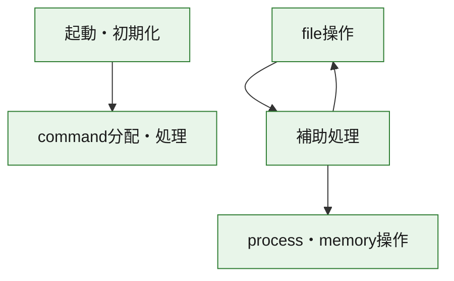
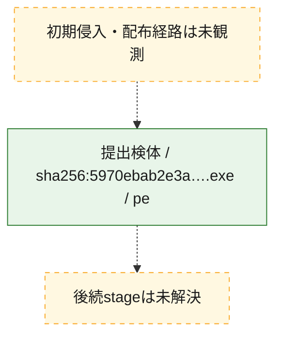
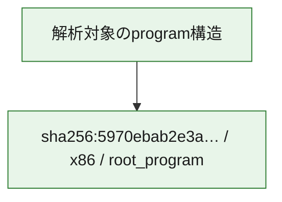

# 全体ロジック：5970ebab2e3a68c44434502304dfc4e178b086af975b500bb6bd5f6b47a46a97

代表関数の静的証跡から、起動・初期化、process・memory操作、command分配・処理、file操作の処理群を確認しました。

## 読み方

- phaseの掲載順は解析上の整理順です。observed_call_edgesがない段階間の実行順を断定しません。
- 図の実線は静的に観測した関係、点線と黄色のノードは未観測・未解決の関係を示します。
- 図は静的な要約であり、動的実行を再現するものではありません。
- 詳細な関数解説とfingerprintは[STATIC-LOGIC.md](STATIC-LOGIC.md)を参照してください。

## 静的可視化

### 実行フロー

### 感染チェーン

### モジュール関係

## 処理段階

### 1. 起動・初期化

entry pointから初期化と後続処理への移行を確認します。
確度: `confirmed_static_function_evidence`

- `5970ebab2e3a68c44434502304dfc4e178b086af975b500bb6bd5f6b47a46a97:ghidra:14000efe8` — 初期化と主要処理への分岐を行う入口関数です。 状態: `succeeded`、選定理由: `entry_point`, `meaningful_symbol_name`, `reviewed_call_centrality:22`, `role:entrypoint`

### 2. process・memory操作

process、thread、module、memory操作と実行移行を確認します。
確度: `confirmed_static_function_evidence`

- `5970ebab2e3a68c44434502304dfc4e178b086af975b500bb6bd5f6b47a46a97:ghidra:140001000` — process、thread、module、またはmemory操作に関係する関数です。 状態: `succeeded`、選定理由: `context_representative`, `reviewed_call_centrality:8`, `role:process_or_memory_operation`

### 3. command分配・処理

受信commandやtaskの解釈、分配、個別handlerへの移行を確認します。
確度: `confirmed_static_function_evidence_with_limits`

- `5970ebab2e3a68c44434502304dfc4e178b086af975b500bb6bd5f6b47a46a97:ghidra:14001ba10` — commandの解釈、分配、または個別処理を担当する関数です。 状態: `limited_bad_instruction_or_flow`、選定理由: `meaningful_symbol_name`, `reviewed_call_centrality:1`, `role:command_dispatch_or_handler`

### 4. file操作

fileやdirectoryの作成、読書き、削除を確認します。
確度: `confirmed_static_function_evidence`

- `5970ebab2e3a68c44434502304dfc4e178b086af975b500bb6bd5f6b47a46a97:ghidra:1400079e0` — fileまたはdirectoryの読書き・管理に関係する関数です。 状態: `succeeded`、選定理由: `context_representative`, `reviewed_call_centrality:29`, `role:file_operation`

### 5. 補助処理

主要処理を支える一般内部関数またはlibrary処理を確認します。
確度: `confirmed_static_function_evidence_with_limits`

- `5970ebab2e3a68c44434502304dfc4e178b086af975b500bb6bd5f6b47a46a97:ghidra:140001f10` — 検体内部の一般処理を実装する関数です。 状態: `succeeded`、選定理由: `context_representative`, `reviewed_call_centrality:9`
- `5970ebab2e3a68c44434502304dfc4e178b086af975b500bb6bd5f6b47a46a97:ghidra:140002260` — 検体内部の一般処理を実装する関数です。 状態: `succeeded`、選定理由: `context_representative`, `reviewed_call_centrality:9`
- `5970ebab2e3a68c44434502304dfc4e178b086af975b500bb6bd5f6b47a46a97:ghidra:140002510` — 検体内部の一般処理を実装する関数です。 状態: `failed`、選定理由: `context_representative`
- `5970ebab2e3a68c44434502304dfc4e178b086af975b500bb6bd5f6b47a46a97:ghidra:1400069f0` — 検体内部の一般処理を実装する関数です。 状態: `succeeded`、選定理由: `context_representative`, `reviewed_call_centrality:28`
- `5970ebab2e3a68c44434502304dfc4e178b086af975b500bb6bd5f6b47a46a97:ghidra:140006f60` — 検体内部の一般処理を実装する関数です。 状態: `limited_bad_instruction_or_flow`、選定理由: `context_representative`, `reviewed_call_centrality:22`
- `5970ebab2e3a68c44434502304dfc4e178b086af975b500bb6bd5f6b47a46a97:ghidra:140007920` — 検体内部の一般処理を実装する関数です。 状態: `limited_bad_instruction_or_flow`、選定理由: `context_representative`, `reviewed_call_centrality:4`
- `5970ebab2e3a68c44434502304dfc4e178b086af975b500bb6bd5f6b47a46a97:ghidra:1400088f0` — 検体内部の一般処理を実装する関数です。 状態: `succeeded`、選定理由: `context_representative`, `reviewed_call_centrality:2`
- `5970ebab2e3a68c44434502304dfc4e178b086af975b500bb6bd5f6b47a46a97:ghidra:140008910` — 検体内部の一般処理を実装する関数です。 状態: `limited_bad_instruction_or_flow`、選定理由: `context_representative`, `reviewed_call_centrality:4`
- `5970ebab2e3a68c44434502304dfc4e178b086af975b500bb6bd5f6b47a46a97:ghidra:140008940` — 検体内部の一般処理を実装する関数です。 状態: `succeeded`、選定理由: `context_representative`, `reviewed_call_centrality:33`
- `5970ebab2e3a68c44434502304dfc4e178b086af975b500bb6bd5f6b47a46a97:ghidra:140009200` — 検体内部の一般処理を実装する関数です。 状態: `succeeded`、選定理由: `context_representative`
- `5970ebab2e3a68c44434502304dfc4e178b086af975b500bb6bd5f6b47a46a97:ghidra:140009330` — 検体内部の一般処理を実装する関数です。 状態: `succeeded`、選定理由: `context_representative`, `reviewed_call_centrality:11`
- `5970ebab2e3a68c44434502304dfc4e178b086af975b500bb6bd5f6b47a46a97:ghidra:1400096d0` — 検体内部の一般処理を実装する関数です。 状態: `failed`、選定理由: `context_representative`
- `5970ebab2e3a68c44434502304dfc4e178b086af975b500bb6bd5f6b47a46a97:ghidra:14000a3d0` — 検体内部の一般処理を実装する関数です。 状態: `limited_bad_instruction_or_flow`、選定理由: `context_representative`, `reviewed_call_centrality:5`
- `5970ebab2e3a68c44434502304dfc4e178b086af975b500bb6bd5f6b47a46a97:ghidra:14000a400` — 検体内部の一般処理を実装する関数です。 状態: `limited_bad_instruction_or_flow`、選定理由: `context_representative`, `reviewed_call_centrality:4`
- `5970ebab2e3a68c44434502304dfc4e178b086af975b500bb6bd5f6b47a46a97:ghidra:14000aea0` — 検体内部の一般処理を実装する関数です。 状態: `limited_bad_instruction_or_flow`、選定理由: `context_representative`, `reviewed_call_centrality:4`
- `5970ebab2e3a68c44434502304dfc4e178b086af975b500bb6bd5f6b47a46a97:ghidra:14000af00` — 検体内部の一般処理を実装する関数です。 状態: `succeeded`、選定理由: `context_representative`, `reviewed_call_centrality:2`
- `5970ebab2e3a68c44434502304dfc4e178b086af975b500bb6bd5f6b47a46a97:ghidra:14000af50` — 検体内部の一般処理を実装する関数です。 状態: `succeeded`、選定理由: `context_representative`, `reviewed_call_centrality:13`
- `5970ebab2e3a68c44434502304dfc4e178b086af975b500bb6bd5f6b47a46a97:ghidra:14000af80` — 検体内部の一般処理を実装する関数です。 状態: `succeeded`、選定理由: `context_representative`, `reviewed_call_centrality:12`
- `5970ebab2e3a68c44434502304dfc4e178b086af975b500bb6bd5f6b47a46a97:ghidra:14000bdb0` — 検体内部の一般処理を実装する関数です。 状態: `limited_bad_instruction_or_flow`、選定理由: `context_representative`, `reviewed_call_centrality:7`
- `5970ebab2e3a68c44434502304dfc4e178b086af975b500bb6bd5f6b47a46a97:ghidra:14000be20` — 検体内部の一般処理を実装する関数です。 状態: `limited_bad_instruction_or_flow`、選定理由: `context_representative`, `reviewed_call_centrality:20`
- `5970ebab2e3a68c44434502304dfc4e178b086af975b500bb6bd5f6b47a46a97:ghidra:14000c370` — 検体内部の一般処理を実装する関数です。 状態: `succeeded`、選定理由: `context_representative`, `reviewed_call_centrality:13`
- `5970ebab2e3a68c44434502304dfc4e178b086af975b500bb6bd5f6b47a46a97:ghidra:14000c510` — 検体内部の一般処理を実装する関数です。 状態: `succeeded`、選定理由: `context_representative`, `reviewed_call_centrality:13`
- `5970ebab2e3a68c44434502304dfc4e178b086af975b500bb6bd5f6b47a46a97:ghidra:14000c6d0` — compiler生成処理または汎用library処理とみられる関数です。 状態: `limited_bad_instruction_or_flow`、選定理由: `entry_point`, `meaningful_symbol_name`, `reviewed_call_centrality:7`
- `5970ebab2e3a68c44434502304dfc4e178b086af975b500bb6bd5f6b47a46a97:ghidra:14000ca50` — 検体内部の一般処理を実装する関数です。 状態: `limited_bad_instruction_or_flow`、選定理由: `context_representative`, `reviewed_call_centrality:16`
- `5970ebab2e3a68c44434502304dfc4e178b086af975b500bb6bd5f6b47a46a97:ghidra:14000d4f0` — 検体内部の一般処理を実装する関数です。 状態: `succeeded`、選定理由: `context_representative`, `reviewed_call_centrality:1`
- `5970ebab2e3a68c44434502304dfc4e178b086af975b500bb6bd5f6b47a46a97:ghidra:14000d7b0` — 検体内部の一般処理を実装する関数です。 状態: `succeeded`、選定理由: `context_representative`, `reviewed_call_centrality:4`
- `5970ebab2e3a68c44434502304dfc4e178b086af975b500bb6bd5f6b47a46a97:ghidra:14000d830` — 検体内部の一般処理を実装する関数です。 状態: `succeeded`、選定理由: `context_representative`, `reviewed_call_centrality:1`
- `5970ebab2e3a68c44434502304dfc4e178b086af975b500bb6bd5f6b47a46a97:ghidra:140010008` — 検体内部の一般処理を実装する関数です。 状態: `succeeded`、選定理由: `meaningful_symbol_name`

## 観測したcall関係

- `5970ebab2e3a68c44434502304dfc4e178b086af975b500bb6bd5f6b47a46a97:ghidra:140002260` → `5970ebab2e3a68c44434502304dfc4e178b086af975b500bb6bd5f6b47a46a97:ghidra:140009330` （`support` → `support`）
- `5970ebab2e3a68c44434502304dfc4e178b086af975b500bb6bd5f6b47a46a97:ghidra:140002260` → `5970ebab2e3a68c44434502304dfc4e178b086af975b500bb6bd5f6b47a46a97:ghidra:14000bdb0` （`support` → `support`）
- `5970ebab2e3a68c44434502304dfc4e178b086af975b500bb6bd5f6b47a46a97:ghidra:1400069f0` → `5970ebab2e3a68c44434502304dfc4e178b086af975b500bb6bd5f6b47a46a97:ghidra:1400079e0` （`support` → `file_activity`）
- `5970ebab2e3a68c44434502304dfc4e178b086af975b500bb6bd5f6b47a46a97:ghidra:1400069f0` → `5970ebab2e3a68c44434502304dfc4e178b086af975b500bb6bd5f6b47a46a97:ghidra:14000c510` （`support` → `support`）
- `5970ebab2e3a68c44434502304dfc4e178b086af975b500bb6bd5f6b47a46a97:ghidra:1400079e0` → `5970ebab2e3a68c44434502304dfc4e178b086af975b500bb6bd5f6b47a46a97:ghidra:14000d7b0` （`file_activity` → `support`）
- `5970ebab2e3a68c44434502304dfc4e178b086af975b500bb6bd5f6b47a46a97:ghidra:140008940` → `5970ebab2e3a68c44434502304dfc4e178b086af975b500bb6bd5f6b47a46a97:ghidra:140001f10` （`support` → `support`）
- `5970ebab2e3a68c44434502304dfc4e178b086af975b500bb6bd5f6b47a46a97:ghidra:140008940` → `5970ebab2e3a68c44434502304dfc4e178b086af975b500bb6bd5f6b47a46a97:ghidra:14000a3d0` （`support` → `support`）
- `5970ebab2e3a68c44434502304dfc4e178b086af975b500bb6bd5f6b47a46a97:ghidra:140008940` → `5970ebab2e3a68c44434502304dfc4e178b086af975b500bb6bd5f6b47a46a97:ghidra:14000d4f0` （`support` → `support`）
- `5970ebab2e3a68c44434502304dfc4e178b086af975b500bb6bd5f6b47a46a97:ghidra:14000af00` → `5970ebab2e3a68c44434502304dfc4e178b086af975b500bb6bd5f6b47a46a97:ghidra:140006f60` （`support` → `support`）
- `5970ebab2e3a68c44434502304dfc4e178b086af975b500bb6bd5f6b47a46a97:ghidra:14000af50` → `5970ebab2e3a68c44434502304dfc4e178b086af975b500bb6bd5f6b47a46a97:ghidra:140001000` （`support` → `execution`）
- `5970ebab2e3a68c44434502304dfc4e178b086af975b500bb6bd5f6b47a46a97:ghidra:14000be20` → `5970ebab2e3a68c44434502304dfc4e178b086af975b500bb6bd5f6b47a46a97:ghidra:140006f60` （`support` → `support`）
- `5970ebab2e3a68c44434502304dfc4e178b086af975b500bb6bd5f6b47a46a97:ghidra:14000c370` → `5970ebab2e3a68c44434502304dfc4e178b086af975b500bb6bd5f6b47a46a97:ghidra:1400079e0` （`support` → `file_activity`）
- `5970ebab2e3a68c44434502304dfc4e178b086af975b500bb6bd5f6b47a46a97:ghidra:14000d830` → `5970ebab2e3a68c44434502304dfc4e178b086af975b500bb6bd5f6b47a46a97:ghidra:140008940` （`support` → `support`）
- `5970ebab2e3a68c44434502304dfc4e178b086af975b500bb6bd5f6b47a46a97:ghidra:14000efe8` → `5970ebab2e3a68c44434502304dfc4e178b086af975b500bb6bd5f6b47a46a97:ghidra:14001ba10` （`startup` → `dispatch`）
- `ghidra-function:040c14e71cb6f6359028b369` → `ghidra-external:31042fa1da3eada0da6a5d3e` （`unclassified` → `unclassified`）
- `ghidra-function:040c14e71cb6f6359028b369` → `ghidra-external:7a7acc64b466c93a6920c26b` （`unclassified` → `unclassified`）
- `ghidra-function:040c14e71cb6f6359028b369` → `ghidra-function:1ef016e204c9e1378c49770f` （`unclassified` → `unclassified`）
- `ghidra-function:040c14e71cb6f6359028b369` → `ghidra-function:35fc2db8c39c16dc3216c1ba` （`unclassified` → `unclassified`）
- `ghidra-function:040c14e71cb6f6359028b369` → `ghidra-function:5d350b871ae78c8ac2300585` （`unclassified` → `unclassified`）
- `ghidra-function:040c14e71cb6f6359028b369` → `ghidra-function:69065e5aa0a101a86d2000c4` （`unclassified` → `unclassified`）
- `ghidra-function:040c14e71cb6f6359028b369` → `ghidra-function:926429727b9e5e979d3f3209` （`unclassified` → `unclassified`）
- `ghidra-function:040c14e71cb6f6359028b369` → `ghidra-function:a00afdf7c38816a054391939` （`unclassified` → `unclassified`）
- `ghidra-function:040c14e71cb6f6359028b369` → `ghidra-function:ac7a6df69d4ef4d1aa1a5b37` （`unclassified` → `unclassified`）
- `ghidra-function:040c14e71cb6f6359028b369` → `ghidra-function:da144cc081fc0edb864ffcf1` （`unclassified` → `unclassified`）
- `ghidra-function:040c14e71cb6f6359028b369` → `ghidra-function:daef50b7e34c3c5707596ec5` （`unclassified` → `unclassified`）
- `ghidra-function:040c14e71cb6f6359028b369` → `ghidra-function:e7b4c6e3eb419fd2912112cb` （`unclassified` → `unclassified`）
- `ghidra-function:0840103cbc71b9955da82ebd` → `ghidra-external:79f9172a29333e5aaa8a665f` （`unclassified` → `unclassified`）
- `ghidra-function:0840103cbc71b9955da82ebd` → `ghidra-external:7a7acc64b466c93a6920c26b` （`unclassified` → `unclassified`）
- `ghidra-function:0840103cbc71b9955da82ebd` → `ghidra-external:9fd4f4c72569e4cfecf1beef` （`unclassified` → `unclassified`）
- `ghidra-function:0840103cbc71b9955da82ebd` → `ghidra-external:a044fe683bec11ca3ebfc41c` （`unclassified` → `unclassified`）
- `ghidra-function:0840103cbc71b9955da82ebd` → `ghidra-function:216d2cd569a691cc958ca526` （`unclassified` → `unclassified`）
- `ghidra-function:0840103cbc71b9955da82ebd` → `ghidra-function:47035b2c62697af511775aec` （`unclassified` → `unclassified`）
- `ghidra-function:0840103cbc71b9955da82ebd` → `ghidra-function:71261d05714012bd259236d7` （`unclassified` → `unclassified`）
- `ghidra-function:0840103cbc71b9955da82ebd` → `ghidra-function:92455a5d5b4944f69d86f379` （`unclassified` → `unclassified`）
- `ghidra-function:14d114a499b6120b721aaaa6` → `ghidra-external:7a7acc64b466c93a6920c26b` （`unclassified` → `unclassified`）
- `ghidra-function:14d114a499b6120b721aaaa6` → `ghidra-external:998d679aab3a60cd055eef2d` （`unclassified` → `unclassified`）
- `ghidra-function:14d114a499b6120b721aaaa6` → `ghidra-external:9c36856655ebcb45c5a1a6c1` （`unclassified` → `unclassified`）
- `ghidra-function:14d114a499b6120b721aaaa6` → `ghidra-external:ca68c474b69723c0e0284e4a` （`unclassified` → `unclassified`）
- `ghidra-function:14d114a499b6120b721aaaa6` → `ghidra-function:216d2cd569a691cc958ca526` （`unclassified` → `unclassified`）
- `ghidra-function:14d114a499b6120b721aaaa6` → `ghidra-function:299aa2f771a46310a1668bf5` （`unclassified` → `unclassified`）
- `ghidra-function:14d114a499b6120b721aaaa6` → `ghidra-function:8d2fa89e2840f1ac18151da6` （`unclassified` → `unclassified`）
- `ghidra-function:14d114a499b6120b721aaaa6` → `ghidra-function:8f08d616fee912974f76115e` （`unclassified` → `unclassified`）
- `ghidra-function:14d114a499b6120b721aaaa6` → `ghidra-function:d6f28eb17d1506561d458699` （`unclassified` → `unclassified`）
- `ghidra-function:160fa0dbac0d1040bff66c24` → `ghidra-external:7a7acc64b466c93a6920c26b` （`unclassified` → `unclassified`）
- `ghidra-function:160fa0dbac0d1040bff66c24` → `ghidra-external:8be91e6c110d5103fe2998d5` （`unclassified` → `unclassified`）
- `ghidra-function:160fa0dbac0d1040bff66c24` → `ghidra-external:998d679aab3a60cd055eef2d` （`unclassified` → `unclassified`）
- `ghidra-function:160fa0dbac0d1040bff66c24` → `ghidra-external:9c36856655ebcb45c5a1a6c1` （`unclassified` → `unclassified`）
- `ghidra-function:160fa0dbac0d1040bff66c24` → `ghidra-external:ca68c474b69723c0e0284e4a` （`unclassified` → `unclassified`）
- `ghidra-function:160fa0dbac0d1040bff66c24` → `ghidra-external:d5cbdfab3b6ec36b5c2132b6` （`unclassified` → `unclassified`）
- `ghidra-function:160fa0dbac0d1040bff66c24` → `ghidra-function:0d234152db2c6459d3b47b25` （`unclassified` → `unclassified`）
- `ghidra-function:160fa0dbac0d1040bff66c24` → `ghidra-function:216d2cd569a691cc958ca526` （`unclassified` → `unclassified`）
- `ghidra-function:160fa0dbac0d1040bff66c24` → `ghidra-function:299aa2f771a46310a1668bf5` （`unclassified` → `unclassified`）
- `ghidra-function:160fa0dbac0d1040bff66c24` → `ghidra-function:3af8a869d31442be9c31f98f` （`unclassified` → `unclassified`）
- `ghidra-function:160fa0dbac0d1040bff66c24` → `ghidra-function:6269d9648e620ed46eb51d98` （`unclassified` → `unclassified`）
- `ghidra-function:160fa0dbac0d1040bff66c24` → `ghidra-function:6443aed2e723d3b51cecf17b` （`unclassified` → `unclassified`）
- `ghidra-function:160fa0dbac0d1040bff66c24` → `ghidra-function:67e272ef72115f76dc19b99e` （`unclassified` → `unclassified`）
- `ghidra-function:160fa0dbac0d1040bff66c24` → `ghidra-function:69065e5aa0a101a86d2000c4` （`unclassified` → `unclassified`）
- `ghidra-function:160fa0dbac0d1040bff66c24` → `ghidra-function:8d2fa89e2840f1ac18151da6` （`unclassified` → `unclassified`）
- `ghidra-function:160fa0dbac0d1040bff66c24` → `ghidra-function:926429727b9e5e979d3f3209` （`unclassified` → `unclassified`）
- `ghidra-function:160fa0dbac0d1040bff66c24` → `ghidra-function:9666734b8afdc7db747abc07` （`unclassified` → `unclassified`）
- `ghidra-function:160fa0dbac0d1040bff66c24` → `ghidra-function:ac7a6df69d4ef4d1aa1a5b37` （`unclassified` → `unclassified`）
- `ghidra-function:160fa0dbac0d1040bff66c24` → `ghidra-function:d6f28eb17d1506561d458699` （`unclassified` → `unclassified`）
- `ghidra-function:3f6b4beae31ee0119a8c0b8a` → `ghidra-external:1fde3b4c0759b67a6cc3a1bc` （`unclassified` → `unclassified`）
- `ghidra-function:3f6b4beae31ee0119a8c0b8a` → `ghidra-external:2d7957ea91c97bf669250445` （`unclassified` → `unclassified`）
- `ghidra-function:3f6b4beae31ee0119a8c0b8a` → `ghidra-external:2e69bea947935cf8cc54e3b7` （`unclassified` → `unclassified`）
- `ghidra-function:3f6b4beae31ee0119a8c0b8a` → `ghidra-external:4bd6cc75fa6217bca4e769e5` （`unclassified` → `unclassified`）
- `ghidra-function:3f6b4beae31ee0119a8c0b8a` → `ghidra-external:6346f47e6a5604995ac188cd` （`unclassified` → `unclassified`）
- `ghidra-function:3f6b4beae31ee0119a8c0b8a` → `ghidra-external:8870f56eda335aff7fefd5db` （`unclassified` → `unclassified`）
- `ghidra-function:3f6b4beae31ee0119a8c0b8a` → `ghidra-external:8be91e6c110d5103fe2998d5` （`unclassified` → `unclassified`）
- `ghidra-function:3f6b4beae31ee0119a8c0b8a` → `ghidra-external:a7680f5933b9e979e004d026` （`unclassified` → `unclassified`）
- `ghidra-function:3f6b4beae31ee0119a8c0b8a` → `ghidra-external:cb7c41cabcf11676242d9ca1` （`unclassified` → `unclassified`）
- `ghidra-function:3f6b4beae31ee0119a8c0b8a` → `ghidra-function:0ba080942a97b5e9d309f037` （`unclassified` → `unclassified`）
- `ghidra-function:3f6b4beae31ee0119a8c0b8a` → `ghidra-function:4f319142f4c515ed77b9ad64` （`unclassified` → `unclassified`）
- `ghidra-function:3f6b4beae31ee0119a8c0b8a` → `ghidra-function:4fcd4f44e7ee211ca1cbfae4` （`unclassified` → `unclassified`）
- `ghidra-function:3f6b4beae31ee0119a8c0b8a` → `ghidra-function:59d8838f5b37acf812a0d48b` （`unclassified` → `unclassified`）
- `ghidra-function:3f6b4beae31ee0119a8c0b8a` → `ghidra-function:a1214e99b2846496321191e2` （`unclassified` → `unclassified`）
- `ghidra-function:3f6b4beae31ee0119a8c0b8a` → `ghidra-function:a74ae0f43e1ef198985b938b` （`unclassified` → `unclassified`）
- `ghidra-function:3f6b4beae31ee0119a8c0b8a` → `ghidra-function:bd99a7a56130ceea68f9144c` （`unclassified` → `unclassified`）
- `ghidra-function:3f6b4beae31ee0119a8c0b8a` → `ghidra-function:c4511109e9cdbac01ec3a6fb` （`unclassified` → `unclassified`）
- `ghidra-function:3f6b4beae31ee0119a8c0b8a` → `ghidra-function:d3831fcae6d86f846a8f33ae` （`unclassified` → `unclassified`）
- `ghidra-function:3f6b4beae31ee0119a8c0b8a` → `ghidra-function:dbbd9459365ef6ecaf402729` （`unclassified` → `unclassified`）
- `ghidra-function:3f6b4beae31ee0119a8c0b8a` → `ghidra-function:ec0075e73c21f07457d3a63b` （`unclassified` → `unclassified`）
- `ghidra-function:3f6b4beae31ee0119a8c0b8a` → `ghidra-function:f9df8525c6970562444b157d` （`unclassified` → `unclassified`）
- `ghidra-function:3f6b4beae31ee0119a8c0b8a` → `ghidra-function:fe6dd32149cec9c2e92c1977` （`unclassified` → `unclassified`）
- `ghidra-function:47035b2c62697af511775aec` → `ghidra-external:79f9172a29333e5aaa8a665f` （`unclassified` → `unclassified`）
- `ghidra-function:47035b2c62697af511775aec` → `ghidra-external:9fd4f4c72569e4cfecf1beef` （`unclassified` → `unclassified`）
- `ghidra-function:47035b2c62697af511775aec` → `ghidra-function:69065e5aa0a101a86d2000c4` （`unclassified` → `unclassified`）
- `ghidra-function:47035b2c62697af511775aec` → `ghidra-function:926429727b9e5e979d3f3209` （`unclassified` → `unclassified`）
- `ghidra-function:5cb5cfdb5147f2dcd1630fec` → `ghidra-external:7a7acc64b466c93a6920c26b` （`unclassified` → `unclassified`）
- `ghidra-function:5cb5cfdb5147f2dcd1630fec` → `ghidra-function:9666734b8afdc7db747abc07` （`unclassified` → `unclassified`）
- `ghidra-function:5cb5cfdb5147f2dcd1630fec` → `ghidra-function:9a5840cd23dc5c8de398a686` （`unclassified` → `unclassified`）
- `ghidra-function:5cb5cfdb5147f2dcd1630fec` → `ghidra-function:de465e9962b4e1aae676119a` （`unclassified` → `unclassified`）
- `ghidra-function:5cb5cfdb5147f2dcd1630fec` → `ghidra-function:ff5385ce657881385c8da1c1` （`unclassified` → `unclassified`）
- `ghidra-function:6443aed2e723d3b51cecf17b` → `ghidra-external:31042fa1da3eada0da6a5d3e` （`unclassified` → `unclassified`）
- `ghidra-function:6443aed2e723d3b51cecf17b` → `ghidra-external:7a7acc64b466c93a6920c26b` （`unclassified` → `unclassified`）
- `ghidra-function:6443aed2e723d3b51cecf17b` → `ghidra-external:9c36856655ebcb45c5a1a6c1` （`unclassified` → `unclassified`）
- `ghidra-function:6443aed2e723d3b51cecf17b` → `ghidra-external:d5cbdfab3b6ec36b5c2132b6` （`unclassified` → `unclassified`）
- `ghidra-function:6443aed2e723d3b51cecf17b` → `ghidra-function:299aa2f771a46310a1668bf5` （`unclassified` → `unclassified`）
- `ghidra-function:6443aed2e723d3b51cecf17b` → `ghidra-function:67e272ef72115f76dc19b99e` （`unclassified` → `unclassified`）
- `ghidra-function:6443aed2e723d3b51cecf17b` → `ghidra-function:8aca60a1b95db7cb3911f27d` （`unclassified` → `unclassified`）
- `ghidra-function:6443aed2e723d3b51cecf17b` → `ghidra-function:8d2fa89e2840f1ac18151da6` （`unclassified` → `unclassified`）
- `ghidra-function:6443aed2e723d3b51cecf17b` → `ghidra-function:bc14df99333fdfe01b4ddf08` （`unclassified` → `unclassified`）
- `ghidra-function:672340039f538b5ff972b1b2` → `ghidra-external:7a7acc64b466c93a6920c26b` （`unclassified` → `unclassified`）
- `ghidra-function:672340039f538b5ff972b1b2` → `ghidra-function:8aca60a1b95db7cb3911f27d` （`unclassified` → `unclassified`）
- `ghidra-function:672340039f538b5ff972b1b2` → `ghidra-function:ac7a6df69d4ef4d1aa1a5b37` （`unclassified` → `unclassified`）
- `ghidra-function:6b01d50545692c7ddb3fa364` → `ghidra-function:6c91086525bba505dc3b3c4b` （`unclassified` → `unclassified`）
- `ghidra-function:6b01d50545692c7ddb3fa364` → `ghidra-function:af6e4ad8a7cf0937c3e3f10d` （`unclassified` → `unclassified`）
- `ghidra-function:6b4f25204940bcd9dbf86a85` → `ghidra-external:7a7acc64b466c93a6920c26b` （`unclassified` → `unclassified`）
- `ghidra-function:6b4f25204940bcd9dbf86a85` → `ghidra-function:040c14e71cb6f6359028b369` （`unclassified` → `unclassified`）
- `ghidra-function:6c0e29d9f8acfbb21a49e436` → `ghidra-external:259f61aa203303ec12bdafb8` （`unclassified` → `unclassified`）
- `ghidra-function:6c0e29d9f8acfbb21a49e436` → `ghidra-external:2dd0cccf4b8666d3bb0aba1d` （`unclassified` → `unclassified`）
- `ghidra-function:6c0e29d9f8acfbb21a49e436` → `ghidra-external:31042fa1da3eada0da6a5d3e` （`unclassified` → `unclassified`）
- `ghidra-function:6c0e29d9f8acfbb21a49e436` → `ghidra-external:6807340218abe255592ea484` （`unclassified` → `unclassified`）
- `ghidra-function:6c0e29d9f8acfbb21a49e436` → `ghidra-external:7a7acc64b466c93a6920c26b` （`unclassified` → `unclassified`）
- `ghidra-function:6c0e29d9f8acfbb21a49e436` → `ghidra-external:8be91e6c110d5103fe2998d5` （`unclassified` → `unclassified`）
- `ghidra-function:6c0e29d9f8acfbb21a49e436` → `ghidra-function:040c14e71cb6f6359028b369` （`unclassified` → `unclassified`）
- `ghidra-function:6c0e29d9f8acfbb21a49e436` → `ghidra-function:0cd9beb4ff83ec4aa572318d` （`unclassified` → `unclassified`）
- `ghidra-function:6c0e29d9f8acfbb21a49e436` → `ghidra-function:38ce0f33c6805c08b7bc8ddd` （`unclassified` → `unclassified`）
- `ghidra-function:6c0e29d9f8acfbb21a49e436` → `ghidra-function:69065e5aa0a101a86d2000c4` （`unclassified` → `unclassified`）
- `ghidra-function:6c0e29d9f8acfbb21a49e436` → `ghidra-function:926429727b9e5e979d3f3209` （`unclassified` → `unclassified`）
- `ghidra-function:6c0e29d9f8acfbb21a49e436` → `ghidra-function:a00afdf7c38816a054391939` （`unclassified` → `unclassified`）
- `ghidra-function:6c0e29d9f8acfbb21a49e436` → `ghidra-function:ac7a6df69d4ef4d1aa1a5b37` （`unclassified` → `unclassified`）
- `ghidra-function:6c0e29d9f8acfbb21a49e436` → `ghidra-function:da144cc081fc0edb864ffcf1` （`unclassified` → `unclassified`）
- `ghidra-function:71261d05714012bd259236d7` → `ghidra-external:7a7acc64b466c93a6920c26b` （`unclassified` → `unclassified`）
- `ghidra-function:71261d05714012bd259236d7` → `ghidra-external:f1eca4362ddb27715d008ccd` （`unclassified` → `unclassified`）
- `ghidra-function:71261d05714012bd259236d7` → `ghidra-function:4e24fb6a2390c48b78288b20` （`unclassified` → `unclassified`）
- `ghidra-function:71261d05714012bd259236d7` → `ghidra-function:6269d9648e620ed46eb51d98` （`unclassified` → `unclassified`）
- `ghidra-function:71261d05714012bd259236d7` → `ghidra-function:69065e5aa0a101a86d2000c4` （`unclassified` → `unclassified`）
- `ghidra-function:71261d05714012bd259236d7` → `ghidra-function:926429727b9e5e979d3f3209` （`unclassified` → `unclassified`）
- `ghidra-function:71261d05714012bd259236d7` → `ghidra-function:ac7a6df69d4ef4d1aa1a5b37` （`unclassified` → `unclassified`）
- `ghidra-function:803184dd2e3f2e45d68e1024` → `ghidra-external:79f9172a29333e5aaa8a665f` （`unclassified` → `unclassified`）
- `ghidra-function:803184dd2e3f2e45d68e1024` → `ghidra-external:7a7acc64b466c93a6920c26b` （`unclassified` → `unclassified`）
- `ghidra-function:803184dd2e3f2e45d68e1024` → `ghidra-external:9fd4f4c72569e4cfecf1beef` （`unclassified` → `unclassified`）
- `ghidra-function:803184dd2e3f2e45d68e1024` → `ghidra-function:69065e5aa0a101a86d2000c4` （`unclassified` → `unclassified`）
- `ghidra-function:803184dd2e3f2e45d68e1024` → `ghidra-function:926429727b9e5e979d3f3209` （`unclassified` → `unclassified`）
- `ghidra-function:8fbc1e3ee7829158b2895a5f` → `ghidra-external:5d5d75b1fad27b5dc743264e` （`unclassified` → `unclassified`）
- `ghidra-function:8fbc1e3ee7829158b2895a5f` → `ghidra-external:6d524191770e3ca38a56b72e` （`unclassified` → `unclassified`）
- `ghidra-function:8fbc1e3ee7829158b2895a5f` → `ghidra-external:79692ea1d0c406583a6fa8b8` （`unclassified` → `unclassified`）
- `ghidra-function:8fbc1e3ee7829158b2895a5f` → `ghidra-external:99dac2dab31639440b5cd4c2` （`unclassified` → `unclassified`）
- `ghidra-function:9996af328dbb8b293c7bc9f4` → `ghidra-external:31042fa1da3eada0da6a5d3e` （`unclassified` → `unclassified`）
- `ghidra-function:9996af328dbb8b293c7bc9f4` → `ghidra-external:79f9172a29333e5aaa8a665f` （`unclassified` → `unclassified`）
- `ghidra-function:9996af328dbb8b293c7bc9f4` → `ghidra-external:7a7acc64b466c93a6920c26b` （`unclassified` → `unclassified`）
- `ghidra-function:9996af328dbb8b293c7bc9f4` → `ghidra-external:9fd4f4c72569e4cfecf1beef` （`unclassified` → `unclassified`）
- `ghidra-function:9996af328dbb8b293c7bc9f4` → `ghidra-function:5c4e90bb742374bb54d563ca` （`unclassified` → `unclassified`）
- `ghidra-function:9996af328dbb8b293c7bc9f4` → `ghidra-function:6c91086525bba505dc3b3c4b` （`unclassified` → `unclassified`）
- `ghidra-function:9996af328dbb8b293c7bc9f4` → `ghidra-function:8aca60a1b95db7cb3911f27d` （`unclassified` → `unclassified`）
- `ghidra-function:9996af328dbb8b293c7bc9f4` → `ghidra-function:a550b2ea619e5ea1d3e2e729` （`unclassified` → `unclassified`）
- `ghidra-function:9996af328dbb8b293c7bc9f4` → `ghidra-function:ac7a6df69d4ef4d1aa1a5b37` （`unclassified` → `unclassified`）
- `ghidra-function:9996af328dbb8b293c7bc9f4` → `ghidra-function:b02c1d4cafb8b1646cd597ac` （`unclassified` → `unclassified`）
- `ghidra-function:9ebe8f48541a612fafbac2e8` → `ghidra-external:31042fa1da3eada0da6a5d3e` （`unclassified` → `unclassified`）
- `ghidra-function:9ebe8f48541a612fafbac2e8` → `ghidra-external:79f9172a29333e5aaa8a665f` （`unclassified` → `unclassified`）
- `ghidra-function:9ebe8f48541a612fafbac2e8` → `ghidra-external:7a7acc64b466c93a6920c26b` （`unclassified` → `unclassified`）
- `ghidra-function:9ebe8f48541a612fafbac2e8` → `ghidra-external:998d679aab3a60cd055eef2d` （`unclassified` → `unclassified`）
- `ghidra-function:9ebe8f48541a612fafbac2e8` → `ghidra-external:9c36856655ebcb45c5a1a6c1` （`unclassified` → `unclassified`）
- `ghidra-function:9ebe8f48541a612fafbac2e8` → `ghidra-external:9fd4f4c72569e4cfecf1beef` （`unclassified` → `unclassified`）
- `ghidra-function:9ebe8f48541a612fafbac2e8` → `ghidra-external:ca68c474b69723c0e0284e4a` （`unclassified` → `unclassified`）
- `ghidra-function:9ebe8f48541a612fafbac2e8` → `ghidra-function:14b6b5016d1e110f7c38323b` （`unclassified` → `unclassified`）
- `ghidra-function:9ebe8f48541a612fafbac2e8` → `ghidra-function:299aa2f771a46310a1668bf5` （`unclassified` → `unclassified`）
- `ghidra-function:9ebe8f48541a612fafbac2e8` → `ghidra-function:5cb5cfdb5147f2dcd1630fec` （`unclassified` → `unclassified`）
- `ghidra-function:9ebe8f48541a612fafbac2e8` → `ghidra-function:69065e5aa0a101a86d2000c4` （`unclassified` → `unclassified`）
- `ghidra-function:9ebe8f48541a612fafbac2e8` → `ghidra-function:6b4078fb8d9726da853dbd32` （`unclassified` → `unclassified`）
- `ghidra-function:9ebe8f48541a612fafbac2e8` → `ghidra-function:6e3e61fe37f38ab5501f313d` （`unclassified` → `unclassified`）
- `ghidra-function:9ebe8f48541a612fafbac2e8` → `ghidra-function:8aca60a1b95db7cb3911f27d` （`unclassified` → `unclassified`）
- `ghidra-function:9ebe8f48541a612fafbac2e8` → `ghidra-function:8d2fa89e2840f1ac18151da6` （`unclassified` → `unclassified`）
- `ghidra-function:9ebe8f48541a612fafbac2e8` → `ghidra-function:8f08d616fee912974f76115e` （`unclassified` → `unclassified`）
- `ghidra-function:9ebe8f48541a612fafbac2e8` → `ghidra-function:926429727b9e5e979d3f3209` （`unclassified` → `unclassified`）
- `ghidra-function:9ebe8f48541a612fafbac2e8` → `ghidra-function:9666734b8afdc7db747abc07` （`unclassified` → `unclassified`）
- `ghidra-function:9ebe8f48541a612fafbac2e8` → `ghidra-function:b8d18b6f4b820b33eb6103d9` （`unclassified` → `unclassified`）
- `ghidra-function:9ebe8f48541a612fafbac2e8` → `ghidra-function:bcbe0717814519673cb0514f` （`unclassified` → `unclassified`）
- `ghidra-function:9ebe8f48541a612fafbac2e8` → `ghidra-function:dbfc3651dbcc91a0974380ff` （`unclassified` → `unclassified`）
- `ghidra-function:9ebe8f48541a612fafbac2e8` → `ghidra-function:f0a25466ecf3472641c289da` （`unclassified` → `unclassified`）
- `ghidra-function:a75ef5d8d92976cd6b67d5d2` → `ghidra-function:6c91086525bba505dc3b3c4b` （`unclassified` → `unclassified`）
- `ghidra-function:a75ef5d8d92976cd6b67d5d2` → `ghidra-function:af6e4ad8a7cf0937c3e3f10d` （`unclassified` → `unclassified`）
- `ghidra-function:b02c1d4cafb8b1646cd597ac` → `ghidra-external:79f9172a29333e5aaa8a665f` （`unclassified` → `unclassified`）
- `ghidra-function:b02c1d4cafb8b1646cd597ac` → `ghidra-external:7a7acc64b466c93a6920c26b` （`unclassified` → `unclassified`）
- `ghidra-function:b02c1d4cafb8b1646cd597ac` → `ghidra-external:9fd4f4c72569e4cfecf1beef` （`unclassified` → `unclassified`）
- `ghidra-function:b02c1d4cafb8b1646cd597ac` → `ghidra-function:112694ce558186e45e4e787a` （`unclassified` → `unclassified`）
- `ghidra-function:b02c1d4cafb8b1646cd597ac` → `ghidra-function:8aca60a1b95db7cb3911f27d` （`unclassified` → `unclassified`）
- `ghidra-function:b02c1d4cafb8b1646cd597ac` → `ghidra-function:ac7a6df69d4ef4d1aa1a5b37` （`unclassified` → `unclassified`）
- `ghidra-function:baba7af775a63a555b353c2a` → `ghidra-function:06c0b5e04e5f36d90dab0de6` （`unclassified` → `unclassified`）
- `ghidra-function:d62f0266fa76828427653f14` → `ghidra-external:043dcfcc9233f7de14f9bf59` （`unclassified` → `unclassified`）
- `ghidra-function:d62f0266fa76828427653f14` → `ghidra-external:07422d893215dd781ac991c7` （`unclassified` → `unclassified`）
- `ghidra-function:d62f0266fa76828427653f14` → `ghidra-external:0d7256fa3300bee2f9fc9b18` （`unclassified` → `unclassified`）
- `ghidra-function:d62f0266fa76828427653f14` → `ghidra-external:2dd0cccf4b8666d3bb0aba1d` （`unclassified` → `unclassified`）
- `ghidra-function:d62f0266fa76828427653f14` → `ghidra-external:38a6817f833464ac916255ce` （`unclassified` → `unclassified`）
- `ghidra-function:d62f0266fa76828427653f14` → `ghidra-external:5b084c133c88a15c8c04f5c4` （`unclassified` → `unclassified`）
- `ghidra-function:d62f0266fa76828427653f14` → `ghidra-external:6219a54a42062c4a930e220d` （`unclassified` → `unclassified`）
- `ghidra-function:d62f0266fa76828427653f14` → `ghidra-external:7a7acc64b466c93a6920c26b` （`unclassified` → `unclassified`）
- `ghidra-function:d62f0266fa76828427653f14` → `ghidra-external:8703ff9078cd1cd97958d7c7` （`unclassified` → `unclassified`）
- `ghidra-function:d62f0266fa76828427653f14` → `ghidra-external:8be91e6c110d5103fe2998d5` （`unclassified` → `unclassified`）
- `ghidra-function:d62f0266fa76828427653f14` → `ghidra-external:8eff9a35c580f98c3a9251e4` （`unclassified` → `unclassified`）
- `ghidra-function:d62f0266fa76828427653f14` → `ghidra-external:9c98bce48ac1cc25b7c8da5d` （`unclassified` → `unclassified`）
- `ghidra-function:d62f0266fa76828427653f14` → `ghidra-external:a274c0a3459fe3a06ff76a8e` （`unclassified` → `unclassified`）
- `ghidra-function:d62f0266fa76828427653f14` → `ghidra-external:b006c0ca44c77c844d9489ad` （`unclassified` → `unclassified`）
- `ghidra-function:d62f0266fa76828427653f14` → `ghidra-external:b3d6fe3a910220e02e8c66a6` （`unclassified` → `unclassified`）
- `ghidra-function:d62f0266fa76828427653f14` → `ghidra-external:f82e1fa0e2ffe326c5a1f08e` （`unclassified` → `unclassified`）
- `ghidra-function:d6f28eb17d1506561d458699` → `ghidra-external:7a7acc64b466c93a6920c26b` （`unclassified` → `unclassified`）
- `ghidra-function:d6f28eb17d1506561d458699` → `ghidra-external:ca68c474b69723c0e0284e4a` （`unclassified` → `unclassified`）
- `ghidra-function:d6f28eb17d1506561d458699` → `ghidra-external:f1eca4362ddb27715d008ccd` （`unclassified` → `unclassified`）
- `ghidra-function:d6f28eb17d1506561d458699` → `ghidra-function:06c0b5e04e5f36d90dab0de6` （`unclassified` → `unclassified`）
- 残り28件は`static-logic.json`に記録しています。

## 解析範囲と制約

- 選定外関数は全体inventoryへ残しますが、関数本体の個別解説対象にはしていません。
- indirect call、難読化、packer、VM、壊れたcontrol flowによりcall関係が欠落する場合があります。
- 文書は静的解析に基づき、検体実行や外部通信による動的確認は行っていません。
