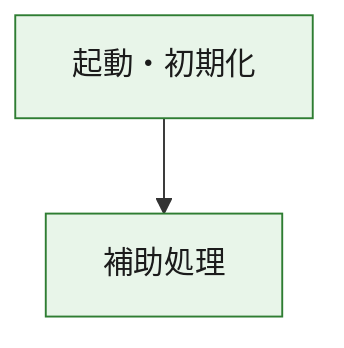
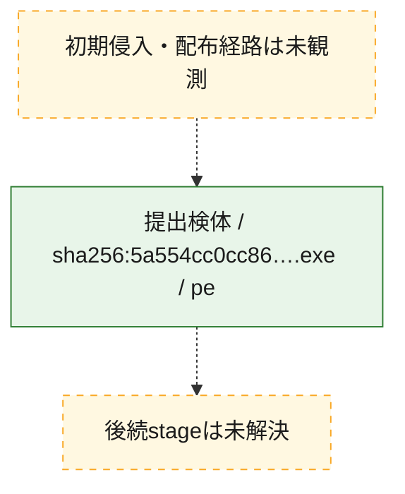
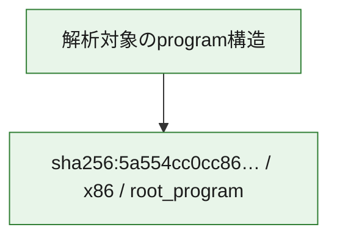

# 全体ロジック：5a554cc0cc86575e0f3e07d384ba4e83871d5a03333c67170bb0b946bf38844d

代表関数の静的証跡から、起動・初期化の処理群を確認しました。

## 読み方

- phaseの掲載順は解析上の整理順です。observed_call_edgesがない段階間の実行順を断定しません。
- 図の実線は静的に観測した関係、点線と黄色のノードは未観測・未解決の関係を示します。
- 図は静的な要約であり、動的実行を再現するものではありません。
- 詳細な関数解説とfingerprintは[STATIC-LOGIC.md](STATIC-LOGIC.md)を参照してください。

## 静的可視化

### 実行フロー

### 感染チェーン

### モジュール関係

## 処理段階

### 1. 起動・初期化

entry pointから初期化と後続処理への移行を確認します。
確度: `confirmed_static_function_evidence`

- `5a554cc0cc86575e0f3e07d384ba4e83871d5a03333c67170bb0b946bf38844d:ghidra:180001010` — 初期化と主要処理への分岐を行う入口関数です。 状態: `succeeded`、選定理由: `entry_point`, `meaningful_symbol_name`, `reviewed_call_centrality:22`, `role:entrypoint`, `small_program_complete_context`

### 2. 補助処理

主要処理を支える一般内部関数またはlibrary処理を確認します。
確度: `confirmed_static_function_evidence`

- `5a554cc0cc86575e0f3e07d384ba4e83871d5a03333c67170bb0b946bf38844d:ghidra:180001240` — 検体内部の一般処理を実装する関数です。 状態: `succeeded`、選定理由: `context_representative`, `reviewed_call_centrality:2`, `small_program_complete_context`
- `5a554cc0cc86575e0f3e07d384ba4e83871d5a03333c67170bb0b946bf38844d:ghidra:180001350` — 検体内部の一般処理を実装する関数です。 状態: `succeeded`、選定理由: `context_representative`, `reviewed_call_centrality:25`, `small_program_complete_context`
- `5a554cc0cc86575e0f3e07d384ba4e83871d5a03333c67170bb0b946bf38844d:ghidra:180003780` — 検体内部の一般処理を実装する関数です。 状態: `succeeded`、選定理由: `context_representative`, `reviewed_call_centrality:2`, `small_program_complete_context`
- `5a554cc0cc86575e0f3e07d384ba4e83871d5a03333c67170bb0b946bf38844d:ghidra:1800038e0` — 検体内部の一般処理を実装する関数です。 状態: `succeeded`、選定理由: `context_representative`, `reviewed_call_centrality:2`, `small_program_complete_context`

## 観測したcall関係

- `5a554cc0cc86575e0f3e07d384ba4e83871d5a03333c67170bb0b946bf38844d:ghidra:180001010` → `5a554cc0cc86575e0f3e07d384ba4e83871d5a03333c67170bb0b946bf38844d:ghidra:180001240` （`startup` → `support`）
- `5a554cc0cc86575e0f3e07d384ba4e83871d5a03333c67170bb0b946bf38844d:ghidra:180001010` → `5a554cc0cc86575e0f3e07d384ba4e83871d5a03333c67170bb0b946bf38844d:ghidra:180001350` （`startup` → `support`）
- `5a554cc0cc86575e0f3e07d384ba4e83871d5a03333c67170bb0b946bf38844d:ghidra:180001350` → `5a554cc0cc86575e0f3e07d384ba4e83871d5a03333c67170bb0b946bf38844d:ghidra:180001240` （`support` → `support`）
- `5a554cc0cc86575e0f3e07d384ba4e83871d5a03333c67170bb0b946bf38844d:ghidra:180001350` → `5a554cc0cc86575e0f3e07d384ba4e83871d5a03333c67170bb0b946bf38844d:ghidra:180003780` （`support` → `support`）
- `5a554cc0cc86575e0f3e07d384ba4e83871d5a03333c67170bb0b946bf38844d:ghidra:180001350` → `5a554cc0cc86575e0f3e07d384ba4e83871d5a03333c67170bb0b946bf38844d:ghidra:1800038e0` （`support` → `support`）
- `5a554cc0cc86575e0f3e07d384ba4e83871d5a03333c67170bb0b946bf38844d:ghidra:180003780` → `5a554cc0cc86575e0f3e07d384ba4e83871d5a03333c67170bb0b946bf38844d:ghidra:1800038e0` （`support` → `support`）
- `ghidra-function:047de687e3d19c7351a01f07` → `ghidra-function:076932f2a8ee9ae5460bef3a` （`unclassified` → `unclassified`）
- `ghidra-function:047de687e3d19c7351a01f07` → `ghidra-function:1ac98b26ef7d35bfdcb8c1a5` （`unclassified` → `unclassified`）
- `ghidra-function:047de687e3d19c7351a01f07` → `ghidra-function:2a56f507a03ec58cbbe69cf3` （`unclassified` → `unclassified`）
- `ghidra-function:047de687e3d19c7351a01f07` → `ghidra-function:2dca02aa59126342fd17874a` （`unclassified` → `unclassified`）
- `ghidra-function:047de687e3d19c7351a01f07` → `ghidra-function:51f005b3b113eccdcd9d95a4` （`unclassified` → `unclassified`）
- `ghidra-function:047de687e3d19c7351a01f07` → `ghidra-function:680be6e507796aa6dd5cad35` （`unclassified` → `unclassified`）
- `ghidra-function:047de687e3d19c7351a01f07` → `ghidra-function:7485b811574c57d3f1612302` （`unclassified` → `unclassified`）
- `ghidra-function:047de687e3d19c7351a01f07` → `ghidra-function:7cef6db8fa451f6b5cef2b26` （`unclassified` → `unclassified`）
- `ghidra-function:047de687e3d19c7351a01f07` → `ghidra-function:9d40d5576382bf5ae86a0b95` （`unclassified` → `unclassified`）
- `ghidra-function:047de687e3d19c7351a01f07` → `ghidra-function:a235571d477de1dd70a9f17e` （`unclassified` → `unclassified`）
- `ghidra-function:047de687e3d19c7351a01f07` → `ghidra-function:ada6886f7a73b7e596a4faf6` （`unclassified` → `unclassified`）
- `ghidra-function:047de687e3d19c7351a01f07` → `ghidra-function:ec6df54289ed90115d796d5e` （`unclassified` → `unclassified`）
- `ghidra-function:2dca02aa59126342fd17874a` → `ghidra-external:0d26cebe14906f06804c943a` （`unclassified` → `unclassified`）
- `ghidra-function:2dca02aa59126342fd17874a` → `ghidra-external:0d9d8a8ea52e70da3f7913e1` （`unclassified` → `unclassified`）
- `ghidra-function:2dca02aa59126342fd17874a` → `ghidra-external:1564cc9f2fad1496b0d1efb6` （`unclassified` → `unclassified`）
- `ghidra-function:2dca02aa59126342fd17874a` → `ghidra-external:22573f45afda0f856ccc5682` （`unclassified` → `unclassified`）
- `ghidra-function:2dca02aa59126342fd17874a` → `ghidra-external:6687f7f4402e8216334e59f2` （`unclassified` → `unclassified`）
- `ghidra-function:2dca02aa59126342fd17874a` → `ghidra-external:6b0fc2167047bb73f8c19823` （`unclassified` → `unclassified`）
- `ghidra-function:2dca02aa59126342fd17874a` → `ghidra-external:75911c2c830a2d4e6d770f43` （`unclassified` → `unclassified`）
- `ghidra-function:2dca02aa59126342fd17874a` → `ghidra-external:8479fb1b299784cf0ccef661` （`unclassified` → `unclassified`）
- `ghidra-function:2dca02aa59126342fd17874a` → `ghidra-external:90071fcf925feecb14d70b75` （`unclassified` → `unclassified`）
- `ghidra-function:2dca02aa59126342fd17874a` → `ghidra-external:a36a653734162aba7b7aa14a` （`unclassified` → `unclassified`）
- `ghidra-function:2dca02aa59126342fd17874a` → `ghidra-external:b029414ae59445c70eed4442` （`unclassified` → `unclassified`）
- `ghidra-function:2dca02aa59126342fd17874a` → `ghidra-external:b46ea8f02de295defb7e442e` （`unclassified` → `unclassified`）
- `ghidra-function:2dca02aa59126342fd17874a` → `ghidra-external:c39e757ed186fc21778e2895` （`unclassified` → `unclassified`）
- `ghidra-function:2dca02aa59126342fd17874a` → `ghidra-external:c732bf82347b4062b9a70b6e` （`unclassified` → `unclassified`）
- `ghidra-function:2dca02aa59126342fd17874a` → `ghidra-external:c9febaa30cb45a2335d740d6` （`unclassified` → `unclassified`）
- `ghidra-function:2dca02aa59126342fd17874a` → `ghidra-external:ca43f209e2c623f8bcabb541` （`unclassified` → `unclassified`）
- `ghidra-function:2dca02aa59126342fd17874a` → `ghidra-external:cb60baa7502fcaa3c4fe7339` （`unclassified` → `unclassified`）
- `ghidra-function:2dca02aa59126342fd17874a` → `ghidra-external:d7285fa6b39904e92f6b9258` （`unclassified` → `unclassified`）
- `ghidra-function:2dca02aa59126342fd17874a` → `ghidra-external:e92a71ba0e8e661975550591` （`unclassified` → `unclassified`）
- `ghidra-function:2dca02aa59126342fd17874a` → `ghidra-external:ea8602792e01bb3b8b3bbde6` （`unclassified` → `unclassified`）
- `ghidra-function:2dca02aa59126342fd17874a` → `ghidra-external:ef1fc1f5b658fa774f6bf6e2` （`unclassified` → `unclassified`）
- `ghidra-function:2dca02aa59126342fd17874a` → `ghidra-function:50a832e8d190750c39a4fc74` （`unclassified` → `unclassified`）
- `ghidra-function:2dca02aa59126342fd17874a` → `ghidra-function:a235571d477de1dd70a9f17e` （`unclassified` → `unclassified`）
- `ghidra-function:2dca02aa59126342fd17874a` → `ghidra-function:f516c6935bd4d205e0cd9f30` （`unclassified` → `unclassified`）
- `ghidra-function:f516c6935bd4d205e0cd9f30` → `ghidra-function:50a832e8d190750c39a4fc74` （`unclassified` → `unclassified`）

## 解析範囲と制約

- 選定外関数は全体inventoryへ残しますが、関数本体の個別解説対象にはしていません。
- indirect call、難読化、packer、VM、壊れたcontrol flowによりcall関係が欠落する場合があります。
- 文書は静的解析に基づき、検体実行や外部通信による動的確認は行っていません。
