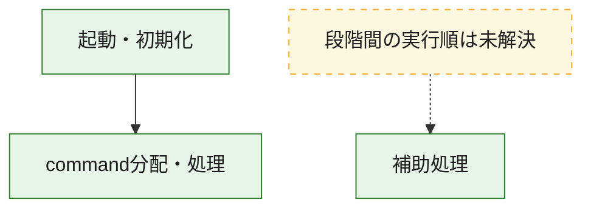
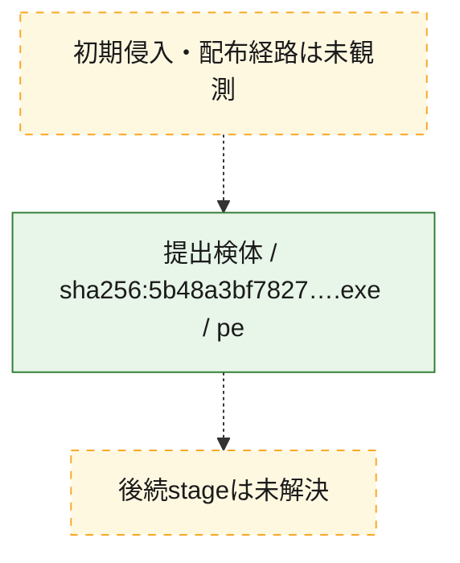
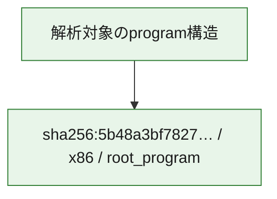

# 全体ロジック：5b48a3bf7827e461849c3b29b96775dc7e5e38766f51d0562ed73d352d082e41

代表関数の静的証跡から、起動・初期化、command分配・処理の処理群を確認しました。

## 読み方

- phaseの掲載順は解析上の整理順です。observed_call_edgesがない段階間の実行順を断定しません。
- 図の実線は静的に観測した関係、点線と黄色のノードは未観測・未解決の関係を示します。
- 図は静的な要約であり、動的実行を再現するものではありません。
- 詳細な関数解説とfingerprintは[STATIC-LOGIC.md](STATIC-LOGIC.md)を参照してください。

## 静的可視化

### 実行フロー

### 感染チェーン

### モジュール関係

## 処理段階

### 1. 起動・初期化

entry pointから初期化と後続処理への移行を確認します。
確度: `confirmed_static_function_evidence`

- `5b48a3bf7827e461849c3b29b96775dc7e5e38766f51d0562ed73d352d082e41:ghidra:14000d7b0` — 初期化と主要処理への分岐を行う入口関数です。 状態: `succeeded`、選定理由: `entry_point`, `meaningful_symbol_name`, `reviewed_call_centrality:22`, `role:entrypoint`

### 2. command分配・処理

受信commandやtaskの解釈、分配、個別handlerへの移行を確認します。
確度: `confirmed_static_function_evidence_with_limits`

- `5b48a3bf7827e461849c3b29b96775dc7e5e38766f51d0562ed73d352d082e41:ghidra:14001a4d0` — commandの解釈、分配、または個別処理を担当する関数です。 状態: `limited_bad_instruction_or_flow`、選定理由: `meaningful_symbol_name`, `reviewed_call_centrality:1`, `role:command_dispatch_or_handler`

### 3. 補助処理

主要処理を支える一般内部関数またはlibrary処理を確認します。
確度: `confirmed_static_function_evidence_with_limits`

- `5b48a3bf7827e461849c3b29b96775dc7e5e38766f51d0562ed73d352d082e41:ghidra:140001000` — 検体内部の一般処理を実装する関数です。 状態: `limited_bad_instruction_or_flow`、選定理由: `context_representative`, `reviewed_call_centrality:4`
- `5b48a3bf7827e461849c3b29b96775dc7e5e38766f51d0562ed73d352d082e41:ghidra:140001070` — 検体内部の一般処理を実装する関数です。 状態: `succeeded`、選定理由: `context_representative`
- `5b48a3bf7827e461849c3b29b96775dc7e5e38766f51d0562ed73d352d082e41:ghidra:1400011d0` — 検体内部の一般処理を実装する関数です。 状態: `succeeded`、選定理由: `context_representative`, `reviewed_call_centrality:6`
- `5b48a3bf7827e461849c3b29b96775dc7e5e38766f51d0562ed73d352d082e41:ghidra:140001440` — 検体内部の一般処理を実装する関数です。 状態: `limited_bad_instruction_or_flow`、選定理由: `context_representative`, `reviewed_call_centrality:7`
- `5b48a3bf7827e461849c3b29b96775dc7e5e38766f51d0562ed73d352d082e41:ghidra:1400014c0` — 検体内部の一般処理を実装する関数です。 状態: `limited_bad_instruction_or_flow`、選定理由: `context_representative`, `reviewed_call_centrality:4`
- `5b48a3bf7827e461849c3b29b96775dc7e5e38766f51d0562ed73d352d082e41:ghidra:140001510` — 検体内部の一般処理を実装する関数です。 状態: `limited_bad_instruction_or_flow`、選定理由: `context_representative`, `reviewed_call_centrality:16`
- `5b48a3bf7827e461849c3b29b96775dc7e5e38766f51d0562ed73d352d082e41:ghidra:140001580` — 検体内部の一般処理を実装する関数です。 状態: `succeeded`、選定理由: `context_representative`, `reviewed_call_centrality:1`
- `5b48a3bf7827e461849c3b29b96775dc7e5e38766f51d0562ed73d352d082e41:ghidra:140001600` — 検体内部の一般処理を実装する関数です。 状態: `succeeded`、選定理由: `context_representative`, `reviewed_call_centrality:2`
- `5b48a3bf7827e461849c3b29b96775dc7e5e38766f51d0562ed73d352d082e41:ghidra:140002ac0` — 検体内部の一般処理を実装する関数です。 状態: `succeeded`、選定理由: `context_representative`, `reviewed_call_centrality:1`
- `5b48a3bf7827e461849c3b29b96775dc7e5e38766f51d0562ed73d352d082e41:ghidra:140002b10` — 検体内部の一般処理を実装する関数です。 状態: `limited_bad_instruction_or_flow`、選定理由: `context_representative`, `reviewed_call_centrality:1`
- `5b48a3bf7827e461849c3b29b96775dc7e5e38766f51d0562ed73d352d082e41:ghidra:1400034a0` — 検体内部の一般処理を実装する関数です。 状態: `succeeded`、選定理由: `context_representative`, `reviewed_call_centrality:7`
- `5b48a3bf7827e461849c3b29b96775dc7e5e38766f51d0562ed73d352d082e41:ghidra:1400035c0` — 検体内部の一般処理を実装する関数です。 状態: `succeeded`、選定理由: `context_representative`, `reviewed_call_centrality:1`
- `5b48a3bf7827e461849c3b29b96775dc7e5e38766f51d0562ed73d352d082e41:ghidra:140003620` — 検体内部の一般処理を実装する関数です。 状態: `limited_bad_instruction_or_flow`、選定理由: `context_representative`, `reviewed_call_centrality:3`
- `5b48a3bf7827e461849c3b29b96775dc7e5e38766f51d0562ed73d352d082e41:ghidra:1400037f0` — 検体内部の一般処理を実装する関数です。 状態: `limited_bad_instruction_or_flow`、選定理由: `context_representative`, `reviewed_call_centrality:1`
- `5b48a3bf7827e461849c3b29b96775dc7e5e38766f51d0562ed73d352d082e41:ghidra:140004020` — 検体内部の一般処理を実装する関数です。 状態: `limited_bad_instruction_or_flow`、選定理由: `context_representative`, `reviewed_call_centrality:5`
- `5b48a3bf7827e461849c3b29b96775dc7e5e38766f51d0562ed73d352d082e41:ghidra:140004080` — 検体内部の一般処理を実装する関数です。 状態: `succeeded`、選定理由: `context_representative`, `reviewed_call_centrality:3`
- `5b48a3bf7827e461849c3b29b96775dc7e5e38766f51d0562ed73d352d082e41:ghidra:1400040e0` — 検体内部の一般処理を実装する関数です。 状態: `limited_bad_instruction_or_flow`、選定理由: `context_representative`, `reviewed_call_centrality:5`
- `5b48a3bf7827e461849c3b29b96775dc7e5e38766f51d0562ed73d352d082e41:ghidra:140007e50` — 検体内部の一般処理を実装する関数です。 状態: `succeeded`、選定理由: `context_representative`, `reviewed_call_centrality:2`
- `5b48a3bf7827e461849c3b29b96775dc7e5e38766f51d0562ed73d352d082e41:ghidra:140007f00` — 検体内部の一般処理を実装する関数です。 状態: `succeeded`、選定理由: `context_representative`
- `5b48a3bf7827e461849c3b29b96775dc7e5e38766f51d0562ed73d352d082e41:ghidra:140007fb0` — 検体内部の一般処理を実装する関数です。 状態: `succeeded`、選定理由: `context_representative`, `reviewed_call_centrality:2`
- `5b48a3bf7827e461849c3b29b96775dc7e5e38766f51d0562ed73d352d082e41:ghidra:140008120` — 検体内部の一般処理を実装する関数です。 状態: `succeeded`、選定理由: `context_representative`, `reviewed_call_centrality:1`
- `5b48a3bf7827e461849c3b29b96775dc7e5e38766f51d0562ed73d352d082e41:ghidra:140008200` — 検体内部の一般処理を実装する関数です。 状態: `succeeded`、選定理由: `context_representative`, `reviewed_call_centrality:1`
- `5b48a3bf7827e461849c3b29b96775dc7e5e38766f51d0562ed73d352d082e41:ghidra:140008280` — 検体内部の一般処理を実装する関数です。 状態: `succeeded`、選定理由: `context_representative`, `reviewed_call_centrality:1`
- `5b48a3bf7827e461849c3b29b96775dc7e5e38766f51d0562ed73d352d082e41:ghidra:1400082e0` — 検体内部の一般処理を実装する関数です。 状態: `succeeded`、選定理由: `context_representative`, `reviewed_call_centrality:2`
- `5b48a3bf7827e461849c3b29b96775dc7e5e38766f51d0562ed73d352d082e41:ghidra:140008480` — 検体内部の一般処理を実装する関数です。 状態: `succeeded`、選定理由: `context_representative`, `reviewed_call_centrality:4`
- `5b48a3bf7827e461849c3b29b96775dc7e5e38766f51d0562ed73d352d082e41:ghidra:140008600` — 検体内部の一般処理を実装する関数です。 状態: `succeeded`、選定理由: `context_representative`, `reviewed_call_centrality:4`
- `5b48a3bf7827e461849c3b29b96775dc7e5e38766f51d0562ed73d352d082e41:ghidra:140008640` — 検体内部の一般処理を実装する関数です。 状態: `succeeded`、選定理由: `context_representative`, `reviewed_call_centrality:1`
- `5b48a3bf7827e461849c3b29b96775dc7e5e38766f51d0562ed73d352d082e41:ghidra:140008ee0` — 検体内部の一般処理を実装する関数です。 状態: `succeeded`、選定理由: `context_representative`, `reviewed_call_centrality:5`
- `5b48a3bf7827e461849c3b29b96775dc7e5e38766f51d0562ed73d352d082e41:ghidra:14000c7a0` — compiler生成処理または汎用library処理とみられる関数です。 状態: `succeeded`、選定理由: `entry_point`, `meaningful_symbol_name`, `reviewed_call_centrality:2`
- `5b48a3bf7827e461849c3b29b96775dc7e5e38766f51d0562ed73d352d082e41:ghidra:14000dde0` — 検体内部の一般処理を実装する関数です。 状態: `succeeded`、選定理由: `meaningful_symbol_name`

## 観測したcall関係

- `5b48a3bf7827e461849c3b29b96775dc7e5e38766f51d0562ed73d352d082e41:ghidra:1400011d0` → `5b48a3bf7827e461849c3b29b96775dc7e5e38766f51d0562ed73d352d082e41:ghidra:140001440` （`support` → `support`）
- `5b48a3bf7827e461849c3b29b96775dc7e5e38766f51d0562ed73d352d082e41:ghidra:1400011d0` → `5b48a3bf7827e461849c3b29b96775dc7e5e38766f51d0562ed73d352d082e41:ghidra:140001510` （`support` → `support`）
- `5b48a3bf7827e461849c3b29b96775dc7e5e38766f51d0562ed73d352d082e41:ghidra:140001580` → `5b48a3bf7827e461849c3b29b96775dc7e5e38766f51d0562ed73d352d082e41:ghidra:140004080` （`support` → `support`）
- `5b48a3bf7827e461849c3b29b96775dc7e5e38766f51d0562ed73d352d082e41:ghidra:14000d7b0` → `5b48a3bf7827e461849c3b29b96775dc7e5e38766f51d0562ed73d352d082e41:ghidra:14001a4d0` （`startup` → `dispatch`）
- `ghidra-function:01e7d8e612d9d78f2dd98db2` → `ghidra-external:53835fa7d0c99d43a1706f8d` （`unclassified` → `unclassified`）
- `ghidra-function:01e7d8e612d9d78f2dd98db2` → `ghidra-function:3b9609e3ae44e1dadfbcc3b6` （`unclassified` → `unclassified`）
- `ghidra-function:01e7d8e612d9d78f2dd98db2` → `ghidra-function:700a5ffdc0bfc2917a10ed55` （`unclassified` → `unclassified`）
- `ghidra-function:01e7d8e612d9d78f2dd98db2` → `ghidra-function:dd2f1a38365246f85fdcbe08` （`unclassified` → `unclassified`）
- `ghidra-function:01e7d8e612d9d78f2dd98db2` → `ghidra-function:eb497e07f7799a9f9c20516e` （`unclassified` → `unclassified`）
- `ghidra-function:11f269939526c6a5e57b1df9` → `ghidra-external:03eb11d1b1c7d1ed327450ab` （`unclassified` → `unclassified`）
- `ghidra-function:11f269939526c6a5e57b1df9` → `ghidra-external:49d17ca6a3a826bb1283fbfb` （`unclassified` → `unclassified`）
- `ghidra-function:11f269939526c6a5e57b1df9` → `ghidra-external:70dff669ceb4ac868b2b7724` （`unclassified` → `unclassified`）
- `ghidra-function:11f269939526c6a5e57b1df9` → `ghidra-external:7d1b74691b88725b8b04c6f6` （`unclassified` → `unclassified`）
- `ghidra-function:11f269939526c6a5e57b1df9` → `ghidra-external:893561a58eebe5f2ec6f109a` （`unclassified` → `unclassified`）
- `ghidra-function:11f269939526c6a5e57b1df9` → `ghidra-external:9247a059cf22ad828ef9c98b` （`unclassified` → `unclassified`）
- `ghidra-function:11f269939526c6a5e57b1df9` → `ghidra-external:b5cc26867be07080bd64e7e8` （`unclassified` → `unclassified`）
- `ghidra-function:21b584458d3e53ca4e362c6b` → `ghidra-external:37305c7d38a8d8d9b7e15665` （`unclassified` → `unclassified`）
- `ghidra-function:21b584458d3e53ca4e362c6b` → `ghidra-external:53835fa7d0c99d43a1706f8d` （`unclassified` → `unclassified`）
- `ghidra-function:303b2f04ae55cfbca1ec571c` → `ghidra-external:53835fa7d0c99d43a1706f8d` （`unclassified` → `unclassified`）
- `ghidra-function:3341674ef2658f78087f4f48` → `ghidra-function:3d3faa69e793caff450ffe0e` （`unclassified` → `unclassified`）
- `ghidra-function:3341674ef2658f78087f4f48` → `ghidra-function:723c84e85f52a69d6c4d133e` （`unclassified` → `unclassified`）
- `ghidra-function:3aea940b37ef5e5ca7dbf6f2` → `ghidra-external:53835fa7d0c99d43a1706f8d` （`unclassified` → `unclassified`）
- `ghidra-function:443e25e69c5dad6f4cea4e7e` → `ghidra-function:3d3faa69e793caff450ffe0e` （`unclassified` → `unclassified`）
- `ghidra-function:443e25e69c5dad6f4cea4e7e` → `ghidra-function:723c84e85f52a69d6c4d133e` （`unclassified` → `unclassified`）
- `ghidra-function:47f97394d694f271eda70ed3` → `ghidra-external:52d8303efe25608170cd20cb` （`unclassified` → `unclassified`）
- `ghidra-function:47f97394d694f271eda70ed3` → `ghidra-external:7e9e8405750b1006419cae9f` （`unclassified` → `unclassified`）
- `ghidra-function:47f97394d694f271eda70ed3` → `ghidra-external:fe9c49e2f1b3bfbdc6d2520a` （`unclassified` → `unclassified`）
- `ghidra-function:47f97394d694f271eda70ed3` → `ghidra-function:591047109b39617c1e16b40c` （`unclassified` → `unclassified`）
- `ghidra-function:492d507aa8fb00675a1b2a55` → `ghidra-external:53835fa7d0c99d43a1706f8d` （`unclassified` → `unclassified`）
- `ghidra-function:492d507aa8fb00675a1b2a55` → `ghidra-external:62b76110e3807ea097b6bf8b` （`unclassified` → `unclassified`）
- `ghidra-function:492d507aa8fb00675a1b2a55` → `ghidra-external:a21a694b763f289e3a1f1b1b` （`unclassified` → `unclassified`）
- `ghidra-function:492d507aa8fb00675a1b2a55` → `ghidra-function:dd2f1a38365246f85fdcbe08` （`unclassified` → `unclassified`）
- `ghidra-function:497586713b2e8700b6ff74aa` → `ghidra-external:53835fa7d0c99d43a1706f8d` （`unclassified` → `unclassified`）
- `ghidra-function:497586713b2e8700b6ff74aa` → `ghidra-function:4bb69749a9f74f7a7e98ec8e` （`unclassified` → `unclassified`）
- `ghidra-function:497586713b2e8700b6ff74aa` → `ghidra-function:fbbcb035fb65e53ca2bb6eaf` （`unclassified` → `unclassified`）
- `ghidra-function:5eb09a119fdb1d055cf37859` → `ghidra-function:556fafd863358177e49d8dfa` （`unclassified` → `unclassified`）
- `ghidra-function:5eb09a119fdb1d055cf37859` → `ghidra-function:c8374e2d9f259ecf6a71fb84` （`unclassified` → `unclassified`）
- `ghidra-function:5eb09a119fdb1d055cf37859` → `ghidra-function:d3cf2bc3376e527281af3a58` （`unclassified` → `unclassified`）
- `ghidra-function:685cfc4e6afbe33e65ccd967` → `ghidra-external:53835fa7d0c99d43a1706f8d` （`unclassified` → `unclassified`）
- `ghidra-function:685cfc4e6afbe33e65ccd967` → `ghidra-function:6cc593c22b9200f6d1b10e30` （`unclassified` → `unclassified`）
- `ghidra-function:700a5ffdc0bfc2917a10ed55` → `ghidra-external:001794e139473d83e1a75488` （`unclassified` → `unclassified`）
- `ghidra-function:700a5ffdc0bfc2917a10ed55` → `ghidra-external:1cc89d802177059cf98beceb` （`unclassified` → `unclassified`）
- `ghidra-function:700a5ffdc0bfc2917a10ed55` → `ghidra-external:4b99367def828f736da1cb1c` （`unclassified` → `unclassified`）
- `ghidra-function:700a5ffdc0bfc2917a10ed55` → `ghidra-external:53835fa7d0c99d43a1706f8d` （`unclassified` → `unclassified`）
- `ghidra-function:700a5ffdc0bfc2917a10ed55` → `ghidra-external:62b76110e3807ea097b6bf8b` （`unclassified` → `unclassified`）
- `ghidra-function:700a5ffdc0bfc2917a10ed55` → `ghidra-external:a21a694b763f289e3a1f1b1b` （`unclassified` → `unclassified`）
- `ghidra-function:700a5ffdc0bfc2917a10ed55` → `ghidra-external:a8853d238b063ba71368eef4` （`unclassified` → `unclassified`）
- `ghidra-function:700a5ffdc0bfc2917a10ed55` → `ghidra-external:ab51f820b6ee2ed22c061e74` （`unclassified` → `unclassified`）
- `ghidra-function:700a5ffdc0bfc2917a10ed55` → `ghidra-external:ad69ee4366cbd917d836e090` （`unclassified` → `unclassified`）
- `ghidra-function:700a5ffdc0bfc2917a10ed55` → `ghidra-external:b05df35cd6def33ac78be24c` （`unclassified` → `unclassified`）
- `ghidra-function:700a5ffdc0bfc2917a10ed55` → `ghidra-external:ec067f7f1c59e0572eb2fa51` （`unclassified` → `unclassified`）
- `ghidra-function:700a5ffdc0bfc2917a10ed55` → `ghidra-external:fb17e17a79493e824bdb72b8` （`unclassified` → `unclassified`）
- `ghidra-function:700a5ffdc0bfc2917a10ed55` → `ghidra-function:7445c066a5954432ee375087` （`unclassified` → `unclassified`）
- `ghidra-function:700a5ffdc0bfc2917a10ed55` → `ghidra-function:dd2f1a38365246f85fdcbe08` （`unclassified` → `unclassified`）
- `ghidra-function:78f86c6fce3e9d1dea792b5e` → `ghidra-external:2f8fc669a476c517f62c3e84` （`unclassified` → `unclassified`）
- `ghidra-function:78f86c6fce3e9d1dea792b5e` → `ghidra-external:378dcde5ccecc44f94678f4e` （`unclassified` → `unclassified`）
- `ghidra-function:78f86c6fce3e9d1dea792b5e` → `ghidra-external:485570a4edbc54aa9f2f886b` （`unclassified` → `unclassified`）
- `ghidra-function:78f86c6fce3e9d1dea792b5e` → `ghidra-external:4e92ea1c8e192eb0ed4a276f` （`unclassified` → `unclassified`）
- `ghidra-function:78f86c6fce3e9d1dea792b5e` → `ghidra-external:51f13e7ecc0ba5db3e4c54f4` （`unclassified` → `unclassified`）
- `ghidra-function:78f86c6fce3e9d1dea792b5e` → `ghidra-external:5b07fc60f65a39b81802dad9` （`unclassified` → `unclassified`）
- `ghidra-function:78f86c6fce3e9d1dea792b5e` → `ghidra-external:70d8802752bfef7aae35743a` （`unclassified` → `unclassified`）
- `ghidra-function:78f86c6fce3e9d1dea792b5e` → `ghidra-external:a8853d238b063ba71368eef4` （`unclassified` → `unclassified`）
- `ghidra-function:78f86c6fce3e9d1dea792b5e` → `ghidra-external:eb911cf8c1e076fca82ba77a` （`unclassified` → `unclassified`）
- `ghidra-function:78f86c6fce3e9d1dea792b5e` → `ghidra-function:04d8950f8bcf0e6849ee47ba` （`unclassified` → `unclassified`）
- `ghidra-function:78f86c6fce3e9d1dea792b5e` → `ghidra-function:237263e1e6a34efb1b21b344` （`unclassified` → `unclassified`）
- `ghidra-function:78f86c6fce3e9d1dea792b5e` → `ghidra-function:3cf663cb2c84419fae7fbbf2` （`unclassified` → `unclassified`）
- `ghidra-function:78f86c6fce3e9d1dea792b5e` → `ghidra-function:724b10074c19da59e8f5a6c3` （`unclassified` → `unclassified`）
- `ghidra-function:78f86c6fce3e9d1dea792b5e` → `ghidra-function:75cb6378a61f2f3685c980a3` （`unclassified` → `unclassified`）
- `ghidra-function:78f86c6fce3e9d1dea792b5e` → `ghidra-function:79a78fc36de61dadd2125654` （`unclassified` → `unclassified`）
- `ghidra-function:78f86c6fce3e9d1dea792b5e` → `ghidra-function:7f51a45a94abbd0b0602c749` （`unclassified` → `unclassified`）
- `ghidra-function:78f86c6fce3e9d1dea792b5e` → `ghidra-function:819f57ced43007dd4b3ef727` （`unclassified` → `unclassified`）
- `ghidra-function:78f86c6fce3e9d1dea792b5e` → `ghidra-function:8c0234c5ef44843e7388bb0e` （`unclassified` → `unclassified`）
- `ghidra-function:78f86c6fce3e9d1dea792b5e` → `ghidra-function:a671b3a4d54f193926d8c571` （`unclassified` → `unclassified`）
- `ghidra-function:78f86c6fce3e9d1dea792b5e` → `ghidra-function:d35ce2ff08e6bb8da8231c9d` （`unclassified` → `unclassified`）
- `ghidra-function:78f86c6fce3e9d1dea792b5e` → `ghidra-function:f15f22abc827cf7aaa7bf86d` （`unclassified` → `unclassified`）
- `ghidra-function:78f86c6fce3e9d1dea792b5e` → `ghidra-function:fb0e516dedcadf0310e99029` （`unclassified` → `unclassified`）
- `ghidra-function:7e3813d7ca76f156df20e6ba` → `ghidra-external:723ddba8341798aef9d11260` （`unclassified` → `unclassified`）
- `ghidra-function:7e3813d7ca76f156df20e6ba` → `ghidra-function:723c84e85f52a69d6c4d133e` （`unclassified` → `unclassified`）
- `ghidra-function:841ce13375508410f4405950` → `ghidra-function:bd67702c2543bb3bf851f40a` （`unclassified` → `unclassified`）
- `ghidra-function:841ce13375508410f4405950` → `ghidra-function:ff3315ee4d799f3a2556cb1a` （`unclassified` → `unclassified`）
- `ghidra-function:85a7ec2ae7701cd3bc37d360` → `ghidra-function:2104de96e9eeae71ce1d2833` （`unclassified` → `unclassified`）
- `ghidra-function:8a4c1141bfed2802fadc1edb` → `ghidra-external:53835fa7d0c99d43a1706f8d` （`unclassified` → `unclassified`）
- `ghidra-function:8a4c1141bfed2802fadc1edb` → `ghidra-function:7445c066a5954432ee375087` （`unclassified` → `unclassified`）
- `ghidra-function:921c3bdd10835a385b62c30a` → `ghidra-function:2104de96e9eeae71ce1d2833` （`unclassified` → `unclassified`）
- `ghidra-function:921c3bdd10835a385b62c30a` → `ghidra-function:fcd45ff224e34c53a773a83f` （`unclassified` → `unclassified`）
- `ghidra-function:a89877b59c58429a7b77263c` → `ghidra-function:0cf184cd7a8aa9d37d56f1f7` （`unclassified` → `unclassified`）
- `ghidra-function:b5b161c40e4b974c430a45b2` → `ghidra-external:53835fa7d0c99d43a1706f8d` （`unclassified` → `unclassified`）
- `ghidra-function:b7935e1fb70b78706cc4f208` → `ghidra-external:53835fa7d0c99d43a1706f8d` （`unclassified` → `unclassified`）
- `ghidra-function:d3204c8a571ea82ea792f1a7` → `ghidra-external:341ce54479f72fb27693d32e` （`unclassified` → `unclassified`）
- `ghidra-function:e07608a082363c5012fd9a18` → `ghidra-external:bb928cf18a54939de46c844b` （`unclassified` → `unclassified`）
- `ghidra-function:e874063c839b5cc934fecadc` → `ghidra-external:53835fa7d0c99d43a1706f8d` （`unclassified` → `unclassified`）
- `ghidra-function:e874063c839b5cc934fecadc` → `ghidra-external:9ca4c4da0e9979a252cd19ae` （`unclassified` → `unclassified`）
- `ghidra-function:eb497e07f7799a9f9c20516e` → `ghidra-external:001794e139473d83e1a75488` （`unclassified` → `unclassified`）
- `ghidra-function:eb497e07f7799a9f9c20516e` → `ghidra-function:5921be38218c1436851dbe50` （`unclassified` → `unclassified`）
- `ghidra-function:eb497e07f7799a9f9c20516e` → `ghidra-function:6cc593c22b9200f6d1b10e30` （`unclassified` → `unclassified`）
- `ghidra-function:eb497e07f7799a9f9c20516e` → `ghidra-function:d3cf2bc3376e527281af3a58` （`unclassified` → `unclassified`）
- `ghidra-function:f65c1f3d79142d6f99039a4d` → `ghidra-function:8a4c1141bfed2802fadc1edb` （`unclassified` → `unclassified`）
- `ghidra-function:f79356584e9a0bacf0e7b038` → `ghidra-external:53835fa7d0c99d43a1706f8d` （`unclassified` → `unclassified`）
- `ghidra-function:f79356584e9a0bacf0e7b038` → `ghidra-external:93d53a05b6ad0d83b640977d` （`unclassified` → `unclassified`）

## 解析範囲と制約

- 選定外関数は全体inventoryへ残しますが、関数本体の個別解説対象にはしていません。
- indirect call、難読化、packer、VM、壊れたcontrol flowによりcall関係が欠落する場合があります。
- 文書は静的解析に基づき、検体実行や外部通信による動的確認は行っていません。
