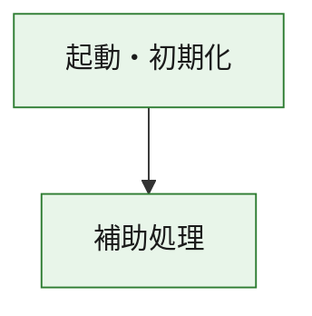
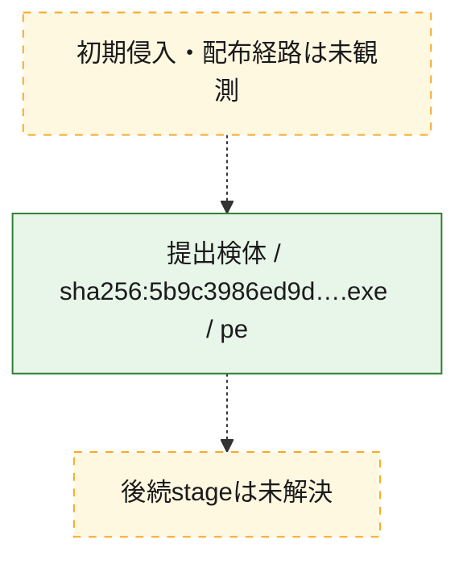
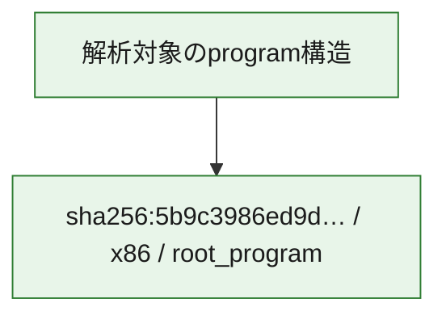

# 全体ロジック：5b9c3986ed9d1345a0b669f0eddc3bc645c958516e44280cde8d1a30ad84bf76

代表関数の静的証跡から、起動・初期化の処理群を確認しました。

## 読み方

- phaseの掲載順は解析上の整理順です。observed_call_edgesがない段階間の実行順を断定しません。
- 図の実線は静的に観測した関係、点線と黄色のノードは未観測・未解決の関係を示します。
- 図は静的な要約であり、動的実行を再現するものではありません。
- 詳細な関数解説とfingerprintは[STATIC-LOGIC.md](STATIC-LOGIC.md)を参照してください。

## 静的可視化

### 実行フロー

### 感染チェーン

### モジュール関係

## 処理段階

### 1. 起動・初期化

entry pointから初期化と後続処理への移行を確認します。
確度: `confirmed_static_function_evidence`

- `5b9c3986ed9d1345a0b669f0eddc3bc645c958516e44280cde8d1a30ad84bf76:ghidra:180001010` — 初期化と主要処理への分岐を行う入口関数です。 状態: `succeeded`、選定理由: `entry_point`, `meaningful_symbol_name`, `reviewed_call_centrality:22`, `role:entrypoint`, `small_program_complete_context`

### 2. 補助処理

主要処理を支える一般内部関数またはlibrary処理を確認します。
確度: `confirmed_static_function_evidence`

- `5b9c3986ed9d1345a0b669f0eddc3bc645c958516e44280cde8d1a30ad84bf76:ghidra:180001240` — 検体内部の一般処理を実装する関数です。 状態: `succeeded`、選定理由: `context_representative`, `reviewed_call_centrality:2`, `small_program_complete_context`
- `5b9c3986ed9d1345a0b669f0eddc3bc645c958516e44280cde8d1a30ad84bf76:ghidra:180001350` — 検体内部の一般処理を実装する関数です。 状態: `succeeded`、選定理由: `context_representative`, `reviewed_call_centrality:25`, `small_program_complete_context`
- `5b9c3986ed9d1345a0b669f0eddc3bc645c958516e44280cde8d1a30ad84bf76:ghidra:180003780` — 検体内部の一般処理を実装する関数です。 状態: `succeeded`、選定理由: `context_representative`, `reviewed_call_centrality:2`, `small_program_complete_context`
- `5b9c3986ed9d1345a0b669f0eddc3bc645c958516e44280cde8d1a30ad84bf76:ghidra:1800038e0` — 検体内部の一般処理を実装する関数です。 状態: `succeeded`、選定理由: `context_representative`, `reviewed_call_centrality:2`, `small_program_complete_context`

## 観測したcall関係

- `5b9c3986ed9d1345a0b669f0eddc3bc645c958516e44280cde8d1a30ad84bf76:ghidra:180001010` → `5b9c3986ed9d1345a0b669f0eddc3bc645c958516e44280cde8d1a30ad84bf76:ghidra:180001240` （`startup` → `support`）
- `5b9c3986ed9d1345a0b669f0eddc3bc645c958516e44280cde8d1a30ad84bf76:ghidra:180001010` → `5b9c3986ed9d1345a0b669f0eddc3bc645c958516e44280cde8d1a30ad84bf76:ghidra:180001350` （`startup` → `support`）
- `5b9c3986ed9d1345a0b669f0eddc3bc645c958516e44280cde8d1a30ad84bf76:ghidra:180001350` → `5b9c3986ed9d1345a0b669f0eddc3bc645c958516e44280cde8d1a30ad84bf76:ghidra:180001240` （`support` → `support`）
- `5b9c3986ed9d1345a0b669f0eddc3bc645c958516e44280cde8d1a30ad84bf76:ghidra:180001350` → `5b9c3986ed9d1345a0b669f0eddc3bc645c958516e44280cde8d1a30ad84bf76:ghidra:180003780` （`support` → `support`）
- `5b9c3986ed9d1345a0b669f0eddc3bc645c958516e44280cde8d1a30ad84bf76:ghidra:180001350` → `5b9c3986ed9d1345a0b669f0eddc3bc645c958516e44280cde8d1a30ad84bf76:ghidra:1800038e0` （`support` → `support`）
- `5b9c3986ed9d1345a0b669f0eddc3bc645c958516e44280cde8d1a30ad84bf76:ghidra:180003780` → `5b9c3986ed9d1345a0b669f0eddc3bc645c958516e44280cde8d1a30ad84bf76:ghidra:1800038e0` （`support` → `support`）
- `ghidra-function:9a5e64a32b1fcc9b45055488` → `ghidra-function:10ada3113369a40718b493aa` （`unclassified` → `unclassified`）
- `ghidra-function:9a5e64a32b1fcc9b45055488` → `ghidra-function:530ec4ecc1d178c0cee08020` （`unclassified` → `unclassified`）
- `ghidra-function:9a5e64a32b1fcc9b45055488` → `ghidra-function:7beb44fd6d92047eef0f6cd9` （`unclassified` → `unclassified`）
- `ghidra-function:9a5e64a32b1fcc9b45055488` → `ghidra-function:8a24c725f3696899a2693ee5` （`unclassified` → `unclassified`）
- `ghidra-function:9a5e64a32b1fcc9b45055488` → `ghidra-function:8fc78a20d1b5e9a70f5284bb` （`unclassified` → `unclassified`）
- `ghidra-function:9a5e64a32b1fcc9b45055488` → `ghidra-function:a1bd02b56fc3d0c77dfd8bae` （`unclassified` → `unclassified`）
- `ghidra-function:9a5e64a32b1fcc9b45055488` → `ghidra-function:a977ce3faf6c8867d731fdd3` （`unclassified` → `unclassified`）
- `ghidra-function:9a5e64a32b1fcc9b45055488` → `ghidra-function:aa1f176863d9d25278a1a31d` （`unclassified` → `unclassified`）
- `ghidra-function:9a5e64a32b1fcc9b45055488` → `ghidra-function:ab8f6f2de8d34e9adc62a0f8` （`unclassified` → `unclassified`）
- `ghidra-function:9a5e64a32b1fcc9b45055488` → `ghidra-function:c5a6ca3864d0a84b658dbbd5` （`unclassified` → `unclassified`）
- `ghidra-function:9a5e64a32b1fcc9b45055488` → `ghidra-function:cd73622b9f417d186f2a8033` （`unclassified` → `unclassified`）
- `ghidra-function:9a5e64a32b1fcc9b45055488` → `ghidra-function:e193b56f932ca57de59d240b` （`unclassified` → `unclassified`）
- `ghidra-function:a977ce3faf6c8867d731fdd3` → `ghidra-external:08409a23d7b61d46da9a0e47` （`unclassified` → `unclassified`）
- `ghidra-function:a977ce3faf6c8867d731fdd3` → `ghidra-external:3d5c409648593dee36692241` （`unclassified` → `unclassified`）
- `ghidra-function:a977ce3faf6c8867d731fdd3` → `ghidra-external:4c0e6751ebff16870772207e` （`unclassified` → `unclassified`）
- `ghidra-function:a977ce3faf6c8867d731fdd3` → `ghidra-external:69f15bba8e88d9d95d51a90b` （`unclassified` → `unclassified`）
- `ghidra-function:a977ce3faf6c8867d731fdd3` → `ghidra-external:835f317c79b178e9252b73f0` （`unclassified` → `unclassified`）
- `ghidra-function:a977ce3faf6c8867d731fdd3` → `ghidra-external:844d4ffb0d310ab3b986fa9f` （`unclassified` → `unclassified`）
- `ghidra-function:a977ce3faf6c8867d731fdd3` → `ghidra-external:96d30d6797b5b4b2734c37fe` （`unclassified` → `unclassified`）
- `ghidra-function:a977ce3faf6c8867d731fdd3` → `ghidra-external:9d4efe3b5a2fb8ba824a4ab0` （`unclassified` → `unclassified`）
- `ghidra-function:a977ce3faf6c8867d731fdd3` → `ghidra-external:9ee559abd04f370bc2122019` （`unclassified` → `unclassified`）
- `ghidra-function:a977ce3faf6c8867d731fdd3` → `ghidra-external:ae1f0614e7e31f294bb879e2` （`unclassified` → `unclassified`）
- `ghidra-function:a977ce3faf6c8867d731fdd3` → `ghidra-external:b3748230b8ac4ec7ea6ed8fe` （`unclassified` → `unclassified`）
- `ghidra-function:a977ce3faf6c8867d731fdd3` → `ghidra-external:b735b52f87551c1f0bfb218d` （`unclassified` → `unclassified`）
- `ghidra-function:a977ce3faf6c8867d731fdd3` → `ghidra-external:bbb1b84e28950aa6c550e7f6` （`unclassified` → `unclassified`）
- `ghidra-function:a977ce3faf6c8867d731fdd3` → `ghidra-external:beead6d40bca87b0cf0398bd` （`unclassified` → `unclassified`）
- `ghidra-function:a977ce3faf6c8867d731fdd3` → `ghidra-external:c0e3a1609bf2c8055951fb55` （`unclassified` → `unclassified`）
- `ghidra-function:a977ce3faf6c8867d731fdd3` → `ghidra-external:c6fcbc585251704ff622794e` （`unclassified` → `unclassified`）
- `ghidra-function:a977ce3faf6c8867d731fdd3` → `ghidra-external:e3910d3b946ce5495d437c90` （`unclassified` → `unclassified`）
- `ghidra-function:a977ce3faf6c8867d731fdd3` → `ghidra-external:e604521021bc3c52d299ec23` （`unclassified` → `unclassified`）
- `ghidra-function:a977ce3faf6c8867d731fdd3` → `ghidra-external:e64c7ba33f80578669820deb` （`unclassified` → `unclassified`）
- `ghidra-function:a977ce3faf6c8867d731fdd3` → `ghidra-external:fa7c603929f5e4b3176c758c` （`unclassified` → `unclassified`）
- `ghidra-function:a977ce3faf6c8867d731fdd3` → `ghidra-external:faaf1260a6bc5a9ce094384c` （`unclassified` → `unclassified`）
- `ghidra-function:a977ce3faf6c8867d731fdd3` → `ghidra-function:8fc78a20d1b5e9a70f5284bb` （`unclassified` → `unclassified`）
- `ghidra-function:a977ce3faf6c8867d731fdd3` → `ghidra-function:b92c5c03808e632ab11fbf28` （`unclassified` → `unclassified`）
- `ghidra-function:a977ce3faf6c8867d731fdd3` → `ghidra-function:d8966d24030732f20cc39920` （`unclassified` → `unclassified`）
- `ghidra-function:b92c5c03808e632ab11fbf28` → `ghidra-function:d8966d24030732f20cc39920` （`unclassified` → `unclassified`）

## 解析範囲と制約

- 選定外関数は全体inventoryへ残しますが、関数本体の個別解説対象にはしていません。
- indirect call、難読化、packer、VM、壊れたcontrol flowによりcall関係が欠落する場合があります。
- 文書は静的解析に基づき、検体実行や外部通信による動的確認は行っていません。
