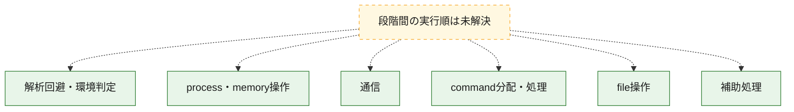
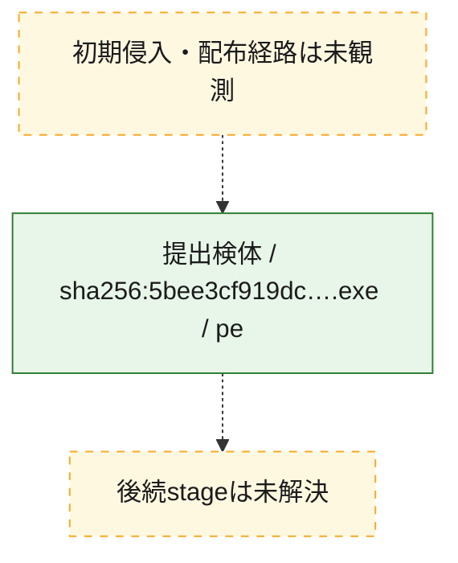
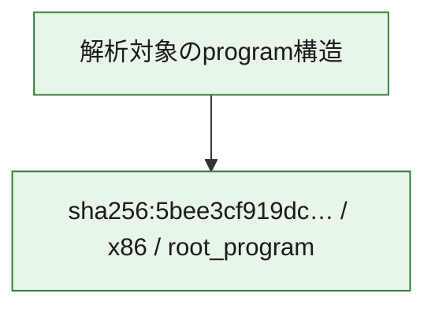

# 全体ロジック：5bee3cf919dc5bb90de4be716a5e035b05803c1618795382546a735629c79e2e

代表関数の静的証跡から、解析回避・環境判定、process・memory操作、通信、command分配・処理、file操作の処理群を確認しました。

## 読み方

- phaseの掲載順は解析上の整理順です。observed_call_edgesがない段階間の実行順を断定しません。
- 図の実線は静的に観測した関係、点線と黄色のノードは未観測・未解決の関係を示します。
- 図は静的な要約であり、動的実行を再現するものではありません。
- 詳細な関数解説とfingerprintは[STATIC-LOGIC.md](STATIC-LOGIC.md)を参照してください。

## 静的可視化

### 実行フロー

### 感染チェーン

### モジュール関係

## 処理段階

### 1. 解析回避・環境判定

debugger、sandbox、仮想環境、時間差などの判定を確認します。
確度: `confirmed_static_function_evidence`

- `5bee3cf919dc5bb90de4be716a5e035b05803c1618795382546a735629c79e2e:ghidra:140001380` — debugger、仮想環境、sandbox、または時間差の確認に関係する関数です。 状態: `succeeded`、選定理由: `context_representative`, `reviewed_call_centrality:4`, `role:anti_analysis`

### 2. process・memory操作

process、thread、module、memory操作と実行移行を確認します。
確度: `confirmed_static_function_evidence`

- `5bee3cf919dc5bb90de4be716a5e035b05803c1618795382546a735629c79e2e:ghidra:140001000` — process、thread、module、またはmemory操作に関係する関数です。 状態: `succeeded`、選定理由: `context_representative`, `reviewed_call_centrality:11`, `role:process_or_memory_operation`
- `5bee3cf919dc5bb90de4be716a5e035b05803c1618795382546a735629c79e2e:ghidra:140001b04` — process、thread、module、またはmemory操作に関係する関数です。 状態: `succeeded`、選定理由: `context_representative`, `reviewed_call_centrality:13`, `role:process_or_memory_operation`

### 3. 通信

通信初期化、endpoint処理、送受信の役割を確認します。
確度: `confirmed_static_function_evidence`

- `5bee3cf919dc5bb90de4be716a5e035b05803c1618795382546a735629c79e2e:ghidra:140001154` — 通信初期化、送受信、またはendpoint処理に関係する関数です。 状態: `succeeded`、選定理由: `context_representative`, `reviewed_call_centrality:2`, `role:network_communication`
- `5bee3cf919dc5bb90de4be716a5e035b05803c1618795382546a735629c79e2e:ghidra:140001240` — 通信初期化、送受信、またはendpoint処理に関係する関数です。 状態: `succeeded`、選定理由: `context_representative`, `reviewed_call_centrality:6`, `role:network_communication`

### 4. command分配・処理

受信commandやtaskの解釈、分配、個別handlerへの移行を確認します。
確度: `confirmed_static_function_evidence`

- `5bee3cf919dc5bb90de4be716a5e035b05803c1618795382546a735629c79e2e:ghidra:140001120` — commandの解釈、分配、または個別処理を担当する関数です。 状態: `succeeded`、選定理由: `context_representative`, `reviewed_call_centrality:2`, `role:command_dispatch_or_handler`

### 5. file操作

fileやdirectoryの作成、読書き、削除を確認します。
確度: `confirmed_static_function_evidence`

- `5bee3cf919dc5bb90de4be716a5e035b05803c1618795382546a735629c79e2e:ghidra:1400012cc` — fileまたはdirectoryの読書き・管理に関係する関数です。 状態: `succeeded`、選定理由: `context_representative`, `reviewed_call_centrality:3`, `role:file_operation`
- `5bee3cf919dc5bb90de4be716a5e035b05803c1618795382546a735629c79e2e:ghidra:140001eac` — fileまたはdirectoryの読書き・管理に関係する関数です。 状態: `succeeded`、選定理由: `context_representative`, `reviewed_call_centrality:18`, `role:file_operation`
- `5bee3cf919dc5bb90de4be716a5e035b05803c1618795382546a735629c79e2e:ghidra:140002348` — fileまたはdirectoryの読書き・管理に関係する関数です。 状態: `succeeded`、選定理由: `context_representative`, `reviewed_call_centrality:8`, `role:file_operation`
- `5bee3cf919dc5bb90de4be716a5e035b05803c1618795382546a735629c79e2e:ghidra:14000239c` — fileまたはdirectoryの読書き・管理に関係する関数です。 状態: `succeeded`、選定理由: `context_representative`, `reviewed_call_centrality:4`, `role:file_operation`

### 6. 補助処理

主要処理を支える一般内部関数またはlibrary処理を確認します。
確度: `confirmed_static_function_evidence_with_limits`

- `5bee3cf919dc5bb90de4be716a5e035b05803c1618795382546a735629c79e2e:ghidra:1400010ec` — 検体内部の一般処理を実装する関数です。 状態: `succeeded`、選定理由: `context_representative`, `reviewed_call_centrality:1`
- `5bee3cf919dc5bb90de4be716a5e035b05803c1618795382546a735629c79e2e:ghidra:140001100` — 検体内部の一般処理を実装する関数です。 状態: `succeeded`、選定理由: `context_representative`, `reviewed_call_centrality:2`
- `5bee3cf919dc5bb90de4be716a5e035b05803c1618795382546a735629c79e2e:ghidra:1400011b4` — 検体内部の一般処理を実装する関数です。 状態: `succeeded`、選定理由: `context_representative`, `reviewed_call_centrality:11`
- `5bee3cf919dc5bb90de4be716a5e035b05803c1618795382546a735629c79e2e:ghidra:140001330` — 検体内部の一般処理を実装する関数です。 状態: `limited_bad_instruction_or_flow`、選定理由: `context_representative`, `reviewed_call_centrality:3`
- `5bee3cf919dc5bb90de4be716a5e035b05803c1618795382546a735629c79e2e:ghidra:1400013f8` — 検体内部の一般処理を実装する関数です。 状態: `succeeded`、選定理由: `context_representative`, `reviewed_call_centrality:1`
- `5bee3cf919dc5bb90de4be716a5e035b05803c1618795382546a735629c79e2e:ghidra:140001420` — 検体内部の一般処理を実装する関数です。 状態: `succeeded`、選定理由: `context_representative`, `reviewed_call_centrality:1`
- `5bee3cf919dc5bb90de4be716a5e035b05803c1618795382546a735629c79e2e:ghidra:1400014a0` — 検体内部の一般処理を実装する関数です。 状態: `succeeded`、選定理由: `context_representative`, `reviewed_call_centrality:4`
- `5bee3cf919dc5bb90de4be716a5e035b05803c1618795382546a735629c79e2e:ghidra:14000150c` — 検体内部の一般処理を実装する関数です。 状態: `succeeded`、選定理由: `context_representative`, `reviewed_call_centrality:2`
- `5bee3cf919dc5bb90de4be716a5e035b05803c1618795382546a735629c79e2e:ghidra:1400015b0` — 検体内部の一般処理を実装する関数です。 状態: `succeeded`、選定理由: `context_representative`, `reviewed_call_centrality:2`
- `5bee3cf919dc5bb90de4be716a5e035b05803c1618795382546a735629c79e2e:ghidra:1400015f0` — 検体内部の一般処理を実装する関数です。 状態: `succeeded`、選定理由: `context_representative`, `reviewed_call_centrality:9`
- `5bee3cf919dc5bb90de4be716a5e035b05803c1618795382546a735629c79e2e:ghidra:1400016bc` — 検体内部の一般処理を実装する関数です。 状態: `succeeded`、選定理由: `context_representative`, `reviewed_call_centrality:3`
- `5bee3cf919dc5bb90de4be716a5e035b05803c1618795382546a735629c79e2e:ghidra:140001700` — 検体内部の一般処理を実装する関数です。 状態: `succeeded`、選定理由: `context_representative`, `reviewed_call_centrality:5`
- `5bee3cf919dc5bb90de4be716a5e035b05803c1618795382546a735629c79e2e:ghidra:140001874` — 検体内部の一般処理を実装する関数です。 状態: `succeeded`、選定理由: `context_representative`, `reviewed_call_centrality:2`
- `5bee3cf919dc5bb90de4be716a5e035b05803c1618795382546a735629c79e2e:ghidra:1400018e8` — 検体内部の一般処理を実装する関数です。 状態: `succeeded`、選定理由: `context_representative`, `reviewed_call_centrality:2`
- `5bee3cf919dc5bb90de4be716a5e035b05803c1618795382546a735629c79e2e:ghidra:140001974` — 検体内部の一般処理を実装する関数です。 状態: `succeeded`、選定理由: `context_representative`, `reviewed_call_centrality:3`
- `5bee3cf919dc5bb90de4be716a5e035b05803c1618795382546a735629c79e2e:ghidra:1400019e0` — 検体内部の一般処理を実装する関数です。 状態: `succeeded`、選定理由: `context_representative`, `reviewed_call_centrality:1`
- `5bee3cf919dc5bb90de4be716a5e035b05803c1618795382546a735629c79e2e:ghidra:140001a34` — 検体内部の一般処理を実装する関数です。 状態: `succeeded`、選定理由: `context_representative`, `reviewed_call_centrality:1`
- `5bee3cf919dc5bb90de4be716a5e035b05803c1618795382546a735629c79e2e:ghidra:140001aa4` — 検体内部の一般処理を実装する関数です。 状態: `succeeded`、選定理由: `context_representative`
- `5bee3cf919dc5bb90de4be716a5e035b05803c1618795382546a735629c79e2e:ghidra:140001ac4` — 検体内部の一般処理を実装する関数です。 状態: `succeeded`、選定理由: `context_representative`, `reviewed_call_centrality:2`
- `5bee3cf919dc5bb90de4be716a5e035b05803c1618795382546a735629c79e2e:ghidra:140001c94` — 検体内部の一般処理を実装する関数です。 状態: `succeeded`、選定理由: `context_representative`, `reviewed_call_centrality:3`
- `5bee3cf919dc5bb90de4be716a5e035b05803c1618795382546a735629c79e2e:ghidra:140001cf0` — 検体内部の一般処理を実装する関数です。 状態: `succeeded`、選定理由: `context_representative`, `reviewed_call_centrality:7`
- `5bee3cf919dc5bb90de4be716a5e035b05803c1618795382546a735629c79e2e:ghidra:140002414` — 検体内部の一般処理を実装する関数です。 状態: `succeeded`、選定理由: `context_representative`, `reviewed_call_centrality:1`

## 観測したcall関係

- 代表関数間で直接解決できた呼出関係はありません。

## 解析範囲と制約

- 選定外関数は全体inventoryへ残しますが、関数本体の個別解説対象にはしていません。
- indirect call、難読化、packer、VM、壊れたcontrol flowによりcall関係が欠落する場合があります。
- 文書は静的解析に基づき、検体実行や外部通信による動的確認は行っていません。
