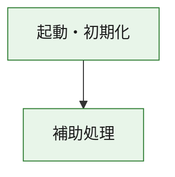
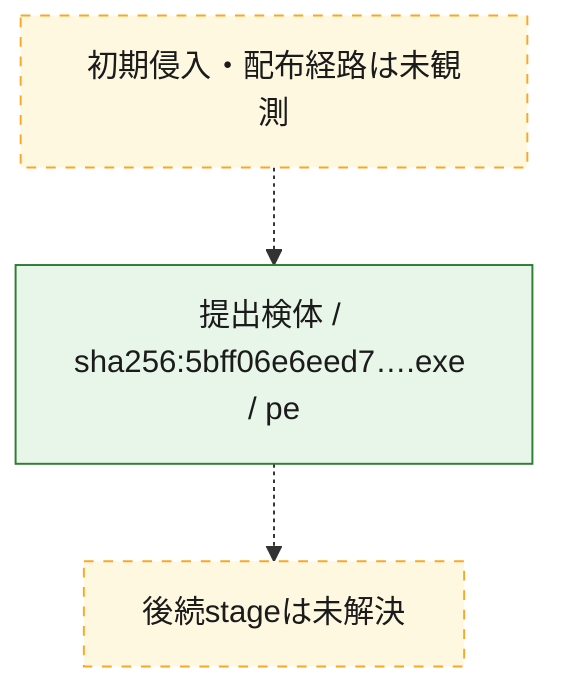
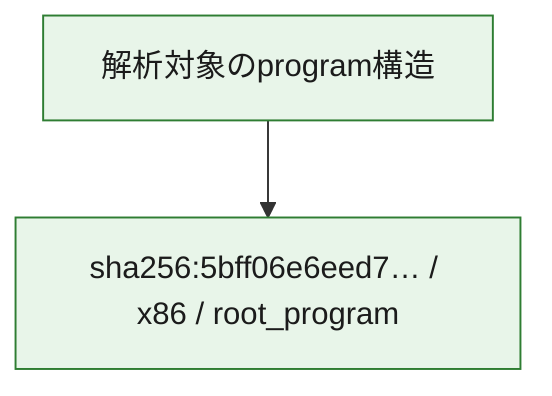

# 全体ロジック：5bff06e6eed77c234a3de1a4bd410cc3b81c38ed784ead1ab0c76cdf2753785f

代表関数の静的証跡から、起動・初期化の処理群を確認しました。

## 読み方

- phaseの掲載順は解析上の整理順です。observed_call_edgesがない段階間の実行順を断定しません。
- 図の実線は静的に観測した関係、点線と黄色のノードは未観測・未解決の関係を示します。
- 図は静的な要約であり、動的実行を再現するものではありません。
- 詳細な関数解説とfingerprintは[STATIC-LOGIC.md](STATIC-LOGIC.md)を参照してください。

## 静的可視化

### 実行フロー

### 感染チェーン

### モジュール関係

## 処理段階

### 1. 起動・初期化

entry pointから初期化と後続処理への移行を確認します。
確度: `confirmed_static_function_evidence`

- `5bff06e6eed77c234a3de1a4bd410cc3b81c38ed784ead1ab0c76cdf2753785f:ghidra:180001010` — 初期化と主要処理への分岐を行う入口関数です。 状態: `succeeded`、選定理由: `entry_point`, `meaningful_symbol_name`, `reviewed_call_centrality:22`, `role:entrypoint`, `small_program_complete_context`

### 2. 補助処理

主要処理を支える一般内部関数またはlibrary処理を確認します。
確度: `confirmed_static_function_evidence`

- `5bff06e6eed77c234a3de1a4bd410cc3b81c38ed784ead1ab0c76cdf2753785f:ghidra:180001240` — 検体内部の一般処理を実装する関数です。 状態: `succeeded`、選定理由: `context_representative`, `reviewed_call_centrality:2`, `small_program_complete_context`
- `5bff06e6eed77c234a3de1a4bd410cc3b81c38ed784ead1ab0c76cdf2753785f:ghidra:180001350` — 検体内部の一般処理を実装する関数です。 状態: `succeeded`、選定理由: `context_representative`, `reviewed_call_centrality:25`, `small_program_complete_context`
- `5bff06e6eed77c234a3de1a4bd410cc3b81c38ed784ead1ab0c76cdf2753785f:ghidra:180003780` — 検体内部の一般処理を実装する関数です。 状態: `succeeded`、選定理由: `context_representative`, `reviewed_call_centrality:2`, `small_program_complete_context`
- `5bff06e6eed77c234a3de1a4bd410cc3b81c38ed784ead1ab0c76cdf2753785f:ghidra:1800038e0` — 検体内部の一般処理を実装する関数です。 状態: `succeeded`、選定理由: `context_representative`, `reviewed_call_centrality:2`, `small_program_complete_context`

## 観測したcall関係

- `5bff06e6eed77c234a3de1a4bd410cc3b81c38ed784ead1ab0c76cdf2753785f:ghidra:180001010` → `5bff06e6eed77c234a3de1a4bd410cc3b81c38ed784ead1ab0c76cdf2753785f:ghidra:180001240` （`startup` → `support`）
- `5bff06e6eed77c234a3de1a4bd410cc3b81c38ed784ead1ab0c76cdf2753785f:ghidra:180001010` → `5bff06e6eed77c234a3de1a4bd410cc3b81c38ed784ead1ab0c76cdf2753785f:ghidra:180001350` （`startup` → `support`）
- `5bff06e6eed77c234a3de1a4bd410cc3b81c38ed784ead1ab0c76cdf2753785f:ghidra:180001350` → `5bff06e6eed77c234a3de1a4bd410cc3b81c38ed784ead1ab0c76cdf2753785f:ghidra:180001240` （`support` → `support`）
- `5bff06e6eed77c234a3de1a4bd410cc3b81c38ed784ead1ab0c76cdf2753785f:ghidra:180001350` → `5bff06e6eed77c234a3de1a4bd410cc3b81c38ed784ead1ab0c76cdf2753785f:ghidra:180003780` （`support` → `support`）
- `5bff06e6eed77c234a3de1a4bd410cc3b81c38ed784ead1ab0c76cdf2753785f:ghidra:180001350` → `5bff06e6eed77c234a3de1a4bd410cc3b81c38ed784ead1ab0c76cdf2753785f:ghidra:1800038e0` （`support` → `support`）
- `5bff06e6eed77c234a3de1a4bd410cc3b81c38ed784ead1ab0c76cdf2753785f:ghidra:180003780` → `5bff06e6eed77c234a3de1a4bd410cc3b81c38ed784ead1ab0c76cdf2753785f:ghidra:1800038e0` （`support` → `support`）
- `ghidra-function:274e7e5fdc548bb18f86bb26` → `ghidra-function:8a125e2823921eddf1b2210f` （`unclassified` → `unclassified`）
- `ghidra-function:413e46424f16bfb4a3585918` → `ghidra-external:0141f58631760571da4ce4fe` （`unclassified` → `unclassified`）
- `ghidra-function:413e46424f16bfb4a3585918` → `ghidra-external:08390165a3273f2aa1fc5a80` （`unclassified` → `unclassified`）
- `ghidra-function:413e46424f16bfb4a3585918` → `ghidra-external:157a7f991ec56098e387f82d` （`unclassified` → `unclassified`）
- `ghidra-function:413e46424f16bfb4a3585918` → `ghidra-external:2227c8cc8a5553327f2a159c` （`unclassified` → `unclassified`）
- `ghidra-function:413e46424f16bfb4a3585918` → `ghidra-external:2c3244a569cf6d5d934c63bd` （`unclassified` → `unclassified`）
- `ghidra-function:413e46424f16bfb4a3585918` → `ghidra-external:3ad0847c439c241767b98ed6` （`unclassified` → `unclassified`）
- `ghidra-function:413e46424f16bfb4a3585918` → `ghidra-external:4470d3ff197aef33ddc4d389` （`unclassified` → `unclassified`）
- `ghidra-function:413e46424f16bfb4a3585918` → `ghidra-external:49156efc06618148faac76b6` （`unclassified` → `unclassified`）
- `ghidra-function:413e46424f16bfb4a3585918` → `ghidra-external:4a407dc4dcd665c5267cbbed` （`unclassified` → `unclassified`）
- `ghidra-function:413e46424f16bfb4a3585918` → `ghidra-external:559a62baddbe281310abdd5f` （`unclassified` → `unclassified`）
- `ghidra-function:413e46424f16bfb4a3585918` → `ghidra-external:6f133b27e9740ad2fc329b50` （`unclassified` → `unclassified`）
- `ghidra-function:413e46424f16bfb4a3585918` → `ghidra-external:85449240e53317cb943ef197` （`unclassified` → `unclassified`）
- `ghidra-function:413e46424f16bfb4a3585918` → `ghidra-external:93e9fa00d0db79ce97cd9a7c` （`unclassified` → `unclassified`）
- `ghidra-function:413e46424f16bfb4a3585918` → `ghidra-external:979c8a8cc75307ab2641dc78` （`unclassified` → `unclassified`）
- `ghidra-function:413e46424f16bfb4a3585918` → `ghidra-external:a31fd6d334a7ee22aedd0a89` （`unclassified` → `unclassified`）
- `ghidra-function:413e46424f16bfb4a3585918` → `ghidra-external:a58b1a628a99db4672477a8b` （`unclassified` → `unclassified`）
- `ghidra-function:413e46424f16bfb4a3585918` → `ghidra-external:ca2e9d0e23be4143edb6d849` （`unclassified` → `unclassified`）
- `ghidra-function:413e46424f16bfb4a3585918` → `ghidra-external:d2da35b06b86f6713711f320` （`unclassified` → `unclassified`）
- `ghidra-function:413e46424f16bfb4a3585918` → `ghidra-external:d868c996f149ce828f7c6a47` （`unclassified` → `unclassified`）
- `ghidra-function:413e46424f16bfb4a3585918` → `ghidra-external:f2131af9772e6c080bb6c5fd` （`unclassified` → `unclassified`）
- `ghidra-function:413e46424f16bfb4a3585918` → `ghidra-external:fc0c7a3d7a9e067bf6c0579f` （`unclassified` → `unclassified`）
- `ghidra-function:413e46424f16bfb4a3585918` → `ghidra-function:274e7e5fdc548bb18f86bb26` （`unclassified` → `unclassified`）
- `ghidra-function:413e46424f16bfb4a3585918` → `ghidra-function:8a125e2823921eddf1b2210f` （`unclassified` → `unclassified`）
- `ghidra-function:413e46424f16bfb4a3585918` → `ghidra-function:b218398d0dc0fb944e2b8497` （`unclassified` → `unclassified`）
- `ghidra-function:c73d0060c3aa57ca03569efd` → `ghidra-function:24fb34caeed1d293caa68c85` （`unclassified` → `unclassified`）
- `ghidra-function:c73d0060c3aa57ca03569efd` → `ghidra-function:31c310a7b4a31e3dcd680898` （`unclassified` → `unclassified`）
- `ghidra-function:c73d0060c3aa57ca03569efd` → `ghidra-function:3be0617040ae6306d609baf8` （`unclassified` → `unclassified`）
- `ghidra-function:c73d0060c3aa57ca03569efd` → `ghidra-function:413e46424f16bfb4a3585918` （`unclassified` → `unclassified`）
- `ghidra-function:c73d0060c3aa57ca03569efd` → `ghidra-function:4a2eebabe0d68a47bea5578d` （`unclassified` → `unclassified`）
- `ghidra-function:c73d0060c3aa57ca03569efd` → `ghidra-function:58ef6d6bd3db482c0a966ccb` （`unclassified` → `unclassified`）
- `ghidra-function:c73d0060c3aa57ca03569efd` → `ghidra-function:7390ae5a99b9d9ffa5107023` （`unclassified` → `unclassified`）
- `ghidra-function:c73d0060c3aa57ca03569efd` → `ghidra-function:8436bb4b5798c1198bbf6373` （`unclassified` → `unclassified`）
- `ghidra-function:c73d0060c3aa57ca03569efd` → `ghidra-function:a1aa5979a29b5ffc8fb0a8a3` （`unclassified` → `unclassified`）
- `ghidra-function:c73d0060c3aa57ca03569efd` → `ghidra-function:b218398d0dc0fb944e2b8497` （`unclassified` → `unclassified`）
- `ghidra-function:c73d0060c3aa57ca03569efd` → `ghidra-function:c227dc2b8e940edd50407a64` （`unclassified` → `unclassified`）
- `ghidra-function:c73d0060c3aa57ca03569efd` → `ghidra-function:d85d4400d914b78cb69f485b` （`unclassified` → `unclassified`）

## 解析範囲と制約

- 選定外関数は全体inventoryへ残しますが、関数本体の個別解説対象にはしていません。
- indirect call、難読化、packer、VM、壊れたcontrol flowによりcall関係が欠落する場合があります。
- 文書は静的解析に基づき、検体実行や外部通信による動的確認は行っていません。
