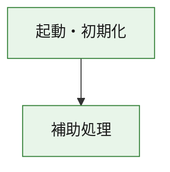
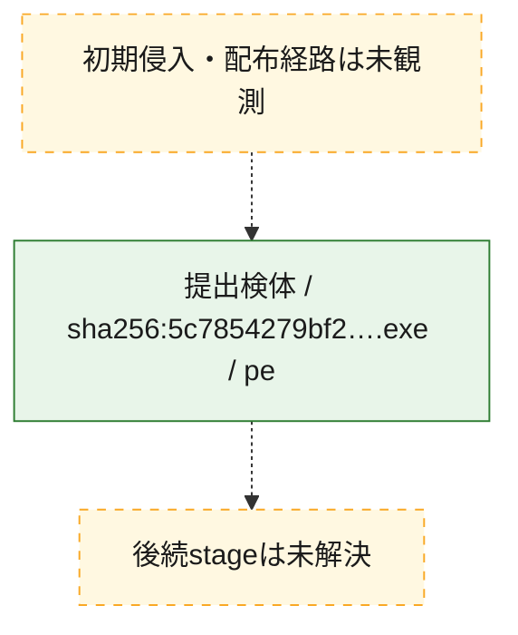
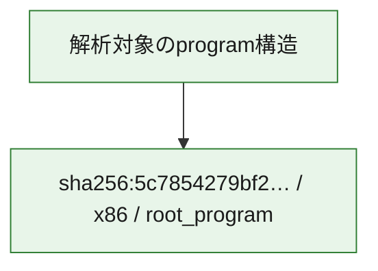

# 全体ロジック：5c7854279bf23801246a9309bf822a9801b1aa2518846e08e1169015561c6390

代表関数の静的証跡から、起動・初期化の処理群を確認しました。

## 読み方

- phaseの掲載順は解析上の整理順です。observed_call_edgesがない段階間の実行順を断定しません。
- 図の実線は静的に観測した関係、点線と黄色のノードは未観測・未解決の関係を示します。
- 図は静的な要約であり、動的実行を再現するものではありません。
- 詳細な関数解説とfingerprintは[STATIC-LOGIC.md](STATIC-LOGIC.md)を参照してください。

## 静的可視化

### 実行フロー

### 感染チェーン

### モジュール関係

## 処理段階

### 1. 起動・初期化

entry pointから初期化と後続処理への移行を確認します。
確度: `confirmed_static_function_evidence`

- `5c7854279bf23801246a9309bf822a9801b1aa2518846e08e1169015561c6390:ghidra:180001010` — 初期化と主要処理への分岐を行う入口関数です。 状態: `succeeded`、選定理由: `entry_point`, `meaningful_symbol_name`, `reviewed_call_centrality:22`, `role:entrypoint`, `small_program_complete_context`

### 2. 補助処理

主要処理を支える一般内部関数またはlibrary処理を確認します。
確度: `confirmed_static_function_evidence`

- `5c7854279bf23801246a9309bf822a9801b1aa2518846e08e1169015561c6390:ghidra:180001240` — 検体内部の一般処理を実装する関数です。 状態: `succeeded`、選定理由: `context_representative`, `reviewed_call_centrality:2`, `small_program_complete_context`
- `5c7854279bf23801246a9309bf822a9801b1aa2518846e08e1169015561c6390:ghidra:180001350` — 検体内部の一般処理を実装する関数です。 状態: `succeeded`、選定理由: `context_representative`, `reviewed_call_centrality:25`, `small_program_complete_context`
- `5c7854279bf23801246a9309bf822a9801b1aa2518846e08e1169015561c6390:ghidra:180003780` — 検体内部の一般処理を実装する関数です。 状態: `succeeded`、選定理由: `context_representative`, `reviewed_call_centrality:2`, `small_program_complete_context`
- `5c7854279bf23801246a9309bf822a9801b1aa2518846e08e1169015561c6390:ghidra:1800038e0` — 検体内部の一般処理を実装する関数です。 状態: `succeeded`、選定理由: `context_representative`, `reviewed_call_centrality:2`, `small_program_complete_context`

## 観測したcall関係

- `5c7854279bf23801246a9309bf822a9801b1aa2518846e08e1169015561c6390:ghidra:180001010` → `5c7854279bf23801246a9309bf822a9801b1aa2518846e08e1169015561c6390:ghidra:180001240` （`startup` → `support`）
- `5c7854279bf23801246a9309bf822a9801b1aa2518846e08e1169015561c6390:ghidra:180001010` → `5c7854279bf23801246a9309bf822a9801b1aa2518846e08e1169015561c6390:ghidra:180001350` （`startup` → `support`）
- `5c7854279bf23801246a9309bf822a9801b1aa2518846e08e1169015561c6390:ghidra:180001350` → `5c7854279bf23801246a9309bf822a9801b1aa2518846e08e1169015561c6390:ghidra:180001240` （`support` → `support`）
- `5c7854279bf23801246a9309bf822a9801b1aa2518846e08e1169015561c6390:ghidra:180001350` → `5c7854279bf23801246a9309bf822a9801b1aa2518846e08e1169015561c6390:ghidra:180003780` （`support` → `support`）
- `5c7854279bf23801246a9309bf822a9801b1aa2518846e08e1169015561c6390:ghidra:180001350` → `5c7854279bf23801246a9309bf822a9801b1aa2518846e08e1169015561c6390:ghidra:1800038e0` （`support` → `support`）
- `5c7854279bf23801246a9309bf822a9801b1aa2518846e08e1169015561c6390:ghidra:180003780` → `5c7854279bf23801246a9309bf822a9801b1aa2518846e08e1169015561c6390:ghidra:1800038e0` （`support` → `support`）
- `ghidra-function:255c20c8b9da3b97eee4ec3f` → `ghidra-function:217807c2ba5484001e5670eb` （`unclassified` → `unclassified`）
- `ghidra-function:3bbc03863e958a587a825940` → `ghidra-function:2096d5c10993dc2800065913` （`unclassified` → `unclassified`）
- `ghidra-function:3bbc03863e958a587a825940` → `ghidra-function:2c92f1c094c9232a837f1073` （`unclassified` → `unclassified`）
- `ghidra-function:3bbc03863e958a587a825940` → `ghidra-function:3b0c7d0298092b3acb8ad3bb` （`unclassified` → `unclassified`）
- `ghidra-function:3bbc03863e958a587a825940` → `ghidra-function:3c09c09f52d5bc69fab889d5` （`unclassified` → `unclassified`）
- `ghidra-function:3bbc03863e958a587a825940` → `ghidra-function:527b758409cf40cd124045e8` （`unclassified` → `unclassified`）
- `ghidra-function:3bbc03863e958a587a825940` → `ghidra-function:544979d9b7111853fe3b6b95` （`unclassified` → `unclassified`）
- `ghidra-function:3bbc03863e958a587a825940` → `ghidra-function:694c5ead46afa6a4b8492a1a` （`unclassified` → `unclassified`）
- `ghidra-function:3bbc03863e958a587a825940` → `ghidra-function:b523a403f42423a106092646` （`unclassified` → `unclassified`）
- `ghidra-function:3bbc03863e958a587a825940` → `ghidra-function:bc76726ecd4e02617663150c` （`unclassified` → `unclassified`）
- `ghidra-function:3bbc03863e958a587a825940` → `ghidra-function:bef14c098b19c8de42119b13` （`unclassified` → `unclassified`）
- `ghidra-function:3bbc03863e958a587a825940` → `ghidra-function:c9e51157577e919aef9349fe` （`unclassified` → `unclassified`）
- `ghidra-function:3bbc03863e958a587a825940` → `ghidra-function:f6f5d3d6f6535bfbfd49aca5` （`unclassified` → `unclassified`）
- `ghidra-function:c9e51157577e919aef9349fe` → `ghidra-external:064a1d84a8b7a9b99dcc8709` （`unclassified` → `unclassified`）
- `ghidra-function:c9e51157577e919aef9349fe` → `ghidra-external:14f0fe300892366c9c876e58` （`unclassified` → `unclassified`）
- `ghidra-function:c9e51157577e919aef9349fe` → `ghidra-external:292ea96fbd69b9ce2ca499da` （`unclassified` → `unclassified`）
- `ghidra-function:c9e51157577e919aef9349fe` → `ghidra-external:2db01a9bc7d46d20c49b908f` （`unclassified` → `unclassified`）
- `ghidra-function:c9e51157577e919aef9349fe` → `ghidra-external:3ddaa1dd13ecf696a4221859` （`unclassified` → `unclassified`）
- `ghidra-function:c9e51157577e919aef9349fe` → `ghidra-external:40914a44f005bb8b9d19887c` （`unclassified` → `unclassified`）
- `ghidra-function:c9e51157577e919aef9349fe` → `ghidra-external:5de5d19e56a98df3f633f0f8` （`unclassified` → `unclassified`）
- `ghidra-function:c9e51157577e919aef9349fe` → `ghidra-external:5f48ecca6ced3a4d657f9e35` （`unclassified` → `unclassified`）
- `ghidra-function:c9e51157577e919aef9349fe` → `ghidra-external:62c10bb9fc49dde699bfe5cb` （`unclassified` → `unclassified`）
- `ghidra-function:c9e51157577e919aef9349fe` → `ghidra-external:699f3dd1d54ef3cafd15da96` （`unclassified` → `unclassified`）
- `ghidra-function:c9e51157577e919aef9349fe` → `ghidra-external:7a3f180c617c68bb9b83bd64` （`unclassified` → `unclassified`）
- `ghidra-function:c9e51157577e919aef9349fe` → `ghidra-external:996a9e191e7917c789f5b1bd` （`unclassified` → `unclassified`）
- `ghidra-function:c9e51157577e919aef9349fe` → `ghidra-external:9f04293242c3ee59e9fd6da7` （`unclassified` → `unclassified`）
- `ghidra-function:c9e51157577e919aef9349fe` → `ghidra-external:9f63fcaf328d109b7c0d1b7d` （`unclassified` → `unclassified`）
- `ghidra-function:c9e51157577e919aef9349fe` → `ghidra-external:b4b222cc52fd002655b5c8e5` （`unclassified` → `unclassified`）
- `ghidra-function:c9e51157577e919aef9349fe` → `ghidra-external:b6789b4c7e167c627ef78d8c` （`unclassified` → `unclassified`）
- `ghidra-function:c9e51157577e919aef9349fe` → `ghidra-external:d0acbb7cf5010aaa3053ff1c` （`unclassified` → `unclassified`）
- `ghidra-function:c9e51157577e919aef9349fe` → `ghidra-external:e4ba6f782750347eb83b625b` （`unclassified` → `unclassified`）
- `ghidra-function:c9e51157577e919aef9349fe` → `ghidra-external:e4f6627c84e8ca086cf6ca77` （`unclassified` → `unclassified`）
- `ghidra-function:c9e51157577e919aef9349fe` → `ghidra-external:f1aa4eccecb6f6cade3f4903` （`unclassified` → `unclassified`）
- `ghidra-function:c9e51157577e919aef9349fe` → `ghidra-external:f6741e05c3e64b357ec81980` （`unclassified` → `unclassified`）
- `ghidra-function:c9e51157577e919aef9349fe` → `ghidra-function:2096d5c10993dc2800065913` （`unclassified` → `unclassified`）
- `ghidra-function:c9e51157577e919aef9349fe` → `ghidra-function:217807c2ba5484001e5670eb` （`unclassified` → `unclassified`）
- `ghidra-function:c9e51157577e919aef9349fe` → `ghidra-function:255c20c8b9da3b97eee4ec3f` （`unclassified` → `unclassified`）

## 解析範囲と制約

- 選定外関数は全体inventoryへ残しますが、関数本体の個別解説対象にはしていません。
- indirect call、難読化、packer、VM、壊れたcontrol flowによりcall関係が欠落する場合があります。
- 文書は静的解析に基づき、検体実行や外部通信による動的確認は行っていません。
