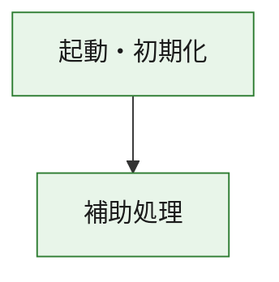
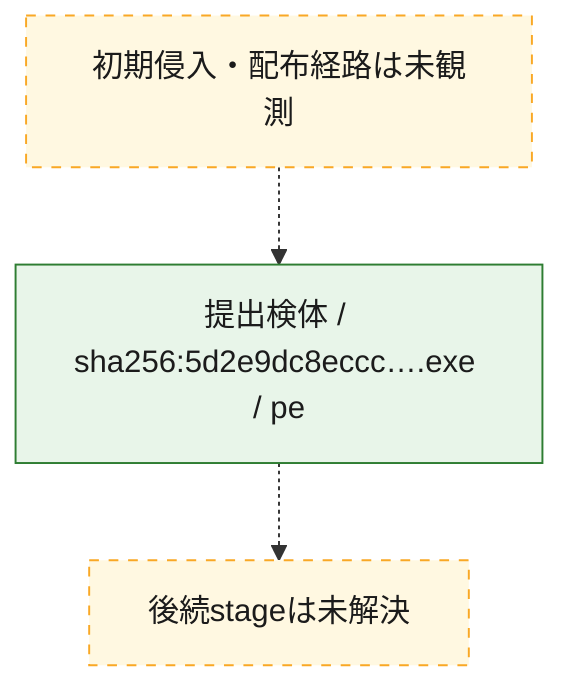
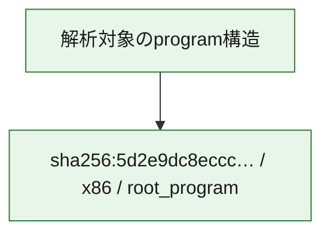

# 全体ロジック：5d2e9dc8ecccd403cab45908364de972a34ef4c13af4a9dbc6733cf034ff1095

代表関数の静的証跡から、起動・初期化の処理群を確認しました。

## 読み方

- phaseの掲載順は解析上の整理順です。observed_call_edgesがない段階間の実行順を断定しません。
- 図の実線は静的に観測した関係、点線と黄色のノードは未観測・未解決の関係を示します。
- 図は静的な要約であり、動的実行を再現するものではありません。
- 詳細な関数解説とfingerprintは[STATIC-LOGIC.md](STATIC-LOGIC.md)を参照してください。

## 静的可視化

### 実行フロー

### 感染チェーン

### モジュール関係

## 処理段階

### 1. 起動・初期化

entry pointから初期化と後続処理への移行を確認します。
確度: `confirmed_static_function_evidence`

- `5d2e9dc8ecccd403cab45908364de972a34ef4c13af4a9dbc6733cf034ff1095:ghidra:180001010` — 初期化と主要処理への分岐を行う入口関数です。 状態: `succeeded`、選定理由: `entry_point`, `meaningful_symbol_name`, `reviewed_call_centrality:22`, `role:entrypoint`, `small_program_complete_context`

### 2. 補助処理

主要処理を支える一般内部関数またはlibrary処理を確認します。
確度: `confirmed_static_function_evidence`

- `5d2e9dc8ecccd403cab45908364de972a34ef4c13af4a9dbc6733cf034ff1095:ghidra:180001240` — 検体内部の一般処理を実装する関数です。 状態: `succeeded`、選定理由: `context_representative`, `reviewed_call_centrality:2`, `small_program_complete_context`
- `5d2e9dc8ecccd403cab45908364de972a34ef4c13af4a9dbc6733cf034ff1095:ghidra:180001350` — 検体内部の一般処理を実装する関数です。 状態: `succeeded`、選定理由: `context_representative`, `reviewed_call_centrality:25`, `small_program_complete_context`
- `5d2e9dc8ecccd403cab45908364de972a34ef4c13af4a9dbc6733cf034ff1095:ghidra:180003780` — 検体内部の一般処理を実装する関数です。 状態: `succeeded`、選定理由: `context_representative`, `reviewed_call_centrality:2`, `small_program_complete_context`
- `5d2e9dc8ecccd403cab45908364de972a34ef4c13af4a9dbc6733cf034ff1095:ghidra:1800038e0` — 検体内部の一般処理を実装する関数です。 状態: `succeeded`、選定理由: `context_representative`, `reviewed_call_centrality:2`, `small_program_complete_context`

## 観測したcall関係

- `5d2e9dc8ecccd403cab45908364de972a34ef4c13af4a9dbc6733cf034ff1095:ghidra:180001010` → `5d2e9dc8ecccd403cab45908364de972a34ef4c13af4a9dbc6733cf034ff1095:ghidra:180001240` （`startup` → `support`）
- `5d2e9dc8ecccd403cab45908364de972a34ef4c13af4a9dbc6733cf034ff1095:ghidra:180001010` → `5d2e9dc8ecccd403cab45908364de972a34ef4c13af4a9dbc6733cf034ff1095:ghidra:180001350` （`startup` → `support`）
- `5d2e9dc8ecccd403cab45908364de972a34ef4c13af4a9dbc6733cf034ff1095:ghidra:180001350` → `5d2e9dc8ecccd403cab45908364de972a34ef4c13af4a9dbc6733cf034ff1095:ghidra:180001240` （`support` → `support`）
- `5d2e9dc8ecccd403cab45908364de972a34ef4c13af4a9dbc6733cf034ff1095:ghidra:180001350` → `5d2e9dc8ecccd403cab45908364de972a34ef4c13af4a9dbc6733cf034ff1095:ghidra:180003780` （`support` → `support`）
- `5d2e9dc8ecccd403cab45908364de972a34ef4c13af4a9dbc6733cf034ff1095:ghidra:180001350` → `5d2e9dc8ecccd403cab45908364de972a34ef4c13af4a9dbc6733cf034ff1095:ghidra:1800038e0` （`support` → `support`）
- `5d2e9dc8ecccd403cab45908364de972a34ef4c13af4a9dbc6733cf034ff1095:ghidra:180003780` → `5d2e9dc8ecccd403cab45908364de972a34ef4c13af4a9dbc6733cf034ff1095:ghidra:1800038e0` （`support` → `support`）
- `ghidra-function:6c38edbe3a5ed0ea55ace68e` → `ghidra-function:3f34c787fb8ac843f96914a2` （`unclassified` → `unclassified`）
- `ghidra-function:a87f78d6733275c583963999` → `ghidra-function:31479b74ca98a3a0ccaaf2ca` （`unclassified` → `unclassified`）
- `ghidra-function:a87f78d6733275c583963999` → `ghidra-function:37d19994f5a63929249cf93a` （`unclassified` → `unclassified`）
- `ghidra-function:a87f78d6733275c583963999` → `ghidra-function:46d49dd93c9a3a85dfdba86c` （`unclassified` → `unclassified`）
- `ghidra-function:a87f78d6733275c583963999` → `ghidra-function:508b8651833110563696f1c9` （`unclassified` → `unclassified`）
- `ghidra-function:a87f78d6733275c583963999` → `ghidra-function:6505c3392b3010341284d8ea` （`unclassified` → `unclassified`）
- `ghidra-function:a87f78d6733275c583963999` → `ghidra-function:6d21ac1738ef45b3270351b6` （`unclassified` → `unclassified`）
- `ghidra-function:a87f78d6733275c583963999` → `ghidra-function:90d7a59cbfff0da083384c6f` （`unclassified` → `unclassified`）
- `ghidra-function:a87f78d6733275c583963999` → `ghidra-function:ac2322ef5a2e18772f764f57` （`unclassified` → `unclassified`）
- `ghidra-function:a87f78d6733275c583963999` → `ghidra-function:b8fab81aae35f869e313a747` （`unclassified` → `unclassified`）
- `ghidra-function:a87f78d6733275c583963999` → `ghidra-function:c26ed684dcaa7f567784258c` （`unclassified` → `unclassified`）
- `ghidra-function:a87f78d6733275c583963999` → `ghidra-function:d48cbde1929189b0446dcc38` （`unclassified` → `unclassified`）
- `ghidra-function:a87f78d6733275c583963999` → `ghidra-function:ee3d2ab501426f56c3b0b806` （`unclassified` → `unclassified`）
- `ghidra-function:ee3d2ab501426f56c3b0b806` → `ghidra-external:06465e1ce66d608068f0bb77` （`unclassified` → `unclassified`）
- `ghidra-function:ee3d2ab501426f56c3b0b806` → `ghidra-external:16cde0527a393a23f94a7652` （`unclassified` → `unclassified`）
- `ghidra-function:ee3d2ab501426f56c3b0b806` → `ghidra-external:17ba10cfe8465e18056e1687` （`unclassified` → `unclassified`）
- `ghidra-function:ee3d2ab501426f56c3b0b806` → `ghidra-external:19f5113b2082516c8735e418` （`unclassified` → `unclassified`）
- `ghidra-function:ee3d2ab501426f56c3b0b806` → `ghidra-external:22efb3046fc965ab1df3a313` （`unclassified` → `unclassified`）
- `ghidra-function:ee3d2ab501426f56c3b0b806` → `ghidra-external:493d78f95eb964ab153748b9` （`unclassified` → `unclassified`）
- `ghidra-function:ee3d2ab501426f56c3b0b806` → `ghidra-external:4d26f2cba5e16f27f51dc4eb` （`unclassified` → `unclassified`）
- `ghidra-function:ee3d2ab501426f56c3b0b806` → `ghidra-external:4e0b61fbf200b8d5780b63d5` （`unclassified` → `unclassified`）
- `ghidra-function:ee3d2ab501426f56c3b0b806` → `ghidra-external:5d4d465d7c9ac3f271b19c65` （`unclassified` → `unclassified`）
- `ghidra-function:ee3d2ab501426f56c3b0b806` → `ghidra-external:6858cdc2211f407eaa8fcc6c` （`unclassified` → `unclassified`）
- `ghidra-function:ee3d2ab501426f56c3b0b806` → `ghidra-external:6d969de9b455e3d1b4d083d5` （`unclassified` → `unclassified`）
- `ghidra-function:ee3d2ab501426f56c3b0b806` → `ghidra-external:85ee0120c2bbc2723bfd6634` （`unclassified` → `unclassified`）
- `ghidra-function:ee3d2ab501426f56c3b0b806` → `ghidra-external:8cc6c6852e6150257fb9a183` （`unclassified` → `unclassified`）
- `ghidra-function:ee3d2ab501426f56c3b0b806` → `ghidra-external:9fef1627a36e19a1c64c7053` （`unclassified` → `unclassified`）
- `ghidra-function:ee3d2ab501426f56c3b0b806` → `ghidra-external:ac3cbc75ba95f13e131c0558` （`unclassified` → `unclassified`）
- `ghidra-function:ee3d2ab501426f56c3b0b806` → `ghidra-external:ac41df5e5d13e89854ecd2a2` （`unclassified` → `unclassified`）
- `ghidra-function:ee3d2ab501426f56c3b0b806` → `ghidra-external:cb00175293ddc1353df798ac` （`unclassified` → `unclassified`）
- `ghidra-function:ee3d2ab501426f56c3b0b806` → `ghidra-external:cb102b804012a8cfe20920b1` （`unclassified` → `unclassified`）
- `ghidra-function:ee3d2ab501426f56c3b0b806` → `ghidra-external:db521a6975edfc4db3e42aef` （`unclassified` → `unclassified`）
- `ghidra-function:ee3d2ab501426f56c3b0b806` → `ghidra-external:f4346a1e42785ecd05a4ae01` （`unclassified` → `unclassified`）
- `ghidra-function:ee3d2ab501426f56c3b0b806` → `ghidra-external:f94c585c0a235bb1b9691745` （`unclassified` → `unclassified`）
- `ghidra-function:ee3d2ab501426f56c3b0b806` → `ghidra-function:3f34c787fb8ac843f96914a2` （`unclassified` → `unclassified`）
- `ghidra-function:ee3d2ab501426f56c3b0b806` → `ghidra-function:6c38edbe3a5ed0ea55ace68e` （`unclassified` → `unclassified`）
- `ghidra-function:ee3d2ab501426f56c3b0b806` → `ghidra-function:6d21ac1738ef45b3270351b6` （`unclassified` → `unclassified`）

## 解析範囲と制約

- 選定外関数は全体inventoryへ残しますが、関数本体の個別解説対象にはしていません。
- indirect call、難読化、packer、VM、壊れたcontrol flowによりcall関係が欠落する場合があります。
- 文書は静的解析に基づき、検体実行や外部通信による動的確認は行っていません。
