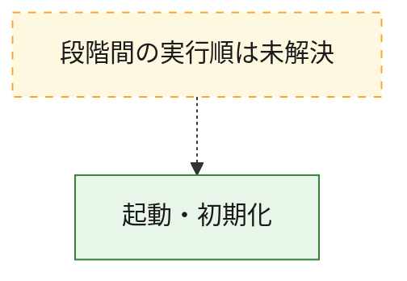
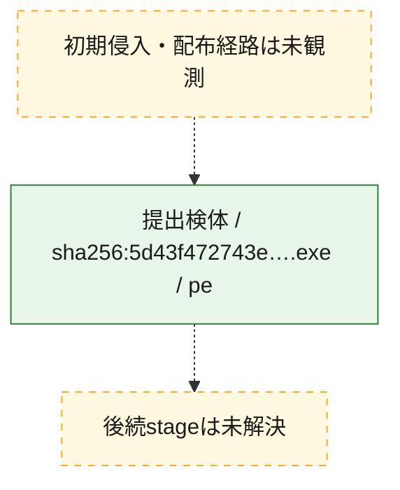
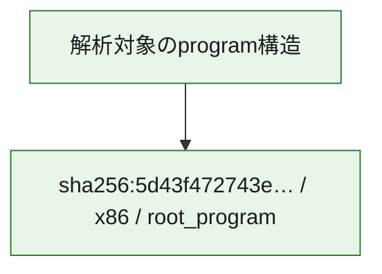

# 全体ロジック：5d43f472743ec596067f96a143e0058a8bd27b119f59e2705293334c21fd05f4

代表関数の静的証跡から、起動・初期化の処理群を確認しました。

## 読み方

- phaseの掲載順は解析上の整理順です。observed_call_edgesがない段階間の実行順を断定しません。
- 図の実線は静的に観測した関係、点線と黄色のノードは未観測・未解決の関係を示します。
- 図は静的な要約であり、動的実行を再現するものではありません。
- 詳細な関数解説とfingerprintは[STATIC-LOGIC.md](STATIC-LOGIC.md)を参照してください。

## 静的可視化

### 実行フロー

### 感染チェーン

### モジュール関係

## 処理段階

### 1. 起動・初期化

entry pointから初期化と後続処理への移行を確認します。
確度: `confirmed_static_function_evidence`

- `5d43f472743ec596067f96a143e0058a8bd27b119f59e2705293334c21fd05f4:ghidra:0041181c` — 初期化と主要処理への分岐を行う入口関数です。 状態: `succeeded`、選定理由: `entry_point`, `large_function:instructions=149`, `meaningful_symbol_name`, `reviewed_call_centrality:18`, `role:entrypoint`, `small_program_complete_context`

## 観測したcall関係

- `ghidra-function:b3d22985ec693cbe0b9443e5` → `ghidra-external:15a5cfadfb291f8d81416624` （`unclassified` → `unclassified`）
- `ghidra-function:b3d22985ec693cbe0b9443e5` → `ghidra-external:1b5f39e2d6a08e157649bd1d` （`unclassified` → `unclassified`）
- `ghidra-function:b3d22985ec693cbe0b9443e5` → `ghidra-external:1e9afe20e4ca21aba7507ca6` （`unclassified` → `unclassified`）
- `ghidra-function:b3d22985ec693cbe0b9443e5` → `ghidra-external:20fa6dc1056969603479eded` （`unclassified` → `unclassified`）
- `ghidra-function:b3d22985ec693cbe0b9443e5` → `ghidra-external:3c071618dd4506a9d6974641` （`unclassified` → `unclassified`）
- `ghidra-function:b3d22985ec693cbe0b9443e5` → `ghidra-external:47ccb5842797e49e93f2f8ee` （`unclassified` → `unclassified`）
- `ghidra-function:b3d22985ec693cbe0b9443e5` → `ghidra-external:4e3c532a2d0a95634dbe2491` （`unclassified` → `unclassified`）
- `ghidra-function:b3d22985ec693cbe0b9443e5` → `ghidra-external:5b2d469144045bfd0bc32ace` （`unclassified` → `unclassified`）
- `ghidra-function:b3d22985ec693cbe0b9443e5` → `ghidra-external:5fc3e1f1ec5086c0f8628dc6` （`unclassified` → `unclassified`）
- `ghidra-function:b3d22985ec693cbe0b9443e5` → `ghidra-external:6efd0ae81bdbb557be06a4f7` （`unclassified` → `unclassified`）
- `ghidra-function:b3d22985ec693cbe0b9443e5` → `ghidra-external:72704cecfd75aae4042f0be1` （`unclassified` → `unclassified`）
- `ghidra-function:b3d22985ec693cbe0b9443e5` → `ghidra-external:82bc90b63ff30e605c33a2b1` （`unclassified` → `unclassified`）
- `ghidra-function:b3d22985ec693cbe0b9443e5` → `ghidra-external:8acbbd3489b17ff5ad78fd30` （`unclassified` → `unclassified`）
- `ghidra-function:b3d22985ec693cbe0b9443e5` → `ghidra-external:98667faaf87486fe2cea3d89` （`unclassified` → `unclassified`）
- `ghidra-function:b3d22985ec693cbe0b9443e5` → `ghidra-external:b763a4568e7cafa319ce4b1c` （`unclassified` → `unclassified`）
- `ghidra-function:b3d22985ec693cbe0b9443e5` → `ghidra-external:e30979af64b5f9e8ec493d41` （`unclassified` → `unclassified`）
- `ghidra-function:b3d22985ec693cbe0b9443e5` → `ghidra-external:ea5f643bb258aa9aea7e552a` （`unclassified` → `unclassified`）
- `ghidra-function:b3d22985ec693cbe0b9443e5` → `ghidra-external:f66eff2fde64df873b3564ad` （`unclassified` → `unclassified`）

## 解析範囲と制約

- 選定外関数は全体inventoryへ残しますが、関数本体の個別解説対象にはしていません。
- indirect call、難読化、packer、VM、壊れたcontrol flowによりcall関係が欠落する場合があります。
- 文書は静的解析に基づき、検体実行や外部通信による動的確認は行っていません。
