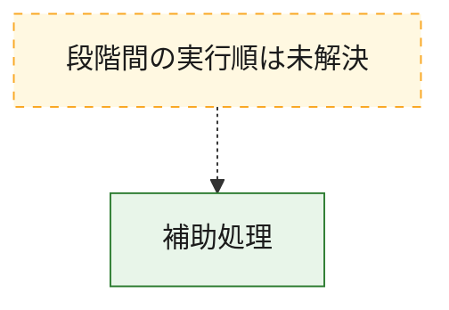
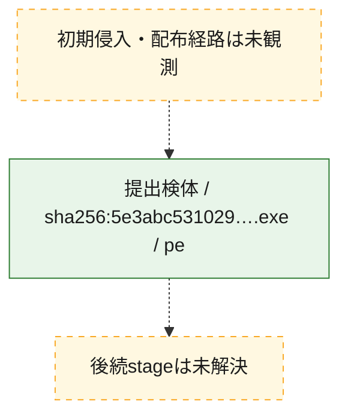
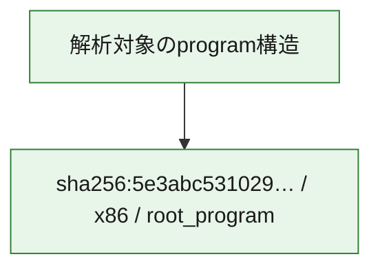

# 全体ロジック：5e3abc53102951c935347776e06bd6416cdd84ffd6eec9034a70aaee2f53ed7f

代表関数から主要なmalware処理段階を自動分類できませんでした。

## 読み方

- phaseの掲載順は解析上の整理順です。observed_call_edgesがない段階間の実行順を断定しません。
- 図の実線は静的に観測した関係、点線と黄色のノードは未観測・未解決の関係を示します。
- 図は静的な要約であり、動的実行を再現するものではありません。
- 詳細な関数解説とfingerprintは[STATIC-LOGIC.md](STATIC-LOGIC.md)を参照してください。

## 静的可視化

### 実行フロー

### 感染チェーン

### モジュール関係

## 処理段階

### 1. 補助処理

主要処理を支える一般内部関数またはlibrary処理を確認します。
確度: `confirmed_static_function_evidence`

- `5e3abc53102951c935347776e06bd6416cdd84ffd6eec9034a70aaee2f53ed7f:ghidra:140001000` — 検体内部の一般処理を実装する関数です。 状態: `succeeded`、選定理由: `context_representative`, `reviewed_call_centrality:4`
- `5e3abc53102951c935347776e06bd6416cdd84ffd6eec9034a70aaee2f53ed7f:ghidra:140001100` — 検体内部の一般処理を実装する関数です。 状態: `succeeded`、選定理由: `context_representative`, `reviewed_call_centrality:2`
- `5e3abc53102951c935347776e06bd6416cdd84ffd6eec9034a70aaee2f53ed7f:ghidra:140001240` — 検体内部の一般処理を実装する関数です。 状態: `succeeded`、選定理由: `context_representative`, `reviewed_call_centrality:2`
- `5e3abc53102951c935347776e06bd6416cdd84ffd6eec9034a70aaee2f53ed7f:ghidra:140001280` — 検体内部の一般処理を実装する関数です。 状態: `succeeded`、選定理由: `context_representative`, `reviewed_call_centrality:3`
- `5e3abc53102951c935347776e06bd6416cdd84ffd6eec9034a70aaee2f53ed7f:ghidra:140001300` — 検体内部の一般処理を実装する関数です。 状態: `succeeded`、選定理由: `context_representative`, `reviewed_call_centrality:5`
- `5e3abc53102951c935347776e06bd6416cdd84ffd6eec9034a70aaee2f53ed7f:ghidra:1400013c0` — 検体内部の一般処理を実装する関数です。 状態: `succeeded`、選定理由: `context_representative`, `reviewed_call_centrality:4`
- `5e3abc53102951c935347776e06bd6416cdd84ffd6eec9034a70aaee2f53ed7f:ghidra:1400014c0` — 検体内部の一般処理を実装する関数です。 状態: `succeeded`、選定理由: `context_representative`, `reviewed_call_centrality:7`
- `5e3abc53102951c935347776e06bd6416cdd84ffd6eec9034a70aaee2f53ed7f:ghidra:140001920` — 検体内部の一般処理を実装する関数です。 状態: `succeeded`、選定理由: `context_representative`, `reviewed_call_centrality:2`
- `5e3abc53102951c935347776e06bd6416cdd84ffd6eec9034a70aaee2f53ed7f:ghidra:140001aa0` — 検体内部の一般処理を実装する関数です。 状態: `succeeded`、選定理由: `context_representative`, `reviewed_call_centrality:2`
- `5e3abc53102951c935347776e06bd6416cdd84ffd6eec9034a70aaee2f53ed7f:ghidra:140001ac0` — 検体内部の一般処理を実装する関数です。 状態: `succeeded`、選定理由: `context_representative`, `reviewed_call_centrality:3`
- `5e3abc53102951c935347776e06bd6416cdd84ffd6eec9034a70aaee2f53ed7f:ghidra:140001b20` — 検体内部の一般処理を実装する関数です。 状態: `succeeded`、選定理由: `context_representative`, `reviewed_call_centrality:3`
- `5e3abc53102951c935347776e06bd6416cdd84ffd6eec9034a70aaee2f53ed7f:ghidra:140001d00` — 検体内部の一般処理を実装する関数です。 状態: `succeeded`、選定理由: `context_representative`, `reviewed_call_centrality:3`
- `5e3abc53102951c935347776e06bd6416cdd84ffd6eec9034a70aaee2f53ed7f:ghidra:140001d60` — 検体内部の一般処理を実装する関数です。 状態: `succeeded`、選定理由: `context_representative`, `reviewed_call_centrality:8`
- `5e3abc53102951c935347776e06bd6416cdd84ffd6eec9034a70aaee2f53ed7f:ghidra:140002260` — 検体内部の一般処理を実装する関数です。 状態: `succeeded`、選定理由: `context_representative`, `reviewed_call_centrality:11`
- `5e3abc53102951c935347776e06bd6416cdd84ffd6eec9034a70aaee2f53ed7f:ghidra:140002e00` — 検体内部の一般処理を実装する関数です。 状態: `succeeded`、選定理由: `context_representative`, `reviewed_call_centrality:3`
- `5e3abc53102951c935347776e06bd6416cdd84ffd6eec9034a70aaee2f53ed7f:ghidra:140002e80` — 検体内部の一般処理を実装する関数です。 状態: `succeeded`、選定理由: `context_representative`, `reviewed_call_centrality:2`
- `5e3abc53102951c935347776e06bd6416cdd84ffd6eec9034a70aaee2f53ed7f:ghidra:140002f00` — 検体内部の一般処理を実装する関数です。 状態: `succeeded`、選定理由: `context_representative`, `reviewed_call_centrality:10`
- `5e3abc53102951c935347776e06bd6416cdd84ffd6eec9034a70aaee2f53ed7f:ghidra:140003140` — 検体内部の一般処理を実装する関数です。 状態: `succeeded`、選定理由: `context_representative`, `reviewed_call_centrality:5`
- `5e3abc53102951c935347776e06bd6416cdd84ffd6eec9034a70aaee2f53ed7f:ghidra:1400033c0` — 検体内部の一般処理を実装する関数です。 状態: `succeeded`、選定理由: `context_representative`, `reviewed_call_centrality:4`
- `5e3abc53102951c935347776e06bd6416cdd84ffd6eec9034a70aaee2f53ed7f:ghidra:1400034c0` — 検体内部の一般処理を実装する関数です。 状態: `succeeded`、選定理由: `context_representative`, `reviewed_call_centrality:7`
- `5e3abc53102951c935347776e06bd6416cdd84ffd6eec9034a70aaee2f53ed7f:ghidra:140003600` — 検体内部の一般処理を実装する関数です。 状態: `succeeded`、選定理由: `context_representative`, `reviewed_call_centrality:8`
- `5e3abc53102951c935347776e06bd6416cdd84ffd6eec9034a70aaee2f53ed7f:ghidra:1400038a0` — 検体内部の一般処理を実装する関数です。 状態: `succeeded`、選定理由: `context_representative`, `reviewed_call_centrality:3`
- `5e3abc53102951c935347776e06bd6416cdd84ffd6eec9034a70aaee2f53ed7f:ghidra:140003920` — 検体内部の一般処理を実装する関数です。 状態: `succeeded`、選定理由: `context_representative`, `reviewed_call_centrality:5`
- `5e3abc53102951c935347776e06bd6416cdd84ffd6eec9034a70aaee2f53ed7f:ghidra:140003ac0` — 検体内部の一般処理を実装する関数です。 状態: `succeeded`、選定理由: `context_representative`, `reviewed_call_centrality:8`
- `5e3abc53102951c935347776e06bd6416cdd84ffd6eec9034a70aaee2f53ed7f:ghidra:140003c60` — 検体内部の一般処理を実装する関数です。 状態: `succeeded`、選定理由: `context_representative`, `reviewed_call_centrality:8`
- `5e3abc53102951c935347776e06bd6416cdd84ffd6eec9034a70aaee2f53ed7f:ghidra:140003e40` — 検体内部の一般処理を実装する関数です。 状態: `succeeded`、選定理由: `context_representative`, `reviewed_call_centrality:3`
- `5e3abc53102951c935347776e06bd6416cdd84ffd6eec9034a70aaee2f53ed7f:ghidra:140004040` — 検体内部の一般処理を実装する関数です。 状態: `succeeded`、選定理由: `context_representative`, `reviewed_call_centrality:3`
- `5e3abc53102951c935347776e06bd6416cdd84ffd6eec9034a70aaee2f53ed7f:ghidra:1400040a0` — 検体内部の一般処理を実装する関数です。 状態: `succeeded`、選定理由: `context_representative`, `reviewed_call_centrality:3`
- `5e3abc53102951c935347776e06bd6416cdd84ffd6eec9034a70aaee2f53ed7f:ghidra:140004100` — 検体内部の一般処理を実装する関数です。 状態: `succeeded`、選定理由: `context_representative`, `reviewed_call_centrality:4`
- `5e3abc53102951c935347776e06bd6416cdd84ffd6eec9034a70aaee2f53ed7f:ghidra:140004180` — 検体内部の一般処理を実装する関数です。 状態: `succeeded`、選定理由: `context_representative`, `reviewed_call_centrality:4`
- `5e3abc53102951c935347776e06bd6416cdd84ffd6eec9034a70aaee2f53ed7f:ghidra:140004200` — 検体内部の一般処理を実装する関数です。 状態: `succeeded`、選定理由: `context_representative`, `reviewed_call_centrality:4`
- `5e3abc53102951c935347776e06bd6416cdd84ffd6eec9034a70aaee2f53ed7f:ghidra:140004380` — 検体内部の一般処理を実装する関数です。 状態: `succeeded`、選定理由: `context_representative`, `reviewed_call_centrality:2`

## 観測したcall関係

- `5e3abc53102951c935347776e06bd6416cdd84ffd6eec9034a70aaee2f53ed7f:ghidra:140001b20` → `5e3abc53102951c935347776e06bd6416cdd84ffd6eec9034a70aaee2f53ed7f:ghidra:140001300` （`support` → `support`）
- `5e3abc53102951c935347776e06bd6416cdd84ffd6eec9034a70aaee2f53ed7f:ghidra:140001d00` → `5e3abc53102951c935347776e06bd6416cdd84ffd6eec9034a70aaee2f53ed7f:ghidra:140001d60` （`support` → `support`）
- `5e3abc53102951c935347776e06bd6416cdd84ffd6eec9034a70aaee2f53ed7f:ghidra:140001d00` → `5e3abc53102951c935347776e06bd6416cdd84ffd6eec9034a70aaee2f53ed7f:ghidra:140002260` （`support` → `support`）
- `5e3abc53102951c935347776e06bd6416cdd84ffd6eec9034a70aaee2f53ed7f:ghidra:140002e80` → `5e3abc53102951c935347776e06bd6416cdd84ffd6eec9034a70aaee2f53ed7f:ghidra:140002e00` （`support` → `support`）
- `5e3abc53102951c935347776e06bd6416cdd84ffd6eec9034a70aaee2f53ed7f:ghidra:1400033c0` → `5e3abc53102951c935347776e06bd6416cdd84ffd6eec9034a70aaee2f53ed7f:ghidra:1400034c0` （`support` → `support`）
- `5e3abc53102951c935347776e06bd6416cdd84ffd6eec9034a70aaee2f53ed7f:ghidra:140003ac0` → `5e3abc53102951c935347776e06bd6416cdd84ffd6eec9034a70aaee2f53ed7f:ghidra:140003c60` （`support` → `support`）
- `5e3abc53102951c935347776e06bd6416cdd84ffd6eec9034a70aaee2f53ed7f:ghidra:140003ac0` → `5e3abc53102951c935347776e06bd6416cdd84ffd6eec9034a70aaee2f53ed7f:ghidra:140003e40` （`support` → `support`）
- `5e3abc53102951c935347776e06bd6416cdd84ffd6eec9034a70aaee2f53ed7f:ghidra:140003e40` → `5e3abc53102951c935347776e06bd6416cdd84ffd6eec9034a70aaee2f53ed7f:ghidra:140001280` （`support` → `support`）
- `ghidra-function:018290b48f0c919cda9cd696` → `ghidra-external:e553709d0857611e4ea36cae` （`unclassified` → `unclassified`）
- `ghidra-function:018290b48f0c919cda9cd696` → `ghidra-function:d2c3bb59c75006b5976bd13b` （`unclassified` → `unclassified`）
- `ghidra-function:04577a0c40960e743243c67a` → `ghidra-external:98ef07c02312556b58f62247` （`unclassified` → `unclassified`）
- `ghidra-function:04577a0c40960e743243c67a` → `ghidra-external:9d8081f4d1cd527380366121` （`unclassified` → `unclassified`）
- `ghidra-function:04577a0c40960e743243c67a` → `ghidra-function:7ef5df47d150fd9bbdca7ed8` （`unclassified` → `unclassified`）
- `ghidra-function:04577a0c40960e743243c67a` → `ghidra-function:a2c10d3ae8ed00a346ef0dbc` （`unclassified` → `unclassified`）
- `ghidra-function:04577a0c40960e743243c67a` → `ghidra-function:d299f21ac9a3e2b810fe6a0e` （`unclassified` → `unclassified`）
- `ghidra-function:0c7a55b27e31b09a8a82ed82` → `ghidra-external:1e8553e405da726670d99fa0` （`unclassified` → `unclassified`）
- `ghidra-function:0c7a55b27e31b09a8a82ed82` → `ghidra-external:9d8081f4d1cd527380366121` （`unclassified` → `unclassified`）
- `ghidra-function:0c7a55b27e31b09a8a82ed82` → `ghidra-external:dd75ff50b4d4866700a1a1e5` （`unclassified` → `unclassified`）
- `ghidra-function:0c7a55b27e31b09a8a82ed82` → `ghidra-function:522398c24fc13c12a6e0f8c5` （`unclassified` → `unclassified`）
- `ghidra-function:0e1987b3eeb661f256c607ce` → `ghidra-external:9d8081f4d1cd527380366121` （`unclassified` → `unclassified`）
- `ghidra-function:0e1987b3eeb661f256c607ce` → `ghidra-external:afcd34fe991160007e0c82bb` （`unclassified` → `unclassified`）
- `ghidra-function:0e1987b3eeb661f256c607ce` → `ghidra-external:b961f33e0a023f575742a8d3` （`unclassified` → `unclassified`）
- `ghidra-function:0e1987b3eeb661f256c607ce` → `ghidra-function:3d7062b0b0df2073b9476640` （`unclassified` → `unclassified`）
- `ghidra-function:0e1987b3eeb661f256c607ce` → `ghidra-function:3e71a4b2a0a76b2338682ba8` （`unclassified` → `unclassified`）
- `ghidra-function:0e1987b3eeb661f256c607ce` → `ghidra-function:a5c46ce31faf8121c6dc2f06` （`unclassified` → `unclassified`）
- `ghidra-function:0e1987b3eeb661f256c607ce` → `ghidra-function:c8f718153d693db8543a625b` （`unclassified` → `unclassified`）
- `ghidra-function:1fc3f7d3613441d606144f4a` → `ghidra-external:9d8081f4d1cd527380366121` （`unclassified` → `unclassified`）
- `ghidra-function:1fc3f7d3613441d606144f4a` → `ghidra-function:4fb4627d528e13c27de53c15` （`unclassified` → `unclassified`）
- `ghidra-function:1fc3f7d3613441d606144f4a` → `ghidra-function:d752b3d372eaf058523d0ea6` （`unclassified` → `unclassified`）
- `ghidra-function:26a3bf978d5f4c79eb7ae168` → `ghidra-external:9d8081f4d1cd527380366121` （`unclassified` → `unclassified`）
- `ghidra-function:26a3bf978d5f4c79eb7ae168` → `ghidra-function:5c73151331b7706383d21dc2` （`unclassified` → `unclassified`）
- `ghidra-function:26a3bf978d5f4c79eb7ae168` → `ghidra-function:d2c3bb59c75006b5976bd13b` （`unclassified` → `unclassified`）
- `ghidra-function:26a3bf978d5f4c79eb7ae168` → `ghidra-function:fd20246570fcfcedb5ed88b1` （`unclassified` → `unclassified`）
- `ghidra-function:296d293010ddc21187ef6a18` → `ghidra-external:17cfc6cd69806d79e76435db` （`unclassified` → `unclassified`）
- `ghidra-function:296d293010ddc21187ef6a18` → `ghidra-external:93681b101e5e1727562aaa08` （`unclassified` → `unclassified`）
- `ghidra-function:296d293010ddc21187ef6a18` → `ghidra-external:9d8081f4d1cd527380366121` （`unclassified` → `unclassified`）
- `ghidra-function:309601f4e0beb9019315f158` → `ghidra-external:e553709d0857611e4ea36cae` （`unclassified` → `unclassified`）
- `ghidra-function:309601f4e0beb9019315f158` → `ghidra-function:3e71a4b2a0a76b2338682ba8` （`unclassified` → `unclassified`）
- `ghidra-function:309601f4e0beb9019315f158` → `ghidra-function:dba66c2ffb9c7560e604a83f` （`unclassified` → `unclassified`）
- `ghidra-function:317bde154ae03e8a554f0e12` → `ghidra-external:98c49006a3e5e5aa6463b344` （`unclassified` → `unclassified`）
- `ghidra-function:317bde154ae03e8a554f0e12` → `ghidra-external:9d8081f4d1cd527380366121` （`unclassified` → `unclassified`）
- `ghidra-function:317bde154ae03e8a554f0e12` → `ghidra-function:5c73151331b7706383d21dc2` （`unclassified` → `unclassified`）
- `ghidra-function:317bde154ae03e8a554f0e12` → `ghidra-function:d2c3bb59c75006b5976bd13b` （`unclassified` → `unclassified`）
- `ghidra-function:38770c819ffd436f51132e50` → `ghidra-external:9d8081f4d1cd527380366121` （`unclassified` → `unclassified`）
- `ghidra-function:38770c819ffd436f51132e50` → `ghidra-external:a55534deb8f68b8439a9a41a` （`unclassified` → `unclassified`）
- `ghidra-function:41bda5e05abf2f736b54fff4` → `ghidra-external:1e8553e405da726670d99fa0` （`unclassified` → `unclassified`）
- `ghidra-function:41bda5e05abf2f736b54fff4` → `ghidra-external:7f93c05ed066073def2c898d` （`unclassified` → `unclassified`）
- `ghidra-function:41bda5e05abf2f736b54fff4` → `ghidra-external:98c49006a3e5e5aa6463b344` （`unclassified` → `unclassified`）
- `ghidra-function:41bda5e05abf2f736b54fff4` → `ghidra-external:9d8081f4d1cd527380366121` （`unclassified` → `unclassified`）
- `ghidra-function:41bda5e05abf2f736b54fff4` → `ghidra-external:b4d4ad8533677f18f83d6b38` （`unclassified` → `unclassified`）
- `ghidra-function:41bda5e05abf2f736b54fff4` → `ghidra-function:37f8b6aa1da2be58fa61bd6a` （`unclassified` → `unclassified`）
- `ghidra-function:41bda5e05abf2f736b54fff4` → `ghidra-function:3e71a4b2a0a76b2338682ba8` （`unclassified` → `unclassified`）
- `ghidra-function:41bda5e05abf2f736b54fff4` → `ghidra-function:7ef5df47d150fd9bbdca7ed8` （`unclassified` → `unclassified`）
- `ghidra-function:41bda5e05abf2f736b54fff4` → `ghidra-function:bb1cb65e6f1460a220d095cc` （`unclassified` → `unclassified`）
- `ghidra-function:41bda5e05abf2f736b54fff4` → `ghidra-function:d299f21ac9a3e2b810fe6a0e` （`unclassified` → `unclassified`）
- `ghidra-function:494e2323809b02c31ef56d06` → `ghidra-external:1e8553e405da726670d99fa0` （`unclassified` → `unclassified`）
- `ghidra-function:494e2323809b02c31ef56d06` → `ghidra-external:98c49006a3e5e5aa6463b344` （`unclassified` → `unclassified`）
- `ghidra-function:494e2323809b02c31ef56d06` → `ghidra-external:9d8081f4d1cd527380366121` （`unclassified` → `unclassified`）
- `ghidra-function:494e2323809b02c31ef56d06` → `ghidra-external:f3f64d5739e97a5a69a2b8d4` （`unclassified` → `unclassified`）
- `ghidra-function:67da2c2a683f5118dcf0e1a8` → `ghidra-external:304c4cd8d170ecd5d2d4f5df` （`unclassified` → `unclassified`）
- `ghidra-function:67da2c2a683f5118dcf0e1a8` → `ghidra-external:3dd25dfb8c67fdd149799a4f` （`unclassified` → `unclassified`）
- `ghidra-function:67da2c2a683f5118dcf0e1a8` → `ghidra-external:60252b6d159adf9d95cd86db` （`unclassified` → `unclassified`）
- `ghidra-function:67da2c2a683f5118dcf0e1a8` → `ghidra-external:9d8081f4d1cd527380366121` （`unclassified` → `unclassified`）
- `ghidra-function:67da2c2a683f5118dcf0e1a8` → `ghidra-external:a5ff460dfe28445e103647ba` （`unclassified` → `unclassified`）
- `ghidra-function:67da2c2a683f5118dcf0e1a8` → `ghidra-external:b21e521b0ce2cff601027d29` （`unclassified` → `unclassified`）
- `ghidra-function:67da2c2a683f5118dcf0e1a8` → `ghidra-external:b4d4ad8533677f18f83d6b38` （`unclassified` → `unclassified`）
- `ghidra-function:67da2c2a683f5118dcf0e1a8` → `ghidra-external:b4f7a9b64b05f345f14ea07a` （`unclassified` → `unclassified`）
- `ghidra-function:67da2c2a683f5118dcf0e1a8` → `ghidra-function:37f8b6aa1da2be58fa61bd6a` （`unclassified` → `unclassified`）
- `ghidra-function:67da2c2a683f5118dcf0e1a8` → `ghidra-function:b783e27928241ee104d0c1e1` （`unclassified` → `unclassified`）
- `ghidra-function:6cbc9866ff6d6d7e9c4f273b` → `ghidra-external:9d8081f4d1cd527380366121` （`unclassified` → `unclassified`）
- `ghidra-function:6cbc9866ff6d6d7e9c4f273b` → `ghidra-external:afcd34fe991160007e0c82bb` （`unclassified` → `unclassified`）
- `ghidra-function:6cbc9866ff6d6d7e9c4f273b` → `ghidra-external:b4d4ad8533677f18f83d6b38` （`unclassified` → `unclassified`）
- `ghidra-function:6cbc9866ff6d6d7e9c4f273b` → `ghidra-function:3e71a4b2a0a76b2338682ba8` （`unclassified` → `unclassified`）
- `ghidra-function:6cbc9866ff6d6d7e9c4f273b` → `ghidra-function:d299f21ac9a3e2b810fe6a0e` （`unclassified` → `unclassified`）
- `ghidra-function:79b16b982608dfe204261b49` → `ghidra-external:9d8081f4d1cd527380366121` （`unclassified` → `unclassified`）
- `ghidra-function:79b16b982608dfe204261b49` → `ghidra-function:081598fd3ba04c5c60db0ca6` （`unclassified` → `unclassified`）
- `ghidra-function:79b16b982608dfe204261b49` → `ghidra-function:a3689829b99a9b6851ffdece` （`unclassified` → `unclassified`）
- `ghidra-function:79b16b982608dfe204261b49` → `ghidra-function:ef23ff14c1344bf7ddf75faf` （`unclassified` → `unclassified`）
- `ghidra-function:82bf5c56d2a547d14dc72b2e` → `ghidra-external:9d8081f4d1cd527380366121` （`unclassified` → `unclassified`）
- `ghidra-function:82bf5c56d2a547d14dc72b2e` → `ghidra-external:9eab1d288fb000d4fa35b18c` （`unclassified` → `unclassified`）
- `ghidra-function:82bf5c56d2a547d14dc72b2e` → `ghidra-function:21a1b8ad8132da8cb9ed33fb` （`unclassified` → `unclassified`）
- `ghidra-function:82bf5c56d2a547d14dc72b2e` → `ghidra-function:ef23ff14c1344bf7ddf75faf` （`unclassified` → `unclassified`）
- `ghidra-function:8c90b4df8bb8e68e4f97118d` → `ghidra-external:9d8081f4d1cd527380366121` （`unclassified` → `unclassified`）
- `ghidra-function:8c90b4df8bb8e68e4f97118d` → `ghidra-function:0e1987b3eeb661f256c607ce` （`unclassified` → `unclassified`）
- `ghidra-function:8c90b4df8bb8e68e4f97118d` → `ghidra-function:67da2c2a683f5118dcf0e1a8` （`unclassified` → `unclassified`）
- `ghidra-function:8eb324ab325425c20a35ec71` → `ghidra-external:9d8081f4d1cd527380366121` （`unclassified` → `unclassified`）
- `ghidra-function:8eb324ab325425c20a35ec71` → `ghidra-function:522398c24fc13c12a6e0f8c5` （`unclassified` → `unclassified`）
- `ghidra-function:944a0d5a8befcf35fd42cf5f` → `ghidra-external:9d8081f4d1cd527380366121` （`unclassified` → `unclassified`）
- `ghidra-function:944a0d5a8befcf35fd42cf5f` → `ghidra-function:26a3bf978d5f4c79eb7ae168` （`unclassified` → `unclassified`）
- `ghidra-function:944a0d5a8befcf35fd42cf5f` → `ghidra-function:dba66c2ffb9c7560e604a83f` （`unclassified` → `unclassified`）
- `ghidra-function:96bbad0e635ad736a06ef18e` → `ghidra-external:9d8081f4d1cd527380366121` （`unclassified` → `unclassified`）
- `ghidra-function:96bbad0e635ad736a06ef18e` → `ghidra-function:018290b48f0c919cda9cd696` （`unclassified` → `unclassified`）
- `ghidra-function:9d103e4cfea82395001008fb` → `ghidra-external:9d8081f4d1cd527380366121` （`unclassified` → `unclassified`）
- `ghidra-function:9d103e4cfea82395001008fb` → `ghidra-external:b4d4ad8533677f18f83d6b38` （`unclassified` → `unclassified`）
- `ghidra-function:9d103e4cfea82395001008fb` → `ghidra-function:3ec757bb1cb51e77572884c6` （`unclassified` → `unclassified`）
- `ghidra-function:a3689829b99a9b6851ffdece` → `ghidra-external:8c6cfa6fa5ee45c46d71a345` （`unclassified` → `unclassified`）
- `ghidra-function:a3689829b99a9b6851ffdece` → `ghidra-external:990b0a90b485c6c5ad6dd98a` （`unclassified` → `unclassified`）
- `ghidra-function:a3689829b99a9b6851ffdece` → `ghidra-external:9d8081f4d1cd527380366121` （`unclassified` → `unclassified`）
- `ghidra-function:a3689829b99a9b6851ffdece` → `ghidra-external:b65669b819ea053c9c5e883d` （`unclassified` → `unclassified`）
- `ghidra-function:a3689829b99a9b6851ffdece` → `ghidra-external:cf615bc76c9343a5c9def109` （`unclassified` → `unclassified`）
- `ghidra-function:a3689829b99a9b6851ffdece` → `ghidra-external:f0c427265c298620c1e34b33` （`unclassified` → `unclassified`）
- `ghidra-function:abc6b17b1d65083cdf37522f` → `ghidra-external:9d8081f4d1cd527380366121` （`unclassified` → `unclassified`）
- `ghidra-function:abc6b17b1d65083cdf37522f` → `ghidra-external:a39aafba1067ed1d64bdfe88` （`unclassified` → `unclassified`）
- `ghidra-function:abc6b17b1d65083cdf37522f` → `ghidra-function:0935c6058e27a1d102cb1071` （`unclassified` → `unclassified`）
- `ghidra-function:abc6b17b1d65083cdf37522f` → `ghidra-function:3e71a4b2a0a76b2338682ba8` （`unclassified` → `unclassified`）
- `ghidra-function:abc6b17b1d65083cdf37522f` → `ghidra-function:522398c24fc13c12a6e0f8c5` （`unclassified` → `unclassified`）
- `ghidra-function:abc6b17b1d65083cdf37522f` → `ghidra-function:be64bad58ae725ce2be5f485` （`unclassified` → `unclassified`）
- `ghidra-function:abc6b17b1d65083cdf37522f` → `ghidra-function:d299f21ac9a3e2b810fe6a0e` （`unclassified` → `unclassified`）
- `ghidra-function:b68e7117f56939d5dfbc37e4` → `ghidra-external:98c49006a3e5e5aa6463b344` （`unclassified` → `unclassified`）
- `ghidra-function:b68e7117f56939d5dfbc37e4` → `ghidra-external:9d8081f4d1cd527380366121` （`unclassified` → `unclassified`）
- `ghidra-function:b68e7117f56939d5dfbc37e4` → `ghidra-function:15fd573a5bdcd69dd5b3c592` （`unclassified` → `unclassified`）
- `ghidra-function:b68e7117f56939d5dfbc37e4` → `ghidra-function:522398c24fc13c12a6e0f8c5` （`unclassified` → `unclassified`）
- `ghidra-function:b68e7117f56939d5dfbc37e4` → `ghidra-function:96bbad0e635ad736a06ef18e` （`unclassified` → `unclassified`）
- `ghidra-function:b68e7117f56939d5dfbc37e4` → `ghidra-function:bb1cb65e6f1460a220d095cc` （`unclassified` → `unclassified`）
- `ghidra-function:b68e7117f56939d5dfbc37e4` → `ghidra-function:e17c626c64eeb2d6fadf6ec8` （`unclassified` → `unclassified`）
- `ghidra-function:b68e7117f56939d5dfbc37e4` → `ghidra-function:ef23ff14c1344bf7ddf75faf` （`unclassified` → `unclassified`）
- `ghidra-function:bbee8c5f816f4414d16da03c` → `ghidra-external:9d8081f4d1cd527380366121` （`unclassified` → `unclassified`）
- `ghidra-function:bbee8c5f816f4414d16da03c` → `ghidra-external:b961f33e0a023f575742a8d3` （`unclassified` → `unclassified`）
- `ghidra-function:c3343a26ccd2f0d68711197a` → `ghidra-external:1e8553e405da726670d99fa0` （`unclassified` → `unclassified`）
- `ghidra-function:c3343a26ccd2f0d68711197a` → `ghidra-external:98c49006a3e5e5aa6463b344` （`unclassified` → `unclassified`）
- `ghidra-function:c3343a26ccd2f0d68711197a` → `ghidra-external:9d8081f4d1cd527380366121` （`unclassified` → `unclassified`）
- `ghidra-function:c3343a26ccd2f0d68711197a` → `ghidra-external:bf2bb0c0f3d189e87c8ac3f5` （`unclassified` → `unclassified`）
- `ghidra-function:ccc4e30670641e32e72945fe` → `ghidra-external:e553709d0857611e4ea36cae` （`unclassified` → `unclassified`）
- `ghidra-function:ccc4e30670641e32e72945fe` → `ghidra-function:3e71a4b2a0a76b2338682ba8` （`unclassified` → `unclassified`）
- `ghidra-function:e00487e7b22987a6e61878dd` → `ghidra-external:9d8081f4d1cd527380366121` （`unclassified` → `unclassified`）
- `ghidra-function:e00487e7b22987a6e61878dd` → `ghidra-function:79f3c14676a679856c80c6d4` （`unclassified` → `unclassified`）
- `ghidra-function:e17c626c64eeb2d6fadf6ec8` → `ghidra-external:8c6cfa6fa5ee45c46d71a345` （`unclassified` → `unclassified`）
- `ghidra-function:e17c626c64eeb2d6fadf6ec8` → `ghidra-external:9d8081f4d1cd527380366121` （`unclassified` → `unclassified`）
- `ghidra-function:e17c626c64eeb2d6fadf6ec8` → `ghidra-external:a5ff460dfe28445e103647ba` （`unclassified` → `unclassified`）
- `ghidra-function:e17c626c64eeb2d6fadf6ec8` → `ghidra-external:b65669b819ea053c9c5e883d` （`unclassified` → `unclassified`）
- `ghidra-function:e17c626c64eeb2d6fadf6ec8` → `ghidra-external:cf615bc76c9343a5c9def109` （`unclassified` → `unclassified`）
- `ghidra-function:e17c626c64eeb2d6fadf6ec8` → `ghidra-external:f0c427265c298620c1e34b33` （`unclassified` → `unclassified`）
- `ghidra-function:e17c626c64eeb2d6fadf6ec8` → `ghidra-function:6d9a1c05ef65a74ddbe12885` （`unclassified` → `unclassified`）
- `ghidra-function:efc78e20703ba5081ef753b5` → `ghidra-external:9d8081f4d1cd527380366121` （`unclassified` → `unclassified`）
- `ghidra-function:efc78e20703ba5081ef753b5` → `ghidra-function:522398c24fc13c12a6e0f8c5` （`unclassified` → `unclassified`）
- `ghidra-function:f235b2cf6768975333c32c2b` → `ghidra-external:9d8081f4d1cd527380366121` （`unclassified` → `unclassified`）
- `ghidra-function:f235b2cf6768975333c32c2b` → `ghidra-function:bbee8c5f816f4414d16da03c` （`unclassified` → `unclassified`）
- `ghidra-function:fcdc1b325d19e6304c34cb5f` → `ghidra-external:473eace128e9edd78f4855e9` （`unclassified` → `unclassified`）
- `ghidra-function:fcdc1b325d19e6304c34cb5f` → `ghidra-external:8c6cfa6fa5ee45c46d71a345` （`unclassified` → `unclassified`）
- `ghidra-function:fcdc1b325d19e6304c34cb5f` → `ghidra-external:9d8081f4d1cd527380366121` （`unclassified` → `unclassified`）
- `ghidra-function:fcdc1b325d19e6304c34cb5f` → `ghidra-external:b4d4ad8533677f18f83d6b38` （`unclassified` → `unclassified`）
- `ghidra-function:fcdc1b325d19e6304c34cb5f` → `ghidra-external:b65669b819ea053c9c5e883d` （`unclassified` → `unclassified`）
- `ghidra-function:fcdc1b325d19e6304c34cb5f` → `ghidra-external:f0c427265c298620c1e34b33` （`unclassified` → `unclassified`）
- `ghidra-function:fcdc1b325d19e6304c34cb5f` → `ghidra-function:b9c19d3c7d13545728d9afe0` （`unclassified` → `unclassified`）
- `ghidra-function:fcdc1b325d19e6304c34cb5f` → `ghidra-function:d560e9da06abdc93870f92c5` （`unclassified` → `unclassified`）

## 解析範囲と制約

- 選定外関数は全体inventoryへ残しますが、関数本体の個別解説対象にはしていません。
- indirect call、難読化、packer、VM、壊れたcontrol flowによりcall関係が欠落する場合があります。
- 文書は静的解析に基づき、検体実行や外部通信による動的確認は行っていません。
