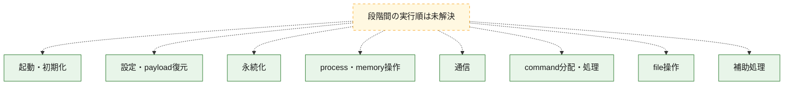
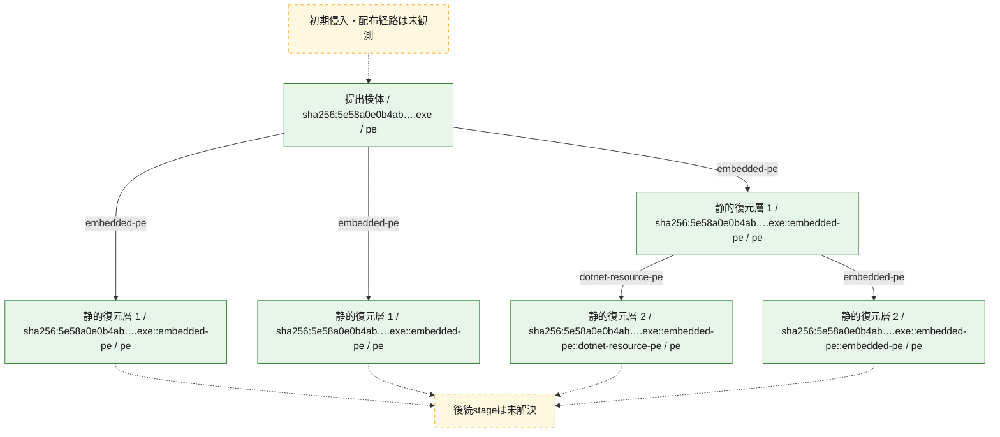
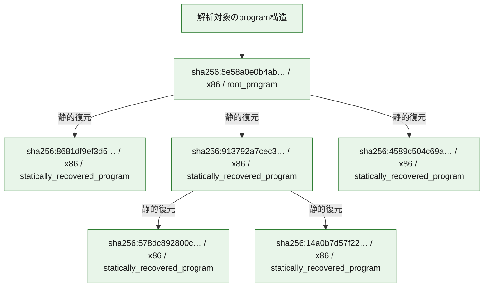

# 全体ロジック：5e58a0e0b4ab711349370567728293cf6e732870aa9ea9def6ae5b59ca7322c3

代表関数の静的証跡から、起動・初期化、設定・payload復元、永続化、process・memory操作、通信、command分配・処理、file操作の処理群を確認しました。

## 読み方

- phaseの掲載順は解析上の整理順です。observed_call_edgesがない段階間の実行順を断定しません。
- 図の実線は静的に観測した関係、点線と黄色のノードは未観測・未解決の関係を示します。
- 図は静的な要約であり、動的実行を再現するものではありません。
- 詳細な関数解説とfingerprintは[STATIC-LOGIC.md](STATIC-LOGIC.md)を参照してください。

## 静的可視化

### 実行フロー

### 感染チェーン

### モジュール関係

## 処理段階

### 1. 起動・初期化

entry pointから初期化と後続処理への移行を確認します。
確度: `confirmed_static_function_evidence`

- `8681df9ef3d507f277910a9ea228cae237192705e96ba17a45aea5b50949d6b2:cil:0x06000022` — 初期化と主要処理への分岐を行う入口関数です。 状態: `succeeded`、選定理由: `entry_point`, `reviewed_call_centrality:6`
- `578dc892800cb51c2ca872b33cb2bd3e6277aa7fe18e49f8d0fa5b926303ef6a:ghidra:140001000` — 初期化と主要処理への分岐を行う入口関数です。 状態: `succeeded`、選定理由: `entry_point`, `meaningful_symbol_name`, `reviewed_call_centrality:1`, `role:entrypoint`, `small_program_complete_context`
- `14a0b7d57f22378472a4e1d20fc50d38db5dab72d46007b472d466049181ab0b:ghidra:140001000` — 初期化と主要処理への分岐を行う入口関数です。 状態: `succeeded`、選定理由: `entry_point`, `meaningful_symbol_name`, `reviewed_call_centrality:1`, `role:entrypoint`, `small_program_complete_context`
- `913792a7cec3a062742f3390d7941a7e95aeeb7e1537e4a52590049d54c5c5e8:cil:0x06000001` — 初期化と主要処理への分岐を行う入口関数です。 状態: `succeeded`、選定理由: `entry_point`, `reviewed_call_centrality:24`, `small_program_complete_context`
- `5e58a0e0b4ab711349370567728293cf6e732870aa9ea9def6ae5b59ca7322c3:cil:0x06000002` — 初期化と主要処理への分岐を行う入口関数です。 状態: `succeeded`、選定理由: `entry_point`, `large_function:instructions=273`, `reviewed_call_centrality:56`, `small_program_complete_context`

### 2. 設定・payload復元

設定、resource、payload、暗号化データの復元・変換を確認します。
確度: `confirmed_static_function_evidence`

- `8681df9ef3d507f277910a9ea228cae237192705e96ba17a45aea5b50949d6b2:cil:0x06000001` — 暗号、hash、encoding、または復号処理に関係する関数です。 状態: `succeeded`、選定理由: `large_function:instructions=240`, `reviewed_call_centrality:16`, `role:cryptographic_transform`
- `8681df9ef3d507f277910a9ea228cae237192705e96ba17a45aea5b50949d6b2:cil:0x06000002` — 暗号、hash、encoding、または復号処理に関係する関数です。 状態: `succeeded`、選定理由: `reviewed_call_centrality:4`, `role:cryptographic_transform`
- `8681df9ef3d507f277910a9ea228cae237192705e96ba17a45aea5b50949d6b2:cil:0x06000003` — 暗号、hash、encoding、または復号処理に関係する関数です。 状態: `succeeded`、選定理由: `reviewed_call_centrality:12`, `role:cryptographic_transform`
- `8681df9ef3d507f277910a9ea228cae237192705e96ba17a45aea5b50949d6b2:cil:0x06000008` — 暗号、hash、encoding、または復号処理に関係する関数です。 状態: `succeeded`、選定理由: `large_function:instructions=150`, `reviewed_call_centrality:28`, `role:cryptographic_transform`
- `8681df9ef3d507f277910a9ea228cae237192705e96ba17a45aea5b50949d6b2:cil:0x06000009` — 暗号、hash、encoding、または復号処理に関係する関数です。 状態: `succeeded`、選定理由: `reviewed_call_centrality:12`, `role:cryptographic_transform`
- `8681df9ef3d507f277910a9ea228cae237192705e96ba17a45aea5b50949d6b2:cil:0x0600000a` — 暗号、hash、encoding、または復号処理に関係する関数です。 状態: `succeeded`、選定理由: `reviewed_call_centrality:18`, `role:cryptographic_transform`
- `8681df9ef3d507f277910a9ea228cae237192705e96ba17a45aea5b50949d6b2:cil:0x0600000b` — 暗号、hash、encoding、または復号処理に関係する関数です。 状態: `succeeded`、選定理由: `reviewed_call_centrality:12`, `role:cryptographic_transform`
- `8681df9ef3d507f277910a9ea228cae237192705e96ba17a45aea5b50949d6b2:cil:0x0600000c` — 暗号、hash、encoding、または復号処理に関係する関数です。 状態: `succeeded`、選定理由: `reviewed_call_centrality:28`, `role:cryptographic_transform`
- `8681df9ef3d507f277910a9ea228cae237192705e96ba17a45aea5b50949d6b2:cil:0x0600000d` — 暗号、hash、encoding、または復号処理に関係する関数です。 状態: `succeeded`、選定理由: `reviewed_call_centrality:28`, `role:cryptographic_transform`
- `8681df9ef3d507f277910a9ea228cae237192705e96ba17a45aea5b50949d6b2:cil:0x0600000e` — 暗号、hash、encoding、または復号処理に関係する関数です。 状態: `succeeded`、選定理由: `large_function:instructions=112`, `reviewed_call_centrality:10`, `role:cryptographic_transform`
- `8681df9ef3d507f277910a9ea228cae237192705e96ba17a45aea5b50949d6b2:cil:0x0600000f` — 暗号、hash、encoding、または復号処理に関係する関数です。 状態: `succeeded`、選定理由: `large_function:instructions=91`, `reviewed_call_centrality:8`, `role:cryptographic_transform`
- `8681df9ef3d507f277910a9ea228cae237192705e96ba17a45aea5b50949d6b2:cil:0x06000010` — 暗号、hash、encoding、または復号処理に関係する関数です。 状態: `succeeded`、選定理由: `reviewed_call_centrality:4`, `role:cryptographic_transform`
- `8681df9ef3d507f277910a9ea228cae237192705e96ba17a45aea5b50949d6b2:cil:0x06000011` — 暗号、hash、encoding、または復号処理に関係する関数です。 状態: `succeeded`、選定理由: `reviewed_call_centrality:4`, `role:cryptographic_transform`
- `8681df9ef3d507f277910a9ea228cae237192705e96ba17a45aea5b50949d6b2:cil:0x06000012` — 暗号、hash、encoding、または復号処理に関係する関数です。 状態: `succeeded`、選定理由: `reviewed_call_centrality:18`, `role:cryptographic_transform`
- `8681df9ef3d507f277910a9ea228cae237192705e96ba17a45aea5b50949d6b2:cil:0x06000013` — 暗号、hash、encoding、または復号処理に関係する関数です。 状態: `succeeded`、選定理由: `reviewed_call_centrality:18`, `role:cryptographic_transform`
- `8681df9ef3d507f277910a9ea228cae237192705e96ba17a45aea5b50949d6b2:cil:0x06000014` — 暗号、hash、encoding、または復号処理に関係する関数です。 状態: `succeeded`、選定理由: `reviewed_call_centrality:20`, `role:cryptographic_transform`
- `8681df9ef3d507f277910a9ea228cae237192705e96ba17a45aea5b50949d6b2:cil:0x06000015` — 暗号、hash、encoding、または復号処理に関係する関数です。 状態: `succeeded`、選定理由: `large_function:instructions=195`, `reviewed_call_centrality:26`, `role:cryptographic_transform`
- `8681df9ef3d507f277910a9ea228cae237192705e96ba17a45aea5b50949d6b2:cil:0x06000016` — 暗号、hash、encoding、または復号処理に関係する関数です。 状態: `succeeded`、選定理由: `reviewed_call_centrality:16`, `role:cryptographic_transform`
- `8681df9ef3d507f277910a9ea228cae237192705e96ba17a45aea5b50949d6b2:cil:0x06000017` — 暗号、hash、encoding、または復号処理に関係する関数です。 状態: `succeeded`、選定理由: `reviewed_call_centrality:20`, `role:cryptographic_transform`
- `8681df9ef3d507f277910a9ea228cae237192705e96ba17a45aea5b50949d6b2:cil:0x06000018` — 暗号、hash、encoding、または復号処理に関係する関数です。 状態: `succeeded`、選定理由: `reviewed_call_centrality:6`, `role:cryptographic_transform`
- `8681df9ef3d507f277910a9ea228cae237192705e96ba17a45aea5b50949d6b2:cil:0x06000019` — 暗号、hash、encoding、または復号処理に関係する関数です。 状態: `succeeded`、選定理由: `reviewed_call_centrality:4`, `role:cryptographic_transform`
- `8681df9ef3d507f277910a9ea228cae237192705e96ba17a45aea5b50949d6b2:cil:0x0600001b` — 暗号、hash、encoding、または復号処理に関係する関数です。 状態: `succeeded`、選定理由: `reviewed_call_centrality:10`, `role:cryptographic_transform`
- `8681df9ef3d507f277910a9ea228cae237192705e96ba17a45aea5b50949d6b2:cil:0x0600001c` — 暗号、hash、encoding、または復号処理に関係する関数です。 状態: `succeeded`、選定理由: `reviewed_call_centrality:10`, `role:cryptographic_transform`
- `8681df9ef3d507f277910a9ea228cae237192705e96ba17a45aea5b50949d6b2:cil:0x0600001d` — 暗号、hash、encoding、または復号処理に関係する関数です。 状態: `succeeded`、選定理由: `reviewed_call_centrality:14`, `role:cryptographic_transform`
- `8681df9ef3d507f277910a9ea228cae237192705e96ba17a45aea5b50949d6b2:cil:0x0600001e` — 暗号、hash、encoding、または復号処理に関係する関数です。 状態: `succeeded`、選定理由: `reviewed_call_centrality:14`, `role:cryptographic_transform`
- `8681df9ef3d507f277910a9ea228cae237192705e96ba17a45aea5b50949d6b2:cil:0x0600001f` — 暗号、hash、encoding、または復号処理に関係する関数です。 状態: `succeeded`、選定理由: `reviewed_call_centrality:12`, `role:cryptographic_transform`
- `8681df9ef3d507f277910a9ea228cae237192705e96ba17a45aea5b50949d6b2:cil:0x06000020` — 暗号、hash、encoding、または復号処理に関係する関数です。 状態: `succeeded`、選定理由: `reviewed_call_centrality:10`, `role:cryptographic_transform`
- `8681df9ef3d507f277910a9ea228cae237192705e96ba17a45aea5b50949d6b2:cil:0x06000025` — 設定、resource、payloadなどの解析・変換を行う関数です。 状態: `succeeded`、選定理由: `reviewed_call_centrality:6`, `role:config_or_data_transform`
- `913792a7cec3a062742f3390d7941a7e95aeeb7e1537e4a52590049d54c5c5e8:cil:0x0600000a` — 設定、resource、payloadなどの解析・変換を行う関数です。 状態: `succeeded`、選定理由: `large_function:instructions=80`, `reviewed_call_centrality:26`, `role:config_or_data_transform`, `small_program_complete_context`
- `913792a7cec3a062742f3390d7941a7e95aeeb7e1537e4a52590049d54c5c5e8:cil:0x0600000d` — 設定、resource、payloadなどの解析・変換を行う関数です。 状態: `succeeded`、選定理由: `large_function:instructions=91`, `reviewed_call_centrality:18`, `role:config_or_data_transform`, `small_program_complete_context`

### 3. 永続化

自動起動や永続化に関係する設定変更を確認します。
確度: `confirmed_static_function_evidence`

- `8681df9ef3d507f277910a9ea228cae237192705e96ba17a45aea5b50949d6b2:cil:0x06000021` — 自動起動または永続化に関係する処理を含む関数です。 状態: `succeeded`、選定理由: `reviewed_call_centrality:4`, `role:persistence`
- `578dc892800cb51c2ca872b33cb2bd3e6277aa7fe18e49f8d0fa5b926303ef6a:ghidra:140003cb0` — 自動起動または永続化に関係する処理を含む関数です。 状態: `succeeded`、選定理由: `context_representative`, `reviewed_call_centrality:8`, `role:persistence`, `small_program_complete_context`
- `14a0b7d57f22378472a4e1d20fc50d38db5dab72d46007b472d466049181ab0b:ghidra:140003cb0` — 自動起動または永続化に関係する処理を含む関数です。 状態: `succeeded`、選定理由: `context_representative`, `reviewed_call_centrality:8`, `role:persistence`, `small_program_complete_context`
- `913792a7cec3a062742f3390d7941a7e95aeeb7e1537e4a52590049d54c5c5e8:cil:0x06000007` — 自動起動または永続化に関係する処理を含む関数です。 状態: `succeeded`、選定理由: `reviewed_call_centrality:18`, `role:persistence`, `small_program_complete_context`
- `913792a7cec3a062742f3390d7941a7e95aeeb7e1537e4a52590049d54c5c5e8:cil:0x0600000c` — 自動起動または永続化に関係する処理を含む関数です。 状態: `succeeded`、選定理由: `reviewed_call_centrality:14`, `role:persistence`, `small_program_complete_context`

### 4. process・memory操作

process、thread、module、memory操作と実行移行を確認します。
確度: `confirmed_static_function_evidence`

- `578dc892800cb51c2ca872b33cb2bd3e6277aa7fe18e49f8d0fa5b926303ef6a:ghidra:1400013e0` — process、thread、module、またはmemory操作に関係する関数です。 状態: `succeeded`、選定理由: `context_representative`, `reviewed_call_centrality:51`, `role:process_or_memory_operation`, `small_program_complete_context`
- `578dc892800cb51c2ca872b33cb2bd3e6277aa7fe18e49f8d0fa5b926303ef6a:ghidra:140002220` — process、thread、module、またはmemory操作に関係する関数です。 状態: `succeeded`、選定理由: `context_representative`, `reviewed_call_centrality:8`, `role:process_or_memory_operation`, `small_program_complete_context`
- `578dc892800cb51c2ca872b33cb2bd3e6277aa7fe18e49f8d0fa5b926303ef6a:ghidra:140002400` — process、thread、module、またはmemory操作に関係する関数です。 状態: `succeeded`、選定理由: `context_representative`, `reviewed_call_centrality:11`, `role:process_or_memory_operation`, `small_program_complete_context`
- `14a0b7d57f22378472a4e1d20fc50d38db5dab72d46007b472d466049181ab0b:ghidra:1400013e0` — process、thread、module、またはmemory操作に関係する関数です。 状態: `succeeded`、選定理由: `context_representative`, `reviewed_call_centrality:51`, `role:process_or_memory_operation`, `small_program_complete_context`
- `14a0b7d57f22378472a4e1d20fc50d38db5dab72d46007b472d466049181ab0b:ghidra:140002220` — process、thread、module、またはmemory操作に関係する関数です。 状態: `succeeded`、選定理由: `context_representative`, `reviewed_call_centrality:8`, `role:process_or_memory_operation`, `small_program_complete_context`
- `14a0b7d57f22378472a4e1d20fc50d38db5dab72d46007b472d466049181ab0b:ghidra:140002400` — process、thread、module、またはmemory操作に関係する関数です。 状態: `succeeded`、選定理由: `context_representative`, `reviewed_call_centrality:11`, `role:process_or_memory_operation`, `small_program_complete_context`
- `913792a7cec3a062742f3390d7941a7e95aeeb7e1537e4a52590049d54c5c5e8:cil:0x06000009` — process、thread、module、またはmemory操作に関係する関数です。 状態: `succeeded`、選定理由: `reviewed_call_centrality:10`, `role:process_or_memory_operation`, `small_program_complete_context`

### 5. 通信

通信初期化、endpoint処理、送受信の役割を確認します。
確度: `confirmed_static_function_evidence`

- `8681df9ef3d507f277910a9ea228cae237192705e96ba17a45aea5b50949d6b2:cil:0x0600001a` — 通信初期化、送受信、またはendpoint処理に関係する関数です。 状態: `succeeded`、選定理由: `large_function:instructions=291`, `reviewed_call_centrality:8`, `role:network_communication`

### 6. command分配・処理

受信commandやtaskの解釈、分配、個別handlerへの移行を確認します。
確度: `confirmed_static_function_evidence_with_limits`

- `578dc892800cb51c2ca872b33cb2bd3e6277aa7fe18e49f8d0fa5b926303ef6a:ghidra:140001020` — commandの解釈、分配、または個別処理を担当する関数です。 状態: `succeeded`、選定理由: `context_representative`, `reviewed_call_centrality:32`, `role:command_dispatch_or_handler`, `small_program_complete_context`
- `578dc892800cb51c2ca872b33cb2bd3e6277aa7fe18e49f8d0fa5b926303ef6a:ghidra:140003400` — commandの解釈、分配、または個別処理を担当する関数です。 状態: `succeeded`、選定理由: `context_representative`, `reviewed_call_centrality:1`, `role:command_dispatch_or_handler`, `small_program_complete_context`
- `578dc892800cb51c2ca872b33cb2bd3e6277aa7fe18e49f8d0fa5b926303ef6a:ghidra:140003450` — commandの解釈、分配、または個別処理を担当する関数です。 状態: `limited_bad_instruction_or_flow`、選定理由: `context_representative`, `reviewed_call_centrality:3`, `role:command_dispatch_or_handler`, `small_program_complete_context`
- `578dc892800cb51c2ca872b33cb2bd3e6277aa7fe18e49f8d0fa5b926303ef6a:ghidra:1400034c0` — commandの解釈、分配、または個別処理を担当する関数です。 状態: `limited_bad_instruction_or_flow`、選定理由: `context_representative`, `reviewed_call_centrality:5`, `role:command_dispatch_or_handler`, `small_program_complete_context`
- `578dc892800cb51c2ca872b33cb2bd3e6277aa7fe18e49f8d0fa5b926303ef6a:ghidra:140003550` — commandの解釈、分配、または個別処理を担当する関数です。 状態: `limited_bad_instruction_or_flow`、選定理由: `context_representative`, `reviewed_call_centrality:3`, `role:command_dispatch_or_handler`, `small_program_complete_context`
- `578dc892800cb51c2ca872b33cb2bd3e6277aa7fe18e49f8d0fa5b926303ef6a:ghidra:1400036b0` — commandの解釈、分配、または個別処理を担当する関数です。 状態: `succeeded`、選定理由: `context_representative`, `reviewed_call_centrality:1`, `role:command_dispatch_or_handler`, `small_program_complete_context`
- `578dc892800cb51c2ca872b33cb2bd3e6277aa7fe18e49f8d0fa5b926303ef6a:ghidra:140003f60` — commandの解釈、分配、または個別処理を担当する関数です。 状態: `succeeded`、選定理由: `context_representative`, `reviewed_call_centrality:15`, `role:command_dispatch_or_handler`, `small_program_complete_context`
- `578dc892800cb51c2ca872b33cb2bd3e6277aa7fe18e49f8d0fa5b926303ef6a:ghidra:140004550` — commandの解釈、分配、または個別処理を担当する関数です。 状態: `limited_bad_instruction_or_flow`、選定理由: `meaningful_symbol_name`, `reviewed_call_centrality:7`, `role:command_dispatch_or_handler`, `small_program_complete_context`
- `14a0b7d57f22378472a4e1d20fc50d38db5dab72d46007b472d466049181ab0b:ghidra:140001020` — commandの解釈、分配、または個別処理を担当する関数です。 状態: `succeeded`、選定理由: `context_representative`, `reviewed_call_centrality:32`, `role:command_dispatch_or_handler`, `small_program_complete_context`
- `14a0b7d57f22378472a4e1d20fc50d38db5dab72d46007b472d466049181ab0b:ghidra:140003400` — commandの解釈、分配、または個別処理を担当する関数です。 状態: `succeeded`、選定理由: `context_representative`, `reviewed_call_centrality:1`, `role:command_dispatch_or_handler`, `small_program_complete_context`
- `14a0b7d57f22378472a4e1d20fc50d38db5dab72d46007b472d466049181ab0b:ghidra:140003450` — commandの解釈、分配、または個別処理を担当する関数です。 状態: `limited_bad_instruction_or_flow`、選定理由: `context_representative`, `reviewed_call_centrality:3`, `role:command_dispatch_or_handler`, `small_program_complete_context`
- `14a0b7d57f22378472a4e1d20fc50d38db5dab72d46007b472d466049181ab0b:ghidra:1400034c0` — commandの解釈、分配、または個別処理を担当する関数です。 状態: `limited_bad_instruction_or_flow`、選定理由: `context_representative`, `reviewed_call_centrality:5`, `role:command_dispatch_or_handler`, `small_program_complete_context`
- `14a0b7d57f22378472a4e1d20fc50d38db5dab72d46007b472d466049181ab0b:ghidra:140003550` — commandの解釈、分配、または個別処理を担当する関数です。 状態: `limited_bad_instruction_or_flow`、選定理由: `context_representative`, `reviewed_call_centrality:3`, `role:command_dispatch_or_handler`, `small_program_complete_context`
- `14a0b7d57f22378472a4e1d20fc50d38db5dab72d46007b472d466049181ab0b:ghidra:1400036b0` — commandの解釈、分配、または個別処理を担当する関数です。 状態: `succeeded`、選定理由: `context_representative`, `reviewed_call_centrality:1`, `role:command_dispatch_or_handler`, `small_program_complete_context`
- `14a0b7d57f22378472a4e1d20fc50d38db5dab72d46007b472d466049181ab0b:ghidra:140003f60` — commandの解釈、分配、または個別処理を担当する関数です。 状態: `succeeded`、選定理由: `context_representative`, `reviewed_call_centrality:15`, `role:command_dispatch_or_handler`, `small_program_complete_context`
- `14a0b7d57f22378472a4e1d20fc50d38db5dab72d46007b472d466049181ab0b:ghidra:140004550` — commandの解釈、分配、または個別処理を担当する関数です。 状態: `limited_bad_instruction_or_flow`、選定理由: `meaningful_symbol_name`, `reviewed_call_centrality:7`, `role:command_dispatch_or_handler`, `small_program_complete_context`
- `913792a7cec3a062742f3390d7941a7e95aeeb7e1537e4a52590049d54c5c5e8:cil:0x06000002` — commandの解釈、分配、または個別処理を担当する関数です。 状態: `succeeded`、選定理由: `large_function:instructions=235`, `reviewed_call_centrality:52`, `role:command_dispatch_or_handler`, `small_program_complete_context`
- `913792a7cec3a062742f3390d7941a7e95aeeb7e1537e4a52590049d54c5c5e8:cil:0x0600000b` — commandの解釈、分配、または個別処理を担当する関数です。 状態: `succeeded`、選定理由: `large_function:instructions=90`, `reviewed_call_centrality:28`, `role:command_dispatch_or_handler`, `small_program_complete_context`
- `5e58a0e0b4ab711349370567728293cf6e732870aa9ea9def6ae5b59ca7322c3:cil:0x06000003` — commandの解釈、分配、または個別処理を担当する関数です。 状態: `succeeded`、選定理由: `large_function:instructions=128`, `reviewed_call_centrality:22`, `role:command_dispatch_or_handler`, `small_program_complete_context`
- `5e58a0e0b4ab711349370567728293cf6e732870aa9ea9def6ae5b59ca7322c3:cil:0x06000004` — commandの解釈、分配、または個別処理を担当する関数です。 状態: `succeeded`、選定理由: `reviewed_call_centrality:16`, `role:command_dispatch_or_handler`, `small_program_complete_context`
- `5e58a0e0b4ab711349370567728293cf6e732870aa9ea9def6ae5b59ca7322c3:cil:0x06000005` — commandの解釈、分配、または個別処理を担当する関数です。 状態: `succeeded`、選定理由: `reviewed_call_centrality:2`, `role:command_dispatch_or_handler`, `small_program_complete_context`

### 7. file操作

fileやdirectoryの作成、読書き、削除を確認します。
確度: `confirmed_static_function_evidence`

- `913792a7cec3a062742f3390d7941a7e95aeeb7e1537e4a52590049d54c5c5e8:cil:0x06000003` — fileまたはdirectoryの読書き・管理に関係する関数です。 状態: `succeeded`、選定理由: `large_function:instructions=65`, `reviewed_call_centrality:2`, `role:file_operation`, `small_program_complete_context`
- `913792a7cec3a062742f3390d7941a7e95aeeb7e1537e4a52590049d54c5c5e8:cil:0x06000008` — fileまたはdirectoryの読書き・管理に関係する関数です。 状態: `succeeded`、選定理由: `reviewed_call_centrality:12`, `role:file_operation`, `small_program_complete_context`
- `913792a7cec3a062742f3390d7941a7e95aeeb7e1537e4a52590049d54c5c5e8:cil:0x0600000e` — fileまたはdirectoryの読書き・管理に関係する関数です。 状態: `succeeded`、選定理由: `reviewed_call_centrality:12`, `role:file_operation`, `small_program_complete_context`

### 8. 補助処理

主要処理を支える一般内部関数またはlibrary処理を確認します。
確度: `confirmed_static_function_evidence`

- `8681df9ef3d507f277910a9ea228cae237192705e96ba17a45aea5b50949d6b2:cil:0x0600002f` — 検体内部の一般処理を実装する関数です。 状態: `succeeded`、選定理由: `reviewed_call_centrality:16`
- `578dc892800cb51c2ca872b33cb2bd3e6277aa7fe18e49f8d0fa5b926303ef6a:ghidra:1400013a0` — 検体内部の一般処理を実装する関数です。 状態: `succeeded`、選定理由: `context_representative`, `reviewed_call_centrality:1`, `small_program_complete_context`
- `578dc892800cb51c2ca872b33cb2bd3e6277aa7fe18e49f8d0fa5b926303ef6a:ghidra:140001fa0` — 検体内部の一般処理を実装する関数です。 状態: `succeeded`、選定理由: `context_representative`, `reviewed_call_centrality:2`, `small_program_complete_context`
- `578dc892800cb51c2ca872b33cb2bd3e6277aa7fe18e49f8d0fa5b926303ef6a:ghidra:1400021c0` — 検体内部の一般処理を実装する関数です。 状態: `succeeded`、選定理由: `context_representative`, `reviewed_call_centrality:3`, `small_program_complete_context`
- `578dc892800cb51c2ca872b33cb2bd3e6277aa7fe18e49f8d0fa5b926303ef6a:ghidra:1400022b0` — 検体内部の一般処理を実装する関数です。 状態: `succeeded`、選定理由: `context_representative`, `reviewed_call_centrality:1`, `small_program_complete_context`
- `578dc892800cb51c2ca872b33cb2bd3e6277aa7fe18e49f8d0fa5b926303ef6a:ghidra:140002310` — 検体内部の一般処理を実装する関数です。 状態: `succeeded`、選定理由: `context_representative`, `reviewed_call_centrality:7`, `small_program_complete_context`
- `578dc892800cb51c2ca872b33cb2bd3e6277aa7fe18e49f8d0fa5b926303ef6a:ghidra:140003360` — compiler生成処理または汎用library処理とみられる関数です。 状態: `succeeded`、選定理由: `entry_point`, `meaningful_symbol_name`, `reviewed_call_centrality:3`, `small_program_complete_context`
- `578dc892800cb51c2ca872b33cb2bd3e6277aa7fe18e49f8d0fa5b926303ef6a:ghidra:140003720` — 検体内部の一般処理を実装する関数です。 状態: `succeeded`、選定理由: `context_representative`, `reviewed_call_centrality:2`, `small_program_complete_context`
- `578dc892800cb51c2ca872b33cb2bd3e6277aa7fe18e49f8d0fa5b926303ef6a:ghidra:140003790` — 検体内部の一般処理を実装する関数です。 状態: `succeeded`、選定理由: `context_representative`, `reviewed_call_centrality:4`, `small_program_complete_context`
- `578dc892800cb51c2ca872b33cb2bd3e6277aa7fe18e49f8d0fa5b926303ef6a:ghidra:140003aa0` — 検体内部の一般処理を実装する関数です。 状態: `succeeded`、選定理由: `context_representative`, `reviewed_call_centrality:11`, `small_program_complete_context`
- `578dc892800cb51c2ca872b33cb2bd3e6277aa7fe18e49f8d0fa5b926303ef6a:ghidra:140003c40` — 検体内部の一般処理を実装する関数です。 状態: `succeeded`、選定理由: `context_representative`, `reviewed_call_centrality:6`, `small_program_complete_context`
- `578dc892800cb51c2ca872b33cb2bd3e6277aa7fe18e49f8d0fa5b926303ef6a:ghidra:140003d90` — 検体内部の一般処理を実装する関数です。 状態: `succeeded`、選定理由: `meaningful_symbol_name`, `small_program_complete_context`
- `578dc892800cb51c2ca872b33cb2bd3e6277aa7fe18e49f8d0fa5b926303ef6a:ghidra:140003da0` — 検体内部の一般処理を実装する関数です。 状態: `succeeded`、選定理由: `context_representative`, `reviewed_call_centrality:7`, `small_program_complete_context`
- `578dc892800cb51c2ca872b33cb2bd3e6277aa7fe18e49f8d0fa5b926303ef6a:ghidra:140003e30` — 検体内部の一般処理を実装する関数です。 状態: `succeeded`、選定理由: `context_representative`, `reviewed_call_centrality:5`, `small_program_complete_context`
- `578dc892800cb51c2ca872b33cb2bd3e6277aa7fe18e49f8d0fa5b926303ef6a:ghidra:140003e60` — 検体内部の一般処理を実装する関数です。 状態: `succeeded`、選定理由: `context_representative`, `reviewed_call_centrality:5`, `small_program_complete_context`
- `578dc892800cb51c2ca872b33cb2bd3e6277aa7fe18e49f8d0fa5b926303ef6a:ghidra:140003ed0` — 検体内部の一般処理を実装する関数です。 状態: `succeeded`、選定理由: `context_representative`, `reviewed_call_centrality:5`, `small_program_complete_context`
- `578dc892800cb51c2ca872b33cb2bd3e6277aa7fe18e49f8d0fa5b926303ef6a:ghidra:140004100` — 検体内部の一般処理を実装する関数です。 状態: `succeeded`、選定理由: `context_representative`, `reviewed_call_centrality:5`, `small_program_complete_context`
- `578dc892800cb51c2ca872b33cb2bd3e6277aa7fe18e49f8d0fa5b926303ef6a:ghidra:1400041c0` — 検体内部の一般処理を実装する関数です。 状態: `succeeded`、選定理由: `context_representative`, `reviewed_call_centrality:2`, `small_program_complete_context`
- `578dc892800cb51c2ca872b33cb2bd3e6277aa7fe18e49f8d0fa5b926303ef6a:ghidra:140004420` — 検体内部の一般処理を実装する関数です。 状態: `succeeded`、選定理由: `context_representative`, `reviewed_call_centrality:1`, `small_program_complete_context`
- `578dc892800cb51c2ca872b33cb2bd3e6277aa7fe18e49f8d0fa5b926303ef6a:ghidra:140004510` — 検体内部の一般処理を実装する関数です。 状態: `succeeded`、選定理由: `context_representative`, `reviewed_call_centrality:3`, `small_program_complete_context`
- `14a0b7d57f22378472a4e1d20fc50d38db5dab72d46007b472d466049181ab0b:ghidra:1400013a0` — 検体内部の一般処理を実装する関数です。 状態: `succeeded`、選定理由: `context_representative`, `reviewed_call_centrality:1`, `small_program_complete_context`
- `14a0b7d57f22378472a4e1d20fc50d38db5dab72d46007b472d466049181ab0b:ghidra:140001fa0` — 検体内部の一般処理を実装する関数です。 状態: `succeeded`、選定理由: `context_representative`, `reviewed_call_centrality:2`, `small_program_complete_context`
- `14a0b7d57f22378472a4e1d20fc50d38db5dab72d46007b472d466049181ab0b:ghidra:1400021c0` — 検体内部の一般処理を実装する関数です。 状態: `succeeded`、選定理由: `context_representative`, `reviewed_call_centrality:3`, `small_program_complete_context`
- `14a0b7d57f22378472a4e1d20fc50d38db5dab72d46007b472d466049181ab0b:ghidra:1400022b0` — 検体内部の一般処理を実装する関数です。 状態: `succeeded`、選定理由: `context_representative`, `reviewed_call_centrality:1`, `small_program_complete_context`
- `14a0b7d57f22378472a4e1d20fc50d38db5dab72d46007b472d466049181ab0b:ghidra:140002310` — 検体内部の一般処理を実装する関数です。 状態: `succeeded`、選定理由: `context_representative`, `reviewed_call_centrality:7`, `small_program_complete_context`
- `14a0b7d57f22378472a4e1d20fc50d38db5dab72d46007b472d466049181ab0b:ghidra:140003360` — compiler生成処理または汎用library処理とみられる関数です。 状態: `succeeded`、選定理由: `entry_point`, `meaningful_symbol_name`, `reviewed_call_centrality:3`, `small_program_complete_context`
- `14a0b7d57f22378472a4e1d20fc50d38db5dab72d46007b472d466049181ab0b:ghidra:140003720` — 検体内部の一般処理を実装する関数です。 状態: `succeeded`、選定理由: `context_representative`, `reviewed_call_centrality:2`, `small_program_complete_context`
- `14a0b7d57f22378472a4e1d20fc50d38db5dab72d46007b472d466049181ab0b:ghidra:140003790` — 検体内部の一般処理を実装する関数です。 状態: `succeeded`、選定理由: `context_representative`, `reviewed_call_centrality:4`, `small_program_complete_context`
- `14a0b7d57f22378472a4e1d20fc50d38db5dab72d46007b472d466049181ab0b:ghidra:140003aa0` — 検体内部の一般処理を実装する関数です。 状態: `succeeded`、選定理由: `context_representative`, `reviewed_call_centrality:11`, `small_program_complete_context`
- `14a0b7d57f22378472a4e1d20fc50d38db5dab72d46007b472d466049181ab0b:ghidra:140003c40` — 検体内部の一般処理を実装する関数です。 状態: `succeeded`、選定理由: `context_representative`, `reviewed_call_centrality:6`, `small_program_complete_context`
- `14a0b7d57f22378472a4e1d20fc50d38db5dab72d46007b472d466049181ab0b:ghidra:140003d90` — 検体内部の一般処理を実装する関数です。 状態: `succeeded`、選定理由: `meaningful_symbol_name`, `small_program_complete_context`
- `14a0b7d57f22378472a4e1d20fc50d38db5dab72d46007b472d466049181ab0b:ghidra:140003da0` — 検体内部の一般処理を実装する関数です。 状態: `succeeded`、選定理由: `context_representative`, `reviewed_call_centrality:7`, `small_program_complete_context`
- `14a0b7d57f22378472a4e1d20fc50d38db5dab72d46007b472d466049181ab0b:ghidra:140003e30` — 検体内部の一般処理を実装する関数です。 状態: `succeeded`、選定理由: `context_representative`, `reviewed_call_centrality:5`, `small_program_complete_context`
- `14a0b7d57f22378472a4e1d20fc50d38db5dab72d46007b472d466049181ab0b:ghidra:140003e60` — 検体内部の一般処理を実装する関数です。 状態: `succeeded`、選定理由: `context_representative`, `reviewed_call_centrality:5`, `small_program_complete_context`
- `14a0b7d57f22378472a4e1d20fc50d38db5dab72d46007b472d466049181ab0b:ghidra:140003ed0` — 検体内部の一般処理を実装する関数です。 状態: `succeeded`、選定理由: `context_representative`, `reviewed_call_centrality:5`, `small_program_complete_context`
- `14a0b7d57f22378472a4e1d20fc50d38db5dab72d46007b472d466049181ab0b:ghidra:140004100` — 検体内部の一般処理を実装する関数です。 状態: `succeeded`、選定理由: `context_representative`, `reviewed_call_centrality:5`, `small_program_complete_context`
- `14a0b7d57f22378472a4e1d20fc50d38db5dab72d46007b472d466049181ab0b:ghidra:1400041c0` — 検体内部の一般処理を実装する関数です。 状態: `succeeded`、選定理由: `context_representative`, `reviewed_call_centrality:2`, `small_program_complete_context`
- `14a0b7d57f22378472a4e1d20fc50d38db5dab72d46007b472d466049181ab0b:ghidra:140004420` — 検体内部の一般処理を実装する関数です。 状態: `succeeded`、選定理由: `context_representative`, `reviewed_call_centrality:1`, `small_program_complete_context`
- `14a0b7d57f22378472a4e1d20fc50d38db5dab72d46007b472d466049181ab0b:ghidra:140004510` — 検体内部の一般処理を実装する関数です。 状態: `succeeded`、選定理由: `context_representative`, `reviewed_call_centrality:3`, `small_program_complete_context`
- `913792a7cec3a062742f3390d7941a7e95aeeb7e1537e4a52590049d54c5c5e8:cil:0x06000006` — 検体内部の一般処理を実装する関数です。 状態: `succeeded`、選定理由: `reviewed_call_centrality:4`, `small_program_complete_context`
- `913792a7cec3a062742f3390d7941a7e95aeeb7e1537e4a52590049d54c5c5e8:cil:0x0600000f` — 検体内部の一般処理を実装する関数です。 状態: `succeeded`、選定理由: `reviewed_call_centrality:2`, `small_program_complete_context`
- `913792a7cec3a062742f3390d7941a7e95aeeb7e1537e4a52590049d54c5c5e8:cil:0x06000010` — 検体内部の一般処理を実装する関数です。 状態: `succeeded`、選定理由: `reviewed_call_centrality:6`, `small_program_complete_context`

## 観測したcall関係

- 代表関数間で直接解決できた呼出関係はありません。

## 解析範囲と制約

- 選定外関数は全体inventoryへ残しますが、関数本体の個別解説対象にはしていません。
- indirect call、難読化、packer、VM、壊れたcontrol flowによりcall関係が欠落する場合があります。
- 文書は静的解析に基づき、検体実行や外部通信による動的確認は行っていません。
