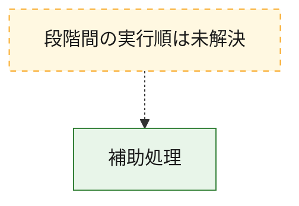
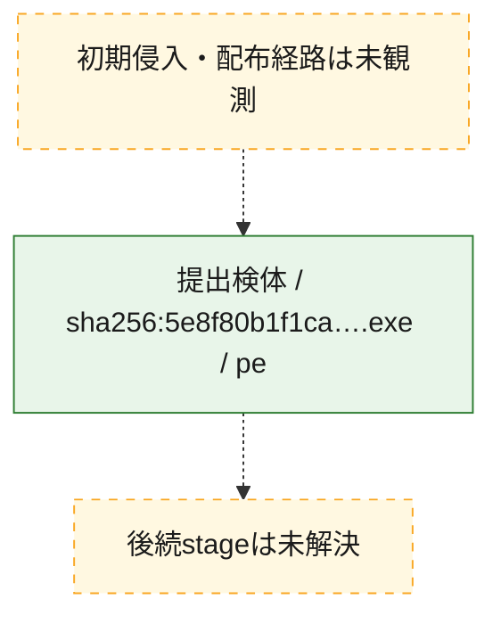
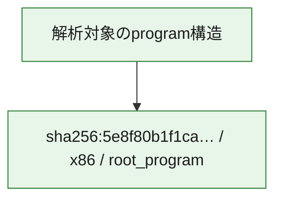

# 全体ロジック：5e8f80b1f1ca440b118f5a04d81c2a7ce516e5514328103084cd0ff08bb1329f

代表関数から主要なmalware処理段階を自動分類できませんでした。

## 読み方

- phaseの掲載順は解析上の整理順です。observed_call_edgesがない段階間の実行順を断定しません。
- 図の実線は静的に観測した関係、点線と黄色のノードは未観測・未解決の関係を示します。
- 図は静的な要約であり、動的実行を再現するものではありません。
- 詳細な関数解説とfingerprintは[STATIC-LOGIC.md](STATIC-LOGIC.md)を参照してください。

## 静的可視化

### 実行フロー

### 感染チェーン

### モジュール関係

## 処理段階

### 1. 補助処理

主要処理を支える一般内部関数またはlibrary処理を確認します。
確度: `confirmed_static_function_evidence_with_limits`

- `5e8f80b1f1ca440b118f5a04d81c2a7ce516e5514328103084cd0ff08bb1329f:ghidra:140001594` — 検体内部の一般処理を実装する関数です。 状態: `limited_bad_instruction_or_flow`、選定理由: `context_representative`, `reviewed_call_centrality:1`
- `5e8f80b1f1ca440b118f5a04d81c2a7ce516e5514328103084cd0ff08bb1329f:ghidra:1400015b0` — 検体内部の一般処理を実装する関数です。 状態: `limited_bad_instruction_or_flow`、選定理由: `context_representative`, `reviewed_call_centrality:1`
- `5e8f80b1f1ca440b118f5a04d81c2a7ce516e5514328103084cd0ff08bb1329f:ghidra:1400016c8` — 検体内部の一般処理を実装する関数です。 状態: `limited_bad_instruction_or_flow`、選定理由: `context_representative`, `reviewed_call_centrality:1`
- `5e8f80b1f1ca440b118f5a04d81c2a7ce516e5514328103084cd0ff08bb1329f:ghidra:1400017ac` — 検体内部の一般処理を実装する関数です。 状態: `limited_bad_instruction_or_flow`、選定理由: `context_representative`, `reviewed_call_centrality:1`
- `5e8f80b1f1ca440b118f5a04d81c2a7ce516e5514328103084cd0ff08bb1329f:ghidra:140001a70` — 検体内部の一般処理を実装する関数です。 状態: `limited_bad_instruction_or_flow`、選定理由: `context_representative`, `reviewed_call_centrality:1`
- `5e8f80b1f1ca440b118f5a04d81c2a7ce516e5514328103084cd0ff08bb1329f:ghidra:140001ca0` — 検体内部の一般処理を実装する関数です。 状態: `limited_bad_instruction_or_flow`、選定理由: `context_representative`, `reviewed_call_centrality:1`
- `5e8f80b1f1ca440b118f5a04d81c2a7ce516e5514328103084cd0ff08bb1329f:ghidra:140001df4` — 検体内部の一般処理を実装する関数です。 状態: `limited_bad_instruction_or_flow`、選定理由: `context_representative`, `reviewed_call_centrality:1`
- `5e8f80b1f1ca440b118f5a04d81c2a7ce516e5514328103084cd0ff08bb1329f:ghidra:14000235c` — 検体内部の一般処理を実装する関数です。 状態: `limited_bad_instruction_or_flow`、選定理由: `context_representative`, `reviewed_call_centrality:1`
- `5e8f80b1f1ca440b118f5a04d81c2a7ce516e5514328103084cd0ff08bb1329f:ghidra:1400023f4` — 検体内部の一般処理を実装する関数です。 状態: `limited_bad_instruction_or_flow`、選定理由: `context_representative`, `reviewed_call_centrality:1`
- `5e8f80b1f1ca440b118f5a04d81c2a7ce516e5514328103084cd0ff08bb1329f:ghidra:140002488` — 検体内部の一般処理を実装する関数です。 状態: `limited_bad_instruction_or_flow`、選定理由: `context_representative`, `reviewed_call_centrality:1`
- `5e8f80b1f1ca440b118f5a04d81c2a7ce516e5514328103084cd0ff08bb1329f:ghidra:14000253c` — 検体内部の一般処理を実装する関数です。 状態: `limited_bad_instruction_or_flow`、選定理由: `context_representative`, `reviewed_call_centrality:1`
- `5e8f80b1f1ca440b118f5a04d81c2a7ce516e5514328103084cd0ff08bb1329f:ghidra:14000296c` — 検体内部の一般処理を実装する関数です。 状態: `limited_bad_instruction_or_flow`、選定理由: `context_representative`, `reviewed_call_centrality:1`
- `5e8f80b1f1ca440b118f5a04d81c2a7ce516e5514328103084cd0ff08bb1329f:ghidra:140002b28` — 検体内部の一般処理を実装する関数です。 状態: `limited_bad_instruction_or_flow`、選定理由: `context_representative`, `reviewed_call_centrality:1`
- `5e8f80b1f1ca440b118f5a04d81c2a7ce516e5514328103084cd0ff08bb1329f:ghidra:140002c10` — 検体内部の一般処理を実装する関数です。 状態: `limited_bad_instruction_or_flow`、選定理由: `context_representative`, `reviewed_call_centrality:1`
- `5e8f80b1f1ca440b118f5a04d81c2a7ce516e5514328103084cd0ff08bb1329f:ghidra:140002c98` — 検体内部の一般処理を実装する関数です。 状態: `limited_bad_instruction_or_flow`、選定理由: `context_representative`, `reviewed_call_centrality:1`
- `5e8f80b1f1ca440b118f5a04d81c2a7ce516e5514328103084cd0ff08bb1329f:ghidra:140002f08` — 検体内部の一般処理を実装する関数です。 状態: `limited_bad_instruction_or_flow`、選定理由: `context_representative`, `reviewed_call_centrality:1`
- `5e8f80b1f1ca440b118f5a04d81c2a7ce516e5514328103084cd0ff08bb1329f:ghidra:1400031b8` — 検体内部の一般処理を実装する関数です。 状態: `limited_bad_instruction_or_flow`、選定理由: `context_representative`, `reviewed_call_centrality:1`
- `5e8f80b1f1ca440b118f5a04d81c2a7ce516e5514328103084cd0ff08bb1329f:ghidra:140003678` — 検体内部の一般処理を実装する関数です。 状態: `limited_bad_instruction_or_flow`、選定理由: `context_representative`, `reviewed_call_centrality:1`
- `5e8f80b1f1ca440b118f5a04d81c2a7ce516e5514328103084cd0ff08bb1329f:ghidra:1400037d0` — 検体内部の一般処理を実装する関数です。 状態: `limited_bad_instruction_or_flow`、選定理由: `context_representative`, `reviewed_call_centrality:1`
- `5e8f80b1f1ca440b118f5a04d81c2a7ce516e5514328103084cd0ff08bb1329f:ghidra:140003804` — 検体内部の一般処理を実装する関数です。 状態: `limited_bad_instruction_or_flow`、選定理由: `context_representative`, `reviewed_call_centrality:1`
- `5e8f80b1f1ca440b118f5a04d81c2a7ce516e5514328103084cd0ff08bb1329f:ghidra:140003838` — 検体内部の一般処理を実装する関数です。 状態: `limited_bad_instruction_or_flow`、選定理由: `context_representative`, `reviewed_call_centrality:1`
- `5e8f80b1f1ca440b118f5a04d81c2a7ce516e5514328103084cd0ff08bb1329f:ghidra:1400039f8` — 検体内部の一般処理を実装する関数です。 状態: `limited_bad_instruction_or_flow`、選定理由: `context_representative`, `reviewed_call_centrality:1`
- `5e8f80b1f1ca440b118f5a04d81c2a7ce516e5514328103084cd0ff08bb1329f:ghidra:140004500` — 検体内部の一般処理を実装する関数です。 状態: `limited_bad_instruction_or_flow`、選定理由: `context_representative`, `reviewed_call_centrality:1`
- `5e8f80b1f1ca440b118f5a04d81c2a7ce516e5514328103084cd0ff08bb1329f:ghidra:1400046f4` — 検体内部の一般処理を実装する関数です。 状態: `limited_bad_instruction_or_flow`、選定理由: `context_representative`, `reviewed_call_centrality:1`
- `5e8f80b1f1ca440b118f5a04d81c2a7ce516e5514328103084cd0ff08bb1329f:ghidra:140004914` — 検体内部の一般処理を実装する関数です。 状態: `limited_bad_instruction_or_flow`、選定理由: `context_representative`, `reviewed_call_centrality:1`
- `5e8f80b1f1ca440b118f5a04d81c2a7ce516e5514328103084cd0ff08bb1329f:ghidra:1400054dc` — 検体内部の一般処理を実装する関数です。 状態: `limited_bad_instruction_or_flow`、選定理由: `context_representative`, `reviewed_call_centrality:1`
- `5e8f80b1f1ca440b118f5a04d81c2a7ce516e5514328103084cd0ff08bb1329f:ghidra:14000577c` — 検体内部の一般処理を実装する関数です。 状態: `limited_bad_instruction_or_flow`、選定理由: `context_representative`, `reviewed_call_centrality:1`
- `5e8f80b1f1ca440b118f5a04d81c2a7ce516e5514328103084cd0ff08bb1329f:ghidra:14000590c` — 検体内部の一般処理を実装する関数です。 状態: `limited_bad_instruction_or_flow`、選定理由: `context_representative`, `reviewed_call_centrality:1`
- `5e8f80b1f1ca440b118f5a04d81c2a7ce516e5514328103084cd0ff08bb1329f:ghidra:140005b30` — 検体内部の一般処理を実装する関数です。 状態: `limited_bad_instruction_or_flow`、選定理由: `context_representative`, `reviewed_call_centrality:1`
- `5e8f80b1f1ca440b118f5a04d81c2a7ce516e5514328103084cd0ff08bb1329f:ghidra:140005d74` — 検体内部の一般処理を実装する関数です。 状態: `limited_bad_instruction_or_flow`、選定理由: `context_representative`, `reviewed_call_centrality:1`
- `5e8f80b1f1ca440b118f5a04d81c2a7ce516e5514328103084cd0ff08bb1329f:ghidra:140005ebc` — 検体内部の一般処理を実装する関数です。 状態: `limited_bad_instruction_or_flow`、選定理由: `context_representative`, `reviewed_call_centrality:1`
- `5e8f80b1f1ca440b118f5a04d81c2a7ce516e5514328103084cd0ff08bb1329f:ghidra:1400060c8` — 検体内部の一般処理を実装する関数です。 状態: `limited_bad_instruction_or_flow`、選定理由: `context_representative`, `reviewed_call_centrality:1`

## 観測したcall関係

- `ghidra-function:06ce5cf9b3d110b132716e94` → `ghidra-external:ab31bdec043add9a2d3ca6f5` （`unclassified` → `unclassified`）
- `ghidra-function:1a3f8c47724629566ae03273` → `ghidra-external:ab31bdec043add9a2d3ca6f5` （`unclassified` → `unclassified`）
- `ghidra-function:2db547231078139a00e3169d` → `ghidra-external:ab31bdec043add9a2d3ca6f5` （`unclassified` → `unclassified`）
- `ghidra-function:34add79b5b3aad2da3d0441f` → `ghidra-external:ab31bdec043add9a2d3ca6f5` （`unclassified` → `unclassified`）
- `ghidra-function:376a51d1429f0b22f9502ca2` → `ghidra-external:ab31bdec043add9a2d3ca6f5` （`unclassified` → `unclassified`）
- `ghidra-function:4bcebc958e696c565bfa1678` → `ghidra-external:ab31bdec043add9a2d3ca6f5` （`unclassified` → `unclassified`）
- `ghidra-function:509a99dd88df8aaeabbf4d4b` → `ghidra-external:ab31bdec043add9a2d3ca6f5` （`unclassified` → `unclassified`）
- `ghidra-function:53e557ce4460d53f82b1bcab` → `ghidra-external:ab31bdec043add9a2d3ca6f5` （`unclassified` → `unclassified`）
- `ghidra-function:6242436d82dd9e39e4bf28c5` → `ghidra-external:ab31bdec043add9a2d3ca6f5` （`unclassified` → `unclassified`）
- `ghidra-function:64307139781e8d8f00875738` → `ghidra-external:ab31bdec043add9a2d3ca6f5` （`unclassified` → `unclassified`）
- `ghidra-function:6728854d49888195f9e590e2` → `ghidra-external:ab31bdec043add9a2d3ca6f5` （`unclassified` → `unclassified`）
- `ghidra-function:6fcec6f74482e0ddacbb952e` → `ghidra-external:ab31bdec043add9a2d3ca6f5` （`unclassified` → `unclassified`）
- `ghidra-function:782195cacdaad8ebde5958e0` → `ghidra-external:ab31bdec043add9a2d3ca6f5` （`unclassified` → `unclassified`）
- `ghidra-function:789f2225fcfeb0b8a313edbd` → `ghidra-external:ab31bdec043add9a2d3ca6f5` （`unclassified` → `unclassified`）
- `ghidra-function:7b9a051338b9e28b723b2c48` → `ghidra-external:ab31bdec043add9a2d3ca6f5` （`unclassified` → `unclassified`）
- `ghidra-function:7dcf24ce3e98113f77acd208` → `ghidra-external:ab31bdec043add9a2d3ca6f5` （`unclassified` → `unclassified`）
- `ghidra-function:8abee6f57569fe7404ae3321` → `ghidra-external:ab31bdec043add9a2d3ca6f5` （`unclassified` → `unclassified`）
- `ghidra-function:a3d6325c8a465233158d52b1` → `ghidra-external:ab31bdec043add9a2d3ca6f5` （`unclassified` → `unclassified`）
- `ghidra-function:a538b9f2af014c5528cae729` → `ghidra-external:ab31bdec043add9a2d3ca6f5` （`unclassified` → `unclassified`）
- `ghidra-function:a93730765ff2c9161db1801d` → `ghidra-external:ab31bdec043add9a2d3ca6f5` （`unclassified` → `unclassified`）
- `ghidra-function:b5155e7b2fd4061974095cd6` → `ghidra-external:ab31bdec043add9a2d3ca6f5` （`unclassified` → `unclassified`）
- `ghidra-function:b96b1da825091fac77e2e13d` → `ghidra-external:ab31bdec043add9a2d3ca6f5` （`unclassified` → `unclassified`）
- `ghidra-function:c167d797580e813e1ee4a29b` → `ghidra-external:ab31bdec043add9a2d3ca6f5` （`unclassified` → `unclassified`）
- `ghidra-function:de2687734f65da1d82c3a48e` → `ghidra-external:ab31bdec043add9a2d3ca6f5` （`unclassified` → `unclassified`）
- `ghidra-function:de7eb3e0c26f13160525eb30` → `ghidra-external:ab31bdec043add9a2d3ca6f5` （`unclassified` → `unclassified`）
- `ghidra-function:df0acca868eaa10d0daf489d` → `ghidra-external:ab31bdec043add9a2d3ca6f5` （`unclassified` → `unclassified`）
- `ghidra-function:e3e1239545f3a8b80c46f694` → `ghidra-external:ab31bdec043add9a2d3ca6f5` （`unclassified` → `unclassified`）
- `ghidra-function:e5641a774f9313a9efb8b129` → `ghidra-external:ab31bdec043add9a2d3ca6f5` （`unclassified` → `unclassified`）
- `ghidra-function:e7f513b3ce4dc540eec381c6` → `ghidra-external:ab31bdec043add9a2d3ca6f5` （`unclassified` → `unclassified`）
- `ghidra-function:efb035f0a7a4246f9b1e697d` → `ghidra-external:ab31bdec043add9a2d3ca6f5` （`unclassified` → `unclassified`）
- `ghidra-function:f19891a1b149278bb6482880` → `ghidra-external:ab31bdec043add9a2d3ca6f5` （`unclassified` → `unclassified`）
- `ghidra-function:fc376da777cb56ff43a949b4` → `ghidra-external:ab31bdec043add9a2d3ca6f5` （`unclassified` → `unclassified`）

## 解析範囲と制約

- 選定外関数は全体inventoryへ残しますが、関数本体の個別解説対象にはしていません。
- indirect call、難読化、packer、VM、壊れたcontrol flowによりcall関係が欠落する場合があります。
- 文書は静的解析に基づき、検体実行や外部通信による動的確認は行っていません。
