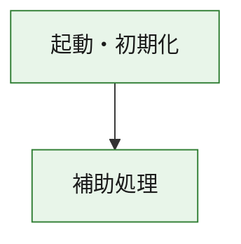
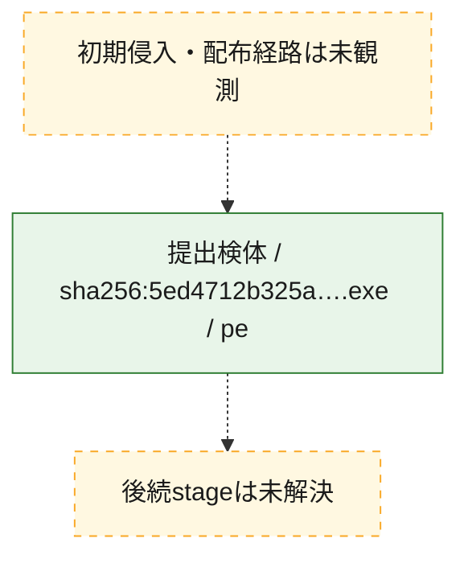
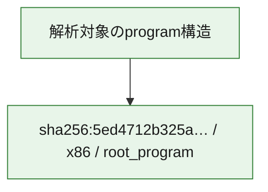

# 全体ロジック：5ed4712b325abc3235849565f65c2a4009f536be5eaf274f19601cdb565ae708

代表関数の静的証跡から、起動・初期化の処理群を確認しました。

## 読み方

- phaseの掲載順は解析上の整理順です。observed_call_edgesがない段階間の実行順を断定しません。
- 図の実線は静的に観測した関係、点線と黄色のノードは未観測・未解決の関係を示します。
- 図は静的な要約であり、動的実行を再現するものではありません。
- 詳細な関数解説とfingerprintは[STATIC-LOGIC.md](STATIC-LOGIC.md)を参照してください。

## 静的可視化

### 実行フロー

### 感染チェーン

### モジュール関係

## 処理段階

### 1. 起動・初期化

entry pointから初期化と後続処理への移行を確認します。
確度: `confirmed_static_function_evidence`

- `5ed4712b325abc3235849565f65c2a4009f536be5eaf274f19601cdb565ae708:ghidra:180001010` — 初期化と主要処理への分岐を行う入口関数です。 状態: `succeeded`、選定理由: `entry_point`, `meaningful_symbol_name`, `reviewed_call_centrality:22`, `role:entrypoint`, `small_program_complete_context`

### 2. 補助処理

主要処理を支える一般内部関数またはlibrary処理を確認します。
確度: `confirmed_static_function_evidence`

- `5ed4712b325abc3235849565f65c2a4009f536be5eaf274f19601cdb565ae708:ghidra:180001240` — 検体内部の一般処理を実装する関数です。 状態: `succeeded`、選定理由: `context_representative`, `reviewed_call_centrality:2`, `small_program_complete_context`
- `5ed4712b325abc3235849565f65c2a4009f536be5eaf274f19601cdb565ae708:ghidra:180001350` — 検体内部の一般処理を実装する関数です。 状態: `succeeded`、選定理由: `context_representative`, `reviewed_call_centrality:25`, `small_program_complete_context`
- `5ed4712b325abc3235849565f65c2a4009f536be5eaf274f19601cdb565ae708:ghidra:180003780` — 検体内部の一般処理を実装する関数です。 状態: `succeeded`、選定理由: `context_representative`, `reviewed_call_centrality:2`, `small_program_complete_context`
- `5ed4712b325abc3235849565f65c2a4009f536be5eaf274f19601cdb565ae708:ghidra:1800038e0` — 検体内部の一般処理を実装する関数です。 状態: `succeeded`、選定理由: `context_representative`, `reviewed_call_centrality:2`, `small_program_complete_context`

## 観測したcall関係

- `5ed4712b325abc3235849565f65c2a4009f536be5eaf274f19601cdb565ae708:ghidra:180001010` → `5ed4712b325abc3235849565f65c2a4009f536be5eaf274f19601cdb565ae708:ghidra:180001240` （`startup` → `support`）
- `5ed4712b325abc3235849565f65c2a4009f536be5eaf274f19601cdb565ae708:ghidra:180001010` → `5ed4712b325abc3235849565f65c2a4009f536be5eaf274f19601cdb565ae708:ghidra:180001350` （`startup` → `support`）
- `5ed4712b325abc3235849565f65c2a4009f536be5eaf274f19601cdb565ae708:ghidra:180001350` → `5ed4712b325abc3235849565f65c2a4009f536be5eaf274f19601cdb565ae708:ghidra:180001240` （`support` → `support`）
- `5ed4712b325abc3235849565f65c2a4009f536be5eaf274f19601cdb565ae708:ghidra:180001350` → `5ed4712b325abc3235849565f65c2a4009f536be5eaf274f19601cdb565ae708:ghidra:180003780` （`support` → `support`）
- `5ed4712b325abc3235849565f65c2a4009f536be5eaf274f19601cdb565ae708:ghidra:180001350` → `5ed4712b325abc3235849565f65c2a4009f536be5eaf274f19601cdb565ae708:ghidra:1800038e0` （`support` → `support`）
- `5ed4712b325abc3235849565f65c2a4009f536be5eaf274f19601cdb565ae708:ghidra:180003780` → `5ed4712b325abc3235849565f65c2a4009f536be5eaf274f19601cdb565ae708:ghidra:1800038e0` （`support` → `support`）
- `ghidra-function:24eecb19345682201e84a396` → `ghidra-external:130ab79ac7a90fcb6b93d6b4` （`unclassified` → `unclassified`）
- `ghidra-function:24eecb19345682201e84a396` → `ghidra-external:19b60b78f0bd995cc029caa4` （`unclassified` → `unclassified`）
- `ghidra-function:24eecb19345682201e84a396` → `ghidra-external:2521b49404714f5336936bdd` （`unclassified` → `unclassified`）
- `ghidra-function:24eecb19345682201e84a396` → `ghidra-external:264eed408d62a4a3ec3ac7ac` （`unclassified` → `unclassified`）
- `ghidra-function:24eecb19345682201e84a396` → `ghidra-external:38423fe24a94cff7e2db2029` （`unclassified` → `unclassified`）
- `ghidra-function:24eecb19345682201e84a396` → `ghidra-external:3d733854a6328a32778d3144` （`unclassified` → `unclassified`）
- `ghidra-function:24eecb19345682201e84a396` → `ghidra-external:48eccc3e688748c13eaaa118` （`unclassified` → `unclassified`）
- `ghidra-function:24eecb19345682201e84a396` → `ghidra-external:54ff5bed53702e5e0187828e` （`unclassified` → `unclassified`）
- `ghidra-function:24eecb19345682201e84a396` → `ghidra-external:563d237cfa321fe4862c241c` （`unclassified` → `unclassified`）
- `ghidra-function:24eecb19345682201e84a396` → `ghidra-external:644b3ed72e529957cdae50cc` （`unclassified` → `unclassified`）
- `ghidra-function:24eecb19345682201e84a396` → `ghidra-external:683d038941a5e2c7e965a48c` （`unclassified` → `unclassified`）
- `ghidra-function:24eecb19345682201e84a396` → `ghidra-external:86b27e8a247d86b5295017a2` （`unclassified` → `unclassified`）
- `ghidra-function:24eecb19345682201e84a396` → `ghidra-external:919c881fced8b509ef2e019a` （`unclassified` → `unclassified`）
- `ghidra-function:24eecb19345682201e84a396` → `ghidra-external:99583fdae9fbf493d8236782` （`unclassified` → `unclassified`）
- `ghidra-function:24eecb19345682201e84a396` → `ghidra-external:bafdbae0e88b61cb2b90ed06` （`unclassified` → `unclassified`）
- `ghidra-function:24eecb19345682201e84a396` → `ghidra-external:c97b00fb4560432961cd030e` （`unclassified` → `unclassified`）
- `ghidra-function:24eecb19345682201e84a396` → `ghidra-external:d46bcdaf21a70075ce28479d` （`unclassified` → `unclassified`）
- `ghidra-function:24eecb19345682201e84a396` → `ghidra-external:e5e60917bb9e3f699b913acc` （`unclassified` → `unclassified`）
- `ghidra-function:24eecb19345682201e84a396` → `ghidra-external:ebf5cdb1591f675d35dbe5a7` （`unclassified` → `unclassified`）
- `ghidra-function:24eecb19345682201e84a396` → `ghidra-external:ee8bb657f566a43a3cce8a3d` （`unclassified` → `unclassified`）
- `ghidra-function:24eecb19345682201e84a396` → `ghidra-external:fff53b0c32de0cf0aa2247a1` （`unclassified` → `unclassified`）
- `ghidra-function:24eecb19345682201e84a396` → `ghidra-function:1ab4dce4893ba5ca5a03ef54` （`unclassified` → `unclassified`）
- `ghidra-function:24eecb19345682201e84a396` → `ghidra-function:a1f68f7c7a9b9c393d1d22c8` （`unclassified` → `unclassified`）
- `ghidra-function:24eecb19345682201e84a396` → `ghidra-function:f5889e0a144812f897d9e857` （`unclassified` → `unclassified`）
- `ghidra-function:4bf807df35a47216ebb85a84` → `ghidra-function:072631fef8928cd36cf76ee7` （`unclassified` → `unclassified`）
- `ghidra-function:4bf807df35a47216ebb85a84` → `ghidra-function:1ab4dce4893ba5ca5a03ef54` （`unclassified` → `unclassified`）
- `ghidra-function:4bf807df35a47216ebb85a84` → `ghidra-function:24eecb19345682201e84a396` （`unclassified` → `unclassified`）
- `ghidra-function:4bf807df35a47216ebb85a84` → `ghidra-function:2ae7bfef1791bfca4b2b01ed` （`unclassified` → `unclassified`）
- `ghidra-function:4bf807df35a47216ebb85a84` → `ghidra-function:4846853bc8ce2d89dbe8871e` （`unclassified` → `unclassified`）
- `ghidra-function:4bf807df35a47216ebb85a84` → `ghidra-function:86eadeae81b501c8945c137c` （`unclassified` → `unclassified`）
- `ghidra-function:4bf807df35a47216ebb85a84` → `ghidra-function:a5e11435f24805db037426ca` （`unclassified` → `unclassified`）
- `ghidra-function:4bf807df35a47216ebb85a84` → `ghidra-function:b9c46e9f44ca6f5b31fb0ae5` （`unclassified` → `unclassified`）
- `ghidra-function:4bf807df35a47216ebb85a84` → `ghidra-function:baf66be0466642f74e845102` （`unclassified` → `unclassified`）
- `ghidra-function:4bf807df35a47216ebb85a84` → `ghidra-function:cc269905e4b2cbe3724bc7dd` （`unclassified` → `unclassified`）
- `ghidra-function:4bf807df35a47216ebb85a84` → `ghidra-function:dc38b35461de6cedae260979` （`unclassified` → `unclassified`）
- `ghidra-function:4bf807df35a47216ebb85a84` → `ghidra-function:fc0224732061a313fda17ae0` （`unclassified` → `unclassified`）
- `ghidra-function:f5889e0a144812f897d9e857` → `ghidra-function:a1f68f7c7a9b9c393d1d22c8` （`unclassified` → `unclassified`）

## 解析範囲と制約

- 選定外関数は全体inventoryへ残しますが、関数本体の個別解説対象にはしていません。
- indirect call、難読化、packer、VM、壊れたcontrol flowによりcall関係が欠落する場合があります。
- 文書は静的解析に基づき、検体実行や外部通信による動的確認は行っていません。
