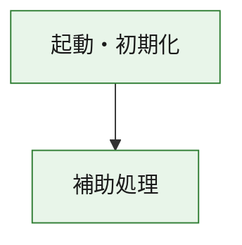
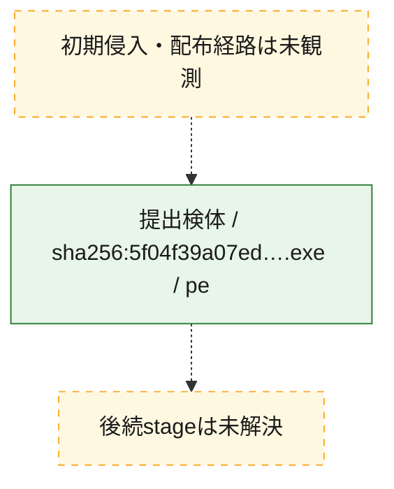
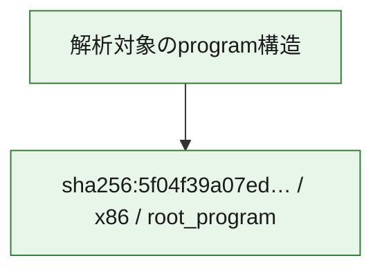

# 全体ロジック：5f04f39a07ed991da76365b31de23c3c85d84dbdf2c32d47101a0df02b3267bb

代表関数の静的証跡から、起動・初期化の処理群を確認しました。

## 読み方

- phaseの掲載順は解析上の整理順です。observed_call_edgesがない段階間の実行順を断定しません。
- 図の実線は静的に観測した関係、点線と黄色のノードは未観測・未解決の関係を示します。
- 図は静的な要約であり、動的実行を再現するものではありません。
- 詳細な関数解説とfingerprintは[STATIC-LOGIC.md](STATIC-LOGIC.md)を参照してください。

## 静的可視化

### 実行フロー

### 感染チェーン

### モジュール関係

## 処理段階

### 1. 起動・初期化

entry pointから初期化と後続処理への移行を確認します。
確度: `confirmed_static_function_evidence`

- `5f04f39a07ed991da76365b31de23c3c85d84dbdf2c32d47101a0df02b3267bb:ghidra:180001010` — 初期化と主要処理への分岐を行う入口関数です。 状態: `succeeded`、選定理由: `entry_point`, `meaningful_symbol_name`, `reviewed_call_centrality:22`, `role:entrypoint`, `small_program_complete_context`

### 2. 補助処理

主要処理を支える一般内部関数またはlibrary処理を確認します。
確度: `confirmed_static_function_evidence`

- `5f04f39a07ed991da76365b31de23c3c85d84dbdf2c32d47101a0df02b3267bb:ghidra:180001240` — 検体内部の一般処理を実装する関数です。 状態: `succeeded`、選定理由: `context_representative`, `reviewed_call_centrality:2`, `small_program_complete_context`
- `5f04f39a07ed991da76365b31de23c3c85d84dbdf2c32d47101a0df02b3267bb:ghidra:180001350` — 検体内部の一般処理を実装する関数です。 状態: `succeeded`、選定理由: `context_representative`, `reviewed_call_centrality:25`, `small_program_complete_context`
- `5f04f39a07ed991da76365b31de23c3c85d84dbdf2c32d47101a0df02b3267bb:ghidra:180003780` — 検体内部の一般処理を実装する関数です。 状態: `succeeded`、選定理由: `context_representative`, `reviewed_call_centrality:2`, `small_program_complete_context`
- `5f04f39a07ed991da76365b31de23c3c85d84dbdf2c32d47101a0df02b3267bb:ghidra:1800038e0` — 検体内部の一般処理を実装する関数です。 状態: `succeeded`、選定理由: `context_representative`, `reviewed_call_centrality:2`, `small_program_complete_context`

## 観測したcall関係

- `5f04f39a07ed991da76365b31de23c3c85d84dbdf2c32d47101a0df02b3267bb:ghidra:180001010` → `5f04f39a07ed991da76365b31de23c3c85d84dbdf2c32d47101a0df02b3267bb:ghidra:180001240` （`startup` → `support`）
- `5f04f39a07ed991da76365b31de23c3c85d84dbdf2c32d47101a0df02b3267bb:ghidra:180001010` → `5f04f39a07ed991da76365b31de23c3c85d84dbdf2c32d47101a0df02b3267bb:ghidra:180001350` （`startup` → `support`）
- `5f04f39a07ed991da76365b31de23c3c85d84dbdf2c32d47101a0df02b3267bb:ghidra:180001350` → `5f04f39a07ed991da76365b31de23c3c85d84dbdf2c32d47101a0df02b3267bb:ghidra:180001240` （`support` → `support`）
- `5f04f39a07ed991da76365b31de23c3c85d84dbdf2c32d47101a0df02b3267bb:ghidra:180001350` → `5f04f39a07ed991da76365b31de23c3c85d84dbdf2c32d47101a0df02b3267bb:ghidra:180003780` （`support` → `support`）
- `5f04f39a07ed991da76365b31de23c3c85d84dbdf2c32d47101a0df02b3267bb:ghidra:180001350` → `5f04f39a07ed991da76365b31de23c3c85d84dbdf2c32d47101a0df02b3267bb:ghidra:1800038e0` （`support` → `support`）
- `5f04f39a07ed991da76365b31de23c3c85d84dbdf2c32d47101a0df02b3267bb:ghidra:180003780` → `5f04f39a07ed991da76365b31de23c3c85d84dbdf2c32d47101a0df02b3267bb:ghidra:1800038e0` （`support` → `support`）
- `ghidra-function:6362157e4bf4ed7a423e6366` → `ghidra-function:060899d48c710f1e02dbbfff` （`unclassified` → `unclassified`）
- `ghidra-function:6362157e4bf4ed7a423e6366` → `ghidra-function:161927d075c411f7250f14e5` （`unclassified` → `unclassified`）
- `ghidra-function:6362157e4bf4ed7a423e6366` → `ghidra-function:32cbda2f4cc0e17198b7a18f` （`unclassified` → `unclassified`）
- `ghidra-function:6362157e4bf4ed7a423e6366` → `ghidra-function:351a82c55cd4799095439d3b` （`unclassified` → `unclassified`）
- `ghidra-function:6362157e4bf4ed7a423e6366` → `ghidra-function:448b6a4f45ad1ab111c72d22` （`unclassified` → `unclassified`）
- `ghidra-function:6362157e4bf4ed7a423e6366` → `ghidra-function:5cd3cd20d39e45c9b699809a` （`unclassified` → `unclassified`）
- `ghidra-function:6362157e4bf4ed7a423e6366` → `ghidra-function:5f0f80b46bc7a3312e17ca09` （`unclassified` → `unclassified`）
- `ghidra-function:6362157e4bf4ed7a423e6366` → `ghidra-function:80daeb5581fd110aeb559620` （`unclassified` → `unclassified`）
- `ghidra-function:6362157e4bf4ed7a423e6366` → `ghidra-function:bdea3b17edfe6444481c7897` （`unclassified` → `unclassified`）
- `ghidra-function:6362157e4bf4ed7a423e6366` → `ghidra-function:d7a2f23efe62d4bb4011f349` （`unclassified` → `unclassified`）
- `ghidra-function:6362157e4bf4ed7a423e6366` → `ghidra-function:da9a5d0b3526449f0c75e237` （`unclassified` → `unclassified`）
- `ghidra-function:6362157e4bf4ed7a423e6366` → `ghidra-function:ebf8adfd441c6efe81851a99` （`unclassified` → `unclassified`）
- `ghidra-function:d7a2f23efe62d4bb4011f349` → `ghidra-external:05a2412b605edd3fc04aed76` （`unclassified` → `unclassified`）
- `ghidra-function:d7a2f23efe62d4bb4011f349` → `ghidra-external:2371c182200331214d7204c2` （`unclassified` → `unclassified`）
- `ghidra-function:d7a2f23efe62d4bb4011f349` → `ghidra-external:38dc2fd2d04212109362b7bc` （`unclassified` → `unclassified`）
- `ghidra-function:d7a2f23efe62d4bb4011f349` → `ghidra-external:3a0186b605b5f9b03426c7dd` （`unclassified` → `unclassified`）
- `ghidra-function:d7a2f23efe62d4bb4011f349` → `ghidra-external:47f10011ee1c35dd7bccfd16` （`unclassified` → `unclassified`）
- `ghidra-function:d7a2f23efe62d4bb4011f349` → `ghidra-external:4e1c659b04bd574df5258010` （`unclassified` → `unclassified`）
- `ghidra-function:d7a2f23efe62d4bb4011f349` → `ghidra-external:4e52f629ecb76cd285cd319c` （`unclassified` → `unclassified`）
- `ghidra-function:d7a2f23efe62d4bb4011f349` → `ghidra-external:58a4634eaa7a1fc9b66a7499` （`unclassified` → `unclassified`）
- `ghidra-function:d7a2f23efe62d4bb4011f349` → `ghidra-external:5d205700bea69eeeb260e56a` （`unclassified` → `unclassified`）
- `ghidra-function:d7a2f23efe62d4bb4011f349` → `ghidra-external:6c7c977e674d75ac02ce3a9c` （`unclassified` → `unclassified`）
- `ghidra-function:d7a2f23efe62d4bb4011f349` → `ghidra-external:70ad9b3f630aeeb795798507` （`unclassified` → `unclassified`）
- `ghidra-function:d7a2f23efe62d4bb4011f349` → `ghidra-external:7c0757ccb911b3c3523ac695` （`unclassified` → `unclassified`）
- `ghidra-function:d7a2f23efe62d4bb4011f349` → `ghidra-external:8b378ab045294224d6c4feec` （`unclassified` → `unclassified`）
- `ghidra-function:d7a2f23efe62d4bb4011f349` → `ghidra-external:9c2f4f201279db029933742a` （`unclassified` → `unclassified`）
- `ghidra-function:d7a2f23efe62d4bb4011f349` → `ghidra-external:a6650195174113df269bfc7a` （`unclassified` → `unclassified`）
- `ghidra-function:d7a2f23efe62d4bb4011f349` → `ghidra-external:cc62ef777ffe71b67efd4d46` （`unclassified` → `unclassified`）
- `ghidra-function:d7a2f23efe62d4bb4011f349` → `ghidra-external:d6699baf794aebd15590ed17` （`unclassified` → `unclassified`）
- `ghidra-function:d7a2f23efe62d4bb4011f349` → `ghidra-external:d8a8746fe1809f8e0ba6b17f` （`unclassified` → `unclassified`）
- `ghidra-function:d7a2f23efe62d4bb4011f349` → `ghidra-external:e6b610bd4cef182a2bb385a5` （`unclassified` → `unclassified`）
- `ghidra-function:d7a2f23efe62d4bb4011f349` → `ghidra-external:edc3c596ae15f5a290cbf374` （`unclassified` → `unclassified`）
- `ghidra-function:d7a2f23efe62d4bb4011f349` → `ghidra-external:f37f73acec65899cad2f1049` （`unclassified` → `unclassified`）
- `ghidra-function:d7a2f23efe62d4bb4011f349` → `ghidra-function:b9fb5088a094e164f771e816` （`unclassified` → `unclassified`）
- `ghidra-function:d7a2f23efe62d4bb4011f349` → `ghidra-function:e1c3c8b125afa0e9be23c438` （`unclassified` → `unclassified`）
- `ghidra-function:d7a2f23efe62d4bb4011f349` → `ghidra-function:ebf8adfd441c6efe81851a99` （`unclassified` → `unclassified`）
- `ghidra-function:e1c3c8b125afa0e9be23c438` → `ghidra-function:b9fb5088a094e164f771e816` （`unclassified` → `unclassified`）

## 解析範囲と制約

- 選定外関数は全体inventoryへ残しますが、関数本体の個別解説対象にはしていません。
- indirect call、難読化、packer、VM、壊れたcontrol flowによりcall関係が欠落する場合があります。
- 文書は静的解析に基づき、検体実行や外部通信による動的確認は行っていません。
