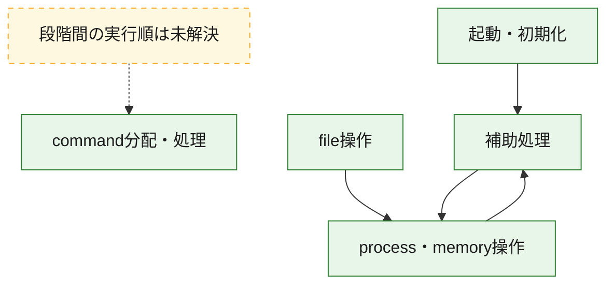
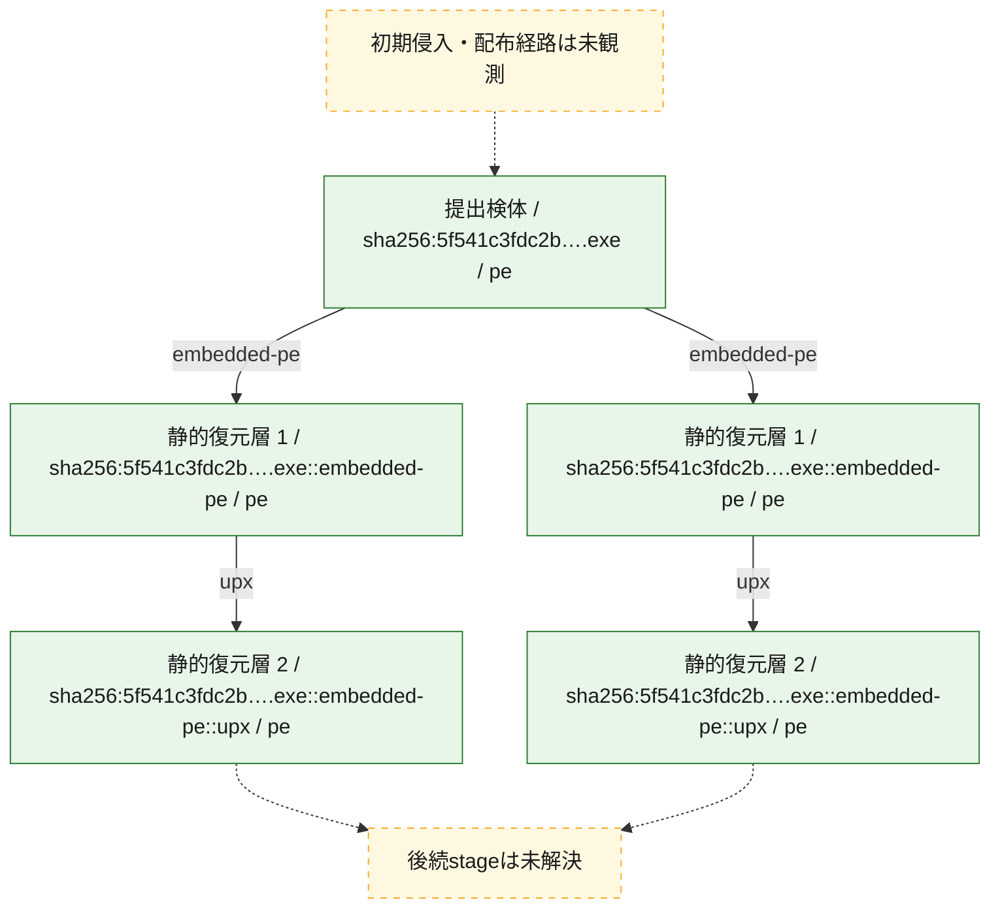
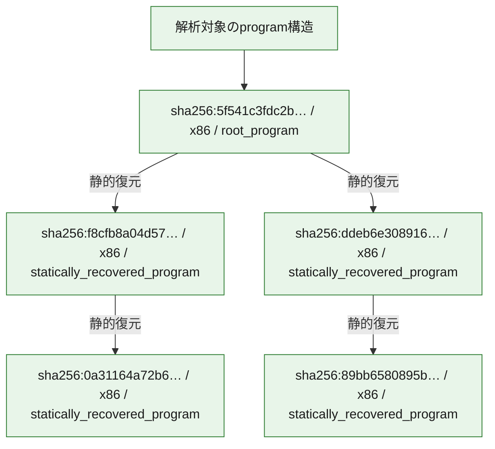

# 全体ロジック：5f541c3fdc2b5ca0b0aca6c054bfaa59af62180d250ff88ae06ec9cf9c42341e

代表関数の静的証跡から、起動・初期化、process・memory操作、command分配・処理、file操作の処理群を確認しました。

## 読み方

- phaseの掲載順は解析上の整理順です。observed_call_edgesがない段階間の実行順を断定しません。
- 図の実線は静的に観測した関係、点線と黄色のノードは未観測・未解決の関係を示します。
- 図は静的な要約であり、動的実行を再現するものではありません。
- 詳細な関数解説とfingerprintは[STATIC-LOGIC.md](STATIC-LOGIC.md)を参照してください。

## 静的可視化

### 実行フロー

### 感染チェーン

### モジュール関係

## 処理段階

### 1. 起動・初期化

entry pointから初期化と後続処理への移行を確認します。
確度: `confirmed_static_function_evidence`

- `0a31164a72b6a72b2dc1374f4ee18c07228aae58a3dcc73f0d65cd168761f0d3:ghidra:00493c3b` — 初期化と主要処理への分岐を行う入口関数です。 状態: `succeeded`、選定理由: `call_graph_centrality:in=0,out=16`, `entry_point`, `large_function:instructions=81`, `meaningful_symbol_name`, `reviewed_call_centrality:16`, `reviewed_call_centrality:20`, `role:entrypoint`
- `5f541c3fdc2b5ca0b0aca6c054bfaa59af62180d250ff88ae06ec9cf9c42341e:ghidra:00424c39` — 初期化と主要処理への分岐を行う入口関数です。 状態: `succeeded`、選定理由: `call_graph_centrality:in=0,out=16`, `entry_point`, `large_function:instructions=81`, `meaningful_symbol_name`, `reviewed_call_centrality:16`, `reviewed_call_centrality:20`, `role:entrypoint`
- `89bb6580895bc7c808b207571fafa917b20262606afe1cf7cfc4e6fd4ec7d26e:ghidra:101e6625` — 初期化と主要処理への分岐を行う入口関数です。 状態: `succeeded`、選定理由: `entry_point`, `large_function:instructions=73`, `meaningful_symbol_name`, `reviewed_call_centrality:2`, `role:entrypoint`, `small_program_complete_context`

### 2. process・memory操作

process、thread、module、memory操作と実行移行を確認します。
確度: `confirmed_static_function_evidence_with_limits`

- `0a31164a72b6a72b2dc1374f4ee18c07228aae58a3dcc73f0d65cd168761f0d3:ghidra:00443fa0` — process、thread、module、またはmemory操作に関係する関数です。 状態: `succeeded`、選定理由: `call_graph_centrality:in=1,out=11`, `large_function:instructions=287`, `reviewed_call_centrality:12`, `reviewed_call_centrality:15`, `role:process_or_memory_operation`
- `0a31164a72b6a72b2dc1374f4ee18c07228aae58a3dcc73f0d65cd168761f0d3:ghidra:00444910` — process、thread、module、またはmemory操作に関係する関数です。 状態: `succeeded`、選定理由: `call_graph_centrality:in=1,out=19`, `large_function:instructions=310`, `reviewed_call_centrality:21`, `reviewed_call_centrality:27`, `role:process_or_memory_operation`
- `0a31164a72b6a72b2dc1374f4ee18c07228aae58a3dcc73f0d65cd168761f0d3:ghidra:0044c0d0` — process、thread、module、またはmemory操作に関係する関数です。 状態: `succeeded`、選定理由: `call_graph_centrality:in=1,out=10`, `large_function:instructions=93`, `reviewed_call_centrality:11`, `reviewed_call_centrality:19`, `role:process_or_memory_operation`
- `0a31164a72b6a72b2dc1374f4ee18c07228aae58a3dcc73f0d65cd168761f0d3:ghidra:004687a0` — process、thread、module、またはmemory操作に関係する関数です。 状態: `succeeded`、選定理由: `call_graph_centrality:in=2,out=2`, `reviewed_call_centrality:4`, `reviewed_call_centrality:6`, `role:process_or_memory_operation`
- `0a31164a72b6a72b2dc1374f4ee18c07228aae58a3dcc73f0d65cd168761f0d3:ghidra:0046ab70` — process、thread、module、またはmemory操作に関係する関数です。 状態: `succeeded`、選定理由: `call_graph_centrality:in=3,out=19`, `large_function:instructions=331`, `reviewed_call_centrality:23`, `reviewed_call_centrality:30`, `role:process_or_memory_operation`
- `0a31164a72b6a72b2dc1374f4ee18c07228aae58a3dcc73f0d65cd168761f0d3:ghidra:0049cc0a` — process、thread、module、またはmemory操作に関係する関数です。 状態: `succeeded`、選定理由: `call_graph_centrality:in=1,out=4`, `reviewed_call_centrality:5`, `reviewed_call_centrality:9`, `role:process_or_memory_operation`
- `0a31164a72b6a72b2dc1374f4ee18c07228aae58a3dcc73f0d65cd168761f0d3:ghidra:0049ccbb` — process、thread、module、またはmemory操作に関係する関数です。 状態: `succeeded`、選定理由: `call_graph_centrality:in=1,out=1`, `large_function:instructions=85`, `reviewed_call_centrality:2`, `reviewed_call_centrality:3`, `role:process_or_memory_operation`
- `0a31164a72b6a72b2dc1374f4ee18c07228aae58a3dcc73f0d65cd168761f0d3:ghidra:0049d0ac` — process、thread、module、またはmemory操作に関係する関数です。 状態: `failed_empty`、選定理由: `call_graph_centrality:in=2,out=5`, `large_function:instructions=102`, `reviewed_call_centrality:11`, `reviewed_call_centrality:7`, `role:process_or_memory_operation`
- `0a31164a72b6a72b2dc1374f4ee18c07228aae58a3dcc73f0d65cd168761f0d3:ghidra:0049d3a4` — process、thread、module、またはmemory操作に関係する関数です。 状態: `succeeded`、選定理由: `call_graph_centrality:in=3,out=4`, `large_function:instructions=180`, `reviewed_call_centrality:7`, `reviewed_call_centrality:8`, `role:process_or_memory_operation`
- `0a31164a72b6a72b2dc1374f4ee18c07228aae58a3dcc73f0d65cd168761f0d3:ghidra:004a013f` — process、thread、module、またはmemory操作に関係する関数です。 状態: `succeeded`、選定理由: `call_graph_centrality:in=1,out=2`, `reviewed_call_centrality:3`, `reviewed_call_centrality:5`, `role:process_or_memory_operation`
- `0a31164a72b6a72b2dc1374f4ee18c07228aae58a3dcc73f0d65cd168761f0d3:ghidra:004a7f12` — process、thread、module、またはmemory操作に関係する関数です。 状態: `succeeded`、選定理由: `call_graph_centrality:in=1,out=5`, `reviewed_call_centrality:11`, `reviewed_call_centrality:6`, `role:process_or_memory_operation`
- `5f541c3fdc2b5ca0b0aca6c054bfaa59af62180d250ff88ae06ec9cf9c42341e:ghidra:004293c7` — process、thread、module、またはmemory操作に関係する関数です。 状態: `succeeded`、選定理由: `call_graph_centrality:in=1,out=4`, `reviewed_call_centrality:5`, `reviewed_call_centrality:9`, `role:process_or_memory_operation`
- `5f541c3fdc2b5ca0b0aca6c054bfaa59af62180d250ff88ae06ec9cf9c42341e:ghidra:00429478` — process、thread、module、またはmemory操作に関係する関数です。 状態: `succeeded`、選定理由: `call_graph_centrality:in=1,out=1`, `large_function:instructions=85`, `reviewed_call_centrality:2`, `reviewed_call_centrality:3`, `role:process_or_memory_operation`
- `5f541c3fdc2b5ca0b0aca6c054bfaa59af62180d250ff88ae06ec9cf9c42341e:ghidra:00429869` — process、thread、module、またはmemory操作に関係する関数です。 状態: `succeeded`、選定理由: `call_graph_centrality:in=2,out=5`, `large_function:instructions=102`, `reviewed_call_centrality:11`, `reviewed_call_centrality:7`, `role:process_or_memory_operation`
- `5f541c3fdc2b5ca0b0aca6c054bfaa59af62180d250ff88ae06ec9cf9c42341e:ghidra:00429b61` — process、thread、module、またはmemory操作に関係する関数です。 状態: `succeeded`、選定理由: `call_graph_centrality:in=2,out=4`, `large_function:instructions=180`, `reviewed_call_centrality:6`, `reviewed_call_centrality:7`, `role:process_or_memory_operation`
- `5f541c3fdc2b5ca0b0aca6c054bfaa59af62180d250ff88ae06ec9cf9c42341e:ghidra:0042cf1b` — process、thread、module、またはmemory操作に関係する関数です。 状態: `succeeded`、選定理由: `call_graph_centrality:in=1,out=2`, `reviewed_call_centrality:3`, `reviewed_call_centrality:5`, `role:process_or_memory_operation`

### 3. command分配・処理

受信commandやtaskの解釈、分配、個別handlerへの移行を確認します。
確度: `confirmed_static_function_evidence`

- `0a31164a72b6a72b2dc1374f4ee18c07228aae58a3dcc73f0d65cd168761f0d3:ghidra:0043b160` — commandの解釈、分配、または個別処理を担当する関数です。 状態: `succeeded`、選定理由: `call_graph_centrality:in=1,out=11`, `large_function:instructions=130`, `reviewed_call_centrality:12`, `reviewed_call_centrality:16`, `role:command_dispatch_or_handler`

### 4. file操作

fileやdirectoryの作成、読書き、削除を確認します。
確度: `confirmed_static_function_evidence_with_limits`

- `0a31164a72b6a72b2dc1374f4ee18c07228aae58a3dcc73f0d65cd168761f0d3:ghidra:0043a760` — fileまたはdirectoryの読書き・管理に関係する関数です。 状態: `succeeded`、選定理由: `call_graph_centrality:in=0,out=9`, `large_function:instructions=114`, `reviewed_call_centrality:13`, `reviewed_call_centrality:9`, `role:file_operation`
- `0a31164a72b6a72b2dc1374f4ee18c07228aae58a3dcc73f0d65cd168761f0d3:ghidra:0044ca50` — fileまたはdirectoryの読書き・管理に関係する関数です。 状態: `succeeded`、選定理由: `call_graph_centrality:in=0,out=2`, `reviewed_call_centrality:2`, `reviewed_call_centrality:4`, `role:file_operation`
- `0a31164a72b6a72b2dc1374f4ee18c07228aae58a3dcc73f0d65cd168761f0d3:ghidra:00498cfd` — fileまたはdirectoryの読書き・管理に関係する関数です。 状態: `succeeded`、選定理由: `call_graph_centrality:in=4,out=8`, `large_function:instructions=100`, `reviewed_call_centrality:12`, `reviewed_call_centrality:15`, `role:file_operation`
- `0a31164a72b6a72b2dc1374f4ee18c07228aae58a3dcc73f0d65cd168761f0d3:ghidra:0049e738` — fileまたはdirectoryの読書き・管理に関係する関数です。 状態: `succeeded`、選定理由: `call_graph_centrality:in=1,out=6`, `large_function:instructions=135`, `reviewed_call_centrality:7`, `reviewed_call_centrality:9`, `role:file_operation`
- `0a31164a72b6a72b2dc1374f4ee18c07228aae58a3dcc73f0d65cd168761f0d3:ghidra:0049e928` — fileまたはdirectoryの読書き・管理に関係する関数です。 状態: `succeeded`、選定理由: `call_graph_centrality:in=1,out=6`, `large_function:instructions=170`, `reviewed_call_centrality:7`, `reviewed_call_centrality:9`, `role:file_operation`
- `0a31164a72b6a72b2dc1374f4ee18c07228aae58a3dcc73f0d65cd168761f0d3:ghidra:004a4860` — fileまたはdirectoryの読書き・管理に関係する関数です。 状態: `succeeded`、選定理由: `call_graph_centrality:in=10,out=6`, `large_function:instructions=107`, `reviewed_call_centrality:16`, `reviewed_call_centrality:18`, `role:file_operation`
- `0a31164a72b6a72b2dc1374f4ee18c07228aae58a3dcc73f0d65cd168761f0d3:ghidra:004a497d` — fileまたはdirectoryの読書き・管理に関係する関数です。 状態: `succeeded`、選定理由: `call_graph_centrality:in=2,out=3`, `reviewed_call_centrality:5`, `reviewed_call_centrality:7`, `role:file_operation`
- `0a31164a72b6a72b2dc1374f4ee18c07228aae58a3dcc73f0d65cd168761f0d3:ghidra:004a49b7` — fileまたはdirectoryの読書き・管理に関係する関数です。 状態: `failed_empty`、選定理由: `call_graph_centrality:in=3,out=4`, `reviewed_call_centrality:7`, `reviewed_call_centrality:9`, `role:file_operation`
- `0a31164a72b6a72b2dc1374f4ee18c07228aae58a3dcc73f0d65cd168761f0d3:ghidra:004a4b8c` — fileまたはdirectoryの読書き・管理に関係する関数です。 状態: `succeeded`、選定理由: `call_graph_centrality:in=1,out=10`, `large_function:instructions=72`, `reviewed_call_centrality:11`, `reviewed_call_centrality:18`, `role:file_operation`
- `5f541c3fdc2b5ca0b0aca6c054bfaa59af62180d250ff88ae06ec9cf9c42341e:ghidra:00427d05` — fileまたはdirectoryの読書き・管理に関係する関数です。 状態: `succeeded`、選定理由: `call_graph_centrality:in=4,out=8`, `large_function:instructions=100`, `reviewed_call_centrality:12`, `reviewed_call_centrality:15`, `role:file_operation`

### 5. 補助処理

主要処理を支える一般内部関数またはlibrary処理を確認します。
確度: `confirmed_static_function_evidence_with_limits`

- `0a31164a72b6a72b2dc1374f4ee18c07228aae58a3dcc73f0d65cd168761f0d3:ghidra:00417cf9` — 検体内部の一般処理を実装する関数です。 状態: `succeeded`、選定理由: `call_graph_centrality:in=37,out=13`, `large_function:instructions=170`, `reviewed_call_centrality:50`, `reviewed_call_centrality:51`
- `0a31164a72b6a72b2dc1374f4ee18c07228aae58a3dcc73f0d65cd168761f0d3:ghidra:0041dc5e` — 検体内部の一般処理を実装する関数です。 状態: `succeeded`、選定理由: `call_graph_centrality:in=1,out=27`, `large_function:instructions=1981`, `reviewed_call_centrality:28`, `reviewed_call_centrality:31`
- `0a31164a72b6a72b2dc1374f4ee18c07228aae58a3dcc73f0d65cd168761f0d3:ghidra:00441740` — 検体内部の一般処理を実装する関数です。 状態: `succeeded`、選定理由: `call_graph_centrality:in=0,out=54`, `large_function:instructions=975`, `reviewed_call_centrality:56`, `reviewed_call_centrality:57`
- `0a31164a72b6a72b2dc1374f4ee18c07228aae58a3dcc73f0d65cd168761f0d3:ghidra:004429b0` — 検体内部の一般処理を実装する関数です。 状態: `succeeded`、選定理由: `call_graph_centrality:in=2,out=34`, `large_function:instructions=979`, `reviewed_call_centrality:36`, `reviewed_call_centrality:47`
- `0a31164a72b6a72b2dc1374f4ee18c07228aae58a3dcc73f0d65cd168761f0d3:ghidra:00446210` — 検体内部の一般処理を実装する関数です。 状態: `succeeded`、選定理由: `call_graph_centrality:in=1,out=38`, `large_function:instructions=997`, `reviewed_call_centrality:39`, `reviewed_call_centrality:47`
- `0a31164a72b6a72b2dc1374f4ee18c07228aae58a3dcc73f0d65cd168761f0d3:ghidra:0045b9c0` — 検体内部の一般処理を実装する関数です。 状態: `succeeded`、選定理由: `call_graph_centrality:in=0,out=60`, `large_function:instructions=1494`, `reviewed_call_centrality:63`, `reviewed_call_centrality:74`
- `0a31164a72b6a72b2dc1374f4ee18c07228aae58a3dcc73f0d65cd168761f0d3:ghidra:0045e2f0` — 検体内部の一般処理を実装する関数です。 状態: `succeeded`、選定理由: `call_graph_centrality:in=3,out=47`, `large_function:instructions=717`, `reviewed_call_centrality:53`, `reviewed_call_centrality:62`
- `0a31164a72b6a72b2dc1374f4ee18c07228aae58a3dcc73f0d65cd168761f0d3:ghidra:004970f0` — compiler生成処理または汎用library処理とみられる関数です。 状態: `succeeded`、選定理由: `call_graph_centrality:in=24,out=0`, `meaningful_symbol_name`, `reviewed_call_centrality:24`
- `0a31164a72b6a72b2dc1374f4ee18c07228aae58a3dcc73f0d65cd168761f0d3:ghidra:004aab71` — 検体内部の一般処理を実装する関数です。 状態: `succeeded`、選定理由: `call_graph_centrality:in=49,out=4`, `meaningful_symbol_name`, `reviewed_call_centrality:54`, `reviewed_call_centrality:57`
- `0a31164a72b6a72b2dc1374f4ee18c07228aae58a3dcc73f0d65cd168761f0d3:ghidra:004ac2e4` — 検体内部の一般処理を実装する関数です。 状態: `succeeded`、選定理由: `call_graph_centrality:in=66,out=3`, `meaningful_symbol_name`, `reviewed_call_centrality:69`, `reviewed_call_centrality:75`
- `5f541c3fdc2b5ca0b0aca6c054bfaa59af62180d250ff88ae06ec9cf9c42341e:ghidra:00424fbc` — 検体内部の一般処理を実装する関数です。 状態: `succeeded`、選定理由: `call_graph_centrality:in=5,out=8`, `large_function:instructions=75`, `reviewed_call_centrality:13`, `reviewed_call_centrality:14`
- `5f541c3fdc2b5ca0b0aca6c054bfaa59af62180d250ff88ae06ec9cf9c42341e:ghidra:004258c0` — 検体内部の一般処理を実装する関数です。 状態: `succeeded`、選定理由: `call_graph_centrality:in=4,out=0`, `large_function:instructions=231`, `reviewed_call_centrality:4`
- `5f541c3fdc2b5ca0b0aca6c054bfaa59af62180d250ff88ae06ec9cf9c42341e:ghidra:004265f6` — 検体内部の一般処理を実装する関数です。 状態: `succeeded`、選定理由: `call_graph_centrality:in=1,out=7`, `large_function:instructions=143`, `reviewed_call_centrality:8`, `reviewed_call_centrality:9`
- `5f541c3fdc2b5ca0b0aca6c054bfaa59af62180d250ff88ae06ec9cf9c42341e:ghidra:0042765d` — 検体内部の一般処理を実装する関数です。 状態: `succeeded`、選定理由: `call_graph_centrality:in=1,out=8`, `large_function:instructions=132`, `reviewed_call_centrality:14`, `reviewed_call_centrality:9`
- `5f541c3fdc2b5ca0b0aca6c054bfaa59af62180d250ff88ae06ec9cf9c42341e:ghidra:0042778f` — 検体内部の一般処理を実装する関数です。 状態: `succeeded`、選定理由: `call_graph_centrality:in=1,out=6`, `large_function:instructions=150`, `reviewed_call_centrality:11`, `reviewed_call_centrality:7`
- `5f541c3fdc2b5ca0b0aca6c054bfaa59af62180d250ff88ae06ec9cf9c42341e:ghidra:004279b2` — 検体内部の一般処理を実装する関数です。 状態: `succeeded`、選定理由: `call_graph_centrality:in=10,out=8`, `reviewed_call_centrality:18`, `reviewed_call_centrality:23`
- `5f541c3fdc2b5ca0b0aca6c054bfaa59af62180d250ff88ae06ec9cf9c42341e:ghidra:00427a46` — 検体内部の一般処理を実装する関数です。 状態: `failed_empty`、選定理由: `call_graph_centrality:in=1,out=9`, `large_function:instructions=115`, `reviewed_call_centrality:10`, `reviewed_call_centrality:13`
- `5f541c3fdc2b5ca0b0aca6c054bfaa59af62180d250ff88ae06ec9cf9c42341e:ghidra:00428d95` — 検体内部の一般処理を実装する関数です。 状態: `succeeded`、選定理由: `call_graph_centrality:in=1,out=3`, `large_function:instructions=265`, `reviewed_call_centrality:4`, `reviewed_call_centrality:6`
- `5f541c3fdc2b5ca0b0aca6c054bfaa59af62180d250ff88ae06ec9cf9c42341e:ghidra:004290be` — 検体内部の一般処理を実装する関数です。 状態: `succeeded`、選定理由: `call_graph_centrality:in=2,out=2`, `large_function:instructions=275`, `reviewed_call_centrality:4`
- `5f541c3fdc2b5ca0b0aca6c054bfaa59af62180d250ff88ae06ec9cf9c42341e:ghidra:00429f5f` — 検体内部の一般処理を実装する関数です。 状態: `succeeded`、選定理由: `call_graph_centrality:in=11,out=7`, `reviewed_call_centrality:18`, `reviewed_call_centrality:20`
- `5f541c3fdc2b5ca0b0aca6c054bfaa59af62180d250ff88ae06ec9cf9c42341e:ghidra:00429fc0` — 検体内部の一般処理を実装する関数です。 状態: `succeeded`、選定理由: `call_graph_centrality:in=14,out=1`, `reviewed_call_centrality:15`, `reviewed_call_centrality:16`
- `5f541c3fdc2b5ca0b0aca6c054bfaa59af62180d250ff88ae06ec9cf9c42341e:ghidra:0042bb1b` — 検体内部の一般処理を実装する関数です。 状態: `succeeded`、選定理由: `call_graph_centrality:in=1,out=9`, `large_function:instructions=149`, `reviewed_call_centrality:10`, `reviewed_call_centrality:11`
- `5f541c3fdc2b5ca0b0aca6c054bfaa59af62180d250ff88ae06ec9cf9c42341e:ghidra:0042c049` — 検体内部の一般処理を実装する関数です。 状態: `succeeded`、選定理由: `call_graph_centrality:in=1,out=8`, `large_function:instructions=164`, `reviewed_call_centrality:10`, `reviewed_call_centrality:9`
- `5f541c3fdc2b5ca0b0aca6c054bfaa59af62180d250ff88ae06ec9cf9c42341e:ghidra:0042c530` — 検体内部の一般処理を実装する関数です。 状態: `succeeded`、選定理由: `call_graph_centrality:in=2,out=8`, `large_function:instructions=99`, `reviewed_call_centrality:10`, `reviewed_call_centrality:11`
- `5f541c3fdc2b5ca0b0aca6c054bfaa59af62180d250ff88ae06ec9cf9c42341e:ghidra:0042c6d1` — 検体内部の一般処理を実装する関数です。 状態: `succeeded`、選定理由: `call_graph_centrality:in=3,out=6`, `large_function:instructions=177`, `reviewed_call_centrality:13`, `reviewed_call_centrality:9`
- `5f541c3fdc2b5ca0b0aca6c054bfaa59af62180d250ff88ae06ec9cf9c42341e:ghidra:0042c920` — 検体内部の一般処理を実装する関数です。 状態: `succeeded`、選定理由: `call_graph_centrality:in=2,out=5`, `large_function:instructions=117`, `reviewed_call_centrality:10`, `reviewed_call_centrality:7`
- `5f541c3fdc2b5ca0b0aca6c054bfaa59af62180d250ff88ae06ec9cf9c42341e:ghidra:0042d995` — 検体内部の一般処理を実装する関数です。 状態: `succeeded`、選定理由: `call_graph_centrality:in=2,out=5`, `large_function:instructions=138`, `reviewed_call_centrality:7`
- `5f541c3fdc2b5ca0b0aca6c054bfaa59af62180d250ff88ae06ec9cf9c42341e:ghidra:0042e14d` — 検体内部の一般処理を実装する関数です。 状態: `succeeded`、選定理由: `call_graph_centrality:in=1,out=5`, `large_function:instructions=138`, `reviewed_call_centrality:6`
- `5f541c3fdc2b5ca0b0aca6c054bfaa59af62180d250ff88ae06ec9cf9c42341e:ghidra:0042e4ad` — 検体内部の一般処理を実装する関数です。 状態: `succeeded`、選定理由: `call_graph_centrality:in=2,out=3`, `large_function:instructions=417`, `reviewed_call_centrality:5`, `reviewed_call_centrality:7`
- `5f541c3fdc2b5ca0b0aca6c054bfaa59af62180d250ff88ae06ec9cf9c42341e:ghidra:0042e97e` — 検体内部の一般処理を実装する関数です。 状態: `failed_empty`、選定理由: `call_graph_centrality:in=1,out=6`, `large_function:instructions=232`, `reviewed_call_centrality:7`
- `5f541c3fdc2b5ca0b0aca6c054bfaa59af62180d250ff88ae06ec9cf9c42341e:ghidra:00435841` — 検体内部の一般処理を実装する関数です。 状態: `succeeded`、選定理由: `call_graph_centrality:in=1,out=9`, `large_function:instructions=99`, `reviewed_call_centrality:10`, `reviewed_call_centrality:17`
- `5f541c3fdc2b5ca0b0aca6c054bfaa59af62180d250ff88ae06ec9cf9c42341e:ghidra:004359b0` — 検体内部の一般処理を実装する関数です。 状態: `succeeded`、選定理由: `call_graph_centrality:in=1,out=10`, `large_function:instructions=85`, `reviewed_call_centrality:11`, `reviewed_call_centrality:17`
- `5f541c3fdc2b5ca0b0aca6c054bfaa59af62180d250ff88ae06ec9cf9c42341e:ghidra:00435fe3` — 検体内部の一般処理を実装する関数です。 状態: `succeeded`、選定理由: `call_graph_centrality:in=8,out=2`, `reviewed_call_centrality:10`
- `5f541c3fdc2b5ca0b0aca6c054bfaa59af62180d250ff88ae06ec9cf9c42341e:ghidra:0043683b` — 検体内部の一般処理を実装する関数です。 状態: `succeeded`、選定理由: `call_graph_centrality:in=1,out=8`, `large_function:instructions=88`, `reviewed_call_centrality:12`, `reviewed_call_centrality:9`
- `5f541c3fdc2b5ca0b0aca6c054bfaa59af62180d250ff88ae06ec9cf9c42341e:ghidra:0043735e` — 検体内部の一般処理を実装する関数です。 状態: `succeeded`、選定理由: `call_graph_centrality:in=1,out=7`, `large_function:instructions=71`, `reviewed_call_centrality:10`, `reviewed_call_centrality:8`

## 観測したcall関係

- `0a31164a72b6a72b2dc1374f4ee18c07228aae58a3dcc73f0d65cd168761f0d3:ghidra:00441740` → `0a31164a72b6a72b2dc1374f4ee18c07228aae58a3dcc73f0d65cd168761f0d3:ghidra:004429b0` （`support` → `support`）
- `0a31164a72b6a72b2dc1374f4ee18c07228aae58a3dcc73f0d65cd168761f0d3:ghidra:0045b9c0` → `0a31164a72b6a72b2dc1374f4ee18c07228aae58a3dcc73f0d65cd168761f0d3:ghidra:0045e2f0` （`support` → `support`）
- `0a31164a72b6a72b2dc1374f4ee18c07228aae58a3dcc73f0d65cd168761f0d3:ghidra:00498cfd` → `0a31164a72b6a72b2dc1374f4ee18c07228aae58a3dcc73f0d65cd168761f0d3:ghidra:004a013f` （`file_activity` → `execution`）
- `0a31164a72b6a72b2dc1374f4ee18c07228aae58a3dcc73f0d65cd168761f0d3:ghidra:0049d0ac` → `0a31164a72b6a72b2dc1374f4ee18c07228aae58a3dcc73f0d65cd168761f0d3:ghidra:004970f0` （`execution` → `support`）
- `0a31164a72b6a72b2dc1374f4ee18c07228aae58a3dcc73f0d65cd168761f0d3:ghidra:0049d3a4` → `0a31164a72b6a72b2dc1374f4ee18c07228aae58a3dcc73f0d65cd168761f0d3:ghidra:004970f0` （`execution` → `support`）
- `0a31164a72b6a72b2dc1374f4ee18c07228aae58a3dcc73f0d65cd168761f0d3:ghidra:0049d3a4` → `0a31164a72b6a72b2dc1374f4ee18c07228aae58a3dcc73f0d65cd168761f0d3:ghidra:0049d0ac` （`execution` → `execution`）
- `0a31164a72b6a72b2dc1374f4ee18c07228aae58a3dcc73f0d65cd168761f0d3:ghidra:004a4860` → `0a31164a72b6a72b2dc1374f4ee18c07228aae58a3dcc73f0d65cd168761f0d3:ghidra:004a4b8c` （`file_activity` → `file_activity`）
- `5f541c3fdc2b5ca0b0aca6c054bfaa59af62180d250ff88ae06ec9cf9c42341e:ghidra:00424c39` → `5f541c3fdc2b5ca0b0aca6c054bfaa59af62180d250ff88ae06ec9cf9c42341e:ghidra:0042765d` （`startup` → `support`）
- `5f541c3fdc2b5ca0b0aca6c054bfaa59af62180d250ff88ae06ec9cf9c42341e:ghidra:00424c39` → `5f541c3fdc2b5ca0b0aca6c054bfaa59af62180d250ff88ae06ec9cf9c42341e:ghidra:0042778f` （`startup` → `support`）
- `5f541c3fdc2b5ca0b0aca6c054bfaa59af62180d250ff88ae06ec9cf9c42341e:ghidra:00424fbc` → `5f541c3fdc2b5ca0b0aca6c054bfaa59af62180d250ff88ae06ec9cf9c42341e:ghidra:00428d95` （`support` → `support`）
- `5f541c3fdc2b5ca0b0aca6c054bfaa59af62180d250ff88ae06ec9cf9c42341e:ghidra:00424fbc` → `5f541c3fdc2b5ca0b0aca6c054bfaa59af62180d250ff88ae06ec9cf9c42341e:ghidra:00429f5f` （`support` → `support`）
- `5f541c3fdc2b5ca0b0aca6c054bfaa59af62180d250ff88ae06ec9cf9c42341e:ghidra:004265f6` → `5f541c3fdc2b5ca0b0aca6c054bfaa59af62180d250ff88ae06ec9cf9c42341e:ghidra:00429f5f` （`support` → `support`）
- `5f541c3fdc2b5ca0b0aca6c054bfaa59af62180d250ff88ae06ec9cf9c42341e:ghidra:004265f6` → `5f541c3fdc2b5ca0b0aca6c054bfaa59af62180d250ff88ae06ec9cf9c42341e:ghidra:00429fc0` （`support` → `support`）
- `5f541c3fdc2b5ca0b0aca6c054bfaa59af62180d250ff88ae06ec9cf9c42341e:ghidra:0042765d` → `5f541c3fdc2b5ca0b0aca6c054bfaa59af62180d250ff88ae06ec9cf9c42341e:ghidra:00424fbc` （`support` → `support`）
- `5f541c3fdc2b5ca0b0aca6c054bfaa59af62180d250ff88ae06ec9cf9c42341e:ghidra:004279b2` → `5f541c3fdc2b5ca0b0aca6c054bfaa59af62180d250ff88ae06ec9cf9c42341e:ghidra:0042c530` （`support` → `support`）
- `5f541c3fdc2b5ca0b0aca6c054bfaa59af62180d250ff88ae06ec9cf9c42341e:ghidra:00427d05` → `5f541c3fdc2b5ca0b0aca6c054bfaa59af62180d250ff88ae06ec9cf9c42341e:ghidra:0042cf1b` （`file_activity` → `execution`）
- `5f541c3fdc2b5ca0b0aca6c054bfaa59af62180d250ff88ae06ec9cf9c42341e:ghidra:00428d95` → `5f541c3fdc2b5ca0b0aca6c054bfaa59af62180d250ff88ae06ec9cf9c42341e:ghidra:004258c0` （`support` → `support`）
- `5f541c3fdc2b5ca0b0aca6c054bfaa59af62180d250ff88ae06ec9cf9c42341e:ghidra:004290be` → `5f541c3fdc2b5ca0b0aca6c054bfaa59af62180d250ff88ae06ec9cf9c42341e:ghidra:004293c7` （`support` → `execution`）
- `5f541c3fdc2b5ca0b0aca6c054bfaa59af62180d250ff88ae06ec9cf9c42341e:ghidra:004290be` → `5f541c3fdc2b5ca0b0aca6c054bfaa59af62180d250ff88ae06ec9cf9c42341e:ghidra:00429478` （`support` → `execution`）
- `5f541c3fdc2b5ca0b0aca6c054bfaa59af62180d250ff88ae06ec9cf9c42341e:ghidra:00429b61` → `5f541c3fdc2b5ca0b0aca6c054bfaa59af62180d250ff88ae06ec9cf9c42341e:ghidra:00429869` （`execution` → `execution`）
- `5f541c3fdc2b5ca0b0aca6c054bfaa59af62180d250ff88ae06ec9cf9c42341e:ghidra:00429f5f` → `5f541c3fdc2b5ca0b0aca6c054bfaa59af62180d250ff88ae06ec9cf9c42341e:ghidra:00424fbc` （`support` → `support`）
- `5f541c3fdc2b5ca0b0aca6c054bfaa59af62180d250ff88ae06ec9cf9c42341e:ghidra:00429f5f` → `5f541c3fdc2b5ca0b0aca6c054bfaa59af62180d250ff88ae06ec9cf9c42341e:ghidra:00429fc0` （`support` → `support`）
- `5f541c3fdc2b5ca0b0aca6c054bfaa59af62180d250ff88ae06ec9cf9c42341e:ghidra:0042bb1b` → `5f541c3fdc2b5ca0b0aca6c054bfaa59af62180d250ff88ae06ec9cf9c42341e:ghidra:004279b2` （`support` → `support`）
- `5f541c3fdc2b5ca0b0aca6c054bfaa59af62180d250ff88ae06ec9cf9c42341e:ghidra:0042c049` → `5f541c3fdc2b5ca0b0aca6c054bfaa59af62180d250ff88ae06ec9cf9c42341e:ghidra:004258c0` （`support` → `support`）
- `5f541c3fdc2b5ca0b0aca6c054bfaa59af62180d250ff88ae06ec9cf9c42341e:ghidra:0042c530` → `5f541c3fdc2b5ca0b0aca6c054bfaa59af62180d250ff88ae06ec9cf9c42341e:ghidra:004290be` （`support` → `support`）
- `5f541c3fdc2b5ca0b0aca6c054bfaa59af62180d250ff88ae06ec9cf9c42341e:ghidra:0042c530` → `5f541c3fdc2b5ca0b0aca6c054bfaa59af62180d250ff88ae06ec9cf9c42341e:ghidra:00429b61` （`support` → `execution`）
- `5f541c3fdc2b5ca0b0aca6c054bfaa59af62180d250ff88ae06ec9cf9c42341e:ghidra:0042c530` → `5f541c3fdc2b5ca0b0aca6c054bfaa59af62180d250ff88ae06ec9cf9c42341e:ghidra:00429f5f` （`support` → `support`）
- `5f541c3fdc2b5ca0b0aca6c054bfaa59af62180d250ff88ae06ec9cf9c42341e:ghidra:0042e14d` → `5f541c3fdc2b5ca0b0aca6c054bfaa59af62180d250ff88ae06ec9cf9c42341e:ghidra:004279b2` （`support` → `support`）
- `5f541c3fdc2b5ca0b0aca6c054bfaa59af62180d250ff88ae06ec9cf9c42341e:ghidra:0042e14d` → `5f541c3fdc2b5ca0b0aca6c054bfaa59af62180d250ff88ae06ec9cf9c42341e:ghidra:00429f5f` （`support` → `support`）
- `5f541c3fdc2b5ca0b0aca6c054bfaa59af62180d250ff88ae06ec9cf9c42341e:ghidra:0042e14d` → `5f541c3fdc2b5ca0b0aca6c054bfaa59af62180d250ff88ae06ec9cf9c42341e:ghidra:00429fc0` （`support` → `support`）
- `5f541c3fdc2b5ca0b0aca6c054bfaa59af62180d250ff88ae06ec9cf9c42341e:ghidra:0043683b` → `5f541c3fdc2b5ca0b0aca6c054bfaa59af62180d250ff88ae06ec9cf9c42341e:ghidra:00435fe3` （`support` → `support`）
- `5f541c3fdc2b5ca0b0aca6c054bfaa59af62180d250ff88ae06ec9cf9c42341e:ghidra:0043735e` → `5f541c3fdc2b5ca0b0aca6c054bfaa59af62180d250ff88ae06ec9cf9c42341e:ghidra:00435fe3` （`support` → `support`）
- `ghidra-function:0003835fb2b83799bdde057a` → `ghidra-function:2a03c6b396641bf78915b7f0` （`unclassified` → `unclassified`）
- `ghidra-function:0003835fb2b83799bdde057a` → `ghidra-function:e7302bd6de17a377b44bd860` （`unclassified` → `unclassified`）
- `ghidra-function:00112e89d8bfc78410c6df7a` → `ghidra-function:3796490f6c4220fa88a4c66b` （`unclassified` → `unclassified`）
- `ghidra-function:00112e89d8bfc78410c6df7a` → `ghidra-function:ed76b8a9b9f33b8d1d0f297b` （`unclassified` → `unclassified`）
- `ghidra-function:001191e08514c8d80dae1e74` → `ghidra-function:7b6e3db0684e1b912a2a74ce` （`unclassified` → `unclassified`）
- `ghidra-function:001191e08514c8d80dae1e74` → `ghidra-function:ed76b8a9b9f33b8d1d0f297b` （`unclassified` → `unclassified`）
- `ghidra-function:001379dd390a90b3283ecb71` → `ghidra-function:a7e1e3d7e792b91aa435dade` （`unclassified` → `unclassified`）
- `ghidra-function:001a650caf61498e0f474aa9` → `ghidra-function:39bd8fcb83c147e010c39154` （`unclassified` → `unclassified`）
- `ghidra-function:0020d388090bd60712b282cf` → `ghidra-function:07fdaf187d9a69e910d96810` （`unclassified` → `unclassified`）
- `ghidra-function:0020d388090bd60712b282cf` → `ghidra-function:37ad6c177517ce645c6fac3c` （`unclassified` → `unclassified`）
- `ghidra-function:0020d388090bd60712b282cf` → `ghidra-function:82ea725e9823db00a8e455be` （`unclassified` → `unclassified`）
- `ghidra-function:0020d388090bd60712b282cf` → `ghidra-function:f42a00460557e54a0e46a107` （`unclassified` → `unclassified`）
- `ghidra-function:002936e841d7d86ff68da1e2` → `ghidra-function:718e7d18f4e07d164581de75` （`unclassified` → `unclassified`）
- `ghidra-function:00548c214199bfd7927bf056` → `ghidra-function:1fd814364db7afbbc75b7160` （`unclassified` → `unclassified`）
- `ghidra-function:00548c214199bfd7927bf056` → `ghidra-function:27a48013c80c03ff2d0da13e` （`unclassified` → `unclassified`）
- `ghidra-function:00548c214199bfd7927bf056` → `ghidra-function:301470669246841adda42c8e` （`unclassified` → `unclassified`）
- `ghidra-function:00548c214199bfd7927bf056` → `ghidra-function:31f487ff492764ba89bdbc78` （`unclassified` → `unclassified`）
- `ghidra-function:00548c214199bfd7927bf056` → `ghidra-function:51ebffd9cc3ff72ce2b97bbb` （`unclassified` → `unclassified`）
- `ghidra-function:00548c214199bfd7927bf056` → `ghidra-function:66f2432c5ce5b13d2847219a` （`unclassified` → `unclassified`）
- `ghidra-function:00548c214199bfd7927bf056` → `ghidra-function:748f4acc8fbfb9a9c626e86c` （`unclassified` → `unclassified`）
- `ghidra-function:00548c214199bfd7927bf056` → `ghidra-function:b3e2a00f89207f1ae67dcd11` （`unclassified` → `unclassified`）
- `ghidra-function:00548c214199bfd7927bf056` → `ghidra-function:ebda6751b15728bff10472c6` （`unclassified` → `unclassified`）
- `ghidra-function:006ece4102cae40a6769aced` → `ghidra-function:15d8096d27452ad951ee438c` （`unclassified` → `unclassified`）
- `ghidra-function:006ece4102cae40a6769aced` → `ghidra-function:3225b22600ed7fc03144bcf7` （`unclassified` → `unclassified`）
- `ghidra-function:006ece4102cae40a6769aced` → `ghidra-function:4bddde1da3182851850e7e7f` （`unclassified` → `unclassified`）
- `ghidra-function:00a5ab539136a816f5cd8c35` → `ghidra-function:07fdaf187d9a69e910d96810` （`unclassified` → `unclassified`）
- `ghidra-function:00a5ab539136a816f5cd8c35` → `ghidra-function:53db2e9b51e167ed42f91c99` （`unclassified` → `unclassified`）
- `ghidra-function:00a5ab539136a816f5cd8c35` → `ghidra-function:f6f8e0dce639ad4017c65e2a` （`unclassified` → `unclassified`）
- `ghidra-function:00a5ab539136a816f5cd8c35` → `ghidra-function:fcf64a2f2d9b7a9d2b48a2c0` （`unclassified` → `unclassified`）
- `ghidra-function:00b63b02a132274600c296bc` → `ghidra-function:3b2065eff6b6799564dee067` （`unclassified` → `unclassified`）
- `ghidra-function:00c6d4aa22a3b34a1e9bb49f` → `ghidra-function:9368a95232692739399580fe` （`unclassified` → `unclassified`）
- `ghidra-function:00e6f5c10b9211c02ef9640b` → `ghidra-function:d69c01dc889234bd97a12a4a` （`unclassified` → `unclassified`）
- `ghidra-function:0104f087b0742b41fbb94eaa` → `ghidra-function:6263cf9044906df170a7dca6` （`unclassified` → `unclassified`）
- `ghidra-function:01112b6627fdaae58f6749e1` → `ghidra-function:90656ff8dfc880daa083a7a2` （`unclassified` → `unclassified`）
- `ghidra-function:012d028abc784d3567710811` → `ghidra-function:056f483630b4ef7f12341113` （`unclassified` → `unclassified`）
- `ghidra-function:0138b51e1615e0ed35b64849` → `ghidra-function:03523ee375c5755b85bbc491` （`unclassified` → `unclassified`）
- `ghidra-function:0138b51e1615e0ed35b64849` → `ghidra-function:08f96104357bfaa1c3ac7edc` （`unclassified` → `unclassified`）
- `ghidra-function:0138b51e1615e0ed35b64849` → `ghidra-function:1ae6ea0be74710b3c16c387a` （`unclassified` → `unclassified`）
- `ghidra-function:0138b51e1615e0ed35b64849` → `ghidra-function:228c109848caa905ee952845` （`unclassified` → `unclassified`）
- `ghidra-function:0138b51e1615e0ed35b64849` → `ghidra-function:37436c007e366d05779e661a` （`unclassified` → `unclassified`）
- `ghidra-function:0138b51e1615e0ed35b64849` → `ghidra-function:8fa60dfb0df22b013a05218e` （`unclassified` → `unclassified`）
- `ghidra-function:0138b51e1615e0ed35b64849` → `ghidra-function:b5686e4edf3cd70ab0b83ef2` （`unclassified` → `unclassified`）
- `ghidra-function:0138b51e1615e0ed35b64849` → `ghidra-function:b5f693e647ccd10087719a26` （`unclassified` → `unclassified`）
- `ghidra-function:0168a49201fccf34ceb22c64` → `ghidra-function:fa0efb9e9894afad78ff8f14` （`unclassified` → `unclassified`）
- `ghidra-function:018d4781be6318e7d6a5a613` → `ghidra-function:49f6b5a8b6d255e6ad3f8197` （`unclassified` → `unclassified`）
- `ghidra-function:018d4781be6318e7d6a5a613` → `ghidra-function:c2de470bc3a980bb9080290f` （`unclassified` → `unclassified`）
- `ghidra-function:018d4781be6318e7d6a5a613` → `ghidra-function:e086b1ed58c44dc41399f086` （`unclassified` → `unclassified`）
- `ghidra-function:018d4781be6318e7d6a5a613` → `ghidra-function:f429070798e12ddb4bc20a78` （`unclassified` → `unclassified`）
- `ghidra-function:01aad0e1b9f21a8512cd830d` → `ghidra-function:3cd624df601b8d39ba6c9806` （`unclassified` → `unclassified`）
- `ghidra-function:01aad0e1b9f21a8512cd830d` → `ghidra-function:96df386fa30dfa7629462ee3` （`unclassified` → `unclassified`）
- `ghidra-function:01aad0e1b9f21a8512cd830d` → `ghidra-function:ef9b7d4bb5abbf0edb35feff` （`unclassified` → `unclassified`）
- `ghidra-function:01d03b686f995f6a129762d2` → `ghidra-function:c46d756f91a51aa0c16543f7` （`unclassified` → `unclassified`）
- `ghidra-function:01e8ecff329ea394c6ac512a` → `ghidra-function:519d642873c512d6db2b0140` （`unclassified` → `unclassified`）
- `ghidra-function:01e8ecff329ea394c6ac512a` → `ghidra-function:5f862a4041a98f0ca9799c8f` （`unclassified` → `unclassified`）
- `ghidra-function:01e8ecff329ea394c6ac512a` → `ghidra-function:8f0a3be4e9d0dedcfc975ea8` （`unclassified` → `unclassified`）
- `ghidra-function:01e8ecff329ea394c6ac512a` → `ghidra-function:a4fe83800ab0aca41ab3e4cf` （`unclassified` → `unclassified`）
- `ghidra-function:01eb0650737460037e6d4166` → `ghidra-function:cec7c592fb4c9ffe7dc7eee1` （`unclassified` → `unclassified`）
- `ghidra-function:01ee9d9072588f43b48496cc` → `ghidra-function:07fdaf187d9a69e910d96810` （`unclassified` → `unclassified`）
- `ghidra-function:01ee9d9072588f43b48496cc` → `ghidra-function:1457c63a5148b1e8a85fad79` （`unclassified` → `unclassified`）
- `ghidra-function:01ee9d9072588f43b48496cc` → `ghidra-function:37ad6c177517ce645c6fac3c` （`unclassified` → `unclassified`）
- `ghidra-function:01ee9d9072588f43b48496cc` → `ghidra-function:c446fb51e0b14412f1a079f7` （`unclassified` → `unclassified`）
- `ghidra-function:01f8830eaacfb24998f8e973` → `ghidra-function:38956623464f798b65d88553` （`unclassified` → `unclassified`）
- `ghidra-function:01f8830eaacfb24998f8e973` → `ghidra-function:5ac0f3996cfa54b7201eaac9` （`unclassified` → `unclassified`）
- `ghidra-function:01f8830eaacfb24998f8e973` → `ghidra-function:6b8347c01cea276eba7cf3fb` （`unclassified` → `unclassified`）
- `ghidra-function:01f8830eaacfb24998f8e973` → `ghidra-function:76c6ca59d1153f954909dcc6` （`unclassified` → `unclassified`）
- `ghidra-function:01f8830eaacfb24998f8e973` → `ghidra-function:770e4cf2b5d4a9eb6f82e464` （`unclassified` → `unclassified`）
- `ghidra-function:01f8830eaacfb24998f8e973` → `ghidra-function:ea8899e6501454bc559c4a59` （`unclassified` → `unclassified`）
- `ghidra-function:01f8830eaacfb24998f8e973` → `ghidra-function:ff3b21e92774975c30b43d10` （`unclassified` → `unclassified`）
- `ghidra-function:01fc1b86daee25f3a42c6471` → `ghidra-function:2107afab2fc7c96065991942` （`unclassified` → `unclassified`）
- `ghidra-function:02095e5b5e28c4cb14164766` → `ghidra-function:2ab6d028c60d196679305bbd` （`unclassified` → `unclassified`）
- `ghidra-function:02095e5b5e28c4cb14164766` → `ghidra-function:72c3b2b051be8be40fd474cc` （`unclassified` → `unclassified`）
- `ghidra-function:02095e5b5e28c4cb14164766` → `ghidra-function:e1d1fdeb7ca3bc28e3f7c16e` （`unclassified` → `unclassified`）
- `ghidra-function:0238f514591bcca17708cc74` → `ghidra-function:173ed0adc13b714db0ccc28f` （`unclassified` → `unclassified`）
- `ghidra-function:026730107d58e329b6413282` → `ghidra-function:0788fbf9306ef44c0dd43645` （`unclassified` → `unclassified`）
- `ghidra-function:026730107d58e329b6413282` → `ghidra-function:c823e118e5fc2d30dbb74131` （`unclassified` → `unclassified`）
- `ghidra-function:02a45302671bb0bb621c502b` → `ghidra-function:004359cc6c7ec14b5f8fb365` （`unclassified` → `unclassified`）
- `ghidra-function:02a45302671bb0bb621c502b` → `ghidra-function:58173700c04a4ac484108ad7` （`unclassified` → `unclassified`）
- `ghidra-function:02a45302671bb0bb621c502b` → `ghidra-function:878d5a6a0edd7418d37dd439` （`unclassified` → `unclassified`）
- `ghidra-function:02b22c5bd91a17ddd6e5b970` → `ghidra-function:9a09e5bf7a9f706db0a6add8` （`unclassified` → `unclassified`）
- `ghidra-function:02b22c5bd91a17ddd6e5b970` → `ghidra-function:a6db9b6179afbf043e8d41ef` （`unclassified` → `unclassified`）
- `ghidra-function:02b37900246ee521157ade61` → `ghidra-function:3fb2ceb9dfc4b72599d3ea29` （`unclassified` → `unclassified`）
- `ghidra-function:02bd78bea6c20bdde89aa059` → `ghidra-function:85527296e6d644adcd6e62fd` （`unclassified` → `unclassified`）
- `ghidra-function:02bd78bea6c20bdde89aa059` → `ghidra-function:8f6a8c1ab9826b39aa2cd04f` （`unclassified` → `unclassified`）
- `ghidra-function:02bd78bea6c20bdde89aa059` → `ghidra-function:b7925e337caa8c711433576e` （`unclassified` → `unclassified`）
- `ghidra-function:02cba5f8b35dead3df1311dd` → `ghidra-function:28d0c7ca886e4f2f365bb828` （`unclassified` → `unclassified`）
- `ghidra-function:02d209977fbea43dd57725ef` → `ghidra-function:4f309e1d7e62d35d7d7e45a3` （`unclassified` → `unclassified`）
- `ghidra-function:02d209977fbea43dd57725ef` → `ghidra-function:53e38b199da8dbeb7b63b61f` （`unclassified` → `unclassified`）
- `ghidra-function:02d209977fbea43dd57725ef` → `ghidra-function:7afa0bfba22905ae394ed33d` （`unclassified` → `unclassified`）
- `ghidra-function:02d209977fbea43dd57725ef` → `ghidra-function:cf800e52ce3d96e1b1e4eeda` （`unclassified` → `unclassified`）
- `ghidra-function:02d209977fbea43dd57725ef` → `ghidra-function:ed76b8a9b9f33b8d1d0f297b` （`unclassified` → `unclassified`）
- `ghidra-function:02d4779d4036b77b6e562b35` → `ghidra-function:0cc4655ffb6cc718f0b74ccc` （`unclassified` → `unclassified`）
- `ghidra-function:02d4779d4036b77b6e562b35` → `ghidra-function:2370f11a31791f9e410ba5ac` （`unclassified` → `unclassified`）
- `ghidra-function:02d4779d4036b77b6e562b35` → `ghidra-function:82ea725e9823db00a8e455be` （`unclassified` → `unclassified`）
- `ghidra-function:02d4779d4036b77b6e562b35` → `ghidra-function:c472694d4a8e97c67744c844` （`unclassified` → `unclassified`）
- `ghidra-function:02d4779d4036b77b6e562b35` → `ghidra-function:cfbf54ec9c35c421db7dd59e` （`unclassified` → `unclassified`）
- `ghidra-function:02d4779d4036b77b6e562b35` → `ghidra-function:f6691258df87053c11f6fb18` （`unclassified` → `unclassified`）
- `ghidra-function:02f2b0fd893341e73a479623` → `ghidra-function:4b6badbbee77b773d5ee767e` （`unclassified` → `unclassified`）
- `ghidra-function:03157e1868389d245e80b70b` → `ghidra-function:056d7b719527cd2739594b1f` （`unclassified` → `unclassified`）
- `ghidra-function:03157e1868389d245e80b70b` → `ghidra-function:26bc1da8e140dd2172d9477d` （`unclassified` → `unclassified`）
- `ghidra-function:03157e1868389d245e80b70b` → `ghidra-function:301470669246841adda42c8e` （`unclassified` → `unclassified`）
- `ghidra-function:03157e1868389d245e80b70b` → `ghidra-function:61a5f799790491f0566bef04` （`unclassified` → `unclassified`）
- `ghidra-function:03157e1868389d245e80b70b` → `ghidra-function:84010d1d48f567f78ee329f1` （`unclassified` → `unclassified`）
- `ghidra-function:03157e1868389d245e80b70b` → `ghidra-function:8900f000aa45c7396424c2c9` （`unclassified` → `unclassified`）
- `ghidra-function:031c1882dd286f817b53f1a4` → `ghidra-function:98657c4302e9191210c66df2` （`unclassified` → `unclassified`）
- `ghidra-function:031c1882dd286f817b53f1a4` → `ghidra-function:cac7e76d06829f4ad8bdf60e` （`unclassified` → `unclassified`）
- `ghidra-function:032c6f0e793a66bab1ed9adb` → `ghidra-function:2107afab2fc7c96065991942` （`unclassified` → `unclassified`）
- `ghidra-function:03520610bb290d3acc45b634` → `ghidra-function:84120fd1bfb057e530b28678` （`unclassified` → `unclassified`）
- `ghidra-function:03520610bb290d3acc45b634` → `ghidra-function:b079a9d536dbb639d25ec3a3` （`unclassified` → `unclassified`）
- `ghidra-function:03523ee375c5755b85bbc491` → `ghidra-function:13636c03195dd7b2ef6e26b2` （`unclassified` → `unclassified`）
- `ghidra-function:03523ee375c5755b85bbc491` → `ghidra-function:342db42f6c7a17a657d59bc3` （`unclassified` → `unclassified`）
- `ghidra-function:03523ee375c5755b85bbc491` → `ghidra-function:9bab3ea35a476d5d4bcaa4cb` （`unclassified` → `unclassified`）
- `ghidra-function:03546e1ca9bd733630a993a6` → `ghidra-function:064c559602b771c1fe51d5e2` （`unclassified` → `unclassified`）
- `ghidra-function:0359afa66ea16e2d0d328516` → `ghidra-function:2889007db18bcbf55c5c316f` （`unclassified` → `unclassified`）
- `ghidra-function:03a0fe39fd8ceeff6965e908` → `ghidra-function:07fdaf187d9a69e910d96810` （`unclassified` → `unclassified`）
- `ghidra-function:03a0fe39fd8ceeff6965e908` → `ghidra-function:af98ee097110cb8335b0c188` （`unclassified` → `unclassified`）
- `ghidra-function:03a0fe39fd8ceeff6965e908` → `ghidra-function:f77e5a51ea052c11d3d31e28` （`unclassified` → `unclassified`）
- `ghidra-function:03a0fe39fd8ceeff6965e908` → `ghidra-function:fcf64a2f2d9b7a9d2b48a2c0` （`unclassified` → `unclassified`）
- `ghidra-function:03bc7ff95852eb2267f7fb4a` → `ghidra-function:0cc4655ffb6cc718f0b74ccc` （`unclassified` → `unclassified`）
- `ghidra-function:03bc7ff95852eb2267f7fb4a` → `ghidra-function:cfbf54ec9c35c421db7dd59e` （`unclassified` → `unclassified`）
- `ghidra-function:03c20f207bb19e3c7375344f` → `ghidra-function:e2712f59bdc5bf7591fe880c` （`unclassified` → `unclassified`）
- `ghidra-function:03ea8efccc12e7ef4e49f602` → `ghidra-function:280897457fc86f6bed8ee444` （`unclassified` → `unclassified`）
- `ghidra-function:040801f5ed3b90bec2cf633b` → `ghidra-function:07fdaf187d9a69e910d96810` （`unclassified` → `unclassified`）
- `ghidra-function:040801f5ed3b90bec2cf633b` → `ghidra-function:08677b0248d92d27a38011eb` （`unclassified` → `unclassified`）
- `ghidra-function:040801f5ed3b90bec2cf633b` → `ghidra-function:17c9a85ccf179d8549d2c21b` （`unclassified` → `unclassified`）
- `ghidra-function:040801f5ed3b90bec2cf633b` → `ghidra-function:21eb609e8229aae6ddbc06c5` （`unclassified` → `unclassified`）
- `ghidra-function:040801f5ed3b90bec2cf633b` → `ghidra-function:2b5bded05a2885ab776eb3b5` （`unclassified` → `unclassified`）
- `ghidra-function:040801f5ed3b90bec2cf633b` → `ghidra-function:37ad6c177517ce645c6fac3c` （`unclassified` → `unclassified`）
- `ghidra-function:040801f5ed3b90bec2cf633b` → `ghidra-function:7f724c1a79d5ea019b72860e` （`unclassified` → `unclassified`）
- `ghidra-function:040801f5ed3b90bec2cf633b` → `ghidra-function:82ea725e9823db00a8e455be` （`unclassified` → `unclassified`）
- `ghidra-function:040801f5ed3b90bec2cf633b` → `ghidra-function:90a3eb04314181fcc4420ec2` （`unclassified` → `unclassified`）
- `ghidra-function:040801f5ed3b90bec2cf633b` → `ghidra-function:c446fb51e0b14412f1a079f7` （`unclassified` → `unclassified`）
- `ghidra-function:040801f5ed3b90bec2cf633b` → `ghidra-function:cfbf54ec9c35c421db7dd59e` （`unclassified` → `unclassified`）
- `ghidra-function:040801f5ed3b90bec2cf633b` → `ghidra-function:d07fe4ee64b122b5510b8a17` （`unclassified` → `unclassified`）
- `ghidra-function:040801f5ed3b90bec2cf633b` → `ghidra-function:ee9b437bf945a183adb8d9da` （`unclassified` → `unclassified`）
- `ghidra-function:0434488b983c6be4143e915a` → `ghidra-function:ce327d153b9afc9be299eaf8` （`unclassified` → `unclassified`）
- `ghidra-function:0437427d947979d962085a37` → `ghidra-function:29b90c1500ba53b3ef80687e` （`unclassified` → `unclassified`）
- `ghidra-function:0437427d947979d962085a37` → `ghidra-function:88ff40789fabe49843f65553` （`unclassified` → `unclassified`）
- `ghidra-function:04375e54e97aef24c2fdcc0b` → `ghidra-function:aac82aaade22a323c61e32aa` （`unclassified` → `unclassified`）
- `ghidra-function:044bbcd1beed7e8e91803607` → `ghidra-function:584b93c55f04641b9c27cc6d` （`unclassified` → `unclassified`）
- `ghidra-function:044bbcd1beed7e8e91803607` → `ghidra-function:827bac71816da7b697107f82` （`unclassified` → `unclassified`）
- `ghidra-function:047f666116b3de5e1e194684` → `ghidra-function:f33c371c7b31287f1ca31d1b` （`unclassified` → `unclassified`）
- `ghidra-function:049143b0997685399a5355fa` → `ghidra-function:07fdaf187d9a69e910d96810` （`unclassified` → `unclassified`）
- `ghidra-function:049143b0997685399a5355fa` → `ghidra-function:4715986fc6ad2d6626af9514` （`unclassified` → `unclassified`）
- `ghidra-function:049143b0997685399a5355fa` → `ghidra-function:e54915580b204259b20a79a6` （`unclassified` → `unclassified`）
- `ghidra-function:049143b0997685399a5355fa` → `ghidra-function:f21c5fe9ef19548542a4e0d7` （`unclassified` → `unclassified`）
- `ghidra-function:049143b0997685399a5355fa` → `ghidra-function:fcf64a2f2d9b7a9d2b48a2c0` （`unclassified` → `unclassified`）
- `ghidra-function:04959e415ccff52072fac50a` → `ghidra-function:7c5b89fd838ee3892bc67be4` （`unclassified` → `unclassified`）
- `ghidra-function:04a4fa9023d8daa69d96f8ac` → `ghidra-function:6b8347c01cea276eba7cf3fb` （`unclassified` → `unclassified`）
- `ghidra-function:04a4fa9023d8daa69d96f8ac` → `ghidra-function:c023a88876a1d15988448906` （`unclassified` → `unclassified`）
- `ghidra-function:04bd124114df8737107cf6f7` → `ghidra-function:3e02c9e04f59a95dbc453aad` （`unclassified` → `unclassified`）
- `ghidra-function:04bd124114df8737107cf6f7` → `ghidra-function:6ebbf5fc90b103ecc82083d6` （`unclassified` → `unclassified`）
- `ghidra-function:04c786e4ad831593cf904fa2` → `ghidra-function:a44e6b958b64c4c7a8e99f95` （`unclassified` → `unclassified`）
- `ghidra-function:04cf367263f1500f4aa0a4cc` → `ghidra-function:280897457fc86f6bed8ee444` （`unclassified` → `unclassified`）
- `ghidra-function:04d308f0ca0e990ec0780d42` → `ghidra-function:cec7c592fb4c9ffe7dc7eee1` （`unclassified` → `unclassified`）
- `ghidra-function:04ddee3978a90fa7ad7879d4` → `ghidra-function:280897457fc86f6bed8ee444` （`unclassified` → `unclassified`）
- `ghidra-function:04deb118fe5f404037ccbf77` → `ghidra-function:2107afab2fc7c96065991942` （`unclassified` → `unclassified`）
- `ghidra-function:04ede1ca26461d978208831f` → `ghidra-function:51298c314b5033d7ba8907a0` （`unclassified` → `unclassified`）
- `ghidra-function:04ede1ca26461d978208831f` → `ghidra-function:7c4a54997e1ef79c6519d78f` （`unclassified` → `unclassified`）
- `ghidra-function:051a0e804256b0cf53a179ee` → `ghidra-function:2cf8604c6b17fa38b47aae3d` （`unclassified` → `unclassified`）
- `ghidra-function:052c54d53ae33db7a9e6d171` → `ghidra-function:cec7c592fb4c9ffe7dc7eee1` （`unclassified` → `unclassified`）
- `ghidra-function:054cda32c27c940451dc0521` → `ghidra-function:ddee8286aec8f434b286b4e6` （`unclassified` → `unclassified`）
- `ghidra-function:054cda32c27c940451dc0521` → `ghidra-function:e59a667ebf833021db5b94dd` （`unclassified` → `unclassified`）
- `ghidra-function:056ab245a87c3487fac067b8` → `ghidra-function:3d3aa8ef43f4995d9a9c68d4` （`unclassified` → `unclassified`）
- `ghidra-function:056e8afc92108a6348cd300f` → `ghidra-function:51c0f0cb0ef6ba2105df7165` （`unclassified` → `unclassified`）
- `ghidra-function:056f483630b4ef7f12341113` → `ghidra-function:fa333a24d710a169f2e10f9d` （`unclassified` → `unclassified`）
- `ghidra-function:057956085d702fa4cea645e2` → `ghidra-function:280897457fc86f6bed8ee444` （`unclassified` → `unclassified`）
- `ghidra-function:058d71e050304c2dc49f4d0f` → `ghidra-function:fa0efb9e9894afad78ff8f14` （`unclassified` → `unclassified`）
- `ghidra-function:059606814dcf6ba4c968536b` → `ghidra-function:0ecedb55f8266be5336ee979` （`unclassified` → `unclassified`）
- 残り10082件は`static-logic.json`に記録しています。

## 解析範囲と制約

- 選定外関数は全体inventoryへ残しますが、関数本体の個別解説対象にはしていません。
- indirect call、難読化、packer、VM、壊れたcontrol flowによりcall関係が欠落する場合があります。
- 文書は静的解析に基づき、検体実行や外部通信による動的確認は行っていません。
