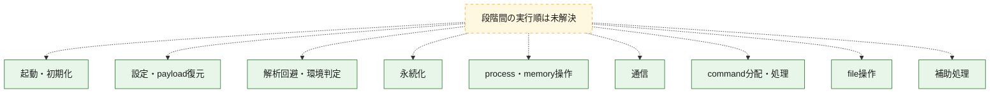
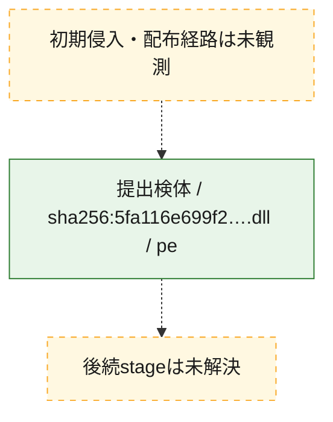
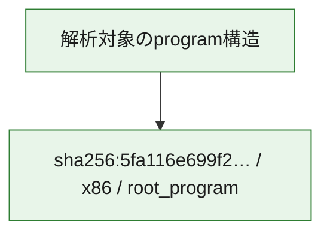

# 全体ロジック：5fa116e699f23e230c6c17a47d499feae725069ec5186196df24a7346e0f77f5

代表関数の静的証跡から、起動・初期化、設定・payload復元、解析回避・環境判定、永続化、process・memory操作、通信、command分配・処理、file操作の処理群を確認しました。

## 読み方

- phaseの掲載順は解析上の整理順です。observed_call_edgesがない段階間の実行順を断定しません。
- 図の実線は静的に観測した関係、点線と黄色のノードは未観測・未解決の関係を示します。
- 図は静的な要約であり、動的実行を再現するものではありません。
- 詳細な関数解説とfingerprintは[STATIC-LOGIC.md](STATIC-LOGIC.md)を参照してください。

## 静的可視化

### 実行フロー

### 感染チェーン

### モジュール関係

## 処理段階

### 1. 起動・初期化

entry pointから初期化と後続処理への移行を確認します。
確度: `confirmed_static_function_evidence`

- `5fa116e699f23e230c6c17a47d499feae725069ec5186196df24a7346e0f77f5:cil:0x06004ba1` — 初期化と主要処理への分岐を行う入口関数です。 状態: `succeeded`、選定理由: `entry_point`, `reviewed_call_centrality:2`
- `5fa116e699f23e230c6c17a47d499feae725069ec5186196df24a7346e0f77f5:cil:0x06004ba3` — 初期化と主要処理への分岐を行う入口関数です。 状態: `succeeded`、選定理由: `entry_point`, `reviewed_call_centrality:2`
- `5fa116e699f23e230c6c17a47d499feae725069ec5186196df24a7346e0f77f5:cil:0x06004ba4` — 初期化と主要処理への分岐を行う入口関数です。 状態: `succeeded`、選定理由: `entry_point`, `reviewed_call_centrality:18`
- `5fa116e699f23e230c6c17a47d499feae725069ec5186196df24a7346e0f77f5:cil:0x06007b06` — 初期化と主要処理への分岐を行う入口関数です。 状態: `succeeded`、選定理由: `entry_point`, `reviewed_call_centrality:2`
- `5fa116e699f23e230c6c17a47d499feae725069ec5186196df24a7346e0f77f5:cil:0x06007b07` — 初期化と主要処理への分岐を行う入口関数です。 状態: `succeeded`、選定理由: `entry_point`, `large_function:instructions=71`, `reviewed_call_centrality:34`
- `5fa116e699f23e230c6c17a47d499feae725069ec5186196df24a7346e0f77f5:cil:0x06008453` — 初期化と主要処理への分岐を行う入口関数です。 状態: `succeeded`、選定理由: `entry_point`, `large_function:instructions=73`, `reviewed_call_centrality:32`
- `5fa116e699f23e230c6c17a47d499feae725069ec5186196df24a7346e0f77f5:cil:0x0600845f` — 初期化と主要処理への分岐を行う入口関数です。 状態: `succeeded`、選定理由: `entry_point`, `reviewed_call_centrality:22`
- `5fa116e699f23e230c6c17a47d499feae725069ec5186196df24a7346e0f77f5:cil:0x06008468` — 初期化と主要処理への分岐を行う入口関数です。 状態: `succeeded`、選定理由: `entry_point`, `reviewed_call_centrality:18`
- `5fa116e699f23e230c6c17a47d499feae725069ec5186196df24a7346e0f77f5:cil:0x0600846b` — 初期化と主要処理への分岐を行う入口関数です。 状態: `succeeded`、選定理由: `entry_point`, `reviewed_call_centrality:6`
- `5fa116e699f23e230c6c17a47d499feae725069ec5186196df24a7346e0f77f5:cil:0x0600846e` — 初期化と主要処理への分岐を行う入口関数です。 状態: `succeeded`、選定理由: `entry_point`, `reviewed_call_centrality:6`
- `5fa116e699f23e230c6c17a47d499feae725069ec5186196df24a7346e0f77f5:cil:0x06008471` — 初期化と主要処理への分岐を行う入口関数です。 状態: `succeeded`、選定理由: `entry_point`, `reviewed_call_centrality:6`
- `5fa116e699f23e230c6c17a47d499feae725069ec5186196df24a7346e0f77f5:cil:0x06008476` — 初期化と主要処理への分岐を行う入口関数です。 状態: `succeeded`、選定理由: `entry_point`, `reviewed_call_centrality:18`
- `5fa116e699f23e230c6c17a47d499feae725069ec5186196df24a7346e0f77f5:cil:0x0600847e` — 初期化と主要処理への分岐を行う入口関数です。 状態: `succeeded`、選定理由: `entry_point`, `reviewed_call_centrality:20`
- `5fa116e699f23e230c6c17a47d499feae725069ec5186196df24a7346e0f77f5:cil:0x06008485` — 初期化と主要処理への分岐を行う入口関数です。 状態: `succeeded`、選定理由: `entry_point`, `reviewed_call_centrality:6`
- `5fa116e699f23e230c6c17a47d499feae725069ec5186196df24a7346e0f77f5:cil:0x06008488` — 初期化と主要処理への分岐を行う入口関数です。 状態: `succeeded`、選定理由: `entry_point`, `reviewed_call_centrality:6`
- `5fa116e699f23e230c6c17a47d499feae725069ec5186196df24a7346e0f77f5:cil:0x0600848f` — 初期化と主要処理への分岐を行う入口関数です。 状態: `succeeded`、選定理由: `entry_point`, `reviewed_call_centrality:22`
- `5fa116e699f23e230c6c17a47d499feae725069ec5186196df24a7346e0f77f5:cil:0x06008499` — 初期化と主要処理への分岐を行う入口関数です。 状態: `succeeded`、選定理由: `entry_point`, `reviewed_call_centrality:20`
- `5fa116e699f23e230c6c17a47d499feae725069ec5186196df24a7346e0f77f5:cil:0x060084a0` — 初期化と主要処理への分岐を行う入口関数です。 状態: `succeeded`、選定理由: `entry_point`, `reviewed_call_centrality:22`
- `5fa116e699f23e230c6c17a47d499feae725069ec5186196df24a7346e0f77f5:cil:0x060084a8` — 初期化と主要処理への分岐を行う入口関数です。 状態: `succeeded`、選定理由: `entry_point`, `reviewed_call_centrality:22`
- `5fa116e699f23e230c6c17a47d499feae725069ec5186196df24a7346e0f77f5:cil:0x060084b0` — 初期化と主要処理への分岐を行う入口関数です。 状態: `succeeded`、選定理由: `entry_point`, `reviewed_call_centrality:22`
- `5fa116e699f23e230c6c17a47d499feae725069ec5186196df24a7346e0f77f5:cil:0x060084b6` — 初期化と主要処理への分岐を行う入口関数です。 状態: `succeeded`、選定理由: `entry_point`, `reviewed_call_centrality:6`
- `5fa116e699f23e230c6c17a47d499feae725069ec5186196df24a7346e0f77f5:cil:0x060084c0` — 初期化と主要処理への分岐を行う入口関数です。 状態: `succeeded`、選定理由: `entry_point`, `large_function:instructions=223`, `reviewed_call_centrality:58`
- `5fa116e699f23e230c6c17a47d499feae725069ec5186196df24a7346e0f77f5:cil:0x060084ce` — 初期化と主要処理への分岐を行う入口関数です。 状態: `succeeded`、選定理由: `entry_point`, `reviewed_call_centrality:18`

### 2. 設定・payload復元

設定、resource、payload、暗号化データの復元・変換を確認します。
確度: `confirmed_static_function_evidence`

- `5fa116e699f23e230c6c17a47d499feae725069ec5186196df24a7346e0f77f5:cil:0x06000291` — 暗号、hash、encoding、または復号処理に関係する関数です。 状態: `succeeded`、選定理由: `large_function:instructions=141`, `reviewed_call_centrality:48`, `role:cryptographic_transform`
- `5fa116e699f23e230c6c17a47d499feae725069ec5186196df24a7346e0f77f5:cil:0x0600475a` — 設定、resource、payloadなどの解析・変換を行う関数です。 状態: `succeeded`、選定理由: `large_function:instructions=1577`, `reviewed_call_centrality:116`, `role:config_or_data_transform`

### 3. 解析回避・環境判定

debugger、sandbox、仮想環境、時間差などの判定を確認します。
確度: `confirmed_static_function_evidence`

- `5fa116e699f23e230c6c17a47d499feae725069ec5186196df24a7346e0f77f5:cil:0x06004e67` — debugger、仮想環境、sandbox、または時間差の確認に関係する関数です。 状態: `succeeded`、選定理由: `large_function:instructions=118`, `reviewed_call_centrality:50`, `role:anti_analysis`

### 4. 永続化

自動起動や永続化に関係する設定変更を確認します。
確度: `confirmed_static_function_evidence`

- `5fa116e699f23e230c6c17a47d499feae725069ec5186196df24a7346e0f77f5:cil:0x060002a4` — 自動起動または永続化に関係する処理を含む関数です。 状態: `succeeded`、選定理由: `large_function:instructions=65`, `reviewed_call_centrality:12`, `role:persistence`

### 5. process・memory操作

process、thread、module、memory操作と実行移行を確認します。
確度: `confirmed_static_function_evidence`

- `5fa116e699f23e230c6c17a47d499feae725069ec5186196df24a7346e0f77f5:cil:0x06004eb9` — process、thread、module、またはmemory操作に関係する関数です。 状態: `succeeded`、選定理由: `large_function:instructions=318`, `reviewed_call_centrality:54`, `role:process_or_memory_operation`

### 6. 通信

通信初期化、endpoint処理、送受信の役割を確認します。
確度: `confirmed_static_function_evidence`

- `5fa116e699f23e230c6c17a47d499feae725069ec5186196df24a7346e0f77f5:cil:0x06006c67` — 通信初期化、送受信、またはendpoint処理に関係する関数です。 状態: `succeeded`、選定理由: `large_function:instructions=598`, `reviewed_call_centrality:60`, `role:network_communication`

### 7. command分配・処理

受信commandやtaskの解釈、分配、個別handlerへの移行を確認します。
確度: `confirmed_static_function_evidence`

- `5fa116e699f23e230c6c17a47d499feae725069ec5186196df24a7346e0f77f5:cil:0x06000004` — commandの解釈、分配、または個別処理を担当する関数です。 状態: `succeeded`、選定理由: `large_function:instructions=5448`, `reviewed_call_centrality:224`, `role:command_dispatch_or_handler`

### 8. file操作

fileやdirectoryの作成、読書き、削除を確認します。
確度: `confirmed_static_function_evidence`

- `5fa116e699f23e230c6c17a47d499feae725069ec5186196df24a7346e0f77f5:cil:0x06004d96` — fileまたはdirectoryの読書き・管理に関係する関数です。 状態: `succeeded`、選定理由: `large_function:instructions=427`, `reviewed_call_centrality:88`, `role:file_operation`

### 9. 補助処理

主要処理を支える一般内部関数またはlibrary処理を確認します。
確度: `confirmed_static_function_evidence`

- `5fa116e699f23e230c6c17a47d499feae725069ec5186196df24a7346e0f77f5:cil:0x0600dec7` — 検体内部の一般処理を実装する関数です。 状態: `succeeded`、選定理由: `large_function:instructions=464`, `reviewed_call_centrality:78`

## 観測したcall関係

- 代表関数間で直接解決できた呼出関係はありません。

## 解析範囲と制約

- 選定外関数は全体inventoryへ残しますが、関数本体の個別解説対象にはしていません。
- indirect call、難読化、packer、VM、壊れたcontrol flowによりcall関係が欠落する場合があります。
- 文書は静的解析に基づき、検体実行や外部通信による動的確認は行っていません。
