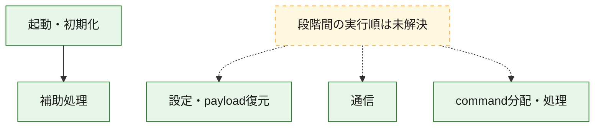
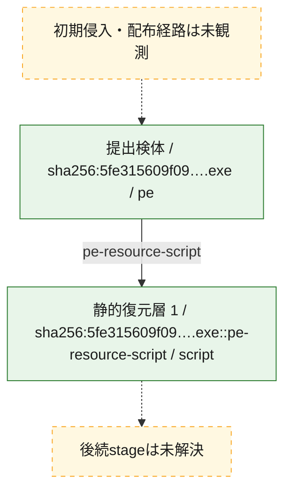
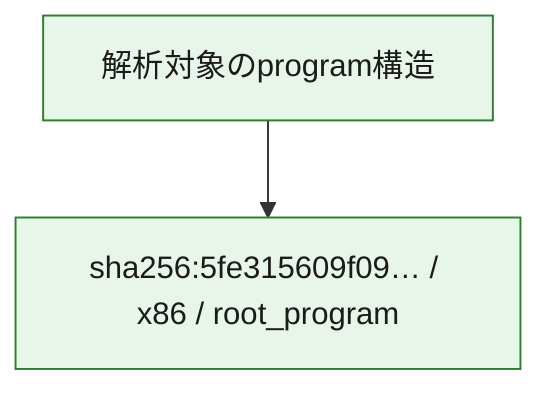

# 全体ロジック：5fe315609f09970c936310dea43318c2c5aca71da236c7f890c72e61f7696b5f

代表関数の静的証跡から、起動・初期化、設定・payload復元、通信、command分配・処理の処理群を確認しました。

## 読み方

- phaseの掲載順は解析上の整理順です。observed_call_edgesがない段階間の実行順を断定しません。
- 図の実線は静的に観測した関係、点線と黄色のノードは未観測・未解決の関係を示します。
- 図は静的な要約であり、動的実行を再現するものではありません。
- 詳細な関数解説とfingerprintは[STATIC-LOGIC.md](STATIC-LOGIC.md)を参照してください。

## 静的可視化

### 実行フロー

### 感染チェーン

### モジュール関係

## 処理段階

### 1. 起動・初期化

entry pointから初期化と後続処理への移行を確認します。
確度: `confirmed_static_function_evidence`

- `5fe315609f09970c936310dea43318c2c5aca71da236c7f890c72e61f7696b5f:ghidra:00646fc0` — 初期化と主要処理への分岐を行う入口関数です。 状態: `succeeded`、選定理由: `entry_point`, `meaningful_symbol_name`, `reviewed_call_centrality:22`, `role:entrypoint`

### 2. 設定・payload復元

設定、resource、payload、暗号化データの復元・変換を確認します。
確度: `confirmed_static_function_evidence_with_limits`

- `5fe315609f09970c936310dea43318c2c5aca71da236c7f890c72e61f7696b5f:ghidra:0064031e` — 設定、resource、payloadなどの解析・変換を行う関数です。 状態: `limited_bad_instruction_or_flow`、選定理由: `meaningful_symbol_name`, `reviewed_call_centrality:1`, `role:config_or_data_transform`

### 3. 通信

通信初期化、endpoint処理、送受信の役割を確認します。
確度: `confirmed_static_function_evidence_with_limits`

- `5fe315609f09970c936310dea43318c2c5aca71da236c7f890c72e61f7696b5f:ghidra:00640115` — 通信初期化、送受信、またはendpoint処理に関係する関数です。 状態: `limited_bad_instruction_or_flow`、選定理由: `meaningful_symbol_name`, `reviewed_call_centrality:1`, `role:network_communication`
- `5fe315609f09970c936310dea43318c2c5aca71da236c7f890c72e61f7696b5f:ghidra:00640364` — 通信初期化、送受信、またはendpoint処理に関係する関数です。 状態: `limited_bad_instruction_or_flow`、選定理由: `meaningful_symbol_name`, `reviewed_call_centrality:1`, `role:network_communication`
- `5fe315609f09970c936310dea43318c2c5aca71da236c7f890c72e61f7696b5f:ghidra:0066f35f` — 通信初期化、送受信、またはendpoint処理に関係する関数です。 状態: `limited_bad_instruction_or_flow`、選定理由: `meaningful_symbol_name`, `reviewed_call_centrality:1`, `role:network_communication`
- `5fe315609f09970c936310dea43318c2c5aca71da236c7f890c72e61f7696b5f:ghidra:0066f373` — 通信初期化、送受信、またはendpoint処理に関係する関数です。 状態: `limited_bad_instruction_or_flow`、選定理由: `meaningful_symbol_name`, `reviewed_call_centrality:1`, `role:network_communication`
- `5fe315609f09970c936310dea43318c2c5aca71da236c7f890c72e61f7696b5f:ghidra:0066f5ef` — 通信初期化、送受信、またはendpoint処理に関係する関数です。 状態: `limited_bad_instruction_or_flow`、選定理由: `meaningful_symbol_name`, `reviewed_call_centrality:1`, `role:network_communication`
- `5fe315609f09970c936310dea43318c2c5aca71da236c7f890c72e61f7696b5f:ghidra:0066f635` — 通信初期化、送受信、またはendpoint処理に関係する関数です。 状態: `failed`、選定理由: `meaningful_symbol_name`, `reviewed_call_centrality:1`, `role:network_communication`

### 4. command分配・処理

受信commandやtaskの解釈、分配、個別handlerへの移行を確認します。
確度: `confirmed_static_function_evidence_with_limits`

- `5fe315609f09970c936310dea43318c2c5aca71da236c7f890c72e61f7696b5f:ghidra:006403c8` — commandの解釈、分配、または個別処理を担当する関数です。 状態: `limited_bad_instruction_or_flow`、選定理由: `meaningful_symbol_name`, `reviewed_call_centrality:1`, `role:command_dispatch_or_handler`
- `5fe315609f09970c936310dea43318c2c5aca71da236c7f890c72e61f7696b5f:ghidra:006407ed` — commandの解釈、分配、または個別処理を担当する関数です。 状態: `limited_bad_instruction_or_flow`、選定理由: `meaningful_symbol_name`, `reviewed_call_centrality:1`, `role:command_dispatch_or_handler`
- `5fe315609f09970c936310dea43318c2c5aca71da236c7f890c72e61f7696b5f:ghidra:006407f7` — commandの解釈、分配、または個別処理を担当する関数です。 状態: `limited_bad_instruction_or_flow`、選定理由: `meaningful_symbol_name`, `reviewed_call_centrality:1`, `role:command_dispatch_or_handler`
- `5fe315609f09970c936310dea43318c2c5aca71da236c7f890c72e61f7696b5f:ghidra:0066f387` — commandの解釈、分配、または個別処理を担当する関数です。 状態: `limited_bad_instruction_or_flow`、選定理由: `meaningful_symbol_name`, `reviewed_call_centrality:1`, `role:command_dispatch_or_handler`

### 5. 補助処理

主要処理を支える一般内部関数またはlibrary処理を確認します。
確度: `confirmed_static_function_evidence_with_limits`

- `5fe315609f09970c936310dea43318c2c5aca71da236c7f890c72e61f7696b5f:ghidra:00408440` — 検体内部の一般処理を実装する関数です。 状態: `succeeded`、選定理由: `meaningful_symbol_name`, `reviewed_call_centrality:3`
- `5fe315609f09970c936310dea43318c2c5aca71da236c7f890c72e61f7696b5f:ghidra:0063fd4a` — 検体内部の一般処理を実装する関数です。 状態: `limited_bad_instruction_or_flow`、選定理由: `meaningful_symbol_name`, `reviewed_call_centrality:1`
- `5fe315609f09970c936310dea43318c2c5aca71da236c7f890c72e61f7696b5f:ghidra:0063fd65` — 検体内部の一般処理を実装する関数です。 状態: `limited_bad_instruction_or_flow`、選定理由: `meaningful_symbol_name`, `reviewed_call_centrality:1`
- `5fe315609f09970c936310dea43318c2c5aca71da236c7f890c72e61f7696b5f:ghidra:0063fd6f` — 検体内部の一般処理を実装する関数です。 状態: `limited_bad_instruction_or_flow`、選定理由: `meaningful_symbol_name`, `reviewed_call_centrality:1`
- `5fe315609f09970c936310dea43318c2c5aca71da236c7f890c72e61f7696b5f:ghidra:0063fd8a` — 検体内部の一般処理を実装する関数です。 状態: `limited_bad_instruction_or_flow`、選定理由: `meaningful_symbol_name`, `reviewed_call_centrality:1`
- `5fe315609f09970c936310dea43318c2c5aca71da236c7f890c72e61f7696b5f:ghidra:0063fdaa` — 検体内部の一般処理を実装する関数です。 状態: `limited_bad_instruction_or_flow`、選定理由: `meaningful_symbol_name`, `reviewed_call_centrality:1`
- `5fe315609f09970c936310dea43318c2c5aca71da236c7f890c72e61f7696b5f:ghidra:0063fdb4` — 検体内部の一般処理を実装する関数です。 状態: `limited_bad_instruction_or_flow`、選定理由: `meaningful_symbol_name`, `reviewed_call_centrality:1`
- `5fe315609f09970c936310dea43318c2c5aca71da236c7f890c72e61f7696b5f:ghidra:0063fdbe` — 検体内部の一般処理を実装する関数です。 状態: `limited_bad_instruction_or_flow`、選定理由: `meaningful_symbol_name`, `reviewed_call_centrality:1`
- `5fe315609f09970c936310dea43318c2c5aca71da236c7f890c72e61f7696b5f:ghidra:0063fdc8` — 検体内部の一般処理を実装する関数です。 状態: `limited_bad_instruction_or_flow`、選定理由: `meaningful_symbol_name`, `reviewed_call_centrality:1`
- `5fe315609f09970c936310dea43318c2c5aca71da236c7f890c72e61f7696b5f:ghidra:0063fe1a` — 検体内部の一般処理を実装する関数です。 状態: `limited_bad_instruction_or_flow`、選定理由: `meaningful_symbol_name`, `reviewed_call_centrality:1`
- `5fe315609f09970c936310dea43318c2c5aca71da236c7f890c72e61f7696b5f:ghidra:0063fe24` — 検体内部の一般処理を実装する関数です。 状態: `limited_bad_instruction_or_flow`、選定理由: `meaningful_symbol_name`, `reviewed_call_centrality:1`
- `5fe315609f09970c936310dea43318c2c5aca71da236c7f890c72e61f7696b5f:ghidra:0063fe2e` — 検体内部の一般処理を実装する関数です。 状態: `limited_bad_instruction_or_flow`、選定理由: `meaningful_symbol_name`, `reviewed_call_centrality:1`
- `5fe315609f09970c936310dea43318c2c5aca71da236c7f890c72e61f7696b5f:ghidra:0063fe38` — 検体内部の一般処理を実装する関数です。 状態: `limited_bad_instruction_or_flow`、選定理由: `meaningful_symbol_name`, `reviewed_call_centrality:1`
- `5fe315609f09970c936310dea43318c2c5aca71da236c7f890c72e61f7696b5f:ghidra:0063fe53` — 検体内部の一般処理を実装する関数です。 状態: `limited_bad_instruction_or_flow`、選定理由: `meaningful_symbol_name`, `reviewed_call_centrality:1`
- `5fe315609f09970c936310dea43318c2c5aca71da236c7f890c72e61f7696b5f:ghidra:0063fe5d` — 検体内部の一般処理を実装する関数です。 状態: `limited_bad_instruction_or_flow`、選定理由: `meaningful_symbol_name`, `reviewed_call_centrality:1`
- `5fe315609f09970c936310dea43318c2c5aca71da236c7f890c72e61f7696b5f:ghidra:0063fe67` — 検体内部の一般処理を実装する関数です。 状態: `limited_bad_instruction_or_flow`、選定理由: `meaningful_symbol_name`, `reviewed_call_centrality:1`
- `5fe315609f09970c936310dea43318c2c5aca71da236c7f890c72e61f7696b5f:ghidra:0063fe71` — 検体内部の一般処理を実装する関数です。 状態: `limited_bad_instruction_or_flow`、選定理由: `meaningful_symbol_name`, `reviewed_call_centrality:1`
- `5fe315609f09970c936310dea43318c2c5aca71da236c7f890c72e61f7696b5f:ghidra:0063fe7b` — 検体内部の一般処理を実装する関数です。 状態: `limited_bad_instruction_or_flow`、選定理由: `meaningful_symbol_name`, `reviewed_call_centrality:1`
- `5fe315609f09970c936310dea43318c2c5aca71da236c7f890c72e61f7696b5f:ghidra:0066fc20` — compiler生成処理または汎用library処理とみられる関数です。 状態: `succeeded`、選定理由: `entry_point`, `meaningful_symbol_name`, `reviewed_call_centrality:1`
- `5fe315609f09970c936310dea43318c2c5aca71da236c7f890c72e61f7696b5f:ghidra:0066fcb0` — compiler生成処理または汎用library処理とみられる関数です。 状態: `succeeded`、選定理由: `entry_point`, `meaningful_symbol_name`, `reviewed_call_centrality:2`

## 観測したcall関係

- `5fe315609f09970c936310dea43318c2c5aca71da236c7f890c72e61f7696b5f:ghidra:00646fc0` → `5fe315609f09970c936310dea43318c2c5aca71da236c7f890c72e61f7696b5f:ghidra:00408440` （`startup` → `support`）
- `5fe315609f09970c936310dea43318c2c5aca71da236c7f890c72e61f7696b5f:ghidra:0066fc20` → `5fe315609f09970c936310dea43318c2c5aca71da236c7f890c72e61f7696b5f:ghidra:00408440` （`support` → `support`）
- `5fe315609f09970c936310dea43318c2c5aca71da236c7f890c72e61f7696b5f:ghidra:0066fcb0` → `5fe315609f09970c936310dea43318c2c5aca71da236c7f890c72e61f7696b5f:ghidra:00408440` （`support` → `support`）
- `ghidra-function:0145f592738c144b6cd5fac5` → `ghidra-external:352e614c79e8a5a753e2b1fa` （`unclassified` → `unclassified`）
- `ghidra-function:0575706c0c756e2015f79b92` → `ghidra-external:352e614c79e8a5a753e2b1fa` （`unclassified` → `unclassified`）
- `ghidra-function:0931334ffb72e1434fbb6e30` → `ghidra-external:352e614c79e8a5a753e2b1fa` （`unclassified` → `unclassified`）
- `ghidra-function:3420e780ea4ea257d18565b8` → `ghidra-external:352e614c79e8a5a753e2b1fa` （`unclassified` → `unclassified`）
- `ghidra-function:40c823c8aafee381a3c9de82` → `ghidra-external:352e614c79e8a5a753e2b1fa` （`unclassified` → `unclassified`）
- `ghidra-function:411263a070091edb0d8b4518` → `ghidra-external:352e614c79e8a5a753e2b1fa` （`unclassified` → `unclassified`）
- `ghidra-function:498ca6150d2b481787da6e9d` → `ghidra-external:352e614c79e8a5a753e2b1fa` （`unclassified` → `unclassified`）
- `ghidra-function:4a89e6970a9d70aec83bd823` → `ghidra-external:352e614c79e8a5a753e2b1fa` （`unclassified` → `unclassified`）
- `ghidra-function:4c0df6ddbee22a9f580397af` → `ghidra-external:352e614c79e8a5a753e2b1fa` （`unclassified` → `unclassified`）
- `ghidra-function:63cc9ac25bdf1ac918509785` → `ghidra-external:352e614c79e8a5a753e2b1fa` （`unclassified` → `unclassified`）
- `ghidra-function:6f76af3ff22d22978703ac78` → `ghidra-external:352e614c79e8a5a753e2b1fa` （`unclassified` → `unclassified`）
- `ghidra-function:767225d5b956ea5ee8e00ee5` → `ghidra-external:11a2a768c687495b89fc4b2b` （`unclassified` → `unclassified`）
- `ghidra-function:767225d5b956ea5ee8e00ee5` → `ghidra-external:1d5e952d7d724840e8d02f2f` （`unclassified` → `unclassified`）
- `ghidra-function:767225d5b956ea5ee8e00ee5` → `ghidra-external:1eecea469623a989aa2d3632` （`unclassified` → `unclassified`）
- `ghidra-function:767225d5b956ea5ee8e00ee5` → `ghidra-external:2d034923676b1b533287facd` （`unclassified` → `unclassified`）
- `ghidra-function:767225d5b956ea5ee8e00ee5` → `ghidra-external:43a347a860e4f1cf0cccc698` （`unclassified` → `unclassified`）
- `ghidra-function:767225d5b956ea5ee8e00ee5` → `ghidra-external:58c645193a590e61a7b5417d` （`unclassified` → `unclassified`）
- `ghidra-function:767225d5b956ea5ee8e00ee5` → `ghidra-external:6225518389b6e0826de942ce` （`unclassified` → `unclassified`）
- `ghidra-function:767225d5b956ea5ee8e00ee5` → `ghidra-external:757d9107cfca611dcc8b4d92` （`unclassified` → `unclassified`）
- `ghidra-function:767225d5b956ea5ee8e00ee5` → `ghidra-external:846cfa5647c1379b8c20ba1d` （`unclassified` → `unclassified`）
- `ghidra-function:767225d5b956ea5ee8e00ee5` → `ghidra-external:870ee317975014398a553ddd` （`unclassified` → `unclassified`）
- `ghidra-function:767225d5b956ea5ee8e00ee5` → `ghidra-external:894c65d96885bc40cb93cc1a` （`unclassified` → `unclassified`）
- `ghidra-function:767225d5b956ea5ee8e00ee5` → `ghidra-external:9a7dda85adfc6cbbc2165df6` （`unclassified` → `unclassified`）
- `ghidra-function:767225d5b956ea5ee8e00ee5` → `ghidra-external:c8e54e772363dcfc0946af6e` （`unclassified` → `unclassified`）
- `ghidra-function:767225d5b956ea5ee8e00ee5` → `ghidra-external:ca1eb781340c3c7fdf38e014` （`unclassified` → `unclassified`）
- `ghidra-function:767225d5b956ea5ee8e00ee5` → `ghidra-external:caa72c916554b00e6ee0b61d` （`unclassified` → `unclassified`）
- `ghidra-function:767225d5b956ea5ee8e00ee5` → `ghidra-external:cd8f9531dea72022e99863a7` （`unclassified` → `unclassified`）
- `ghidra-function:767225d5b956ea5ee8e00ee5` → `ghidra-external:d6e86b432e453d90c8d14c8b` （`unclassified` → `unclassified`）
- `ghidra-function:767225d5b956ea5ee8e00ee5` → `ghidra-external:d965fc695b7c3ca441cadf9e` （`unclassified` → `unclassified`）
- `ghidra-function:767225d5b956ea5ee8e00ee5` → `ghidra-external:f5acb6fbbc185052d6d73579` （`unclassified` → `unclassified`）
- `ghidra-function:767225d5b956ea5ee8e00ee5` → `ghidra-external:fffaf5dfb198f34059cf54ad` （`unclassified` → `unclassified`）
- `ghidra-function:767225d5b956ea5ee8e00ee5` → `ghidra-function:340b7125afdd7bfc68c51cde` （`unclassified` → `unclassified`）
- `ghidra-function:767225d5b956ea5ee8e00ee5` → `ghidra-function:e2b35c3f009723a66c584c3e` （`unclassified` → `unclassified`）
- `ghidra-function:767a9a3dc88b939ecde5ffbb` → `ghidra-external:352e614c79e8a5a753e2b1fa` （`unclassified` → `unclassified`）
- `ghidra-function:82df09234ce2a53230fe95b9` → `ghidra-external:352e614c79e8a5a753e2b1fa` （`unclassified` → `unclassified`）
- `ghidra-function:8820cb0a008470fd89f9a7c1` → `ghidra-external:352e614c79e8a5a753e2b1fa` （`unclassified` → `unclassified`）
- `ghidra-function:8d74a50e2c61be7c9fd1776e` → `ghidra-external:352e614c79e8a5a753e2b1fa` （`unclassified` → `unclassified`）
- `ghidra-function:90745d426e383dd441c2fee8` → `ghidra-external:352e614c79e8a5a753e2b1fa` （`unclassified` → `unclassified`）
- `ghidra-function:939c1a9d1aef33f110ef395c` → `ghidra-external:352e614c79e8a5a753e2b1fa` （`unclassified` → `unclassified`）
- `ghidra-function:9d73fadee799d02bdc87bc94` → `ghidra-external:352e614c79e8a5a753e2b1fa` （`unclassified` → `unclassified`）
- `ghidra-function:9e83be8535acb287e21b154c` → `ghidra-external:352e614c79e8a5a753e2b1fa` （`unclassified` → `unclassified`）
- `ghidra-function:c1c1c764c7f1f77b381fbfe6` → `ghidra-external:352e614c79e8a5a753e2b1fa` （`unclassified` → `unclassified`）
- `ghidra-function:c542e8dcfe0b78b476e2268a` → `ghidra-external:352e614c79e8a5a753e2b1fa` （`unclassified` → `unclassified`）
- `ghidra-function:c5b8195e24612db97f769839` → `ghidra-external:102106b1620b7b8d62414601` （`unclassified` → `unclassified`）
- `ghidra-function:c5b8195e24612db97f769839` → `ghidra-function:340b7125afdd7bfc68c51cde` （`unclassified` → `unclassified`）
- `ghidra-function:c63368e1ac0af9ebf39fc839` → `ghidra-external:352e614c79e8a5a753e2b1fa` （`unclassified` → `unclassified`）
- `ghidra-function:cbb72e82b5c8e0f019b58329` → `ghidra-external:352e614c79e8a5a753e2b1fa` （`unclassified` → `unclassified`）
- `ghidra-function:db3b6bc372613d0c0e233bfc` → `ghidra-external:352e614c79e8a5a753e2b1fa` （`unclassified` → `unclassified`）
- `ghidra-function:de4584e260d01ff497f465c3` → `ghidra-external:352e614c79e8a5a753e2b1fa` （`unclassified` → `unclassified`）
- `ghidra-function:e6e76201b5176ce7af184897` → `ghidra-function:340b7125afdd7bfc68c51cde` （`unclassified` → `unclassified`）
- `ghidra-function:ee3098cb993ad2f87e586b33` → `ghidra-external:352e614c79e8a5a753e2b1fa` （`unclassified` → `unclassified`）
- `ghidra-function:ff723a184a5dc30480389eed` → `ghidra-external:352e614c79e8a5a753e2b1fa` （`unclassified` → `unclassified`）
- `ghidra-function:ff72d34e7f3e9fac15a5688f` → `ghidra-external:352e614c79e8a5a753e2b1fa` （`unclassified` → `unclassified`）

## 解析範囲と制約

- 選定外関数は全体inventoryへ残しますが、関数本体の個別解説対象にはしていません。
- indirect call、難読化、packer、VM、壊れたcontrol flowによりcall関係が欠落する場合があります。
- 文書は静的解析に基づき、検体実行や外部通信による動的確認は行っていません。
