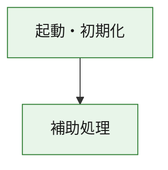
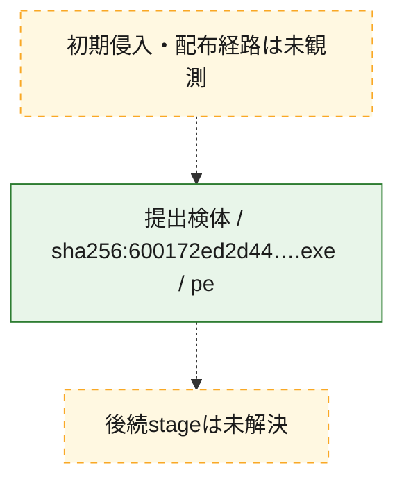
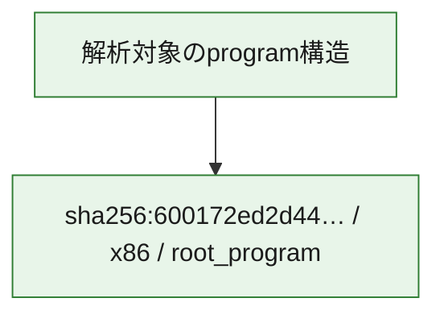

# 全体ロジック：600172ed2d44777b7cce541ba0bdefb689b3a816edd1123191e529e1f5cbdbcd

代表関数の静的証跡から、起動・初期化の処理群を確認しました。

## 読み方

- phaseの掲載順は解析上の整理順です。observed_call_edgesがない段階間の実行順を断定しません。
- 図の実線は静的に観測した関係、点線と黄色のノードは未観測・未解決の関係を示します。
- 図は静的な要約であり、動的実行を再現するものではありません。
- 詳細な関数解説とfingerprintは[STATIC-LOGIC.md](STATIC-LOGIC.md)を参照してください。

## 静的可視化

### 実行フロー

### 感染チェーン

### モジュール関係

## 処理段階

### 1. 起動・初期化

entry pointから初期化と後続処理への移行を確認します。
確度: `confirmed_static_function_evidence`

- `600172ed2d44777b7cce541ba0bdefb689b3a816edd1123191e529e1f5cbdbcd:ghidra:180001010` — 初期化と主要処理への分岐を行う入口関数です。 状態: `succeeded`、選定理由: `entry_point`, `meaningful_symbol_name`, `reviewed_call_centrality:22`, `role:entrypoint`, `small_program_complete_context`

### 2. 補助処理

主要処理を支える一般内部関数またはlibrary処理を確認します。
確度: `confirmed_static_function_evidence`

- `600172ed2d44777b7cce541ba0bdefb689b3a816edd1123191e529e1f5cbdbcd:ghidra:180001240` — 検体内部の一般処理を実装する関数です。 状態: `succeeded`、選定理由: `context_representative`, `reviewed_call_centrality:2`, `small_program_complete_context`
- `600172ed2d44777b7cce541ba0bdefb689b3a816edd1123191e529e1f5cbdbcd:ghidra:180001350` — 検体内部の一般処理を実装する関数です。 状態: `succeeded`、選定理由: `context_representative`, `reviewed_call_centrality:25`, `small_program_complete_context`
- `600172ed2d44777b7cce541ba0bdefb689b3a816edd1123191e529e1f5cbdbcd:ghidra:180003780` — 検体内部の一般処理を実装する関数です。 状態: `succeeded`、選定理由: `context_representative`, `reviewed_call_centrality:2`, `small_program_complete_context`
- `600172ed2d44777b7cce541ba0bdefb689b3a816edd1123191e529e1f5cbdbcd:ghidra:1800038e0` — 検体内部の一般処理を実装する関数です。 状態: `succeeded`、選定理由: `context_representative`, `reviewed_call_centrality:2`, `small_program_complete_context`

## 観測したcall関係

- `600172ed2d44777b7cce541ba0bdefb689b3a816edd1123191e529e1f5cbdbcd:ghidra:180001010` → `600172ed2d44777b7cce541ba0bdefb689b3a816edd1123191e529e1f5cbdbcd:ghidra:180001240` （`startup` → `support`）
- `600172ed2d44777b7cce541ba0bdefb689b3a816edd1123191e529e1f5cbdbcd:ghidra:180001010` → `600172ed2d44777b7cce541ba0bdefb689b3a816edd1123191e529e1f5cbdbcd:ghidra:180001350` （`startup` → `support`）
- `600172ed2d44777b7cce541ba0bdefb689b3a816edd1123191e529e1f5cbdbcd:ghidra:180001350` → `600172ed2d44777b7cce541ba0bdefb689b3a816edd1123191e529e1f5cbdbcd:ghidra:180001240` （`support` → `support`）
- `600172ed2d44777b7cce541ba0bdefb689b3a816edd1123191e529e1f5cbdbcd:ghidra:180001350` → `600172ed2d44777b7cce541ba0bdefb689b3a816edd1123191e529e1f5cbdbcd:ghidra:180003780` （`support` → `support`）
- `600172ed2d44777b7cce541ba0bdefb689b3a816edd1123191e529e1f5cbdbcd:ghidra:180001350` → `600172ed2d44777b7cce541ba0bdefb689b3a816edd1123191e529e1f5cbdbcd:ghidra:1800038e0` （`support` → `support`）
- `600172ed2d44777b7cce541ba0bdefb689b3a816edd1123191e529e1f5cbdbcd:ghidra:180003780` → `600172ed2d44777b7cce541ba0bdefb689b3a816edd1123191e529e1f5cbdbcd:ghidra:1800038e0` （`support` → `support`）
- `ghidra-function:7b01327bd91ab581bab7204a` → `ghidra-function:445a5fc0fd4a4f28ffd364e0` （`unclassified` → `unclassified`）
- `ghidra-function:b085b29631f81d4b7de9f299` → `ghidra-external:035f0e2fcbeda3244170d2f0` （`unclassified` → `unclassified`）
- `ghidra-function:b085b29631f81d4b7de9f299` → `ghidra-external:274082bc60cd21d9e8bcb7d8` （`unclassified` → `unclassified`）
- `ghidra-function:b085b29631f81d4b7de9f299` → `ghidra-external:3d41b98f62b8f674731b7f71` （`unclassified` → `unclassified`）
- `ghidra-function:b085b29631f81d4b7de9f299` → `ghidra-external:3f2418d2a4d0b2183569f2d3` （`unclassified` → `unclassified`）
- `ghidra-function:b085b29631f81d4b7de9f299` → `ghidra-external:40b65faa7fde9f550a09294a` （`unclassified` → `unclassified`）
- `ghidra-function:b085b29631f81d4b7de9f299` → `ghidra-external:423759e74aea205dcdf678b5` （`unclassified` → `unclassified`）
- `ghidra-function:b085b29631f81d4b7de9f299` → `ghidra-external:4380b7074e0205af75c4c83d` （`unclassified` → `unclassified`）
- `ghidra-function:b085b29631f81d4b7de9f299` → `ghidra-external:43c34ea19763dccac46ae3e4` （`unclassified` → `unclassified`）
- `ghidra-function:b085b29631f81d4b7de9f299` → `ghidra-external:57ee5e97c49f1f121e744d19` （`unclassified` → `unclassified`）
- `ghidra-function:b085b29631f81d4b7de9f299` → `ghidra-external:63029c81d6d841c8735b4604` （`unclassified` → `unclassified`）
- `ghidra-function:b085b29631f81d4b7de9f299` → `ghidra-external:73f24a7d651b3f2b688339e6` （`unclassified` → `unclassified`）
- `ghidra-function:b085b29631f81d4b7de9f299` → `ghidra-external:7a7896ad38448a1fcb51b103` （`unclassified` → `unclassified`）
- `ghidra-function:b085b29631f81d4b7de9f299` → `ghidra-external:87921f8eb79268e8f0637b64` （`unclassified` → `unclassified`）
- `ghidra-function:b085b29631f81d4b7de9f299` → `ghidra-external:9d4b035eda269b1c0a6de814` （`unclassified` → `unclassified`）
- `ghidra-function:b085b29631f81d4b7de9f299` → `ghidra-external:af0ece4032eaf75808600d90` （`unclassified` → `unclassified`）
- `ghidra-function:b085b29631f81d4b7de9f299` → `ghidra-external:b9913bf63e06bdb871f65a2d` （`unclassified` → `unclassified`）
- `ghidra-function:b085b29631f81d4b7de9f299` → `ghidra-external:c1ceb5d9a2388174ddfa556e` （`unclassified` → `unclassified`）
- `ghidra-function:b085b29631f81d4b7de9f299` → `ghidra-external:c202219fedb2573838901109` （`unclassified` → `unclassified`）
- `ghidra-function:b085b29631f81d4b7de9f299` → `ghidra-external:c411b3224919c32af0690323` （`unclassified` → `unclassified`）
- `ghidra-function:b085b29631f81d4b7de9f299` → `ghidra-external:c936191fc9ef9532d6665ead` （`unclassified` → `unclassified`）
- `ghidra-function:b085b29631f81d4b7de9f299` → `ghidra-external:cf2555c103f0c0ac910a35ef` （`unclassified` → `unclassified`）
- `ghidra-function:b085b29631f81d4b7de9f299` → `ghidra-function:445a5fc0fd4a4f28ffd364e0` （`unclassified` → `unclassified`）
- `ghidra-function:b085b29631f81d4b7de9f299` → `ghidra-function:7b01327bd91ab581bab7204a` （`unclassified` → `unclassified`）
- `ghidra-function:b085b29631f81d4b7de9f299` → `ghidra-function:f17768e74bf65ca05f335b8b` （`unclassified` → `unclassified`）
- `ghidra-function:e771e7e6e4afe2b23fa2b460` → `ghidra-function:02980e15c1b930c9a591f51e` （`unclassified` → `unclassified`）
- `ghidra-function:e771e7e6e4afe2b23fa2b460` → `ghidra-function:11f55887d290e74c5053ec8b` （`unclassified` → `unclassified`）
- `ghidra-function:e771e7e6e4afe2b23fa2b460` → `ghidra-function:372a34c1be3855f808dcd6ca` （`unclassified` → `unclassified`）
- `ghidra-function:e771e7e6e4afe2b23fa2b460` → `ghidra-function:39063b1fc0e7163d3731b347` （`unclassified` → `unclassified`）
- `ghidra-function:e771e7e6e4afe2b23fa2b460` → `ghidra-function:4dbdca559394c07553734525` （`unclassified` → `unclassified`）
- `ghidra-function:e771e7e6e4afe2b23fa2b460` → `ghidra-function:664aef8a464d3bef92941f93` （`unclassified` → `unclassified`）
- `ghidra-function:e771e7e6e4afe2b23fa2b460` → `ghidra-function:79e667f6ff6f0852846ab521` （`unclassified` → `unclassified`）
- `ghidra-function:e771e7e6e4afe2b23fa2b460` → `ghidra-function:807a80f6bc09c0230c6a4782` （`unclassified` → `unclassified`）
- `ghidra-function:e771e7e6e4afe2b23fa2b460` → `ghidra-function:b085b29631f81d4b7de9f299` （`unclassified` → `unclassified`）
- `ghidra-function:e771e7e6e4afe2b23fa2b460` → `ghidra-function:c6d73a595e88cedf82d832f0` （`unclassified` → `unclassified`）
- `ghidra-function:e771e7e6e4afe2b23fa2b460` → `ghidra-function:c9ac77ec7cde36b93e01caad` （`unclassified` → `unclassified`）
- `ghidra-function:e771e7e6e4afe2b23fa2b460` → `ghidra-function:f17768e74bf65ca05f335b8b` （`unclassified` → `unclassified`）

## 解析範囲と制約

- 選定外関数は全体inventoryへ残しますが、関数本体の個別解説対象にはしていません。
- indirect call、難読化、packer、VM、壊れたcontrol flowによりcall関係が欠落する場合があります。
- 文書は静的解析に基づき、検体実行や外部通信による動的確認は行っていません。
