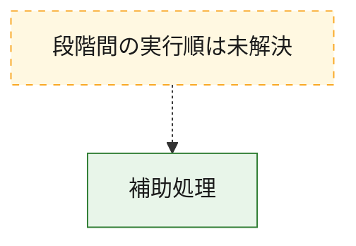
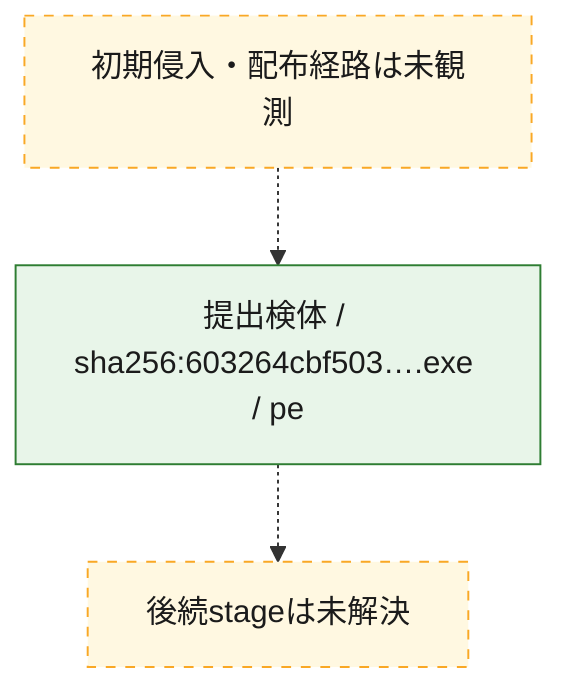
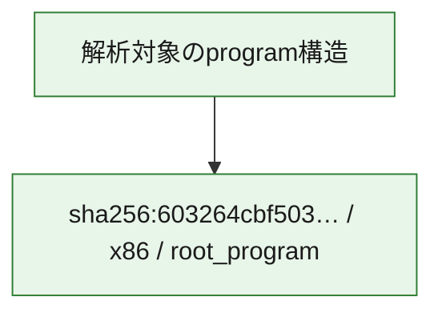

# 全体ロジック：603264cbf503d230902ee89324431bf3b81aebbdb31ca3cafe2deef0652405fc

代表関数から主要なmalware処理段階を自動分類できませんでした。

## 読み方

- phaseの掲載順は解析上の整理順です。observed_call_edgesがない段階間の実行順を断定しません。
- 図の実線は静的に観測した関係、点線と黄色のノードは未観測・未解決の関係を示します。
- 図は静的な要約であり、動的実行を再現するものではありません。
- 詳細な関数解説とfingerprintは[STATIC-LOGIC.md](STATIC-LOGIC.md)を参照してください。

## 静的可視化

### 実行フロー

### 感染チェーン

### モジュール関係

## 処理段階

### 1. 補助処理

主要処理を支える一般内部関数またはlibrary処理を確認します。
確度: `confirmed_static_function_evidence`

- `603264cbf503d230902ee89324431bf3b81aebbdb31ca3cafe2deef0652405fc:ghidra:140001000` — 検体内部の一般処理を実装する関数です。 状態: `succeeded`、選定理由: `context_representative`, `reviewed_call_centrality:8`
- `603264cbf503d230902ee89324431bf3b81aebbdb31ca3cafe2deef0652405fc:ghidra:1400012a0` — 検体内部の一般処理を実装する関数です。 状態: `succeeded`、選定理由: `context_representative`, `reviewed_call_centrality:3`
- `603264cbf503d230902ee89324431bf3b81aebbdb31ca3cafe2deef0652405fc:ghidra:140001320` — 検体内部の一般処理を実装する関数です。 状態: `succeeded`、選定理由: `context_representative`, `reviewed_call_centrality:3`
- `603264cbf503d230902ee89324431bf3b81aebbdb31ca3cafe2deef0652405fc:ghidra:140001380` — 検体内部の一般処理を実装する関数です。 状態: `succeeded`、選定理由: `context_representative`, `reviewed_call_centrality:2`
- `603264cbf503d230902ee89324431bf3b81aebbdb31ca3cafe2deef0652405fc:ghidra:1400013c0` — 検体内部の一般処理を実装する関数です。 状態: `succeeded`、選定理由: `context_representative`, `reviewed_call_centrality:4`
- `603264cbf503d230902ee89324431bf3b81aebbdb31ca3cafe2deef0652405fc:ghidra:140001540` — 検体内部の一般処理を実装する関数です。 状態: `succeeded`、選定理由: `context_representative`, `reviewed_call_centrality:2`
- `603264cbf503d230902ee89324431bf3b81aebbdb31ca3cafe2deef0652405fc:ghidra:140001620` — 検体内部の一般処理を実装する関数です。 状態: `succeeded`、選定理由: `context_representative`, `reviewed_call_centrality:5`
- `603264cbf503d230902ee89324431bf3b81aebbdb31ca3cafe2deef0652405fc:ghidra:1400019e0` — 検体内部の一般処理を実装する関数です。 状態: `succeeded`、選定理由: `context_representative`, `reviewed_call_centrality:2`
- `603264cbf503d230902ee89324431bf3b81aebbdb31ca3cafe2deef0652405fc:ghidra:140001a60` — 検体内部の一般処理を実装する関数です。 状態: `succeeded`、選定理由: `context_representative`, `reviewed_call_centrality:1`
- `603264cbf503d230902ee89324431bf3b81aebbdb31ca3cafe2deef0652405fc:ghidra:140001ae0` — 検体内部の一般処理を実装する関数です。 状態: `succeeded`、選定理由: `context_representative`, `reviewed_call_centrality:2`
- `603264cbf503d230902ee89324431bf3b81aebbdb31ca3cafe2deef0652405fc:ghidra:140001ba0` — 検体内部の一般処理を実装する関数です。 状態: `succeeded`、選定理由: `context_representative`, `reviewed_call_centrality:2`
- `603264cbf503d230902ee89324431bf3b81aebbdb31ca3cafe2deef0652405fc:ghidra:140001d00` — 検体内部の一般処理を実装する関数です。 状態: `succeeded`、選定理由: `context_representative`, `reviewed_call_centrality:2`
- `603264cbf503d230902ee89324431bf3b81aebbdb31ca3cafe2deef0652405fc:ghidra:140001d60` — 検体内部の一般処理を実装する関数です。 状態: `succeeded`、選定理由: `context_representative`, `reviewed_call_centrality:4`
- `603264cbf503d230902ee89324431bf3b81aebbdb31ca3cafe2deef0652405fc:ghidra:140001de0` — 検体内部の一般処理を実装する関数です。 状態: `succeeded`、選定理由: `context_representative`, `reviewed_call_centrality:5`
- `603264cbf503d230902ee89324431bf3b81aebbdb31ca3cafe2deef0652405fc:ghidra:140001e80` — 検体内部の一般処理を実装する関数です。 状態: `succeeded`、選定理由: `context_representative`, `reviewed_call_centrality:5`
- `603264cbf503d230902ee89324431bf3b81aebbdb31ca3cafe2deef0652405fc:ghidra:140001f80` — 検体内部の一般処理を実装する関数です。 状態: `succeeded`、選定理由: `context_representative`, `reviewed_call_centrality:7`
- `603264cbf503d230902ee89324431bf3b81aebbdb31ca3cafe2deef0652405fc:ghidra:1400023e0` — 検体内部の一般処理を実装する関数です。 状態: `succeeded`、選定理由: `context_representative`, `reviewed_call_centrality:3`
- `603264cbf503d230902ee89324431bf3b81aebbdb31ca3cafe2deef0652405fc:ghidra:140002440` — 検体内部の一般処理を実装する関数です。 状態: `succeeded`、選定理由: `context_representative`, `reviewed_call_centrality:2`
- `603264cbf503d230902ee89324431bf3b81aebbdb31ca3cafe2deef0652405fc:ghidra:140002460` — 検体内部の一般処理を実装する関数です。 状態: `succeeded`、選定理由: `context_representative`, `reviewed_call_centrality:2`
- `603264cbf503d230902ee89324431bf3b81aebbdb31ca3cafe2deef0652405fc:ghidra:140002480` — 検体内部の一般処理を実装する関数です。 状態: `succeeded`、選定理由: `context_representative`, `reviewed_call_centrality:2`
- `603264cbf503d230902ee89324431bf3b81aebbdb31ca3cafe2deef0652405fc:ghidra:1400024a0` — 検体内部の一般処理を実装する関数です。 状態: `succeeded`、選定理由: `context_representative`, `reviewed_call_centrality:3`
- `603264cbf503d230902ee89324431bf3b81aebbdb31ca3cafe2deef0652405fc:ghidra:1400024e0` — 検体内部の一般処理を実装する関数です。 状態: `succeeded`、選定理由: `context_representative`, `reviewed_call_centrality:2`
- `603264cbf503d230902ee89324431bf3b81aebbdb31ca3cafe2deef0652405fc:ghidra:140002500` — 検体内部の一般処理を実装する関数です。 状態: `succeeded`、選定理由: `context_representative`, `reviewed_call_centrality:2`
- `603264cbf503d230902ee89324431bf3b81aebbdb31ca3cafe2deef0652405fc:ghidra:140002520` — 検体内部の一般処理を実装する関数です。 状態: `succeeded`、選定理由: `context_representative`, `reviewed_call_centrality:3`
- `603264cbf503d230902ee89324431bf3b81aebbdb31ca3cafe2deef0652405fc:ghidra:140002560` — 検体内部の一般処理を実装する関数です。 状態: `succeeded`、選定理由: `context_representative`, `reviewed_call_centrality:3`
- `603264cbf503d230902ee89324431bf3b81aebbdb31ca3cafe2deef0652405fc:ghidra:1400025e0` — 検体内部の一般処理を実装する関数です。 状態: `succeeded`、選定理由: `context_representative`, `reviewed_call_centrality:3`
- `603264cbf503d230902ee89324431bf3b81aebbdb31ca3cafe2deef0652405fc:ghidra:140002760` — 検体内部の一般処理を実装する関数です。 状態: `succeeded`、選定理由: `context_representative`, `reviewed_call_centrality:5`
- `603264cbf503d230902ee89324431bf3b81aebbdb31ca3cafe2deef0652405fc:ghidra:140002ae0` — 検体内部の一般処理を実装する関数です。 状態: `succeeded`、選定理由: `context_representative`, `reviewed_call_centrality:5`
- `603264cbf503d230902ee89324431bf3b81aebbdb31ca3cafe2deef0652405fc:ghidra:140002e40` — 検体内部の一般処理を実装する関数です。 状態: `succeeded`、選定理由: `context_representative`, `reviewed_call_centrality:5`
- `603264cbf503d230902ee89324431bf3b81aebbdb31ca3cafe2deef0652405fc:ghidra:140003200` — 検体内部の一般処理を実装する関数です。 状態: `succeeded`、選定理由: `context_representative`, `reviewed_call_centrality:5`
- `603264cbf503d230902ee89324431bf3b81aebbdb31ca3cafe2deef0652405fc:ghidra:1400035e0` — 検体内部の一般処理を実装する関数です。 状態: `succeeded`、選定理由: `context_representative`, `reviewed_call_centrality:5`
- `603264cbf503d230902ee89324431bf3b81aebbdb31ca3cafe2deef0652405fc:ghidra:140003940` — 検体内部の一般処理を実装する関数です。 状態: `succeeded`、選定理由: `context_representative`, `reviewed_call_centrality:5`

## 観測したcall関係

- `603264cbf503d230902ee89324431bf3b81aebbdb31ca3cafe2deef0652405fc:ghidra:1400024a0` → `603264cbf503d230902ee89324431bf3b81aebbdb31ca3cafe2deef0652405fc:ghidra:140001d60` （`support` → `support`）
- `603264cbf503d230902ee89324431bf3b81aebbdb31ca3cafe2deef0652405fc:ghidra:140002520` → `603264cbf503d230902ee89324431bf3b81aebbdb31ca3cafe2deef0652405fc:ghidra:140001de0` （`support` → `support`）
- `603264cbf503d230902ee89324431bf3b81aebbdb31ca3cafe2deef0652405fc:ghidra:1400025e0` → `603264cbf503d230902ee89324431bf3b81aebbdb31ca3cafe2deef0652405fc:ghidra:140001e80` （`support` → `support`）
- `ghidra-function:02d1071e4beae711cd2f85b6` → `ghidra-external:a996a1a1118aa4a4757c262f` （`unclassified` → `unclassified`）
- `ghidra-function:02d1071e4beae711cd2f85b6` → `ghidra-function:27df4a96c682b384505f67d1` （`unclassified` → `unclassified`）
- `ghidra-function:02d1071e4beae711cd2f85b6` → `ghidra-function:7cf52c552eb07a02f162bcaa` （`unclassified` → `unclassified`）
- `ghidra-function:02d1071e4beae711cd2f85b6` → `ghidra-function:8d7694934abb95a53ff73638` （`unclassified` → `unclassified`）
- `ghidra-function:02d1071e4beae711cd2f85b6` → `ghidra-function:c099f6af130b92c03f23afe3` （`unclassified` → `unclassified`）
- `ghidra-function:0405825976ad0266c68cbb18` → `ghidra-external:a996a1a1118aa4a4757c262f` （`unclassified` → `unclassified`）
- `ghidra-function:0405825976ad0266c68cbb18` → `ghidra-function:27df4a96c682b384505f67d1` （`unclassified` → `unclassified`）
- `ghidra-function:0405825976ad0266c68cbb18` → `ghidra-function:7cf52c552eb07a02f162bcaa` （`unclassified` → `unclassified`）
- `ghidra-function:0405825976ad0266c68cbb18` → `ghidra-function:8d7694934abb95a53ff73638` （`unclassified` → `unclassified`）
- `ghidra-function:0405825976ad0266c68cbb18` → `ghidra-function:c099f6af130b92c03f23afe3` （`unclassified` → `unclassified`）
- `ghidra-function:0f1acfba55ab6842ba1e7dc6` → `ghidra-external:9493714c7221b22fbbc436ef` （`unclassified` → `unclassified`）
- `ghidra-function:0f1acfba55ab6842ba1e7dc6` → `ghidra-function:41ef231cfcee4b38c82d684c` （`unclassified` → `unclassified`）
- `ghidra-function:12a058544ebdc939857d692e` → `ghidra-external:9493714c7221b22fbbc436ef` （`unclassified` → `unclassified`）
- `ghidra-function:12a058544ebdc939857d692e` → `ghidra-function:82b04e691cb9f6cd46a39a48` （`unclassified` → `unclassified`）
- `ghidra-function:18cdea06e9e265af7226ecdf` → `ghidra-external:9493714c7221b22fbbc436ef` （`unclassified` → `unclassified`）
- `ghidra-function:18cdea06e9e265af7226ecdf` → `ghidra-function:82b04e691cb9f6cd46a39a48` （`unclassified` → `unclassified`）
- `ghidra-function:25ca9037db0424e301613b7f` → `ghidra-external:9493714c7221b22fbbc436ef` （`unclassified` → `unclassified`）
- `ghidra-function:25ca9037db0424e301613b7f` → `ghidra-function:41ef231cfcee4b38c82d684c` （`unclassified` → `unclassified`）
- `ghidra-function:25ca9037db0424e301613b7f` → `ghidra-function:c099f6af130b92c03f23afe3` （`unclassified` → `unclassified`）
- `ghidra-function:29d3738f18fd1ce04893a958` → `ghidra-external:9493714c7221b22fbbc436ef` （`unclassified` → `unclassified`）
- `ghidra-function:29d3738f18fd1ce04893a958` → `ghidra-function:c099f6af130b92c03f23afe3` （`unclassified` → `unclassified`）
- `ghidra-function:34729a6f62235321061b51bd` → `ghidra-external:a996a1a1118aa4a4757c262f` （`unclassified` → `unclassified`）
- `ghidra-function:34729a6f62235321061b51bd` → `ghidra-function:27df4a96c682b384505f67d1` （`unclassified` → `unclassified`）
- `ghidra-function:34729a6f62235321061b51bd` → `ghidra-function:7cf52c552eb07a02f162bcaa` （`unclassified` → `unclassified`）
- `ghidra-function:34729a6f62235321061b51bd` → `ghidra-function:8d7694934abb95a53ff73638` （`unclassified` → `unclassified`）
- `ghidra-function:34729a6f62235321061b51bd` → `ghidra-function:c099f6af130b92c03f23afe3` （`unclassified` → `unclassified`）
- `ghidra-function:34c5ede47671ef06917183c3` → `ghidra-external:2eb22aff4c9c191a111ea366` （`unclassified` → `unclassified`）
- `ghidra-function:34c5ede47671ef06917183c3` → `ghidra-external:a996a1a1118aa4a4757c262f` （`unclassified` → `unclassified`）
- `ghidra-function:4035b8b33400958a7d89e2c7` → `ghidra-external:a996a1a1118aa4a4757c262f` （`unclassified` → `unclassified`）
- `ghidra-function:4035b8b33400958a7d89e2c7` → `ghidra-function:27df4a96c682b384505f67d1` （`unclassified` → `unclassified`）
- `ghidra-function:4035b8b33400958a7d89e2c7` → `ghidra-function:7cf52c552eb07a02f162bcaa` （`unclassified` → `unclassified`）
- `ghidra-function:4035b8b33400958a7d89e2c7` → `ghidra-function:8d7694934abb95a53ff73638` （`unclassified` → `unclassified`）
- `ghidra-function:4035b8b33400958a7d89e2c7` → `ghidra-function:c099f6af130b92c03f23afe3` （`unclassified` → `unclassified`）
- `ghidra-function:469ea73c0342f54de4c8566a` → `ghidra-external:a996a1a1118aa4a4757c262f` （`unclassified` → `unclassified`）
- `ghidra-function:469ea73c0342f54de4c8566a` → `ghidra-function:27df4a96c682b384505f67d1` （`unclassified` → `unclassified`）
- `ghidra-function:469ea73c0342f54de4c8566a` → `ghidra-function:7cf52c552eb07a02f162bcaa` （`unclassified` → `unclassified`）
- `ghidra-function:469ea73c0342f54de4c8566a` → `ghidra-function:8d7694934abb95a53ff73638` （`unclassified` → `unclassified`）
- `ghidra-function:469ea73c0342f54de4c8566a` → `ghidra-function:c099f6af130b92c03f23afe3` （`unclassified` → `unclassified`）
- `ghidra-function:496417417c558e6c32c368fc` → `ghidra-external:9493714c7221b22fbbc436ef` （`unclassified` → `unclassified`）
- `ghidra-function:496417417c558e6c32c368fc` → `ghidra-function:82b04e691cb9f6cd46a39a48` （`unclassified` → `unclassified`）
- `ghidra-function:51001b58186e9865a1b0eb29` → `ghidra-external:9493714c7221b22fbbc436ef` （`unclassified` → `unclassified`）
- `ghidra-function:51001b58186e9865a1b0eb29` → `ghidra-function:41ef231cfcee4b38c82d684c` （`unclassified` → `unclassified`）
- `ghidra-function:51001b58186e9865a1b0eb29` → `ghidra-function:82b04e691cb9f6cd46a39a48` （`unclassified` → `unclassified`）
- `ghidra-function:55be047d190dc426ea655744` → `ghidra-function:c099f6af130b92c03f23afe3` （`unclassified` → `unclassified`）
- `ghidra-function:5b905d1e73a7f311cde6854e` → `ghidra-external:9493714c7221b22fbbc436ef` （`unclassified` → `unclassified`）
- `ghidra-function:5b905d1e73a7f311cde6854e` → `ghidra-function:c099f6af130b92c03f23afe3` （`unclassified` → `unclassified`）
- `ghidra-function:5e1476f7ce6e031f29cad85a` → `ghidra-external:a996a1a1118aa4a4757c262f` （`unclassified` → `unclassified`）
- `ghidra-function:5e1476f7ce6e031f29cad85a` → `ghidra-function:82b04e691cb9f6cd46a39a48` （`unclassified` → `unclassified`）
- `ghidra-function:5e1476f7ce6e031f29cad85a` → `ghidra-function:a2c166d252d391253d296afa` （`unclassified` → `unclassified`）
- `ghidra-function:618870aaebee222a156ecaf7` → `ghidra-external:0052aaf3b3d6556fb52d70b1` （`unclassified` → `unclassified`）
- `ghidra-function:618870aaebee222a156ecaf7` → `ghidra-external:a996a1a1118aa4a4757c262f` （`unclassified` → `unclassified`）
- `ghidra-function:618870aaebee222a156ecaf7` → `ghidra-function:41ef231cfcee4b38c82d684c` （`unclassified` → `unclassified`）
- `ghidra-function:618870aaebee222a156ecaf7` → `ghidra-function:5a6301b7d6386b2b490aca4c` （`unclassified` → `unclassified`）
- `ghidra-function:88dcc939a59f6067b8499ddc` → `ghidra-external:9493714c7221b22fbbc436ef` （`unclassified` → `unclassified`）
- `ghidra-function:88dcc939a59f6067b8499ddc` → `ghidra-function:82b04e691cb9f6cd46a39a48` （`unclassified` → `unclassified`）
- `ghidra-function:8ae82b67a6263f5670d29c8e` → `ghidra-external:a996a1a1118aa4a4757c262f` （`unclassified` → `unclassified`）
- `ghidra-function:8ae82b67a6263f5670d29c8e` → `ghidra-function:27df4a96c682b384505f67d1` （`unclassified` → `unclassified`）
- `ghidra-function:8ae82b67a6263f5670d29c8e` → `ghidra-function:7cf52c552eb07a02f162bcaa` （`unclassified` → `unclassified`）
- `ghidra-function:8ae82b67a6263f5670d29c8e` → `ghidra-function:8d7694934abb95a53ff73638` （`unclassified` → `unclassified`）
- `ghidra-function:8ae82b67a6263f5670d29c8e` → `ghidra-function:c099f6af130b92c03f23afe3` （`unclassified` → `unclassified`）
- `ghidra-function:9883bc866819fc1f41401bf4` → `ghidra-external:111c91a2be358f31c995f9e4` （`unclassified` → `unclassified`）
- `ghidra-function:9883bc866819fc1f41401bf4` → `ghidra-external:a996a1a1118aa4a4757c262f` （`unclassified` → `unclassified`）
- `ghidra-function:9883bc866819fc1f41401bf4` → `ghidra-external:ca2a0982bb23ed0b3a3e9a06` （`unclassified` → `unclassified`）
- `ghidra-function:9883bc866819fc1f41401bf4` → `ghidra-function:8d7694934abb95a53ff73638` （`unclassified` → `unclassified`）
- `ghidra-function:9fe2637c480916c18a091daf` → `ghidra-external:a996a1a1118aa4a4757c262f` （`unclassified` → `unclassified`）
- `ghidra-function:9fe2637c480916c18a091daf` → `ghidra-external:b0e6c0e90f588b35348b465d` （`unclassified` → `unclassified`）
- `ghidra-function:9fe2637c480916c18a091daf` → `ghidra-function:18baffd1821db9b4668871bd` （`unclassified` → `unclassified`）
- `ghidra-function:9fe2637c480916c18a091daf` → `ghidra-function:4e0a1ede1df3c47ad32b0c7b` （`unclassified` → `unclassified`）
- `ghidra-function:9fe2637c480916c18a091daf` → `ghidra-function:8d7694934abb95a53ff73638` （`unclassified` → `unclassified`）
- `ghidra-function:9fe2637c480916c18a091daf` → `ghidra-function:bd4d13c5ef68c00baa426c76` （`unclassified` → `unclassified`）
- `ghidra-function:9fe2637c480916c18a091daf` → `ghidra-function:c099f6af130b92c03f23afe3` （`unclassified` → `unclassified`）
- `ghidra-function:a2c166d252d391253d296afa` → `ghidra-external:0052aaf3b3d6556fb52d70b1` （`unclassified` → `unclassified`）
- `ghidra-function:a2c166d252d391253d296afa` → `ghidra-external:a996a1a1118aa4a4757c262f` （`unclassified` → `unclassified`）
- `ghidra-function:a2c166d252d391253d296afa` → `ghidra-function:41ef231cfcee4b38c82d684c` （`unclassified` → `unclassified`）
- `ghidra-function:a2c166d252d391253d296afa` → `ghidra-function:5a6301b7d6386b2b490aca4c` （`unclassified` → `unclassified`）
- `ghidra-function:aafdde523f7dac28614930e2` → `ghidra-external:a996a1a1118aa4a4757c262f` （`unclassified` → `unclassified`）
- `ghidra-function:aafdde523f7dac28614930e2` → `ghidra-function:82b04e691cb9f6cd46a39a48` （`unclassified` → `unclassified`）
- `ghidra-function:aafdde523f7dac28614930e2` → `ghidra-function:c7efb4bfd7a02344ff8fa105` （`unclassified` → `unclassified`）
- `ghidra-function:c1bfe08673f779ff8f5312b1` → `ghidra-external:a996a1a1118aa4a4757c262f` （`unclassified` → `unclassified`）
- `ghidra-function:c1bfe08673f779ff8f5312b1` → `ghidra-function:618870aaebee222a156ecaf7` （`unclassified` → `unclassified`）
- `ghidra-function:c1bfe08673f779ff8f5312b1` → `ghidra-function:82b04e691cb9f6cd46a39a48` （`unclassified` → `unclassified`）
- `ghidra-function:c63648260d2c5d86c6542d65` → `ghidra-external:a996a1a1118aa4a4757c262f` （`unclassified` → `unclassified`）
- `ghidra-function:c63648260d2c5d86c6542d65` → `ghidra-function:24a9253ae55e3d8fb0e5fac7` （`unclassified` → `unclassified`）
- `ghidra-function:c63648260d2c5d86c6542d65` → `ghidra-function:259340861c12c9ccd4dfd8b0` （`unclassified` → `unclassified`）
- `ghidra-function:c63648260d2c5d86c6542d65` → `ghidra-function:56daab2e5435979fcaa54f41` （`unclassified` → `unclassified`）
- `ghidra-function:c63648260d2c5d86c6542d65` → `ghidra-function:6cc9208c4c2c381040979682` （`unclassified` → `unclassified`）
- `ghidra-function:c63648260d2c5d86c6542d65` → `ghidra-function:ae3672b983a78550dd793d3f` （`unclassified` → `unclassified`）
- `ghidra-function:c63648260d2c5d86c6542d65` → `ghidra-function:c5d7524ddae787e0a7cb063d` （`unclassified` → `unclassified`）
- `ghidra-function:c63648260d2c5d86c6542d65` → `ghidra-function:e042cc5cec939b31a3de3fa4` （`unclassified` → `unclassified`）
- `ghidra-function:c7efb4bfd7a02344ff8fa105` → `ghidra-external:9493714c7221b22fbbc436ef` （`unclassified` → `unclassified`）
- `ghidra-function:c7efb4bfd7a02344ff8fa105` → `ghidra-external:cb1862ca75841152140a1ab1` （`unclassified` → `unclassified`）
- `ghidra-function:c7efb4bfd7a02344ff8fa105` → `ghidra-function:41ef231cfcee4b38c82d684c` （`unclassified` → `unclassified`）
- `ghidra-function:cc8478e18cedf075160269f9` → `ghidra-external:9493714c7221b22fbbc436ef` （`unclassified` → `unclassified`）
- `ghidra-function:cc8478e18cedf075160269f9` → `ghidra-function:c099f6af130b92c03f23afe3` （`unclassified` → `unclassified`）
- `ghidra-function:de12f6562dc3efe3c0dae028` → `ghidra-external:a996a1a1118aa4a4757c262f` （`unclassified` → `unclassified`）
- `ghidra-function:de12f6562dc3efe3c0dae028` → `ghidra-function:8d7694934abb95a53ff73638` （`unclassified` → `unclassified`）
- `ghidra-function:de12f6562dc3efe3c0dae028` → `ghidra-function:c099f6af130b92c03f23afe3` （`unclassified` → `unclassified`）
- `ghidra-function:e53808eb2c23446b07a7ce42` → `ghidra-external:a996a1a1118aa4a4757c262f` （`unclassified` → `unclassified`）
- `ghidra-function:e53808eb2c23446b07a7ce42` → `ghidra-function:27df4a96c682b384505f67d1` （`unclassified` → `unclassified`）
- `ghidra-function:e53808eb2c23446b07a7ce42` → `ghidra-function:7cf52c552eb07a02f162bcaa` （`unclassified` → `unclassified`）
- `ghidra-function:e53808eb2c23446b07a7ce42` → `ghidra-function:8d7694934abb95a53ff73638` （`unclassified` → `unclassified`）
- `ghidra-function:e53808eb2c23446b07a7ce42` → `ghidra-function:c099f6af130b92c03f23afe3` （`unclassified` → `unclassified`）
- `ghidra-function:e5baeb227e8783d2c054f874` → `ghidra-external:9493714c7221b22fbbc436ef` （`unclassified` → `unclassified`）
- `ghidra-function:e5baeb227e8783d2c054f874` → `ghidra-function:82b04e691cb9f6cd46a39a48` （`unclassified` → `unclassified`）
- `ghidra-function:f1d1fb00b262aa1bcbd5eca3` → `ghidra-external:9493714c7221b22fbbc436ef` （`unclassified` → `unclassified`）
- `ghidra-function:f1d1fb00b262aa1bcbd5eca3` → `ghidra-function:82b04e691cb9f6cd46a39a48` （`unclassified` → `unclassified`）
- `ghidra-function:f1d1fb00b262aa1bcbd5eca3` → `ghidra-function:c099f6af130b92c03f23afe3` （`unclassified` → `unclassified`）
- `ghidra-function:feb28b7162ae63ca8956afb6` → `ghidra-external:9493714c7221b22fbbc436ef` （`unclassified` → `unclassified`）
- `ghidra-function:feb28b7162ae63ca8956afb6` → `ghidra-function:41ef231cfcee4b38c82d684c` （`unclassified` → `unclassified`）

## 解析範囲と制約

- 選定外関数は全体inventoryへ残しますが、関数本体の個別解説対象にはしていません。
- indirect call、難読化、packer、VM、壊れたcontrol flowによりcall関係が欠落する場合があります。
- 文書は静的解析に基づき、検体実行や外部通信による動的確認は行っていません。
