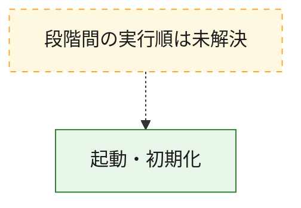
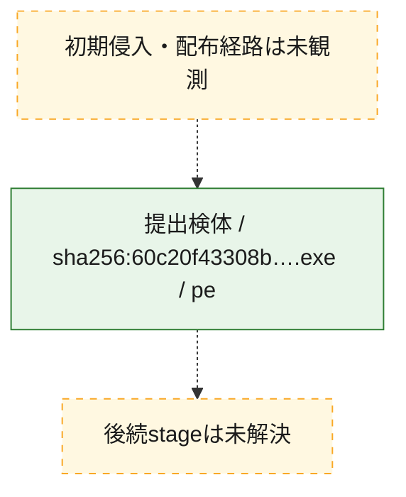
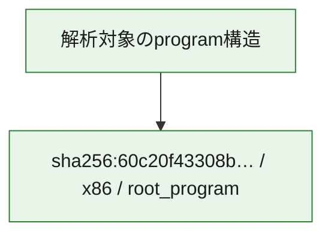

# 全体ロジック：60c20f43308bcba1e5db4bc9b794ac5e6203747d6209142abcbc896f552b9709

代表関数の静的証跡から、起動・初期化の処理群を確認しました。

## 読み方

- phaseの掲載順は解析上の整理順です。observed_call_edgesがない段階間の実行順を断定しません。
- 図の実線は静的に観測した関係、点線と黄色のノードは未観測・未解決の関係を示します。
- 図は静的な要約であり、動的実行を再現するものではありません。
- 詳細な関数解説とfingerprintは[STATIC-LOGIC.md](STATIC-LOGIC.md)を参照してください。

## 静的可視化

### 実行フロー

### 感染チェーン

### モジュール関係

## 処理段階

### 1. 起動・初期化

entry pointから初期化と後続処理への移行を確認します。
確度: `confirmed_static_function_evidence`

- `60c20f43308bcba1e5db4bc9b794ac5e6203747d6209142abcbc896f552b9709:ghidra:0040338f` — 初期化と主要処理への分岐を行う入口関数です。 状態: `succeeded`、選定理由: `entry_point`, `large_function:instructions=421`, `meaningful_symbol_name`, `reviewed_call_centrality:68`, `role:entrypoint`, `small_program_complete_context`

## 観測したcall関係

- `ghidra-function:94dc76553e26cb706c2d4187` → `ghidra-external:1d545d1444630006ee5f0baa` （`unclassified` → `unclassified`）
- `ghidra-function:94dc76553e26cb706c2d4187` → `ghidra-external:223bc1810b978940dd8a1e59` （`unclassified` → `unclassified`）
- `ghidra-function:94dc76553e26cb706c2d4187` → `ghidra-external:35b07eac875014600b834b38` （`unclassified` → `unclassified`）
- `ghidra-function:94dc76553e26cb706c2d4187` → `ghidra-external:38fc961d9253010088deab47` （`unclassified` → `unclassified`）
- `ghidra-function:94dc76553e26cb706c2d4187` → `ghidra-external:477f947aa7b17698038545da` （`unclassified` → `unclassified`）
- `ghidra-function:94dc76553e26cb706c2d4187` → `ghidra-external:4ae81553d7318743e8c34cfa` （`unclassified` → `unclassified`）
- `ghidra-function:94dc76553e26cb706c2d4187` → `ghidra-external:4d5f6db7c2d5e98fabc58e02` （`unclassified` → `unclassified`）
- `ghidra-function:94dc76553e26cb706c2d4187` → `ghidra-external:5ee6e623b979978e1138a051` （`unclassified` → `unclassified`）
- `ghidra-function:94dc76553e26cb706c2d4187` → `ghidra-external:62f295b7a5fba3de727075ca` （`unclassified` → `unclassified`）
- `ghidra-function:94dc76553e26cb706c2d4187` → `ghidra-external:6ce558dac07f96e299e393db` （`unclassified` → `unclassified`）
- `ghidra-function:94dc76553e26cb706c2d4187` → `ghidra-external:9842cd59a6d2623b54eab645` （`unclassified` → `unclassified`）
- `ghidra-function:94dc76553e26cb706c2d4187` → `ghidra-external:beacbc92926b8d166523534c` （`unclassified` → `unclassified`）
- `ghidra-function:94dc76553e26cb706c2d4187` → `ghidra-external:cca49161587559caf9265e0e` （`unclassified` → `unclassified`）
- `ghidra-function:94dc76553e26cb706c2d4187` → `ghidra-external:d007c8d00128212671b79bba` （`unclassified` → `unclassified`）
- `ghidra-function:94dc76553e26cb706c2d4187` → `ghidra-external:d64cfe0079e5011eeca475ab` （`unclassified` → `unclassified`）
- `ghidra-function:94dc76553e26cb706c2d4187` → `ghidra-external:dacd28f09552738bbdae7559` （`unclassified` → `unclassified`）
- `ghidra-function:94dc76553e26cb706c2d4187` → `ghidra-external:db9e62fe5f89e4509e117be2` （`unclassified` → `unclassified`）
- `ghidra-function:94dc76553e26cb706c2d4187` → `ghidra-external:e826a519de01dc042e4b6c16` （`unclassified` → `unclassified`）
- `ghidra-function:94dc76553e26cb706c2d4187` → `ghidra-external:ecb561a7c1579d9d2a7fb6b0` （`unclassified` → `unclassified`）
- `ghidra-function:94dc76553e26cb706c2d4187` → `ghidra-external:ee88cb7336dde2a20ab490b6` （`unclassified` → `unclassified`）
- `ghidra-function:94dc76553e26cb706c2d4187` → `ghidra-function:092428d7d192699b76617bc4` （`unclassified` → `unclassified`）
- `ghidra-function:94dc76553e26cb706c2d4187` → `ghidra-function:0c78ebaf5818be4cf6866346` （`unclassified` → `unclassified`）
- `ghidra-function:94dc76553e26cb706c2d4187` → `ghidra-function:1967a307c5a949cf3d7bf9df` （`unclassified` → `unclassified`）
- `ghidra-function:94dc76553e26cb706c2d4187` → `ghidra-function:227c59fce155d39c241bcd39` （`unclassified` → `unclassified`）
- `ghidra-function:94dc76553e26cb706c2d4187` → `ghidra-function:236ff1aba45864a72a86ab44` （`unclassified` → `unclassified`）
- `ghidra-function:94dc76553e26cb706c2d4187` → `ghidra-function:278c9abdd39237de1ec84073` （`unclassified` → `unclassified`）
- `ghidra-function:94dc76553e26cb706c2d4187` → `ghidra-function:4b035eebf34ef2972a51a91b` （`unclassified` → `unclassified`）
- `ghidra-function:94dc76553e26cb706c2d4187` → `ghidra-function:5b326ecc4458029a291bd1c0` （`unclassified` → `unclassified`）
- `ghidra-function:94dc76553e26cb706c2d4187` → `ghidra-function:7e7a0b54c6ea74deeb708ed4` （`unclassified` → `unclassified`）
- `ghidra-function:94dc76553e26cb706c2d4187` → `ghidra-function:8195416277c38e5e4040c8b5` （`unclassified` → `unclassified`）
- `ghidra-function:94dc76553e26cb706c2d4187` → `ghidra-function:84a89a0c64969ee5f965bc38` （`unclassified` → `unclassified`）
- `ghidra-function:94dc76553e26cb706c2d4187` → `ghidra-function:87090c678914bb82edcc54c4` （`unclassified` → `unclassified`）
- `ghidra-function:94dc76553e26cb706c2d4187` → `ghidra-function:92aaf64616f463ce182e7c3c` （`unclassified` → `unclassified`）
- `ghidra-function:94dc76553e26cb706c2d4187` → `ghidra-function:a020f3a902749f77c75768ca` （`unclassified` → `unclassified`）
- `ghidra-function:94dc76553e26cb706c2d4187` → `ghidra-function:a1efc7186568aba69692c967` （`unclassified` → `unclassified`）
- `ghidra-function:94dc76553e26cb706c2d4187` → `ghidra-function:b71c123dafdecc36b0231a79` （`unclassified` → `unclassified`）
- `ghidra-function:94dc76553e26cb706c2d4187` → `ghidra-function:b93484243a8fea142c1092f1` （`unclassified` → `unclassified`）
- `ghidra-function:94dc76553e26cb706c2d4187` → `ghidra-function:c05069846f611f96ae802fba` （`unclassified` → `unclassified`）
- `ghidra-function:94dc76553e26cb706c2d4187` → `ghidra-function:c4e062b3acf00eba9b452796` （`unclassified` → `unclassified`）
- `ghidra-function:94dc76553e26cb706c2d4187` → `ghidra-function:cc431ca02c215e506627422a` （`unclassified` → `unclassified`）
- `ghidra-function:94dc76553e26cb706c2d4187` → `ghidra-function:d0e0ad1d86005224a49f46b6` （`unclassified` → `unclassified`）
- `ghidra-function:94dc76553e26cb706c2d4187` → `ghidra-function:d4fd9776dd53d4bb89e704e8` （`unclassified` → `unclassified`）
- `ghidra-function:94dc76553e26cb706c2d4187` → `ghidra-function:d6330444cba22275fa993747` （`unclassified` → `unclassified`）
- `ghidra-function:94dc76553e26cb706c2d4187` → `ghidra-function:d9d34b8757f3f4b2a759cd1a` （`unclassified` → `unclassified`）

## 解析範囲と制約

- 選定外関数は全体inventoryへ残しますが、関数本体の個別解説対象にはしていません。
- indirect call、難読化、packer、VM、壊れたcontrol flowによりcall関係が欠落する場合があります。
- 文書は静的解析に基づき、検体実行や外部通信による動的確認は行っていません。
