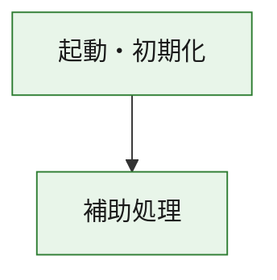
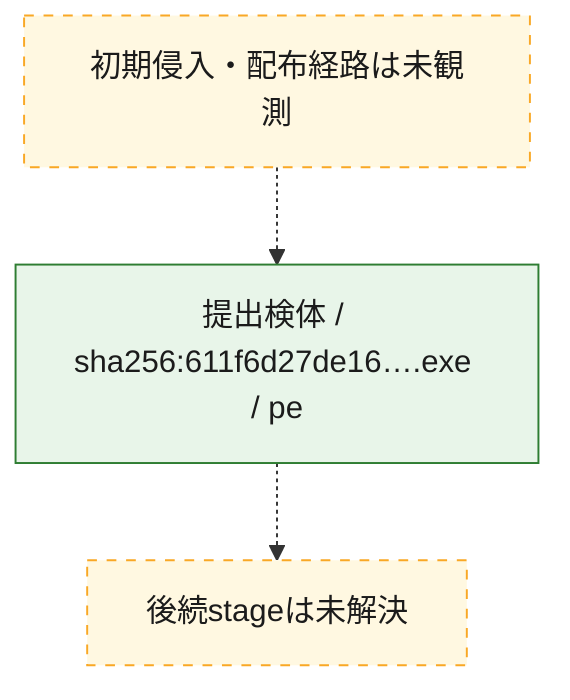
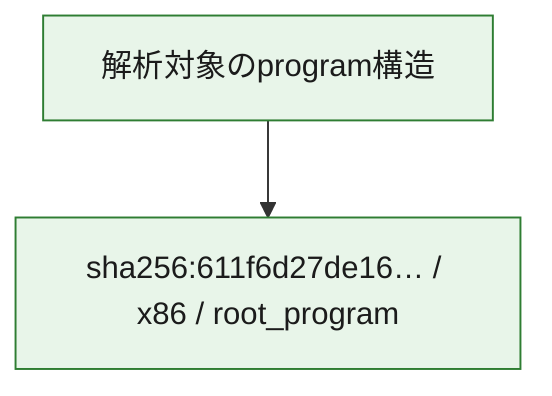

# 全体ロジック：611f6d27de16973deae28512447ceadf179ae8e9e60f9a17112bfef620dbb779

代表関数の静的証跡から、起動・初期化の処理群を確認しました。

## 読み方

- phaseの掲載順は解析上の整理順です。observed_call_edgesがない段階間の実行順を断定しません。
- 図の実線は静的に観測した関係、点線と黄色のノードは未観測・未解決の関係を示します。
- 図は静的な要約であり、動的実行を再現するものではありません。
- 詳細な関数解説とfingerprintは[STATIC-LOGIC.md](STATIC-LOGIC.md)を参照してください。

## 静的可視化

### 実行フロー

### 感染チェーン

### モジュール関係

## 処理段階

### 1. 起動・初期化

entry pointから初期化と後続処理への移行を確認します。
確度: `confirmed_static_function_evidence`

- `611f6d27de16973deae28512447ceadf179ae8e9e60f9a17112bfef620dbb779:ghidra:1400014c0` — 初期化と主要処理への分岐を行う入口関数です。 状態: `succeeded`、選定理由: `entry_point`, `meaningful_symbol_name`, `reviewed_call_centrality:1`, `role:entrypoint`

### 2. 補助処理

主要処理を支える一般内部関数またはlibrary処理を確認します。
確度: `confirmed_static_function_evidence`

- `611f6d27de16973deae28512447ceadf179ae8e9e60f9a17112bfef620dbb779:ghidra:140001000` — 検体内部の一般処理を実装する関数です。 状態: `succeeded`、選定理由: `context_representative`
- `611f6d27de16973deae28512447ceadf179ae8e9e60f9a17112bfef620dbb779:ghidra:140001010` — 検体内部の一般処理を実装する関数です。 状態: `succeeded`、選定理由: `context_representative`, `reviewed_call_centrality:6`
- `611f6d27de16973deae28512447ceadf179ae8e9e60f9a17112bfef620dbb779:ghidra:140001140` — 検体内部の一般処理を実装する関数です。 状態: `succeeded`、選定理由: `context_representative`, `reviewed_call_centrality:1`
- `611f6d27de16973deae28512447ceadf179ae8e9e60f9a17112bfef620dbb779:ghidra:140001190` — 検体内部の一般処理を実装する関数です。 状態: `succeeded`、選定理由: `context_representative`, `reviewed_call_centrality:24`
- `611f6d27de16973deae28512447ceadf179ae8e9e60f9a17112bfef620dbb779:ghidra:1400014e0` — 検体内部の一般処理を実装する関数です。 状態: `succeeded`、選定理由: `context_representative`, `reviewed_call_centrality:1`
- `611f6d27de16973deae28512447ceadf179ae8e9e60f9a17112bfef620dbb779:ghidra:140001500` — 検体内部の一般処理を実装する関数です。 状態: `succeeded`、選定理由: `context_representative`, `reviewed_call_centrality:1`
- `611f6d27de16973deae28512447ceadf179ae8e9e60f9a17112bfef620dbb779:ghidra:140001520` — 検体内部の一般処理を実装する関数です。 状態: `succeeded`、選定理由: `context_representative`, `reviewed_call_centrality:1`
- `611f6d27de16973deae28512447ceadf179ae8e9e60f9a17112bfef620dbb779:ghidra:140001530` — 検体内部の一般処理を実装する関数です。 状態: `succeeded`、選定理由: `context_representative`
- `611f6d27de16973deae28512447ceadf179ae8e9e60f9a17112bfef620dbb779:ghidra:140001540` — 検体内部の一般処理を実装する関数です。 状態: `succeeded`、選定理由: `context_representative`, `reviewed_call_centrality:1`
- `611f6d27de16973deae28512447ceadf179ae8e9e60f9a17112bfef620dbb779:ghidra:1400015f6` — 検体内部の一般処理を実装する関数です。 状態: `succeeded`、選定理由: `context_representative`, `reviewed_call_centrality:1`
- `611f6d27de16973deae28512447ceadf179ae8e9e60f9a17112bfef620dbb779:ghidra:140001661` — 検体内部の一般処理を実装する関数です。 状態: `succeeded`、選定理由: `context_representative`, `reviewed_call_centrality:2`
- `611f6d27de16973deae28512447ceadf179ae8e9e60f9a17112bfef620dbb779:ghidra:1400016b2` — 検体内部の一般処理を実装する関数です。 状態: `succeeded`、選定理由: `context_representative`, `reviewed_call_centrality:3`
- `611f6d27de16973deae28512447ceadf179ae8e9e60f9a17112bfef620dbb779:ghidra:140001750` — 検体内部の一般処理を実装する関数です。 状態: `succeeded`、選定理由: `context_representative`, `reviewed_call_centrality:1`
- `611f6d27de16973deae28512447ceadf179ae8e9e60f9a17112bfef620dbb779:ghidra:140001777` — 検体内部の一般処理を実装する関数です。 状態: `succeeded`、選定理由: `context_representative`, `reviewed_call_centrality:4`
- `611f6d27de16973deae28512447ceadf179ae8e9e60f9a17112bfef620dbb779:ghidra:1400017ee` — 検体内部の一般処理を実装する関数です。 状態: `succeeded`、選定理由: `context_representative`, `reviewed_call_centrality:3`
- `611f6d27de16973deae28512447ceadf179ae8e9e60f9a17112bfef620dbb779:ghidra:140001865` — 検体内部の一般処理を実装する関数です。 状態: `succeeded`、選定理由: `context_representative`, `reviewed_call_centrality:3`
- `611f6d27de16973deae28512447ceadf179ae8e9e60f9a17112bfef620dbb779:ghidra:1400018f3` — 検体内部の一般処理を実装する関数です。 状態: `succeeded`、選定理由: `context_representative`, `reviewed_call_centrality:4`
- `611f6d27de16973deae28512447ceadf179ae8e9e60f9a17112bfef620dbb779:ghidra:140001933` — 検体内部の一般処理を実装する関数です。 状態: `succeeded`、選定理由: `context_representative`, `reviewed_call_centrality:4`
- `611f6d27de16973deae28512447ceadf179ae8e9e60f9a17112bfef620dbb779:ghidra:140001b41` — 検体内部の一般処理を実装する関数です。 状態: `succeeded`、選定理由: `context_representative`, `reviewed_call_centrality:3`
- `611f6d27de16973deae28512447ceadf179ae8e9e60f9a17112bfef620dbb779:ghidra:140001b7f` — 検体内部の一般処理を実装する関数です。 状態: `succeeded`、選定理由: `context_representative`, `reviewed_call_centrality:2`
- `611f6d27de16973deae28512447ceadf179ae8e9e60f9a17112bfef620dbb779:ghidra:140001be2` — 検体内部の一般処理を実装する関数です。 状態: `succeeded`、選定理由: `context_representative`, `reviewed_call_centrality:5`
- `611f6d27de16973deae28512447ceadf179ae8e9e60f9a17112bfef620dbb779:ghidra:140001c0c` — 検体内部の一般処理を実装する関数です。 状態: `succeeded`、選定理由: `context_representative`, `reviewed_call_centrality:3`
- `611f6d27de16973deae28512447ceadf179ae8e9e60f9a17112bfef620dbb779:ghidra:140001c16` — 検体内部の一般処理を実装する関数です。 状態: `succeeded`、選定理由: `context_representative`, `reviewed_call_centrality:3`
- `611f6d27de16973deae28512447ceadf179ae8e9e60f9a17112bfef620dbb779:ghidra:140001c20` — 検体内部の一般処理を実装する関数です。 状態: `succeeded`、選定理由: `context_representative`, `reviewed_call_centrality:3`
- `611f6d27de16973deae28512447ceadf179ae8e9e60f9a17112bfef620dbb779:ghidra:140001c2a` — 検体内部の一般処理を実装する関数です。 状態: `succeeded`、選定理由: `context_representative`, `reviewed_call_centrality:4`
- `611f6d27de16973deae28512447ceadf179ae8e9e60f9a17112bfef620dbb779:ghidra:140001d3a` — 検体内部の一般処理を実装する関数です。 状態: `succeeded`、選定理由: `context_representative`, `reviewed_call_centrality:6`
- `611f6d27de16973deae28512447ceadf179ae8e9e60f9a17112bfef620dbb779:ghidra:140001f25` — 検体内部の一般処理を実装する関数です。 状態: `succeeded`、選定理由: `context_representative`, `reviewed_call_centrality:19`
- `611f6d27de16973deae28512447ceadf179ae8e9e60f9a17112bfef620dbb779:ghidra:1400041f0` — 検体内部の一般処理を実装する関数です。 状態: `succeeded`、選定理由: `context_representative`
- `611f6d27de16973deae28512447ceadf179ae8e9e60f9a17112bfef620dbb779:ghidra:14000d890` — compiler生成処理または汎用library処理とみられる関数です。 状態: `succeeded`、選定理由: `entry_point`, `meaningful_symbol_name`, `reviewed_call_centrality:1`
- `611f6d27de16973deae28512447ceadf179ae8e9e60f9a17112bfef620dbb779:ghidra:14000d8c0` — compiler生成処理または汎用library処理とみられる関数です。 状態: `succeeded`、選定理由: `entry_point`, `meaningful_symbol_name`, `reviewed_call_centrality:3`
- `611f6d27de16973deae28512447ceadf179ae8e9e60f9a17112bfef620dbb779:ghidra:140013a40` — compiler生成処理または汎用library処理とみられる関数です。 状態: `succeeded`、選定理由: `entry_point`, `meaningful_symbol_name`, `reviewed_call_centrality:28`

## 観測したcall関係

- `611f6d27de16973deae28512447ceadf179ae8e9e60f9a17112bfef620dbb779:ghidra:140001190` → `611f6d27de16973deae28512447ceadf179ae8e9e60f9a17112bfef620dbb779:ghidra:14000d8c0` （`support` → `support`）
- `611f6d27de16973deae28512447ceadf179ae8e9e60f9a17112bfef620dbb779:ghidra:1400014c0` → `611f6d27de16973deae28512447ceadf179ae8e9e60f9a17112bfef620dbb779:ghidra:140001190` （`startup` → `support`）
- `611f6d27de16973deae28512447ceadf179ae8e9e60f9a17112bfef620dbb779:ghidra:1400014e0` → `611f6d27de16973deae28512447ceadf179ae8e9e60f9a17112bfef620dbb779:ghidra:140001190` （`support` → `support`）
- `611f6d27de16973deae28512447ceadf179ae8e9e60f9a17112bfef620dbb779:ghidra:1400016b2` → `611f6d27de16973deae28512447ceadf179ae8e9e60f9a17112bfef620dbb779:ghidra:140001661` （`support` → `support`）
- `611f6d27de16973deae28512447ceadf179ae8e9e60f9a17112bfef620dbb779:ghidra:140001750` → `611f6d27de16973deae28512447ceadf179ae8e9e60f9a17112bfef620dbb779:ghidra:1400016b2` （`support` → `support`）
- `611f6d27de16973deae28512447ceadf179ae8e9e60f9a17112bfef620dbb779:ghidra:1400018f3` → `611f6d27de16973deae28512447ceadf179ae8e9e60f9a17112bfef620dbb779:ghidra:140001777` （`support` → `support`）
- `611f6d27de16973deae28512447ceadf179ae8e9e60f9a17112bfef620dbb779:ghidra:1400018f3` → `611f6d27de16973deae28512447ceadf179ae8e9e60f9a17112bfef620dbb779:ghidra:1400017ee` （`support` → `support`）
- `611f6d27de16973deae28512447ceadf179ae8e9e60f9a17112bfef620dbb779:ghidra:1400018f3` → `611f6d27de16973deae28512447ceadf179ae8e9e60f9a17112bfef620dbb779:ghidra:140001865` （`support` → `support`）
- `611f6d27de16973deae28512447ceadf179ae8e9e60f9a17112bfef620dbb779:ghidra:140001c0c` → `611f6d27de16973deae28512447ceadf179ae8e9e60f9a17112bfef620dbb779:ghidra:140001be2` （`support` → `support`）
- `611f6d27de16973deae28512447ceadf179ae8e9e60f9a17112bfef620dbb779:ghidra:140001c16` → `611f6d27de16973deae28512447ceadf179ae8e9e60f9a17112bfef620dbb779:ghidra:140001be2` （`support` → `support`）
- `611f6d27de16973deae28512447ceadf179ae8e9e60f9a17112bfef620dbb779:ghidra:140001c20` → `611f6d27de16973deae28512447ceadf179ae8e9e60f9a17112bfef620dbb779:ghidra:140001be2` （`support` → `support`）
- `611f6d27de16973deae28512447ceadf179ae8e9e60f9a17112bfef620dbb779:ghidra:140001d3a` → `611f6d27de16973deae28512447ceadf179ae8e9e60f9a17112bfef620dbb779:ghidra:140001777` （`support` → `support`）
- `611f6d27de16973deae28512447ceadf179ae8e9e60f9a17112bfef620dbb779:ghidra:140001d3a` → `611f6d27de16973deae28512447ceadf179ae8e9e60f9a17112bfef620dbb779:ghidra:1400017ee` （`support` → `support`）
- `611f6d27de16973deae28512447ceadf179ae8e9e60f9a17112bfef620dbb779:ghidra:140001d3a` → `611f6d27de16973deae28512447ceadf179ae8e9e60f9a17112bfef620dbb779:ghidra:140001865` （`support` → `support`）
- `611f6d27de16973deae28512447ceadf179ae8e9e60f9a17112bfef620dbb779:ghidra:140001d3a` → `611f6d27de16973deae28512447ceadf179ae8e9e60f9a17112bfef620dbb779:ghidra:140001c2a` （`support` → `support`）
- `611f6d27de16973deae28512447ceadf179ae8e9e60f9a17112bfef620dbb779:ghidra:140001f25` → `611f6d27de16973deae28512447ceadf179ae8e9e60f9a17112bfef620dbb779:ghidra:140001540` （`support` → `support`）
- `611f6d27de16973deae28512447ceadf179ae8e9e60f9a17112bfef620dbb779:ghidra:140001f25` → `611f6d27de16973deae28512447ceadf179ae8e9e60f9a17112bfef620dbb779:ghidra:1400015f6` （`support` → `support`）
- `611f6d27de16973deae28512447ceadf179ae8e9e60f9a17112bfef620dbb779:ghidra:140001f25` → `611f6d27de16973deae28512447ceadf179ae8e9e60f9a17112bfef620dbb779:ghidra:1400016b2` （`support` → `support`）
- `611f6d27de16973deae28512447ceadf179ae8e9e60f9a17112bfef620dbb779:ghidra:140001f25` → `611f6d27de16973deae28512447ceadf179ae8e9e60f9a17112bfef620dbb779:ghidra:140001777` （`support` → `support`）
- `611f6d27de16973deae28512447ceadf179ae8e9e60f9a17112bfef620dbb779:ghidra:140001f25` → `611f6d27de16973deae28512447ceadf179ae8e9e60f9a17112bfef620dbb779:ghidra:1400017ee` （`support` → `support`）
- `611f6d27de16973deae28512447ceadf179ae8e9e60f9a17112bfef620dbb779:ghidra:140001f25` → `611f6d27de16973deae28512447ceadf179ae8e9e60f9a17112bfef620dbb779:ghidra:1400018f3` （`support` → `support`）
- `611f6d27de16973deae28512447ceadf179ae8e9e60f9a17112bfef620dbb779:ghidra:140001f25` → `611f6d27de16973deae28512447ceadf179ae8e9e60f9a17112bfef620dbb779:ghidra:140001933` （`support` → `support`）
- `611f6d27de16973deae28512447ceadf179ae8e9e60f9a17112bfef620dbb779:ghidra:140001f25` → `611f6d27de16973deae28512447ceadf179ae8e9e60f9a17112bfef620dbb779:ghidra:140001b41` （`support` → `support`）
- `611f6d27de16973deae28512447ceadf179ae8e9e60f9a17112bfef620dbb779:ghidra:140001f25` → `611f6d27de16973deae28512447ceadf179ae8e9e60f9a17112bfef620dbb779:ghidra:140001b7f` （`support` → `support`）
- `611f6d27de16973deae28512447ceadf179ae8e9e60f9a17112bfef620dbb779:ghidra:140001f25` → `611f6d27de16973deae28512447ceadf179ae8e9e60f9a17112bfef620dbb779:ghidra:140001c2a` （`support` → `support`）
- `611f6d27de16973deae28512447ceadf179ae8e9e60f9a17112bfef620dbb779:ghidra:140001f25` → `611f6d27de16973deae28512447ceadf179ae8e9e60f9a17112bfef620dbb779:ghidra:140001d3a` （`support` → `support`）
- `ghidra-function:020cd1dd8fc7e40336564da5` → `ghidra-external:6a7b164a7b29dd966092026d` （`unclassified` → `unclassified`）
- `ghidra-function:020cd1dd8fc7e40336564da5` → `ghidra-external:8433656b0c28a29f99fe9c63` （`unclassified` → `unclassified`）
- `ghidra-function:0770e86159ff702145f4c26a` → `ghidra-external:687bf755417f45b2472472f0` （`unclassified` → `unclassified`）
- `ghidra-function:0ec75d5a244e449d98c9cd74` → `ghidra-external:6a054098424e5a88c3fb6f3a` （`unclassified` → `unclassified`）
- `ghidra-function:0ec75d5a244e449d98c9cd74` → `ghidra-function:c9b5879598329cf7cb614a55` （`unclassified` → `unclassified`）
- `ghidra-function:1460779aaafe247dd05501df` → `ghidra-external:6a054098424e5a88c3fb6f3a` （`unclassified` → `unclassified`）
- `ghidra-function:1460779aaafe247dd05501df` → `ghidra-external:ba684effb08f6f0f5f794c8c` （`unclassified` → `unclassified`）
- `ghidra-function:1460779aaafe247dd05501df` → `ghidra-function:2f9dca1412241ac94f058218` （`unclassified` → `unclassified`）
- `ghidra-function:1460779aaafe247dd05501df` → `ghidra-function:3c0fc903ada72528d3a30dca` （`unclassified` → `unclassified`）
- `ghidra-function:1460779aaafe247dd05501df` → `ghidra-function:538e7408296e4f1b641db535` （`unclassified` → `unclassified`）
- `ghidra-function:1460779aaafe247dd05501df` → `ghidra-function:ccdeba9fbfb39901f844dbf5` （`unclassified` → `unclassified`）
- `ghidra-function:4e2014441ce7936b6f91aba8` → `ghidra-external:a7a7f9fff1815fedf4a5bb77` （`unclassified` → `unclassified`）
- `ghidra-function:5870a15393a84f174eab4b3d` → `ghidra-function:e9fadadb1cfae15d86f867e3` （`unclassified` → `unclassified`）
- `ghidra-function:5a894615256a52672d93141a` → `ghidra-function:a9be5a12cae18dc3f58eb694` （`unclassified` → `unclassified`）
- `ghidra-function:6252fb65473bd1c1874dfe71` → `ghidra-external:6a7b164a7b29dd966092026d` （`unclassified` → `unclassified`）
- `ghidra-function:6252fb65473bd1c1874dfe71` → `ghidra-external:8433656b0c28a29f99fe9c63` （`unclassified` → `unclassified`）
- `ghidra-function:6252fb65473bd1c1874dfe71` → `ghidra-function:992899441139b519c47aa0fe` （`unclassified` → `unclassified`）
- `ghidra-function:639d0ed72e818458c0aa9bf6` → `ghidra-function:c9b5879598329cf7cb614a55` （`unclassified` → `unclassified`）
- `ghidra-function:6a80d6a9e3e75305f33110b5` → `ghidra-external:8433656b0c28a29f99fe9c63` （`unclassified` → `unclassified`）
- `ghidra-function:7c00580412522be399b539fd` → `ghidra-external:8433656b0c28a29f99fe9c63` （`unclassified` → `unclassified`）
- `ghidra-function:7c2782e3f3311c68b92e2804` → `ghidra-external:883fa97b80ddf04a61d48e12` （`unclassified` → `unclassified`）
- `ghidra-function:81d65c723dbe77e4c20fd187` → `ghidra-external:6a7b164a7b29dd966092026d` （`unclassified` → `unclassified`）
- `ghidra-function:81d65c723dbe77e4c20fd187` → `ghidra-external:8433656b0c28a29f99fe9c63` （`unclassified` → `unclassified`）
- `ghidra-function:81d65c723dbe77e4c20fd187` → `ghidra-function:992899441139b519c47aa0fe` （`unclassified` → `unclassified`）
- `ghidra-function:88b8aef7f06d73bc6bf71dbd` → `ghidra-function:5870a15393a84f174eab4b3d` （`unclassified` → `unclassified`）
- `ghidra-function:8c67ebc165b39facf93888a5` → `ghidra-external:6a7b164a7b29dd966092026d` （`unclassified` → `unclassified`）
- `ghidra-function:8c67ebc165b39facf93888a5` → `ghidra-external:8433656b0c28a29f99fe9c63` （`unclassified` → `unclassified`）
- `ghidra-function:8d2d7290490b971206e8f79a` → `ghidra-function:a9be5a12cae18dc3f58eb694` （`unclassified` → `unclassified`）
- `ghidra-function:992899441139b519c47aa0fe` → `ghidra-function:998e7ac0190fd25bebe007ea` （`unclassified` → `unclassified`）
- `ghidra-function:a9be5a12cae18dc3f58eb694` → `ghidra-external:13d259f823caf5a37186cd33` （`unclassified` → `unclassified`）
- `ghidra-function:a9be5a12cae18dc3f58eb694` → `ghidra-external:19daecd759b747201531b9ac` （`unclassified` → `unclassified`）
- `ghidra-function:a9be5a12cae18dc3f58eb694` → `ghidra-external:4ecfe16f3e12a2f328fcbc51` （`unclassified` → `unclassified`）
- `ghidra-function:a9be5a12cae18dc3f58eb694` → `ghidra-external:5a0aab5a76cba17ed37f5c3d` （`unclassified` → `unclassified`）
- `ghidra-function:a9be5a12cae18dc3f58eb694` → `ghidra-external:883fa97b80ddf04a61d48e12` （`unclassified` → `unclassified`）
- `ghidra-function:a9be5a12cae18dc3f58eb694` → `ghidra-external:ae420910979f92e74800d7b4` （`unclassified` → `unclassified`）
- `ghidra-function:a9be5a12cae18dc3f58eb694` → `ghidra-external:b51550da4658970fd06c0611` （`unclassified` → `unclassified`）
- `ghidra-function:a9be5a12cae18dc3f58eb694` → `ghidra-external:e6603781ad07f6598cfe1c10` （`unclassified` → `unclassified`）
- `ghidra-function:a9be5a12cae18dc3f58eb694` → `ghidra-external:fce40ba63f42584a39dcc94f` （`unclassified` → `unclassified`）
- `ghidra-function:a9be5a12cae18dc3f58eb694` → `ghidra-function:0ec75d5a244e449d98c9cd74` （`unclassified` → `unclassified`）
- `ghidra-function:a9be5a12cae18dc3f58eb694` → `ghidra-function:131a8d1d35fcace677e9c26b` （`unclassified` → `unclassified`）
- `ghidra-function:a9be5a12cae18dc3f58eb694` → `ghidra-function:5b120a3967219645614db3a4` （`unclassified` → `unclassified`）
- `ghidra-function:a9be5a12cae18dc3f58eb694` → `ghidra-function:5c408ca2e31d119d22a06281` （`unclassified` → `unclassified`）
- `ghidra-function:a9be5a12cae18dc3f58eb694` → `ghidra-function:998e7ac0190fd25bebe007ea` （`unclassified` → `unclassified`）
- `ghidra-function:a9be5a12cae18dc3f58eb694` → `ghidra-function:9a82aa2f7b46c3ae7c1d2ee2` （`unclassified` → `unclassified`）
- `ghidra-function:a9be5a12cae18dc3f58eb694` → `ghidra-function:a62db023e50a5dde878d0cfe` （`unclassified` → `unclassified`）
- `ghidra-function:a9be5a12cae18dc3f58eb694` → `ghidra-function:bd06b4ac75adcbbd0fc99037` （`unclassified` → `unclassified`）
- `ghidra-function:a9be5a12cae18dc3f58eb694` → `ghidra-function:de445a61067f4a69fe833814` （`unclassified` → `unclassified`）
- `ghidra-function:a9be5a12cae18dc3f58eb694` → `ghidra-function:feb24f92cd7009e5814ddad9` （`unclassified` → `unclassified`）
- `ghidra-function:b093e6c057dcfc5016b502bf` → `ghidra-external:8433656b0c28a29f99fe9c63` （`unclassified` → `unclassified`）
- `ghidra-function:b093e6c057dcfc5016b502bf` → `ghidra-function:6a80d6a9e3e75305f33110b5` （`unclassified` → `unclassified`）
- `ghidra-function:b093e6c057dcfc5016b502bf` → `ghidra-function:7c00580412522be399b539fd` （`unclassified` → `unclassified`）
- `ghidra-function:b093e6c057dcfc5016b502bf` → `ghidra-function:8c67ebc165b39facf93888a5` （`unclassified` → `unclassified`）
- `ghidra-function:b093e6c057dcfc5016b502bf` → `ghidra-function:a5b2ca28cd1f81756ba4a270` （`unclassified` → `unclassified`）
- `ghidra-function:cddf7c53dcff9651b378bcf6` → `ghidra-external:8b90658c6ed3f7e8e5da2d8f` （`unclassified` → `unclassified`）
- `ghidra-function:cddf7c53dcff9651b378bcf6` → `ghidra-function:1051018fd7c2716363543844` （`unclassified` → `unclassified`）
- `ghidra-function:cddf7c53dcff9651b378bcf6` → `ghidra-function:1af5b4ce07ea264deda5ed7f` （`unclassified` → `unclassified`）
- `ghidra-function:cddf7c53dcff9651b378bcf6` → `ghidra-function:23cd959b283f563673884ac8` （`unclassified` → `unclassified`）
- `ghidra-function:cddf7c53dcff9651b378bcf6` → `ghidra-function:390d2cb0875d98e88ddf2233` （`unclassified` → `unclassified`）
- `ghidra-function:cddf7c53dcff9651b378bcf6` → `ghidra-function:4212da636b423235ae4ca2e0` （`unclassified` → `unclassified`）
- `ghidra-function:cddf7c53dcff9651b378bcf6` → `ghidra-function:429271551ad47ad628dd0e2e` （`unclassified` → `unclassified`）
- `ghidra-function:cddf7c53dcff9651b378bcf6` → `ghidra-function:57078ad0f7e8144d429044fd` （`unclassified` → `unclassified`）
- `ghidra-function:cddf7c53dcff9651b378bcf6` → `ghidra-function:5f65c6a28ea335bc9b6d4d68` （`unclassified` → `unclassified`）
- `ghidra-function:cddf7c53dcff9651b378bcf6` → `ghidra-function:6bf87a9743fbc9fbc0cc790d` （`unclassified` → `unclassified`）
- `ghidra-function:cddf7c53dcff9651b378bcf6` → `ghidra-function:7697df2e6422a914a0ef742d` （`unclassified` → `unclassified`）
- `ghidra-function:cddf7c53dcff9651b378bcf6` → `ghidra-function:7b3fb6e074d56e9f3545ed31` （`unclassified` → `unclassified`）
- `ghidra-function:cddf7c53dcff9651b378bcf6` → `ghidra-function:97ccabe5dd289de3dd6656e5` （`unclassified` → `unclassified`）
- `ghidra-function:cddf7c53dcff9651b378bcf6` → `ghidra-function:998e7ac0190fd25bebe007ea` （`unclassified` → `unclassified`）
- `ghidra-function:cddf7c53dcff9651b378bcf6` → `ghidra-function:b0eb54c226fb3b08fc58febe` （`unclassified` → `unclassified`）
- `ghidra-function:cddf7c53dcff9651b378bcf6` → `ghidra-function:bd276b74102b14b8add7f89e` （`unclassified` → `unclassified`）
- `ghidra-function:cddf7c53dcff9651b378bcf6` → `ghidra-function:c89fad29fbd0d3a8c3db3653` （`unclassified` → `unclassified`）
- `ghidra-function:cddf7c53dcff9651b378bcf6` → `ghidra-function:de445a61067f4a69fe833814` （`unclassified` → `unclassified`）
- `ghidra-function:cddf7c53dcff9651b378bcf6` → `ghidra-function:e1110bb6145e6b3271392313` （`unclassified` → `unclassified`）
- `ghidra-function:cddf7c53dcff9651b378bcf6` → `ghidra-function:e57dd8d516c3b086f6b9cf48` （`unclassified` → `unclassified`）
- `ghidra-function:d6b8c54cb52f82e509330270` → `ghidra-external:8433656b0c28a29f99fe9c63` （`unclassified` → `unclassified`）
- `ghidra-function:d6b8c54cb52f82e509330270` → `ghidra-external:a6b4c4eb805c5000adb2a5ac` （`unclassified` → `unclassified`）
- `ghidra-function:d6b8c54cb52f82e509330270` → `ghidra-external:e9580965da9d929f4a023cd1` （`unclassified` → `unclassified`）
- `ghidra-function:dc11dad661fad858ebf73112` → `ghidra-external:04383530ead20ff8386fddbc` （`unclassified` → `unclassified`）
- `ghidra-function:dc11dad661fad858ebf73112` → `ghidra-external:07fa4eb6cfe6081b73cb6dec` （`unclassified` → `unclassified`）
- `ghidra-function:dc11dad661fad858ebf73112` → `ghidra-external:883fa97b80ddf04a61d48e12` （`unclassified` → `unclassified`）
- `ghidra-function:dc11dad661fad858ebf73112` → `ghidra-external:d82f9facb07040fe4887aeec` （`unclassified` → `unclassified`）
- `ghidra-function:dc11dad661fad858ebf73112` → `ghidra-function:020cd1dd8fc7e40336564da5` （`unclassified` → `unclassified`）
- `ghidra-function:dc11dad661fad858ebf73112` → `ghidra-function:5870a15393a84f174eab4b3d` （`unclassified` → `unclassified`）
- `ghidra-function:dc11dad661fad858ebf73112` → `ghidra-function:713cf85d9ab2434b11e436a9` （`unclassified` → `unclassified`）
- `ghidra-function:dc11dad661fad858ebf73112` → `ghidra-function:7c00580412522be399b539fd` （`unclassified` → `unclassified`）
- `ghidra-function:dc11dad661fad858ebf73112` → `ghidra-function:7c2782e3f3311c68b92e2804` （`unclassified` → `unclassified`）
- `ghidra-function:dc11dad661fad858ebf73112` → `ghidra-function:8c67ebc165b39facf93888a5` （`unclassified` → `unclassified`）
- `ghidra-function:dc11dad661fad858ebf73112` → `ghidra-function:a58cb1a4b9163c2b07519076` （`unclassified` → `unclassified`）
- `ghidra-function:dc11dad661fad858ebf73112` → `ghidra-function:a5b2ca28cd1f81756ba4a270` （`unclassified` → `unclassified`）
- `ghidra-function:dc11dad661fad858ebf73112` → `ghidra-function:ad79324070021db14d68412a` （`unclassified` → `unclassified`）
- `ghidra-function:dc11dad661fad858ebf73112` → `ghidra-function:b093e6c057dcfc5016b502bf` （`unclassified` → `unclassified`）
- `ghidra-function:dc11dad661fad858ebf73112` → `ghidra-function:d3d4e966b851b5bbfc16158a` （`unclassified` → `unclassified`）
- `ghidra-function:dc11dad661fad858ebf73112` → `ghidra-function:d6b8c54cb52f82e509330270` （`unclassified` → `unclassified`）
- `ghidra-function:dc11dad661fad858ebf73112` → `ghidra-function:ef37923a4a609f186e4e7535` （`unclassified` → `unclassified`）
- `ghidra-function:e9fadadb1cfae15d86f867e3` → `ghidra-external:8433656b0c28a29f99fe9c63` （`unclassified` → `unclassified`）
- `ghidra-function:eae263840379b5fde462dbf0` → `ghidra-external:a7a7f9fff1815fedf4a5bb77` （`unclassified` → `unclassified`）
- `ghidra-function:ef37923a4a609f186e4e7535` → `ghidra-function:6a80d6a9e3e75305f33110b5` （`unclassified` → `unclassified`）
- `ghidra-function:ef37923a4a609f186e4e7535` → `ghidra-function:7c00580412522be399b539fd` （`unclassified` → `unclassified`）
- `ghidra-function:ef37923a4a609f186e4e7535` → `ghidra-function:a5b2ca28cd1f81756ba4a270` （`unclassified` → `unclassified`）
- `ghidra-function:fbb548691a34328cda504349` → `ghidra-external:6a7b164a7b29dd966092026d` （`unclassified` → `unclassified`）
- `ghidra-function:fbb548691a34328cda504349` → `ghidra-external:8433656b0c28a29f99fe9c63` （`unclassified` → `unclassified`）
- `ghidra-function:fbb548691a34328cda504349` → `ghidra-function:992899441139b519c47aa0fe` （`unclassified` → `unclassified`）

## 解析範囲と制約

- 選定外関数は全体inventoryへ残しますが、関数本体の個別解説対象にはしていません。
- indirect call、難読化、packer、VM、壊れたcontrol flowによりcall関係が欠落する場合があります。
- 文書は静的解析に基づき、検体実行や外部通信による動的確認は行っていません。
