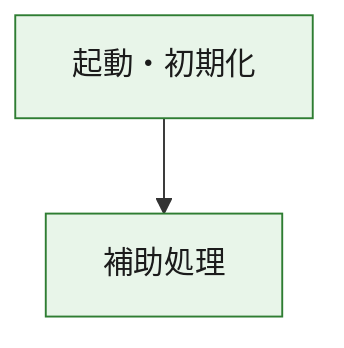
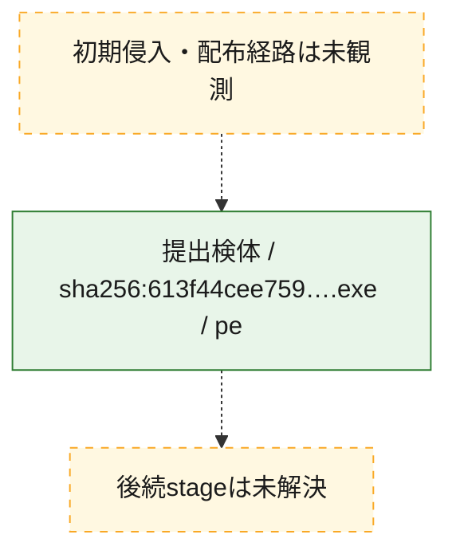
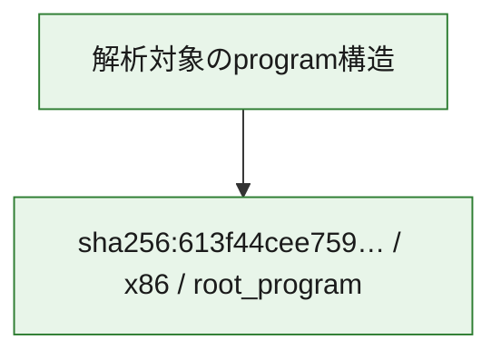

# 全体ロジック：613f44cee75950783397a3f59c9d26fb22b175811496e6b4aab0682c202e9303

代表関数の静的証跡から、起動・初期化の処理群を確認しました。

## 読み方

- phaseの掲載順は解析上の整理順です。observed_call_edgesがない段階間の実行順を断定しません。
- 図の実線は静的に観測した関係、点線と黄色のノードは未観測・未解決の関係を示します。
- 図は静的な要約であり、動的実行を再現するものではありません。
- 詳細な関数解説とfingerprintは[STATIC-LOGIC.md](STATIC-LOGIC.md)を参照してください。

## 静的可視化

### 実行フロー

### 感染チェーン

### モジュール関係

## 処理段階

### 1. 起動・初期化

entry pointから初期化と後続処理への移行を確認します。
確度: `confirmed_static_function_evidence`

- `613f44cee75950783397a3f59c9d26fb22b175811496e6b4aab0682c202e9303:ghidra:180001010` — 初期化と主要処理への分岐を行う入口関数です。 状態: `succeeded`、選定理由: `entry_point`, `meaningful_symbol_name`, `reviewed_call_centrality:22`, `role:entrypoint`, `small_program_complete_context`

### 2. 補助処理

主要処理を支える一般内部関数またはlibrary処理を確認します。
確度: `confirmed_static_function_evidence`

- `613f44cee75950783397a3f59c9d26fb22b175811496e6b4aab0682c202e9303:ghidra:180001240` — 検体内部の一般処理を実装する関数です。 状態: `succeeded`、選定理由: `context_representative`, `reviewed_call_centrality:2`, `small_program_complete_context`
- `613f44cee75950783397a3f59c9d26fb22b175811496e6b4aab0682c202e9303:ghidra:180001350` — 検体内部の一般処理を実装する関数です。 状態: `succeeded`、選定理由: `context_representative`, `reviewed_call_centrality:25`, `small_program_complete_context`
- `613f44cee75950783397a3f59c9d26fb22b175811496e6b4aab0682c202e9303:ghidra:180003780` — 検体内部の一般処理を実装する関数です。 状態: `succeeded`、選定理由: `context_representative`, `reviewed_call_centrality:2`, `small_program_complete_context`
- `613f44cee75950783397a3f59c9d26fb22b175811496e6b4aab0682c202e9303:ghidra:1800038e0` — 検体内部の一般処理を実装する関数です。 状態: `succeeded`、選定理由: `context_representative`, `reviewed_call_centrality:2`, `small_program_complete_context`

## 観測したcall関係

- `613f44cee75950783397a3f59c9d26fb22b175811496e6b4aab0682c202e9303:ghidra:180001010` → `613f44cee75950783397a3f59c9d26fb22b175811496e6b4aab0682c202e9303:ghidra:180001240` （`startup` → `support`）
- `613f44cee75950783397a3f59c9d26fb22b175811496e6b4aab0682c202e9303:ghidra:180001010` → `613f44cee75950783397a3f59c9d26fb22b175811496e6b4aab0682c202e9303:ghidra:180001350` （`startup` → `support`）
- `613f44cee75950783397a3f59c9d26fb22b175811496e6b4aab0682c202e9303:ghidra:180001350` → `613f44cee75950783397a3f59c9d26fb22b175811496e6b4aab0682c202e9303:ghidra:180001240` （`support` → `support`）
- `613f44cee75950783397a3f59c9d26fb22b175811496e6b4aab0682c202e9303:ghidra:180001350` → `613f44cee75950783397a3f59c9d26fb22b175811496e6b4aab0682c202e9303:ghidra:180003780` （`support` → `support`）
- `613f44cee75950783397a3f59c9d26fb22b175811496e6b4aab0682c202e9303:ghidra:180001350` → `613f44cee75950783397a3f59c9d26fb22b175811496e6b4aab0682c202e9303:ghidra:1800038e0` （`support` → `support`）
- `613f44cee75950783397a3f59c9d26fb22b175811496e6b4aab0682c202e9303:ghidra:180003780` → `613f44cee75950783397a3f59c9d26fb22b175811496e6b4aab0682c202e9303:ghidra:1800038e0` （`support` → `support`）
- `ghidra-function:4ff6da0a15ae8b579b65c544` → `ghidra-external:065ccff11d8ebbca04d9cd9c` （`unclassified` → `unclassified`）
- `ghidra-function:4ff6da0a15ae8b579b65c544` → `ghidra-external:0908e5dfbfbf31f5daf2fc9e` （`unclassified` → `unclassified`）
- `ghidra-function:4ff6da0a15ae8b579b65c544` → `ghidra-external:0b3f854901c2a4efcfb373e7` （`unclassified` → `unclassified`）
- `ghidra-function:4ff6da0a15ae8b579b65c544` → `ghidra-external:23b95524e162bbbb7bb5a1f2` （`unclassified` → `unclassified`）
- `ghidra-function:4ff6da0a15ae8b579b65c544` → `ghidra-external:313a074ed6fbf9881fe32875` （`unclassified` → `unclassified`）
- `ghidra-function:4ff6da0a15ae8b579b65c544` → `ghidra-external:385059093cdff4d862a6d42f` （`unclassified` → `unclassified`）
- `ghidra-function:4ff6da0a15ae8b579b65c544` → `ghidra-external:3cbe36d330a8e1a221f369a3` （`unclassified` → `unclassified`）
- `ghidra-function:4ff6da0a15ae8b579b65c544` → `ghidra-external:5dd0bdecc4028c38dc0df767` （`unclassified` → `unclassified`）
- `ghidra-function:4ff6da0a15ae8b579b65c544` → `ghidra-external:6172cb23896868990b6a0c72` （`unclassified` → `unclassified`）
- `ghidra-function:4ff6da0a15ae8b579b65c544` → `ghidra-external:71bcff4f061b81232d18149f` （`unclassified` → `unclassified`）
- `ghidra-function:4ff6da0a15ae8b579b65c544` → `ghidra-external:77fb4ba364b4b42e1a330376` （`unclassified` → `unclassified`）
- `ghidra-function:4ff6da0a15ae8b579b65c544` → `ghidra-external:7e9af5ef40a78021d467c93f` （`unclassified` → `unclassified`）
- `ghidra-function:4ff6da0a15ae8b579b65c544` → `ghidra-external:9e62eea42981d0cca7896b0c` （`unclassified` → `unclassified`）
- `ghidra-function:4ff6da0a15ae8b579b65c544` → `ghidra-external:a6598b75d1dcd8a977a18dbb` （`unclassified` → `unclassified`）
- `ghidra-function:4ff6da0a15ae8b579b65c544` → `ghidra-external:b221145f265fa37ec32c1ce8` （`unclassified` → `unclassified`）
- `ghidra-function:4ff6da0a15ae8b579b65c544` → `ghidra-external:b256b0d4a97df7e6c4a4c492` （`unclassified` → `unclassified`）
- `ghidra-function:4ff6da0a15ae8b579b65c544` → `ghidra-external:b9ef3509d86d5c8763dd8921` （`unclassified` → `unclassified`）
- `ghidra-function:4ff6da0a15ae8b579b65c544` → `ghidra-external:beccec05e1d9041a3ee52b8d` （`unclassified` → `unclassified`）
- `ghidra-function:4ff6da0a15ae8b579b65c544` → `ghidra-external:defed7df106cbfabd1206656` （`unclassified` → `unclassified`）
- `ghidra-function:4ff6da0a15ae8b579b65c544` → `ghidra-external:fb5b614a24dda08228d7a863` （`unclassified` → `unclassified`）
- `ghidra-function:4ff6da0a15ae8b579b65c544` → `ghidra-external:fb7c10feaa5571f29b305ce2` （`unclassified` → `unclassified`）
- `ghidra-function:4ff6da0a15ae8b579b65c544` → `ghidra-function:abbdeb35ce221577d52a9a89` （`unclassified` → `unclassified`）
- `ghidra-function:4ff6da0a15ae8b579b65c544` → `ghidra-function:dc791509fd37d9d432704a3e` （`unclassified` → `unclassified`）
- `ghidra-function:4ff6da0a15ae8b579b65c544` → `ghidra-function:ff3242aadc993fab685ab0c4` （`unclassified` → `unclassified`）
- `ghidra-function:a3bd8795998e905b08ea298d` → `ghidra-function:014634defb1b4bde65c98e33` （`unclassified` → `unclassified`）
- `ghidra-function:a3bd8795998e905b08ea298d` → `ghidra-function:02dc0f51143c9d8e7997d3c8` （`unclassified` → `unclassified`）
- `ghidra-function:a3bd8795998e905b08ea298d` → `ghidra-function:143ee92939ccb23a93eb78d9` （`unclassified` → `unclassified`）
- `ghidra-function:a3bd8795998e905b08ea298d` → `ghidra-function:182ba2f9a8f4708ad9a407db` （`unclassified` → `unclassified`）
- `ghidra-function:a3bd8795998e905b08ea298d` → `ghidra-function:3ff9c9618e7a79a1f3b00c40` （`unclassified` → `unclassified`）
- `ghidra-function:a3bd8795998e905b08ea298d` → `ghidra-function:495ecc0e9d5c385b01d9dd08` （`unclassified` → `unclassified`）
- `ghidra-function:a3bd8795998e905b08ea298d` → `ghidra-function:4ff6da0a15ae8b579b65c544` （`unclassified` → `unclassified`）
- `ghidra-function:a3bd8795998e905b08ea298d` → `ghidra-function:51cc8eb431deacf92ce5bad8` （`unclassified` → `unclassified`）
- `ghidra-function:a3bd8795998e905b08ea298d` → `ghidra-function:54f67a51cd7b79d26b76cdef` （`unclassified` → `unclassified`）
- `ghidra-function:a3bd8795998e905b08ea298d` → `ghidra-function:99de3542e5b8d3aab7ad3f76` （`unclassified` → `unclassified`）
- `ghidra-function:a3bd8795998e905b08ea298d` → `ghidra-function:f1e0e5217714cb4770c47a54` （`unclassified` → `unclassified`）
- `ghidra-function:a3bd8795998e905b08ea298d` → `ghidra-function:ff3242aadc993fab685ab0c4` （`unclassified` → `unclassified`）
- `ghidra-function:dc791509fd37d9d432704a3e` → `ghidra-function:abbdeb35ce221577d52a9a89` （`unclassified` → `unclassified`）

## 解析範囲と制約

- 選定外関数は全体inventoryへ残しますが、関数本体の個別解説対象にはしていません。
- indirect call、難読化、packer、VM、壊れたcontrol flowによりcall関係が欠落する場合があります。
- 文書は静的解析に基づき、検体実行や外部通信による動的確認は行っていません。
