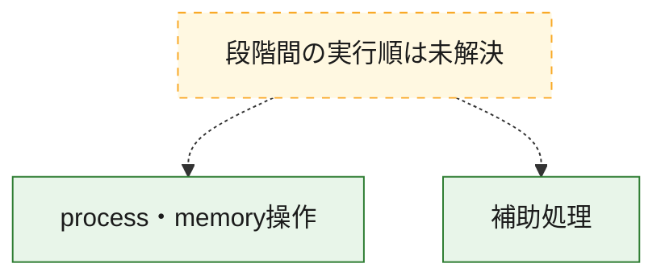
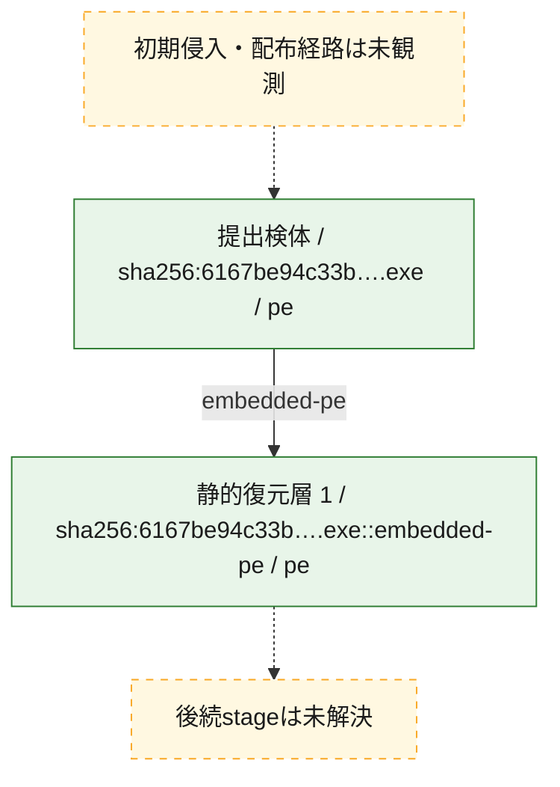
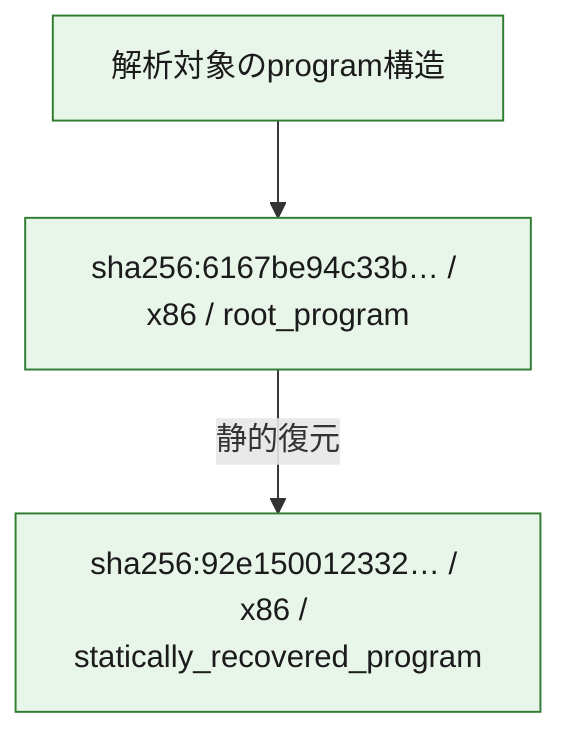

# 全体ロジック：6167be94c33b2a86f9820cbc1b901700cf5d690193213cb14f44687dd4ed4e18

代表関数の静的証跡から、process・memory操作の処理群を確認しました。

## 読み方

- phaseの掲載順は解析上の整理順です。observed_call_edgesがない段階間の実行順を断定しません。
- 図の実線は静的に観測した関係、点線と黄色のノードは未観測・未解決の関係を示します。
- 図は静的な要約であり、動的実行を再現するものではありません。
- 詳細な関数解説とfingerprintは[STATIC-LOGIC.md](STATIC-LOGIC.md)を参照してください。

## 静的可視化

### 実行フロー

### 感染チェーン

### モジュール関係

## 処理段階

### 1. process・memory操作

process、thread、module、memory操作と実行移行を確認します。
確度: `confirmed_static_function_evidence_with_limits`

- `92e15001233203867d5c5a7bcd8b73d299b573c69aca9773e293f25c3e58ec5a:ghidra:1400035c0` — process、thread、module、またはmemory操作に関係する関数です。 状態: `succeeded`、選定理由: `context_representative`, `reviewed_call_centrality:4`, `role:process_or_memory_operation`
- `92e15001233203867d5c5a7bcd8b73d299b573c69aca9773e293f25c3e58ec5a:ghidra:140005d20` — process、thread、module、またはmemory操作に関係する関数です。 状態: `succeeded`、選定理由: `context_representative`, `reviewed_call_centrality:4`, `role:process_or_memory_operation`
- `92e15001233203867d5c5a7bcd8b73d299b573c69aca9773e293f25c3e58ec5a:ghidra:140007a40` — process、thread、module、またはmemory操作に関係する関数です。 状態: `succeeded`、選定理由: `context_representative`, `reviewed_call_centrality:4`, `role:process_or_memory_operation`
- `92e15001233203867d5c5a7bcd8b73d299b573c69aca9773e293f25c3e58ec5a:ghidra:140007a90` — process、thread、module、またはmemory操作に関係する関数です。 状態: `succeeded`、選定理由: `context_representative`, `reviewed_call_centrality:28`, `role:process_or_memory_operation`
- `92e15001233203867d5c5a7bcd8b73d299b573c69aca9773e293f25c3e58ec5a:ghidra:140008890` — process、thread、module、またはmemory操作に関係する関数です。 状態: `succeeded`、選定理由: `context_representative`, `reviewed_call_centrality:4`, `role:process_or_memory_operation`
- `92e15001233203867d5c5a7bcd8b73d299b573c69aca9773e293f25c3e58ec5a:ghidra:1400088e0` — process、thread、module、またはmemory操作に関係する関数です。 状態: `succeeded`、選定理由: `context_representative`, `reviewed_call_centrality:4`, `role:process_or_memory_operation`
- `92e15001233203867d5c5a7bcd8b73d299b573c69aca9773e293f25c3e58ec5a:ghidra:140008930` — process、thread、module、またはmemory操作に関係する関数です。 状態: `succeeded`、選定理由: `context_representative`, `reviewed_call_centrality:4`, `role:process_or_memory_operation`
- `92e15001233203867d5c5a7bcd8b73d299b573c69aca9773e293f25c3e58ec5a:ghidra:140008990` — process、thread、module、またはmemory操作に関係する関数です。 状態: `succeeded`、選定理由: `context_representative`, `reviewed_call_centrality:4`, `role:process_or_memory_operation`
- `92e15001233203867d5c5a7bcd8b73d299b573c69aca9773e293f25c3e58ec5a:ghidra:140008b60` — process、thread、module、またはmemory操作に関係する関数です。 状態: `succeeded`、選定理由: `context_representative`, `reviewed_call_centrality:4`, `role:process_or_memory_operation`
- `6167be94c33b2a86f9820cbc1b901700cf5d690193213cb14f44687dd4ed4e18:ghidra:140001030` — process、thread、module、またはmemory操作に関係する関数です。 状態: `limited_bad_instruction_or_flow`、選定理由: `context_representative`, `reviewed_call_centrality:7`, `role:process_or_memory_operation`
- `6167be94c33b2a86f9820cbc1b901700cf5d690193213cb14f44687dd4ed4e18:ghidra:140001060` — process、thread、module、またはmemory操作に関係する関数です。 状態: `limited_bad_instruction_or_flow`、選定理由: `context_representative`, `reviewed_call_centrality:6`, `role:process_or_memory_operation`
- `6167be94c33b2a86f9820cbc1b901700cf5d690193213cb14f44687dd4ed4e18:ghidra:1400010c0` — process、thread、module、またはmemory操作に関係する関数です。 状態: `limited_bad_instruction_or_flow`、選定理由: `context_representative`, `reviewed_call_centrality:10`, `role:process_or_memory_operation`
- `6167be94c33b2a86f9820cbc1b901700cf5d690193213cb14f44687dd4ed4e18:ghidra:140001160` — process、thread、module、またはmemory操作に関係する関数です。 状態: `succeeded`、選定理由: `context_representative`, `reviewed_call_centrality:5`, `role:process_or_memory_operation`
- `6167be94c33b2a86f9820cbc1b901700cf5d690193213cb14f44687dd4ed4e18:ghidra:1400011b0` — process、thread、module、またはmemory操作に関係する関数です。 状態: `limited_bad_instruction_or_flow`、選定理由: `context_representative`, `reviewed_call_centrality:9`, `role:process_or_memory_operation`
- `6167be94c33b2a86f9820cbc1b901700cf5d690193213cb14f44687dd4ed4e18:ghidra:140001390` — process、thread、module、またはmemory操作に関係する関数です。 状態: `limited_bad_instruction_or_flow`、選定理由: `context_representative`, `reviewed_call_centrality:6`, `role:process_or_memory_operation`
- `6167be94c33b2a86f9820cbc1b901700cf5d690193213cb14f44687dd4ed4e18:ghidra:1400013c0` — process、thread、module、またはmemory操作に関係する関数です。 状態: `limited_bad_instruction_or_flow`、選定理由: `context_representative`, `reviewed_call_centrality:6`, `role:process_or_memory_operation`
- `6167be94c33b2a86f9820cbc1b901700cf5d690193213cb14f44687dd4ed4e18:ghidra:1400014a0` — process、thread、module、またはmemory操作に関係する関数です。 状態: `succeeded`、選定理由: `context_representative`, `reviewed_call_centrality:70`, `role:process_or_memory_operation`
- `6167be94c33b2a86f9820cbc1b901700cf5d690193213cb14f44687dd4ed4e18:ghidra:140003a00` — process、thread、module、またはmemory操作に関係する関数です。 状態: `succeeded`、選定理由: `context_representative`, `reviewed_call_centrality:6`, `role:process_or_memory_operation`
- `6167be94c33b2a86f9820cbc1b901700cf5d690193213cb14f44687dd4ed4e18:ghidra:140003b00` — process、thread、module、またはmemory操作に関係する関数です。 状態: `succeeded`、選定理由: `context_representative`, `reviewed_call_centrality:4`, `role:process_or_memory_operation`
- `6167be94c33b2a86f9820cbc1b901700cf5d690193213cb14f44687dd4ed4e18:ghidra:140003be0` — process、thread、module、またはmemory操作に関係する関数です。 状態: `succeeded`、選定理由: `context_representative`, `reviewed_call_centrality:5`, `role:process_or_memory_operation`
- `6167be94c33b2a86f9820cbc1b901700cf5d690193213cb14f44687dd4ed4e18:ghidra:140004020` — process、thread、module、またはmemory操作に関係する関数です。 状態: `succeeded`、選定理由: `context_representative`, `reviewed_call_centrality:5`, `role:process_or_memory_operation`
- `6167be94c33b2a86f9820cbc1b901700cf5d690193213cb14f44687dd4ed4e18:ghidra:1400041f0` — process、thread、module、またはmemory操作に関係する関数です。 状態: `succeeded`、選定理由: `context_representative`, `reviewed_call_centrality:4`, `role:process_or_memory_operation`
- `6167be94c33b2a86f9820cbc1b901700cf5d690193213cb14f44687dd4ed4e18:ghidra:140004460` — process、thread、module、またはmemory操作に関係する関数です。 状態: `succeeded`、選定理由: `context_representative`, `reviewed_call_centrality:4`, `role:process_or_memory_operation`

### 2. 補助処理

主要処理を支える一般内部関数またはlibrary処理を確認します。
確度: `confirmed_static_function_evidence_with_limits`

- `92e15001233203867d5c5a7bcd8b73d299b573c69aca9773e293f25c3e58ec5a:ghidra:140003010` — 検体内部の一般処理を実装する関数です。 状態: `succeeded`、選定理由: `context_representative`, `reviewed_call_centrality:4`
- `92e15001233203867d5c5a7bcd8b73d299b573c69aca9773e293f25c3e58ec5a:ghidra:1400032a0` — 検体内部の一般処理を実装する関数です。 状態: `succeeded`、選定理由: `context_representative`, `reviewed_call_centrality:14`
- `92e15001233203867d5c5a7bcd8b73d299b573c69aca9773e293f25c3e58ec5a:ghidra:140003580` — 検体内部の一般処理を実装する関数です。 状態: `succeeded`、選定理由: `context_representative`, `reviewed_call_centrality:2`
- `92e15001233203867d5c5a7bcd8b73d299b573c69aca9773e293f25c3e58ec5a:ghidra:140003600` — 検体内部の一般処理を実装する関数です。 状態: `succeeded`、選定理由: `context_representative`, `reviewed_call_centrality:1`
- `92e15001233203867d5c5a7bcd8b73d299b573c69aca9773e293f25c3e58ec5a:ghidra:140003640` — 検体内部の一般処理を実装する関数です。 状態: `succeeded`、選定理由: `context_representative`, `reviewed_call_centrality:2`
- `92e15001233203867d5c5a7bcd8b73d299b573c69aca9773e293f25c3e58ec5a:ghidra:140003660` — 検体内部の一般処理を実装する関数です。 状態: `succeeded`、選定理由: `context_representative`, `reviewed_call_centrality:4`
- `92e15001233203867d5c5a7bcd8b73d299b573c69aca9773e293f25c3e58ec5a:ghidra:1400037b0` — 検体内部の一般処理を実装する関数です。 状態: `succeeded`、選定理由: `context_representative`, `reviewed_call_centrality:3`
- `92e15001233203867d5c5a7bcd8b73d299b573c69aca9773e293f25c3e58ec5a:ghidra:1400038a0` — 検体内部の一般処理を実装する関数です。 状態: `succeeded`、選定理由: `context_representative`, `reviewed_call_centrality:8`
- `92e15001233203867d5c5a7bcd8b73d299b573c69aca9773e293f25c3e58ec5a:ghidra:140003bc0` — 検体内部の一般処理を実装する関数です。 状態: `succeeded`、選定理由: `context_representative`, `reviewed_call_centrality:8`
- `92e15001233203867d5c5a7bcd8b73d299b573c69aca9773e293f25c3e58ec5a:ghidra:140003de0` — 検体内部の一般処理を実装する関数です。 状態: `succeeded`、選定理由: `context_representative`, `reviewed_call_centrality:10`
- `92e15001233203867d5c5a7bcd8b73d299b573c69aca9773e293f25c3e58ec5a:ghidra:140003f50` — 検体内部の一般処理を実装する関数です。 状態: `succeeded`、選定理由: `context_representative`, `reviewed_call_centrality:6`
- `92e15001233203867d5c5a7bcd8b73d299b573c69aca9773e293f25c3e58ec5a:ghidra:1400041e0` — 検体内部の一般処理を実装する関数です。 状態: `succeeded`、選定理由: `context_representative`, `reviewed_call_centrality:2`
- `92e15001233203867d5c5a7bcd8b73d299b573c69aca9773e293f25c3e58ec5a:ghidra:140004440` — 検体内部の一般処理を実装する関数です。 状態: `succeeded`、選定理由: `context_representative`, `reviewed_call_centrality:9`
- `92e15001233203867d5c5a7bcd8b73d299b573c69aca9773e293f25c3e58ec5a:ghidra:140004680` — 検体内部の一般処理を実装する関数です。 状態: `succeeded`、選定理由: `context_representative`, `reviewed_call_centrality:9`
- `92e15001233203867d5c5a7bcd8b73d299b573c69aca9773e293f25c3e58ec5a:ghidra:1400048c0` — 検体内部の一般処理を実装する関数です。 状態: `succeeded`、選定理由: `context_representative`, `reviewed_call_centrality:1`
- `92e15001233203867d5c5a7bcd8b73d299b573c69aca9773e293f25c3e58ec5a:ghidra:1400049a0` — 検体内部の一般処理を実装する関数です。 状態: `succeeded`、選定理由: `context_representative`, `reviewed_call_centrality:3`
- `92e15001233203867d5c5a7bcd8b73d299b573c69aca9773e293f25c3e58ec5a:ghidra:140005d70` — 検体内部の一般処理を実装する関数です。 状態: `succeeded`、選定理由: `context_representative`, `reviewed_call_centrality:3`
- `92e15001233203867d5c5a7bcd8b73d299b573c69aca9773e293f25c3e58ec5a:ghidra:140008850` — 検体内部の一般処理を実装する関数です。 状態: `succeeded`、選定理由: `context_representative`, `reviewed_call_centrality:1`
- `92e15001233203867d5c5a7bcd8b73d299b573c69aca9773e293f25c3e58ec5a:ghidra:1400089f0` — 検体内部の一般処理を実装する関数です。 状態: `succeeded`、選定理由: `context_representative`, `reviewed_call_centrality:1`
- `92e15001233203867d5c5a7bcd8b73d299b573c69aca9773e293f25c3e58ec5a:ghidra:140008a30` — 検体内部の一般処理を実装する関数です。 状態: `succeeded`、選定理由: `context_representative`, `reviewed_call_centrality:1`
- `92e15001233203867d5c5a7bcd8b73d299b573c69aca9773e293f25c3e58ec5a:ghidra:140008a70` — 検体内部の一般処理を実装する関数です。 状態: `succeeded`、選定理由: `context_representative`, `reviewed_call_centrality:1`
- `92e15001233203867d5c5a7bcd8b73d299b573c69aca9773e293f25c3e58ec5a:ghidra:140008ab0` — 検体内部の一般処理を実装する関数です。 状態: `succeeded`、選定理由: `context_representative`, `reviewed_call_centrality:1`
- `92e15001233203867d5c5a7bcd8b73d299b573c69aca9773e293f25c3e58ec5a:ghidra:140008af0` — 検体内部の一般処理を実装する関数です。 状態: `succeeded`、選定理由: `context_representative`, `reviewed_call_centrality:1`
- `6167be94c33b2a86f9820cbc1b901700cf5d690193213cb14f44687dd4ed4e18:ghidra:140001300` — 検体内部の一般処理を実装する関数です。 状態: `succeeded`、選定理由: `context_representative`, `reviewed_call_centrality:3`
- `6167be94c33b2a86f9820cbc1b901700cf5d690193213cb14f44687dd4ed4e18:ghidra:140001430` — 検体内部の一般処理を実装する関数です。 状態: `succeeded`、選定理由: `context_representative`, `reviewed_call_centrality:1`
- `6167be94c33b2a86f9820cbc1b901700cf5d690193213cb14f44687dd4ed4e18:ghidra:1400036f0` — 検体内部の一般処理を実装する関数です。 状態: `succeeded`、選定理由: `context_representative`, `reviewed_call_centrality:1`
- `6167be94c33b2a86f9820cbc1b901700cf5d690193213cb14f44687dd4ed4e18:ghidra:1400037c0` — 検体内部の一般処理を実装する関数です。 状態: `succeeded`、選定理由: `context_representative`, `reviewed_call_centrality:1`
- `6167be94c33b2a86f9820cbc1b901700cf5d690193213cb14f44687dd4ed4e18:ghidra:140003880` — 検体内部の一般処理を実装する関数です。 状態: `succeeded`、選定理由: `context_representative`, `reviewed_call_centrality:1`
- `6167be94c33b2a86f9820cbc1b901700cf5d690193213cb14f44687dd4ed4e18:ghidra:140003940` — 検体内部の一般処理を実装する関数です。 状態: `succeeded`、選定理由: `context_representative`, `reviewed_call_centrality:1`
- `6167be94c33b2a86f9820cbc1b901700cf5d690193213cb14f44687dd4ed4e18:ghidra:140003ce0` — 検体内部の一般処理を実装する関数です。 状態: `succeeded`、選定理由: `context_representative`, `reviewed_call_centrality:1`
- `6167be94c33b2a86f9820cbc1b901700cf5d690193213cb14f44687dd4ed4e18:ghidra:140003db0` — 検体内部の一般処理を実装する関数です。 状態: `succeeded`、選定理由: `context_representative`, `reviewed_call_centrality:1`
- `6167be94c33b2a86f9820cbc1b901700cf5d690193213cb14f44687dd4ed4e18:ghidra:140003e90` — 検体内部の一般処理を実装する関数です。 状態: `succeeded`、選定理由: `context_representative`, `reviewed_call_centrality:1`
- `6167be94c33b2a86f9820cbc1b901700cf5d690193213cb14f44687dd4ed4e18:ghidra:140003f50` — 検体内部の一般処理を実装する関数です。 状態: `succeeded`、選定理由: `context_representative`, `reviewed_call_centrality:1`
- `6167be94c33b2a86f9820cbc1b901700cf5d690193213cb14f44687dd4ed4e18:ghidra:140004120` — 検体内部の一般処理を実装する関数です。 状態: `succeeded`、選定理由: `context_representative`, `reviewed_call_centrality:1`
- `6167be94c33b2a86f9820cbc1b901700cf5d690193213cb14f44687dd4ed4e18:ghidra:1400042d0` — 検体内部の一般処理を実装する関数です。 状態: `succeeded`、選定理由: `context_representative`, `reviewed_call_centrality:1`
- `6167be94c33b2a86f9820cbc1b901700cf5d690193213cb14f44687dd4ed4e18:ghidra:140004390` — 検体内部の一般処理を実装する関数です。 状態: `succeeded`、選定理由: `context_representative`, `reviewed_call_centrality:1`
- `6167be94c33b2a86f9820cbc1b901700cf5d690193213cb14f44687dd4ed4e18:ghidra:140004540` — 検体内部の一般処理を実装する関数です。 状態: `succeeded`、選定理由: `context_representative`, `reviewed_call_centrality:1`
- `6167be94c33b2a86f9820cbc1b901700cf5d690193213cb14f44687dd4ed4e18:ghidra:140004610` — 検体内部の一般処理を実装する関数です。 状態: `succeeded`、選定理由: `context_representative`, `reviewed_call_centrality:1`
- `6167be94c33b2a86f9820cbc1b901700cf5d690193213cb14f44687dd4ed4e18:ghidra:1400046e0` — 検体内部の一般処理を実装する関数です。 状態: `succeeded`、選定理由: `context_representative`, `reviewed_call_centrality:1`
- `6167be94c33b2a86f9820cbc1b901700cf5d690193213cb14f44687dd4ed4e18:ghidra:1400047b0` — 検体内部の一般処理を実装する関数です。 状態: `succeeded`、選定理由: `context_representative`, `reviewed_call_centrality:1`
- `6167be94c33b2a86f9820cbc1b901700cf5d690193213cb14f44687dd4ed4e18:ghidra:1400173c0` — compiler生成処理または汎用library処理とみられる関数です。 状態: `limited_bad_instruction_or_flow`、選定理由: `entry_point`, `meaningful_symbol_name`, `reviewed_call_centrality:8`

## 観測したcall関係

- 代表関数間で直接解決できた呼出関係はありません。

## 解析範囲と制約

- 選定外関数は全体inventoryへ残しますが、関数本体の個別解説対象にはしていません。
- indirect call、難読化、packer、VM、壊れたcontrol flowによりcall関係が欠落する場合があります。
- 文書は静的解析に基づき、検体実行や外部通信による動的確認は行っていません。
