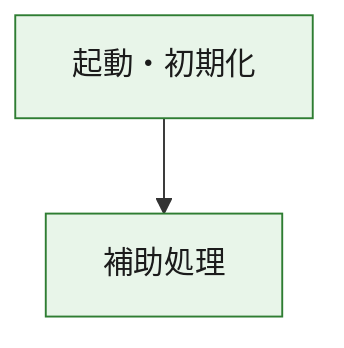
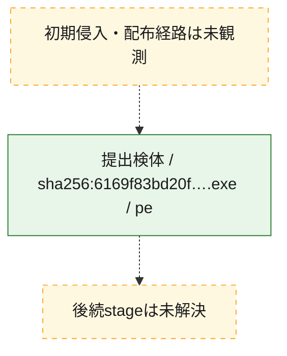
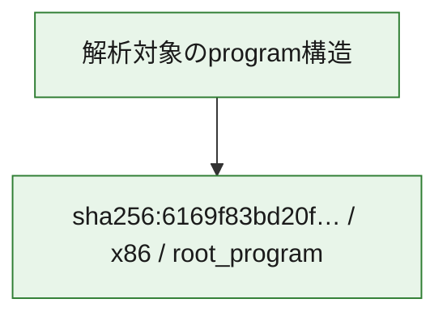

# 全体ロジック：6169f83bd20f008466e51f9696e5b62b6317480eb243719d258612a281e549b7

代表関数の静的証跡から、起動・初期化の処理群を確認しました。

## 読み方

- phaseの掲載順は解析上の整理順です。observed_call_edgesがない段階間の実行順を断定しません。
- 図の実線は静的に観測した関係、点線と黄色のノードは未観測・未解決の関係を示します。
- 図は静的な要約であり、動的実行を再現するものではありません。
- 詳細な関数解説とfingerprintは[STATIC-LOGIC.md](STATIC-LOGIC.md)を参照してください。

## 静的可視化

### 実行フロー

### 感染チェーン

### モジュール関係

## 処理段階

### 1. 起動・初期化

entry pointから初期化と後続処理への移行を確認します。
確度: `confirmed_static_function_evidence`

- `6169f83bd20f008466e51f9696e5b62b6317480eb243719d258612a281e549b7:ghidra:180001010` — 初期化と主要処理への分岐を行う入口関数です。 状態: `succeeded`、選定理由: `entry_point`, `meaningful_symbol_name`, `reviewed_call_centrality:22`, `role:entrypoint`, `small_program_complete_context`

### 2. 補助処理

主要処理を支える一般内部関数またはlibrary処理を確認します。
確度: `confirmed_static_function_evidence`

- `6169f83bd20f008466e51f9696e5b62b6317480eb243719d258612a281e549b7:ghidra:180001240` — 検体内部の一般処理を実装する関数です。 状態: `succeeded`、選定理由: `context_representative`, `reviewed_call_centrality:2`, `small_program_complete_context`
- `6169f83bd20f008466e51f9696e5b62b6317480eb243719d258612a281e549b7:ghidra:180001350` — 検体内部の一般処理を実装する関数です。 状態: `succeeded`、選定理由: `context_representative`, `reviewed_call_centrality:25`, `small_program_complete_context`
- `6169f83bd20f008466e51f9696e5b62b6317480eb243719d258612a281e549b7:ghidra:180003780` — 検体内部の一般処理を実装する関数です。 状態: `succeeded`、選定理由: `context_representative`, `reviewed_call_centrality:2`, `small_program_complete_context`
- `6169f83bd20f008466e51f9696e5b62b6317480eb243719d258612a281e549b7:ghidra:1800038e0` — 検体内部の一般処理を実装する関数です。 状態: `succeeded`、選定理由: `context_representative`, `reviewed_call_centrality:2`, `small_program_complete_context`

## 観測したcall関係

- `6169f83bd20f008466e51f9696e5b62b6317480eb243719d258612a281e549b7:ghidra:180001010` → `6169f83bd20f008466e51f9696e5b62b6317480eb243719d258612a281e549b7:ghidra:180001240` （`startup` → `support`）
- `6169f83bd20f008466e51f9696e5b62b6317480eb243719d258612a281e549b7:ghidra:180001010` → `6169f83bd20f008466e51f9696e5b62b6317480eb243719d258612a281e549b7:ghidra:180001350` （`startup` → `support`）
- `6169f83bd20f008466e51f9696e5b62b6317480eb243719d258612a281e549b7:ghidra:180001350` → `6169f83bd20f008466e51f9696e5b62b6317480eb243719d258612a281e549b7:ghidra:180001240` （`support` → `support`）
- `6169f83bd20f008466e51f9696e5b62b6317480eb243719d258612a281e549b7:ghidra:180001350` → `6169f83bd20f008466e51f9696e5b62b6317480eb243719d258612a281e549b7:ghidra:180003780` （`support` → `support`）
- `6169f83bd20f008466e51f9696e5b62b6317480eb243719d258612a281e549b7:ghidra:180001350` → `6169f83bd20f008466e51f9696e5b62b6317480eb243719d258612a281e549b7:ghidra:1800038e0` （`support` → `support`）
- `6169f83bd20f008466e51f9696e5b62b6317480eb243719d258612a281e549b7:ghidra:180003780` → `6169f83bd20f008466e51f9696e5b62b6317480eb243719d258612a281e549b7:ghidra:1800038e0` （`support` → `support`）
- `ghidra-function:593ef062679f8525a84aa539` → `ghidra-function:b0c7a950da9cbf3a37a64d96` （`unclassified` → `unclassified`）
- `ghidra-function:5ab38ab78ce0d254ec8936ed` → `ghidra-function:14f4dd718ca976edbba420a2` （`unclassified` → `unclassified`）
- `ghidra-function:5ab38ab78ce0d254ec8936ed` → `ghidra-function:45cbc401a3e10c3ebc953a17` （`unclassified` → `unclassified`）
- `ghidra-function:5ab38ab78ce0d254ec8936ed` → `ghidra-function:5f909ba2706fa6a3099c776f` （`unclassified` → `unclassified`）
- `ghidra-function:5ab38ab78ce0d254ec8936ed` → `ghidra-function:67af8806a32a6aa7b71ceb40` （`unclassified` → `unclassified`）
- `ghidra-function:5ab38ab78ce0d254ec8936ed` → `ghidra-function:72c4f87aa9330aeb119a6fe7` （`unclassified` → `unclassified`）
- `ghidra-function:5ab38ab78ce0d254ec8936ed` → `ghidra-function:9e5fd5c8587c5d3e6c8905b5` （`unclassified` → `unclassified`）
- `ghidra-function:5ab38ab78ce0d254ec8936ed` → `ghidra-function:b35e6370796a0b325940aaa8` （`unclassified` → `unclassified`）
- `ghidra-function:5ab38ab78ce0d254ec8936ed` → `ghidra-function:b7e600dc66e0507223cb6492` （`unclassified` → `unclassified`）
- `ghidra-function:5ab38ab78ce0d254ec8936ed` → `ghidra-function:bae47b42e438a4a7788bfeba` （`unclassified` → `unclassified`）
- `ghidra-function:5ab38ab78ce0d254ec8936ed` → `ghidra-function:e211a25fb57847278e6cc6d0` （`unclassified` → `unclassified`）
- `ghidra-function:5ab38ab78ce0d254ec8936ed` → `ghidra-function:eb82df2efa45c3097f82dead` （`unclassified` → `unclassified`）
- `ghidra-function:5ab38ab78ce0d254ec8936ed` → `ghidra-function:f2293179977c83f5706f198b` （`unclassified` → `unclassified`）
- `ghidra-function:67af8806a32a6aa7b71ceb40` → `ghidra-external:1bf60899fc5d0e60e43ed4f8` （`unclassified` → `unclassified`）
- `ghidra-function:67af8806a32a6aa7b71ceb40` → `ghidra-external:26104ce06ac04a32eb579875` （`unclassified` → `unclassified`）
- `ghidra-function:67af8806a32a6aa7b71ceb40` → `ghidra-external:32f9528987674cde66e1d098` （`unclassified` → `unclassified`）
- `ghidra-function:67af8806a32a6aa7b71ceb40` → `ghidra-external:334327676fee31f65945a77d` （`unclassified` → `unclassified`）
- `ghidra-function:67af8806a32a6aa7b71ceb40` → `ghidra-external:3b3c09e1ad8b953994a79e88` （`unclassified` → `unclassified`）
- `ghidra-function:67af8806a32a6aa7b71ceb40` → `ghidra-external:4fb6b3fc402206c878b0e37c` （`unclassified` → `unclassified`）
- `ghidra-function:67af8806a32a6aa7b71ceb40` → `ghidra-external:549e2ddebea46b977d678c59` （`unclassified` → `unclassified`）
- `ghidra-function:67af8806a32a6aa7b71ceb40` → `ghidra-external:5c2c8ccdf629892787d45a01` （`unclassified` → `unclassified`）
- `ghidra-function:67af8806a32a6aa7b71ceb40` → `ghidra-external:628c711ee5b6a4314b0bc31f` （`unclassified` → `unclassified`）
- `ghidra-function:67af8806a32a6aa7b71ceb40` → `ghidra-external:632db2b9ab42500faa286ba2` （`unclassified` → `unclassified`）
- `ghidra-function:67af8806a32a6aa7b71ceb40` → `ghidra-external:8a2770cd83995a3b1dcb2b0b` （`unclassified` → `unclassified`）
- `ghidra-function:67af8806a32a6aa7b71ceb40` → `ghidra-external:8ba283371e5a4391acf45f9e` （`unclassified` → `unclassified`）
- `ghidra-function:67af8806a32a6aa7b71ceb40` → `ghidra-external:8bde95ffcb0eead769b2664f` （`unclassified` → `unclassified`）
- `ghidra-function:67af8806a32a6aa7b71ceb40` → `ghidra-external:92b6bf2b17acf4b0e957e320` （`unclassified` → `unclassified`）
- `ghidra-function:67af8806a32a6aa7b71ceb40` → `ghidra-external:93c7f66091eb1ee5710872e3` （`unclassified` → `unclassified`）
- `ghidra-function:67af8806a32a6aa7b71ceb40` → `ghidra-external:af5fcf62615a0300f112193e` （`unclassified` → `unclassified`）
- `ghidra-function:67af8806a32a6aa7b71ceb40` → `ghidra-external:e9a36147b2fd1c9ab6c4f6bf` （`unclassified` → `unclassified`）
- `ghidra-function:67af8806a32a6aa7b71ceb40` → `ghidra-external:ed7acd20664d6b97d36365f4` （`unclassified` → `unclassified`）
- `ghidra-function:67af8806a32a6aa7b71ceb40` → `ghidra-external:fa75c8da6f32d4166fd17278` （`unclassified` → `unclassified`）
- `ghidra-function:67af8806a32a6aa7b71ceb40` → `ghidra-external:fa9dc8c578048d3280425e13` （`unclassified` → `unclassified`）
- `ghidra-function:67af8806a32a6aa7b71ceb40` → `ghidra-external:fe381d938618dcd4da5384cf` （`unclassified` → `unclassified`）
- `ghidra-function:67af8806a32a6aa7b71ceb40` → `ghidra-function:593ef062679f8525a84aa539` （`unclassified` → `unclassified`）
- `ghidra-function:67af8806a32a6aa7b71ceb40` → `ghidra-function:b0c7a950da9cbf3a37a64d96` （`unclassified` → `unclassified`）
- `ghidra-function:67af8806a32a6aa7b71ceb40` → `ghidra-function:eb82df2efa45c3097f82dead` （`unclassified` → `unclassified`）

## 解析範囲と制約

- 選定外関数は全体inventoryへ残しますが、関数本体の個別解説対象にはしていません。
- indirect call、難読化、packer、VM、壊れたcontrol flowによりcall関係が欠落する場合があります。
- 文書は静的解析に基づき、検体実行や外部通信による動的確認は行っていません。
