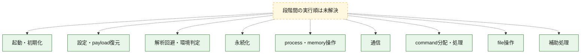
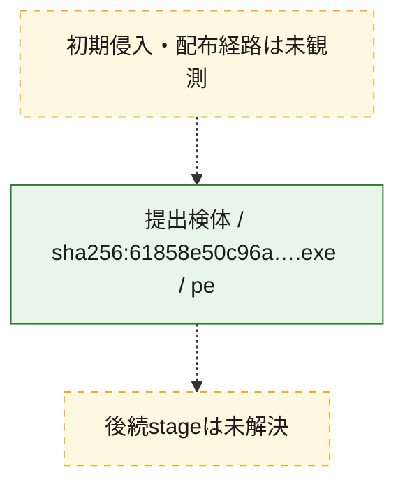
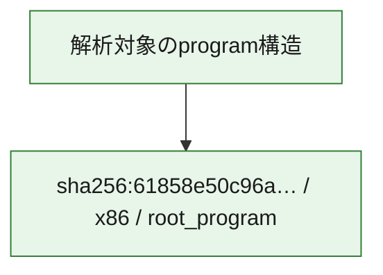

# 全体ロジック：61858e50c96a6f37957e1d6e3249ddb49ebd5c592ddce8dacf039404897afe45

代表関数の静的証跡から、起動・初期化、設定・payload復元、解析回避・環境判定、永続化、process・memory操作、通信、command分配・処理、file操作の処理群を確認しました。

## 読み方

- phaseの掲載順は解析上の整理順です。observed_call_edgesがない段階間の実行順を断定しません。
- 図の実線は静的に観測した関係、点線と黄色のノードは未観測・未解決の関係を示します。
- 図は静的な要約であり、動的実行を再現するものではありません。
- 詳細な関数解説とfingerprintは[STATIC-LOGIC.md](STATIC-LOGIC.md)を参照してください。

## 静的可視化

### 実行フロー

### 感染チェーン

### モジュール関係

## 処理段階

### 1. 起動・初期化

entry pointから初期化と後続処理への移行を確認します。
確度: `confirmed_static_function_evidence_with_limits`

- `61858e50c96a6f37957e1d6e3249ddb49ebd5c592ddce8dacf039404897afe45:ghidra:1400014b0` — 初期化と主要処理への分岐を行う入口関数です。 状態: `succeeded`、選定理由: `entry_point`, `meaningful_symbol_name`, `reviewed_call_centrality:56`, `role:entrypoint`
- `61858e50c96a6f37957e1d6e3249ddb49ebd5c592ddce8dacf039404897afe45:ghidra:140008190` — 初期化と主要処理への分岐を行う入口関数です。 状態: `limited_bad_instruction_or_flow`、選定理由: `entry_point`, `meaningful_symbol_name`, `reviewed_call_centrality:30`, `role:entrypoint`
- `61858e50c96a6f37957e1d6e3249ddb49ebd5c592ddce8dacf039404897afe45:ghidra:14000a000` — 初期化と主要処理への分岐を行う入口関数です。 状態: `succeeded`、選定理由: `entry_point`, `meaningful_symbol_name`, `reviewed_call_centrality:61`, `role:entrypoint`

### 2. 設定・payload復元

設定、resource、payload、暗号化データの復元・変換を確認します。
確度: `confirmed_static_function_evidence`

- `61858e50c96a6f37957e1d6e3249ddb49ebd5c592ddce8dacf039404897afe45:ghidra:140002b80` — 暗号、hash、encoding、または復号処理に関係する関数です。 状態: `succeeded`、選定理由: `meaningful_symbol_name`, `reviewed_call_centrality:13`, `role:cryptographic_transform`
- `61858e50c96a6f37957e1d6e3249ddb49ebd5c592ddce8dacf039404897afe45:ghidra:140002cf0` — 暗号、hash、encoding、または復号処理に関係する関数です。 状態: `succeeded`、選定理由: `meaningful_symbol_name`, `reviewed_call_centrality:15`, `role:cryptographic_transform`
- `61858e50c96a6f37957e1d6e3249ddb49ebd5c592ddce8dacf039404897afe45:ghidra:140002e60` — 暗号、hash、encoding、または復号処理に関係する関数です。 状態: `succeeded`、選定理由: `meaningful_symbol_name`, `reviewed_call_centrality:14`, `role:cryptographic_transform`
- `61858e50c96a6f37957e1d6e3249ddb49ebd5c592ddce8dacf039404897afe45:ghidra:1400030b0` — 設定、resource、payloadなどの解析・変換を行う関数です。 状態: `succeeded`、選定理由: `meaningful_symbol_name`, `reviewed_call_centrality:14`, `role:config_or_data_transform`
- `61858e50c96a6f37957e1d6e3249ddb49ebd5c592ddce8dacf039404897afe45:ghidra:1400032a0` — 暗号、hash、encoding、または復号処理に関係する関数です。 状態: `succeeded`、選定理由: `meaningful_symbol_name`, `reviewed_call_centrality:9`, `role:cryptographic_transform`
- `61858e50c96a6f37957e1d6e3249ddb49ebd5c592ddce8dacf039404897afe45:ghidra:1400034f0` — 設定、resource、payloadなどの解析・変換を行う関数です。 状態: `succeeded`、選定理由: `meaningful_symbol_name`, `reviewed_call_centrality:12`, `role:config_or_data_transform`
- `61858e50c96a6f37957e1d6e3249ddb49ebd5c592ddce8dacf039404897afe45:ghidra:140003990` — 設定、resource、payloadなどの解析・変換を行う関数です。 状態: `succeeded`、選定理由: `meaningful_symbol_name`, `reviewed_call_centrality:4`, `role:config_or_data_transform`

### 3. 解析回避・環境判定

debugger、sandbox、仮想環境、時間差などの判定を確認します。
確度: `confirmed_static_function_evidence`

- `61858e50c96a6f37957e1d6e3249ddb49ebd5c592ddce8dacf039404897afe45:ghidra:140001010` — debugger、仮想環境、sandbox、または時間差の確認に関係する関数です。 状態: `succeeded`、選定理由: `meaningful_symbol_name`, `reviewed_call_centrality:6`, `role:anti_analysis`

### 4. 永続化

自動起動や永続化に関係する設定変更を確認します。
確度: `confirmed_static_function_evidence`

- `61858e50c96a6f37957e1d6e3249ddb49ebd5c592ddce8dacf039404897afe45:ghidra:1400013d0` — 自動起動または永続化に関係する処理を含む関数です。 状態: `succeeded`、選定理由: `entry_point`, `meaningful_symbol_name`, `reviewed_call_centrality:1`, `role:persistence`
- `61858e50c96a6f37957e1d6e3249ddb49ebd5c592ddce8dacf039404897afe45:ghidra:1400013f0` — 自動起動または永続化に関係する処理を含む関数です。 状態: `succeeded`、選定理由: `meaningful_symbol_name`, `reviewed_call_centrality:1`, `role:persistence`
- `61858e50c96a6f37957e1d6e3249ddb49ebd5c592ddce8dacf039404897afe45:ghidra:140007b90` — 自動起動または永続化に関係する処理を含む関数です。 状態: `succeeded`、選定理由: `meaningful_symbol_name`, `reviewed_call_centrality:34`, `role:persistence`

### 5. process・memory操作

process、thread、module、memory操作と実行移行を確認します。
確度: `confirmed_static_function_evidence`

- `61858e50c96a6f37957e1d6e3249ddb49ebd5c592ddce8dacf039404897afe45:ghidra:140002890` — process、thread、module、またはmemory操作に関係する関数です。 状態: `succeeded`、選定理由: `meaningful_symbol_name`, `reviewed_call_centrality:19`, `role:process_or_memory_operation`
- `61858e50c96a6f37957e1d6e3249ddb49ebd5c592ddce8dacf039404897afe45:ghidra:1400055e0` — process、thread、module、またはmemory操作に関係する関数です。 状態: `succeeded`、選定理由: `meaningful_symbol_name`, `reviewed_call_centrality:24`, `role:process_or_memory_operation`

### 6. 通信

通信初期化、endpoint処理、送受信の役割を確認します。
確度: `confirmed_static_function_evidence_with_limits`

- `61858e50c96a6f37957e1d6e3249ddb49ebd5c592ddce8dacf039404897afe45:ghidra:140002b20` — 通信初期化、送受信、またはendpoint処理に関係する関数です。 状態: `limited_bad_instruction_or_flow`、選定理由: `meaningful_symbol_name`, `reviewed_call_centrality:6`, `role:network_communication`
- `61858e50c96a6f37957e1d6e3249ddb49ebd5c592ddce8dacf039404897afe45:ghidra:140003b50` — 通信初期化、送受信、またはendpoint処理に関係する関数です。 状態: `succeeded`、選定理由: `meaningful_symbol_name`, `reviewed_call_centrality:31`, `role:network_communication`
- `61858e50c96a6f37957e1d6e3249ddb49ebd5c592ddce8dacf039404897afe45:ghidra:140003e10` — 通信初期化、送受信、またはendpoint処理に関係する関数です。 状態: `succeeded`、選定理由: `meaningful_symbol_name`, `reviewed_call_centrality:6`, `role:network_communication`
- `61858e50c96a6f37957e1d6e3249ddb49ebd5c592ddce8dacf039404897afe45:ghidra:140003e50` — 通信初期化、送受信、またはendpoint処理に関係する関数です。 状態: `succeeded`、選定理由: `meaningful_symbol_name`, `reviewed_call_centrality:7`, `role:network_communication`
- `61858e50c96a6f37957e1d6e3249ddb49ebd5c592ddce8dacf039404897afe45:ghidra:140003f30` — 通信初期化、送受信、またはendpoint処理に関係する関数です。 状態: `succeeded`、選定理由: `meaningful_symbol_name`, `reviewed_call_centrality:7`, `role:network_communication`
- `61858e50c96a6f37957e1d6e3249ddb49ebd5c592ddce8dacf039404897afe45:ghidra:140005fa0` — 通信初期化、送受信、またはendpoint処理に関係する関数です。 状態: `succeeded`、選定理由: `meaningful_symbol_name`, `reviewed_call_centrality:22`, `role:network_communication`

### 7. command分配・処理

受信commandやtaskの解釈、分配、個別handlerへの移行を確認します。
確度: `confirmed_static_function_evidence_with_limits`

- `61858e50c96a6f37957e1d6e3249ddb49ebd5c592ddce8dacf039404897afe45:ghidra:140005c30` — commandの解釈、分配、または個別処理を担当する関数です。 状態: `succeeded`、選定理由: `meaningful_symbol_name`, `reviewed_call_centrality:20`, `role:command_dispatch_or_handler`
- `61858e50c96a6f37957e1d6e3249ddb49ebd5c592ddce8dacf039404897afe45:ghidra:140005f50` — commandの解釈、分配、または個別処理を担当する関数です。 状態: `succeeded`、選定理由: `meaningful_symbol_name`, `reviewed_call_centrality:4`, `role:command_dispatch_or_handler`
- `61858e50c96a6f37957e1d6e3249ddb49ebd5c592ddce8dacf039404897afe45:ghidra:140006930` — commandの解釈、分配、または個別処理を担当する関数です。 状態: `succeeded`、選定理由: `meaningful_symbol_name`, `reviewed_call_centrality:3`, `role:command_dispatch_or_handler`
- `61858e50c96a6f37957e1d6e3249ddb49ebd5c592ddce8dacf039404897afe45:ghidra:1400075f0` — commandの解釈、分配、または個別処理を担当する関数です。 状態: `succeeded`、選定理由: `meaningful_symbol_name`, `reviewed_call_centrality:5`, `role:command_dispatch_or_handler`
- `61858e50c96a6f37957e1d6e3249ddb49ebd5c592ddce8dacf039404897afe45:ghidra:140009030` — commandの解釈、分配、または個別処理を担当する関数です。 状態: `limited_bad_instruction_or_flow`、選定理由: `meaningful_symbol_name`, `reviewed_call_centrality:2`, `role:command_dispatch_or_handler`

### 8. file操作

fileやdirectoryの作成、読書き、削除を確認します。
確度: `confirmed_static_function_evidence_with_limits`

- `61858e50c96a6f37957e1d6e3249ddb49ebd5c592ddce8dacf039404897afe45:ghidra:1400026c0` — fileまたはdirectoryの読書き・管理に関係する関数です。 状態: `limited_bad_instruction_or_flow`、選定理由: `meaningful_symbol_name`, `reviewed_call_centrality:10`, `role:file_operation`
- `61858e50c96a6f37957e1d6e3249ddb49ebd5c592ddce8dacf039404897afe45:ghidra:140006370` — fileまたはdirectoryの読書き・管理に関係する関数です。 状態: `succeeded`、選定理由: `meaningful_symbol_name`, `reviewed_call_centrality:21`, `role:file_operation`

### 9. 補助処理

主要処理を支える一般内部関数またはlibrary処理を確認します。
確度: `confirmed_static_function_evidence`

- `61858e50c96a6f37957e1d6e3249ddb49ebd5c592ddce8dacf039404897afe45:ghidra:140001130` — 検体内部の一般処理を実装する関数です。 状態: `succeeded`、選定理由: `meaningful_symbol_name`, `reviewed_call_centrality:1`
- `61858e50c96a6f37957e1d6e3249ddb49ebd5c592ddce8dacf039404897afe45:ghidra:1400088b0` — compiler生成処理または汎用library処理とみられる関数です。 状態: `succeeded`、選定理由: `entry_point`, `meaningful_symbol_name`, `reviewed_call_centrality:1`
- `61858e50c96a6f37957e1d6e3249ddb49ebd5c592ddce8dacf039404897afe45:ghidra:1400088e0` — compiler生成処理または汎用library処理とみられる関数です。 状態: `succeeded`、選定理由: `entry_point`, `meaningful_symbol_name`, `reviewed_call_centrality:2`

## 観測したcall関係

- 代表関数間で直接解決できた呼出関係はありません。

## 解析範囲と制約

- 選定外関数は全体inventoryへ残しますが、関数本体の個別解説対象にはしていません。
- indirect call、難読化、packer、VM、壊れたcontrol flowによりcall関係が欠落する場合があります。
- 文書は静的解析に基づき、検体実行や外部通信による動的確認は行っていません。
