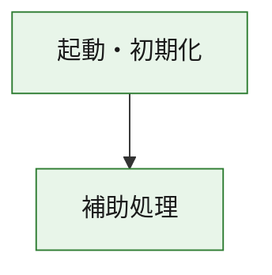
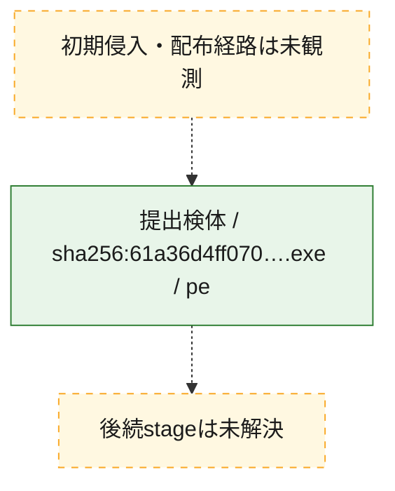
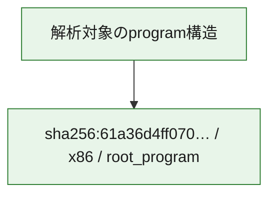

# 全体ロジック：61a36d4ff07091d061ed569eef0fad3e4ca16b6fbde7d687a73ece2beb6389b4

代表関数の静的証跡から、起動・初期化の処理群を確認しました。

## 読み方

- phaseの掲載順は解析上の整理順です。observed_call_edgesがない段階間の実行順を断定しません。
- 図の実線は静的に観測した関係、点線と黄色のノードは未観測・未解決の関係を示します。
- 図は静的な要約であり、動的実行を再現するものではありません。
- 詳細な関数解説とfingerprintは[STATIC-LOGIC.md](STATIC-LOGIC.md)を参照してください。

## 静的可視化

### 実行フロー

### 感染チェーン

### モジュール関係

## 処理段階

### 1. 起動・初期化

entry pointから初期化と後続処理への移行を確認します。
確度: `confirmed_static_function_evidence`

- `61a36d4ff07091d061ed569eef0fad3e4ca16b6fbde7d687a73ece2beb6389b4:ghidra:180001010` — 初期化と主要処理への分岐を行う入口関数です。 状態: `succeeded`、選定理由: `entry_point`, `meaningful_symbol_name`, `reviewed_call_centrality:22`, `role:entrypoint`, `small_program_complete_context`

### 2. 補助処理

主要処理を支える一般内部関数またはlibrary処理を確認します。
確度: `confirmed_static_function_evidence`

- `61a36d4ff07091d061ed569eef0fad3e4ca16b6fbde7d687a73ece2beb6389b4:ghidra:180001240` — 検体内部の一般処理を実装する関数です。 状態: `succeeded`、選定理由: `context_representative`, `reviewed_call_centrality:2`, `small_program_complete_context`
- `61a36d4ff07091d061ed569eef0fad3e4ca16b6fbde7d687a73ece2beb6389b4:ghidra:180001350` — 検体内部の一般処理を実装する関数です。 状態: `succeeded`、選定理由: `context_representative`, `reviewed_call_centrality:25`, `small_program_complete_context`
- `61a36d4ff07091d061ed569eef0fad3e4ca16b6fbde7d687a73ece2beb6389b4:ghidra:180003780` — 検体内部の一般処理を実装する関数です。 状態: `succeeded`、選定理由: `context_representative`, `reviewed_call_centrality:2`, `small_program_complete_context`
- `61a36d4ff07091d061ed569eef0fad3e4ca16b6fbde7d687a73ece2beb6389b4:ghidra:1800038e0` — 検体内部の一般処理を実装する関数です。 状態: `succeeded`、選定理由: `context_representative`, `reviewed_call_centrality:2`, `small_program_complete_context`

## 観測したcall関係

- `61a36d4ff07091d061ed569eef0fad3e4ca16b6fbde7d687a73ece2beb6389b4:ghidra:180001010` → `61a36d4ff07091d061ed569eef0fad3e4ca16b6fbde7d687a73ece2beb6389b4:ghidra:180001240` （`startup` → `support`）
- `61a36d4ff07091d061ed569eef0fad3e4ca16b6fbde7d687a73ece2beb6389b4:ghidra:180001010` → `61a36d4ff07091d061ed569eef0fad3e4ca16b6fbde7d687a73ece2beb6389b4:ghidra:180001350` （`startup` → `support`）
- `61a36d4ff07091d061ed569eef0fad3e4ca16b6fbde7d687a73ece2beb6389b4:ghidra:180001350` → `61a36d4ff07091d061ed569eef0fad3e4ca16b6fbde7d687a73ece2beb6389b4:ghidra:180001240` （`support` → `support`）
- `61a36d4ff07091d061ed569eef0fad3e4ca16b6fbde7d687a73ece2beb6389b4:ghidra:180001350` → `61a36d4ff07091d061ed569eef0fad3e4ca16b6fbde7d687a73ece2beb6389b4:ghidra:180003780` （`support` → `support`）
- `61a36d4ff07091d061ed569eef0fad3e4ca16b6fbde7d687a73ece2beb6389b4:ghidra:180001350` → `61a36d4ff07091d061ed569eef0fad3e4ca16b6fbde7d687a73ece2beb6389b4:ghidra:1800038e0` （`support` → `support`）
- `61a36d4ff07091d061ed569eef0fad3e4ca16b6fbde7d687a73ece2beb6389b4:ghidra:180003780` → `61a36d4ff07091d061ed569eef0fad3e4ca16b6fbde7d687a73ece2beb6389b4:ghidra:1800038e0` （`support` → `support`）
- `ghidra-function:43b45000981ec04bf15382a3` → `ghidra-function:bb78af6c74d4060604826657` （`unclassified` → `unclassified`）
- `ghidra-function:86e7b9a360f2cbfb4ad165be` → `ghidra-function:075ced6d39a389692f6b3197` （`unclassified` → `unclassified`）
- `ghidra-function:86e7b9a360f2cbfb4ad165be` → `ghidra-function:0cbb55c3bcc53dbf7a53f932` （`unclassified` → `unclassified`）
- `ghidra-function:86e7b9a360f2cbfb4ad165be` → `ghidra-function:3c01d6267ae02644fc207356` （`unclassified` → `unclassified`）
- `ghidra-function:86e7b9a360f2cbfb4ad165be` → `ghidra-function:3d04e7b3909f346b3fe7e347` （`unclassified` → `unclassified`）
- `ghidra-function:86e7b9a360f2cbfb4ad165be` → `ghidra-function:4ed73c0f095cc6926b4f537d` （`unclassified` → `unclassified`）
- `ghidra-function:86e7b9a360f2cbfb4ad165be` → `ghidra-function:79aaeabbb51197ee651e7fc0` （`unclassified` → `unclassified`）
- `ghidra-function:86e7b9a360f2cbfb4ad165be` → `ghidra-function:91dea5f9acce4a24dd24fecd` （`unclassified` → `unclassified`）
- `ghidra-function:86e7b9a360f2cbfb4ad165be` → `ghidra-function:a29f01e63ea4ac937b7eb93e` （`unclassified` → `unclassified`）
- `ghidra-function:86e7b9a360f2cbfb4ad165be` → `ghidra-function:b0738666336b61712dfb3f03` （`unclassified` → `unclassified`）
- `ghidra-function:86e7b9a360f2cbfb4ad165be` → `ghidra-function:cdc06057d27f9d8eab2de7b2` （`unclassified` → `unclassified`）
- `ghidra-function:86e7b9a360f2cbfb4ad165be` → `ghidra-function:f443f15ac3f79c5cebae5f75` （`unclassified` → `unclassified`）
- `ghidra-function:86e7b9a360f2cbfb4ad165be` → `ghidra-function:f4e849b7a60ecb59eb81f71e` （`unclassified` → `unclassified`）
- `ghidra-function:cdc06057d27f9d8eab2de7b2` → `ghidra-external:0df6e73bf1c058a0eb2e9363` （`unclassified` → `unclassified`）
- `ghidra-function:cdc06057d27f9d8eab2de7b2` → `ghidra-external:30219ff71d5246bfbcbc1507` （`unclassified` → `unclassified`）
- `ghidra-function:cdc06057d27f9d8eab2de7b2` → `ghidra-external:32c782db0da7db637858cf49` （`unclassified` → `unclassified`）
- `ghidra-function:cdc06057d27f9d8eab2de7b2` → `ghidra-external:3b993c18e1558fd0e08156e0` （`unclassified` → `unclassified`）
- `ghidra-function:cdc06057d27f9d8eab2de7b2` → `ghidra-external:3e00a1d1bf34d69e81810525` （`unclassified` → `unclassified`）
- `ghidra-function:cdc06057d27f9d8eab2de7b2` → `ghidra-external:4a43ce2eb703886cf4324b50` （`unclassified` → `unclassified`）
- `ghidra-function:cdc06057d27f9d8eab2de7b2` → `ghidra-external:4ce85ab06d0db3c9791a8b65` （`unclassified` → `unclassified`）
- `ghidra-function:cdc06057d27f9d8eab2de7b2` → `ghidra-external:5dc1aa665e55450150e84a63` （`unclassified` → `unclassified`）
- `ghidra-function:cdc06057d27f9d8eab2de7b2` → `ghidra-external:7245acb5131d70c88be52a04` （`unclassified` → `unclassified`）
- `ghidra-function:cdc06057d27f9d8eab2de7b2` → `ghidra-external:765d2cedc7130f0bce95fe08` （`unclassified` → `unclassified`）
- `ghidra-function:cdc06057d27f9d8eab2de7b2` → `ghidra-external:80fa337e31ce4b61adc5b712` （`unclassified` → `unclassified`）
- `ghidra-function:cdc06057d27f9d8eab2de7b2` → `ghidra-external:82bbdd674306118debc0722d` （`unclassified` → `unclassified`）
- `ghidra-function:cdc06057d27f9d8eab2de7b2` → `ghidra-external:8f9504a6fc6b091c588dd242` （`unclassified` → `unclassified`）
- `ghidra-function:cdc06057d27f9d8eab2de7b2` → `ghidra-external:927921960893ee3c42fc6db5` （`unclassified` → `unclassified`）
- `ghidra-function:cdc06057d27f9d8eab2de7b2` → `ghidra-external:92d47f4a79f644d6ce9a1f0d` （`unclassified` → `unclassified`）
- `ghidra-function:cdc06057d27f9d8eab2de7b2` → `ghidra-external:a845f1a0f410cb761f5114b3` （`unclassified` → `unclassified`）
- `ghidra-function:cdc06057d27f9d8eab2de7b2` → `ghidra-external:b45cf1d770cf318903370b9c` （`unclassified` → `unclassified`）
- `ghidra-function:cdc06057d27f9d8eab2de7b2` → `ghidra-external:b760ca1580bbe581f257dd19` （`unclassified` → `unclassified`）
- `ghidra-function:cdc06057d27f9d8eab2de7b2` → `ghidra-external:b76e7ccf11690d575f7f15a7` （`unclassified` → `unclassified`）
- `ghidra-function:cdc06057d27f9d8eab2de7b2` → `ghidra-external:e20881e1812d4dba13eadb68` （`unclassified` → `unclassified`）
- `ghidra-function:cdc06057d27f9d8eab2de7b2` → `ghidra-external:e74d8fe8f19b0cf190d4c388` （`unclassified` → `unclassified`）
- `ghidra-function:cdc06057d27f9d8eab2de7b2` → `ghidra-function:0cbb55c3bcc53dbf7a53f932` （`unclassified` → `unclassified`）
- `ghidra-function:cdc06057d27f9d8eab2de7b2` → `ghidra-function:43b45000981ec04bf15382a3` （`unclassified` → `unclassified`）
- `ghidra-function:cdc06057d27f9d8eab2de7b2` → `ghidra-function:bb78af6c74d4060604826657` （`unclassified` → `unclassified`）

## 解析範囲と制約

- 選定外関数は全体inventoryへ残しますが、関数本体の個別解説対象にはしていません。
- indirect call、難読化、packer、VM、壊れたcontrol flowによりcall関係が欠落する場合があります。
- 文書は静的解析に基づき、検体実行や外部通信による動的確認は行っていません。
