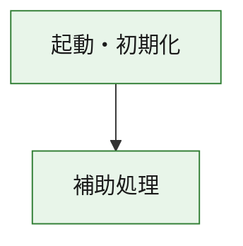
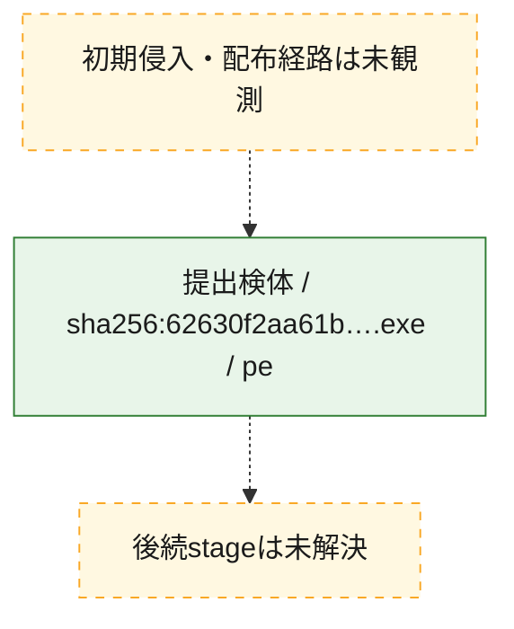
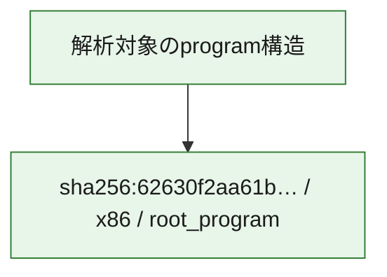

# 全体ロジック：62630f2aa61b5ccf9a13d150fbf68e9b67cf8cb0eddc16249313804a33273b11

代表関数の静的証跡から、起動・初期化の処理群を確認しました。

## 読み方

- phaseの掲載順は解析上の整理順です。observed_call_edgesがない段階間の実行順を断定しません。
- 図の実線は静的に観測した関係、点線と黄色のノードは未観測・未解決の関係を示します。
- 図は静的な要約であり、動的実行を再現するものではありません。
- 詳細な関数解説とfingerprintは[STATIC-LOGIC.md](STATIC-LOGIC.md)を参照してください。

## 静的可視化

### 実行フロー

### 感染チェーン

### モジュール関係

## 処理段階

### 1. 起動・初期化

entry pointから初期化と後続処理への移行を確認します。
確度: `confirmed_static_function_evidence`

- `62630f2aa61b5ccf9a13d150fbf68e9b67cf8cb0eddc16249313804a33273b11:ghidra:180001010` — 初期化と主要処理への分岐を行う入口関数です。 状態: `succeeded`、選定理由: `entry_point`, `meaningful_symbol_name`, `reviewed_call_centrality:22`, `role:entrypoint`, `small_program_complete_context`

### 2. 補助処理

主要処理を支える一般内部関数またはlibrary処理を確認します。
確度: `confirmed_static_function_evidence`

- `62630f2aa61b5ccf9a13d150fbf68e9b67cf8cb0eddc16249313804a33273b11:ghidra:180001240` — 検体内部の一般処理を実装する関数です。 状態: `succeeded`、選定理由: `context_representative`, `reviewed_call_centrality:2`, `small_program_complete_context`
- `62630f2aa61b5ccf9a13d150fbf68e9b67cf8cb0eddc16249313804a33273b11:ghidra:180001350` — 検体内部の一般処理を実装する関数です。 状態: `succeeded`、選定理由: `context_representative`, `reviewed_call_centrality:25`, `small_program_complete_context`
- `62630f2aa61b5ccf9a13d150fbf68e9b67cf8cb0eddc16249313804a33273b11:ghidra:180003780` — 検体内部の一般処理を実装する関数です。 状態: `succeeded`、選定理由: `context_representative`, `reviewed_call_centrality:2`, `small_program_complete_context`
- `62630f2aa61b5ccf9a13d150fbf68e9b67cf8cb0eddc16249313804a33273b11:ghidra:1800038e0` — 検体内部の一般処理を実装する関数です。 状態: `succeeded`、選定理由: `context_representative`, `reviewed_call_centrality:2`, `small_program_complete_context`

## 観測したcall関係

- `62630f2aa61b5ccf9a13d150fbf68e9b67cf8cb0eddc16249313804a33273b11:ghidra:180001010` → `62630f2aa61b5ccf9a13d150fbf68e9b67cf8cb0eddc16249313804a33273b11:ghidra:180001240` （`startup` → `support`）
- `62630f2aa61b5ccf9a13d150fbf68e9b67cf8cb0eddc16249313804a33273b11:ghidra:180001010` → `62630f2aa61b5ccf9a13d150fbf68e9b67cf8cb0eddc16249313804a33273b11:ghidra:180001350` （`startup` → `support`）
- `62630f2aa61b5ccf9a13d150fbf68e9b67cf8cb0eddc16249313804a33273b11:ghidra:180001350` → `62630f2aa61b5ccf9a13d150fbf68e9b67cf8cb0eddc16249313804a33273b11:ghidra:180001240` （`support` → `support`）
- `62630f2aa61b5ccf9a13d150fbf68e9b67cf8cb0eddc16249313804a33273b11:ghidra:180001350` → `62630f2aa61b5ccf9a13d150fbf68e9b67cf8cb0eddc16249313804a33273b11:ghidra:180003780` （`support` → `support`）
- `62630f2aa61b5ccf9a13d150fbf68e9b67cf8cb0eddc16249313804a33273b11:ghidra:180001350` → `62630f2aa61b5ccf9a13d150fbf68e9b67cf8cb0eddc16249313804a33273b11:ghidra:1800038e0` （`support` → `support`）
- `62630f2aa61b5ccf9a13d150fbf68e9b67cf8cb0eddc16249313804a33273b11:ghidra:180003780` → `62630f2aa61b5ccf9a13d150fbf68e9b67cf8cb0eddc16249313804a33273b11:ghidra:1800038e0` （`support` → `support`）
- `ghidra-function:09d43e9618f1dac2f85d9b2f` → `ghidra-function:1b6f146fdc7280933f7cf774` （`unclassified` → `unclassified`）
- `ghidra-function:09d43e9618f1dac2f85d9b2f` → `ghidra-function:26067c3b5f63fcaac16d3ae1` （`unclassified` → `unclassified`）
- `ghidra-function:09d43e9618f1dac2f85d9b2f` → `ghidra-function:31b568efb234e439173b16ee` （`unclassified` → `unclassified`）
- `ghidra-function:09d43e9618f1dac2f85d9b2f` → `ghidra-function:61863f906488a4fd3b7a43b0` （`unclassified` → `unclassified`）
- `ghidra-function:09d43e9618f1dac2f85d9b2f` → `ghidra-function:76411907a407cc6869707ccb` （`unclassified` → `unclassified`）
- `ghidra-function:09d43e9618f1dac2f85d9b2f` → `ghidra-function:82071613d3a31783d441b1fa` （`unclassified` → `unclassified`）
- `ghidra-function:09d43e9618f1dac2f85d9b2f` → `ghidra-function:b72f483bb0ae7471c5bca651` （`unclassified` → `unclassified`）
- `ghidra-function:09d43e9618f1dac2f85d9b2f` → `ghidra-function:b8a0402bb4b52b11fe82c732` （`unclassified` → `unclassified`）
- `ghidra-function:09d43e9618f1dac2f85d9b2f` → `ghidra-function:c25f8231736fb03d4090dd53` （`unclassified` → `unclassified`）
- `ghidra-function:09d43e9618f1dac2f85d9b2f` → `ghidra-function:c78006ff18cdd15af2d6947d` （`unclassified` → `unclassified`）
- `ghidra-function:09d43e9618f1dac2f85d9b2f` → `ghidra-function:dd8423f433dd16f79ecc6d3e` （`unclassified` → `unclassified`）
- `ghidra-function:09d43e9618f1dac2f85d9b2f` → `ghidra-function:f80914963be25f4fdf58cb59` （`unclassified` → `unclassified`）
- `ghidra-function:637d1d6122aefbe3ccef4e3f` → `ghidra-function:47b8821d06ca157387e43b3c` （`unclassified` → `unclassified`）
- `ghidra-function:b8a0402bb4b52b11fe82c732` → `ghidra-external:05a40c464fb5b16e28aba6b8` （`unclassified` → `unclassified`）
- `ghidra-function:b8a0402bb4b52b11fe82c732` → `ghidra-external:0aef26654b158c134c938afd` （`unclassified` → `unclassified`）
- `ghidra-function:b8a0402bb4b52b11fe82c732` → `ghidra-external:16632a8ee6e53687b48884db` （`unclassified` → `unclassified`）
- `ghidra-function:b8a0402bb4b52b11fe82c732` → `ghidra-external:1ec3ad775608ebc7aa03e1cf` （`unclassified` → `unclassified`）
- `ghidra-function:b8a0402bb4b52b11fe82c732` → `ghidra-external:2605a92ce0d6ce52dbe267d1` （`unclassified` → `unclassified`）
- `ghidra-function:b8a0402bb4b52b11fe82c732` → `ghidra-external:33002428617102b907e91e7e` （`unclassified` → `unclassified`）
- `ghidra-function:b8a0402bb4b52b11fe82c732` → `ghidra-external:34e4e8b770669a9330376a22` （`unclassified` → `unclassified`）
- `ghidra-function:b8a0402bb4b52b11fe82c732` → `ghidra-external:3582017a85ca89e002ea1c70` （`unclassified` → `unclassified`）
- `ghidra-function:b8a0402bb4b52b11fe82c732` → `ghidra-external:36b52569bcd4d5c2ed21396c` （`unclassified` → `unclassified`）
- `ghidra-function:b8a0402bb4b52b11fe82c732` → `ghidra-external:4d2c38d7f536d880e3f5b9df` （`unclassified` → `unclassified`）
- `ghidra-function:b8a0402bb4b52b11fe82c732` → `ghidra-external:4ec5cee611548d2902d122ee` （`unclassified` → `unclassified`）
- `ghidra-function:b8a0402bb4b52b11fe82c732` → `ghidra-external:5359e3103b8f7c6d6c56b6ca` （`unclassified` → `unclassified`）
- `ghidra-function:b8a0402bb4b52b11fe82c732` → `ghidra-external:58a6b41f1bdcb242069b7c27` （`unclassified` → `unclassified`）
- `ghidra-function:b8a0402bb4b52b11fe82c732` → `ghidra-external:6767521289af1efdda2b74f2` （`unclassified` → `unclassified`）
- `ghidra-function:b8a0402bb4b52b11fe82c732` → `ghidra-external:67f3e706bbe99bce06403d59` （`unclassified` → `unclassified`）
- `ghidra-function:b8a0402bb4b52b11fe82c732` → `ghidra-external:752c5a75ee75583cb4acb335` （`unclassified` → `unclassified`）
- `ghidra-function:b8a0402bb4b52b11fe82c732` → `ghidra-external:8517508970d47045b5f3460a` （`unclassified` → `unclassified`）
- `ghidra-function:b8a0402bb4b52b11fe82c732` → `ghidra-external:9d3a25e6665756842f33dd39` （`unclassified` → `unclassified`）
- `ghidra-function:b8a0402bb4b52b11fe82c732` → `ghidra-external:b50d12f0f8f1416cc1946e1c` （`unclassified` → `unclassified`）
- `ghidra-function:b8a0402bb4b52b11fe82c732` → `ghidra-external:b96a4a7920f636be109f784b` （`unclassified` → `unclassified`）
- `ghidra-function:b8a0402bb4b52b11fe82c732` → `ghidra-external:eb9c73704a8e4eeaa9ddd92d` （`unclassified` → `unclassified`）
- `ghidra-function:b8a0402bb4b52b11fe82c732` → `ghidra-function:47b8821d06ca157387e43b3c` （`unclassified` → `unclassified`）
- `ghidra-function:b8a0402bb4b52b11fe82c732` → `ghidra-function:637d1d6122aefbe3ccef4e3f` （`unclassified` → `unclassified`）
- `ghidra-function:b8a0402bb4b52b11fe82c732` → `ghidra-function:dd8423f433dd16f79ecc6d3e` （`unclassified` → `unclassified`）

## 解析範囲と制約

- 選定外関数は全体inventoryへ残しますが、関数本体の個別解説対象にはしていません。
- indirect call、難読化、packer、VM、壊れたcontrol flowによりcall関係が欠落する場合があります。
- 文書は静的解析に基づき、検体実行や外部通信による動的確認は行っていません。
