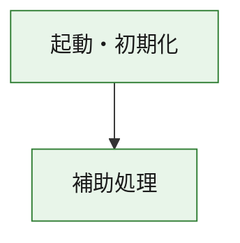
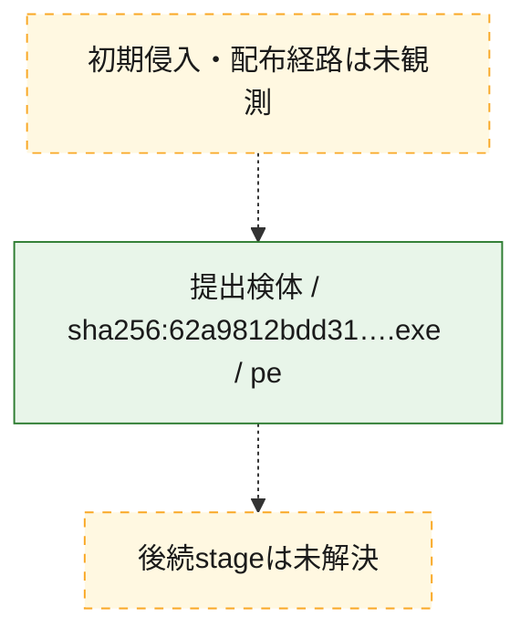
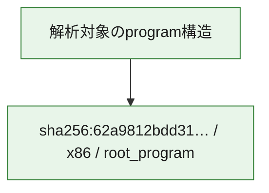

# 全体ロジック：62a9812bdd316404c6c989ad6a1ff57f7c50d5cf79781015a6f02ddf29ed3b5b

代表関数の静的証跡から、起動・初期化の処理群を確認しました。

## 読み方

- phaseの掲載順は解析上の整理順です。observed_call_edgesがない段階間の実行順を断定しません。
- 図の実線は静的に観測した関係、点線と黄色のノードは未観測・未解決の関係を示します。
- 図は静的な要約であり、動的実行を再現するものではありません。
- 詳細な関数解説とfingerprintは[STATIC-LOGIC.md](STATIC-LOGIC.md)を参照してください。

## 静的可視化

### 実行フロー

### 感染チェーン

### モジュール関係

## 処理段階

### 1. 起動・初期化

entry pointから初期化と後続処理への移行を確認します。
確度: `confirmed_static_function_evidence`

- `62a9812bdd316404c6c989ad6a1ff57f7c50d5cf79781015a6f02ddf29ed3b5b:ghidra:180001010` — 初期化と主要処理への分岐を行う入口関数です。 状態: `succeeded`、選定理由: `entry_point`, `meaningful_symbol_name`, `reviewed_call_centrality:22`, `role:entrypoint`, `small_program_complete_context`

### 2. 補助処理

主要処理を支える一般内部関数またはlibrary処理を確認します。
確度: `confirmed_static_function_evidence`

- `62a9812bdd316404c6c989ad6a1ff57f7c50d5cf79781015a6f02ddf29ed3b5b:ghidra:180001240` — 検体内部の一般処理を実装する関数です。 状態: `succeeded`、選定理由: `context_representative`, `reviewed_call_centrality:2`, `small_program_complete_context`
- `62a9812bdd316404c6c989ad6a1ff57f7c50d5cf79781015a6f02ddf29ed3b5b:ghidra:180001350` — 検体内部の一般処理を実装する関数です。 状態: `succeeded`、選定理由: `context_representative`, `reviewed_call_centrality:25`, `small_program_complete_context`
- `62a9812bdd316404c6c989ad6a1ff57f7c50d5cf79781015a6f02ddf29ed3b5b:ghidra:180003780` — 検体内部の一般処理を実装する関数です。 状態: `succeeded`、選定理由: `context_representative`, `reviewed_call_centrality:2`, `small_program_complete_context`
- `62a9812bdd316404c6c989ad6a1ff57f7c50d5cf79781015a6f02ddf29ed3b5b:ghidra:1800038e0` — 検体内部の一般処理を実装する関数です。 状態: `succeeded`、選定理由: `context_representative`, `reviewed_call_centrality:2`, `small_program_complete_context`

## 観測したcall関係

- `62a9812bdd316404c6c989ad6a1ff57f7c50d5cf79781015a6f02ddf29ed3b5b:ghidra:180001010` → `62a9812bdd316404c6c989ad6a1ff57f7c50d5cf79781015a6f02ddf29ed3b5b:ghidra:180001240` （`startup` → `support`）
- `62a9812bdd316404c6c989ad6a1ff57f7c50d5cf79781015a6f02ddf29ed3b5b:ghidra:180001010` → `62a9812bdd316404c6c989ad6a1ff57f7c50d5cf79781015a6f02ddf29ed3b5b:ghidra:180001350` （`startup` → `support`）
- `62a9812bdd316404c6c989ad6a1ff57f7c50d5cf79781015a6f02ddf29ed3b5b:ghidra:180001350` → `62a9812bdd316404c6c989ad6a1ff57f7c50d5cf79781015a6f02ddf29ed3b5b:ghidra:180001240` （`support` → `support`）
- `62a9812bdd316404c6c989ad6a1ff57f7c50d5cf79781015a6f02ddf29ed3b5b:ghidra:180001350` → `62a9812bdd316404c6c989ad6a1ff57f7c50d5cf79781015a6f02ddf29ed3b5b:ghidra:180003780` （`support` → `support`）
- `62a9812bdd316404c6c989ad6a1ff57f7c50d5cf79781015a6f02ddf29ed3b5b:ghidra:180001350` → `62a9812bdd316404c6c989ad6a1ff57f7c50d5cf79781015a6f02ddf29ed3b5b:ghidra:1800038e0` （`support` → `support`）
- `62a9812bdd316404c6c989ad6a1ff57f7c50d5cf79781015a6f02ddf29ed3b5b:ghidra:180003780` → `62a9812bdd316404c6c989ad6a1ff57f7c50d5cf79781015a6f02ddf29ed3b5b:ghidra:1800038e0` （`support` → `support`）
- `ghidra-function:295edfa297e7f16013fd2fcf` → `ghidra-function:b0d8cb2ed2ccd5b8bb82f753` （`unclassified` → `unclassified`）
- `ghidra-function:4fd6483bc2def6575d8c3662` → `ghidra-external:19d062ae1c6554386b9a9d10` （`unclassified` → `unclassified`）
- `ghidra-function:4fd6483bc2def6575d8c3662` → `ghidra-external:25b9c975cf0a52f4379463ea` （`unclassified` → `unclassified`）
- `ghidra-function:4fd6483bc2def6575d8c3662` → `ghidra-external:3078625866fec1adcf337fd1` （`unclassified` → `unclassified`）
- `ghidra-function:4fd6483bc2def6575d8c3662` → `ghidra-external:4326caa898e6a497f9ed7193` （`unclassified` → `unclassified`）
- `ghidra-function:4fd6483bc2def6575d8c3662` → `ghidra-external:4526bf60504f4763b2b5dce4` （`unclassified` → `unclassified`）
- `ghidra-function:4fd6483bc2def6575d8c3662` → `ghidra-external:5a4891fb05141138de4d2427` （`unclassified` → `unclassified`）
- `ghidra-function:4fd6483bc2def6575d8c3662` → `ghidra-external:5af8753b64742c2499797938` （`unclassified` → `unclassified`）
- `ghidra-function:4fd6483bc2def6575d8c3662` → `ghidra-external:77125a4c4c6b683a0c4087d7` （`unclassified` → `unclassified`）
- `ghidra-function:4fd6483bc2def6575d8c3662` → `ghidra-external:86ec978009c1e23c362f114c` （`unclassified` → `unclassified`）
- `ghidra-function:4fd6483bc2def6575d8c3662` → `ghidra-external:879a582876860861dd3a2e48` （`unclassified` → `unclassified`）
- `ghidra-function:4fd6483bc2def6575d8c3662` → `ghidra-external:8faf6888aa1b12baab2cd258` （`unclassified` → `unclassified`）
- `ghidra-function:4fd6483bc2def6575d8c3662` → `ghidra-external:9237870c5a64dc52a81dc089` （`unclassified` → `unclassified`）
- `ghidra-function:4fd6483bc2def6575d8c3662` → `ghidra-external:9b32c57480040ebd9a05d01e` （`unclassified` → `unclassified`）
- `ghidra-function:4fd6483bc2def6575d8c3662` → `ghidra-external:a418a93e9d3c4111af719f18` （`unclassified` → `unclassified`）
- `ghidra-function:4fd6483bc2def6575d8c3662` → `ghidra-external:b094cee84f0fbf825a231a66` （`unclassified` → `unclassified`）
- `ghidra-function:4fd6483bc2def6575d8c3662` → `ghidra-external:b3f8efc617e2839875a06a46` （`unclassified` → `unclassified`）
- `ghidra-function:4fd6483bc2def6575d8c3662` → `ghidra-external:b62cdfe2ae8ea3c353fb7bf9` （`unclassified` → `unclassified`）
- `ghidra-function:4fd6483bc2def6575d8c3662` → `ghidra-external:b74f7c28fd9d427903b1ccce` （`unclassified` → `unclassified`）
- `ghidra-function:4fd6483bc2def6575d8c3662` → `ghidra-external:d99cdeb9c27e18181b400d9d` （`unclassified` → `unclassified`）
- `ghidra-function:4fd6483bc2def6575d8c3662` → `ghidra-external:e606f6ce8160fa0c9f85eee3` （`unclassified` → `unclassified`）
- `ghidra-function:4fd6483bc2def6575d8c3662` → `ghidra-external:eed4c6595df10beb5bc78672` （`unclassified` → `unclassified`）
- `ghidra-function:4fd6483bc2def6575d8c3662` → `ghidra-function:295edfa297e7f16013fd2fcf` （`unclassified` → `unclassified`）
- `ghidra-function:4fd6483bc2def6575d8c3662` → `ghidra-function:b0d8cb2ed2ccd5b8bb82f753` （`unclassified` → `unclassified`）
- `ghidra-function:4fd6483bc2def6575d8c3662` → `ghidra-function:c2d8bb118fad7cccad429f22` （`unclassified` → `unclassified`）
- `ghidra-function:f1cad2f72388c2f9d00f576e` → `ghidra-function:14ac7ea3197cebc5e4e5a76c` （`unclassified` → `unclassified`）
- `ghidra-function:f1cad2f72388c2f9d00f576e` → `ghidra-function:44a845f08877b72a54deac9b` （`unclassified` → `unclassified`）
- `ghidra-function:f1cad2f72388c2f9d00f576e` → `ghidra-function:469ac9994aa9157043b4f85a` （`unclassified` → `unclassified`）
- `ghidra-function:f1cad2f72388c2f9d00f576e` → `ghidra-function:4fd6483bc2def6575d8c3662` （`unclassified` → `unclassified`）
- `ghidra-function:f1cad2f72388c2f9d00f576e` → `ghidra-function:57fa61b2354a10d6cc96a39d` （`unclassified` → `unclassified`）
- `ghidra-function:f1cad2f72388c2f9d00f576e` → `ghidra-function:6cbe90703d3a61d08639fdcd` （`unclassified` → `unclassified`）
- `ghidra-function:f1cad2f72388c2f9d00f576e` → `ghidra-function:6f69200ac52ad4f37f2f8370` （`unclassified` → `unclassified`）
- `ghidra-function:f1cad2f72388c2f9d00f576e` → `ghidra-function:ac45e224b2d848a5ebb73ddc` （`unclassified` → `unclassified`）
- `ghidra-function:f1cad2f72388c2f9d00f576e` → `ghidra-function:c2d8bb118fad7cccad429f22` （`unclassified` → `unclassified`）
- `ghidra-function:f1cad2f72388c2f9d00f576e` → `ghidra-function:d235d0b225098e5e52df949a` （`unclassified` → `unclassified`）
- `ghidra-function:f1cad2f72388c2f9d00f576e` → `ghidra-function:d820331765a5beb546b6b625` （`unclassified` → `unclassified`）
- `ghidra-function:f1cad2f72388c2f9d00f576e` → `ghidra-function:efd9e4c2fa2f8567ff6df2fc` （`unclassified` → `unclassified`）

## 解析範囲と制約

- 選定外関数は全体inventoryへ残しますが、関数本体の個別解説対象にはしていません。
- indirect call、難読化、packer、VM、壊れたcontrol flowによりcall関係が欠落する場合があります。
- 文書は静的解析に基づき、検体実行や外部通信による動的確認は行っていません。
