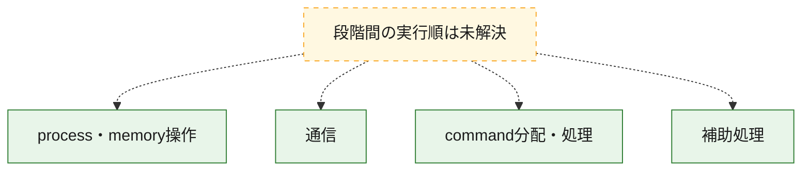
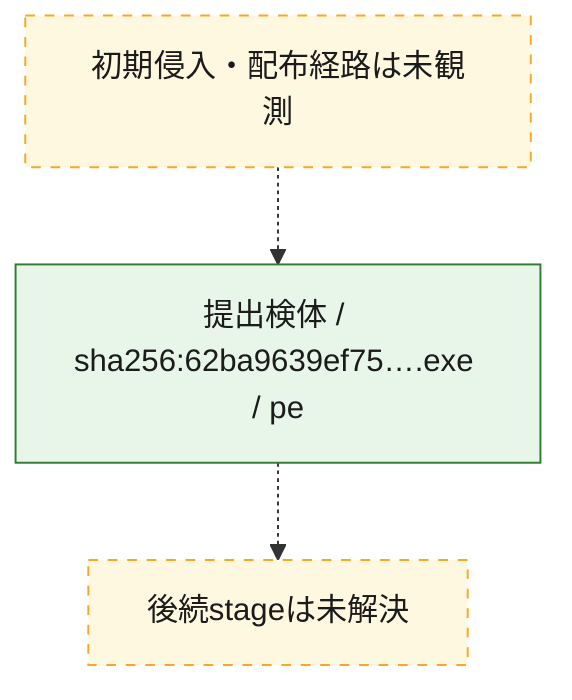
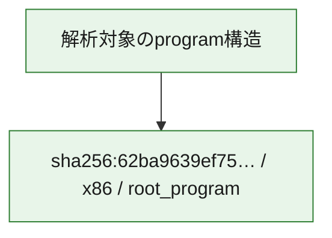

# 全体ロジック：62ba9639ef75606548755a259103e83f0ec1464b0f05c6f02fe5e35990de02c0

代表関数の静的証跡から、process・memory操作、通信、command分配・処理の処理群を確認しました。

## 読み方

- phaseの掲載順は解析上の整理順です。observed_call_edgesがない段階間の実行順を断定しません。
- 図の実線は静的に観測した関係、点線と黄色のノードは未観測・未解決の関係を示します。
- 図は静的な要約であり、動的実行を再現するものではありません。
- 詳細な関数解説とfingerprintは[STATIC-LOGIC.md](STATIC-LOGIC.md)を参照してください。

## 静的可視化

### 実行フロー

### 感染チェーン

### モジュール関係

## 処理段階

### 1. process・memory操作

process、thread、module、memory操作と実行移行を確認します。
確度: `confirmed_static_function_evidence`

- `62ba9639ef75606548755a259103e83f0ec1464b0f05c6f02fe5e35990de02c0:ghidra:140053200` — process、thread、module、またはmemory操作に関係する関数です。 状態: `succeeded`、選定理由: `context_representative`, `reviewed_call_centrality:2`, `role:process_or_memory_operation`

### 2. 通信

通信初期化、endpoint処理、送受信の役割を確認します。
確度: `confirmed_static_function_evidence`

- `62ba9639ef75606548755a259103e83f0ec1464b0f05c6f02fe5e35990de02c0:ghidra:1400510b0` — 通信初期化、送受信、またはendpoint処理に関係する関数です。 状態: `succeeded`、選定理由: `context_representative`, `reviewed_call_centrality:31`, `role:network_communication`
- `62ba9639ef75606548755a259103e83f0ec1464b0f05c6f02fe5e35990de02c0:ghidra:140051570` — 通信初期化、送受信、またはendpoint処理に関係する関数です。 状態: `succeeded`、選定理由: `context_representative`, `reviewed_call_centrality:28`, `role:network_communication`
- `62ba9639ef75606548755a259103e83f0ec1464b0f05c6f02fe5e35990de02c0:ghidra:140051ad0` — 通信初期化、送受信、またはendpoint処理に関係する関数です。 状態: `succeeded`、選定理由: `context_representative`, `reviewed_call_centrality:58`, `role:network_communication`
- `62ba9639ef75606548755a259103e83f0ec1464b0f05c6f02fe5e35990de02c0:ghidra:140052ac0` — 通信初期化、送受信、またはendpoint処理に関係する関数です。 状態: `succeeded`、選定理由: `context_representative`, `reviewed_call_centrality:17`, `role:network_communication`

### 3. command分配・処理

受信commandやtaskの解釈、分配、個別handlerへの移行を確認します。
確度: `confirmed_static_function_evidence_with_limits`

- `62ba9639ef75606548755a259103e83f0ec1464b0f05c6f02fe5e35990de02c0:ghidra:14004a627` — commandの解釈、分配、または個別処理を担当する関数です。 状態: `limited_bad_instruction_or_flow`、選定理由: `meaningful_symbol_name`, `reviewed_call_centrality:2`, `role:command_dispatch_or_handler`
- `62ba9639ef75606548755a259103e83f0ec1464b0f05c6f02fe5e35990de02c0:ghidra:140053ad0` — commandの解釈、分配、または個別処理を担当する関数です。 状態: `succeeded`、選定理由: `context_representative`, `reviewed_call_centrality:21`, `role:command_dispatch_or_handler`
- `62ba9639ef75606548755a259103e83f0ec1464b0f05c6f02fe5e35990de02c0:ghidra:140053af0` — commandの解釈、分配、または個別処理を担当する関数です。 状態: `succeeded`、選定理由: `context_representative`, `reviewed_call_centrality:20`, `role:command_dispatch_or_handler`

### 4. 補助処理

主要処理を支える一般内部関数またはlibrary処理を確認します。
確度: `confirmed_static_function_evidence`

- `62ba9639ef75606548755a259103e83f0ec1464b0f05c6f02fe5e35990de02c0:ghidra:14004bcca` — 検体内部の一般処理を実装する関数です。 状態: `succeeded`、選定理由: `meaningful_symbol_name`
- `62ba9639ef75606548755a259103e83f0ec1464b0f05c6f02fe5e35990de02c0:ghidra:140050e50` — 検体内部の一般処理を実装する関数です。 状態: `succeeded`、選定理由: `context_representative`, `reviewed_call_centrality:2`
- `62ba9639ef75606548755a259103e83f0ec1464b0f05c6f02fe5e35990de02c0:ghidra:140050f00` — 検体内部の一般処理を実装する関数です。 状態: `succeeded`、選定理由: `context_representative`, `reviewed_call_centrality:12`
- `62ba9639ef75606548755a259103e83f0ec1464b0f05c6f02fe5e35990de02c0:ghidra:1400526d0` — 検体内部の一般処理を実装する関数です。 状態: `succeeded`、選定理由: `context_representative`, `reviewed_call_centrality:17`
- `62ba9639ef75606548755a259103e83f0ec1464b0f05c6f02fe5e35990de02c0:ghidra:140052a60` — 検体内部の一般処理を実装する関数です。 状態: `succeeded`、選定理由: `context_representative`, `reviewed_call_centrality:2`
- `62ba9639ef75606548755a259103e83f0ec1464b0f05c6f02fe5e35990de02c0:ghidra:140052bf0` — 検体内部の一般処理を実装する関数です。 状態: `succeeded`、選定理由: `context_representative`, `reviewed_call_centrality:1`
- `62ba9639ef75606548755a259103e83f0ec1464b0f05c6f02fe5e35990de02c0:ghidra:140052c30` — 検体内部の一般処理を実装する関数です。 状態: `succeeded`、選定理由: `context_representative`, `reviewed_call_centrality:4`
- `62ba9639ef75606548755a259103e83f0ec1464b0f05c6f02fe5e35990de02c0:ghidra:140052d20` — 検体内部の一般処理を実装する関数です。 状態: `succeeded`、選定理由: `context_representative`, `reviewed_call_centrality:2`
- `62ba9639ef75606548755a259103e83f0ec1464b0f05c6f02fe5e35990de02c0:ghidra:140052d70` — 検体内部の一般処理を実装する関数です。 状態: `succeeded`、選定理由: `context_representative`, `reviewed_call_centrality:3`
- `62ba9639ef75606548755a259103e83f0ec1464b0f05c6f02fe5e35990de02c0:ghidra:140052fb0` — 検体内部の一般処理を実装する関数です。 状態: `succeeded`、選定理由: `context_representative`
- `62ba9639ef75606548755a259103e83f0ec1464b0f05c6f02fe5e35990de02c0:ghidra:140053000` — 検体内部の一般処理を実装する関数です。 状態: `succeeded`、選定理由: `context_representative`, `reviewed_call_centrality:1`
- `62ba9639ef75606548755a259103e83f0ec1464b0f05c6f02fe5e35990de02c0:ghidra:140053090` — 検体内部の一般処理を実装する関数です。 状態: `succeeded`、選定理由: `context_representative`, `reviewed_call_centrality:2`
- `62ba9639ef75606548755a259103e83f0ec1464b0f05c6f02fe5e35990de02c0:ghidra:140053250` — 検体内部の一般処理を実装する関数です。 状態: `succeeded`、選定理由: `context_representative`, `reviewed_call_centrality:2`
- `62ba9639ef75606548755a259103e83f0ec1464b0f05c6f02fe5e35990de02c0:ghidra:1400532b0` — 検体内部の一般処理を実装する関数です。 状態: `succeeded`、選定理由: `context_representative`, `reviewed_call_centrality:2`
- `62ba9639ef75606548755a259103e83f0ec1464b0f05c6f02fe5e35990de02c0:ghidra:140053370` — 検体内部の一般処理を実装する関数です。 状態: `succeeded`、選定理由: `context_representative`, `reviewed_call_centrality:2`
- `62ba9639ef75606548755a259103e83f0ec1464b0f05c6f02fe5e35990de02c0:ghidra:1400533f0` — 検体内部の一般処理を実装する関数です。 状態: `succeeded`、選定理由: `context_representative`, `reviewed_call_centrality:3`
- `62ba9639ef75606548755a259103e83f0ec1464b0f05c6f02fe5e35990de02c0:ghidra:140053590` — 検体内部の一般処理を実装する関数です。 状態: `succeeded`、選定理由: `context_representative`, `reviewed_call_centrality:3`
- `62ba9639ef75606548755a259103e83f0ec1464b0f05c6f02fe5e35990de02c0:ghidra:140053670` — 検体内部の一般処理を実装する関数です。 状態: `succeeded`、選定理由: `context_representative`, `reviewed_call_centrality:1`
- `62ba9639ef75606548755a259103e83f0ec1464b0f05c6f02fe5e35990de02c0:ghidra:1400536a0` — 検体内部の一般処理を実装する関数です。 状態: `succeeded`、選定理由: `context_representative`, `reviewed_call_centrality:3`
- `62ba9639ef75606548755a259103e83f0ec1464b0f05c6f02fe5e35990de02c0:ghidra:1400538f0` — 検体内部の一般処理を実装する関数です。 状態: `succeeded`、選定理由: `context_representative`
- `62ba9639ef75606548755a259103e83f0ec1464b0f05c6f02fe5e35990de02c0:ghidra:140053970` — 検体内部の一般処理を実装する関数です。 状態: `succeeded`、選定理由: `context_representative`, `reviewed_call_centrality:1`
- `62ba9639ef75606548755a259103e83f0ec1464b0f05c6f02fe5e35990de02c0:ghidra:1400539a0` — 検体内部の一般処理を実装する関数です。 状態: `succeeded`、選定理由: `context_representative`, `reviewed_call_centrality:23`
- `62ba9639ef75606548755a259103e83f0ec1464b0f05c6f02fe5e35990de02c0:ghidra:140053a90` — 検体内部の一般処理を実装する関数です。 状態: `succeeded`、選定理由: `context_representative`, `reviewed_call_centrality:1`
- `62ba9639ef75606548755a259103e83f0ec1464b0f05c6f02fe5e35990de02c0:ghidra:140053ab0` — 検体内部の一般処理を実装する関数です。 状態: `succeeded`、選定理由: `context_representative`, `reviewed_call_centrality:6`

## 観測したcall関係

- 代表関数間で直接解決できた呼出関係はありません。

## 解析範囲と制約

- 選定外関数は全体inventoryへ残しますが、関数本体の個別解説対象にはしていません。
- indirect call、難読化、packer、VM、壊れたcontrol flowによりcall関係が欠落する場合があります。
- 文書は静的解析に基づき、検体実行や外部通信による動的確認は行っていません。
