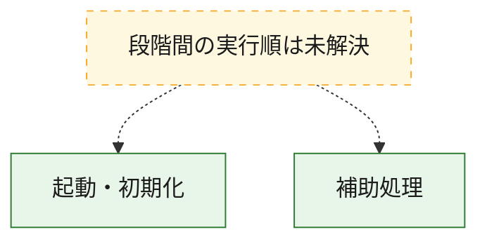
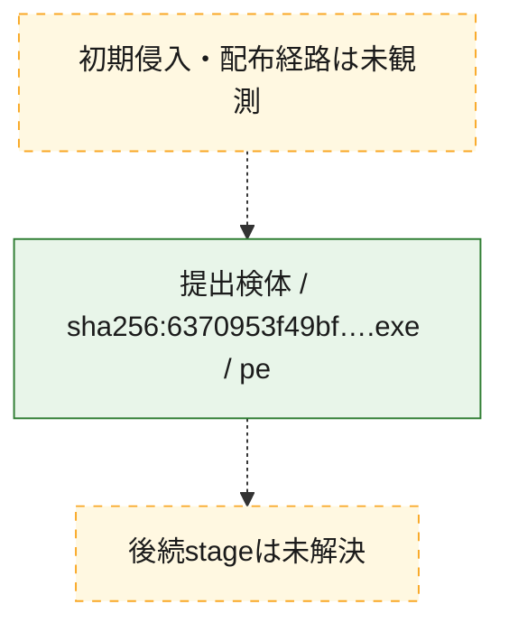
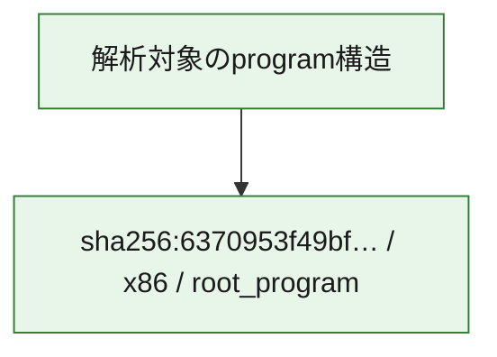

# 全体ロジック：6370953f49bf9c07f989500b7f6a0d84f4fefaf8e002770cde236f7f494f48c0

代表関数の静的証跡から、起動・初期化の処理群を確認しました。

## 読み方

- phaseの掲載順は解析上の整理順です。observed_call_edgesがない段階間の実行順を断定しません。
- 図の実線は静的に観測した関係、点線と黄色のノードは未観測・未解決の関係を示します。
- 図は静的な要約であり、動的実行を再現するものではありません。
- 詳細な関数解説とfingerprintは[STATIC-LOGIC.md](STATIC-LOGIC.md)を参照してください。

## 静的可視化

### 実行フロー

### 感染チェーン

### モジュール関係

## 処理段階

### 1. 起動・初期化

entry pointから初期化と後続処理への移行を確認します。
確度: `confirmed_static_function_evidence`

- `6370953f49bf9c07f989500b7f6a0d84f4fefaf8e002770cde236f7f494f48c0:ghidra:140004b88` — 初期化と主要処理への分岐を行う入口関数です。 状態: `succeeded`、選定理由: `entry_point`, `meaningful_symbol_name`, `reviewed_call_centrality:10`, `role:entrypoint`

### 2. 補助処理

主要処理を支える一般内部関数またはlibrary処理を確認します。
確度: `confirmed_static_function_evidence`

- `6370953f49bf9c07f989500b7f6a0d84f4fefaf8e002770cde236f7f494f48c0:ghidra:140001180` — 検体内部の一般処理を実装する関数です。 状態: `succeeded`、選定理由: `context_representative`, `reviewed_call_centrality:4`
- `6370953f49bf9c07f989500b7f6a0d84f4fefaf8e002770cde236f7f494f48c0:ghidra:1400013cc` — 検体内部の一般処理を実装する関数です。 状態: `succeeded`、選定理由: `context_representative`, `reviewed_call_centrality:2`
- `6370953f49bf9c07f989500b7f6a0d84f4fefaf8e002770cde236f7f494f48c0:ghidra:140001628` — 検体内部の一般処理を実装する関数です。 状態: `succeeded`、選定理由: `context_representative`, `reviewed_call_centrality:3`
- `6370953f49bf9c07f989500b7f6a0d84f4fefaf8e002770cde236f7f494f48c0:ghidra:140002bbc` — 検体内部の一般処理を実装する関数です。 状態: `succeeded`、選定理由: `context_representative`, `reviewed_call_centrality:7`
- `6370953f49bf9c07f989500b7f6a0d84f4fefaf8e002770cde236f7f494f48c0:ghidra:140003090` — 検体内部の一般処理を実装する関数です。 状態: `succeeded`、選定理由: `context_representative`, `reviewed_call_centrality:5`
- `6370953f49bf9c07f989500b7f6a0d84f4fefaf8e002770cde236f7f494f48c0:ghidra:140003460` — 検体内部の一般処理を実装する関数です。 状態: `succeeded`、選定理由: `context_representative`, `reviewed_call_centrality:5`
- `6370953f49bf9c07f989500b7f6a0d84f4fefaf8e002770cde236f7f494f48c0:ghidra:14000367c` — 検体内部の一般処理を実装する関数です。 状態: `succeeded`、選定理由: `context_representative`, `reviewed_call_centrality:2`
- `6370953f49bf9c07f989500b7f6a0d84f4fefaf8e002770cde236f7f494f48c0:ghidra:1400036fc` — 検体内部の一般処理を実装する関数です。 状態: `succeeded`、選定理由: `context_representative`, `reviewed_call_centrality:1`
- `6370953f49bf9c07f989500b7f6a0d84f4fefaf8e002770cde236f7f494f48c0:ghidra:140003a7c` — 検体内部の一般処理を実装する関数です。 状態: `succeeded`、選定理由: `context_representative`, `reviewed_call_centrality:5`
- `6370953f49bf9c07f989500b7f6a0d84f4fefaf8e002770cde236f7f494f48c0:ghidra:140003d34` — 検体内部の一般処理を実装する関数です。 状態: `succeeded`、選定理由: `context_representative`, `reviewed_call_centrality:3`
- `6370953f49bf9c07f989500b7f6a0d84f4fefaf8e002770cde236f7f494f48c0:ghidra:140003e34` — 検体内部の一般処理を実装する関数です。 状態: `succeeded`、選定理由: `context_representative`, `reviewed_call_centrality:2`
- `6370953f49bf9c07f989500b7f6a0d84f4fefaf8e002770cde236f7f494f48c0:ghidra:140003ea0` — 検体内部の一般処理を実装する関数です。 状態: `succeeded`、選定理由: `context_representative`, `reviewed_call_centrality:2`
- `6370953f49bf9c07f989500b7f6a0d84f4fefaf8e002770cde236f7f494f48c0:ghidra:140003fb4` — 検体内部の一般処理を実装する関数です。 状態: `succeeded`、選定理由: `context_representative`, `reviewed_call_centrality:2`
- `6370953f49bf9c07f989500b7f6a0d84f4fefaf8e002770cde236f7f494f48c0:ghidra:1400041b0` — 検体内部の一般処理を実装する関数です。 状態: `succeeded`、選定理由: `context_representative`, `reviewed_call_centrality:4`
- `6370953f49bf9c07f989500b7f6a0d84f4fefaf8e002770cde236f7f494f48c0:ghidra:140004458` — 検体内部の一般処理を実装する関数です。 状態: `succeeded`、選定理由: `context_representative`, `reviewed_call_centrality:4`
- `6370953f49bf9c07f989500b7f6a0d84f4fefaf8e002770cde236f7f494f48c0:ghidra:1400046bc` — 検体内部の一般処理を実装する関数です。 状態: `succeeded`、選定理由: `context_representative`, `reviewed_call_centrality:1`
- `6370953f49bf9c07f989500b7f6a0d84f4fefaf8e002770cde236f7f494f48c0:ghidra:140004758` — 検体内部の一般処理を実装する関数です。 状態: `succeeded`、選定理由: `context_representative`, `reviewed_call_centrality:3`
- `6370953f49bf9c07f989500b7f6a0d84f4fefaf8e002770cde236f7f494f48c0:ghidra:140004808` — 検体内部の一般処理を実装する関数です。 状態: `succeeded`、選定理由: `context_representative`, `reviewed_call_centrality:3`
- `6370953f49bf9c07f989500b7f6a0d84f4fefaf8e002770cde236f7f494f48c0:ghidra:1400049d4` — 検体内部の一般処理を実装する関数です。 状態: `succeeded`、選定理由: `context_representative`, `reviewed_call_centrality:2`
- `6370953f49bf9c07f989500b7f6a0d84f4fefaf8e002770cde236f7f494f48c0:ghidra:140004afc` — 検体内部の一般処理を実装する関数です。 状態: `succeeded`、選定理由: `context_representative`, `reviewed_call_centrality:2`
- `6370953f49bf9c07f989500b7f6a0d84f4fefaf8e002770cde236f7f494f48c0:ghidra:140004e10` — 検体内部の一般処理を実装する関数です。 状態: `succeeded`、選定理由: `context_representative`, `reviewed_call_centrality:4`
- `6370953f49bf9c07f989500b7f6a0d84f4fefaf8e002770cde236f7f494f48c0:ghidra:140004eb0` — 検体内部の一般処理を実装する関数です。 状態: `succeeded`、選定理由: `context_representative`, `reviewed_call_centrality:21`
- `6370953f49bf9c07f989500b7f6a0d84f4fefaf8e002770cde236f7f494f48c0:ghidra:140004f18` — 検体内部の一般処理を実装する関数です。 状態: `succeeded`、選定理由: `context_representative`, `reviewed_call_centrality:6`
- `6370953f49bf9c07f989500b7f6a0d84f4fefaf8e002770cde236f7f494f48c0:ghidra:140005270` — 検体内部の一般処理を実装する関数です。 状態: `succeeded`、選定理由: `context_representative`, `reviewed_call_centrality:4`
- `6370953f49bf9c07f989500b7f6a0d84f4fefaf8e002770cde236f7f494f48c0:ghidra:140005504` — 検体内部の一般処理を実装する関数です。 状態: `succeeded`、選定理由: `context_representative`, `reviewed_call_centrality:4`
- `6370953f49bf9c07f989500b7f6a0d84f4fefaf8e002770cde236f7f494f48c0:ghidra:140005628` — 検体内部の一般処理を実装する関数です。 状態: `succeeded`、選定理由: `context_representative`, `reviewed_call_centrality:3`
- `6370953f49bf9c07f989500b7f6a0d84f4fefaf8e002770cde236f7f494f48c0:ghidra:1400056f4` — 検体内部の一般処理を実装する関数です。 状態: `succeeded`、選定理由: `context_representative`, `reviewed_call_centrality:1`
- `6370953f49bf9c07f989500b7f6a0d84f4fefaf8e002770cde236f7f494f48c0:ghidra:140005794` — 検体内部の一般処理を実装する関数です。 状態: `succeeded`、選定理由: `context_representative`, `reviewed_call_centrality:3`
- `6370953f49bf9c07f989500b7f6a0d84f4fefaf8e002770cde236f7f494f48c0:ghidra:140005958` — 検体内部の一般処理を実装する関数です。 状態: `succeeded`、選定理由: `context_representative`, `reviewed_call_centrality:7`
- `6370953f49bf9c07f989500b7f6a0d84f4fefaf8e002770cde236f7f494f48c0:ghidra:140005ee8` — 検体内部の一般処理を実装する関数です。 状態: `succeeded`、選定理由: `context_representative`, `reviewed_call_centrality:5`
- `6370953f49bf9c07f989500b7f6a0d84f4fefaf8e002770cde236f7f494f48c0:ghidra:140006194` — 検体内部の一般処理を実装する関数です。 状態: `succeeded`、選定理由: `context_representative`, `reviewed_call_centrality:7`

## 観測したcall関係

- 代表関数間で直接解決できた呼出関係はありません。

## 解析範囲と制約

- 選定外関数は全体inventoryへ残しますが、関数本体の個別解説対象にはしていません。
- indirect call、難読化、packer、VM、壊れたcontrol flowによりcall関係が欠落する場合があります。
- 文書は静的解析に基づき、検体実行や外部通信による動的確認は行っていません。
