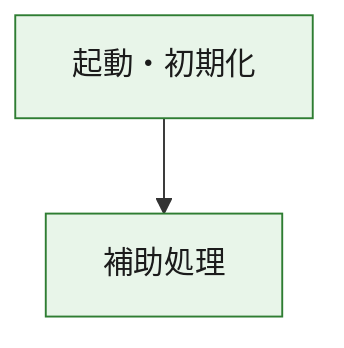
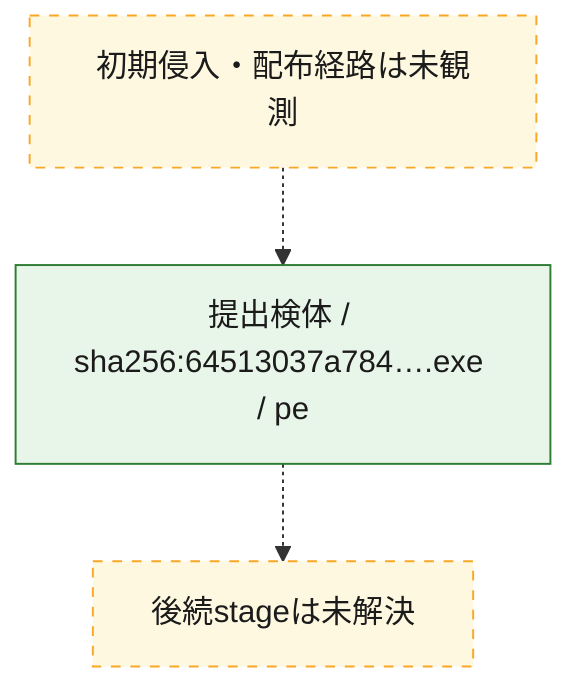
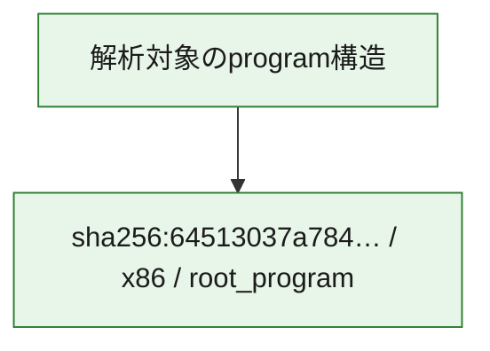

# 全体ロジック：64513037a7845d2e8c8c865113b1a43f4a58bcdcb4af5168df1f208392a45b1d

代表関数の静的証跡から、起動・初期化の処理群を確認しました。

## 読み方

- phaseの掲載順は解析上の整理順です。observed_call_edgesがない段階間の実行順を断定しません。
- 図の実線は静的に観測した関係、点線と黄色のノードは未観測・未解決の関係を示します。
- 図は静的な要約であり、動的実行を再現するものではありません。
- 詳細な関数解説とfingerprintは[STATIC-LOGIC.md](STATIC-LOGIC.md)を参照してください。

## 静的可視化

### 実行フロー

### 感染チェーン

### モジュール関係

## 処理段階

### 1. 起動・初期化

entry pointから初期化と後続処理への移行を確認します。
確度: `confirmed_static_function_evidence`

- `64513037a7845d2e8c8c865113b1a43f4a58bcdcb4af5168df1f208392a45b1d:ghidra:180001010` — 初期化と主要処理への分岐を行う入口関数です。 状態: `succeeded`、選定理由: `entry_point`, `meaningful_symbol_name`, `reviewed_call_centrality:22`, `role:entrypoint`, `small_program_complete_context`

### 2. 補助処理

主要処理を支える一般内部関数またはlibrary処理を確認します。
確度: `confirmed_static_function_evidence`

- `64513037a7845d2e8c8c865113b1a43f4a58bcdcb4af5168df1f208392a45b1d:ghidra:180001240` — 検体内部の一般処理を実装する関数です。 状態: `succeeded`、選定理由: `context_representative`, `reviewed_call_centrality:2`, `small_program_complete_context`
- `64513037a7845d2e8c8c865113b1a43f4a58bcdcb4af5168df1f208392a45b1d:ghidra:180001350` — 検体内部の一般処理を実装する関数です。 状態: `succeeded`、選定理由: `context_representative`, `reviewed_call_centrality:25`, `small_program_complete_context`
- `64513037a7845d2e8c8c865113b1a43f4a58bcdcb4af5168df1f208392a45b1d:ghidra:180003780` — 検体内部の一般処理を実装する関数です。 状態: `succeeded`、選定理由: `context_representative`, `reviewed_call_centrality:2`, `small_program_complete_context`
- `64513037a7845d2e8c8c865113b1a43f4a58bcdcb4af5168df1f208392a45b1d:ghidra:1800038e0` — 検体内部の一般処理を実装する関数です。 状態: `succeeded`、選定理由: `context_representative`, `reviewed_call_centrality:2`, `small_program_complete_context`

## 観測したcall関係

- `64513037a7845d2e8c8c865113b1a43f4a58bcdcb4af5168df1f208392a45b1d:ghidra:180001010` → `64513037a7845d2e8c8c865113b1a43f4a58bcdcb4af5168df1f208392a45b1d:ghidra:180001240` （`startup` → `support`）
- `64513037a7845d2e8c8c865113b1a43f4a58bcdcb4af5168df1f208392a45b1d:ghidra:180001010` → `64513037a7845d2e8c8c865113b1a43f4a58bcdcb4af5168df1f208392a45b1d:ghidra:180001350` （`startup` → `support`）
- `64513037a7845d2e8c8c865113b1a43f4a58bcdcb4af5168df1f208392a45b1d:ghidra:180001350` → `64513037a7845d2e8c8c865113b1a43f4a58bcdcb4af5168df1f208392a45b1d:ghidra:180001240` （`support` → `support`）
- `64513037a7845d2e8c8c865113b1a43f4a58bcdcb4af5168df1f208392a45b1d:ghidra:180001350` → `64513037a7845d2e8c8c865113b1a43f4a58bcdcb4af5168df1f208392a45b1d:ghidra:180003780` （`support` → `support`）
- `64513037a7845d2e8c8c865113b1a43f4a58bcdcb4af5168df1f208392a45b1d:ghidra:180001350` → `64513037a7845d2e8c8c865113b1a43f4a58bcdcb4af5168df1f208392a45b1d:ghidra:1800038e0` （`support` → `support`）
- `64513037a7845d2e8c8c865113b1a43f4a58bcdcb4af5168df1f208392a45b1d:ghidra:180003780` → `64513037a7845d2e8c8c865113b1a43f4a58bcdcb4af5168df1f208392a45b1d:ghidra:1800038e0` （`support` → `support`）
- `ghidra-function:50b916b29804851846e2bcc6` → `ghidra-function:d24b53d93e241330886c5390` （`unclassified` → `unclassified`）
- `ghidra-function:84c847f63d3da585815eba92` → `ghidra-function:2ac292b813fc29279b685b8a` （`unclassified` → `unclassified`）
- `ghidra-function:84c847f63d3da585815eba92` → `ghidra-function:3c9f95afde2da98d00858107` （`unclassified` → `unclassified`）
- `ghidra-function:84c847f63d3da585815eba92` → `ghidra-function:443c6a40fe14937de2c6495f` （`unclassified` → `unclassified`）
- `ghidra-function:84c847f63d3da585815eba92` → `ghidra-function:4995c51d7d03143e994881c7` （`unclassified` → `unclassified`）
- `ghidra-function:84c847f63d3da585815eba92` → `ghidra-function:5e96f48ceda62b190cb646c8` （`unclassified` → `unclassified`）
- `ghidra-function:84c847f63d3da585815eba92` → `ghidra-function:9da0555dd6b17eca1e15b050` （`unclassified` → `unclassified`）
- `ghidra-function:84c847f63d3da585815eba92` → `ghidra-function:c071c3d41ac64def09e7d9f7` （`unclassified` → `unclassified`）
- `ghidra-function:84c847f63d3da585815eba92` → `ghidra-function:c499a7562d7a2f5d38bbe4b5` （`unclassified` → `unclassified`）
- `ghidra-function:84c847f63d3da585815eba92` → `ghidra-function:dd449d65fc084b3cd5d612b4` （`unclassified` → `unclassified`）
- `ghidra-function:84c847f63d3da585815eba92` → `ghidra-function:e1e9d198172622bd738e9b78` （`unclassified` → `unclassified`）
- `ghidra-function:84c847f63d3da585815eba92` → `ghidra-function:f570328cee61c1d333941abc` （`unclassified` → `unclassified`）
- `ghidra-function:84c847f63d3da585815eba92` → `ghidra-function:f5794afbd5eca1181a7a9728` （`unclassified` → `unclassified`）
- `ghidra-function:c071c3d41ac64def09e7d9f7` → `ghidra-external:12af2883b7f9e380ccd45188` （`unclassified` → `unclassified`）
- `ghidra-function:c071c3d41ac64def09e7d9f7` → `ghidra-external:154a664148a96375b54292cf` （`unclassified` → `unclassified`）
- `ghidra-function:c071c3d41ac64def09e7d9f7` → `ghidra-external:4a765d1a15813b5c4fe695b4` （`unclassified` → `unclassified`）
- `ghidra-function:c071c3d41ac64def09e7d9f7` → `ghidra-external:5fffad735f92db7b68d19b68` （`unclassified` → `unclassified`）
- `ghidra-function:c071c3d41ac64def09e7d9f7` → `ghidra-external:79d3783feb6dc7f5fd5d06fc` （`unclassified` → `unclassified`）
- `ghidra-function:c071c3d41ac64def09e7d9f7` → `ghidra-external:859f1690020fb155b93c4867` （`unclassified` → `unclassified`）
- `ghidra-function:c071c3d41ac64def09e7d9f7` → `ghidra-external:8d09ed91abd4012c049ea809` （`unclassified` → `unclassified`）
- `ghidra-function:c071c3d41ac64def09e7d9f7` → `ghidra-external:91c5b57d1f7e8065f82a5024` （`unclassified` → `unclassified`）
- `ghidra-function:c071c3d41ac64def09e7d9f7` → `ghidra-external:9fd90176eb797a22d830e54e` （`unclassified` → `unclassified`）
- `ghidra-function:c071c3d41ac64def09e7d9f7` → `ghidra-external:a36d246f0a3e924ab2254c02` （`unclassified` → `unclassified`）
- `ghidra-function:c071c3d41ac64def09e7d9f7` → `ghidra-external:a6bcb01b30a98ba14a2cf51c` （`unclassified` → `unclassified`）
- `ghidra-function:c071c3d41ac64def09e7d9f7` → `ghidra-external:a81306c956618d5ead8e1adf` （`unclassified` → `unclassified`）
- `ghidra-function:c071c3d41ac64def09e7d9f7` → `ghidra-external:a8367eee6d7a9a16c100b949` （`unclassified` → `unclassified`）
- `ghidra-function:c071c3d41ac64def09e7d9f7` → `ghidra-external:ab2c77a685cd1c38487f376b` （`unclassified` → `unclassified`）
- `ghidra-function:c071c3d41ac64def09e7d9f7` → `ghidra-external:ae2c19aa70cba6888d1bcaf1` （`unclassified` → `unclassified`）
- `ghidra-function:c071c3d41ac64def09e7d9f7` → `ghidra-external:b450959b6abe29df65d5aa13` （`unclassified` → `unclassified`）
- `ghidra-function:c071c3d41ac64def09e7d9f7` → `ghidra-external:bce11cedcaacb2454f1ef772` （`unclassified` → `unclassified`）
- `ghidra-function:c071c3d41ac64def09e7d9f7` → `ghidra-external:c57d3e634576d2e58cd775aa` （`unclassified` → `unclassified`）
- `ghidra-function:c071c3d41ac64def09e7d9f7` → `ghidra-external:ca40f57d204b590cd5abe9b5` （`unclassified` → `unclassified`）
- `ghidra-function:c071c3d41ac64def09e7d9f7` → `ghidra-external:de61577ec9d6b4f28792fe53` （`unclassified` → `unclassified`）
- `ghidra-function:c071c3d41ac64def09e7d9f7` → `ghidra-external:f2312f93d13778429ce4b565` （`unclassified` → `unclassified`）
- `ghidra-function:c071c3d41ac64def09e7d9f7` → `ghidra-function:50b916b29804851846e2bcc6` （`unclassified` → `unclassified`）
- `ghidra-function:c071c3d41ac64def09e7d9f7` → `ghidra-function:5e96f48ceda62b190cb646c8` （`unclassified` → `unclassified`）
- `ghidra-function:c071c3d41ac64def09e7d9f7` → `ghidra-function:d24b53d93e241330886c5390` （`unclassified` → `unclassified`）

## 解析範囲と制約

- 選定外関数は全体inventoryへ残しますが、関数本体の個別解説対象にはしていません。
- indirect call、難読化、packer、VM、壊れたcontrol flowによりcall関係が欠落する場合があります。
- 文書は静的解析に基づき、検体実行や外部通信による動的確認は行っていません。
