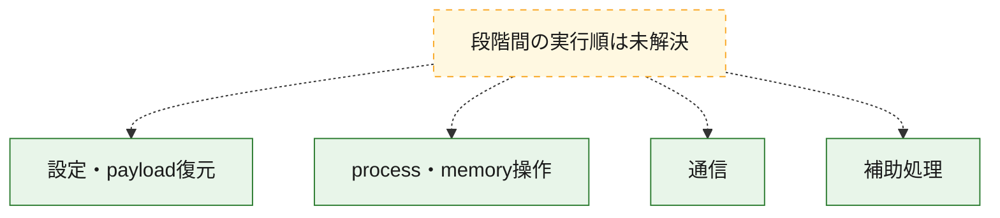
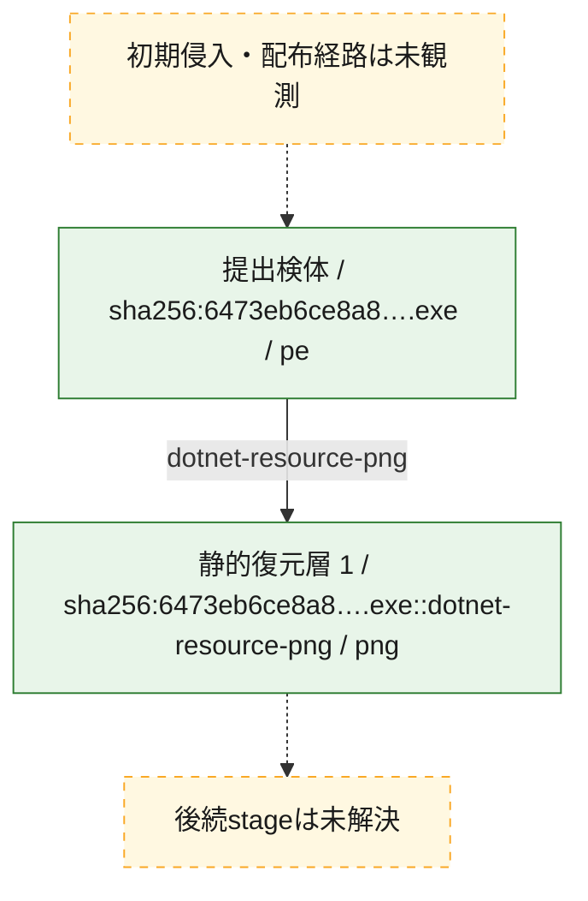
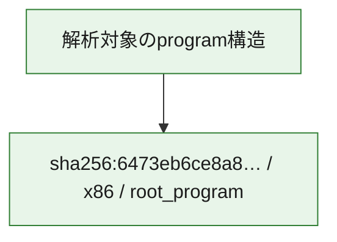

# 全体ロジック：6473eb6ce8a8bffb6599c9a71820e66b55a71ab58e203036ed1e47c205e7278e

代表関数の静的証跡から、設定・payload復元、process・memory操作、通信の処理群を確認しました。

## 読み方

- phaseの掲載順は解析上の整理順です。observed_call_edgesがない段階間の実行順を断定しません。
- 図の実線は静的に観測した関係、点線と黄色のノードは未観測・未解決の関係を示します。
- 図は静的な要約であり、動的実行を再現するものではありません。
- 詳細な関数解説とfingerprintは[STATIC-LOGIC.md](STATIC-LOGIC.md)を参照してください。

## 静的可視化

### 実行フロー

### 感染チェーン

### モジュール関係

## 処理段階

### 1. 設定・payload復元

設定、resource、payload、暗号化データの復元・変換を確認します。
確度: `confirmed_static_function_evidence`

- `6473eb6ce8a8bffb6599c9a71820e66b55a71ab58e203036ed1e47c205e7278e:cil:0x060000ea` — 暗号、hash、encoding、または復号処理に関係する関数です。 状態: `succeeded`、選定理由: `reviewed_call_centrality:2`, `role:cryptographic_transform`
- `6473eb6ce8a8bffb6599c9a71820e66b55a71ab58e203036ed1e47c205e7278e:cil:0x0600012d` — 暗号、hash、encoding、または復号処理に関係する関数です。 状態: `succeeded`、選定理由: `reviewed_call_centrality:2`, `role:cryptographic_transform`
- `6473eb6ce8a8bffb6599c9a71820e66b55a71ab58e203036ed1e47c205e7278e:cil:0x0600020f` — 暗号、hash、encoding、または復号処理に関係する関数です。 状態: `succeeded`、選定理由: `role:cryptographic_transform`
- `6473eb6ce8a8bffb6599c9a71820e66b55a71ab58e203036ed1e47c205e7278e:cil:0x060002b8` — 暗号、hash、encoding、または復号処理に関係する関数です。 状態: `succeeded`、選定理由: `role:cryptographic_transform`
- `6473eb6ce8a8bffb6599c9a71820e66b55a71ab58e203036ed1e47c205e7278e:cil:0x0600034f` — 設定、resource、payloadなどの解析・変換を行う関数です。 状態: `succeeded`、選定理由: `large_function:instructions=338`, `reviewed_call_centrality:146`, `role:config_or_data_transform`
- `6473eb6ce8a8bffb6599c9a71820e66b55a71ab58e203036ed1e47c205e7278e:cil:0x06000383` — 暗号、hash、encoding、または復号処理に関係する関数です。 状態: `succeeded`、選定理由: `reviewed_call_centrality:2`, `role:cryptographic_transform`
- `6473eb6ce8a8bffb6599c9a71820e66b55a71ab58e203036ed1e47c205e7278e:cil:0x060003ad` — 暗号、hash、encoding、または復号処理に関係する関数です。 状態: `succeeded`、選定理由: `large_function:instructions=377`, `reviewed_call_centrality:180`, `role:cryptographic_transform`
- `6473eb6ce8a8bffb6599c9a71820e66b55a71ab58e203036ed1e47c205e7278e:cil:0x06000410` — 暗号、hash、encoding、または復号処理に関係する関数です。 状態: `succeeded`、選定理由: `reviewed_call_centrality:14`, `role:cryptographic_transform`
- `6473eb6ce8a8bffb6599c9a71820e66b55a71ab58e203036ed1e47c205e7278e:cil:0x06000441` — 暗号、hash、encoding、または復号処理に関係する関数です。 状態: `succeeded`、選定理由: `reviewed_call_centrality:2`, `role:cryptographic_transform`

### 2. process・memory操作

process、thread、module、memory操作と実行移行を確認します。
確度: `confirmed_static_function_evidence`

- `6473eb6ce8a8bffb6599c9a71820e66b55a71ab58e203036ed1e47c205e7278e:cil:0x0600034e` — process、thread、module、またはmemory操作に関係する関数です。 状態: `succeeded`、選定理由: `large_function:instructions=154`, `reviewed_call_centrality:90`, `role:process_or_memory_operation`

### 3. 通信

通信初期化、endpoint処理、送受信の役割を確認します。
確度: `confirmed_static_function_evidence`

- `6473eb6ce8a8bffb6599c9a71820e66b55a71ab58e203036ed1e47c205e7278e:cil:0x0600011f` — 通信初期化、送受信、またはendpoint処理に関係する関数です。 状態: `succeeded`、選定理由: `reviewed_call_centrality:2`, `role:network_communication`
- `6473eb6ce8a8bffb6599c9a71820e66b55a71ab58e203036ed1e47c205e7278e:cil:0x0600015d` — 通信初期化、送受信、またはendpoint処理に関係する関数です。 状態: `succeeded`、選定理由: `reviewed_call_centrality:2`, `role:network_communication`
- `6473eb6ce8a8bffb6599c9a71820e66b55a71ab58e203036ed1e47c205e7278e:cil:0x06000411` — 通信初期化、送受信、またはendpoint処理に関係する関数です。 状態: `succeeded`、選定理由: `large_function:instructions=207`, `reviewed_call_centrality:98`, `role:network_communication`
- `6473eb6ce8a8bffb6599c9a71820e66b55a71ab58e203036ed1e47c205e7278e:cil:0x06000416` — 通信初期化、送受信、またはendpoint処理に関係する関数です。 状態: `succeeded`、選定理由: `reviewed_call_centrality:2`, `role:network_communication`

### 4. 補助処理

主要処理を支える一般内部関数またはlibrary処理を確認します。
確度: `confirmed_static_function_evidence`

- `6473eb6ce8a8bffb6599c9a71820e66b55a71ab58e203036ed1e47c205e7278e:cil:0x060002db` — 検体内部の一般処理を実装する関数です。 状態: `succeeded`、選定理由: `reviewed_call_centrality:34`
- `6473eb6ce8a8bffb6599c9a71820e66b55a71ab58e203036ed1e47c205e7278e:cil:0x060002dc` — 検体内部の一般処理を実装する関数です。 状態: `succeeded`、選定理由: `reviewed_call_centrality:34`
- `6473eb6ce8a8bffb6599c9a71820e66b55a71ab58e203036ed1e47c205e7278e:cil:0x060002dd` — 検体内部の一般処理を実装する関数です。 状態: `succeeded`、選定理由: `reviewed_call_centrality:14`
- `6473eb6ce8a8bffb6599c9a71820e66b55a71ab58e203036ed1e47c205e7278e:cil:0x060002de` — 検体内部の一般処理を実装する関数です。 状態: `succeeded`、選定理由: `large_function:instructions=84`, `reviewed_call_centrality:52`
- `6473eb6ce8a8bffb6599c9a71820e66b55a71ab58e203036ed1e47c205e7278e:cil:0x060002df` — 検体内部の一般処理を実装する関数です。 状態: `succeeded`、選定理由: `large_function:instructions=85`, `reviewed_call_centrality:44`
- `6473eb6ce8a8bffb6599c9a71820e66b55a71ab58e203036ed1e47c205e7278e:cil:0x060002e0` — 検体内部の一般処理を実装する関数です。 状態: `succeeded`、選定理由: `large_function:instructions=167`, `reviewed_call_centrality:110`
- `6473eb6ce8a8bffb6599c9a71820e66b55a71ab58e203036ed1e47c205e7278e:cil:0x0600034b` — 検体内部の一般処理を実装する関数です。 状態: `succeeded`、選定理由: `reviewed_call_centrality:4`
- `6473eb6ce8a8bffb6599c9a71820e66b55a71ab58e203036ed1e47c205e7278e:cil:0x06000351` — 検体内部の一般処理を実装する関数です。 状態: `succeeded`、選定理由: `reviewed_call_centrality:6`
- `6473eb6ce8a8bffb6599c9a71820e66b55a71ab58e203036ed1e47c205e7278e:cil:0x060003ac` — 検体内部の一般処理を実装する関数です。 状態: `succeeded`、選定理由: `reviewed_call_centrality:14`
- `6473eb6ce8a8bffb6599c9a71820e66b55a71ab58e203036ed1e47c205e7278e:cil:0x060003af` — 検体内部の一般処理を実装する関数です。 状態: `succeeded`、選定理由: `reviewed_call_centrality:14`
- `6473eb6ce8a8bffb6599c9a71820e66b55a71ab58e203036ed1e47c205e7278e:cil:0x0600040e` — 検体内部の一般処理を実装する関数です。 状態: `succeeded`、選定理由: `reviewed_call_centrality:14`
- `6473eb6ce8a8bffb6599c9a71820e66b55a71ab58e203036ed1e47c205e7278e:cil:0x0600040f` — 検体内部の一般処理を実装する関数です。 状態: `succeeded`、選定理由: `reviewed_call_centrality:14`
- `6473eb6ce8a8bffb6599c9a71820e66b55a71ab58e203036ed1e47c205e7278e:cil:0x06000413` — 検体内部の一般処理を実装する関数です。 状態: `succeeded`、選定理由: `reviewed_call_centrality:14`
- `6473eb6ce8a8bffb6599c9a71820e66b55a71ab58e203036ed1e47c205e7278e:cil:0x06000414` — 検体内部の一般処理を実装する関数です。 状態: `succeeded`、選定理由: `reviewed_call_centrality:2`
- `6473eb6ce8a8bffb6599c9a71820e66b55a71ab58e203036ed1e47c205e7278e:cil:0x06000415` — 検体内部の一般処理を実装する関数です。 状態: `succeeded`、選定理由: `reviewed_call_centrality:14`
- `6473eb6ce8a8bffb6599c9a71820e66b55a71ab58e203036ed1e47c205e7278e:cil:0x06000471` — 検体内部の一般処理を実装する関数です。 状態: `succeeded`、選定理由: `reviewed_call_centrality:2`
- `6473eb6ce8a8bffb6599c9a71820e66b55a71ab58e203036ed1e47c205e7278e:cil:0x060004f5` — 検体内部の一般処理を実装する関数です。 状態: `succeeded`、選定理由: `reviewed_call_centrality:2`
- `6473eb6ce8a8bffb6599c9a71820e66b55a71ab58e203036ed1e47c205e7278e:cil:0x06000539` — 検体内部の一般処理を実装する関数です。 状態: `succeeded`、選定理由: `reviewed_call_centrality:2`

## 観測したcall関係

- 代表関数間で直接解決できた呼出関係はありません。

## 解析範囲と制約

- 選定外関数は全体inventoryへ残しますが、関数本体の個別解説対象にはしていません。
- indirect call、難読化、packer、VM、壊れたcontrol flowによりcall関係が欠落する場合があります。
- 文書は静的解析に基づき、検体実行や外部通信による動的確認は行っていません。
