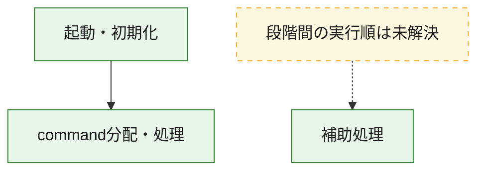
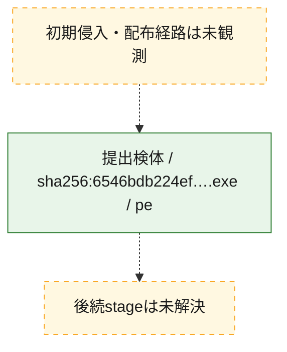
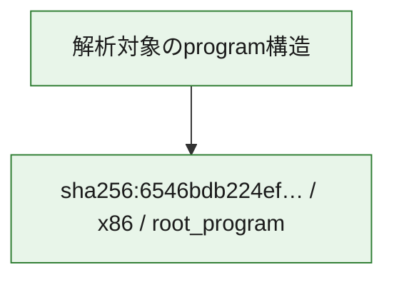

# 全体ロジック：6546bdb224efc722030e60a0eefba1b327094081218bcd6a597f581ab326643d

代表関数の静的証跡から、起動・初期化、command分配・処理の処理群を確認しました。

## 読み方

- phaseの掲載順は解析上の整理順です。observed_call_edgesがない段階間の実行順を断定しません。
- 図の実線は静的に観測した関係、点線と黄色のノードは未観測・未解決の関係を示します。
- 図は静的な要約であり、動的実行を再現するものではありません。
- 詳細な関数解説とfingerprintは[STATIC-LOGIC.md](STATIC-LOGIC.md)を参照してください。

## 静的可視化

### 実行フロー

### 感染チェーン

### モジュール関係

## 処理段階

### 1. 起動・初期化

entry pointから初期化と後続処理への移行を確認します。
確度: `confirmed_static_function_evidence`

- `6546bdb224efc722030e60a0eefba1b327094081218bcd6a597f581ab326643d:ghidra:14000ca40` — 初期化と主要処理への分岐を行う入口関数です。 状態: `succeeded`、選定理由: `entry_point`, `meaningful_symbol_name`, `reviewed_call_centrality:22`, `role:entrypoint`

### 2. command分配・処理

受信commandやtaskの解釈、分配、個別handlerへの移行を確認します。
確度: `confirmed_static_function_evidence_with_limits`

- `6546bdb224efc722030e60a0eefba1b327094081218bcd6a597f581ab326643d:ghidra:140019760` — commandの解釈、分配、または個別処理を担当する関数です。 状態: `limited_bad_instruction_or_flow`、選定理由: `meaningful_symbol_name`, `reviewed_call_centrality:1`, `role:command_dispatch_or_handler`

### 3. 補助処理

主要処理を支える一般内部関数またはlibrary処理を確認します。
確度: `confirmed_static_function_evidence_with_limits`

- `6546bdb224efc722030e60a0eefba1b327094081218bcd6a597f581ab326643d:ghidra:1400010ec` — 検体内部の一般処理を実装する関数です。 状態: `limited_bad_instruction_or_flow`、選定理由: `context_representative`, `reviewed_call_centrality:1`
- `6546bdb224efc722030e60a0eefba1b327094081218bcd6a597f581ab326643d:ghidra:140001f1e` — 検体内部の一般処理を実装する関数です。 状態: `succeeded`、選定理由: `context_representative`, `reviewed_call_centrality:1`
- `6546bdb224efc722030e60a0eefba1b327094081218bcd6a597f581ab326643d:ghidra:140001f43` — 検体内部の一般処理を実装する関数です。 状態: `succeeded`、選定理由: `context_representative`, `reviewed_call_centrality:2`
- `6546bdb224efc722030e60a0eefba1b327094081218bcd6a597f581ab326643d:ghidra:140001fee` — 検体内部の一般処理を実装する関数です。 状態: `succeeded`、選定理由: `context_representative`, `reviewed_call_centrality:4`
- `6546bdb224efc722030e60a0eefba1b327094081218bcd6a597f581ab326643d:ghidra:1400021f8` — 検体内部の一般処理を実装する関数です。 状態: `succeeded`、選定理由: `context_representative`, `reviewed_call_centrality:3`
- `6546bdb224efc722030e60a0eefba1b327094081218bcd6a597f581ab326643d:ghidra:140002243` — 検体内部の一般処理を実装する関数です。 状態: `limited_bad_instruction_or_flow`、選定理由: `context_representative`, `reviewed_call_centrality:1`
- `6546bdb224efc722030e60a0eefba1b327094081218bcd6a597f581ab326643d:ghidra:14000228d` — 検体内部の一般処理を実装する関数です。 状態: `succeeded`、選定理由: `context_representative`, `reviewed_call_centrality:8`
- `6546bdb224efc722030e60a0eefba1b327094081218bcd6a597f581ab326643d:ghidra:1400027fb` — 検体内部の一般処理を実装する関数です。 状態: `limited_bad_instruction_or_flow`、選定理由: `context_representative`, `reviewed_call_centrality:10`
- `6546bdb224efc722030e60a0eefba1b327094081218bcd6a597f581ab326643d:ghidra:14000285c` — 検体内部の一般処理を実装する関数です。 状態: `succeeded`、選定理由: `context_representative`
- `6546bdb224efc722030e60a0eefba1b327094081218bcd6a597f581ab326643d:ghidra:14000293e` — 検体内部の一般処理を実装する関数です。 状態: `succeeded`、選定理由: `context_representative`, `reviewed_call_centrality:1`
- `6546bdb224efc722030e60a0eefba1b327094081218bcd6a597f581ab326643d:ghidra:140002a62` — 検体内部の一般処理を実装する関数です。 状態: `succeeded`、選定理由: `context_representative`, `reviewed_call_centrality:2`
- `6546bdb224efc722030e60a0eefba1b327094081218bcd6a597f581ab326643d:ghidra:140002ae0` — 検体内部の一般処理を実装する関数です。 状態: `succeeded`、選定理由: `context_representative`
- `6546bdb224efc722030e60a0eefba1b327094081218bcd6a597f581ab326643d:ghidra:140002aff` — 検体内部の一般処理を実装する関数です。 状態: `succeeded`、選定理由: `context_representative`, `reviewed_call_centrality:1`
- `6546bdb224efc722030e60a0eefba1b327094081218bcd6a597f581ab326643d:ghidra:140002b2a` — 検体内部の一般処理を実装する関数です。 状態: `succeeded`、選定理由: `context_representative`
- `6546bdb224efc722030e60a0eefba1b327094081218bcd6a597f581ab326643d:ghidra:140002e7e` — 検体内部の一般処理を実装する関数です。 状態: `succeeded`、選定理由: `context_representative`, `reviewed_call_centrality:3`
- `6546bdb224efc722030e60a0eefba1b327094081218bcd6a597f581ab326643d:ghidra:140003430` — 検体内部の一般処理を実装する関数です。 状態: `succeeded`、選定理由: `context_representative`, `reviewed_call_centrality:2`
- `6546bdb224efc722030e60a0eefba1b327094081218bcd6a597f581ab326643d:ghidra:14000344f` — 検体内部の一般処理を実装する関数です。 状態: `succeeded`、選定理由: `context_representative`, `reviewed_call_centrality:1`
- `6546bdb224efc722030e60a0eefba1b327094081218bcd6a597f581ab326643d:ghidra:1400034b3` — 検体内部の一般処理を実装する関数です。 状態: `succeeded`、選定理由: `context_representative`, `reviewed_call_centrality:2`
- `6546bdb224efc722030e60a0eefba1b327094081218bcd6a597f581ab326643d:ghidra:1400034ef` — 検体内部の一般処理を実装する関数です。 状態: `succeeded`、選定理由: `context_representative`, `reviewed_call_centrality:9`
- `6546bdb224efc722030e60a0eefba1b327094081218bcd6a597f581ab326643d:ghidra:140003528` — 検体内部の一般処理を実装する関数です。 状態: `succeeded`、選定理由: `context_representative`, `reviewed_call_centrality:8`
- `6546bdb224efc722030e60a0eefba1b327094081218bcd6a597f581ab326643d:ghidra:1400035fd` — 検体内部の一般処理を実装する関数です。 状態: `succeeded`、選定理由: `context_representative`
- `6546bdb224efc722030e60a0eefba1b327094081218bcd6a597f581ab326643d:ghidra:140003609` — 検体内部の一般処理を実装する関数です。 状態: `succeeded`、選定理由: `context_representative`
- `6546bdb224efc722030e60a0eefba1b327094081218bcd6a597f581ab326643d:ghidra:140003628` — 検体内部の一般処理を実装する関数です。 状態: `limited_bad_instruction_or_flow`、選定理由: `context_representative`, `reviewed_call_centrality:7`
- `6546bdb224efc722030e60a0eefba1b327094081218bcd6a597f581ab326643d:ghidra:140003bbc` — 検体内部の一般処理を実装する関数です。 状態: `limited_bad_instruction_or_flow`、選定理由: `context_representative`, `reviewed_call_centrality:4`
- `6546bdb224efc722030e60a0eefba1b327094081218bcd6a597f581ab326643d:ghidra:140003c12` — 検体内部の一般処理を実装する関数です。 状態: `succeeded`、選定理由: `context_representative`, `reviewed_call_centrality:1`
- `6546bdb224efc722030e60a0eefba1b327094081218bcd6a597f581ab326643d:ghidra:140003da8` — 検体内部の一般処理を実装する関数です。 状態: `succeeded`、選定理由: `context_representative`, `reviewed_call_centrality:1`
- `6546bdb224efc722030e60a0eefba1b327094081218bcd6a597f581ab326643d:ghidra:140003e49` — 検体内部の一般処理を実装する関数です。 状態: `succeeded`、選定理由: `context_representative`, `reviewed_call_centrality:1`
- `6546bdb224efc722030e60a0eefba1b327094081218bcd6a597f581ab326643d:ghidra:1400040e2` — 検体内部の一般処理を実装する関数です。 状態: `succeeded`、選定理由: `context_representative`, `reviewed_call_centrality:4`
- `6546bdb224efc722030e60a0eefba1b327094081218bcd6a597f581ab326643d:ghidra:14000412a` — 検体内部の一般処理を実装する関数です。 状態: `succeeded`、選定理由: `context_representative`, `reviewed_call_centrality:1`
- `6546bdb224efc722030e60a0eefba1b327094081218bcd6a597f581ab326643d:ghidra:14000d070` — 検体内部の一般処理を実装する関数です。 状態: `succeeded`、選定理由: `meaningful_symbol_name`

## 観測したcall関係

- `6546bdb224efc722030e60a0eefba1b327094081218bcd6a597f581ab326643d:ghidra:14000344f` → `6546bdb224efc722030e60a0eefba1b327094081218bcd6a597f581ab326643d:ghidra:1400021f8` （`support` → `support`）
- `6546bdb224efc722030e60a0eefba1b327094081218bcd6a597f581ab326643d:ghidra:14000ca40` → `6546bdb224efc722030e60a0eefba1b327094081218bcd6a597f581ab326643d:ghidra:140019760` （`startup` → `dispatch`）
- `ghidra-function:0128a6a5438825886cb231ff` → `ghidra-external:971680fbd1709aae049ea0b0` （`unclassified` → `unclassified`）
- `ghidra-function:0128a6a5438825886cb231ff` → `ghidra-function:835411b9898736d19deb5083` （`unclassified` → `unclassified`）
- `ghidra-function:02b3bc84fa77596a6e2ba0b7` → `ghidra-function:00eefff3758a28a0da3db39e` （`unclassified` → `unclassified`）
- `ghidra-function:02b3bc84fa77596a6e2ba0b7` → `ghidra-function:fff72436ffb5d113ad51b962` （`unclassified` → `unclassified`）
- `ghidra-function:04791e6336bd9a2a12fc6da3` → `ghidra-external:45fda84417b383b4939423e1` （`unclassified` → `unclassified`）
- `ghidra-function:04791e6336bd9a2a12fc6da3` → `ghidra-external:bc6b50637d7c1159d88bb7ff` （`unclassified` → `unclassified`）
- `ghidra-function:04791e6336bd9a2a12fc6da3` → `ghidra-function:46c44c128193a193b81dce80` （`unclassified` → `unclassified`）
- `ghidra-function:04791e6336bd9a2a12fc6da3` → `ghidra-function:6401421c530792178c2c316b` （`unclassified` → `unclassified`）
- `ghidra-function:04791e6336bd9a2a12fc6da3` → `ghidra-function:d3ebe571e8fae0abadb011f4` （`unclassified` → `unclassified`）
- `ghidra-function:050160cfe800486822af1042` → `ghidra-external:469e97a76c092ada2bfbc1f8` （`unclassified` → `unclassified`）
- `ghidra-function:050160cfe800486822af1042` → `ghidra-external:5b1e8c13de528572f41c967d` （`unclassified` → `unclassified`）
- `ghidra-function:050160cfe800486822af1042` → `ghidra-external:82fa6641ee1fe24b5d644fa9` （`unclassified` → `unclassified`）
- `ghidra-function:050160cfe800486822af1042` → `ghidra-external:b496b31a2eec9ac183157aa0` （`unclassified` → `unclassified`）
- `ghidra-function:050160cfe800486822af1042` → `ghidra-external:bb06e1798acc556508f32e85` （`unclassified` → `unclassified`）
- `ghidra-function:050160cfe800486822af1042` → `ghidra-external:bc6b50637d7c1159d88bb7ff` （`unclassified` → `unclassified`）
- `ghidra-function:050160cfe800486822af1042` → `ghidra-external:c7888e374b081e7fca92e926` （`unclassified` → `unclassified`）
- `ghidra-function:050160cfe800486822af1042` → `ghidra-external:da3c81318304e84c287d9797` （`unclassified` → `unclassified`）
- `ghidra-function:050160cfe800486822af1042` → `ghidra-external:ee24ff3ff0df0c9e687a0e88` （`unclassified` → `unclassified`）
- `ghidra-function:050160cfe800486822af1042` → `ghidra-function:05583157c00c83b338b32a36` （`unclassified` → `unclassified`）
- `ghidra-function:050160cfe800486822af1042` → `ghidra-function:0f168b6d5a480282bab073c5` （`unclassified` → `unclassified`）
- `ghidra-function:050160cfe800486822af1042` → `ghidra-function:17a099d5fcd7c14f9b4b572f` （`unclassified` → `unclassified`）
- `ghidra-function:050160cfe800486822af1042` → `ghidra-function:2074c18e1d2bc8317642df18` （`unclassified` → `unclassified`）
- `ghidra-function:050160cfe800486822af1042` → `ghidra-function:5014f79067b40dfa49eb6bbd` （`unclassified` → `unclassified`）
- `ghidra-function:050160cfe800486822af1042` → `ghidra-function:51fc8ecde363c207e65ccc38` （`unclassified` → `unclassified`）
- `ghidra-function:050160cfe800486822af1042` → `ghidra-function:6baff744e7e0148d439ae68a` （`unclassified` → `unclassified`）
- `ghidra-function:050160cfe800486822af1042` → `ghidra-function:8c6a96dea357db2a98487e63` （`unclassified` → `unclassified`）
- `ghidra-function:050160cfe800486822af1042` → `ghidra-function:a7b66f88f6e9bf8793bce07a` （`unclassified` → `unclassified`）
- `ghidra-function:050160cfe800486822af1042` → `ghidra-function:a9098c75935a7a3db1c91e4b` （`unclassified` → `unclassified`）
- `ghidra-function:050160cfe800486822af1042` → `ghidra-function:b9307deb972f6046621ba731` （`unclassified` → `unclassified`）
- `ghidra-function:050160cfe800486822af1042` → `ghidra-function:f43bf93268cee1e4fbc0a884` （`unclassified` → `unclassified`）
- `ghidra-function:050160cfe800486822af1042` → `ghidra-function:f6f038227b8a08d09e3eac0f` （`unclassified` → `unclassified`）
- `ghidra-function:0daa3d1e8312fab9c6785877` → `ghidra-function:0128a6a5438825886cb231ff` （`unclassified` → `unclassified`）
- `ghidra-function:215dbe282219c237444e4a1f` → `ghidra-function:5693d4918a5ad8ba09cb4bef` （`unclassified` → `unclassified`）
- `ghidra-function:215dbe282219c237444e4a1f` → `ghidra-function:71f0b93b300c11f593fc24c7` （`unclassified` → `unclassified`）
- `ghidra-function:4242b9ec0bfd82fd0ad0fb86` → `ghidra-external:971680fbd1709aae049ea0b0` （`unclassified` → `unclassified`）
- `ghidra-function:55d067d9d32bd4f7189c75fa` → `ghidra-external:1528c51f74e65df3a935a4af` （`unclassified` → `unclassified`）
- `ghidra-function:55d067d9d32bd4f7189c75fa` → `ghidra-external:f3affbf542b3e7956a063440` （`unclassified` → `unclassified`）
- `ghidra-function:55d067d9d32bd4f7189c75fa` → `ghidra-function:0bab5a576a2dcb813ae279fa` （`unclassified` → `unclassified`）
- `ghidra-function:55d067d9d32bd4f7189c75fa` → `ghidra-function:71f0b93b300c11f593fc24c7` （`unclassified` → `unclassified`）
- `ghidra-function:55d067d9d32bd4f7189c75fa` → `ghidra-function:fb86e810bfa25f1493481fa1` （`unclassified` → `unclassified`）
- `ghidra-function:5734acfe53aa88041e9fb4b7` → `ghidra-external:bc6b50637d7c1159d88bb7ff` （`unclassified` → `unclassified`）
- `ghidra-function:6c806ba796d6dadcd15d5106` → `ghidra-external:971680fbd1709aae049ea0b0` （`unclassified` → `unclassified`）
- `ghidra-function:762d37cfe4309f4dc2c3ba09` → `ghidra-external:c45af3e39c5b948cfa721d82` （`unclassified` → `unclassified`）
- `ghidra-function:771152f7e43e958d05b317dc` → `ghidra-function:cc5fb8c1bf99b04538ac6d14` （`unclassified` → `unclassified`）
- `ghidra-function:784a0b30e6607fabd4f6e1dd` → `ghidra-external:0d2a78ae9c4d0e942639a812` （`unclassified` → `unclassified`）
- `ghidra-function:784a0b30e6607fabd4f6e1dd` → `ghidra-external:b49dfb827566e68e0ab4d772` （`unclassified` → `unclassified`）
- `ghidra-function:784a0b30e6607fabd4f6e1dd` → `ghidra-external:bc6b50637d7c1159d88bb7ff` （`unclassified` → `unclassified`）
- `ghidra-function:79358ee809a260428a06553e` → `ghidra-external:971680fbd1709aae049ea0b0` （`unclassified` → `unclassified`）
- `ghidra-function:7d4dbac6be576989b728f6dc` → `ghidra-external:971680fbd1709aae049ea0b0` （`unclassified` → `unclassified`）
- `ghidra-function:7d4dbac6be576989b728f6dc` → `ghidra-function:4efc7e2a46a21ae5c613274e` （`unclassified` → `unclassified`）
- `ghidra-function:7d4dbac6be576989b728f6dc` → `ghidra-function:c373d98d73b3b0bedf2e08a8` （`unclassified` → `unclassified`）
- `ghidra-function:804008c1253c734c66a2731c` → `ghidra-external:54802f8ac4450dd1f0b7abfa` （`unclassified` → `unclassified`）
- `ghidra-function:804008c1253c734c66a2731c` → `ghidra-external:971680fbd1709aae049ea0b0` （`unclassified` → `unclassified`）
- `ghidra-function:9be4ded4147df98bcdc54be0` → `ghidra-external:b228bea62d0d879928eb856b` （`unclassified` → `unclassified`）
- `ghidra-function:9cad0f415c42d7a84f109d81` → `ghidra-external:971680fbd1709aae049ea0b0` （`unclassified` → `unclassified`）
- `ghidra-function:9cad0f415c42d7a84f109d81` → `ghidra-function:835411b9898736d19deb5083` （`unclassified` → `unclassified`）
- `ghidra-function:a2441ea979066f9f54c1c28c` → `ghidra-external:1528c51f74e65df3a935a4af` （`unclassified` → `unclassified`）
- `ghidra-function:a2441ea979066f9f54c1c28c` → `ghidra-external:f3affbf542b3e7956a063440` （`unclassified` → `unclassified`）
- `ghidra-function:a2441ea979066f9f54c1c28c` → `ghidra-function:0bab5a576a2dcb813ae279fa` （`unclassified` → `unclassified`）
- `ghidra-function:a2441ea979066f9f54c1c28c` → `ghidra-function:71f0b93b300c11f593fc24c7` （`unclassified` → `unclassified`）
- `ghidra-function:a2441ea979066f9f54c1c28c` → `ghidra-function:931250d019d8cce75823a2f2` （`unclassified` → `unclassified`）
- `ghidra-function:a2441ea979066f9f54c1c28c` → `ghidra-function:fb86e810bfa25f1493481fa1` （`unclassified` → `unclassified`）
- `ghidra-function:a5f5b14d3e2a3f2864c2607d` → `ghidra-external:8a694adf14b2af7234548922` （`unclassified` → `unclassified`）
- `ghidra-function:a5f5b14d3e2a3f2864c2607d` → `ghidra-function:53fe4194368673d0f4519b40` （`unclassified` → `unclassified`）
- `ghidra-function:c3917176c5ed79aa6ace6597` → `ghidra-external:09e628d1cf6e3c4716e09b5c` （`unclassified` → `unclassified`）
- `ghidra-function:c3917176c5ed79aa6ace6597` → `ghidra-external:7a39431ff908194eb76d546a` （`unclassified` → `unclassified`）
- `ghidra-function:c3917176c5ed79aa6ace6597` → `ghidra-external:8e898c3e432ff3d6294f3385` （`unclassified` → `unclassified`）
- `ghidra-function:c3917176c5ed79aa6ace6597` → `ghidra-external:9bd16cbfcb7f2bde5e49e7d7` （`unclassified` → `unclassified`）
- `ghidra-function:c3917176c5ed79aa6ace6597` → `ghidra-external:9d0f837b9936ecb967afbde6` （`unclassified` → `unclassified`）
- `ghidra-function:c3917176c5ed79aa6ace6597` → `ghidra-external:bc6b50637d7c1159d88bb7ff` （`unclassified` → `unclassified`）
- `ghidra-function:c3917176c5ed79aa6ace6597` → `ghidra-external:c7657e89d372d9d892019cb7` （`unclassified` → `unclassified`）
- `ghidra-function:ccce0924e3cbe6545e2312bf` → `ghidra-external:971680fbd1709aae049ea0b0` （`unclassified` → `unclassified`）
- `ghidra-function:ccce0924e3cbe6545e2312bf` → `ghidra-function:85754c0a131a9766f610a9ac` （`unclassified` → `unclassified`）
- `ghidra-function:e83291464144ab3b8f367a49` → `ghidra-external:971680fbd1709aae049ea0b0` （`unclassified` → `unclassified`）
- `ghidra-function:f4633d0979410422f7f08a7a` → `ghidra-function:156d56d90000a2247dc42b62` （`unclassified` → `unclassified`）
- `ghidra-function:fa95a1ee33d9b925be9ad5e0` → `ghidra-external:09e628d1cf6e3c4716e09b5c` （`unclassified` → `unclassified`）
- `ghidra-function:fa95a1ee33d9b925be9ad5e0` → `ghidra-external:263789c78e45034100525817` （`unclassified` → `unclassified`）
- `ghidra-function:fa95a1ee33d9b925be9ad5e0` → `ghidra-external:7a39431ff908194eb76d546a` （`unclassified` → `unclassified`）
- `ghidra-function:fa95a1ee33d9b925be9ad5e0` → `ghidra-external:8e898c3e432ff3d6294f3385` （`unclassified` → `unclassified`）
- `ghidra-function:fa95a1ee33d9b925be9ad5e0` → `ghidra-external:9bd16cbfcb7f2bde5e49e7d7` （`unclassified` → `unclassified`）
- `ghidra-function:fa95a1ee33d9b925be9ad5e0` → `ghidra-external:bc6b50637d7c1159d88bb7ff` （`unclassified` → `unclassified`）
- `ghidra-function:fa95a1ee33d9b925be9ad5e0` → `ghidra-external:bcbf036ba5ebf6dc31528678` （`unclassified` → `unclassified`）
- `ghidra-function:fa95a1ee33d9b925be9ad5e0` → `ghidra-external:c7657e89d372d9d892019cb7` （`unclassified` → `unclassified`）
- `ghidra-function:fa95a1ee33d9b925be9ad5e0` → `ghidra-function:684e277b2418cf4a8724fd5d` （`unclassified` → `unclassified`）

## 解析範囲と制約

- 選定外関数は全体inventoryへ残しますが、関数本体の個別解説対象にはしていません。
- indirect call、難読化、packer、VM、壊れたcontrol flowによりcall関係が欠落する場合があります。
- 文書は静的解析に基づき、検体実行や外部通信による動的確認は行っていません。
