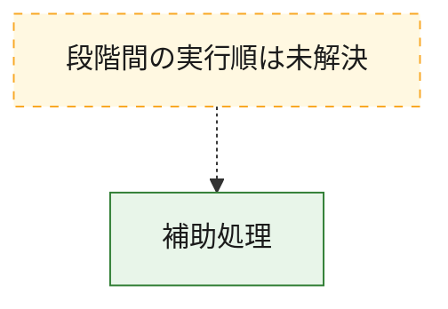
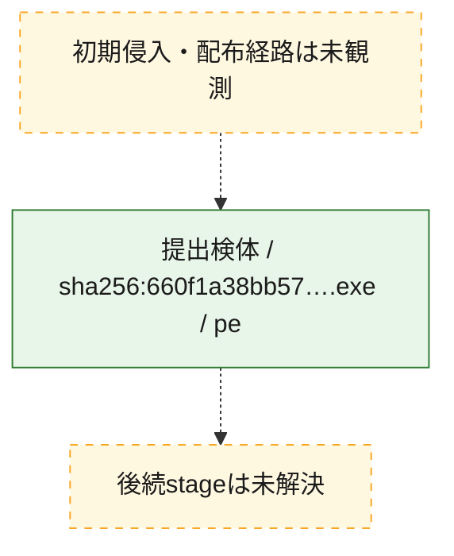
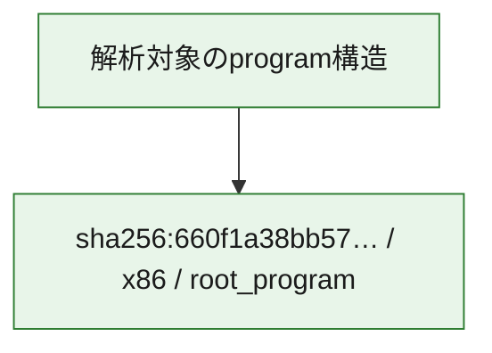

# 全体ロジック：660f1a38bb5772fd54838a3d86d17fbe9b223f31f768eb1b1519e35f5f3f1684

代表関数から主要なmalware処理段階を自動分類できませんでした。

## 読み方

- phaseの掲載順は解析上の整理順です。observed_call_edgesがない段階間の実行順を断定しません。
- 図の実線は静的に観測した関係、点線と黄色のノードは未観測・未解決の関係を示します。
- 図は静的な要約であり、動的実行を再現するものではありません。
- 詳細な関数解説とfingerprintは[STATIC-LOGIC.md](STATIC-LOGIC.md)を参照してください。

## 静的可視化

### 実行フロー

### 感染チェーン

### モジュール関係

## 処理段階

### 1. 補助処理

主要処理を支える一般内部関数またはlibrary処理を確認します。
確度: `confirmed_static_function_evidence`

- `660f1a38bb5772fd54838a3d86d17fbe9b223f31f768eb1b1519e35f5f3f1684:ghidra:140001000` — 検体内部の一般処理を実装する関数です。 状態: `succeeded`、選定理由: `context_representative`, `reviewed_call_centrality:8`
- `660f1a38bb5772fd54838a3d86d17fbe9b223f31f768eb1b1519e35f5f3f1684:ghidra:1400012a0` — 検体内部の一般処理を実装する関数です。 状態: `succeeded`、選定理由: `context_representative`, `reviewed_call_centrality:3`
- `660f1a38bb5772fd54838a3d86d17fbe9b223f31f768eb1b1519e35f5f3f1684:ghidra:140001320` — 検体内部の一般処理を実装する関数です。 状態: `succeeded`、選定理由: `context_representative`, `reviewed_call_centrality:3`
- `660f1a38bb5772fd54838a3d86d17fbe9b223f31f768eb1b1519e35f5f3f1684:ghidra:140001380` — 検体内部の一般処理を実装する関数です。 状態: `succeeded`、選定理由: `context_representative`, `reviewed_call_centrality:2`
- `660f1a38bb5772fd54838a3d86d17fbe9b223f31f768eb1b1519e35f5f3f1684:ghidra:1400013c0` — 検体内部の一般処理を実装する関数です。 状態: `succeeded`、選定理由: `context_representative`, `reviewed_call_centrality:4`
- `660f1a38bb5772fd54838a3d86d17fbe9b223f31f768eb1b1519e35f5f3f1684:ghidra:140001540` — 検体内部の一般処理を実装する関数です。 状態: `succeeded`、選定理由: `context_representative`, `reviewed_call_centrality:2`
- `660f1a38bb5772fd54838a3d86d17fbe9b223f31f768eb1b1519e35f5f3f1684:ghidra:140001620` — 検体内部の一般処理を実装する関数です。 状態: `succeeded`、選定理由: `context_representative`, `reviewed_call_centrality:5`
- `660f1a38bb5772fd54838a3d86d17fbe9b223f31f768eb1b1519e35f5f3f1684:ghidra:1400019e0` — 検体内部の一般処理を実装する関数です。 状態: `succeeded`、選定理由: `context_representative`, `reviewed_call_centrality:2`
- `660f1a38bb5772fd54838a3d86d17fbe9b223f31f768eb1b1519e35f5f3f1684:ghidra:140001a60` — 検体内部の一般処理を実装する関数です。 状態: `succeeded`、選定理由: `context_representative`, `reviewed_call_centrality:1`
- `660f1a38bb5772fd54838a3d86d17fbe9b223f31f768eb1b1519e35f5f3f1684:ghidra:140001ae0` — 検体内部の一般処理を実装する関数です。 状態: `succeeded`、選定理由: `context_representative`, `reviewed_call_centrality:2`
- `660f1a38bb5772fd54838a3d86d17fbe9b223f31f768eb1b1519e35f5f3f1684:ghidra:140001ba0` — 検体内部の一般処理を実装する関数です。 状態: `succeeded`、選定理由: `context_representative`, `reviewed_call_centrality:2`
- `660f1a38bb5772fd54838a3d86d17fbe9b223f31f768eb1b1519e35f5f3f1684:ghidra:140001d00` — 検体内部の一般処理を実装する関数です。 状態: `succeeded`、選定理由: `context_representative`, `reviewed_call_centrality:2`
- `660f1a38bb5772fd54838a3d86d17fbe9b223f31f768eb1b1519e35f5f3f1684:ghidra:140001d60` — 検体内部の一般処理を実装する関数です。 状態: `succeeded`、選定理由: `context_representative`, `reviewed_call_centrality:4`
- `660f1a38bb5772fd54838a3d86d17fbe9b223f31f768eb1b1519e35f5f3f1684:ghidra:140001de0` — 検体内部の一般処理を実装する関数です。 状態: `succeeded`、選定理由: `context_representative`, `reviewed_call_centrality:5`
- `660f1a38bb5772fd54838a3d86d17fbe9b223f31f768eb1b1519e35f5f3f1684:ghidra:140001e80` — 検体内部の一般処理を実装する関数です。 状態: `succeeded`、選定理由: `context_representative`, `reviewed_call_centrality:5`
- `660f1a38bb5772fd54838a3d86d17fbe9b223f31f768eb1b1519e35f5f3f1684:ghidra:140001f80` — 検体内部の一般処理を実装する関数です。 状態: `succeeded`、選定理由: `context_representative`, `reviewed_call_centrality:7`
- `660f1a38bb5772fd54838a3d86d17fbe9b223f31f768eb1b1519e35f5f3f1684:ghidra:1400023e0` — 検体内部の一般処理を実装する関数です。 状態: `succeeded`、選定理由: `context_representative`, `reviewed_call_centrality:3`
- `660f1a38bb5772fd54838a3d86d17fbe9b223f31f768eb1b1519e35f5f3f1684:ghidra:140002440` — 検体内部の一般処理を実装する関数です。 状態: `succeeded`、選定理由: `context_representative`, `reviewed_call_centrality:2`
- `660f1a38bb5772fd54838a3d86d17fbe9b223f31f768eb1b1519e35f5f3f1684:ghidra:140002460` — 検体内部の一般処理を実装する関数です。 状態: `succeeded`、選定理由: `context_representative`, `reviewed_call_centrality:2`
- `660f1a38bb5772fd54838a3d86d17fbe9b223f31f768eb1b1519e35f5f3f1684:ghidra:140002480` — 検体内部の一般処理を実装する関数です。 状態: `succeeded`、選定理由: `context_representative`, `reviewed_call_centrality:2`
- `660f1a38bb5772fd54838a3d86d17fbe9b223f31f768eb1b1519e35f5f3f1684:ghidra:1400024a0` — 検体内部の一般処理を実装する関数です。 状態: `succeeded`、選定理由: `context_representative`, `reviewed_call_centrality:3`
- `660f1a38bb5772fd54838a3d86d17fbe9b223f31f768eb1b1519e35f5f3f1684:ghidra:1400024e0` — 検体内部の一般処理を実装する関数です。 状態: `succeeded`、選定理由: `context_representative`, `reviewed_call_centrality:2`
- `660f1a38bb5772fd54838a3d86d17fbe9b223f31f768eb1b1519e35f5f3f1684:ghidra:140002500` — 検体内部の一般処理を実装する関数です。 状態: `succeeded`、選定理由: `context_representative`, `reviewed_call_centrality:2`
- `660f1a38bb5772fd54838a3d86d17fbe9b223f31f768eb1b1519e35f5f3f1684:ghidra:140002520` — 検体内部の一般処理を実装する関数です。 状態: `succeeded`、選定理由: `context_representative`, `reviewed_call_centrality:3`
- `660f1a38bb5772fd54838a3d86d17fbe9b223f31f768eb1b1519e35f5f3f1684:ghidra:140002560` — 検体内部の一般処理を実装する関数です。 状態: `succeeded`、選定理由: `context_representative`, `reviewed_call_centrality:3`
- `660f1a38bb5772fd54838a3d86d17fbe9b223f31f768eb1b1519e35f5f3f1684:ghidra:1400025e0` — 検体内部の一般処理を実装する関数です。 状態: `succeeded`、選定理由: `context_representative`, `reviewed_call_centrality:3`
- `660f1a38bb5772fd54838a3d86d17fbe9b223f31f768eb1b1519e35f5f3f1684:ghidra:140002760` — 検体内部の一般処理を実装する関数です。 状態: `succeeded`、選定理由: `context_representative`, `reviewed_call_centrality:5`
- `660f1a38bb5772fd54838a3d86d17fbe9b223f31f768eb1b1519e35f5f3f1684:ghidra:140002ae0` — 検体内部の一般処理を実装する関数です。 状態: `succeeded`、選定理由: `context_representative`, `reviewed_call_centrality:5`
- `660f1a38bb5772fd54838a3d86d17fbe9b223f31f768eb1b1519e35f5f3f1684:ghidra:140002e40` — 検体内部の一般処理を実装する関数です。 状態: `succeeded`、選定理由: `context_representative`, `reviewed_call_centrality:5`
- `660f1a38bb5772fd54838a3d86d17fbe9b223f31f768eb1b1519e35f5f3f1684:ghidra:140003200` — 検体内部の一般処理を実装する関数です。 状態: `succeeded`、選定理由: `context_representative`, `reviewed_call_centrality:5`
- `660f1a38bb5772fd54838a3d86d17fbe9b223f31f768eb1b1519e35f5f3f1684:ghidra:1400035e0` — 検体内部の一般処理を実装する関数です。 状態: `succeeded`、選定理由: `context_representative`, `reviewed_call_centrality:5`
- `660f1a38bb5772fd54838a3d86d17fbe9b223f31f768eb1b1519e35f5f3f1684:ghidra:140003940` — 検体内部の一般処理を実装する関数です。 状態: `succeeded`、選定理由: `context_representative`, `reviewed_call_centrality:5`

## 観測したcall関係

- `660f1a38bb5772fd54838a3d86d17fbe9b223f31f768eb1b1519e35f5f3f1684:ghidra:1400024a0` → `660f1a38bb5772fd54838a3d86d17fbe9b223f31f768eb1b1519e35f5f3f1684:ghidra:140001d60` （`support` → `support`）
- `660f1a38bb5772fd54838a3d86d17fbe9b223f31f768eb1b1519e35f5f3f1684:ghidra:140002520` → `660f1a38bb5772fd54838a3d86d17fbe9b223f31f768eb1b1519e35f5f3f1684:ghidra:140001de0` （`support` → `support`）
- `660f1a38bb5772fd54838a3d86d17fbe9b223f31f768eb1b1519e35f5f3f1684:ghidra:1400025e0` → `660f1a38bb5772fd54838a3d86d17fbe9b223f31f768eb1b1519e35f5f3f1684:ghidra:140001e80` （`support` → `support`）
- `ghidra-function:0c641b4d3d1d600d93418191` → `ghidra-external:fad3010a717d8d471264d366` （`unclassified` → `unclassified`）
- `ghidra-function:0c641b4d3d1d600d93418191` → `ghidra-function:74103342d0897902023c7262` （`unclassified` → `unclassified`）
- `ghidra-function:0c641b4d3d1d600d93418191` → `ghidra-function:7e2724ad23b682a6c9735618` （`unclassified` → `unclassified`）
- `ghidra-function:20df81dcef69c9d64a1f0263` → `ghidra-external:4f4f6d6a7093f8b400fc32e6` （`unclassified` → `unclassified`）
- `ghidra-function:20df81dcef69c9d64a1f0263` → `ghidra-function:319907c36636b41624dd42b3` （`unclassified` → `unclassified`）
- `ghidra-function:20df81dcef69c9d64a1f0263` → `ghidra-function:cdaa859522d71ba478dc0687` （`unclassified` → `unclassified`）
- `ghidra-function:220dda8b3b01cd30bef77f68` → `ghidra-external:4e7ed5b626a44daac43ce2a8` （`unclassified` → `unclassified`）
- `ghidra-function:220dda8b3b01cd30bef77f68` → `ghidra-external:fad3010a717d8d471264d366` （`unclassified` → `unclassified`）
- `ghidra-function:220dda8b3b01cd30bef77f68` → `ghidra-function:7e2724ad23b682a6c9735618` （`unclassified` → `unclassified`）
- `ghidra-function:23cd90097ce7cbe09a0f0f3b` → `ghidra-external:4f4f6d6a7093f8b400fc32e6` （`unclassified` → `unclassified`）
- `ghidra-function:23cd90097ce7cbe09a0f0f3b` → `ghidra-function:2cfcbfddd46af80157431a61` （`unclassified` → `unclassified`）
- `ghidra-function:23cd90097ce7cbe09a0f0f3b` → `ghidra-function:74103342d0897902023c7262` （`unclassified` → `unclassified`）
- `ghidra-function:23cd90097ce7cbe09a0f0f3b` → `ghidra-function:837c04679f728bf7e93418f9` （`unclassified` → `unclassified`）
- `ghidra-function:23cd90097ce7cbe09a0f0f3b` → `ghidra-function:c6b8de2ab8d9d664429e804a` （`unclassified` → `unclassified`）
- `ghidra-function:297f13f0d88d395e7dd155e8` → `ghidra-external:fad3010a717d8d471264d366` （`unclassified` → `unclassified`）
- `ghidra-function:297f13f0d88d395e7dd155e8` → `ghidra-function:7e2724ad23b682a6c9735618` （`unclassified` → `unclassified`）
- `ghidra-function:2f9edfb2d53cdc17ffef66c3` → `ghidra-external:4f4f6d6a7093f8b400fc32e6` （`unclassified` → `unclassified`）
- `ghidra-function:2f9edfb2d53cdc17ffef66c3` → `ghidra-function:220dda8b3b01cd30bef77f68` （`unclassified` → `unclassified`）
- `ghidra-function:2f9edfb2d53cdc17ffef66c3` → `ghidra-function:319907c36636b41624dd42b3` （`unclassified` → `unclassified`）
- `ghidra-function:3f0193b42832c2adc0d1052b` → `ghidra-external:fad3010a717d8d471264d366` （`unclassified` → `unclassified`）
- `ghidra-function:3f0193b42832c2adc0d1052b` → `ghidra-function:319907c36636b41624dd42b3` （`unclassified` → `unclassified`）
- `ghidra-function:497360e14744ba2f173dfc32` → `ghidra-external:4f4f6d6a7093f8b400fc32e6` （`unclassified` → `unclassified`）
- `ghidra-function:497360e14744ba2f173dfc32` → `ghidra-external:9ede15b7667358e6a4b7654a` （`unclassified` → `unclassified`）
- `ghidra-function:497360e14744ba2f173dfc32` → `ghidra-external:fc88c157fdfad1a0b01cceb9` （`unclassified` → `unclassified`）
- `ghidra-function:497360e14744ba2f173dfc32` → `ghidra-function:837c04679f728bf7e93418f9` （`unclassified` → `unclassified`）
- `ghidra-function:59231e6ef1ed866b8742d624` → `ghidra-external:fad3010a717d8d471264d366` （`unclassified` → `unclassified`）
- `ghidra-function:59231e6ef1ed866b8742d624` → `ghidra-function:74103342d0897902023c7262` （`unclassified` → `unclassified`）
- `ghidra-function:64cb23b1da3fe561356bd7db` → `ghidra-external:4f4f6d6a7093f8b400fc32e6` （`unclassified` → `unclassified`）
- `ghidra-function:64cb23b1da3fe561356bd7db` → `ghidra-function:74103342d0897902023c7262` （`unclassified` → `unclassified`）
- `ghidra-function:64cb23b1da3fe561356bd7db` → `ghidra-function:837c04679f728bf7e93418f9` （`unclassified` → `unclassified`）
- `ghidra-function:73d0a61f884de09d8020857f` → `ghidra-external:4f4f6d6a7093f8b400fc32e6` （`unclassified` → `unclassified`）
- `ghidra-function:73d0a61f884de09d8020857f` → `ghidra-function:2cfcbfddd46af80157431a61` （`unclassified` → `unclassified`）
- `ghidra-function:73d0a61f884de09d8020857f` → `ghidra-function:74103342d0897902023c7262` （`unclassified` → `unclassified`）
- `ghidra-function:73d0a61f884de09d8020857f` → `ghidra-function:837c04679f728bf7e93418f9` （`unclassified` → `unclassified`）
- `ghidra-function:73d0a61f884de09d8020857f` → `ghidra-function:c6b8de2ab8d9d664429e804a` （`unclassified` → `unclassified`）
- `ghidra-function:76259fd6fee063204222f2a7` → `ghidra-external:4f4f6d6a7093f8b400fc32e6` （`unclassified` → `unclassified`）
- `ghidra-function:76259fd6fee063204222f2a7` → `ghidra-function:319907c36636b41624dd42b3` （`unclassified` → `unclassified`）
- `ghidra-function:76259fd6fee063204222f2a7` → `ghidra-function:fc9e36364af4e545b8c54f5b` （`unclassified` → `unclassified`）
- `ghidra-function:77d8cc97f87618c14116a93b` → `ghidra-external:4f4f6d6a7093f8b400fc32e6` （`unclassified` → `unclassified`）
- `ghidra-function:77d8cc97f87618c14116a93b` → `ghidra-function:0af85386df82986245ad6b42` （`unclassified` → `unclassified`）
- `ghidra-function:77d8cc97f87618c14116a93b` → `ghidra-function:3307377626b4d8c20e988a37` （`unclassified` → `unclassified`）
- `ghidra-function:77d8cc97f87618c14116a93b` → `ghidra-function:368f1a43721e45698c3299e9` （`unclassified` → `unclassified`）
- `ghidra-function:77d8cc97f87618c14116a93b` → `ghidra-function:68f2cf5bf0c96b70ae4800fc` （`unclassified` → `unclassified`）
- `ghidra-function:77d8cc97f87618c14116a93b` → `ghidra-function:98ba808bf95ae507000f9081` （`unclassified` → `unclassified`）
- `ghidra-function:77d8cc97f87618c14116a93b` → `ghidra-function:d6d2e37735b94811d8e1095c` （`unclassified` → `unclassified`）
- `ghidra-function:77d8cc97f87618c14116a93b` → `ghidra-function:e996702d4f949fc05d21d6a2` （`unclassified` → `unclassified`）
- `ghidra-function:7935f58410362d480105aa3e` → `ghidra-external:fad3010a717d8d471264d366` （`unclassified` → `unclassified`）
- `ghidra-function:7935f58410362d480105aa3e` → `ghidra-function:319907c36636b41624dd42b3` （`unclassified` → `unclassified`）
- `ghidra-function:7935f58410362d480105aa3e` → `ghidra-function:7e2724ad23b682a6c9735618` （`unclassified` → `unclassified`）
- `ghidra-function:7c8a15affa9fd3a2e92621b3` → `ghidra-external:fad3010a717d8d471264d366` （`unclassified` → `unclassified`）
- `ghidra-function:7c8a15affa9fd3a2e92621b3` → `ghidra-function:319907c36636b41624dd42b3` （`unclassified` → `unclassified`）
- `ghidra-function:877e9f2e8487e6f96d7bff0e` → `ghidra-external:4f4f6d6a7093f8b400fc32e6` （`unclassified` → `unclassified`）
- `ghidra-function:877e9f2e8487e6f96d7bff0e` → `ghidra-function:2cfcbfddd46af80157431a61` （`unclassified` → `unclassified`）
- `ghidra-function:877e9f2e8487e6f96d7bff0e` → `ghidra-function:74103342d0897902023c7262` （`unclassified` → `unclassified`）
- `ghidra-function:877e9f2e8487e6f96d7bff0e` → `ghidra-function:837c04679f728bf7e93418f9` （`unclassified` → `unclassified`）
- `ghidra-function:877e9f2e8487e6f96d7bff0e` → `ghidra-function:c6b8de2ab8d9d664429e804a` （`unclassified` → `unclassified`）
- `ghidra-function:8b4a21960d8f20b522161670` → `ghidra-external:fad3010a717d8d471264d366` （`unclassified` → `unclassified`）
- `ghidra-function:8b4a21960d8f20b522161670` → `ghidra-function:319907c36636b41624dd42b3` （`unclassified` → `unclassified`）
- `ghidra-function:ad06522447c8ba9b32307efa` → `ghidra-external:fad3010a717d8d471264d366` （`unclassified` → `unclassified`）
- `ghidra-function:ad06522447c8ba9b32307efa` → `ghidra-function:74103342d0897902023c7262` （`unclassified` → `unclassified`）
- `ghidra-function:b3d6ddeb17e0503e79d18281` → `ghidra-function:74103342d0897902023c7262` （`unclassified` → `unclassified`）
- `ghidra-function:b5161029db292f349c9c39e7` → `ghidra-external:3ab5688ff15b8a01b21af6bb` （`unclassified` → `unclassified`）
- `ghidra-function:b5161029db292f349c9c39e7` → `ghidra-external:4f4f6d6a7093f8b400fc32e6` （`unclassified` → `unclassified`）
- `ghidra-function:b5161029db292f349c9c39e7` → `ghidra-function:74103342d0897902023c7262` （`unclassified` → `unclassified`）
- `ghidra-function:b5161029db292f349c9c39e7` → `ghidra-function:837c04679f728bf7e93418f9` （`unclassified` → `unclassified`）
- `ghidra-function:b5161029db292f349c9c39e7` → `ghidra-function:87df877f723518d7711cb20c` （`unclassified` → `unclassified`）
- `ghidra-function:b5161029db292f349c9c39e7` → `ghidra-function:8ca9baee82fef349d0e4065a` （`unclassified` → `unclassified`）
- `ghidra-function:b5161029db292f349c9c39e7` → `ghidra-function:b09c82ef97efc8783b241880` （`unclassified` → `unclassified`）
- `ghidra-function:b6e490f796f24c5ba4aefe2f` → `ghidra-external:fad3010a717d8d471264d366` （`unclassified` → `unclassified`）
- `ghidra-function:b6e490f796f24c5ba4aefe2f` → `ghidra-function:319907c36636b41624dd42b3` （`unclassified` → `unclassified`）
- `ghidra-function:b9ef7e75ce36266fced15fc7` → `ghidra-external:4f4f6d6a7093f8b400fc32e6` （`unclassified` → `unclassified`）
- `ghidra-function:b9ef7e75ce36266fced15fc7` → `ghidra-function:2cfcbfddd46af80157431a61` （`unclassified` → `unclassified`）
- `ghidra-function:b9ef7e75ce36266fced15fc7` → `ghidra-function:74103342d0897902023c7262` （`unclassified` → `unclassified`）
- `ghidra-function:b9ef7e75ce36266fced15fc7` → `ghidra-function:837c04679f728bf7e93418f9` （`unclassified` → `unclassified`）
- `ghidra-function:b9ef7e75ce36266fced15fc7` → `ghidra-function:c6b8de2ab8d9d664429e804a` （`unclassified` → `unclassified`）
- `ghidra-function:bc887e68eb87d7c4ab1e1863` → `ghidra-external:4f4f6d6a7093f8b400fc32e6` （`unclassified` → `unclassified`）
- `ghidra-function:bc887e68eb87d7c4ab1e1863` → `ghidra-function:2cfcbfddd46af80157431a61` （`unclassified` → `unclassified`）
- `ghidra-function:bc887e68eb87d7c4ab1e1863` → `ghidra-function:74103342d0897902023c7262` （`unclassified` → `unclassified`）
- `ghidra-function:bc887e68eb87d7c4ab1e1863` → `ghidra-function:837c04679f728bf7e93418f9` （`unclassified` → `unclassified`）
- `ghidra-function:bc887e68eb87d7c4ab1e1863` → `ghidra-function:c6b8de2ab8d9d664429e804a` （`unclassified` → `unclassified`）
- `ghidra-function:c740b530dd1c16f7882243bd` → `ghidra-external:fad3010a717d8d471264d366` （`unclassified` → `unclassified`）
- `ghidra-function:c740b530dd1c16f7882243bd` → `ghidra-function:319907c36636b41624dd42b3` （`unclassified` → `unclassified`）
- `ghidra-function:c9bfc537b5886b189ff9a744` → `ghidra-external:fad3010a717d8d471264d366` （`unclassified` → `unclassified`）
- `ghidra-function:c9bfc537b5886b189ff9a744` → `ghidra-function:319907c36636b41624dd42b3` （`unclassified` → `unclassified`）
- `ghidra-function:c9bfc537b5886b189ff9a744` → `ghidra-function:74103342d0897902023c7262` （`unclassified` → `unclassified`）
- `ghidra-function:cdaa859522d71ba478dc0687` → `ghidra-external:4f4f6d6a7093f8b400fc32e6` （`unclassified` → `unclassified`）
- `ghidra-function:cdaa859522d71ba478dc0687` → `ghidra-external:880df8ec3fb64b7bbc6ca208` （`unclassified` → `unclassified`）
- `ghidra-function:cdaa859522d71ba478dc0687` → `ghidra-function:7e2724ad23b682a6c9735618` （`unclassified` → `unclassified`）
- `ghidra-function:cdaa859522d71ba478dc0687` → `ghidra-function:cc4da34791fbf1a76d4fc2a2` （`unclassified` → `unclassified`）
- `ghidra-function:d6236651942c0d50cfe2a3ba` → `ghidra-external:fad3010a717d8d471264d366` （`unclassified` → `unclassified`）
- `ghidra-function:d6236651942c0d50cfe2a3ba` → `ghidra-function:74103342d0897902023c7262` （`unclassified` → `unclassified`）
- `ghidra-function:e94563d29e71e11b649a582c` → `ghidra-external:fad3010a717d8d471264d366` （`unclassified` → `unclassified`）
- `ghidra-function:e94563d29e71e11b649a582c` → `ghidra-function:7e2724ad23b682a6c9735618` （`unclassified` → `unclassified`）
- `ghidra-function:f103857cd2b4cfde04a4a85a` → `ghidra-external:4f4f6d6a7093f8b400fc32e6` （`unclassified` → `unclassified`）
- `ghidra-function:f103857cd2b4cfde04a4a85a` → `ghidra-function:2cfcbfddd46af80157431a61` （`unclassified` → `unclassified`）
- `ghidra-function:f103857cd2b4cfde04a4a85a` → `ghidra-function:74103342d0897902023c7262` （`unclassified` → `unclassified`）
- `ghidra-function:f103857cd2b4cfde04a4a85a` → `ghidra-function:837c04679f728bf7e93418f9` （`unclassified` → `unclassified`）
- `ghidra-function:f103857cd2b4cfde04a4a85a` → `ghidra-function:c6b8de2ab8d9d664429e804a` （`unclassified` → `unclassified`）
- `ghidra-function:f187bb2cac24de23e475884f` → `ghidra-external:4f4f6d6a7093f8b400fc32e6` （`unclassified` → `unclassified`）
- `ghidra-function:f187bb2cac24de23e475884f` → `ghidra-external:b79eb41cbbebd1e40f78872d` （`unclassified` → `unclassified`）
- `ghidra-function:f40d651d72625def4c5e1c1a` → `ghidra-external:4f4f6d6a7093f8b400fc32e6` （`unclassified` → `unclassified`）
- `ghidra-function:f40d651d72625def4c5e1c1a` → `ghidra-function:2cfcbfddd46af80157431a61` （`unclassified` → `unclassified`）
- `ghidra-function:f40d651d72625def4c5e1c1a` → `ghidra-function:74103342d0897902023c7262` （`unclassified` → `unclassified`）
- `ghidra-function:f40d651d72625def4c5e1c1a` → `ghidra-function:837c04679f728bf7e93418f9` （`unclassified` → `unclassified`）
- `ghidra-function:f40d651d72625def4c5e1c1a` → `ghidra-function:c6b8de2ab8d9d664429e804a` （`unclassified` → `unclassified`）
- `ghidra-function:fc9e36364af4e545b8c54f5b` → `ghidra-external:4f4f6d6a7093f8b400fc32e6` （`unclassified` → `unclassified`）
- `ghidra-function:fc9e36364af4e545b8c54f5b` → `ghidra-external:880df8ec3fb64b7bbc6ca208` （`unclassified` → `unclassified`）
- `ghidra-function:fc9e36364af4e545b8c54f5b` → `ghidra-function:7e2724ad23b682a6c9735618` （`unclassified` → `unclassified`）
- `ghidra-function:fc9e36364af4e545b8c54f5b` → `ghidra-function:cc4da34791fbf1a76d4fc2a2` （`unclassified` → `unclassified`）

## 解析範囲と制約

- 選定外関数は全体inventoryへ残しますが、関数本体の個別解説対象にはしていません。
- indirect call、難読化、packer、VM、壊れたcontrol flowによりcall関係が欠落する場合があります。
- 文書は静的解析に基づき、検体実行や外部通信による動的確認は行っていません。
