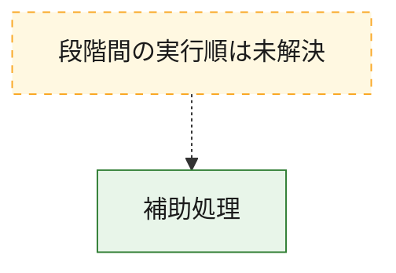
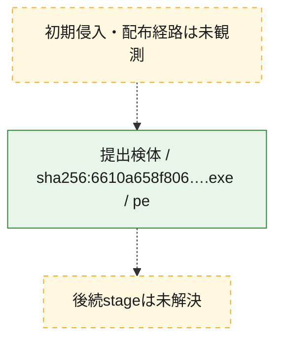
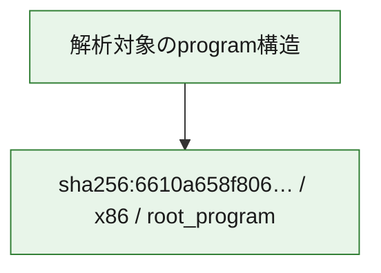

# 全体ロジック：6610a658f8064a9c5d238fe9fa376db2e409a302a8c4f52c0fd3577a727fbf23

代表関数から主要なmalware処理段階を自動分類できませんでした。

## 読み方

- phaseの掲載順は解析上の整理順です。observed_call_edgesがない段階間の実行順を断定しません。
- 図の実線は静的に観測した関係、点線と黄色のノードは未観測・未解決の関係を示します。
- 図は静的な要約であり、動的実行を再現するものではありません。
- 詳細な関数解説とfingerprintは[STATIC-LOGIC.md](STATIC-LOGIC.md)を参照してください。

## 静的可視化

### 実行フロー

### 感染チェーン

### モジュール関係

## 処理段階

### 1. 補助処理

主要処理を支える一般内部関数またはlibrary処理を確認します。
確度: `confirmed_static_function_evidence`

- `6610a658f8064a9c5d238fe9fa376db2e409a302a8c4f52c0fd3577a727fbf23:ghidra:00401000` — 検体内部の一般処理を実装する関数です。 状態: `succeeded`、選定理由: `context_representative`, `reviewed_call_centrality:9`
- `6610a658f8064a9c5d238fe9fa376db2e409a302a8c4f52c0fd3577a727fbf23:ghidra:00401260` — 検体内部の一般処理を実装する関数です。 状態: `succeeded`、選定理由: `context_representative`, `reviewed_call_centrality:3`
- `6610a658f8064a9c5d238fe9fa376db2e409a302a8c4f52c0fd3577a727fbf23:ghidra:004012e0` — 検体内部の一般処理を実装する関数です。 状態: `succeeded`、選定理由: `context_representative`, `reviewed_call_centrality:3`
- `6610a658f8064a9c5d238fe9fa376db2e409a302a8c4f52c0fd3577a727fbf23:ghidra:00401360` — 検体内部の一般処理を実装する関数です。 状態: `succeeded`、選定理由: `context_representative`, `reviewed_call_centrality:3`
- `6610a658f8064a9c5d238fe9fa376db2e409a302a8c4f52c0fd3577a727fbf23:ghidra:00401480` — 検体内部の一般処理を実装する関数です。 状態: `succeeded`、選定理由: `context_representative`, `reviewed_call_centrality:2`
- `6610a658f8064a9c5d238fe9fa376db2e409a302a8c4f52c0fd3577a727fbf23:ghidra:00401580` — 検体内部の一般処理を実装する関数です。 状態: `succeeded`、選定理由: `context_representative`, `reviewed_call_centrality:5`
- `6610a658f8064a9c5d238fe9fa376db2e409a302a8c4f52c0fd3577a727fbf23:ghidra:00401940` — 検体内部の一般処理を実装する関数です。 状態: `succeeded`、選定理由: `context_representative`, `reviewed_call_centrality:2`
- `6610a658f8064a9c5d238fe9fa376db2e409a302a8c4f52c0fd3577a727fbf23:ghidra:004019e0` — 検体内部の一般処理を実装する関数です。 状態: `succeeded`、選定理由: `context_representative`, `reviewed_call_centrality:2`
- `6610a658f8064a9c5d238fe9fa376db2e409a302a8c4f52c0fd3577a727fbf23:ghidra:00401a80` — 検体内部の一般処理を実装する関数です。 状態: `succeeded`、選定理由: `context_representative`, `reviewed_call_centrality:3`
- `6610a658f8064a9c5d238fe9fa376db2e409a302a8c4f52c0fd3577a727fbf23:ghidra:00401b60` — 検体内部の一般処理を実装する関数です。 状態: `succeeded`、選定理由: `context_representative`, `reviewed_call_centrality:2`
- `6610a658f8064a9c5d238fe9fa376db2e409a302a8c4f52c0fd3577a727fbf23:ghidra:00401cc0` — 検体内部の一般処理を実装する関数です。 状態: `succeeded`、選定理由: `context_representative`, `reviewed_call_centrality:2`
- `6610a658f8064a9c5d238fe9fa376db2e409a302a8c4f52c0fd3577a727fbf23:ghidra:00401d20` — 検体内部の一般処理を実装する関数です。 状態: `succeeded`、選定理由: `context_representative`, `reviewed_call_centrality:4`
- `6610a658f8064a9c5d238fe9fa376db2e409a302a8c4f52c0fd3577a727fbf23:ghidra:00401da0` — 検体内部の一般処理を実装する関数です。 状態: `succeeded`、選定理由: `context_representative`, `reviewed_call_centrality:5`
- `6610a658f8064a9c5d238fe9fa376db2e409a302a8c4f52c0fd3577a727fbf23:ghidra:00401e60` — 検体内部の一般処理を実装する関数です。 状態: `succeeded`、選定理由: `context_representative`, `reviewed_call_centrality:5`
- `6610a658f8064a9c5d238fe9fa376db2e409a302a8c4f52c0fd3577a727fbf23:ghidra:00401f60` — 検体内部の一般処理を実装する関数です。 状態: `succeeded`、選定理由: `context_representative`, `reviewed_call_centrality:8`
- `6610a658f8064a9c5d238fe9fa376db2e409a302a8c4f52c0fd3577a727fbf23:ghidra:004023e0` — 検体内部の一般処理を実装する関数です。 状態: `succeeded`、選定理由: `context_representative`, `reviewed_call_centrality:2`
- `6610a658f8064a9c5d238fe9fa376db2e409a302a8c4f52c0fd3577a727fbf23:ghidra:00402400` — 検体内部の一般処理を実装する関数です。 状態: `succeeded`、選定理由: `context_representative`, `reviewed_call_centrality:2`
- `6610a658f8064a9c5d238fe9fa376db2e409a302a8c4f52c0fd3577a727fbf23:ghidra:00402480` — 検体内部の一般処理を実装する関数です。 状態: `succeeded`、選定理由: `context_representative`, `reviewed_call_centrality:1`
- `6610a658f8064a9c5d238fe9fa376db2e409a302a8c4f52c0fd3577a727fbf23:ghidra:004024c0` — 検体内部の一般処理を実装する関数です。 状態: `succeeded`、選定理由: `context_representative`, `reviewed_call_centrality:1`
- `6610a658f8064a9c5d238fe9fa376db2e409a302a8c4f52c0fd3577a727fbf23:ghidra:00402500` — 検体内部の一般処理を実装する関数です。 状態: `succeeded`、選定理由: `context_representative`, `reviewed_call_centrality:1`
- `6610a658f8064a9c5d238fe9fa376db2e409a302a8c4f52c0fd3577a727fbf23:ghidra:00402540` — 検体内部の一般処理を実装する関数です。 状態: `succeeded`、選定理由: `context_representative`, `reviewed_call_centrality:3`
- `6610a658f8064a9c5d238fe9fa376db2e409a302a8c4f52c0fd3577a727fbf23:ghidra:004025a0` — 検体内部の一般処理を実装する関数です。 状態: `succeeded`、選定理由: `context_representative`, `reviewed_call_centrality:1`
- `6610a658f8064a9c5d238fe9fa376db2e409a302a8c4f52c0fd3577a727fbf23:ghidra:004025e0` — 検体内部の一般処理を実装する関数です。 状態: `succeeded`、選定理由: `context_representative`, `reviewed_call_centrality:1`
- `6610a658f8064a9c5d238fe9fa376db2e409a302a8c4f52c0fd3577a727fbf23:ghidra:00402620` — 検体内部の一般処理を実装する関数です。 状態: `succeeded`、選定理由: `context_representative`, `reviewed_call_centrality:3`
- `6610a658f8064a9c5d238fe9fa376db2e409a302a8c4f52c0fd3577a727fbf23:ghidra:00402680` — 検体内部の一般処理を実装する関数です。 状態: `succeeded`、選定理由: `context_representative`, `reviewed_call_centrality:2`
- `6610a658f8064a9c5d238fe9fa376db2e409a302a8c4f52c0fd3577a727fbf23:ghidra:00402700` — 検体内部の一般処理を実装する関数です。 状態: `succeeded`、選定理由: `context_representative`, `reviewed_call_centrality:3`
- `6610a658f8064a9c5d238fe9fa376db2e409a302a8c4f52c0fd3577a727fbf23:ghidra:00402920` — 検体内部の一般処理を実装する関数です。 状態: `succeeded`、選定理由: `context_representative`, `reviewed_call_centrality:5`
- `6610a658f8064a9c5d238fe9fa376db2e409a302a8c4f52c0fd3577a727fbf23:ghidra:00402e80` — 検体内部の一般処理を実装する関数です。 状態: `succeeded`、選定理由: `context_representative`, `reviewed_call_centrality:5`
- `6610a658f8064a9c5d238fe9fa376db2e409a302a8c4f52c0fd3577a727fbf23:ghidra:004033a0` — 検体内部の一般処理を実装する関数です。 状態: `succeeded`、選定理由: `context_representative`, `reviewed_call_centrality:5`
- `6610a658f8064a9c5d238fe9fa376db2e409a302a8c4f52c0fd3577a727fbf23:ghidra:00403940` — 検体内部の一般処理を実装する関数です。 状態: `succeeded`、選定理由: `context_representative`, `reviewed_call_centrality:5`
- `6610a658f8064a9c5d238fe9fa376db2e409a302a8c4f52c0fd3577a727fbf23:ghidra:00403f20` — 検体内部の一般処理を実装する関数です。 状態: `succeeded`、選定理由: `context_representative`, `reviewed_call_centrality:5`
- `6610a658f8064a9c5d238fe9fa376db2e409a302a8c4f52c0fd3577a727fbf23:ghidra:00404460` — 検体内部の一般処理を実装する関数です。 状態: `succeeded`、選定理由: `context_representative`, `reviewed_call_centrality:5`

## 観測したcall関係

- `6610a658f8064a9c5d238fe9fa376db2e409a302a8c4f52c0fd3577a727fbf23:ghidra:00402540` → `6610a658f8064a9c5d238fe9fa376db2e409a302a8c4f52c0fd3577a727fbf23:ghidra:00401d20` （`support` → `support`）
- `6610a658f8064a9c5d238fe9fa376db2e409a302a8c4f52c0fd3577a727fbf23:ghidra:00402620` → `6610a658f8064a9c5d238fe9fa376db2e409a302a8c4f52c0fd3577a727fbf23:ghidra:00401da0` （`support` → `support`）
- `6610a658f8064a9c5d238fe9fa376db2e409a302a8c4f52c0fd3577a727fbf23:ghidra:00402700` → `6610a658f8064a9c5d238fe9fa376db2e409a302a8c4f52c0fd3577a727fbf23:ghidra:00401e60` （`support` → `support`）
- `ghidra-function:0a9e7f2378f87ccbcd198eb7` → `ghidra-function:f4f0d259513df4530cf657d8` （`unclassified` → `unclassified`）
- `ghidra-function:15f6d7aaed0ad285bed7997f` → `ghidra-function:4348ccd3643910843d13b752` （`unclassified` → `unclassified`）
- `ghidra-function:15f6d7aaed0ad285bed7997f` → `ghidra-function:f4f0d259513df4530cf657d8` （`unclassified` → `unclassified`）
- `ghidra-function:1e506dd0ba065310441c03a3` → `ghidra-external:ef6820d44b4a7d72a7ac06ca` （`unclassified` → `unclassified`）
- `ghidra-function:1e506dd0ba065310441c03a3` → `ghidra-function:f4f0d259513df4530cf657d8` （`unclassified` → `unclassified`）
- `ghidra-function:20b58bb239c5cc2e94461d59` → `ghidra-external:49958f3a5bd13fec120a6430` （`unclassified` → `unclassified`）
- `ghidra-function:20b58bb239c5cc2e94461d59` → `ghidra-external:c29039a2d79131c8ec7c9e49` （`unclassified` → `unclassified`）
- `ghidra-function:20b58bb239c5cc2e94461d59` → `ghidra-function:4a83282cd225aa32ae5173db` （`unclassified` → `unclassified`）
- `ghidra-function:20b58bb239c5cc2e94461d59` → `ghidra-function:51057115cd6a01a37d123a7d` （`unclassified` → `unclassified`）
- `ghidra-function:20b58bb239c5cc2e94461d59` → `ghidra-function:f6230d352c67fb60ce04609b` （`unclassified` → `unclassified`）
- `ghidra-function:2704575aa282f6c88ca68bd1` → `ghidra-external:88ff0dab8c2962baacab646e` （`unclassified` → `unclassified`）
- `ghidra-function:2704575aa282f6c88ca68bd1` → `ghidra-external:e8718c90be8c3345ef408e5f` （`unclassified` → `unclassified`）
- `ghidra-function:2704575aa282f6c88ca68bd1` → `ghidra-external:ef6820d44b4a7d72a7ac06ca` （`unclassified` → `unclassified`）
- `ghidra-function:33f5b909ebd8a803ee85693c` → `ghidra-function:f4f0d259513df4530cf657d8` （`unclassified` → `unclassified`）
- `ghidra-function:3860bd72baf9d1efc318536b` → `ghidra-external:88ff0dab8c2962baacab646e` （`unclassified` → `unclassified`）
- `ghidra-function:3860bd72baf9d1efc318536b` → `ghidra-external:ef6820d44b4a7d72a7ac06ca` （`unclassified` → `unclassified`）
- `ghidra-function:3860bd72baf9d1efc318536b` → `ghidra-function:4348ccd3643910843d13b752` （`unclassified` → `unclassified`）
- `ghidra-function:3ba75f7306c7f4162036cd2d` → `ghidra-external:49958f3a5bd13fec120a6430` （`unclassified` → `unclassified`）
- `ghidra-function:3ba75f7306c7f4162036cd2d` → `ghidra-external:c29039a2d79131c8ec7c9e49` （`unclassified` → `unclassified`）
- `ghidra-function:3ba75f7306c7f4162036cd2d` → `ghidra-function:4a83282cd225aa32ae5173db` （`unclassified` → `unclassified`）
- `ghidra-function:3ba75f7306c7f4162036cd2d` → `ghidra-function:51057115cd6a01a37d123a7d` （`unclassified` → `unclassified`）
- `ghidra-function:3ba75f7306c7f4162036cd2d` → `ghidra-function:f6230d352c67fb60ce04609b` （`unclassified` → `unclassified`）
- `ghidra-function:4923638d71301a9bf10b3231` → `ghidra-external:49958f3a5bd13fec120a6430` （`unclassified` → `unclassified`）
- `ghidra-function:4923638d71301a9bf10b3231` → `ghidra-external:c29039a2d79131c8ec7c9e49` （`unclassified` → `unclassified`）
- `ghidra-function:4923638d71301a9bf10b3231` → `ghidra-function:4a83282cd225aa32ae5173db` （`unclassified` → `unclassified`）
- `ghidra-function:4923638d71301a9bf10b3231` → `ghidra-function:51057115cd6a01a37d123a7d` （`unclassified` → `unclassified`）
- `ghidra-function:4923638d71301a9bf10b3231` → `ghidra-function:f6230d352c67fb60ce04609b` （`unclassified` → `unclassified`）
- `ghidra-function:53cd86ee2901a947834e8a31` → `ghidra-external:b62c5b2992584f958112eae2` （`unclassified` → `unclassified`）
- `ghidra-function:53cd86ee2901a947834e8a31` → `ghidra-external:c29039a2d79131c8ec7c9e49` （`unclassified` → `unclassified`）
- `ghidra-function:53cd86ee2901a947834e8a31` → `ghidra-function:4348ccd3643910843d13b752` （`unclassified` → `unclassified`）
- `ghidra-function:53cd86ee2901a947834e8a31` → `ghidra-function:6ebead156d02f3b5c4d4c485` （`unclassified` → `unclassified`）
- `ghidra-function:5fc394ab386906e084d4c773` → `ghidra-external:49958f3a5bd13fec120a6430` （`unclassified` → `unclassified`）
- `ghidra-function:5fc394ab386906e084d4c773` → `ghidra-external:c29039a2d79131c8ec7c9e49` （`unclassified` → `unclassified`）
- `ghidra-function:5fc394ab386906e084d4c773` → `ghidra-function:4a83282cd225aa32ae5173db` （`unclassified` → `unclassified`）
- `ghidra-function:5fc394ab386906e084d4c773` → `ghidra-function:51057115cd6a01a37d123a7d` （`unclassified` → `unclassified`）
- `ghidra-function:5fc394ab386906e084d4c773` → `ghidra-function:f6230d352c67fb60ce04609b` （`unclassified` → `unclassified`）
- `ghidra-function:6569605016d89bd055b2e53b` → `ghidra-external:c29039a2d79131c8ec7c9e49` （`unclassified` → `unclassified`）
- `ghidra-function:6569605016d89bd055b2e53b` → `ghidra-function:53cd86ee2901a947834e8a31` （`unclassified` → `unclassified`）
- `ghidra-function:6569605016d89bd055b2e53b` → `ghidra-function:f4f0d259513df4530cf657d8` （`unclassified` → `unclassified`）
- `ghidra-function:7222c45adb837b11f0174ebd` → `ghidra-external:88ff0dab8c2962baacab646e` （`unclassified` → `unclassified`）
- `ghidra-function:7222c45adb837b11f0174ebd` → `ghidra-external:89ed91097186bdbab9389f21` （`unclassified` → `unclassified`）
- `ghidra-function:7222c45adb837b11f0174ebd` → `ghidra-function:4348ccd3643910843d13b752` （`unclassified` → `unclassified`）
- `ghidra-function:72a51710523fa88ee5cbeb44` → `ghidra-external:88ff0dab8c2962baacab646e` （`unclassified` → `unclassified`）
- `ghidra-function:72a51710523fa88ee5cbeb44` → `ghidra-function:4348ccd3643910843d13b752` （`unclassified` → `unclassified`）
- `ghidra-function:7e7b127e3c12710408e6234c` → `ghidra-external:49958f3a5bd13fec120a6430` （`unclassified` → `unclassified`）
- `ghidra-function:7e7b127e3c12710408e6234c` → `ghidra-external:c29039a2d79131c8ec7c9e49` （`unclassified` → `unclassified`）
- `ghidra-function:7e7b127e3c12710408e6234c` → `ghidra-function:4a83282cd225aa32ae5173db` （`unclassified` → `unclassified`）
- `ghidra-function:7e7b127e3c12710408e6234c` → `ghidra-function:51057115cd6a01a37d123a7d` （`unclassified` → `unclassified`）
- `ghidra-function:7e7b127e3c12710408e6234c` → `ghidra-function:f6230d352c67fb60ce04609b` （`unclassified` → `unclassified`）
- `ghidra-function:8070e6641ca15fe9c8d3228c` → `ghidra-external:49958f3a5bd13fec120a6430` （`unclassified` → `unclassified`）
- `ghidra-function:8070e6641ca15fe9c8d3228c` → `ghidra-external:c29039a2d79131c8ec7c9e49` （`unclassified` → `unclassified`）
- `ghidra-function:8070e6641ca15fe9c8d3228c` → `ghidra-function:4a83282cd225aa32ae5173db` （`unclassified` → `unclassified`）
- `ghidra-function:8070e6641ca15fe9c8d3228c` → `ghidra-function:51057115cd6a01a37d123a7d` （`unclassified` → `unclassified`）
- `ghidra-function:8070e6641ca15fe9c8d3228c` → `ghidra-function:f6230d352c67fb60ce04609b` （`unclassified` → `unclassified`）
- `ghidra-function:8220f306e4a0e4e8356f11e6` → `ghidra-external:88ff0dab8c2962baacab646e` （`unclassified` → `unclassified`）
- `ghidra-function:8220f306e4a0e4e8356f11e6` → `ghidra-external:ef6820d44b4a7d72a7ac06ca` （`unclassified` → `unclassified`）
- `ghidra-function:8a0ccae8d3b80754cd83eb5b` → `ghidra-external:c29039a2d79131c8ec7c9e49` （`unclassified` → `unclassified`）
- `ghidra-function:8a0ccae8d3b80754cd83eb5b` → `ghidra-external:cf8271a7f7e39d476d3ca2bd` （`unclassified` → `unclassified`）
- `ghidra-function:8a0ccae8d3b80754cd83eb5b` → `ghidra-function:06a3bb17b70d4965ba82e6d0` （`unclassified` → `unclassified`）
- `ghidra-function:8a0ccae8d3b80754cd83eb5b` → `ghidra-function:233c3bccb4c34ac3f3b8011c` （`unclassified` → `unclassified`）
- `ghidra-function:8a0ccae8d3b80754cd83eb5b` → `ghidra-function:2e65a764073c7892d8e2df3f` （`unclassified` → `unclassified`）
- `ghidra-function:8a0ccae8d3b80754cd83eb5b` → `ghidra-function:47ebcbcf01e3b9a5a4dda482` （`unclassified` → `unclassified`）
- `ghidra-function:8a0ccae8d3b80754cd83eb5b` → `ghidra-function:4bd5c872ba70a90ed2746d9c` （`unclassified` → `unclassified`）
- `ghidra-function:8a0ccae8d3b80754cd83eb5b` → `ghidra-function:5fb9607f4c8370b99c21c7fd` （`unclassified` → `unclassified`）
- `ghidra-function:8a0ccae8d3b80754cd83eb5b` → `ghidra-function:f7c35a7433996817bbf08f28` （`unclassified` → `unclassified`）
- `ghidra-function:8cd99a4ee49cec7753b40d8e` → `ghidra-external:c29039a2d79131c8ec7c9e49` （`unclassified` → `unclassified`）
- `ghidra-function:8cd99a4ee49cec7753b40d8e` → `ghidra-function:7222c45adb837b11f0174ebd` （`unclassified` → `unclassified`）
- `ghidra-function:8cd99a4ee49cec7753b40d8e` → `ghidra-function:f4f0d259513df4530cf657d8` （`unclassified` → `unclassified`）
- `ghidra-function:9868124a680db7003398d9f0` → `ghidra-external:c29039a2d79131c8ec7c9e49` （`unclassified` → `unclassified`）
- `ghidra-function:9868124a680db7003398d9f0` → `ghidra-external:ef6820d44b4a7d72a7ac06ca` （`unclassified` → `unclassified`）
- `ghidra-function:9868124a680db7003398d9f0` → `ghidra-function:51057115cd6a01a37d123a7d` （`unclassified` → `unclassified`）
- `ghidra-function:a15bc135f1faf9975e53df0a` → `ghidra-function:f4f0d259513df4530cf657d8` （`unclassified` → `unclassified`）
- `ghidra-function:a23db39980f842b141430b6e` → `ghidra-function:f4f0d259513df4530cf657d8` （`unclassified` → `unclassified`）
- `ghidra-function:a8408badb5b6156b417ecb40` → `ghidra-external:c29039a2d79131c8ec7c9e49` （`unclassified` → `unclassified`）
- `ghidra-function:a8408badb5b6156b417ecb40` → `ghidra-external:d9d49c34869eda3410ac8aed` （`unclassified` → `unclassified`）
- `ghidra-function:ab7ec6318b82f286a6236e99` → `ghidra-external:c29039a2d79131c8ec7c9e49` （`unclassified` → `unclassified`）
- `ghidra-function:ab7ec6318b82f286a6236e99` → `ghidra-function:88c9d8b67ab203cb2c650024` （`unclassified` → `unclassified`）
- `ghidra-function:aeb06f8e97d8d722c88fb6e0` → `ghidra-external:88ff0dab8c2962baacab646e` （`unclassified` → `unclassified`）
- `ghidra-function:aeb06f8e97d8d722c88fb6e0` → `ghidra-external:e8718c90be8c3345ef408e5f` （`unclassified` → `unclassified`）
- `ghidra-function:afaee17f63d3dc84e2bf0e62` → `ghidra-external:1930a015345a6c3913929682` （`unclassified` → `unclassified`）
- `ghidra-function:afaee17f63d3dc84e2bf0e62` → `ghidra-external:ba478474afd4681c7682e971` （`unclassified` → `unclassified`）
- `ghidra-function:afaee17f63d3dc84e2bf0e62` → `ghidra-external:c29039a2d79131c8ec7c9e49` （`unclassified` → `unclassified`）
- `ghidra-function:afaee17f63d3dc84e2bf0e62` → `ghidra-external:ef6820d44b4a7d72a7ac06ca` （`unclassified` → `unclassified`）
- `ghidra-function:afaee17f63d3dc84e2bf0e62` → `ghidra-function:51057115cd6a01a37d123a7d` （`unclassified` → `unclassified`）
- `ghidra-function:afaee17f63d3dc84e2bf0e62` → `ghidra-function:5c72aa7664efc4461bde0db6` （`unclassified` → `unclassified`）
- `ghidra-function:afaee17f63d3dc84e2bf0e62` → `ghidra-function:a6f4dca8e68bc2835bdf8f4f` （`unclassified` → `unclassified`）
- `ghidra-function:afaee17f63d3dc84e2bf0e62` → `ghidra-function:ae6c09013108214dccbca477` （`unclassified` → `unclassified`）
- `ghidra-function:b425b079ff7410a286833667` → `ghidra-external:49958f3a5bd13fec120a6430` （`unclassified` → `unclassified`）
- `ghidra-function:b425b079ff7410a286833667` → `ghidra-external:c29039a2d79131c8ec7c9e49` （`unclassified` → `unclassified`）
- `ghidra-function:b425b079ff7410a286833667` → `ghidra-function:4a83282cd225aa32ae5173db` （`unclassified` → `unclassified`）
- `ghidra-function:b425b079ff7410a286833667` → `ghidra-function:51057115cd6a01a37d123a7d` （`unclassified` → `unclassified`）
- `ghidra-function:b425b079ff7410a286833667` → `ghidra-function:f6230d352c67fb60ce04609b` （`unclassified` → `unclassified`）
- `ghidra-function:c1cb121fc0a05607a26c5fe4` → `ghidra-function:f4f0d259513df4530cf657d8` （`unclassified` → `unclassified`）
- `ghidra-function:cbbbefa0953428d850416f6c` → `ghidra-external:88ff0dab8c2962baacab646e` （`unclassified` → `unclassified`）
- `ghidra-function:cbbbefa0953428d850416f6c` → `ghidra-external:ef6820d44b4a7d72a7ac06ca` （`unclassified` → `unclassified`）
- `ghidra-function:d130e6cffa3943ec9da78713` → `ghidra-external:c29039a2d79131c8ec7c9e49` （`unclassified` → `unclassified`）
- `ghidra-function:d130e6cffa3943ec9da78713` → `ghidra-function:4348ccd3643910843d13b752` （`unclassified` → `unclassified`）
- `ghidra-function:d130e6cffa3943ec9da78713` → `ghidra-function:537e156324eb0ed7fe20caa4` （`unclassified` → `unclassified`）
- `ghidra-function:d130e6cffa3943ec9da78713` → `ghidra-function:6ebead156d02f3b5c4d4c485` （`unclassified` → `unclassified`）
- `ghidra-function:f11230090b90285c87f5f607` → `ghidra-external:c29039a2d79131c8ec7c9e49` （`unclassified` → `unclassified`）
- `ghidra-function:f11230090b90285c87f5f607` → `ghidra-function:d130e6cffa3943ec9da78713` （`unclassified` → `unclassified`）
- `ghidra-function:f11230090b90285c87f5f607` → `ghidra-function:f4f0d259513df4530cf657d8` （`unclassified` → `unclassified`）
- `ghidra-function:f4cd1e27ee5d27023de44558` → `ghidra-external:88ff0dab8c2962baacab646e` （`unclassified` → `unclassified`）
- `ghidra-function:f4cd1e27ee5d27023de44558` → `ghidra-external:ef6820d44b4a7d72a7ac06ca` （`unclassified` → `unclassified`）
- `ghidra-function:f4cd1e27ee5d27023de44558` → `ghidra-function:4348ccd3643910843d13b752` （`unclassified` → `unclassified`）

## 解析範囲と制約

- 選定外関数は全体inventoryへ残しますが、関数本体の個別解説対象にはしていません。
- indirect call、難読化、packer、VM、壊れたcontrol flowによりcall関係が欠落する場合があります。
- 文書は静的解析に基づき、検体実行や外部通信による動的確認は行っていません。
